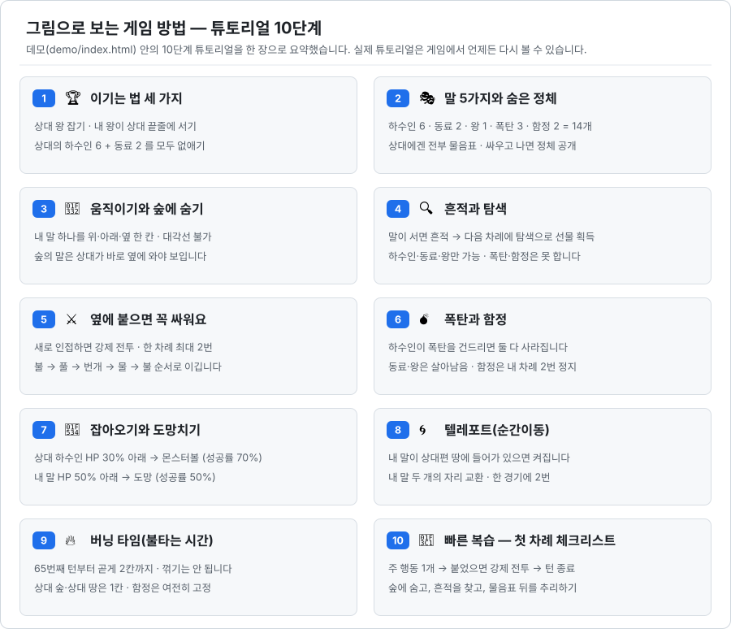
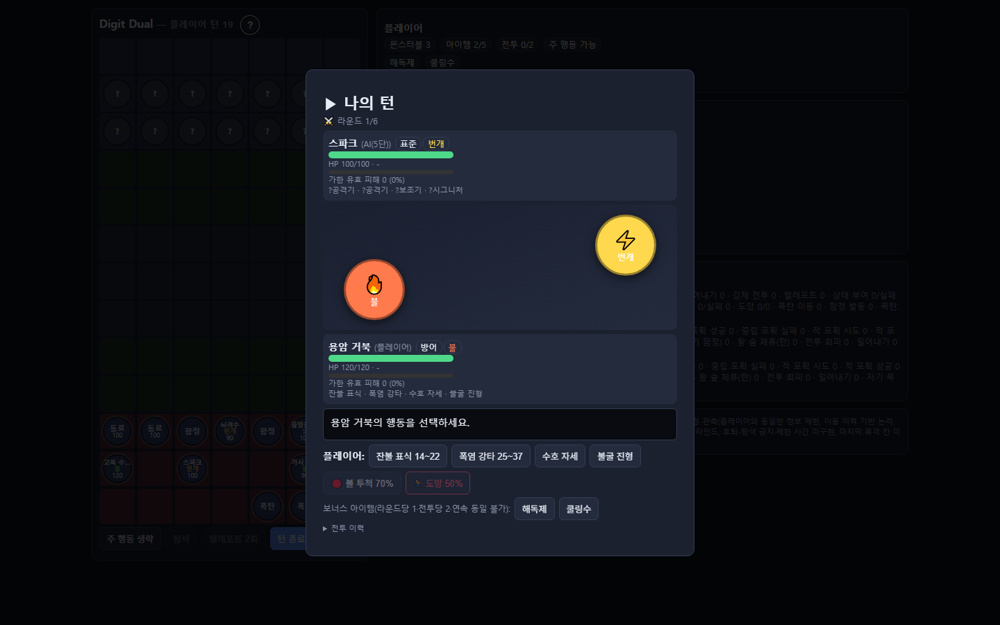

# Digit Dual (Digit-Duel)

**상대의 말이 전부 물음표로만 보이는 1대1 턴제 전략 보드게임.** 정체를 숨긴 말 14개를 비공개로 배치하고, 서로 붙는 순간 시작되는 속성 상성 전투로 판을 뒤집습니다.

## 30초 요약

체스처럼 말을 움직이지만, 상대 말의 정체는 보이지 않습니다. 정체가 드러나는 유일한 계기는 전투이고, 한 번 붙으면 전투는 피할 수 없습니다. 그래서 이 게임에서 다투는 진짜 자원은 위치가 아니라 **정보**입니다.

- **판** — 7열 × 13행. 위·아래 3줄씩이 각자의 진영이고, 가운데에는 몸을 숨길 수 있는 **숲**이 흩어져 있습니다.
- **말** — 플레이어당 14개(하수인 6 · 동료 2 · 왕 1 · 폭탄 3 · 함정 2). 경기 시작 전 자기 진영에 비공개로 배치하며, 상대 화면에는 종류가 드러나지 않습니다.
- **한 턴** — 주 행동 1개(이동 · 탐색 · 텔레포트) → 새로 인접해진 적과의 **강제 전투**(한 턴 최대 2회) → 턴 종료.
- **전투** — 불 → 풀 → 번개 → 물 → 불 상성으로 주고받습니다. 전투를 치른 말은 정체가 공개되고, 깎인 HP와 기술 쿨타임은 전투가 끝나도 남습니다.
- **이기는 길 세 가지** — 상대 왕 제거 · 내 왕이 상대편 맨 끝줄 도달 · 상대의 싸우는 말(하수인 6 + 동료 2) 전멸.

이 저장소에는 기획 검증용 **HTML 프로토타입 데모**(`demo/index.html`)와 온라인 대전용 **릴레이 서버**(`server/`)가 들어 있습니다. 릴레이(relay) 서버는 두 사람의 메시지를 그대로 전달만 하는 중계기로, 게임 내용을 해석하거나 승패를 판정하지 않습니다. 최종 타깃은 Android / Unity 클라이언트이며, Unity 포팅은 v0.5.0부터 시작합니다.

---

## 그림으로 보는 게임 방법

데모를 처음 실행하면 10단계 튜토리얼이 자동으로 열립니다. 아래 그림은 그 10단계를 한 장으로 압축한 것으로, 게임을 켜기 전에 규칙의 뼈대를 훑어보는 용도입니다. 각 단계의 자세한 그림과 예시는 데모 안의 튜토리얼에서 볼 수 있습니다.



<details>
<summary><b>10단계를 글로 읽기</b> — 위 그림과 같은 내용을 문장으로</summary>

1. **🏆 이기는 법 세 가지** — 상대 **왕**을 잡거나, 내 **왕**이 상대편 **맨 끝줄**에 서거나, 상대의 싸우는 말(하수인 6 + 동료 2)을 모두 없애면 이깁니다.
2. **🎭 말 5가지와 숨은 정체** — 내 말은 하수인 6 · 동료 2 · 왕 1 · 폭탄 3 · 함정 2, 모두 14개입니다. 상대에게 내 말은 전부 물음표로 보이고, 한 번 싸우고 나면 그 말의 정체가 드러납니다.
3. **🌲 움직이기와 숲에 숨기** — 내 차례에 말 하나를 위·아래·옆으로 한 칸 움직입니다(대각선 불가). 숲에 있는 말은 상대가 바로 옆에 올 때만 보이고, 떨어지면 다시 숨습니다. 숨은 말이 있는 칸으로 가면 부딪혀 그 앞 칸에 멈추고, 그 차례 동안 둘 다 보입니다.
4. **🔍 흔적과 탐색** — 숲 어딘가에 선물이 숨어 있습니다. 말이 그 칸에 서면 흔적이 뜨고, 그 말로 **다음 차례**에 탐색을 누르면 선물(몬스터볼 · 회복약 같은 아이템 · 다음 싸움 힘 버프 · 공용 하수인)을 받습니다. 탐색은 하수인·동료·왕만 할 수 있습니다.
5. **⚔️ 옆에 붙으면 꼭 싸워요** — 움직여서 상대 말 바로 옆에 **새로** 붙으면 전투를 피할 수 없습니다(강제 전투, 한 차례 최대 2번). 전투는 불 → 풀 → 번개 → 물 → 불 순서의 속성 가위바위보입니다.
6. **💣 폭탄과 함정** — 폭탄은 한 칸씩 움직이고 함정은 놓은 자리에 고정입니다. 하수인이 폭탄을 건드리면 둘 다 사라지고, 동료·왕은 살아남습니다. 함정을 건드리면 함정은 사라지고 밟은 말은 내 차례 2번 동안 못 움직입니다.
7. **🔴 잡아오기와 도망치기** — 전투 중 상대 하수인의 HP가 30% 아래면 몬스터볼을 던질 수 있고(성공률 70%), 내 말의 HP가 50% 아래면 도망칠 수 있습니다(성공률 50%). 도망에 실패하면 상대가 바로 한 번 더 때립니다.
8. **🌀 텔레포트(순간이동)** — 내 말이 상대편 진영 3줄 안에 들어가 있는 동안, 내 말 두 개의 자리를 서로 바꿀 수 있습니다. 한 경기에 2번까지이며, 자리를 바꾼 두 말이 각각 상대와 새로 인접하면 따로따로 싸웁니다.
9. **🔥 버닝 타임(불타는 시간)** — 65번째 턴부터 말이 곧게 2칸까지 움직입니다(꺾기 불가). 상대편 숲이나 상대편 땅에 있거나, 들어가거나, 지나갈 때는 그대로 1칸이고 함정은 계속 고정입니다.
10. **🏁 빠른 복습** — 내 차례는 **주 행동 1개(이동·탐색·텔레포트) → 새로 붙은 상대와 강제 전투 → 턴 종료** 순서입니다. 숲에 숨고, 흔적을 찾고, 물음표 뒤를 추리하는 것이 이 게임의 핵심입니다.

</details>

---

## 화면

### 플레이 화면 (PVE · 1440×900)

내 말은 종류·속성·HP까지 보이고 상대 말은 물음표로만 보입니다. 왼쪽은 보드, 오른쪽은 상태 패널 · 로그 · 지표 패널입니다.


### 전투 화면 (PVE · 1440×900)

속성·HP·기술 공개 상태를 비교하면서 행동을 고릅니다. 라운드, 양측 전투원, 속성 상성, 기술·아이템·포획·도망 조건을 한 화면에서 확인할 수 있습니다.



### 튜토리얼 (10단계 · 1440×900)

첫 실행 때 한 번 자동으로 열리고, 이후에는 제목 옆 `?` 버튼이나 메뉴의 [📖 튜토리얼 다시 보기]로 언제든 다시 볼 수 있습니다.


---

## 바로 해보기 — 오프라인

설치도, 서버도, 인터넷 연결도 필요 없습니다.

1. 이 저장소를 내려받습니다.
2. `demo/index.html`을 브라우저로 엽니다.
3. 메뉴에서 모드를 고릅니다.
   - **PVE** — `5급(기본 AI)` 또는 `5단(탐색·추론 기반 강AI)`
   - **PVP (핫시트 2인)** — 한 기기에서 두 사람이 번갈아 플레이
   - **AI vs AI 관전** — 메뉴 아래 작은 링크
4. 로스터 6종을 고르고 말 14개를 배치한 뒤 [배치 완료]를 누르면 시작됩니다. ([무작위 배치]로 한 번에 채울 수도 있습니다.)

## 온라인으로 대전하기

온라인 대전에는 서버가 켜지면서 알려주는 두 가지가 필요합니다.

- **접속 주소** — 두 사람이 브라우저로 열 `http://...` 주소.
- **접속 코드** — 서버를 켤 때마다 새로 만들어지는 일회성 암호. 아는 사람끼리만 매칭되게 하는 장치입니다.

**매칭은 다음 세 가지가 모두 맞을 때만 성사됩니다.** ① 두 클라이언트가 **같은 릴레이 서버**에 접속하고, ② **같은 접속 코드**를 입력하고, ③ **양쪽 모두 로스터 선택과 배치를 끝내** 매칭 큐에 들어갈 것. 하나라도 어긋나면 매칭되지 않습니다. 특히 클라이언트 하나(탭 하나)만으로는 상대가 없어 대기 상태에서 멈춥니다 — 어떤 경우에도 상대 자리를 채울 두 번째 클라이언트가 필요합니다.

아래 두 절은 목적이 다릅니다. 첫 번째는 **한 PC 안에서 기능이 도는지 확인하는 점검**이고, 두 번째가 **사람 두 명이 실제로 겨루는 대전**입니다.

### ① 온라인 PVP 기능 테스트 — 한 PC에서 혼자 확인하기 (실제 대전 아님)

플레이어 A와 B를 **같은 PC의 브라우저 탭(또는 창) 두 개**가 나눠 맡습니다. 서버 기동 · 접속 코드 · 매칭 · 동기화가 제대로 도는지 확인하는 용도이며, 다른 사람과 겨루는 대전이 아닙니다.

1. `server/서버시작.bat`을 더블클릭합니다. (이 PC 전용 실행기입니다.)
2. 화면에 나온 `http://127.0.0.1:8080`을 브라우저에서 엽니다.
3. **같은 PC에서 탭(또는 창)을 하나 더 열어** 같은 주소로 접속합니다. 이 두 탭이 각각 플레이어 A와 B가 됩니다.
4. 두 탭 모두 [접속 코드]에 같은 코드를 입력하고 [🌐 온라인 PVP]를 선택합니다.
5. 두 탭 **모두** 배치를 완료하면 서로 매칭되어 대전 화면으로 넘어갑니다. 한쪽만 완료하면 그 탭은 상대를 기다리며 대기합니다.

> **`127.0.0.1`은 "지금 이 기기 자신"을 뜻하는 주소입니다.** 어느 PC에서 입력하든 그 PC 자신을 가리키기 때문에, 다른 PC에게 이 주소와 접속 코드를 알려줘도 그 PC는 이 서버에 닿을 수 없습니다. 다른 PC와 실제로 대전하려면 아래 ②로 가세요.

### ② 실제 대전 — 같은 공유기에 연결된 두 PC

두 사람이 **각자의 PC**에서 겨루는, 사람 대 사람 대전입니다. 두 PC가 같은 공유기(같은 내부망)에 붙어 있어야 합니다.

1. 서버 PC에서 `server/LAN서버시작.bat`을 더블클릭합니다. 터미널 명령이나 환경 변수 설정은 필요 없습니다.

   창 제목과 첫 줄 배너에 `LAN`이라고 표시되면 LAN 모드로 켜진 것입니다. LAN 공개는 **이 창이 켜져 있는 동안만** 유효하고, 창을 닫으면 다음 실행은 다시 이 PC 전용으로 돌아갑니다. (이 PC 전용으로 켜려면 같은 폴더의 `서버시작.bat`을 씁니다 — 모드는 어떤 파일을 더블클릭하느냐로 정해집니다.)

2. 서버 화면에 표시된 두 가지를 상대에게 전달합니다.
   - 내부망 접속 주소: `http://192.168.x.x:8080` — `127.0.0.1`이 아니라 **서버 PC를 가리키는 내부망 주소**여야 상대 PC가 닿을 수 있습니다.
   - 이번 실행의 접속 코드
3. 두 사람 모두 전달받은 내부망 주소를 브라우저에서 엽니다. (서버를 켠 PC도 이 내부망 주소를 그대로 쓰면 됩니다.)
4. [접속 코드] 칸에 같은 코드를 입력하고 [🌐 온라인 PVP]를 선택합니다.
5. 각자 배치를 완료합니다. 먼저 끝낸 사람은 대기하고, 두 번째 사람이 배치를 마치는 순간 자동으로 매칭됩니다.

서버를 다시 실행하면 코드도 새로 바뀝니다. 재시작했다면 두 사람 모두 새 코드를 입력해야 합니다.

### 이 서버가 하지 않는 것

이 서버는 같은 공유기 안에서 아는 사람과 대전하는 용도입니다. 인터넷 너머의 원격 접속용이 아닙니다.

- 기본 실행은 `127.0.0.1` 전용입니다. LAN 공개는 명시적으로 골라야만 켜지고, 그때도 같은 공유기의 사설 IP만 허용하며 공인 IP와 도메인은 거부합니다.
- 온라인 대전은 서버가 제공한 `http://...` 주소로 열어야 합니다. `demo/index.html`을 `file://`로 직접 열면 서버가 접속을 거부합니다.
- 접속 코드는 브라우저 저장소·URL·쿼리·쿠키·게임 로그에 저장되지 않습니다. 서버를 켠 터미널에 운영자 전달용으로 한 번 표시되고, 입력한 코드는 WebSocket 연결을 맺을 때 하위 프로토콜 헤더로만 전송됩니다.
- 서버와 실행기(`서버시작.bat` · `LAN서버시작.bat`)는 포트포워딩·터널·Windows 방화벽 규칙·브라우저 설정을 자동으로 만들거나 바꾸지 않습니다.
- `ws://` 통신은 암호화되지 않습니다. 신뢰할 수 없는 네트워크에서는 사용하지 마세요.
- 접속 코드는 우연한 접속과 단순 무작위 대입을 막는 장치이며, 게임 데이터 조작을 막는 치팅 방지 시스템은 아닙니다.

서버 설정과 상세 위협 모델은 [`server/README.md`](server/README.md)를 참고하세요.

---

## 규칙 더 알아보기

### 정보를 다루는 규칙

- **정체 공개** — 전투를 치른 말만 정체가 공개됩니다. 그전까지는 이동 이력과 위치만으로 상대의 말을 추리해야 합니다.
- **숲과 은신** — 숲에 있는 말은 상대가 바로 옆에 와야 보입니다.
- **흔적과 탐색** — 흔적이 있는 칸에서 탐색하면 볼·아이템·버프·공용 하수인을 얻습니다.
- **추측 메모** — 상대의 물음표 말에 8종 이모지로 추측을 남길 수 있습니다. 메모는 남긴 사람에게만 보이며 상대·AI·로그에 노출되지 않습니다.

### 전투와 성장 요소

| 요소 | 내용 |
| --- | --- |
| 속성 상성 | 불 → 풀 → 번개 → 물 → 불 (유리 ×1.3 / 불리 ×0.75) |
| 하수인 로스터 | 20종 = 속성 4종 × 아키타입 5종(표준·공격·방어·속공·지속). 경기마다 6종을 고릅니다 |
| 기술 4슬롯 | 속성 공격기 2 + 공용 보조기 1 + 아키타입 시그니처 1. 쿨타임과 HP는 전투가 끝나도 유지됩니다 |
| 상태이상 | 화상 · 약화 · 감전 (전투 종료 시 해제) |
| 포획과 도망 | 상대 하수인 HP 30% 미만이면 볼 투척(성공률 70%), 내 말 HP 50% 미만이면 도망(성공률 50%) |
| 텔레포트 | 내 말이 상대 진영에 들어가 있는 동안 내 말 두 개의 자리를 교환. 경기당 2회 |
| 버닝 타임 | 65턴부터 직선 2칸 이동 강화 (상대 진영·상대 숲은 1칸 유지, 함정은 고정) |

### 대전 상대와 동기화

- **모드 4종** — PVE(5급 / 5단), PVP 핫시트 2인, 온라인 PVP, AI vs AI 관전(숨은 링크).
- **공정 관측 AI** — AI는 플레이어와 동일한 정보 제한 아래에서만 판단합니다. 전체 정보 접근(치팅)은 하지 않고, 공개 관측과 이동 이력에 근거한 논리 추론만 사용합니다. 5단은 상대의 최선 응수까지 평가하는 제한 탐색 AI입니다.
- **온라인 동기화** — 서버는 게임 내용을 해석하지 않는 비권위 릴레이이고, 양측은 같은 난수 시드로 같은 계산을 각자 돌려 화면을 맞추는 **공유 시드 락스텝** 방식으로 동기화합니다.
- **사전 배치 후 자동 매칭** — 상대를 기다리지 않고 로스터 선택과 비공개 배치를 먼저 끝낸 뒤 매칭 큐에 들어갑니다. 상대가 준비되면 즉시 대전이 시작됩니다.
- **서버 주소 기억** — 메뉴에서 접속지를 직접 지정하면 다음 실행 때 기억합니다. 기억되는 것은 주소뿐이며 접속 코드는 저장하지 않습니다.
- **지표 패널** — 전투·강제 전투·탐색·포획·도망·텔레포트 등을 합산과 플레이어별로 실시간 집계합니다 (GDD-12 연동 스캐폴드).

데모의 수치 상수는 승인 전 임시값입니다. 밸런싱 조정은 보류 백로그로 관리하며, 기획에 없는 내용은 임의로 구현하지 않고 `[기획 필요]`로 보고합니다. 규칙·수치의 진실 원본은 Notion 기준 문서이고, 저장소 규약과 부서별 작업 계약은 [`CLAUDE.md`](CLAUDE.md)에 정리되어 있습니다.

---

## 기여자용 — 저장소 구조

```
demo/
  index.html          HTML 프로토타입 데모 (단일 파일 · 브라우저로 열면 실행)
  test/               Node 헤드리스 회귀 테스트
server/
  server.js           PVP 릴레이 서버 + demo/ 정적 서빙 (기본 로컬 전용 · LAN 공개는 --lan / DD_LAN=1 옵트인)
  security.js         접속 코드·바인드·경로·Origin·메시지 검증 유틸 (I/O 없음)
  test.js             매칭 / 릴레이 / 이탈 / 대기 슬롯 자동 검증
  test-security.js    인증·경로·헤더·한도·메시지 검증 (단위 + 임의 포트 통합)
  test-config.js      기동 설정 fail-closed 경계 (DD_ACCESS_CODE · DD_BIND)
  test-launcher.js    원클릭 실행기 계약 회귀 (Windows 전용 · 다른 OS 에서는 SKIP)
  test-client.html    최소 릴레이 점검용 클라이언트 (주소·접속 코드 분리 입력)
  서버시작.bat         Windows 원클릭 실행 — 이 PC 전용 (기본)
  LAN서버시작.bat      Windows 원클릭 실행 — LAN 공개 (같은 공유기 전용)
docs/
  screenshots/        README용 실행 화면
  creat2ve/           조직·작업 계약 문서
CLAUDE.md             프로젝트 규약 · 기준 문서 링크
```

## 기여자용 — QA · 회귀 테스트

커밋 전에는 헤드리스 회귀(브라우저 창을 띄우지 않고 스크립트로 돌리는 자동 검증)를 돌립니다. 외부 패키지 없이 Node 22 이상과 로컬 Chrome만 필요합니다.

```bash
# 데모 — 규칙 회귀 (이동·상성·폭탄·함정·밀어내기·왕 불가침·판정 + AI vs AI 완주)
node demo/test/smoke_cycle5.js

# 데모 — 추측 메모 / 튜토리얼 회귀
node demo/test/smoke_memo.js
node demo/test/smoke_tutorial.js

# 데모 — 온라인 PVP 접속 경로 회귀 (주소 기본값·목적지 허용 목록·ws/wss·접속 코드 검증과 비노출·사전 배치 매칭)
node demo/test/smoke_online.js

# 릴레이 점검용 클라이언트 회귀 (server/test-client.html — 같은 목적지·코드 방어 경계)
node demo/test/smoke_testclient.js

# 데모 — 튜토리얼 카드 레이아웃 실측 (헤드리스 Chrome · 5개 뷰포트)
node demo/test/tut_layout_cdp.js

# 데모 — 시드 고정 AI 다경기 비교 (기본 40경기)
node demo/test/ai_compare.js

# 서버 — 매칭·릴레이·이탈 / 인증·경로·헤더·한도 / 기동 설정 fail-closed / 원클릭 실행기 계약
cd server && npm install && npm test
```

서버 테스트는 임의 포트(`PORT=0`) + 루프백 바인드로 자기 서버를 따로 띄우고, 실행기 테스트는 서버를 아예 띄우지 않습니다. 그래서 이미 켜 둔 서버(8080)를 건드리지 않습니다.

기여 전에는 [`CONTRIBUTING.md`](CONTRIBUTING.md)를 확인하세요.

---

## 로드맵

| 버전 | 범위 | 상태 |
| --- | --- | --- |
| v0.1.0 | 인프라 | 완료 |
| v0.2.0 | HTML 데모 | 완료 |
| v0.3.0 | A/B · 지표 | 완료 |
| v0.3.1 | 온보딩(튜토리얼) | 완료 |
| v0.4.0 | 온라인 PVP · HTML 안정화 | 완료 |
| v0.4.1 | 온라인 PVP 안전 접속 — 접속 코드 인증 · 로컬 전용 기본 노출 · 릴레이 하드닝 | 완료 |
| **v0.4.2** | **Public·Apache-2.0 · 온라인 안내 간소화 · Windows 원클릭 LAN 실행** | **현재 릴리스** |
| v0.4.3 | HTML 데모 후속 — 온라인 PVP 플레이테스트 보완 및 밸런싱 백로그 반영 | 예정 |
| v0.5.0 | Unity 포팅 기반 (Android 타깃) | 예정 |

<details>
<summary>버전별 변경 이력 보기</summary>

**v0.4.2 — 현재 릴리스**

- **Windows 원클릭 LAN 실행** — 같은 공유기에서 대전할 때 `server/LAN서버시작.bat`을 더블클릭하면 됩니다. 명령어 입력이나 영구 환경 변수 설정은 필요 없습니다.
- **온라인 접속 안내 간소화** — README에서 로컬 시험과 같은 공유기 대전을 분리해, 실행기·접속 주소·접속 코드 전달 순서만 따라가면 되도록 정리했습니다.
- **Public 저장소·Apache-2.0** — 소스·테스트·설정·문서는 Apache License 2.0으로 공개하고, 명칭·브랜딩·렌더링된 게임 화면은 별도 자산 정책으로 구분했습니다.

**v0.4.1**

- **접속 코드 인증** — 릴레이 세션은 서버가 기동할 때마다 새로 만드는 접속 코드로만 열립니다. 코드는 서버를 켠 터미널에 운영자 전달용으로 한 번 표시되고, 클라이언트 메뉴의 [접속 코드] 칸에 입력하면 WebSocket 업그레이드의 하위 프로토콜 헤더로만 전송됩니다. 클라이언트는 코드를 브라우저 저장소·URL·쿼리·쿠키·게임 로그에 기록하지 않습니다(이 탭의 메모리에만 둡니다).
- **로컬 전용 기본 노출** — 서버는 기본적으로 `127.0.0.1`에만 바인드합니다. 같은 공유기의 다른 기기에서 붙으려면 `DD_LAN=1`(또는 `--lan`)로 명시적으로 옵트인해야 합니다.
- **하드코딩된 내부망 주소 제거** — 클라이언트의 서버 주소 기본값은 "지금 이 페이지를 서빙한 host"이고, 파일을 직접 열었을 때만 `127.0.0.1:8080`을 가정합니다. 특정 개발 PC의 사설 IP는 더 이상 소스에 들어 있지 않습니다.
- **릴레이 하드닝** — Origin/Host 검증, 정적 경로 잠금, 메시지 봉투 검증(예약 키 `type` 차단), 속도·연결 수 제한, 보안 헤더. 잘못된 설정은 `listen` 전에 기동을 중단합니다.

**v0.4.0**

- **내부망 온라인 PVP** — 릴레이 서버를 통한 1:1 자동 매칭. 서버는 게임 내용을 해석하지 않는 비권위 릴레이이고, 양측은 공유 시드 락스텝으로 동기화합니다.
- **사전 배치 후 자동 매칭** — 접속을 기다리지 않고 로스터 선택과 비공개 배치를 먼저 끝낸 뒤 매칭 큐에 들어갑니다. 상대가 준비되면 즉시 대전이 시작됩니다.
- **서버 주소 입력** — 메뉴에서 접속지를 직접 지정하고 다음 실행 때 기억합니다. (기억되는 것은 주소뿐입니다 — 접속 코드는 저장하지 않습니다.)
- **`server/` 저장소 통합** — 릴레이 서버와 데모 정적 서빙을 본 저장소에서 함께 관리합니다.
- **튜토리얼 카드 레이아웃 전환** — 10단계 튜토리얼의 각 장면을 절대 좌표 없는 카드 격자로 재구성해, 창 크기·확대 배율이 달라도 글자가 잘리지 않습니다.

</details>

## 라이선스

소스 코드·테스트·설정·문서는 [Apache License 2.0](LICENSE)으로 배포됩니다. 각 기여자는 자신의 기여분에 대한 저작권을 유지하며, 자세한 귀속 사항은 [`NOTICE`](NOTICE)를 확인하세요.

Digit-Duel/Digit Dual 명칭과 브랜딩, `docs/screenshots/`의 렌더링된 게임 화면은 Apache-2.0 대상이 아닙니다. 해당 자산의 범위와 이용 조건은 [`ASSET-LICENSE.md`](ASSET-LICENSE.md)에 별도로 명시되어 있습니다.
