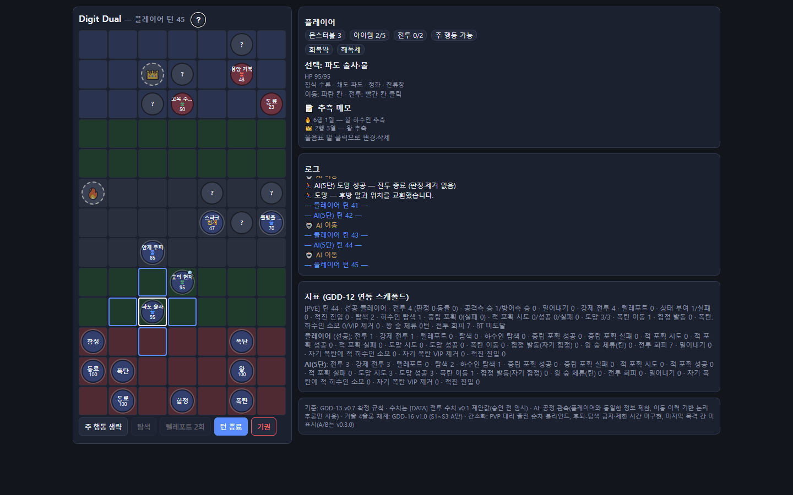
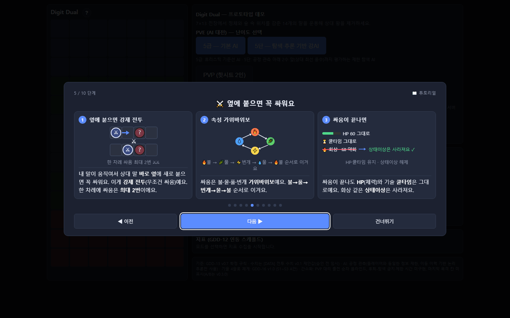

# Digit Dual (Digit-Duel)

**정체를 숨긴 14개의 말로 겨루는 1대1 턴제 전략 보드게임.**
상대에게 내 말은 전부 물음표로만 보입니다. 비공개 배치와 숲 은신으로 정보를 감추고, 붙는 순간 시작되는 속성 상성 전투로 판을 뒤집으세요.

현재 저장소는 **기획 검증용 HTML 프로토타입 데모**(`demo/index.html`)와 **내부망 온라인 대전용 릴레이 서버**(`server/`)를 담고 있습니다. 최종 타깃은 Android / Unity 클라이언트이며, Unity 포팅은 v0.5.0부터 시작합니다.

---

## 게임 소개

- **판**: 7열 × 13행. 위·아래 3줄씩이 각자의 진영이고, 가운데에는 은신이 가능한 **숲** 구역이 흩어져 있습니다.
- **말**: 플레이어당 14개 — 하수인 6 · 동료 2 · 왕 1 · 폭탄 3 · 함정 2. 경기 시작 전 자기 진영에 **비공개로 배치**하며, 상대 화면에는 종류가 드러나지 않습니다.
- **정체 공개**: 전투를 치른 말만 정체가 공개됩니다. 그전까지는 이동 이력과 위치만으로 상대의 말을 추리해야 합니다.
- **이기는 길 세 가지**: 상대 왕 제거 · 내 왕이 상대편 맨 끝줄 도달 · 상대의 싸우는 말(하수인 6 + 동료 2) 전멸.
- **한 턴**: 주 행동 1개(이동 · 탐색 · 텔레포트) → 새로 인접한 적과의 **강제 전투**(한 턴 최대 2회) → 턴 종료.

### 전투와 성장 요소

| 요소 | 내용 |
| --- | --- |
| 속성 상성 | 불 → 풀 → 번개 → 물 → 불 (유리 ×1.3 / 불리 ×0.75) |
| 하수인 로스터 | 20종 = 속성 4종 × 아키타입 5종(표준·공격·방어·속공·지속). 경기마다 6종을 고릅니다 |
| 기술 4슬롯 | 속성 공격기 2 + 공용 보조기 1 + 아키타입 시그니처 1. 쿨타임과 HP는 전투가 끝나도 유지됩니다 |
| 상태이상 | 화상 · 약화 · 감전 (전투 종료 시 해제) |
| 숲·흔적·탐색 | 숲의 말은 상대가 바로 옆에 와야 보입니다. 흔적이 있는 칸에서 탐색하면 볼·아이템·버프·공용 하수인을 얻습니다 |
| 포획과 도망 | 상대 하수인 HP 30% 미만이면 볼 투척(성공률 70%), 내 말 HP 50% 미만이면 도망(성공률 50%) |
| 텔레포트 | 내 말이 상대 진영에 들어가 있는 동안 내 말 두 개의 자리를 교환. 경기당 2회 |
| 버닝 타임 | 65턴부터 직선 2칸 이동 강화 (상대 진영·상대 숲은 1칸 유지, 함정은 고정) |

---

## v0.4.0 주요 기능

**이번 릴리스에서 새로 들어온 것**

- 🌐 **내부망 온라인 PVP** — 릴레이 서버를 통한 1:1 자동 매칭. 서버는 게임 내용을 해석하지 않는 비권위 릴레이이고, 양측은 **공유 시드 락스텝**으로 동기화합니다.
- 🧩 **사전 배치 후 자동 매칭** — 접속을 기다리지 않고 로스터 선택과 비공개 배치를 먼저 끝낸 뒤 매칭 큐에 들어갑니다. 상대가 준비되면 즉시 대전이 시작됩니다.
- 🔌 **서버 주소 입력** — 메뉴에서 접속지를 직접 지정하고 다음 실행 때 기억합니다. HTML 파일을 직접 열어도(`file://`) 내부망 주소로 연결됩니다.
- 📦 **`server/` 저장소 통합** — 릴레이 서버와 데모 정적 서빙을 본 저장소에서 함께 관리합니다.
- 📖 **튜토리얼 카드 레이아웃 전환** — 10단계 튜토리얼의 각 장면을 절대 좌표 없는 카드 격자로 재구성해, 창 크기·확대 배율이 달라도 글자가 잘리지 않습니다.

**계속 제공되는 기능**

- 🎮 **모드 4종** — PVE(5급 / 5단), PVP 핫시트 2인, 온라인 PVP, AI vs AI 관전(숨은 링크)
- 🤖 **공정 관측 AI** — AI는 플레이어와 동일한 정보 제한 아래에서만 판단합니다. 전체 정보 접근(치팅)은 하지 않고, 공개 관측과 이동 이력에 근거한 논리 추론만 사용합니다. 5단은 상대 최선 응수까지 평가하는 제한 탐색 AI입니다.
- 📝 **추측 메모** — 상대의 물음표 말에 8종 이모지로 추측을 남깁니다. 뷰어 전용이라 상대·AI·로그에 노출되지 않습니다.
- 📊 **지표 패널** — 전투·강제 전투·탐색·포획·도망·텔레포트 등을 합산과 플레이어별로 실시간 집계합니다 (GDD-12 연동 스캐폴드).
- 🖥 **단일 파일 실행** — `demo/index.html` 하나로 동작합니다. 오프라인 모드는 서버도 설치도 필요 없습니다.

---

## 화면

### 플레이 화면 (PVE · 1440×900)

내 말은 종·속성·HP까지 보이고 상대 말은 물음표로만 보입니다. 왼쪽은 보드, 오른쪽은 상태 패널 · 로그 · 지표 패널입니다.



### 튜토리얼 (10단계 · 1440×900)

첫 실행 때 한 번 자동으로 열리고, 이후에는 제목 옆 `?` 버튼이나 메뉴의 [📖 튜토리얼 다시 보기]로 언제든 다시 볼 수 있습니다.



---

## 빠른 시작 — 오프라인 (혼자 / 한 기기에서 둘이)

설치도 서버도 필요 없습니다.

1. 이 저장소를 내려받습니다.
2. `demo/index.html`을 브라우저로 엽니다.
3. 메뉴에서 모드를 고릅니다.
   - **PVE** — `5급(기본 AI)` 또는 `5단(탐색·추론 기반 강AI)`
   - **PVP (핫시트 2인)** — 한 기기에서 번갈아 플레이
   - **AI vs AI 관전** — 메뉴 아래 작은 링크
4. 로스터 6종을 고르고 말 14개를 배치한 뒤 [배치 완료]를 누르면 시작됩니다. ([무작위 배치]로 한 번에 채울 수도 있습니다.)

## 빠른 시작 — 내부망 온라인 PVP

같은 공유기(내부망)에 있는 두 기기가 필요합니다. 서버는 사설 IP 대역만 허용하는 **내부망 전용**입니다. 자세한 내용은 [`server/README.md`](server/README.md)를 참고하세요.

**1. 한 기기에서 서버를 켭니다**

- Windows: `server/서버시작.bat` 더블클릭 (최초 실행 시 의존성 자동 설치)
- 수동: `server/`에서 `npm install` 후 `npm start`

기동하면 콘솔에 내부망 접속 주소가 출력됩니다.

**2. 두 기기에서 접속합니다**

- 서버를 켠 기기: `http://localhost:8080`
- 상대 기기: `http://<서버IP>:8080`
- HTML 파일을 직접 열어서 플레이하려면, 메뉴의 서버 주소 입력칸에 `<서버IP>:8080`을 넣습니다. (포트를 생략하면 `8080`으로 붙고, 입력한 주소는 다음 실행 때 기억됩니다.)

**3. 매칭합니다**

양쪽 모두 [🌐 온라인 PVP (배치 후 자동 매칭)]를 누르고 → 로스터·배치를 마친 뒤 → [배치 완료 → 매칭 시작]을 누릅니다. 두 사람이 모두 준비되면 자동으로 대전이 시작됩니다. 상대가 접속을 끊으면 몰수승 처리됩니다.

---

## 저장소 구조

```
demo/
  index.html          HTML 프로토타입 데모 (단일 파일 · 브라우저로 열면 실행)
  test/               Node 헤드리스 회귀 테스트
server/
  server.js           내부망 PVP 릴레이 서버 + demo/ 정적 서빙
  test.js             매칭 / 릴레이 / 이탈 / 대기 슬롯 자동 검증
  서버시작.bat         Windows 원클릭 실행
docs/
  screenshots/        README용 실행 화면
  creat2ve/           조직·작업 계약 문서
CLAUDE.md             프로젝트 규약 · 기준 문서 링크
```

## QA · 회귀 테스트

커밋 전에는 헤드리스 회귀를 돌립니다. 외부 패키지 없이 Node 22 이상과 로컬 Chrome만 필요합니다.

```bash
# 데모 — 규칙 회귀 (이동·상성·폭탄·함정·밀어내기·왕 불가침·판정 + AI vs AI 완주)
node demo/test/smoke_cycle5.js

# 데모 — 추측 메모 / 튜토리얼 회귀
node demo/test/smoke_memo.js
node demo/test/smoke_tutorial.js

# 데모 — 온라인 PVP 접속 경로 회귀 (서버 주소 기본값·정규화·ws/wss 선택·사전 배치 매칭)
node demo/test/smoke_online.js

# 데모 — 튜토리얼 카드 레이아웃 실측 (헤드리스 Chrome · 5개 뷰포트)
node demo/test/tut_layout_cdp.js

# 데모 — 시드 고정 AI 다경기 비교 (기본 40경기)
node demo/test/ai_compare.js

# 서버 — 매칭 / 양방향 릴레이 / 이탈 알림 / 대기 슬롯 정리
cd server && npm install && npm test
```

## 로드맵

| 버전 | 범위 | 상태 |
| --- | --- | --- |
| v0.1.0 | 인프라 | 완료 |
| v0.2.0 | HTML 데모 | 완료 |
| v0.3.0 | A/B · 지표 | 완료 |
| v0.3.1 | 온보딩(튜토리얼) | 완료 |
| **v0.4.0** | **온라인 PVP · HTML 안정화** | **현재 릴리스** |
| v0.4.1 | HTML 데모 후속 — 온라인 PVP 플레이테스트 보완 및 밸런싱 백로그 반영 | 예정 |
| v0.5.0 | Unity 포팅 기반 (Android 타깃) | 예정 |

## 문서

규칙·수치의 진실 원본은 Notion 기준 문서이며, 저장소 규약과 부서별 작업 계약은 [`CLAUDE.md`](CLAUDE.md)에 정리되어 있습니다. 데모의 수치 상수는 승인 전 임시값이라 밸런싱 조정은 보류 백로그로 관리합니다. 기획에 없는 내용은 임의로 구현하지 않고 `[기획 필요]`로 보고합니다.
