# Digit-Duel

<p align="center">
  <a href="docs/media/digit-duel-hero.png">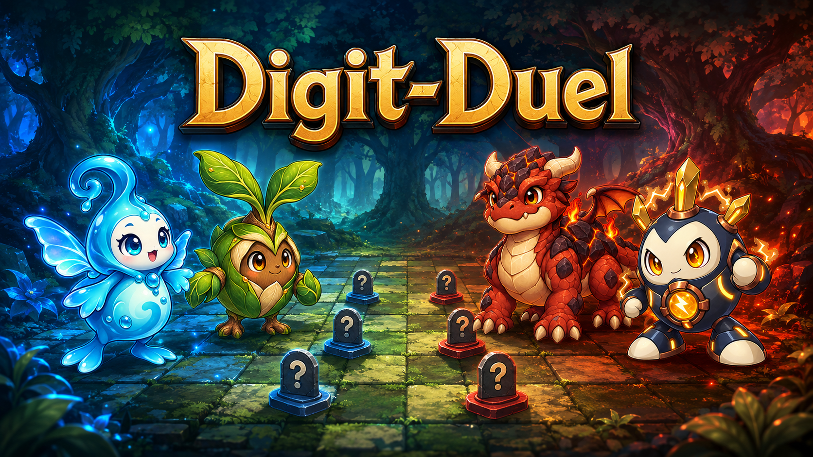</a>
  <br>
  <sub>홍보용 일러스트입니다. 실제 게임 화면은 아래 <a href="#게임-플레이-사진">게임 플레이 사진</a>에서 볼 수 있습니다.</sub>
</p>

<p align="center">
  <a href="https://github.com/ChangjoSung/Digit-Duel/releases/latest"></a>
  <a href="https://github.com/ChangjoSung/Digit-Duel"></a>
  <a href="https://github.com/ChangjoSung/Digit-Duel/forks"></a>
  <a href="LICENSE"></a>
</p>

## 게임 소개

**상대의 말이 전부 물음표로 보이는 1대1 턴제 전략 보드게임.** 정체를 숨긴 말 14개를 몰래 배치하고, 숲에 숨고, 흔적을 쫓고, 옆에 붙는 순간 터지는 속성 전투로 판을 뒤집으세요.

체스처럼 말을 움직이지만, 상대 말의 정체는 싸워 보기 전까지 알 수 없습니다. 장기의 수읽기와 속성 상성 배틀을 하나로 합쳐, 위치가 아니라 **정보**를 두고 다투는 게임을 만들었습니다. 상대의 이동을 읽고 물음표 뒤의 정체를 추리하세요. 왕을 잡거나, 내 왕을 상대 진영 끝까지 밀어 넣거나, 상대의 싸우는 말을 모두 쓰러뜨리면 승리입니다.

## 게임 기능

- **물음표 뒤를 추리하세요** — 하수인 6 · 동료 2 · 왕 1 · 폭탄 3 · 함정 2, 말 14개를 자기 진영에 비공개로 배치합니다. 상대에게 내 말은 모두 물음표이며, 전투를 치른 말은 정체가 드러납니다. 8종 추측 메모로 상대 말에 나만 보이는 표시를 남겨 두세요.
- **숲에 숨고 흔적을 쫓으세요** — 7열 × 13행 판 가운데에는 몸을 숨길 수 있는 숲이 흩어져 있습니다. 숲 속의 말은 상대가 바로 옆에 와야만 보입니다. 숲 어딘가에 숨은 선물의 흔적을 찾아 탐색하면 몬스터볼 · 회복약 · 다음 전투 버프 · 공용 하수인을 얻습니다.
- **옆에 붙으면 시작되는 전투** — 전투 가능한 말이 이동해서 상대 말 옆에 새로 붙으면 전투를 피할 수 없습니다. 전투는 불 → 풀 → 번개 → 물 → 불 순서의 속성 가위바위보입니다. 깎인 HP와 기술 쿨타임은 전투가 끝나도 그대로 남으니, 언제 싸울지 고르는 것도 전략입니다.
- **하수인 20종, 나만의 로스터 6종** — 속성 4종 × 아키타입 5종(표준 · 공격 · 방어 · 속공 · 지속) 가운데 경기마다 6종을 고릅니다. 각 하수인은 속성 공격기 2개, 공용 보조기 1개, 아키타입 시그니처 기술 1개를 들고 싸웁니다.
- **기술을 바꾸고 회복을 준비하세요** — 탐색으로 다른 속성 공격기를 얻으면 공격 슬롯 하나와 교체할 수 있습니다. 주 행동으로 회복 자세를 지정하면 그 턴 종료부터 나와 상대의 각 턴마다 최대 HP의 5%를 회복합니다. 그 말이 이동·탐색·텔레포트·전투에 참여하면 자세가 풀립니다. 전투가 6라운드까지 이어지면 남은 HP 비율로 승패를 가르고, 동률이면 방어자가 이깁니다.
- **잡아오고, 도망치고, 순간이동하세요** — HP가 낮아진 상대 하수인은 몬스터볼로 포획할 수 있고, 위험한 내 말은 도망칠 수 있습니다. 상대 진영 깊숙이 들어가면 텔레포트로 내 말 두 개의 자리를 바꿔 허를 찌르세요. 65턴부터 버닝 타임이 시작되면 이동 가능한 말은 최대 두 칸까지 움직입니다. 적진·적 숲에 있거나 진입·통과할 때는 한 칸으로 제한됩니다.
- **혼자서도, 둘이서도** — 5급 · 5단 두 단계의 AI와 겨루는 PVE, 한 기기에서 번갈아 두는 핫시트 PVP, 같은 공유기 안의 두 PC가 겨루는 온라인 PVP를 지원합니다. AI는 플레이어와 같은 정보만 보고 판단하며, 숨은 정보를 들여다보지 않습니다.

## 게임 플레이 사진

이미지를 클릭하면 원본 크기로 볼 수 있습니다.

<table>
  <tr>
    <td align="center" width="50%">
      <a href="docs/qa/minion-art-integration/file_desktop-1280_3-board.png">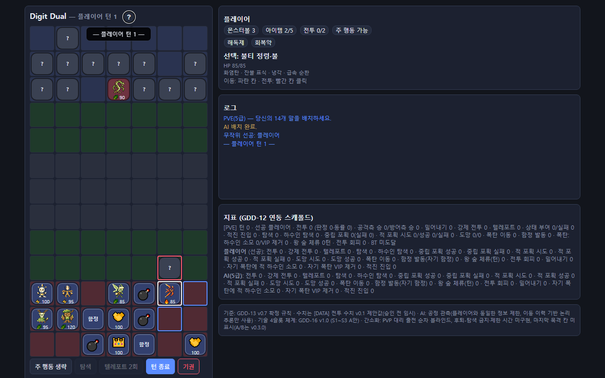</a>
      <br><b>플레이 화면</b><br><sub>내 말과 공개된 상대 말은 아이콘으로, 아직 모르는 상대 말은 물음표로 보입니다.</sub>
    </td>
    <td align="center" width="50%">
      <a href="docs/qa/issue106-browser/06-b1-menu-root-actor.png">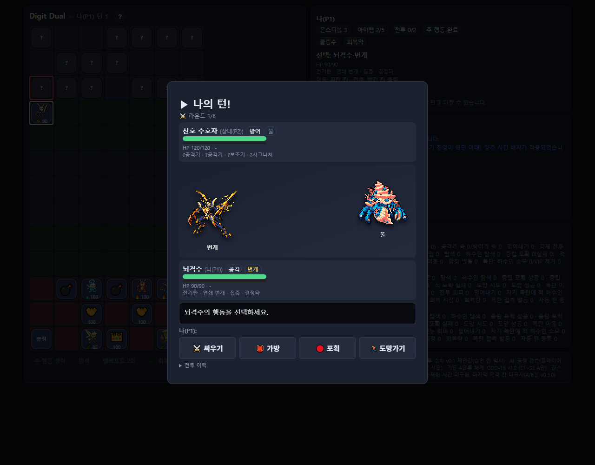</a>
      <br><b>전투 화면</b><br><sub>속성 상성과 HP를 보며 기술 · 아이템 · 포획 · 도망 가운데 행동을 고릅니다.</sub>
    </td>
  </tr>
</table>

<details>
<summary><b>튜토리얼 10단계 보기</b> — v0.4.3 캡처, 최신 규칙은 아래 정리본 참고</summary>
<br>
<table>
  <tr>
    <td align="center" width="20%"><a href="docs/media/tutorial-01.png">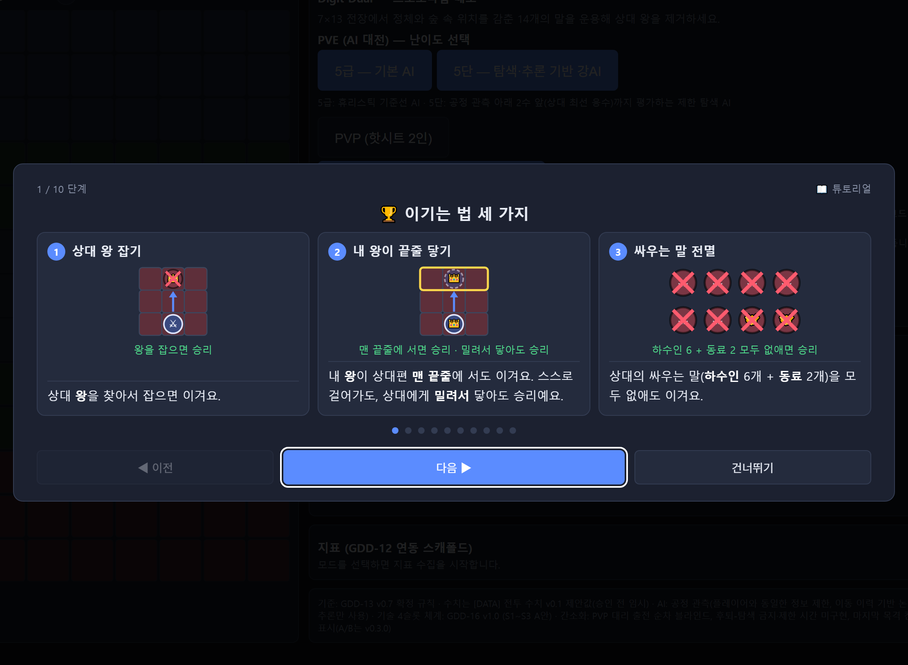</a><br><sub>1. 이기는 법 세 가지</sub></td>
    <td align="center" width="20%"><a href="docs/media/tutorial-02.png">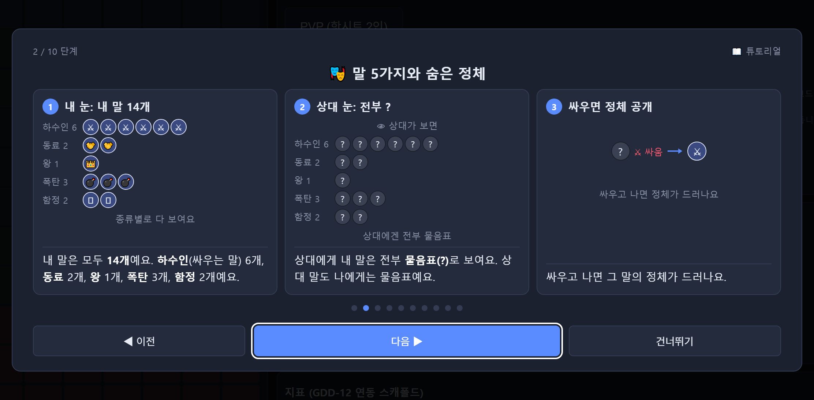</a><br><sub>2. 말 5가지와 숨은 정체</sub></td>
    <td align="center" width="20%"><a href="docs/media/tutorial-03.png">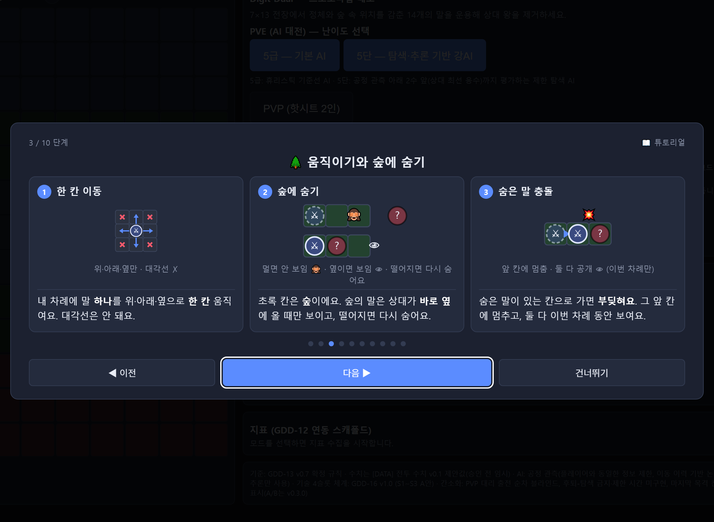</a><br><sub>3. 움직이기와 숲에 숨기</sub></td>
    <td align="center" width="20%"><a href="docs/media/tutorial-04.png">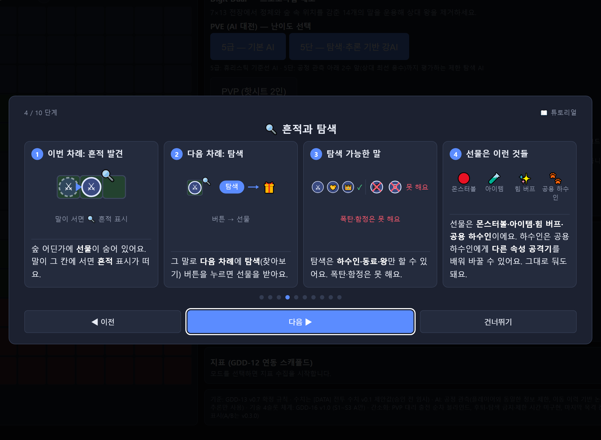</a><br><sub>4. 흔적과 탐색</sub></td>
    <td align="center" width="20%"><a href="docs/media/tutorial-05.png">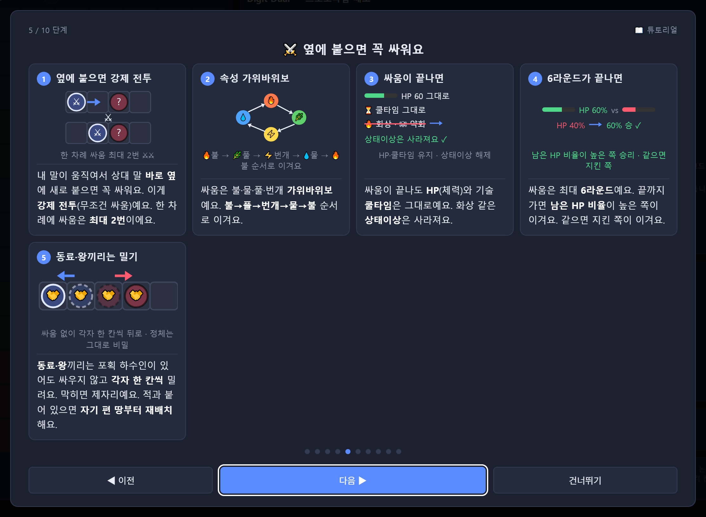</a><br><sub>5. 옆에 붙으면 꼭 싸워요</sub></td>
  </tr>
  <tr>
    <td align="center" width="20%"><a href="docs/media/tutorial-06.png">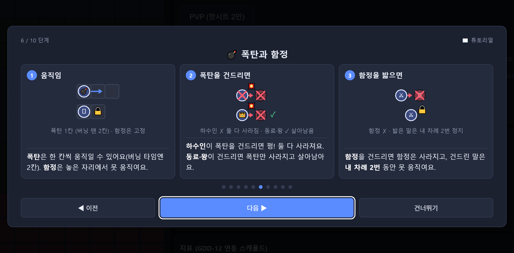</a><br><sub>6. 폭탄과 함정</sub></td>
    <td align="center" width="20%"><a href="docs/media/tutorial-07.png">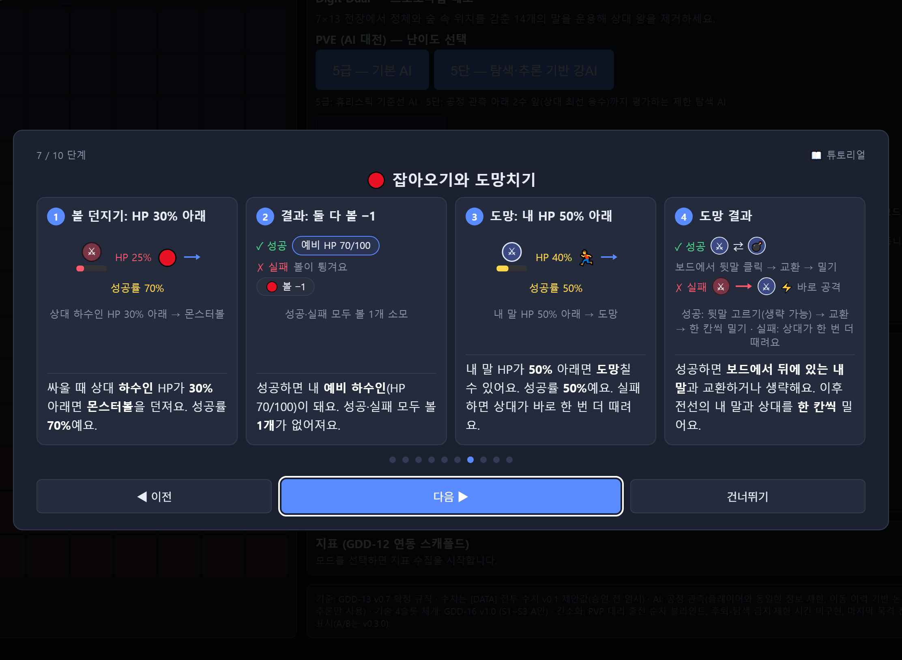</a><br><sub>7. 잡아오기와 도망치기</sub></td>
    <td align="center" width="20%"><a href="docs/media/tutorial-08.png">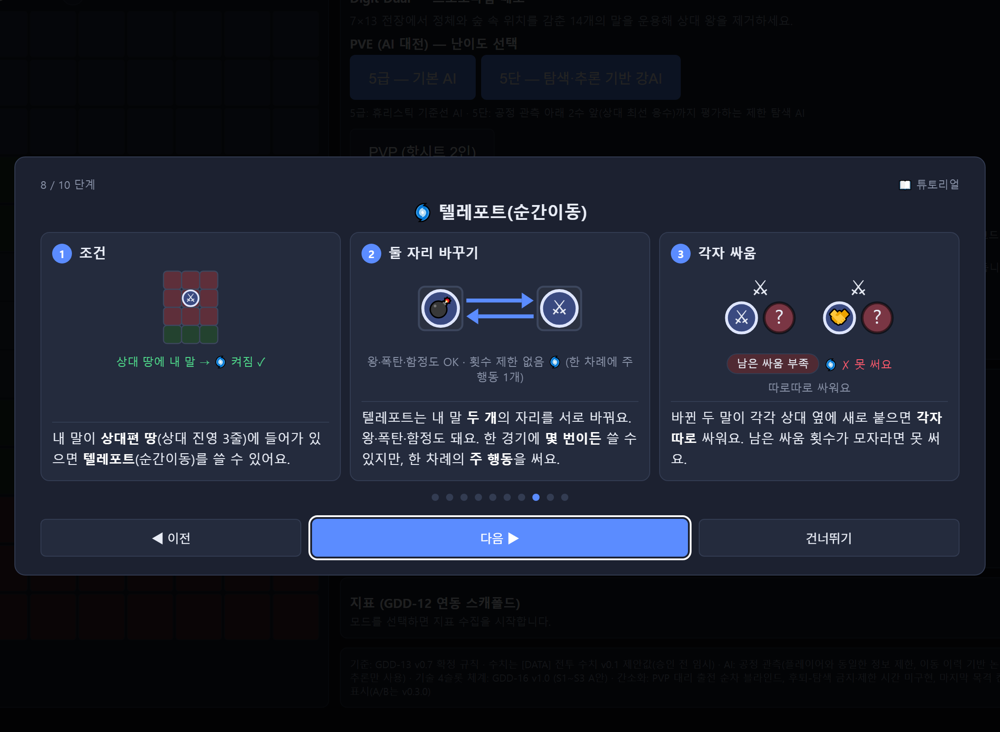</a><br><sub>8. 텔레포트(순간이동)</sub></td>
    <td align="center" width="20%"><a href="docs/media/tutorial-09.png">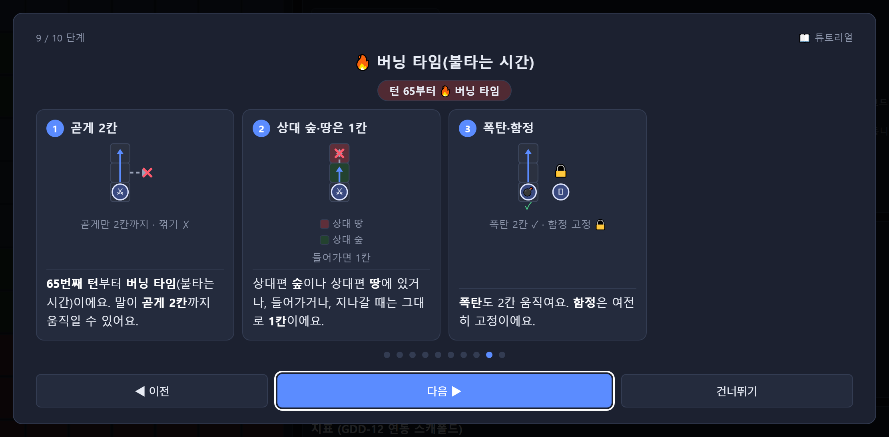</a><br><sub>9. 버닝 타임(불타는 시간)</sub></td>
    <td align="center" width="20%"><a href="docs/media/tutorial-10.png">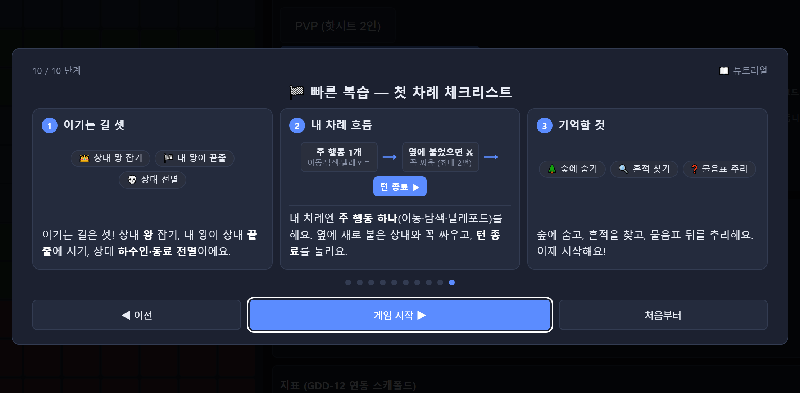</a><br><sub>10. 빠른 복습</sub></td>
  </tr>
</table>
<sub>튜토리얼은 게임 안에서 제목 옆 <code>?</code> 버튼이나 메뉴의 [📖 튜토리얼 다시 보기]로 언제든 다시 볼 수 있습니다.</sub>
</details>

## 새로운 기능

[](https://github.com/ChangjoSung/Digit-Duel/releases/tag/v0.4.4) 탐색 기술 교체와 지속 회복, 온라인 시점과 턴 흐름을 개선했습니다.

**v0.4.4 Patch Note** (2026-09-08)

- [기능 추가] 탐색에서 다른 속성 공격기를 얻어 교체할 수 있습니다. 회복 자세는 지정한 턴 종료부터 각 플레이어 턴마다 최대 HP의 5%를 지속 회복합니다.
- [개선] 온라인 양쪽 모두 자기 진영을 아래에서 보고, 상대 턴에도 메모할 수 있습니다. 숨은 말 충돌 시 위치 동기화 오류와 공용 하수인 대리 출전 아트 누락을 수정했습니다.
- [개선] 전투 4메뉴·보호막/HP 표시·턴 연출·자동 종료를 추가했습니다. 65턴 버닝타임 안내는 일반 턴 전에 2초 표시됩니다.
- [규칙 조정] 함정과 걸린 말 모두 공개, 폭탄 직접 신규 접촉 발동, 6라운드 잔여 HP 비율 판정(동률 방어자 승), 공격형 위력·일반 감전 확률 완화를 적용했습니다.

상세 내용은 [v0.4.4 릴리스 노트](docs/releases/v0.4.4.md)와 [최신 규칙 정리본](docs/v0.4.4-rules-digest.md)을 참고하세요. 튜토리얼 이미지는 v0.4.3 캡처이며 변경된 규칙은 정리본이 기준입니다.

이전 버전의 패치 노트는 [릴리스 노트 목록](docs/releases/README.md)과 [GitHub Releases](https://github.com/ChangjoSung/Digit-Duel/releases)에서 볼 수 있습니다. v0.4.5의 턴 행동·문서·튜토리얼 갱신은 [다음 마일스톤](https://github.com/ChangjoSung/Digit-Duel/milestone/11)에서 준비 중입니다.

## 게임 정보

| 항목 | 내용 |
| --- | --- |
| 현재 버전 | [v0.4.4](https://github.com/ChangjoSung/Digit-Duel/releases/tag/v0.4.4) |
| 최근 업데이트 | 2026-09-08 |
| Star · Fork | [](https://github.com/ChangjoSung/Digit-Duel) [](https://github.com/ChangjoSung/Digit-Duel/forks) |
| 필요한 환경 | 오프라인: 최신 데스크톱 브라우저(Chrome 권장) · 온라인: Windows PC 1대 + [Node.js](https://nodejs.org) |
| 장르 | 1대1 턴제 전략 보드게임 (숨은 정체 · 속성 배틀) |
| 플레이 인원 | 1인(AI 대전) · 2인(핫시트 · 같은 공유기 온라인) |
| 개발자 | 성창조 (Sung Changjo) |
| 첫 출시일 | 2026-09-02 (v0.3.0) |
| 플랫폼 | HTML 데모 (브라우저) · Android/Unity 버전은 개발 예정 |

## 플레이 방법

**혼자 또는 한 기기에서 둘이 (오프라인)**

- 오른쪽 **Releases**에서 최신 버전의 `Source code`를 내려받아 압축을 푸세요.
- `demo/index.html`을 브라우저로 여세요. 설치도, 서버도, 인터넷 연결도 필요 없습니다. (`demo/assets/` 폴더는 함께 두어야 합니다.)
- 메뉴에서 **PVE**(5급 · 5단) 또는 **PVP 핫시트**를 고르고, 로스터 6종을 선택한 뒤 말 14개를 배치하면 시작됩니다. [무작위 배치]로 한 번에 채울 수도 있습니다.

**같은 공유기 안의 두 PC로 온라인 대전**

- 서버를 켤 PC에 [Node.js](https://nodejs.org)를 설치하세요. (실행기가 Node.js를 찾지 못하면 안내 메시지를 띄우고 멈춥니다.)
- `Source code` 안의 `server/LAN서버시작.bat`을 더블 클릭하세요! 처음 한 번은 필요한 파일을 자동으로 설치합니다.
- 화면에 표시된 내부망 접속 주소 `http://192.168.x.x:8080`와 `접속 코드: ??????????`를 상대방에게 전달하세요!
- 두 사람 모두 전달받은 내부망 주소를 브라우저로 여세요!
- [접속 코드] 칸에 같은 코드를 입력한 뒤 [🌐 온라인 PVP]를 선택하세요!
- 각자 배치가 완료되면 자동으로 매칭됩니다!
- [주의] 서버를 다시 실행하면 코드도 새로 바뀝니다. 재시작했다면 두 사람 모두 새 코드를 입력해야 합니다.
- [참조] 이 서버는 같은 공유기 안에서 아는 사람과 대전하는 용도입니다. 인터넷 너머의 원격 접속용이 아닙니다.
- [참조] 외부 온라인 PVP 매칭 시스템은 추후 개발 예정입니다.

혼자서 온라인 기능을 확인하려면 `server/서버시작.bat`을 켜고 `http://127.0.0.1:8080`을 브라우저 탭 두 개로 여세요. 서버 설정의 자세한 내용은 [`server/README.md`](server/README.md)에 있습니다.

## 저장소 구조

```
demo/
  index.html            게임 본체 — 브라우저로 열면 바로 실행되는 HTML 데모
  assets/minions/       하수인 20종 설명창·전투·말판 이미지 (index.html과 함께 필요)
  test/                 데모 회귀 테스트 (Node)
server/
  server.js             온라인 PVP 릴레이 서버 + demo/ 정적 서빙
  security.js           접속 코드·바인드·경로·메시지 검증
  서버시작.bat           Windows 원클릭 실행 — 이 PC 전용
  LAN서버시작.bat        Windows 원클릭 실행 — 같은 공유기 공개
  test-client.html      릴레이 점검용 최소 클라이언트
  test*.js              서버 테스트 (매칭·보안·설정·실행기)
  README.md             서버 실행 방법과 보안 범위
tools/  tests/          하수인 아트 제작 도구와 그 테스트 (Python)
docs/
  media/                README용 홍보 일러스트·튜토리얼 이미지
  releases/             버전별 패치 노트
  screenshots/          이전 README용 실행 화면
  qa/                   버전별 구현·독립 QA 보고와 검증 화면
  art/                  하수인 아트 검토 이미지·제작 기록
  minion-visual-spec-v0.4.3.md   하수인 이미지 규격
  creat2ve/             개발 조직·작업 계약 문서
CLAUDE.md               프로젝트 규약 · 기준 문서 링크
CONTRIBUTING.md         기여 안내
LICENSE · NOTICE · ASSET-LICENSE.md   라이선스와 자산 정책
```

문서의 현재 기준과 과거 검수 이력은 [docs 안내](docs/README.md)에서 구분해 볼 수 있습니다.

## 라이선스

소스 코드 · 테스트 · 설정 · 문서는 [Apache License 2.0](LICENSE)으로 배포됩니다. 각 기여자는 자신의 기여분에 대한 저작권을 유지하며, 귀속 사항은 [`NOTICE`](NOTICE)에 있습니다.

다음은 Apache-2.0 대상이 **아닙니다**. 범위와 이용 조건은 [`ASSET-LICENSE.md`](ASSET-LICENSE.md)를 따릅니다.

- Digit-Duel / Digit Dual 명칭과 브랜딩
- 하수인 원본 · 파생 아트(`demo/assets/minions/`, `docs/art/minions-v0.4.3/`)와 이 README의 홍보 일러스트(`docs/media/`)
- 렌더링된 게임 화면(`docs/screenshots/`, `docs/qa/`, `docs/media/`의 이미지)

Copyright 2026 Sung Changjo and Digit-Duel contributors.
