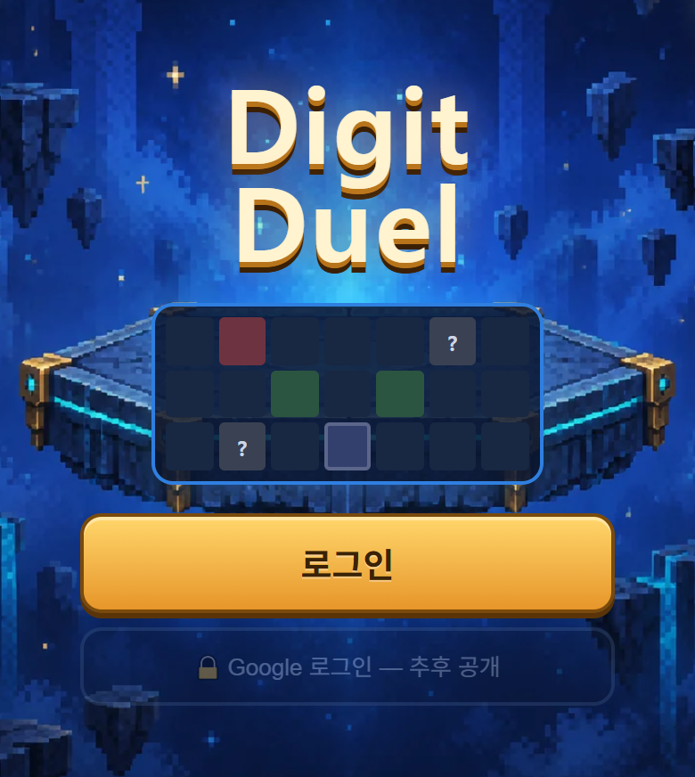
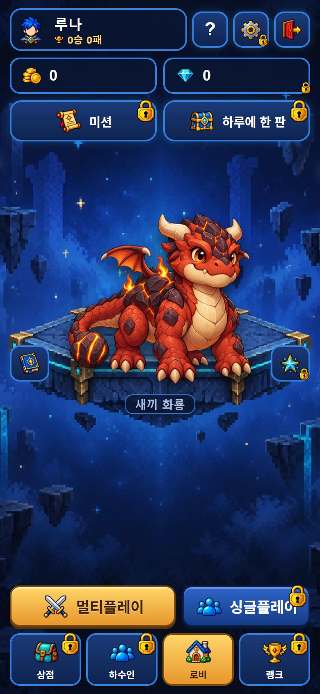
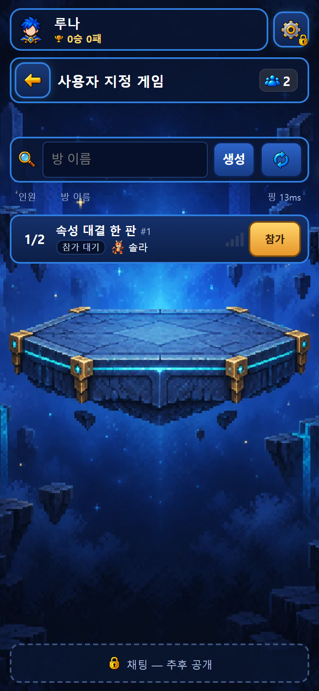
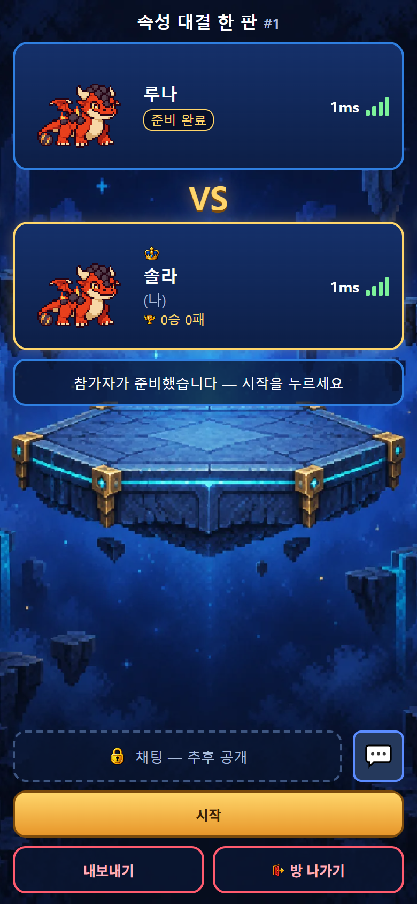
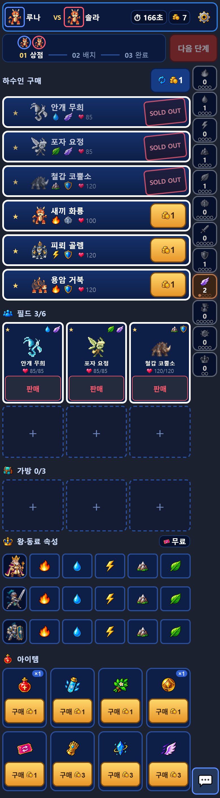
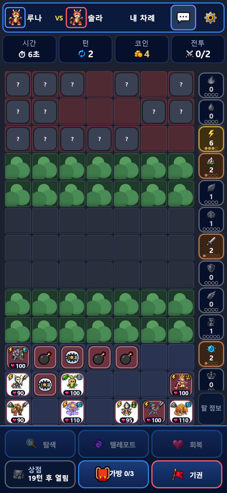
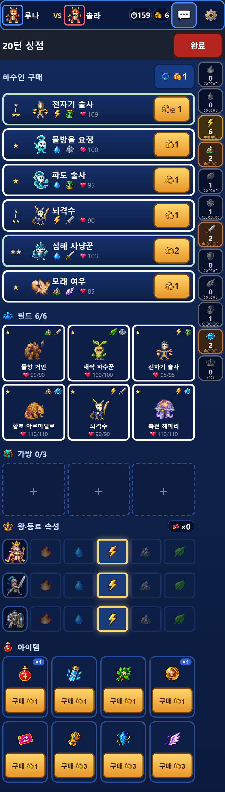
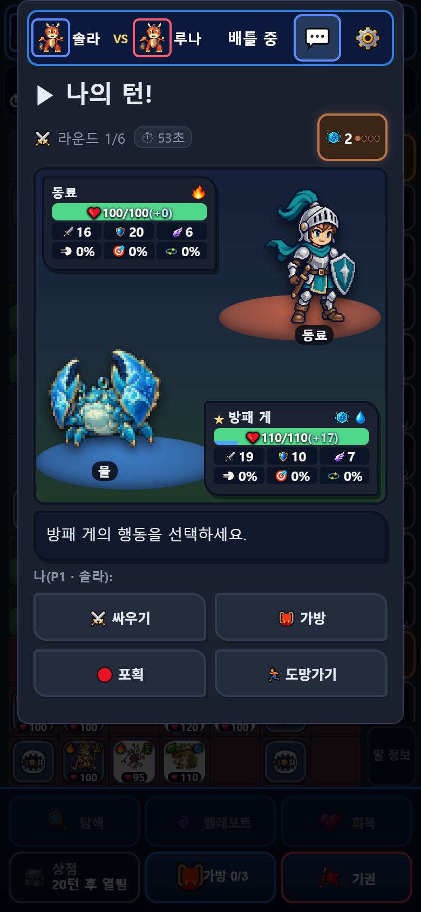

# Digit-Duel

  

  
  

**[▶ 웹에서 플레이](https://digit-duel-mipa.onrender.com)** · 출시 준비 **[v0.4.13](docs/releases/v0.4.13.md)** · 현재 정식 **[v0.4.12](https://github.com/ChangjoSung/Digit-Duel/releases/tag/v0.4.12)**

## 게임 소개

**상대 말의 정체를 추리하며 싸우는 2인 온라인 턴제 전략 보드게임입니다.** 각자 말 14개를 비밀리에 배치합니다. 상대 말은 물음표로 보이고, 숲에 들어간 말은 위치도 숨겨집니다. 하수인을 움직여 단서를 모으고 속성 전투로 상대를 제압하세요.

상대 왕을 쓰러뜨리거나, 내 왕을 상대 진영의 마지막 줄까지 보내거나, 상대의 하수인과 동료를 모두 제거하면 승리합니다.

## 게임 기능

- **구매와 비밀 배치** — 일반 하수인 30종 중 6명을 고르고 왕·동료·폭탄·함정과 함께 7열 × 13행 보드에 배치합니다. 회복 아이템과 몬스터 볼은 각각 1개씩 가지고 시작합니다.
- **정체 추리와 숲** — 탐색으로 코인을 얻고 숲에 숨은 말을 추적합니다. 상대 말에는 나만 보는 추측 메모를 남길 수 있습니다.
- **속성 전투** — 불 → 풀 → 땅 → 번개 → 물 → 불의 상성과 스킬·가방·포획·도망을 활용합니다. 전투 후 HP는 유지되고 상태이상·쿨타임은 초기화됩니다.
- **성장과 시너지** — 턴 상점에서 하수인을 승급·교체하고 아이템을 구매합니다. 왕국·아키타입 시너지로 전력을 조합하세요.
- **말 정보** — 내 말의 정보를 확인하고 하수인의 능력치·기술·미해금 기술 소개를 읽습니다. 전투에서는 양쪽 하수인의 HP·방어막·기본 능력치를 볼 수 있습니다.
- **공개 방과 전적** — 방 이름으로 검색해 대전하고 이모티콘 6종으로 반응합니다. 로비에서 대표 하수인·공식 승패·최근 20경기를 확인합니다.

## 게임 플레이 사진

이미지를 누르면 원본 크기로 볼 수 있습니다.

<table>
  <tr>
    <td align="center" width="50%"> <b>로그인</b></td>
    <td align="center" width="50%"> <b>메인 로비</b></td>
  </tr>
  <tr>
    <td align="center" width="50%"> <b>공개 방 목록</b></td>
    <td align="center" width="50%"> <b>대기실</b></td>
  </tr>
  <tr>
    <td align="center" width="50%"> <b>시작 상점</b></td>
    <td align="center" width="50%"> <b>전략 보드</b></td>
  </tr>
  <tr>
    <td align="center" width="50%"> <b>턴 상점</b></td>
    <td align="center" width="50%"> <b>속성 전투</b></td>
  </tr>
</table>

## 새로운 기능

**v0.4.13 — 화면과 게임 흐름 개선** · 출시 승인 대기

- **시작 준비** — 상점과 배치가 공통 180초를 사용합니다. 양쪽이 준비되면 바로 시작하고, 시간이 끝나면 부족한 말을 보충해 배치합니다.
- **메인 화면·말 정보** — 대표 하수인 TopBar, 개인 시너지, HP·방어막·능력치와 기술 설명을 정리했습니다. 고정 말 정보 버튼으로 폭탄·함정도 확인합니다.
- **턴 상점** — 시작 상점과 같은 화면 구조로 바꾸고 구매 시간을 180초로 늘렸습니다. 등급별 테두리와 완료 후 대기 상태를 구분합니다.
- **배틀** — 양쪽 전투원 정보, 스킬·가방·포획·도망 화면을 정리했습니다. 기술 설명을 재사용하고 중복 위력 표시를 없앴습니다.
- **온라인 안정성** — 재접속·대리 출전·전설 아트 표시, 방장 승계·강퇴·재연결 대기와 방·결과 화면 핑을 수정했습니다.

[릴리스 노트](docs/releases/v0.4.13.md) · [이전 릴리스](docs/releases/README.md)

## 게임 정보

| 항목 | 내용 |
| --- | --- |
| 출시 준비 | [v0.4.13](docs/releases/v0.4.13.md) — CJ 승인 대기 |
| 현재 정식 버전 | [v0.4.12](https://github.com/ChangjoSung/Digit-Duel/releases/tag/v0.4.12) |
| 플레이 주소 | [digit-duel-mipa.onrender.com](https://digit-duel-mipa.onrender.com) |
| 장르·인원 | 숨은 정체·속성 전투를 결합한 온라인 1대1 턴제 전략 |
| 환경 | PC·휴대폰의 최신 브라우저, 인터넷과 가입용 이메일 |
| 플랫폼 | HTML 웹 게임 |
| 개발자 | 성창조 (Sung Changjo) |
| 첫 정식 출시 | 2026-09-02 (v0.3.0) |

## 플레이 방법

1. [게임 페이지](https://digit-duel-mipa.onrender.com)에서 가입하거나 ID·비밀번호로 로그인합니다.
2. 로비에서 **멀티플레이**를 누릅니다. 한 사람이 방을 만들고 상대가 참가합니다. 참가자가 준비하면 방장이 시작합니다.
3. 공통 **180초** 안에 시작 상점에서 하수인 6명을 고르고 왕·동료 속성을 정한 뒤 말 14개를 배치합니다. 양쪽이 준비를 마치면 바로 시작합니다.
4. 자기 차례 **30초** 안에 이동·탐색·회복·텔레포트를 선택합니다. 내 말의 정보는 오른쪽 **말 정보**에서 확인합니다.
5. 적과 맞붙으면 **60초** 안에 싸우기·가방·포획·도망을 선택합니다. 턴 상점에서는 **180초** 동안 구매·승급·교체로 전력을 보강합니다.
6. 세 가지 승리 조건 중 하나를 달성하고 로비에서 전적을 확인합니다.

싱글플레이·Google 로그인·로비 상점·채팅은 잠겨 있습니다. 서버 재시작 시 진행 중인 경기는 복구되지 않으며 확정된 계정·전적은 보존됩니다.

## 저장소 구조

~~~
demo/               웹 게임과 게임 자산
server/             계정·공개 방·경기 판정 서버
docs/releases/      버전별 릴리스 노트
docs/screenshots/   실제 게임 화면
~~~

## 라이선스

코드·문서는 [Apache License 2.0](LICENSE)입니다. 이름·아트·게임 화면의 이용 조건은 [ASSET-LICENSE.md](ASSET-LICENSE.md), 저작권 귀속은 [NOTICE](NOTICE)를 따릅니다.
