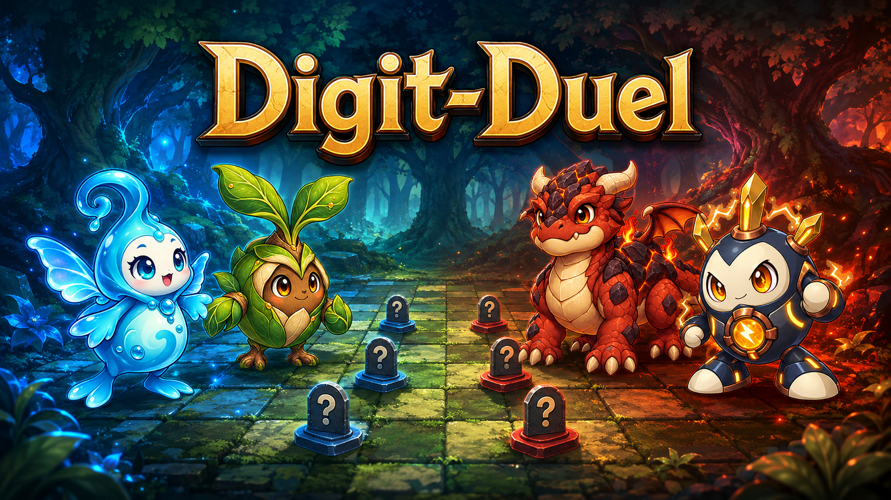
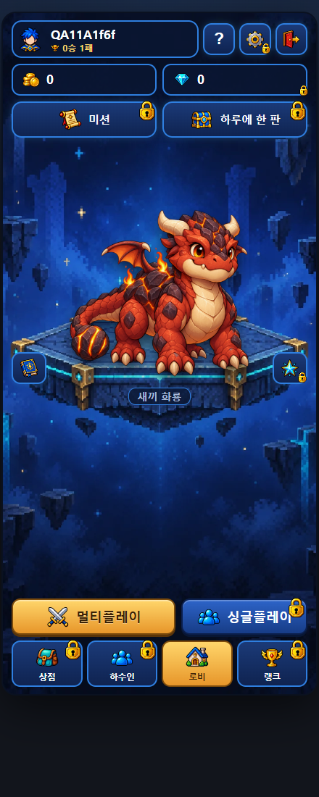
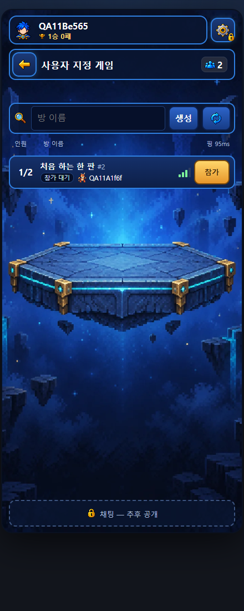
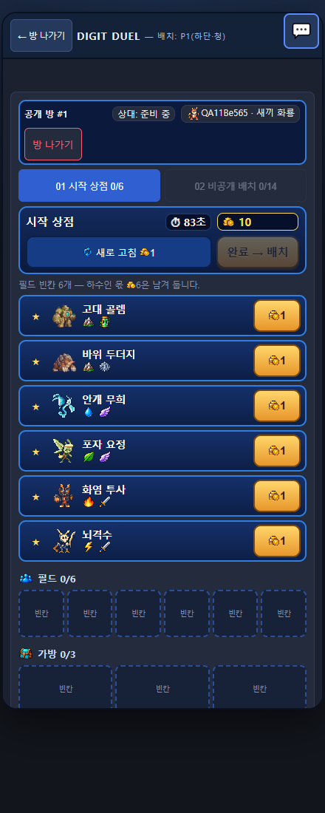
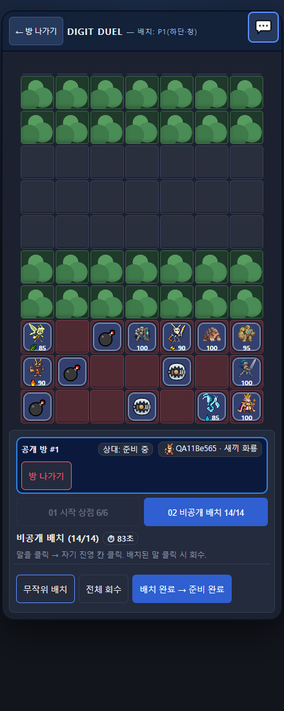
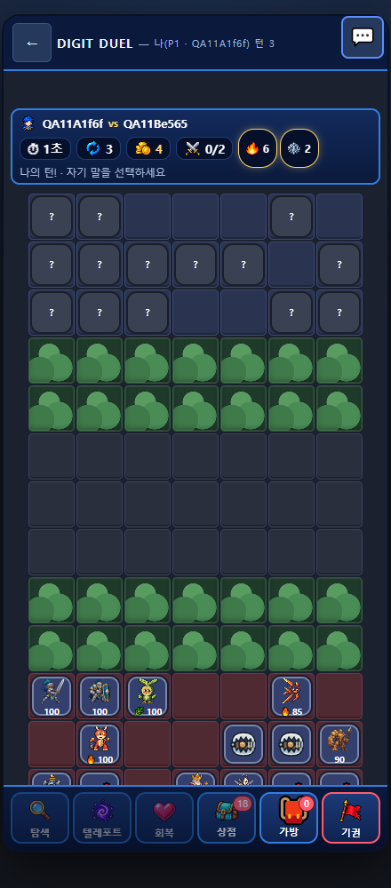
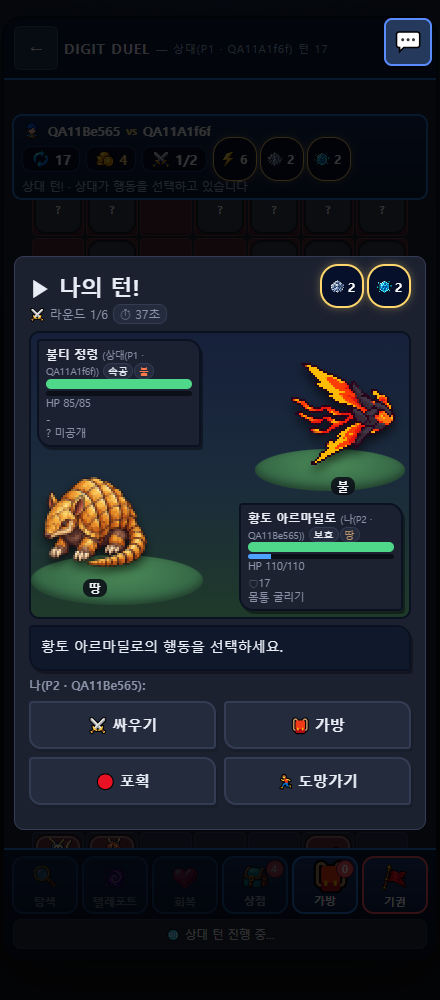

# Digit-Duel

  
   
  홍보용 일러스트입니다. 실제 화면은 아래 게임 플레이 사진에서 볼 수 있습니다.

  
  

**[▶ 웹에서 바로 플레이](https://digit-duel-mipa.onrender.com)** · 정식 버전 **[v0.4.11](https://github.com/ChangjoSung/Digit-Duel/releases/tag/v0.4.11)**

## 게임 소개

**상대 말의 정체를 추리하며 싸우는 2인 온라인 턴제 전략 보드게임입니다.** 두 플레이어가 각각 14개 말을 비밀리에 배치합니다. 상대 말은 물음표로 보이고, 숲에 들어간 말은 위치도 숨겨집니다. 내 하수인을 움직여 단서를 모으고, 상대와 맞붙어 속성 전투를 벌이세요.

상대 왕을 쓰러뜨리거나, 내 왕을 상대 진영의 마지막 줄까지 보내거나, 상대의 하수인과 동료를 모두 제거하면 승리합니다.

## 게임 기능

- **하수인을 고르고 배치하세요** — 시작 상점에서 재화로 일반 하수인 30종 중 6명을 고릅니다. 왕·동료·폭탄·함정과 함께 7열 × 13행 보드의 내 진영에 비밀리에 배치합니다.
- **숲과 정체를 이용하세요** — 숲에 숨은 말의 위치를 추적하고 탐색으로 재화를 얻습니다. 상대 말에는 나만 보는 추측 메모를 남길 수 있습니다.
- **속성 전투를 벌이세요** — 불 → 풀 → 땅 → 번개 → 물 → 불의 상성과 하수인 스킬, 아이템·포획·도망을 활용합니다. 전투 뒤 HP는 남고 전투 상태와 쿨타임은 초기화됩니다.
- **경기 중 전력을 키우세요** — 정기 상점에서 하수인을 승급·교체하고 가방 3칸과 왕국·아키타입 시너지를 활용합니다. 거래와 경기 판정은 서버가 확인합니다.
- **공개 방에서 대전하세요** — 방 이름으로 검색하고 참가 가능 상태와 서버 핑을 확인합니다. 경기 중에는 정해진 이모티콘 6종으로 반응할 수 있습니다.
- **기록을 남기세요** — ID로 가입·로그인하고 이메일 6자리 코드로 비밀번호를 재설정합니다. 로비에서 대표 하수인, 공식 승·패와 최근 20경기를 확인할 수 있습니다.

## 게임 플레이 사진

이미지를 누르면 원본 크기로 볼 수 있습니다. 모두 v0.4.11의 실제 온라인 플레이 화면입니다.

<table>
  <tr>
    <td align="center" width="50%"> <b>메인 로비</b> 대표 하수인과 공식 전적을 확인하고 멀티 대전을 시작합니다.</td>
    <td align="center" width="50%"> <b>공개 방 목록</b> 방 이름을 찾고 참가 가능 상태와 핑을 확인합니다.</td>
  </tr>
  <tr>
    <td align="center" width="50%"> <b>시작 상점</b> 하수인 6명을 골라 첫 전력을 꾸립니다.</td>
    <td align="center" width="50%"> <b>비공개 배치</b> 왕·동료·하수인·폭탄·함정을 내 진영에 놓습니다.</td>
  </tr>
  <tr>
    <td align="center" width="50%"> <b>전략 보드</b> 숨은 말을 추리하며 이동·탐색·회복합니다.</td>
    <td align="center" width="50%"> <b>속성 전투</b> 스킬·가방·포획·도망 가운데 행동을 고릅니다.</td>
  </tr>
</table>

## 새로운 기능

 계정형 2인 대전과 경기 경제·전투·화면을 개편했습니다.

**v0.4.11 Patch Note** (2026-09-29)

- [기능 추가] ID 계정, 이메일 6자리 비밀번호 재설정, 공식 승·패와 최근 경기 기록을 제공합니다.
- [기능 추가] 방 이름 검색·상태·핑, 대표 하수인, 경기 중 이모티콘을 제공합니다.
- [기능 추가] 30종 하수인, 5속성 전투, 왕국·아키타입 시너지와 6칸 시작·정기 상점, 성장·가방 경제를 적용합니다.
- [개선] 배치 90초·보드 행동 30초·전투 행동 60초를 서버가 관리하고, 연결이 끊기면 남은 시간을 멈춥니다.
- [개선] 로비·방·상점·배치·보드·전투·결과 화면과 아트를 새 구성으로 정리했습니다.

자세한 내용은 [v0.4.11 릴리스 노트](docs/releases/v0.4.11.md)를 참고하세요. 이전 내역은 [릴리스 노트 목록](docs/releases/README.md)에 있습니다.

## 게임 정보

| 항목 | 내용 |
| --- | --- |
| 정식 버전 | [v0.4.11](https://github.com/ChangjoSung/Digit-Duel/releases/tag/v0.4.11) |
| 플레이 주소 | [digit-duel-mipa.onrender.com](https://digit-duel-mipa.onrender.com) |
| 장르 | 숨은 정체·속성 전투를 결합한 1대1 턴제 전략 보드게임 |
| 플레이 인원 | 온라인 2인, 각자 PC 또는 휴대폰에서 접속 |
| 필요한 환경 | 인터넷에 연결된 최신 브라우저와 가입용 이메일 주소 |
| 플랫폼 | HTML 웹 게임 |
| 개발자 | 성창조 (Sung Changjo) |
| 첫 정식 출시 | 2026-09-02 (v0.3.0) |

## 플레이 방법

1. [게임 페이지](https://digit-duel-mipa.onrender.com)를 열고 ID·닉네임·이메일·비밀번호로 가입하거나 로그인합니다.
2. 로비에서 **멀티플레이**를 누릅니다. 한 사람이 방을 만들고 다른 사람이 목록에서 찾아 참가합니다. 참가자가 준비하면 방장이 시작합니다.
3. 시작 상점에서 하수인 6명을 고르고 왕·동료 속성을 정합니다. 이어서 말 14개를 내 진영에 배치합니다. 상점과 배치에는 각각 90초가 주어집니다.
4. 자기 차례 30초 안에 말을 움직이거나 탐색·회복·텔레포트를 선택합니다. 새로 맞닿은 적과는 전투가 시작됩니다.
5. 전투에서는 60초 안에 싸우기·가방·포획·도망을 선택합니다. 상대의 왕과 전력을 추리하며 세 가지 승리 조건 중 하나를 노리세요.
6. 경기 후 로비에서 공식 전적을 확인합니다.

현재 싱글플레이·Google 로그인·로비 상점·채팅은 잠겨 있습니다. 진행 중인 경기는 서버 재시작 시 복구되지 않으며, 확정된 계정과 전적은 데이터베이스에 남습니다.

## 저장소 구조

~~~
demo/               웹 게임과 게임 자산
server/             계정·공개 방·경기 판정 서버
docs/releases/      버전별 릴리스 노트
docs/screenshots/   실제 게임 화면
~~~

## 라이선스

코드·문서는 [Apache License 2.0](LICENSE)입니다. 이름·아트·게임 화면의 별도 이용 조건은 [ASSET-LICENSE.md](ASSET-LICENSE.md), 저작권 귀속은 [NOTICE](NOTICE)를 따릅니다.
