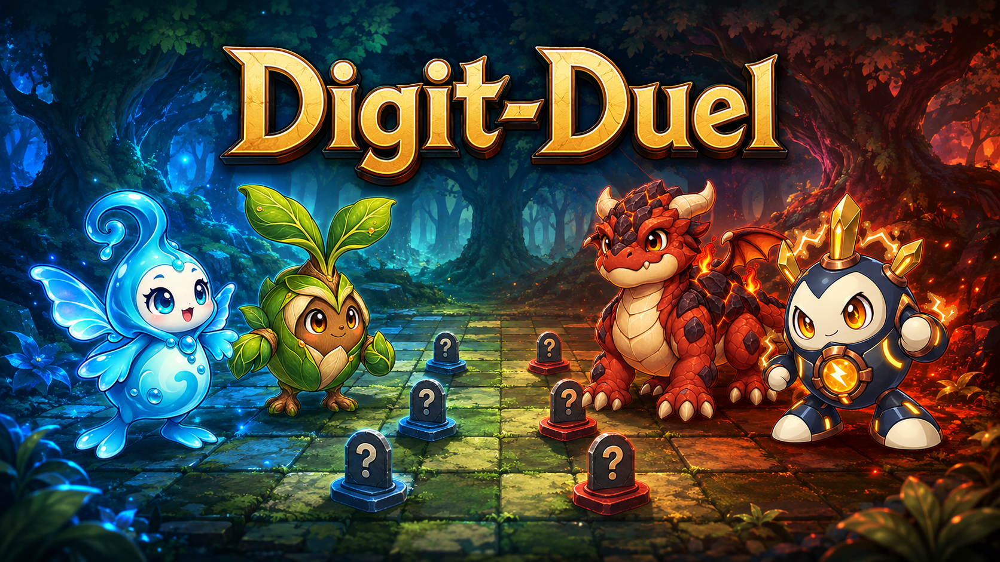
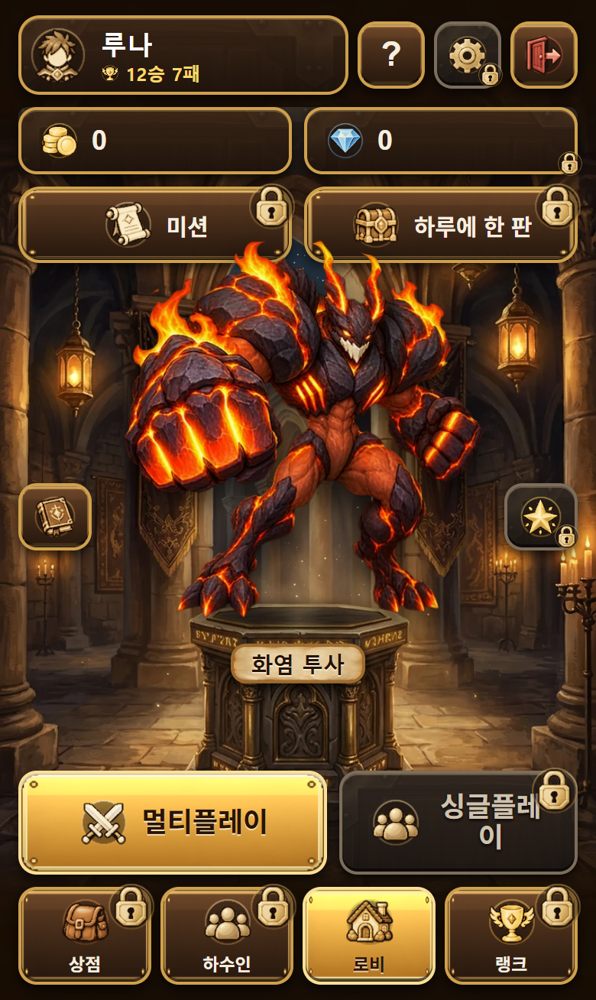
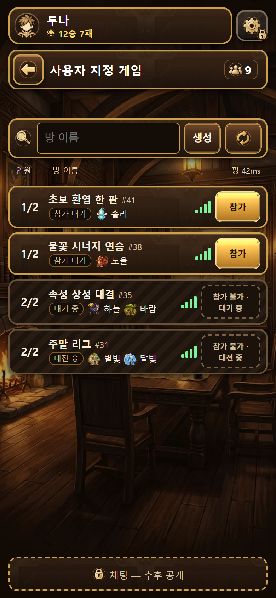
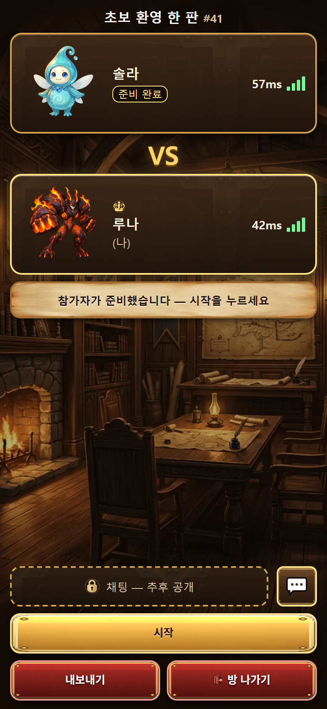
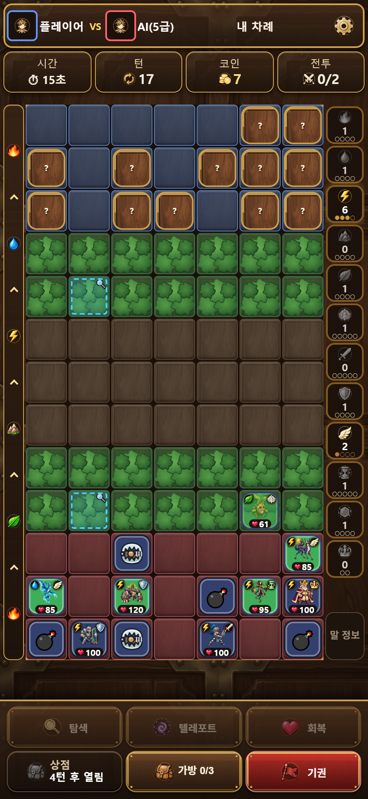
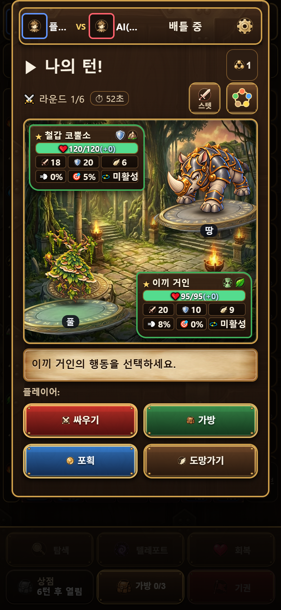
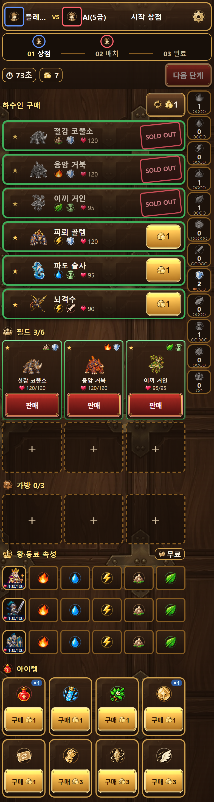
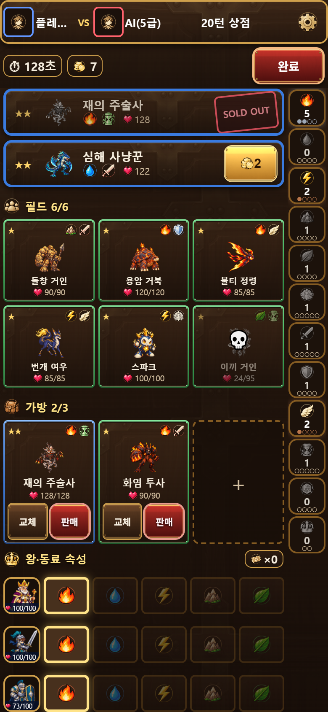

# Digit-Duel

  

  
  

**[▶ 정식 웹 게임](https://digit-duel.site)** · **[최신 정식 출시 v0.4.15](https://github.com/ChangjoSung/Digit-Duel/releases/tag/v0.4.15)**

> 이 README는 **v0.4.16 개발 브랜치**를 소개합니다. 아래 사진은 새 UI와 하수인 미술을 반영한 개발 화면이며, 정식 웹 게임은 v0.4.15입니다. 싱글플레이·튜토리얼 개편은 아직 준비 중입니다.

## 게임 소개

**상대 말의 정체를 추리하며 싸우는 2인 온라인 턴제 전략 보드게임입니다.** 각자 말 14개를 비밀리에 배치합니다. 상대 말은 물음표로 보이고, 숲에 들어간 말은 위치도 숨겨집니다. 하수인을 움직여 단서를 모으고 속성 전투로 상대를 제압하세요.

상대 왕을 쓰러뜨리거나, 내 왕을 상대 진영의 마지막 줄까지 보내거나, 상대의 하수인과 동료를 모두 제거하면 승리합니다.

## 게임 기능

- **구매와 비밀 배치** — 일반 하수인 30종 중 6명을 고르고 왕·동료·폭탄·함정과 함께 7열 × 13행 보드에 배치합니다. 회복 아이템과 몬스터 볼은 각각 1개씩 가지고 시작합니다.
- **정체 추리와 숲** — 표시된 수풀에서 탐색해 코인을 얻고 숨은 말을 추적합니다. 공개된 적 말은 소속 표시로 구분하고, 상대 말에는 나만 보는 추측 메모를 남길 수 있습니다.
- **속성 전투** — 불 → 풀 → 땅 → 번개 → 물 → 불의 상성과 스킬·가방·포획·도망을 활용합니다. 전투 후 HP는 유지되고 상태이상·쿨타임은 초기화됩니다.
- **성장과 시너지** — 턴 상점에서 하수인을 승급·교체하고 아이템을 구매합니다. 등급이 오르면 HP·공격력이 크게 증가하며, 왕국·아키타입 시너지로 전력을 조합합니다.
- **말 정보** — 내 말의 능력치·기술·미해금 기술을 확인합니다. 전투에서는 시너지 적용 능력치·왕국 효과 발동률·스텟 설명·속성 상성을 볼 수 있습니다.
- **공개 방과 전적** — 방 이름으로 검색해 대전하고 이모티콘 6종으로 반응합니다. 로비에서 대표 하수인·공식 승패·최근 20경기를 확인합니다.
- **테이블탑 판타지** — 원목·황동·양피지 UI와 성소·길드 회관·전술실 배경을 사용합니다. 일반 30종과 전설 3종 하수인이 회화풍 미니어처로 등장하고, 각자의 4번 대표기에 전용 효과가 재생됩니다.

## 게임 플레이 사진

v0.4.16 개발 화면입니다. 이미지를 누르면 원본 크기로 볼 수 있습니다.

<table>
  <tr>
    <td align="center" width="50%"> <b>로그인</b></td>
    <td align="center" width="50%"> <b>메인 로비</b></td>
  </tr>
  <tr>
    <td align="center" width="50%"> <b>공개 방 목록</b></td>
    <td align="center" width="50%"> <b>대기실</b></td>
  </tr>
  <tr>
    <td align="center" width="50%"> <b>전략 보드</b></td>
    <td align="center" width="50%"> <b>속성 전투</b></td>
  </tr>
  <tr>
    <td align="center" width="50%"> <b>시작 상점</b></td>
    <td align="center" width="50%"> <b>턴 상점</b></td>
  </tr>
</table>

## 새로운 기능

**v0.4.16 개발 중 — 테이블탑 판타지 UI와 하수인 미술 통일**

- **화면 전체의 미술 통일** — 로그인·로비·상점·보드·전투에 원목, 황동, 양피지 재질과 판타지 배경을 적용했습니다. 기존 화면 배치와 조작 흐름을 유지합니다.
- **33종 회화풍 하수인** — 초상화·소형 아이콘·좌석별 전투 모습을 같은 2D/2.5D 미니어처 화풍으로 연결했습니다. 로비 대표 선택은 일반 30종입니다.
- **전투 무대와 대표기 효과** — 아군은 뒤쪽에서, 상대는 앞쪽에서 바라보는 전투 뷰를 사용합니다. 일반 30종·전설 3종의 4번 대표기 성공에 맞춰 전용 효과를 표시합니다.
- **준비 중인 기능** — 싱글플레이 UI, 무제한 AI 대전, 왕국 9단계 PVE, 튜토리얼 개편은 별도 개발 예정입니다.

[v0.4.16 진행 현황](docs/milestone/v0.4.16/README.md) · [최신 정식 릴리스 노트](docs/releases/v0.4.15.md) · [이전 릴리스](docs/releases/README.md)

## 게임 정보

| 항목 | 내용 |
| --- | --- |
| Release Version | [v0.4.15](https://github.com/ChangjoSung/Digit-Duel/releases/tag/v0.4.15) |
| 개발 버전 | [v0.4.16](https://github.com/ChangjoSung/Digit-Duel/milestone/20) — UI·미술 개편 반영, 나머지 기능 준비 중 |
| 플레이 주소 | [digit-duel.site](https://digit-duel.site) |
| 장르·인원 | 숨은 정체·속성 전투를 결합한 온라인 1대1 턴제 전략 |
| 환경 | PC·휴대폰의 최신 브라우저, 인터넷과 가입용 이메일 |
| 플랫폼 | HTML 웹 게임 |
| 개발자 | 성창조 (Sung Changjo) |
| 첫 정식 출시 | 2026-09-02 (v0.3.0) |

## 플레이 방법

1. [게임 페이지](https://digit-duel.site)에서 가입하거나 ID·비밀번호로 로그인합니다.
2. 로비에서 **멀티플레이**를 누릅니다. 한 사람이 방을 만들고 상대가 참가합니다. 참가자가 준비하면 방장이 시작합니다.
3. 공통 **180초** 안에 시작 상점에서 하수인 6명을 고르고 왕·동료 속성을 정한 뒤 말 14개를 배치합니다. 양쪽이 준비를 마치면 바로 시작합니다.
4. 자기 차례 **30초** 안에 이동·탐색·회복·텔레포트를 선택합니다. 내 말의 정보는 오른쪽 **말 정보**에서 확인합니다.
5. 적과 맞붙으면 **60초** 안에 싸우기·가방·포획·도망을 선택합니다. 스텟 버튼으로 능력치 설명을 확인합니다. 가방이 가득 찬 포획 교체는 **30초**, 턴 상점의 구매·승급·교체는 **180초**입니다.
6. 세 가지 승리 조건 중 하나를 달성하고 로비에서 전적을 확인합니다.

위 순서는 현재 정식 웹 게임 기준입니다. 개발 브랜치에서도 싱글플레이·Google 로그인·로비 상점·채팅은 잠겨 있습니다. 서버 재시작 시 진행 중인 경기는 복구되지 않으며 확정된 계정·전적은 보존됩니다.

## 저장소 구조

~~~
demo/               웹 게임과 게임 자산
server/             계정·공개 방·경기 판정 서버
docs/releases/      버전별 릴리스 노트
docs/screenshots/   실제 게임 화면
~~~

## 라이선스

코드·문서는 [Apache License 2.0](LICENSE)입니다. 이름·아트·게임 화면의 이용 조건은 [ASSET-LICENSE.md](ASSET-LICENSE.md), 저작권 귀속은 [NOTICE](NOTICE)를 따릅니다.
