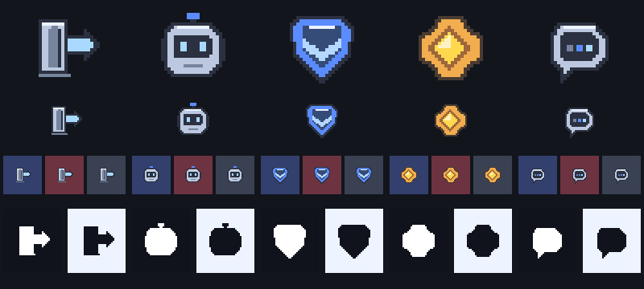
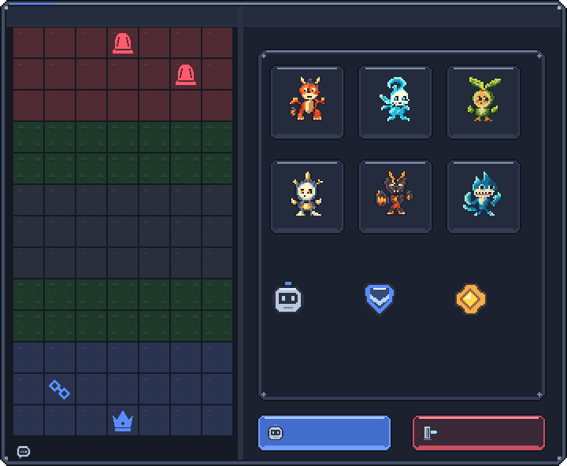
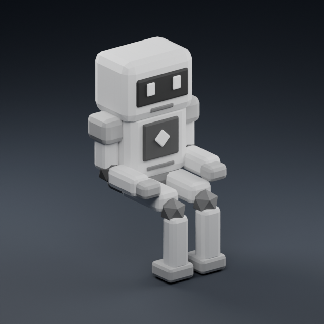
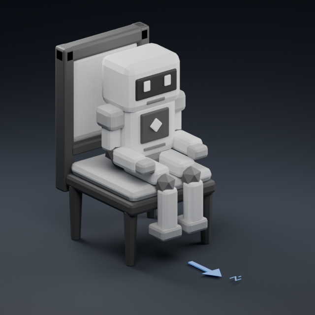

# [결정] Earth 납품 보고 — AI 봇·보드게임 창

2026-09-10 · Ref #118 / v0.4.6 Phase3 · Earth / IMPLEMENT / ART / assets·docs / instance_index null.

CJ 요청: docs/roblox/earth-ai-window-request.md를 확인하고 작업.
**필수8종 제작 완료: UI6PNG + 봇 알베도1PNG + 착석 로봇1종(FBX/OBJ/MTL).**
기존 기본 P0 129개와 별도 추가 납품이며 게임 구현·실제 업로드 완료를 뜻하지 않는다.
[클로드 적용 계약](../../../roblox/assets/ai-window-README.md) · [요청서](../../roblox/earth-ai-window-request.md) · [런타임10파일 해시](ai-window-source/delivery-manifest.csv).

## 1. 실제 납품물

| 묶음 | 결과 |
|---|---|
| panel_window |256×256 RGBA8, SliceCenter=(24,40,232,232) |
| exit / bot / ai_grade5 / ai_dan5 / thinking |각48×48 RGBA8, native24→2배,24/48px 표시 |
| bot_albedo |256×256 RGBA8, 불투명 회색 팔레트, 난이도 틴트용 |
| bot.fbx |1.8×3.2×1.8stud, **1,388정점·2,660삼각형**, 단일 메시/재질/UV |
| bot.obj + bot.mtl |동일 모델 대체·검사용, 상대 알베도 연결 |
| 편집·검수 원본 |native-assets.json, asset-contract.json, ai-window.blend, delivery-manifest.csv |
| 검토 이미지 |아이콘1 + 창3 + 로봇5 =9PNG |

런타임 PNG7개 합계 **8,347bytes**, FBX/OBJ/MTL을 포함한10파일 합계 **240,720bytes**.
추가 파일은 정확한 요청 경로에 있으며 기존 자산의 파일명·키·PNG를 변경하지 않았다.
선택사항인 thinking4프레임 시트는 제작하지 않았고 **필수 정적 thinking은 완료**다.
기존 타일 재제작, P1/P2, 봇 이름·성격·로고/워드마크는 이번 범위가 아니다.

## 2. 제작 지시·방법·디자인 근거

제작에 사용한 정규화 지시:

> 기존 다크 픽셀 UI와 같은 어휘로256px 창 프레임,24px 원고의 출구·로봇 얼굴·파랑5급 배지·금색5단 배지·정적 사고 표시를 제작한다.
> 글자·이모지·단색 사각 배경을 아이콘에 굽지 않고,2px 납품 외곽선과 투명을 유지한다.
> 창은720×592의 제목/왼쪽 판/오른쪽 패널을 구분하고 실제 제목과 판의 y경계에 맞춘다.
> 봇은 둥근 저폴리 공통 로봇으로 앉은 자세, 큰 머리와 슬롯 눈, 손은 허벅지 위에 둔다.
> 높이3.2·폭1.8 이하·3000tri 이하, 엉덩이 지지면 피벗, 출력Y-up/-Z정면, 회색 알베도로 두 난이도 색을 곱한다.
> 특정 IP의 얼굴·실루엣·배색, 캐릭터 설정, 게임 규칙 변경은 넣지 않는다.

기존 repo-native 픽셀 체계 확장이므로 imagegen을 사용하지 않았다.
사용자가 허용한 **Blender 내부 아트 명령**으로 원고·메시·UV·회색 재질·내보내기·검토 렌더를 만들었다.
별도 Python/JS/Luau 제작 도구나 테스트 파일은 만들지 않았다.
문서화 스킬을 활용해 파일 키·표시 규격·코드 연결 차이·검수 한계를 전용 README로 정리했다.

- 5급은 파랑 방패/단일 갈매기표,5단은 금색 로제트/마름모로 색과 실루엣 모두 구분한다.
- 배지에는 글자를 굽지 않는다. 이름이 결정될 때까지 코드가 “5급/5단”을 병기한다.
- 출구는 문/바깥 방향 화살표, 봇은 슬롯 눈의 각진 둥근 얼굴, thinking은 세 개의 처리 표시가 있는 말풍선이다.
- 창은 요청의 #181b25 계열과 기존 UI의 #242b3d, #5b8cff를 계승했다.
- 작은 메시 베벨과 몸통/관절 명도 차이는 회색 알베도와 실제 기하로 표현했다. 조명·그림자를 텍스처에 굽지 않았다.
- 알베도는16개 회색 값만 사용한다. 재질 패치의 의도적 UV 겹침은 라이트맵용이 아니다.
- 5급 렌더 틴트는 #8eb2ff,5단은 #ffcf82. 별도 등급 메시 없이 동일 형태를 재사용한다.

## 3. 이미지 검토



왼쪽부터 exit / bot / ai_grade5 / ai_dan5 / thinking.
위에서96px 확대, 실제48px, 아군/적군/미공개 배경24px, 흰/검정48px 실루엣이다.
이번48px 아이콘은 native24여서 **24/48 표시가 모두 정수 배율**이다.
2D6PNG는 tint=no, ImageColor3 흰색, ResampleMode=Pixelated다.



실제 납품PNG와 기존 타일·하수인·토큰으로 만든 **아트 조합 검토**다.
게임 스크린샷·적법한 배치 상태·확정 모바일 레이아웃이 아니며 텍스트·HP·입력은 생략했다.
현행 판280×520, 셀40, 판 위치(16,34), 오른쪽 패널 시작x316에 맞췄다.
타일은 요청대로 기존128PNG를 사용했고 새로 출력하지 않았다.

[720×592 9-slice](review/ai-window/window-slice-720x592.png) · [960×720 모서리 스트레스 검사](review/ai-window/window-slice-960x720.png).

SliceCenter=(24,40,232,232), SliceScale=1. 좌표는 패딩값이 아닌 중앙 사각형이다.
720폭에서 중앙 구분선은 **x302..308,7px**로 판 끝296/패널 시작316 사이에 있다.
960폭에서는x402..409,8px가 되므로 **960검토는 모서리 보존만 의미**하며720용 칼럼을 고정한 채 재사용하면 안 된다.
제목 그래픽은y34 전에 끝나고 SliceTop40은 위쪽 고정 캡을 보존한다.
가변폭 칼럼이 필요해지면 분리선 별도 레이어 등의 후속 구현/자산 요청으로 다룬다.

## 4. 로봇·착석·정면



[5급 파랑](review/ai-window/bot-grade5.png) · [5단 금색](review/ai-window/bot-dan5.png).



[옆면 착석 검토](review/ai-window/bot-side-fit.png).
기존 의자 원본을 복제해 검토 장면에만 사용했다. 의자·화살표·-Z 라벨은 런타임 bot.fbx에 포함하지 않았다.

- 출력축Y-up / 정면-Z /1unit=1stud.
- Roblox 좌표 bounds=(-0.9,-1,-1.35)..(0.9,2.2,0.45), 피벗=(0,0,0) 엉덩이 지지면.
- 외접 상자 중심=(0,0.6,-0.45), 크기=(1.8,3.2,1.8).
- Blender 편집축은(X,-Z,Y) 대응, 출력에는 -Z Forward/Y Up과 bake_space_transform=True를 적용했다.
- 피벗 보존 시 seat.CFrame의 (0,0.25,0)에 놓는다. 외접 상자 중심 MeshPart는 **(0,0.85,-0.45)**를 사용한다.
- 높이3.2와 기존 의자 치수를 지켜 발바닥은 바닥에서 약0.5stud 위인 작은 로봇 착석 자세다.
- 원고의 편집 파트는 유지하고 런타임은 단일 메시로 합쳤다. FBX/OBJ는 상대 textures/bot_albedo.png와 함께 둔다.

## 5. QA 이력과 판정 범위

독립 검수: Saturn / saturn_ai_window / mode QA / mutation none.
최종2660tri 수정본의 기술·시각·문서·경로 검수 모두 **PASS**다. Studio·게임 적용 QA는 별도다.

| 검수 | 확인 결과 |
|---|---|
| UI6개 원고↔PNG 최근접2배 RGBA |전 픽셀 불일치0 |
| RGBA8·크기·0/255알파·색 수·24/48px |PASS |
| 배지 형태/색,아이콘 흑백·세 배경 |정적 육안 PASS |
| 9-slice2크기, 원본9패치 매핑 |RGBA 전체1,117,440픽셀 오차0 |
| 9-slice 모서리 |6,144픽셀 오차0 |
| 알베도 |256×256,회색16값,유색0,알파255 |
| 모델 최종 메인 검사 |2660tri,퇴화0,nonmanifold0,양의 체적3.17937694 |
| FBX/OBJ 재반입 최종 |각1388vert/2660tri,퇴화면·퇴화UV·경계·nonmanifold0,좌표 오차 최대8.99e-7 |
| Blender 원본 |신규7이미지 packed/fake user,원고6·슬라이스2사례 보존 |
| manifest |기존129/13행과 헤더 prefix 보존,뒤에6/2행 추가 |
| 업로더 dry-run |151대상,신규Image7·Model1,기존143재사용 |
| 문서·납품 경로 |MD8개/로컬링크197개 누락0,변경33경로 고유·실재·범위 일치 |

**수정 이력:** 초기2780tri 모델에서 얇은 베벨의 극소/퇴화 삼각형120개가 독립 검수에 걸렸다.
최종본은0.0001stud 이내 중복 정점 정리와 퇴화 변 제거·삼각분할·법선 재계산으로
1388정점/2660tri로 수정했다. 편집 파트·내보내기 메시·프리뷰 모두 동기화하고 FBX/OBJ·5개 로봇 렌더를 재출력했다.
처음 OBJ의 알베도 상대 경로가 잘못 나와 외부PNG 참조로 재출력했고, 최종 MTL은 ../textures/bot_albedo.png다.
중간본 실패를 최종 통과로 세지 않는다.

**미실시:** Studio 실제 반입·업로드 승인·최신 서버/클라이언트 렌더·입력·등급 변경·기기별 UI·실플레이·전체 정보 은닉 보안·포괄적 IP 권리 조사.
정적 아트 검수는 게임 적용 검수와 분리한다.

## 6. Mars 적용 인계·보존

[전용 적용 계약](../../../roblox/assets/ai-window-README.md)에 정확한8개 업로드 키와 좌표를 기록했다.
root manifest는135PNG, lobby manifest는15행이며 token model manifest는 보존했다.
루트는18열/status=delivered, 로비는 기존14열에 status가 없어 **새 행 notes의 status=delivered**로 기록했다.
필수8종은 실제 업로드8대상(Image7·Model1)이며 OBJ/MTL은 추가 업로드하지 않는다.

업로드만으로 해결되지 않는 현재 연결 사항:

1. panel_window가 기존128px 패널의 SliceCenter를 참조하므로 전용좌표 추가 필요.
2. 배지2종/thinking은 접근 함수만 있고 실제 UI 호출은 없어 새 연결 필요.
3. 봇은 현재 발밑을 좌석 위에 놓는 bbox배치라 hip/bbox 오프셋 보정 필요.
4. 봇 색이 현재 좌석 A/B 기준이므로 난이도별 파랑/금색 틴트와 배지 병기 필요.
5. Studio에서 정면-Z,이름표 높이,이미지/메시 실패 폴백,나가기·봇 교체를 확인해야 한다.

작업 시작/현재 확인 HEAD는840d267f397d16cf38c7367b4d69e3969c2b4233,브랜치dev다.
Earth는 Git 쓰기 없이 공유 작업 폴더의 아트·문서만 변경했다.
작업 중 다른 작업자가 Ai/Battle/Config/Data/Engine/Views.luau와 roblox/tests/run.luau를 수정한 상태를 확인했고 그 변경은 보존했다. 공유 작업이 계속되므로 이 목록을 저장소 전체의 고정된 완료 상태로 해석하지 않는다.
“모든 코드가 시작과 바이트 동일”이라고 주장하지 않으며 **Earth/Saturn의 코드 수정은0건**이다.
기존 납품 이미지·모델은 보존했고, 두 manifest는 기존행 변경 없이 이번 행만 추가했다.

[기획 필요]: 봇 이름·성격,제목 띠 로고/워드마크. 임의 이름/캐릭터 설정/브랜드 아트를 추가하지 않았다.
선택4프레임 thinking은 미제작이며 필수 정적본은 납품했다.

## 7. 라이선스·출처

신규 시각 아트·원고·렌더는 [ASSET-LICENSE.md](../../../ASSET-LICENSE.md)에 따라 **Apache-2.0 제외**.
Copyright 2026 Sung Changjo and the respective contributors. All rights reserved.
외부 소재팩·브랜드·플랫폼 이모지·런타임 폰트 글리프를 사용하지 않았다.
검토 이미지의 좌표 라벨-Z만 Blender 내장 기본 폰트이며 게임 자산에는 없다.
imagegen/외부 생성 API 사용0건. 육안 IP 비연상 검토가 포괄적 권리 보증은 아니다.

## 8. worker_done → Mercury

workspace C:/WOOK/pvpserver 기준 실제 경로33개를 열거한다. 코드·도구·테스트 파일은 없다.
10개 런타임 파일의 전체 SHA-256은 [delivery-manifest.csv](ai-window-source/delivery-manifest.csv),
원고 SHA는 루트 manifest, Blender SHA는 로비 신규행 notes에 있다.

```yaml
worker_done:
  role: Earth
  required_role: Earth
  mode: IMPLEMENT
  area: ART
  mutation: assets / docs
  instance_index: null
  dispatch_ref: "#118 AI 봇·보드게임 창 아트"
  status: completed
  files_modified:
    - "client/roblox/assets/actions/exit_48.png"
    - "client/roblox/assets/actions/bot_48.png"
    - "client/roblox/assets/badges/ai_grade5_48.png"
    - "client/roblox/assets/badges/ai_dan5_48.png"
    - "client/roblox/assets/status/thinking_48.png"
    - "client/roblox/assets/ui/panel_window.png"
    - "client/roblox/assets/lobby/meshes/bot.fbx"
    - "client/roblox/assets/lobby/meshes/bot.obj"
    - "client/roblox/assets/lobby/meshes/bot.mtl"
    - "client/roblox/assets/lobby/textures/bot_albedo.png"
    - "client/docs/art/roblox-v0.5.0/review/ai-window/icons-proof.png"
    - "client/docs/art/roblox-v0.5.0/review/ai-window/window-slice-720x592.png"
    - "client/docs/art/roblox-v0.5.0/review/ai-window/window-slice-960x720.png"
    - "client/docs/art/roblox-v0.5.0/review/ai-window/window-composition.png"
    - "client/docs/art/roblox-v0.5.0/review/ai-window/bot-neutral.png"
    - "client/docs/art/roblox-v0.5.0/review/ai-window/bot-grade5.png"
    - "client/docs/art/roblox-v0.5.0/review/ai-window/bot-dan5.png"
    - "client/docs/art/roblox-v0.5.0/review/ai-window/bot-chair-fit.png"
    - "client/docs/art/roblox-v0.5.0/review/ai-window/bot-side-fit.png"
    - "client/docs/art/roblox-v0.5.0/ai-window-source/native-assets.json"
    - "client/docs/art/roblox-v0.5.0/ai-window-source/asset-contract.json"
    - "client/docs/art/roblox-v0.5.0/ai-window-source/ai-window.blend"
    - "client/docs/art/roblox-v0.5.0/ai-window-source/delivery-manifest.csv"
    - "client/roblox/assets/manifest.csv"
    - "client/roblox/assets/lobby/manifest.csv"
    - "client/roblox/assets/ai-window-README.md"
    - "client/roblox/assets/README.md"
    - "client/roblox/assets/ui/README.md"
    - "client/roblox/assets/lobby/README.md"
    - "client/docs/art/roblox-v0.5.0/README.md"
    - "client/docs/roblox/claude-art-apply-handoff.md"
    - "client/docs/roblox/earth-ai-window-request.md"
    - "client/docs/art/roblox-v0.5.0/earth-ai-window-report.md"
  summary: |
    필수8종: UI6PNG+알베도1PNG+로봇1종(FBX/OBJ/MTL).
    PNG7개8347bytes,런타임10파일240720bytes. 최종봇1388vert2660tri,hip피벗,-Z정면.
    root135행/lobby15행;기존행보존. source4파일·preview9PNG 및인계문서.
    선택4프레임thinking미제작,정적본완료. 기존아트·동시코드변경보존.
  qa_result: "Saturn 최종 PASS — UI·slice·2660tri 모델 재반입·manifest·문서·33경로; Studio/실플레이 별도"
  requests_to_mars: |
    전용 README대로 신규Image7·Model1 업로드·연결. 기존143대상재사용.
    창SliceCenter·봇hip/bbox배치·등급틴트·배지/thinking실제호출 보완.
    Studio 실제축·크기·착석·입력·폴백·기기별화면검증.
  planning_needed:
    - "봇 이름·성격"
    - "제목 띠 로고/워드마크"
  not_delivered: ["선택4프레임 thinking 시트"]
  external_writes: "없음 — 업로드·Git 쓰기·외부 게시0건"
```
