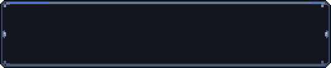
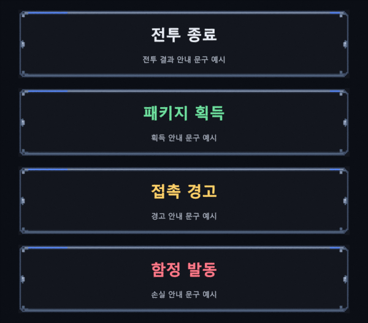

# [결정] Earth 납품 보고 — 중앙 배너

2026-09-10 · Ref #118 / v0.4.6 · Earth / IMPLEMENT / ART / assets·docs / instance_index null.

CJ의 [earth-banner-request.md](../../roblox/earth-banner-request.md) 작업 지시에 따라 **필수 공통 배너1PNG를 납품**했다.
선택 banner_good/banner_bad는 제작하지 않았다. 공통 배경에 코드가 제목색을 바꾸는 현재 방식을 그대로 쓴다.
게임 규칙·1.2초 표시 시간·문구·레이아웃·코드는 변경하지 않았다.

## 납품과 Mars 적용

| 항목 | 값 |
|---|---|
| 파일 |[roblox/assets/ui/banner.png](../../../roblox/assets/ui/banner.png) |
| 키 |**ui_banner** — kind=ui, id=banner, Art.ui("banner") |
| PNG |256×128, RGBA8, 알파0/255, **1,788bytes** |
| 원고 |native128×64 →최근접2배 |
| 실제 표시 |**540×112**, 작은 화면의 기존 UIScale 비례 축소 유지 |
| ScaleType / SliceScale |Slice /1 |
| **SliceCenter** |**(16,16,112,112)** |
| ImageColor3 / ResampleMode |흰색 / Pixelated |
| tint |no — 배경·테두리에 상황별 색을 곱하지 않음 |
| 업로드 |Mars 담당, Earth 실제 업로드0건 |

이 좌표는 패딩4개가 아닌 원본 중앙 사각형의 L/T/R/B 좌표다.
**256×128 원본에서 고정 캡은 좌16·상16·우144·하16**이다.
오른쪽144px 대부분은 장식 없는 평평한 바탕이며, 중앙96×96을540×112 표시의380×80으로 늘린다.
좌우 캡이 비대칭인 것은 현행 Art.SLICE.panel=(16,16,112,112)와
bgImage(bannerFrame,"banner","panel",1)를 **코드 변경 없이 그대로 쓰기 위한 제작 선택**이다.
오른쪽 장식의 좌우 위치는 고정 캡 안에서 보존되므로 늘어지지 않는다.

현재 코드/HEAD 기준으로 새 키가 채워지면 banner 조회가 기존 panel_modal 폴백보다 먼저 쓰인다.
SliceCenter를 임의로(16,16,240,112) 등으로 바꾸거나 기존 panel 좌표를 수정할 필요가 없다.
업로드 후에는 Studio에서 실제 이미지 로드·UIScale·글꼴·표시 큐를 확인한다. 정적 연결 검토가 실제 게임 적용 PASS를 뜻하지 않는다.

## 디자인·제작 지시

기존 panel_side/panel_window의 어두운 픽셀 톤을 계승한 낮은 현판이다.
가늘고 차분한 푸른 회색 테두리, 상단 양끝의 짧은 파랑 포인트, 좌우 작은 리벳만 두고 중앙은 **#13161e**로 평평하게 했다.
로고·워드마크·텍스트·이모지는 런타임 PNG에 없다.

제작에 사용한 정규화 지시:

> 기존 다크 픽셀 UI와 같은 색 어휘의 가로형 배너 프레임1장을 만든다.
> 256×128 PNG, 원고128×64 정수2배, 알파0/255, 기존 코드 SliceCenter16,16,112,112에 호환시킨다.
> 540×112로 늘려도 모서리와 좌우 리벳은 유지하고, 제목/설명 전체 사각형에는 장식을 넣지 않는다.
> 기본·획득·경고·손실 제목색과 대비되는 #13161e 바탕을 사용한다.
> 별도 상황별 배경·로고·게임 문구나 규칙은 만들지 않는다.

제작은 **기존 repo-native 픽셀 체계 확장 + 사용자에게 허용된 Blender 내부 아트 명령**으로 진행했다.
imagegen/외부 이미지 API·외부 소재팩은 사용하지 않았다. 별도 코드·도구·테스트 파일도 추가하지 않았다.
문서화 스킬로 키·슬라이스·검수 한계를 이 보고서에 모았다.

- [native-assets.json](banner-source/native-assets.json): 편집 기준 원고1개, 팔레트·픽셀 행·출력 크기·SliceCenter·텍스트 안전 영역.
- [review-layout.json](banner-source/review-layout.json): 두 늘림 크기와4색 글자 목업 위치·폰트·예문.
- 이번 작은 픽셀 자산의 편집 원본은 JSON이며 별도 .blend/폰트 파일은 납품하지 않는다.

## 검수 이미지·텍스트 안전 영역



[720×112 추가 늘림 검사](review/banner/banner-720x112.png).
위 두 이미지는 실제 납품PNG를9패치 **floor-index nearest**(대상 오프셋×원본 구간/대상 구간의 내림) 매핑한 정적 검토 이미지다.
픽셀 중심을 기준으로 하는 Pillow 등의 최근접 표본과 일부 경계 픽셀이 다를 수 있다. Roblox 렌더 결과와 픽셀 완전 일치한다는 증빙은 아니다.

| 영역 | 좌표(오른쪽/아래 배타적) | 검사 |
|---|---|---|
| 제목 |x12..528,y18..62 |전체 바탕 #13161e |
| 설명 |x12..528,y64..98 |전체 바탕 #13161e |
| 두 영역 합계 |40,248픽셀 |장식·불균일 픽셀0 |



위부터 기본 / 획득 / 경고 / 손실. 각 배너는540×112, 제목30px·설명14px 설정의 검토 예문이다.
Windows에 설치된 맑은 고딕/맑은 고딕 Bold를 Blender에서 렌더했다.
**Roblox Gotham·한국어 폴백의 실제 화면이 아니며**, 실제 글꼴·말줄임·TextStroke·UIScale·시간별 애니메이션은 Studio에서 별도 검수한다.
폰트 파일을 복사·패킹·납품하지 않았다. 글자가 든 목업은 docs 검토 자료이며 게임 자산이 아니다.

원래 sRGB 코드값과 #13161e 바탕의 상대 휘도 대비를 계산했다(렌더 조명/화면 캡처 측정이 아님).

| 글자색 | 계산 대비 |
|---|---:|
| 기본 #e8ecf5 |15.28:1 |
| 획득 #6fe0a0 |11.06:1 |
| 경고 #ffd16a |12.56:1 |
| 손실 #ff7a8a |7.24:1 |
| 설명 #b4bccd |9.49:1 |

전체 텍스트 박스를 비워 두었으므로 예문뿐 아니라 그 영역 안에서 렌더되는 긴 제목·설명도 장식을 만나지 않는다.
이것이 실제 긴 문구의 말줄임/줄바꿈이 올바르다는 구현 검증을 대신하지는 않는다.

## 검증·보존·남은 범위

**독립 Saturn 정적 아트 QA PASS**. 검수자는 파일을 수정하지 않았다.
PNG 규격·원고2배 픽셀 일치·두 늘림 이미지의 floor-nearest 재계산(전체 픽셀 불일치0)·텍스트 안전 영역·4색 한국어 목업을 독립 확인했다.
manifest의 기존 헤더와135행 원문57,081bytes 보존, 기존 자산·원고·코드 보존, 보고서의 해시·수량·제약 설명과 업로더 dry-run도 확인했다.
실제 업로드와 Studio 표시는 이 PASS 범위에 포함하지 않는다.

- 메인: PNG 규격·0/255알파, native2배, 실제540×112의 텍스트40,248픽셀 평탄성 확인.
- 메인: 두 늘림 이미지와4색 한국어 목업을 육안 확인. 최초 목업 카메라 배율을 수정해 최종540×112 크기로 재렌더했다.
- 루트 manifest는 **기존135행과 헤더를 보존**하고 delivered1행만 추가(현재136행/18열).
- 로비·토큰 모델 manifest와 기존 개별 납품 아트는 변경하지 않았다.
- 현행 업로더 dry-run: **152대상 / 신규 Image1 / 기존151 재사용 / 신규 Model0**.
- 실제 업로드·asset ID 파일 수정·Git 쓰기·외부 게시0건.
- 작업 시작 HEAD697212e515f4621dd10d765ddefd53bf471b7e55,dev,clean. 최종 상태는 공유 작업과 분리해 확인한다.
- Studio 실표시·기기별 폰트·UIScale·배너 큐/입력·실플레이·포괄적 권리 조사는 미실시.
- 선택 good/bad 변형은 미제작이다. 이번 공통 중앙배너1장은 앞선 요청의 P1 FX·배너 전체 완료를 뜻하지 않는다.
- [기획 필요] 로고/워드마크 사용 여부. 승인 전까지 넣지 않았다.

## 해시·라이선스

- banner.png SHA-256: **6c3163b026366e67e35d812da54b718cbe53441f2a6f21bcb10acf243bb964fc**
- native-assets.json SHA-256: **a3ec14ab19119291d735d0e489968812be9b929c987d7cdbe0cfc53804961434**
- PNG bytes/SHA 및 source SHA는 [manifest](../../../roblox/assets/manifest.csv)의 ui_banner 행과 같다.

신규 프레임·원고·검토 이미지는 [ASSET-LICENSE.md](../../../ASSET-LICENSE.md)에 따라 **Apache-2.0 제외**다.
Copyright 2026 Sung Changjo and the respective contributors. All rights reserved.
런타임 이미지에는 외부 소재·폰트·이모지 글리프를 사용하지 않았다. 검토용 Windows 폰트는 재배포하지 않는다.

## worker_done → Mercury

경로는 workspace C:/WOOK/pvpserver 기준이며 실제 저장소는 client다.12개를 각각 열거한다.

```yaml
worker_done:
  role: Earth
  required_role: Earth
  mode: IMPLEMENT
  area: ART
  mutation: assets / docs
  instance_index: null
  dispatch_ref: "#118 중앙 배너 필수1종"
  status: completed
  files_modified:
    - "client/roblox/assets/ui/banner.png"
    - "client/roblox/assets/manifest.csv"
    - "client/docs/art/roblox-v0.5.0/banner-source/native-assets.json"
    - "client/docs/art/roblox-v0.5.0/banner-source/review-layout.json"
    - "client/docs/art/roblox-v0.5.0/review/banner/banner-540x112.png"
    - "client/docs/art/roblox-v0.5.0/review/banner/banner-720x112.png"
    - "client/docs/art/roblox-v0.5.0/review/banner/banner-text-tones.png"
    - "client/docs/art/roblox-v0.5.0/earth-banner-report.md"
    - "client/docs/art/roblox-v0.5.0/README.md"
    - "client/docs/roblox/earth-banner-request.md"
    - "client/roblox/assets/README.md"
    - "client/roblox/assets/ui/README.md"
  asset_key: ui_banner
  asset_sha256: "6c3163b026366e67e35d812da54b718cbe53441f2a6f21bcb10acf243bb964fc"
  source_sha256: "a3ec14ab19119291d735d0e489968812be9b929c987d7cdbe0cfc53804961434"
  slice_center: [16,16,112,112]
  slice_scale: 1
  summary: |
    필수banner.png1장,256x128 RGBA8/1788bytes. 원고128x64 최근접2배.
    현재코드의panel슬라이스와호환. 텍스트영역평탄성·4색대비·540x112목업검수.
    원고JSON2개·검토PNG3개·manifest136행. 기존아트/코드보존.
  qa_result: "PASS — Saturn 독립 정적 아트·manifest·납품 문서 검수. 업로드·Studio 실표시는 별도."
  requests_to_mars: "신규Image1 업로드·ID갱신 후 Studio 폰트/축소/배너 큐 표시 검수. 코드슬라이스변경불필요."
  not_delivered: ["선택 banner_good", "선택 banner_bad"]
  planning_needed: ["로고/워드마크 사용 여부"]
  external_writes: "없음 — 업로드·Git 쓰기·외부 게시0건"
```
