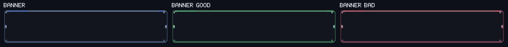
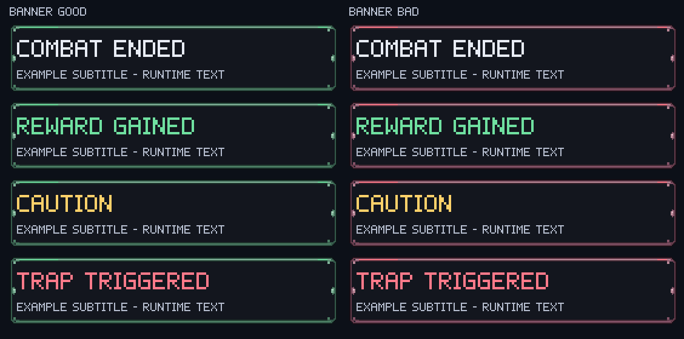

# [결정] Earth 납품 보고 — 배너 초록·빨강 변형

2026-09-10 · Ref #118 · Earth / IMPLEMENT / ART / assets·docs / instance_index null.
[earth-banner-variants-request.md](../../roblox/earth-banner-variants-request.md)의 **2PNG/3,573bytes 전량 납품**.
동시 작업한 [전투 FX·메모15PNG](earth-fx-report.md)는 별도 보고한다.

## Mars 적용 값

| 키 | 파일 | 크기 | SliceCenter | 기타 |
|---|---|---|---|---|
| ui_banner_good | [banner_good.png](../../../roblox/assets/ui/banner_good.png) |256×128 |**16,16,112,112** |tint=no |
| ui_banner_bad | [banner_bad.png](../../../roblox/assets/ui/banner_bad.png) |256×128 |**16,16,112,112** |tint=no |

공통 배너와 동일하게 **540×112 / ScaleType Slice / SliceScale1 / ImageColor3 흰색 / ResampleMode Pixelated**.
RGBA8, 알파0/255, native128×64 최근접2배다.
좌표는 패딩이 아닌 원본 중앙 사각형 L/T/R/B이며, 고정 캡은 **좌16·상16·우144·하16**이다. 기존 panel 좌표를 바꾸지 않는다.

`Art.ui("banner_good")`, `Art.ui("banner_bad")` 키로 배경을 교체한다. 어떤 사건을 good/bad로 분류할지는 Mars/CJ 범위이며 이번 아트에서 코드 분류를 정하지 않았다.
원본 [banner.png](../../../roblox/assets/ui/banner.png)와 기존 manifest 행은 변경하지 않았다. 로고·워드마크·글자·이모지는 넣지 않았다.

## 공통·good·bad 비교



540×112 개별 PNG:
[공통](review/banner-variants/banner-540x112.png) · [초록](review/banner-variants/banner_good-540x112.png) · [빨강](review/banner-variants/banner_bad-540x112.png).

최종 PNG를 읽어 floor-index nearest 방식으로 9패치한 정적 검토 이미지다. Roblox 런타임 리샘플러와의 픽셀 완전 일치 증빙은 아니다.
**모든 픽셀의 실루엣·알파·원고 기호가 같고 팔레트만 바꿨다.** 테두리·리벳·포인트 위치는 동일하다.
중앙은 두 변형 모두 공통의 **#13161e를 정확히 유지**했다. 움직임이나 정보량이 바뀌지 않는다.

| 원고 기호 | 공통 | good | bad |
|---|---|---|---|
| 바탕 b |#13161e |#13161e |#13161e |
| 외곽 o |#0c1018 |#0c1415 |#180e15 |
| 테두리 e |#3f4c65 |#355b4b |#633b4b |
| 밝은 림 r |#8493ae |#83b59b |#ba8998 |
| 베벨 d |#262e3e |#20382e |#3c252f |
| 리벳 s |#536580 |#4d8065 |#855368 |
| 포인트 a |#5b8cff |#6fe0a0 |#ff7a8a |
| 하이라이트 h |#b6c2d8 |#b6ddc7 |#e0bec9 |

## 글자 영역과 대비

제목 x12..528,y18..62 및 설명 x12..528,y64..98(오른쪽/아래 배타적), 합계 **40,248픽셀** 모두 #13161e.
변형마다 장식·불균일 픽셀0. 아래는 sRGB 상대 휘도 계산이며 화면 캡처 측정이 아니다.

| 런타임 글자색 | good 대비 | bad 대비 |
|---|---:|---:|
| 기본 #e8ecf5 |15.28:1 |15.28:1 |
| 획득 #6fe0a0 |11.06:1 |11.06:1 |
| 경고 #ffd16a |12.56:1 |12.56:1 |
| 손실 #ff7a8a |7.24:1 |7.24:1 |
| 설명 #b4bccd |9.49:1 |9.49:1 |



목업은 검토용 자체 픽셀 영문 글리프(제목 잉크 높이28px·설명14px)다. **Roblox Gotham30px·한국어 폴백·TextStroke·긴 글자 말줄임의 실제 화면이 아니다.**
그림 자체의 안전 영역은 전체 텍스트 박스로 검증했다. 폰트·UIScale·배너 큐는 Studio 후속 확인 대상이다.
[검토 좌표·글리프 데이터](fx-source/review-layout.json)는 같은 작업의 FX 보고서에서 함께 납품한다.

## 원고·제작·라이선스

[편집 원고 native-assets.json](banner-variants-source/native-assets.json)은 [기존 공통 원고](banner-source/native-assets.json)의 픽셀 행을 그대로 복제하고 팔레트만 치환한 데이터다.
기존 repo-native 편집 가능 UI를 수정하는 작업이므로 **imagegen 스킬의 예외에 따라 배너는 이미지 재생성을 하지 않았다.**
Blender 내부 아트 명령으로 PNG를 출력했으며 기존 .blend를 덮어쓰지 않았다. 편집 기준은 JSON이고 새 .blend/폰트 파일 납품은 없다.
제작 지시: “공통 배너의 픽셀 기호·실루엣·슬라이스·바탕을 보존하고, 테두리/리벳/포인트만 각각 초록과 빨강으로 치환. 글자/로고 없음.”

원고 SHA-256: `933a057caa6b829cb6b31623c1165ce2e08ee6fc591b9dc900b3991a360871da`.
기존 공통 PNG SHA-256 유지: `6c3163b026366e67e35d812da54b718cbe53441f2a6f21bcb10acf243bb964fc`.

| PNG | bytes | SHA-256 |
|---|---:|---|
| banner_good.png | 1787 | `7006f8afb207e0d6f63c0adbe06b9d785338f47d8e78b1f807be811ba9bd19d3` |
| banner_bad.png | 1786 | `c39449f7169813bf05adfd87d63fa23138d4cf8c75657e764f44d4bc20f2cf3b` |

신규 PNG·원고·검토 이미지는 [ASSET-LICENSE.md](../../../ASSET-LICENSE.md)에 따라 **Apache-2.0 제외**.
Copyright 2026 Sung Changjo and the respective contributors. All rights reserved.
외부 소재·폰트 파일·플랫폼 이모지를 사용하지 않았다. 문서화 스킬로 적용 값·검수 한계·인계 경로를 정리했다.

## 검증·상태

**Saturn 독립 정적 아트·manifest·납품 문서 최종 QA PASS**. 검수자 파일 수정0건.
540×112 개별3장과 비교 이미지의 독립 floor-index 재구성 차이0, 기존 manifest 원문 보존, 해시·수량·56개 인계 경로와198개 로컬 링크를 확인했다. Studio·동적 표시 검증은 별도다.
형태/알파/원고 정수2배 일치, 픽셀별 일관된 색상 치환, 글자 영역·대비를 독립 확인했다.
root manifest의 기존136행/헤더를 보존하고 **이 배너2행과 동시 FX/메모15행**만 추가했다(153행/18열).
업로더 합계169대상(Image161·Model8), dry-run **신규 Image17·Model0·기존152 재사용**. Earth 실제 업로드·ID 발급0건.

시작 HEAD e9a4c24821197db568dc6b897471ca5388230711(dev,clean)에서 외부 커밋으로59343d357242a0dc4974a436f27d9e5bad3f7a0f로 이동한 사실을 [FX 보고서](earth-fx-report.md)에 분리 기록했다.
Earth는 assets/docs만 작성하고 외부 코드 변경을 건드리지 않았다. Studio 표시·서버 연결·실플레이는 미검증.
미납품0. [기획 필요] 최종 good/bad 사건 분류·배너 로고/워드마크.

## worker_done → Mercury

workspace C:/WOOK/pvpserver 기준14경로. FX 보고서와 공유4경로 중복, 합집합56개.

```yaml
worker_done:
  role: Earth
  required_role: Earth
  mode: IMPLEMENT
  area: ART
  mutation: assets / docs
  instance_index: null
  dispatch_ref: "#118 중앙 배너 good/bad 변형2종"
  status: completed
  files_modified:
    - "client/roblox/assets/ui/banner_good.png"
    - "client/roblox/assets/ui/banner_bad.png"
    - "client/docs/art/roblox-v0.5.0/banner-variants-source/native-assets.json"
    - "client/docs/art/roblox-v0.5.0/review/banner-variants/banner-540x112.png"
    - "client/docs/art/roblox-v0.5.0/review/banner-variants/banner_good-540x112.png"
    - "client/docs/art/roblox-v0.5.0/review/banner-variants/banner_bad-540x112.png"
    - "client/docs/art/roblox-v0.5.0/review/banner-variants/comparison.png"
    - "client/docs/art/roblox-v0.5.0/review/banner-variants/text-tones.png"
    - "client/docs/art/roblox-v0.5.0/earth-banner-variants-report.md"
    - "client/docs/roblox/earth-banner-variants-request.md"
    - "client/roblox/assets/manifest.csv"
    - "client/roblox/assets/README.md"
    - "client/roblox/assets/ui/README.md"
    - "client/docs/art/roblox-v0.5.0/README.md"
  delivered_png_count: 2
  delivered_bytes: 3573
  slice_center: [16,16,112,112]
  slice_scale: 1
  tint: no
  sha256_reference: "client/roblox/assets/manifest.csv"
  not_delivered: []
  qa_result: "PASS — Saturn 독립 정적 아트·manifest·납품 문서 검수. Studio·동적 표시는 별도."
  requests_to_mars: "신규 배너2장 업로드·AssetIds 갱신·상황별 배경 교체. 기존 panel 슬라이스 불변. Studio 글꼴/축소/큐 검수."
  external_writes: "없음 — 업로드·Git 쓰기·외부 게시0건"
```
