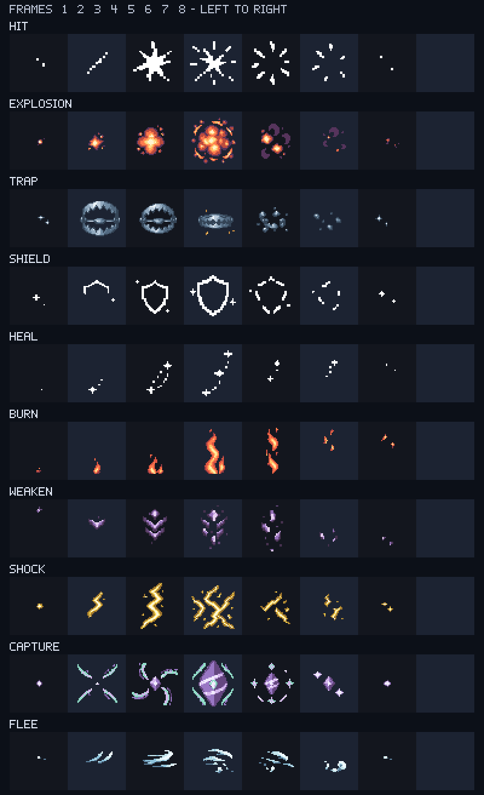
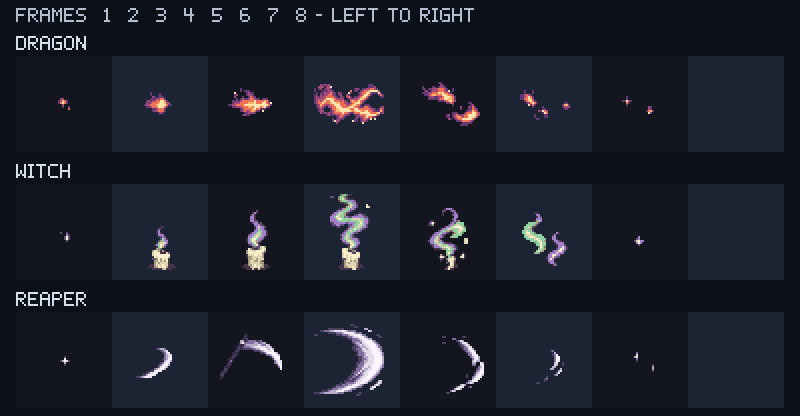

# [결정] Earth 납품 보고 — 전투 FX P1/P2·메모

2026-09-10 · Ref #118 · Earth / IMPLEMENT / ART / assets·docs / instance_index null.
요청: [earth-fx-p1p2-request.md](../../roblox/earth-fx-p1p2-request.md).
**P1 FX10 + P2 FX3 + P2 메모2 = 15PNG, 55,446bytes 납품. 미납품 항목 없음.**
동시 작업한 [배너 초록·빨강2종](earth-banner-variants-report.md)은 별도2PNG다. 두 요청 합계17PNG/59,019bytes.

## Mars 적용 계약

- FX13종은 **768×96, RGBA8, 알파0/255, 가로8프레임**. 각96×96, native48×48을 최근접2배했다.
- 프레임 번호0..7의 `ImageRectSize=(96,96)`, `ImageRectOffset=(96*n,0)`. 오프셋 x는 **0,96,192,288,384,480,576,672**.
- 프레임8은 RGBA 전부0. 반복용 루프가 아니라 나타남→정점→소멸의 1회 연출이다.
- FX에는 9-slice를 쓰지 않는다. `ResampleMode=Pixelated`; 시트 전체를 한 번에 축소해서 표시하지 않는다.
- **hit·shield·heal만 tint=yes**, 불투명 RGB는 모두 #ffffff. 나머지 FX10·메모2는 tint=no, ImageColor3 흰색.
- 원고의 endpoint 정리는 아트 형태 조정일 뿐이다. **재생 시간·프레임당 ms·입력 잠금·전체 화면 플래시·흔들림은 결정/구현하지 않았다.**
- 검토한 실제 전투원 그림은 **76×76**이다(`mkSpriteLabel`; 현재 HEAD59343d3의 init.client.luau:654). 요청서 설명의 “스프라이트96px”와 다르다. 96은 납품 프레임 크기이고 게임 표시 크기 확정이 아니다. 76px 표본도 정적 검토했지만 배치·ZIndex·카드 글자와의 간섭은 Studio에서 확인한다.
- 신규 접근자·프레임 재생기·이벤트 선택·업로드·AssetIds 갱신은 Mars 범위. Earth는 게임/도구/테스트 코드를 수정하지 않았다.

| 단계 | 키 | 의미 | 파일 | bytes | tint |
|---|---|---|---|---:|---|
| P1 | `fx96_hit` | 피격 | [hit_96x8.png](../../../roblox/assets/fx/hit_96x8.png) | 2,895 | yes — 순백 |
| P1 | `fx96_explosion` | 폭발 | [explosion_96x8.png](../../../roblox/assets/fx/explosion_96x8.png) | 5,410 | no |
| P1 | `fx96_trap` | 덫 발동 | [trap_96x8.png](../../../roblox/assets/fx/trap_96x8.png) | 5,073 | no |
| P1 | `fx96_shield` | 보호막 | [shield_96x8.png](../../../roblox/assets/fx/shield_96x8.png) | 2,953 | yes — 순백 |
| P1 | `fx96_heal` | 회복 | [heal_96x8.png](../../../roblox/assets/fx/heal_96x8.png) | 2,341 | yes — 순백 |
| P1 | `fx96_burn` | 화상 | [burn_96x8.png](../../../roblox/assets/fx/burn_96x8.png) | 3,698 | no |
| P1 | `fx96_weaken` | 약화 | [weaken_96x8.png](../../../roblox/assets/fx/weaken_96x8.png) | 3,921 | no |
| P1 | `fx96_shock` | 감전 | [shock_96x8.png](../../../roblox/assets/fx/shock_96x8.png) | 5,014 | no |
| P1 | `fx96_capture` | 포획 성공 | [capture_96x8.png](../../../roblox/assets/fx/capture_96x8.png) | 5,634 | no |
| P1 | `fx96_flee` | 도망 성공 | [flee_96x8.png](../../../roblox/assets/fx/flee_96x8.png) | 2,911 | no |
| P2 | `fx96_dragon` | 드래곤 숨결 | [dragon_96x8.png](../../../roblox/assets/fx/dragon_96x8.png) | 3,952 | no |
| P2 | `fx96_witch` | 마녀의 장난 | [witch_96x8.png](../../../roblox/assets/fx/witch_96x8.png) | 5,426 | no |
| P2 | `fx96_reaper` | 사신의 낫 | [reaper_96x8.png](../../../roblox/assets/fx/reaper_96x8.png) | 4,238 | no |

### 메모2종

| 키 | 파일 | 원본 / 표시 | SliceCenter | tint |
|---|---|---|---|---|
| board_hl_memo | [hl_memo.png](../../../roblox/assets/board/hl_memo.png) | 128×128 / native32 최근접4배 | **32,32,96,96** | no |
| token64_memo | [memo_64.png](../../../roblox/assets/tokens/memo_64.png) | 64×64 / native32 최근접2배 | 없음 | no |

- 메모 하이라이트는 따뜻한 금색 점선 + 접힌 종이 모서리로 이동/도망 표시와 구분한다. 중앙64×64는 완전 투명하다.
- **32px 셀에는 SliceScale0.25**(캡8px씩), 64px에는0.5를 사용하거나 원본을 균등 최근접 축소한다. SliceScale1의 캡 합계64px를32px 셀에 압축하지 않는다.
- 메모 배지는 종이·연필뿐이며 글자·속성·유닛 종류를 담지 않는다. 뷰어의 수동 메모 존재를 표시하는 자산이고, 숨겨진 실제 정체를 자동 조회하거나 메모 선택지를 늘리지 않는다.
- 배지64px는 파일 크기다. 작은 배치의32px 표본은 검토했으며 실제 배지 위치·클릭 영역은 Mars가 확인한다.

## 프레임별 검토

각 행은 왼쪽부터1..8번이다. 배경과 영문 라벨은 **docs 검토용**이며 납품 시트에 들어 있지 않다.
최종 PNG의 RGBA를 읽어 만든 정적 이미지다. 시트 재생 속도나 Roblox 렌더의 픽셀 완전 일치 증빙이 아니다.

### P1 10종



### P2 기술3종



- [대표4번 프레임96/48px 비교](review/fx/peak-contact.png).
- [96/76/48px·세 어두운 배경/흰 바탕](review/fx/scale-backgrounds.png): 76px는 비정수 최근접 축소 스트레스 테스트. 순백 틴트 원본3종이 흰 배경에서 보이지 않는 것은 예상 동작이며, 밝은 배경을 채택하면 대비 틴트/배치를 별도 정해야 한다.
- [흰색 원본3종·5색 틴트](review/fx/tint-contact.png): 문서상 아트 비교색이지 효과별 코드색 확정이 아니다.
- [메모32/64/128·288×144 늘림](review/fx/memo-contact.png): 확대 하이라이트 SliceScale0.5, 배지32/64px.
- [검토 좌표·자체 픽셀 라벨 원고](fx-source/review-layout.json).

덫은 금속 턱이 닫힌다. 화상은 상승 불꽃, 약화는 하강 보라 파편, 감전은 각진 금색 전격, 도망은 바람·잔먼지로 구분했다.
포획은 기존 아이템의 **보라 다면체·비스듬한 띠·마름모 코어** 어휘를 계승했다. 빨강/흰 반구·검은 적도 띠·중앙 원 버튼 조합은 없다.
새 기술은 불길·촛불·낫 궤적이며 숨은 하수인 모델이나 유명 캐릭터를 그리지 않았다.

## 제작·편집 원고·라이선스

신규 FX는 **imagegen 스킬의 내장 image_gen**으로 각 효과별 생성했다. CLI/API fallback은 사용하지 않았다.
원화는 각1장씩 [generated 폴더의13PNG](fx-source/prompts.json)에 해당한다. 실제 최종 프롬프트·드래곤 수정 지시는 [prompts.json](fx-source/prompts.json).
생성 원화의 크기·알파가 납품 규격과 달라 사용자에게 허용된 **Blender 내부 아트 명령**으로 프레임 분리·정렬·팔레트 제한·이진 알파·정수 배율 출력했다. 별도 Python/JS/Luau 코드 파일은 만들지 않았다.

- [native-assets.json](fx-source/native-assets.json): **최종 FX13종의 편집 기준**, 팔레트와384×48 픽셀 원고(48×48×8).
- [assembly.json](fx-source/assembly.json): 원화별 분리 박스·공통 배율·기준점·알파0.65 임계·팔레트·프레임별 픽셀 수.
- 첫/끝 잔광 축소와 주 프레임의 외딴1px 샘플 노이즈 제거를 기록했다. 원화 프레임을 매번 개별 자동 맞춤해 크기를 같게 만든 것이 아니다.
- 드래곤 첫 초안은 중간 프레임이 합쳐져 **image_gen으로 재배치 수정**했다. 투명 추출 재시도에도 회색 체크 배경이 남아 최종 정리에서는 중립 회색을 제외했다(maxRGB−minRGB <0.12). **생성 원화를 투명 PNG라고 주장하지 않는다. 최종 납품 PNG의 RGBA가 기준**이다.
- [memo-native-assets.json](fx-source/memo-native-assets.json): 메모2종은 기존 repo-native 픽셀 UI 체계를 직접 확장했다. 이미지 생성 스킬의 기존 편집 가능 UI 예외에 해당한다.
- 이번 편집 기준은 JSON이다. 이전 .blend를 덮어쓰거나 새 .blend/폰트 파일을 납품하지 않았다.

신규 PNG·원화·픽셀 원고·검토 이미지·검토용 자체 픽셀 글리프는 [ASSET-LICENSE.md](../../../ASSET-LICENSE.md)에 따라 **Apache-2.0 제외**.
Copyright 2026 Sung Changjo and the respective contributors. All rights reserved.
외부 소재팩·플랫폼 이모지·폰트 파일을 가져오지 않았다. 육안 IP 비연상 검토는 포괄적 권리 보증이 아니다.

## 검증·보존

**Saturn 독립 정적 아트·manifest·납품 문서 최종 QA PASS**. 검수자 파일 수정0건.
FX104프레임 검토 시트와 최종 PNG 합성 비교 차이0, 배너3장/비교표의 독립 재구성 차이0, 보고 경로 합집합56개와 실제 변경56개 일치, 로컬 링크198개 누락0을 확인했다.
manifest 기존 원문57,569bytes의 SHA-256도 baseline과 정확히 일치했다. Studio·동적 재생·실플레이는 아래처럼 별도 범위로 유지한다.

- 17PNG 전체 RGBA8/이진 알파·편집 원고 정수 배율 픽셀 일치(차이0).
- FX13종 각8프레임은 서로 다른 RGBA이며 마지막은0. 최초 불투명 면적0.043~0.825%, 모든 프레임의 바깥 여백 최소10px.
- 틴트3종 순백, 드래곤 회색 배경·중간 알파 잔여 없음. 덫·다면체 포획·메모 중립형 육안 확인.
- 기존 root manifest **136행/헤더 원문57,569bytes**를 보존하고 두 요청의17행만 추가했다. 현재153행/18열.
- 로비·가림 모델 manifest 변경 없음. 세 manifest 합계 **169대상(Image161·Model8)**.
- 업로더 `--dry`: **신규 Image17 / Model0 / 기존152 재사용**. 실제 업로드·ID 갱신·외부 게시0건.
- 시작 HEAD **e9a4c24821197db568dc6b897471ca5388230711**, dev, clean. 작업 중 외부 커밋으로 **59343d357242a0dc4974a436f27d9e5bad3f7a0f**까지 이동했다. 이 외부 커밋에는 클라/서버/Battle/uicheck 등이 포함되며 **Earth 작업이 아니다**. 기존 아트·원고는 보존했고, 이번 미커밋 작업은 아래 assets/docs뿐이다. Git 쓰기0건.
- Studio 실제 표시·재생 타이밍·중첩 효과·입력·가시성/정보 은닉·성능·실플레이는 미검증. P2 스토어/모바일 등 다른 요청 전체 완료를 뜻하지 않는다.

각 프레임의 불투명 **출력** 픽셀 수(총9,216px/프레임):

| FX | 1 / 2 / 3 / 4 / 5 / 6 / 7 / 8 |
|---|---|
| hit | 40 / 144 / 1300 / 1016 / 624 / 292 / 32 / 0 |
| explosion | 64 / 400 / 1480 / 2868 / 1104 / 324 / 56 / 0 |
| trap | 76 / 1984 / 1644 / 1236 / 768 / 284 / 76 / 0 |
| shield | 60 / 232 / 648 / 964 / 516 / 200 / 68 / 0 |
| heal | 4 / 80 / 240 / 312 / 100 / 92 / 12 / 0 |
| burn | 32 / 156 / 352 / 1156 / 636 / 124 / 76 / 0 |
| weaken | 40 / 264 / 836 / 904 / 532 / 136 / 52 / 0 |
| shock | 76 / 448 / 1152 / 1880 / 628 / 344 / 80 / 0 |
| capture | 72 / 640 / 1200 / 2816 / 968 / 460 / 88 / 0 |
| flee | 28 / 252 / 576 / 536 / 428 / 276 / 36 / 0 |
| dragon | 64 / 328 / 600 / 1680 / 812 / 288 / 80 / 0 |
| witch | 44 / 564 / 868 / 1564 / 1040 / 772 / 48 / 0 |
| reaper | 36 / 320 / 692 / 1960 / 524 / 156 / 40 / 0 |

## 납품 해시

| PNG | SHA-256 |
|---|---|
| `hit_96x8.png` | `1ca38b6bd53bc9c6a8b0ce0dc3c42e5e7ec8fdf124d9a132df894f49566d43ca` |
| `explosion_96x8.png` | `1b48e159310dd274ccd262d21c3c689057ee633851a50414f1ce51cad5219c96` |
| `trap_96x8.png` | `e6aa78dc2483119b879fda9df3d5dc9f11b622c19780f062a04f8fa037eb48d3` |
| `shield_96x8.png` | `cebed45c080cf75ff76978ff4360264ba87c5e6783aa0841cc7c251e2cb3859d` |
| `heal_96x8.png` | `62ec4b1cb186bb321e9d2f12f30659484d37c5337397cee7adf69644022ead7f` |
| `burn_96x8.png` | `04590e7c6e6d68dfbddef35f6a7c9f05f355cad81ed40ca1a19ed6cb28cf38a0` |
| `weaken_96x8.png` | `c1b2539a2055850387e1d6c939faa538b77f3277e2a4862b7b18431b27f141db` |
| `shock_96x8.png` | `114d8bf4a82469f9211d5ffc1cabd242be1af3ce775f13b4b9c45188cbbf8aa8` |
| `capture_96x8.png` | `82cf6c05424c52c285c99a4388fc45701a73fd01d22722f31e8f294d43a93d9f` |
| `flee_96x8.png` | `81c8b44776332ef201d37c2b7b2301fc007720235a220d36d3733051cfe39253` |
| `dragon_96x8.png` | `b2be677928dc73a76d9cef39cc525f8834cf32e686231e7813725cc26974fd39` |
| `witch_96x8.png` | `43c0e9cf3f7bf01b0b38038ab558387a33a53bbb23ff8c22e927dde632d69c05` |
| `reaper_96x8.png` | `074e516c63bb6992cc0b764bd73111f8d17a44ff07c00d747bff2e7f6725cb3a` |
| `hl_memo.png` | `064c06349397f66d26237a0a626550f77e88d27740b058e108af71635ceca466` |
| `memo_64.png` | `e35681d9a046fb65b92dfd976e36438a4ba8603b0ce752f6f2d76a1a9905ff37` |

최종 FX 원고 SHA-256: `f55ddbbf6e7a1175a4506d4e5cc17ff28148c025e0f72d3f77ced6f7b3ce4912`.
메모 원고 SHA-256: `02845458b10d8073dc5352a6d97517d4e77ef612738230312b1fbd90f8eecb83`.
파일/원고 해시·bytes는 [manifest.csv](../../../roblox/assets/manifest.csv)의 신규 행에도 있다.

## worker_done → Mercury

경로는 workspace C:/WOOK/pvpserver 기준. FX 요청46경로와 배너 요청14경로에는 공유 문서4개가 겹치며, 두 보고서의 **합집합은56개**다.

```yaml
worker_done:
  role: Earth
  required_role: Earth
  mode: IMPLEMENT
  area: ART
  mutation: assets / docs
  instance_index: null
  dispatch_ref: "#118 전투 FX P1/P2 + 메모"
  status: completed
  files_modified:
    - "client/roblox/assets/fx/hit_96x8.png"
    - "client/roblox/assets/fx/explosion_96x8.png"
    - "client/roblox/assets/fx/trap_96x8.png"
    - "client/roblox/assets/fx/shield_96x8.png"
    - "client/roblox/assets/fx/heal_96x8.png"
    - "client/roblox/assets/fx/burn_96x8.png"
    - "client/roblox/assets/fx/weaken_96x8.png"
    - "client/roblox/assets/fx/shock_96x8.png"
    - "client/roblox/assets/fx/capture_96x8.png"
    - "client/roblox/assets/fx/flee_96x8.png"
    - "client/roblox/assets/fx/dragon_96x8.png"
    - "client/roblox/assets/fx/witch_96x8.png"
    - "client/roblox/assets/fx/reaper_96x8.png"
    - "client/roblox/assets/board/hl_memo.png"
    - "client/roblox/assets/tokens/memo_64.png"
    - "client/docs/art/roblox-v0.5.0/fx-source/generated/hit.png"
    - "client/docs/art/roblox-v0.5.0/fx-source/generated/explosion.png"
    - "client/docs/art/roblox-v0.5.0/fx-source/generated/trap.png"
    - "client/docs/art/roblox-v0.5.0/fx-source/generated/shield.png"
    - "client/docs/art/roblox-v0.5.0/fx-source/generated/heal.png"
    - "client/docs/art/roblox-v0.5.0/fx-source/generated/burn.png"
    - "client/docs/art/roblox-v0.5.0/fx-source/generated/weaken.png"
    - "client/docs/art/roblox-v0.5.0/fx-source/generated/shock.png"
    - "client/docs/art/roblox-v0.5.0/fx-source/generated/capture.png"
    - "client/docs/art/roblox-v0.5.0/fx-source/generated/flee.png"
    - "client/docs/art/roblox-v0.5.0/fx-source/generated/dragon.png"
    - "client/docs/art/roblox-v0.5.0/fx-source/generated/witch.png"
    - "client/docs/art/roblox-v0.5.0/fx-source/generated/reaper.png"
    - "client/docs/art/roblox-v0.5.0/fx-source/native-assets.json"
    - "client/docs/art/roblox-v0.5.0/fx-source/memo-native-assets.json"
    - "client/docs/art/roblox-v0.5.0/fx-source/assembly.json"
    - "client/docs/art/roblox-v0.5.0/fx-source/prompts.json"
    - "client/docs/art/roblox-v0.5.0/fx-source/review-layout.json"
    - "client/docs/art/roblox-v0.5.0/review/fx/p1-frames.png"
    - "client/docs/art/roblox-v0.5.0/review/fx/p2-frames.png"
    - "client/docs/art/roblox-v0.5.0/review/fx/peak-contact.png"
    - "client/docs/art/roblox-v0.5.0/review/fx/scale-backgrounds.png"
    - "client/docs/art/roblox-v0.5.0/review/fx/tint-contact.png"
    - "client/docs/art/roblox-v0.5.0/review/fx/memo-contact.png"
    - "client/docs/art/roblox-v0.5.0/earth-fx-report.md"
    - "client/roblox/assets/fx/README.md"
    - "client/docs/roblox/earth-fx-p1p2-request.md"
    - "client/roblox/assets/manifest.csv"
    - "client/roblox/assets/README.md"
    - "client/roblox/assets/ui/README.md"
    - "client/docs/art/roblox-v0.5.0/README.md"
  delivered_png_count: 15
  delivered_bytes: 55446
  frame_count: 8
  frame_size: [96,96]
  sheet_size: [768,96]
  sha256_reference: "client/roblox/assets/manifest.csv"
  not_delivered: []
  qa_result: "PASS — Saturn 독립 정적 아트·manifest·납품 문서 검수. Studio·동적 재생·실플레이는 별도."
  requests_to_mars: "업로드·ID·Art.fx·프레임 재생기·메모 연결 및 Studio 확인. 재생 속도/입력 잠금은 승인 범위에 따라 별도 결정."
  external_writes: "이미지 생성 요청 외 업로드·Git 쓰기·외부 게시 없음"
```
