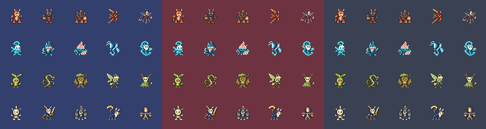
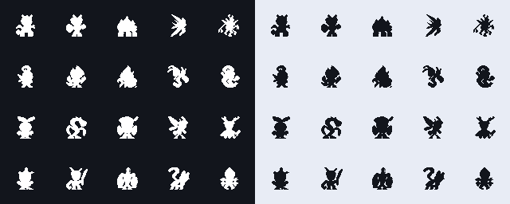

# [결정] Earth 납품 보고 — Roblox 하수인 P0-A

CJ Comment 분류: [결정] — `earth-art-request.md`를 확인하고 해당 요청서 기준으로 작업하라는 지시. 미확정 디자인 선택의 승인을 뜻하지 않는다.

날짜: 2026-09-09 · Ref #118 · 역할 Earth / IMPLEMENT / ART / assets·docs / instance_index null.

## 판정과 납품 범위

**기본 요청 P0 129/129 PNG 납품 완료.** 하수인60 + 토큰9 + 후속 속성·흔적5 / 보드10 / UI45.
이 문서의 제작·QA·worker_done은 최초 P0-A 납품 이력이다. 최신60개 납품은 [UI·보드 보고](earth-ui-report.md), 토큰 결정은 [토큰 보고](earth-token-report.md)를 따른다. P1/P2와 Studio 적용 검증은 별도다.
2026-09-09 CJ가 상징형 왕·동료, 어울리는 폭탄·물리적 덫, 팀 틴트를 승인하고 공통 가림 3D 모델을 추가 요청했다. 세 선택은 더 이상 대기가 아니다.

| 묶음 | 요구 PNG 수 | 현재 납품 | 상태 |
|---|---:|---:|---|
| P0-A 하수인 20종 × 3용도 | 60 | 60 | 완료·독립 QA PASS |
| P0-B 토큰·속성·흔적 | 14 | 14 | 완료·정적 아트 QA PASS |
| P0-C 타일·하이라이트·프레임 | 10 | 10 | 완료·정적 아트 QA PASS |
| P0-D UI·상태·아이템·행동·기술 종류 | 45 | 45 | 완료·정적 아트 QA PASS |
| **P0 합계** | **129** | **129** | **납품 완료·게임 연결 별도** |
| P1 전투 배경·FX·배너 | 프레임 설계에 따라 변동 | 0 | 미착수 |
| P2 스토어·모바일 | 콘셉트·레이아웃 결정 필요 | 0 | 미착수 |

P0-D 행동 아이콘은 실제 열거된 10개와 경로 목록을 기준으로 수량을 셌다(요청서의 과거 “9종” 오기도 수정).
메모용 8종을 따로 만들지 않는다. 이후 P0-B 토큰·속성 자산을 그대로 재사용한다.

## 확정된 원본과 출력

- 기준 브랜치: `feature/118-roblox-port`.
- 작업 시작 HEAD: `bffd5da28fac6279ab9b15f491dbab7c8791bcc0`.
- 원본: 현재 `demo/assets/minions/`의 승인된 100개 이미지. 루트의 과거 `art/` 보관본을 가져오지 않았다.
- 보존 기준: [source-baseline.json](source-baseline.json), 이미지 100개 + 원본 README 1개.
- 기존 원본 검증: `python tools/minion_art.py --all --check` → write=0, unchanged=36, mismatch=0, missing=0, preserve=0, warn=0.
- 기존 아트 도구·제품·테스트 코드는 수정하지 않았다. 이미 설치된 FFmpeg 8.1 CLI의 이미지 변환 기능과 파일 복사만 사용했다. 새 이미지 생성·재디자인은 0건이다.
- P0-A PNG 60장 합계: **4,384,108 bytes**. [납품 manifest](../../../roblox/assets/manifest.csv)의 기존 하수인 60행과 파일 경로 집합이 정확히 같다. 최신 전체 manifest는 토큰9행과 UI·보드60행을 포함한129행이다.

| 파일 | 원본 | 처리 | 결과 |
|---|---|---|---|
| `icon64.png` ×20 | native 32px `icon.png` | 최근접 2배 | 64×64 RGBA PNG |
| `battle256.png` ×20 | 승인된 64px `battle-grid.png` | RGBA 해석 후 최근접 4배 | 256×256 RGBA PNG |
| `portrait512.png` ×20 | `portrait.png` | 원본 파일 바이트 복사 | 512×512 RGBA PNG |

일러스트·전투·아이콘의 색, 실루엣, 표정은 변경하지 않았다.
승인된 전투 보정 4종도 현재 원본 그대로 확대했다.

### 1차 REVISE와 수정 근거

첫 FFmpeg 출력에서 팔레트 모드 전투 원본 16종에 색상 성분 ±1 오차가 발생했다.
Saturn이 System.Drawing 전수 비교와 Pillow 독립 표본으로 발견했다.
최종 출력은 팔레트를 먼저 RGBA로 해석하는 `format=rgba,scale=256:256:flags=neighbor` 순서로 바로잡았다.
기존 RGBA 원본 4종은 처음부터 픽셀 일치였다. 수정 후 **전투 20/20 전체 RGBA 바이트 일치**를 재확인했다.
1차 출력의 실패를 통과로 기록하지 않으며, 현재 manifest는 수정된 최종본 해시만 담는다.

## 독립 검수 — Saturn

| 검사 | 최종 결과 |
|---|---|
| 정확히 20폴더 × 3 PNG | 60/60 |
| PNG-32: IHDR color type 6, bit depth 8, RGBA | 60/60 |
| 지정 크기 / 1024px 이하 / WebP·SVG 없음 | 60/60 |
| 아이콘 = 원본32 최근접2배, 전체 RGBA 바이트 일치 | 20/20 |
| 전투 = 원본64 최근접4배, 전체 RGBA 바이트 일치 | 20/20 |
| 일러스트 = 원본 PNG 파일 바이트 일치 | 20/20 |
| 원본101 파일의 경로 집합·SHA-256 보존 | 101/101 |
| manifest 파일·source SHA·bytes·크기·tint 일치 | 60/60 |
| 하단 기준선(배타적 경계): icon60 / battle232 / portrait460 | 20/20 |
| 현재 하수인32px 식별성·실루엣·세 배경 대비 | 정적 시트에서 PASS |

아래 검토 시트는 **실제 Roblox 납품 icon64를 최근접으로 32px로 표시**한 이미지다.
행은 불 / 물 / 풀 / 번개, 열은 표준 / 공격 / 방어 / 속공 / 지속 순서다.
텍스트 라벨을 이미지에 굽지 않고 문서에서 배열을 설명한다.

- [실제 32px · 세 말 배경](review/minions-icons32-three-backgrounds.png): 왼쪽부터 `#33406e`, `#6e3340`, `#3a4152`.
- [실제 32px · 흑백 실루엣](review/minions-icons32-silhouette.png): 왼쪽 흰 실루엣/어두운 바탕, 오른쪽 어두운 실루엣/밝은 바탕.





**검수 범위의 한계:** 위 시트는 P0-A 하수인만 검수한 증빙이다.
후속 P0-B 토큰5종의 검수는 [토큰 보고](earth-token-report.md)에, 기호9종과 9-slice 늘림 검수는 [최신 UI 보고](earth-ui-report.md)에 별도로 기록했다.
최초 P0-A 작업에서 Studio 실제 표시, 기기별 가독성, 업로드·rbxassetid 연결, 권리 체인 포괄 조사, 사람 대상 블라인드 식별 시험은 수행하지 않았다.

## 결정 현황과 남은 [기획 필요]

1. 왕·동료: **CJ 승인 완료 — 상징 문양.** 왕관·협력 고리로 후속 제작했다.
2. 폭탄·함정: **CJ 승인 완료 — 어울리는 폭탄, 함정은 물리적 덫.** 과거 마법 함정 제안을 폐기했다.
3. 아군·적군: **CJ 승인 완료 — 파랑/빨강 틴트.** 기존 하수인 원본색은 보존한다.
4. 모바일 세로: 7×13 보드 셀 44px 이상을 보장하는 스크롤/축소 정책. 미결정. 목업을 확정 설계로 제작하지 않았다.
5. Experience 이름·아이콘 콘셉트. 미결정. 기존 Digit Dual 이름을 경험명으로 새로 확정하지 않았다.
6. 공통 가림 외형: **CJ 추가 요청으로 제작 완료.** Earth가 무문자 덮개로 표현하여 물음표 글리프 예외는 사용하지 않았다. 동일 외형의 2D 토큰과 3D 모델을 제공한다.
7. P2 썸네일1920×1080·모바일목업1080×1920과 “전 PNG≤1024” 조건의 적용 범위: 스토어/문서 예외인지 확인 필요.

첫 세 항목은 2026-09-09 CJ의 명시적 응답으로 해소됐다. 무응답을 승인으로 간주한 것이 아니다.
P0-C의 선택 하이라이트는 현행 CSS 흰색과 요청서 노랑이 다르지만,
신규 제작 시 최신 요청서의 노랑을 우선한다. 이번 납품에는 하이라이트가 없다.

## Mars 인계

- **업로드는 하지 않았다.** PNG 파일과 manifest만 제공한다. 업로드·rbxassetid 매핑·Luau 연결은 Mars 소관이다.
- manifest의 앞 6열은 기존 `kind,id,path,bytes,sha256,detail`을 유지하고 크기·slice 경계·tint·source·notes·source_sha256·priority·status를 추가했다.
- 경로는 `C:\WOOK\pvpserver\client` 프로젝트 루트 기준이다. 이번 60종류 파일은 모두 `tint=no`, slice 네 열은 빈 값이다. 9-slice 자산은 아직 없다.
- 기존 `tools/minion_art.py`는 Roblox 크기/출력 폴더 옵션이 없다. 직접 수정하지 않았다.
  공식 반복 출력 파이프라인으로 통합할 경우 Mars에 `icon32→64`, `grid64→256`, `portrait512 byte-copy`,
  `roblox/assets/minions` 출력 경로, **RGBA 해석 선행**과 픽셀 전수 비교 옵션을 요청한다. 이는 변경 요청이며 구현했다고 주장하지 않는다.
- 신규 P0-B·C·D 이후 납품에서도 같은 기호의 메모/확정 파일 중복 생성 금지, 흰색 tint 자산 RGB 검증,
  SliceCenter 경계와 늘림 검사, 모든 이미지 무문자 검수를 추가해야 한다.
- 이번 작업 도중 관측된 `.gitignore`, `roblox/README.md`, `roblox/build.bat` 등의 별도 변경은 Earth가 만든 것이 아니다. 수정·복구하지 않았다.
- Git 쓰기·브랜치 변경·커밋·PR·외부 문서 게시·업로드 0건.

## 자산 조건

`roblox/assets/`의 이미지와 이 폴더 `review/`의 파생 아트 이미지는
[ASSET-LICENSE.md](../../../ASSET-LICENSE.md)에 따라 **Apache-2.0 제외**다.
Copyright 2026 Sung Changjo and the respective contributors. All rights reserved.
외부 소재·이모지 글리프를 가져오지 않았으며 기존 프로젝트 원본만 재출력했다.

## 최초 P0-A worker_done — 당시 납품 이력

아래 파일 경로는 공유 작업공간 `C:\WOOK\pvpserver` 기준이다. 추가 토큰의 현재 완료 보고는 [earth-token-report.md](earth-token-report.md)다.

```yaml
worker_done:
  role: Earth
  instance_index: null
  dispatch_ref: "#118 Roblox 아트 P0"
  status: partial_delivery
  files_modified:
    - "client/roblox/assets/minions/fire_atk/battle256.png"
    - "client/roblox/assets/minions/fire_atk/icon64.png"
    - "client/roblox/assets/minions/fire_atk/portrait512.png"
    - "client/roblox/assets/minions/fire_def/battle256.png"
    - "client/roblox/assets/minions/fire_def/icon64.png"
    - "client/roblox/assets/minions/fire_def/portrait512.png"
    - "client/roblox/assets/minions/fire_std/battle256.png"
    - "client/roblox/assets/minions/fire_std/icon64.png"
    - "client/roblox/assets/minions/fire_std/portrait512.png"
    - "client/roblox/assets/minions/fire_sustain/battle256.png"
    - "client/roblox/assets/minions/fire_sustain/icon64.png"
    - "client/roblox/assets/minions/fire_sustain/portrait512.png"
    - "client/roblox/assets/minions/fire_swift/battle256.png"
    - "client/roblox/assets/minions/fire_swift/icon64.png"
    - "client/roblox/assets/minions/fire_swift/portrait512.png"
    - "client/roblox/assets/minions/grass_atk/battle256.png"
    - "client/roblox/assets/minions/grass_atk/icon64.png"
    - "client/roblox/assets/minions/grass_atk/portrait512.png"
    - "client/roblox/assets/minions/grass_def/battle256.png"
    - "client/roblox/assets/minions/grass_def/icon64.png"
    - "client/roblox/assets/minions/grass_def/portrait512.png"
    - "client/roblox/assets/minions/grass_std/battle256.png"
    - "client/roblox/assets/minions/grass_std/icon64.png"
    - "client/roblox/assets/minions/grass_std/portrait512.png"
    - "client/roblox/assets/minions/grass_sustain/battle256.png"
    - "client/roblox/assets/minions/grass_sustain/icon64.png"
    - "client/roblox/assets/minions/grass_sustain/portrait512.png"
    - "client/roblox/assets/minions/grass_swift/battle256.png"
    - "client/roblox/assets/minions/grass_swift/icon64.png"
    - "client/roblox/assets/minions/grass_swift/portrait512.png"
    - "client/roblox/assets/minions/lightning_atk/battle256.png"
    - "client/roblox/assets/minions/lightning_atk/icon64.png"
    - "client/roblox/assets/minions/lightning_atk/portrait512.png"
    - "client/roblox/assets/minions/lightning_def/battle256.png"
    - "client/roblox/assets/minions/lightning_def/icon64.png"
    - "client/roblox/assets/minions/lightning_def/portrait512.png"
    - "client/roblox/assets/minions/lightning_std/battle256.png"
    - "client/roblox/assets/minions/lightning_std/icon64.png"
    - "client/roblox/assets/minions/lightning_std/portrait512.png"
    - "client/roblox/assets/minions/lightning_sustain/battle256.png"
    - "client/roblox/assets/minions/lightning_sustain/icon64.png"
    - "client/roblox/assets/minions/lightning_sustain/portrait512.png"
    - "client/roblox/assets/minions/lightning_swift/battle256.png"
    - "client/roblox/assets/minions/lightning_swift/icon64.png"
    - "client/roblox/assets/minions/lightning_swift/portrait512.png"
    - "client/roblox/assets/minions/water_atk/battle256.png"
    - "client/roblox/assets/minions/water_atk/icon64.png"
    - "client/roblox/assets/minions/water_atk/portrait512.png"
    - "client/roblox/assets/minions/water_def/battle256.png"
    - "client/roblox/assets/minions/water_def/icon64.png"
    - "client/roblox/assets/minions/water_def/portrait512.png"
    - "client/roblox/assets/minions/water_std/battle256.png"
    - "client/roblox/assets/minions/water_std/icon64.png"
    - "client/roblox/assets/minions/water_std/portrait512.png"
    - "client/roblox/assets/minions/water_sustain/battle256.png"
    - "client/roblox/assets/minions/water_sustain/icon64.png"
    - "client/roblox/assets/minions/water_sustain/portrait512.png"
    - "client/roblox/assets/minions/water_swift/battle256.png"
    - "client/roblox/assets/minions/water_swift/icon64.png"
    - "client/roblox/assets/minions/water_swift/portrait512.png"
    - "client/roblox/assets/manifest.csv"
    - "client/roblox/assets/README.md"
    - "client/docs/art/roblox-v0.5.0/README.md"
    - "client/docs/art/roblox-v0.5.0/source-baseline.json"
    - "client/docs/art/roblox-v0.5.0/review/minions-icons32-three-backgrounds.png"
    - "client/docs/art/roblox-v0.5.0/review/minions-icons32-silhouette.png"
    - "client/docs/art/roblox-v0.5.0/earth-report.md"
  summary: |
    P0-A 20종 x 3규격=60PNG 납품. 총 4384108 bytes.
    icon64/battle256/portrait512 RGBA 및 원본 픽셀 일치, 원본101파일 보존.
    Saturn P0-A 기술·정적 시각 QA PASS. 전체 P0 완료 아님.
    최초 보고 당시 P0-B/C/D69PNG와 P1/P2는 미납품이었다. 후속 토큰9PNG와 UI·보드60PNG는 각 후속 보고에 기록하며 현재 기본 P0 잔여는0장이다.
    이 worker_done은 최초 P0-A 이력이며 코드 파일 작성·수정 0개.
  requests_to_mars: |
    업로드·rbxassetid·Luau 연결은 Mars 수행.
    minion_art.py Roblox 출력 옵션이 필요하면 Mars가 추가.
    RGBA 변환을 nearest 확대보다 먼저 수행하고 픽셀 전수 비교할 것.
  planning_needed:
    - "모바일 44px 셀과 스크롤·축소 정책"
    - "Experience 이름·아이콘 콘셉트"
    - "P2 스토어·문서 이미지의 1024px 초과 예외 여부"
  qa_request: |
    P0-A는 Saturn 독립 검수 완료.
    남은 P0 자산 납품 후 토큰32px/실루엣, 9-slice, 틴트 및 전체129PNG 검수.
    Studio 실표시·업로드·실기기 검수는 별도.
```
