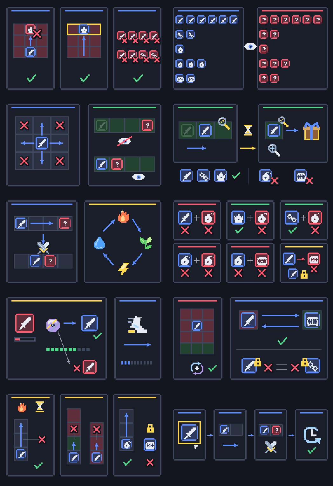
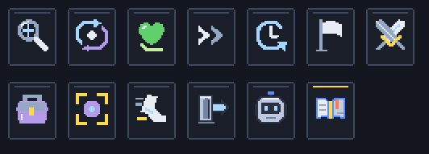
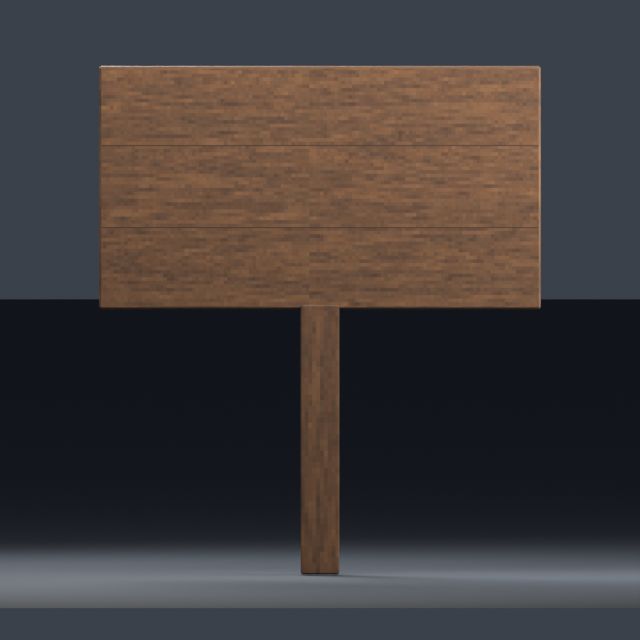
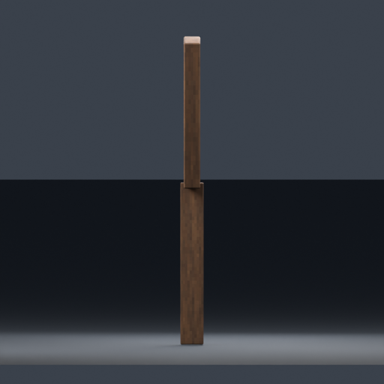
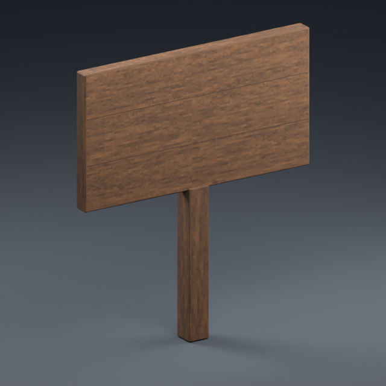
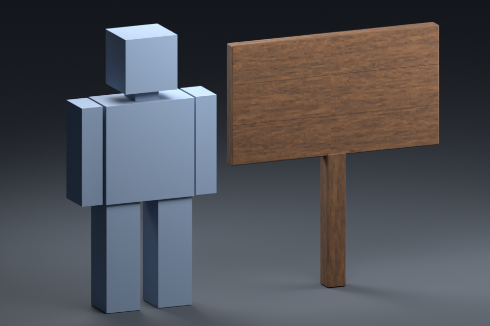
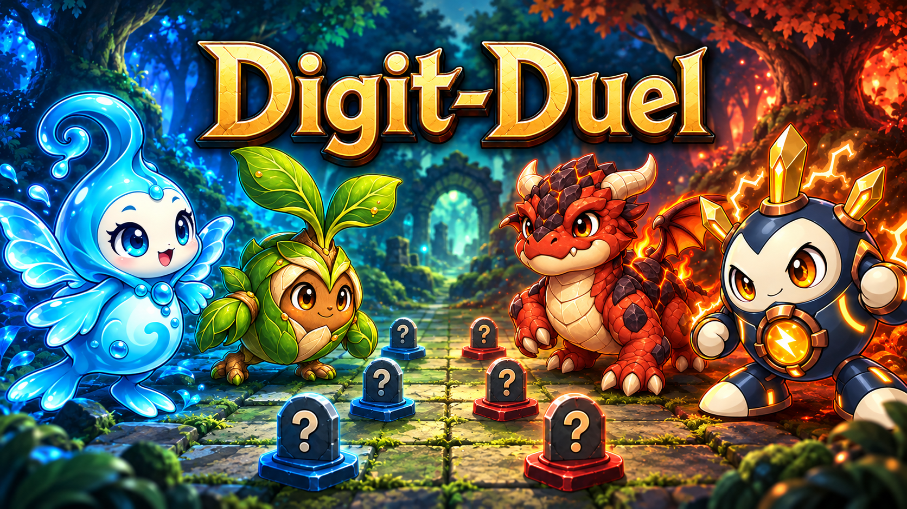

# [결정] 튜토리얼 아트 전량 납품 보고

2026-09-11 · Earth · Ref #118 · 요청: [earth-tutorial-request.md](../../roblox/earth-tutorial-request.md)

**필수13/13 + 선택1/1, 총14개 런타임 자산 제작 완료. 미납품 없음.** 총134,605 bytes. 기존 완성 썸네일1개를 별도로 포함했다. 게임코드/업로드/Studio 적용은 Mars 범위로 남긴다.

[Claude 최종 인계](../../roblox/claude-tutorial-thumbnail-handoff.md) · [파일별 bytes/SHA256·원고 해시·메시 측정](tutorial-source/delivery-inventory.json)

## 제작 방법과 완료 범위

사용자가 이번 턴에 Blender 내부 아트 명령 사용을 승인했다. Blender5.2.1 LTS/MCP의 허용된 모델링·이미지 버퍼·렌더·export 명령으로 제작했다. 기존 네이티브 픽셀 아이콘/도형 체계를 확장했으며 이번 튜토리얼에는 imagegen을 사용하지 않았다. 게임/도구/테스트용 Luau·JS·Python 파일을 만들거나 고치지 않았다.

| 구분 | 수량 | 규격 | 용량 |
|---|---:|---|---:|
| 튜토리얼 PNG | 10 | 512×288 RGBA8, 전체alpha255, native256×144 최근접2배 | 71,174 bytes |
| 도움말 PNG | 1 | 48×48 RGBA8, alpha0/255, native24 최근접2배 | 625 bytes |
| 선택 간판 패널 | 1 | 128×64 RGBA8, alpha0/255, SliceCenter12,12,116,52 | 798 bytes |
| 간판 FBX | 1 | 4×4.6×0.35stud, 88tri, Y-up, 밑단pivot | 19,900 bytes |
| 간판 albedo | 1 | 512×512 RGBA8, alpha0/255, 월넛, 조명베이크 없음 | 42,108 bytes |

OBJ5,557bytes + MTL266bytes, 픽셀JSON/Blender 원고, 검수 시트는 보조 산출물이며14개 수량에 중복 계산하지 않는다.

## 1. 삽화10장 — 실제512×288 배치

2열×5행, 좌→우/위→아래: win, pieces, move, search, battle, bomb, capture, tele, burn, check. 시트1048×1528 안에서 각 PNG는 **512×288 원크기**다.

파일 목록과 전체 적용 계약은 [tutorial/README.md](../../../roblox/assets/tutorial/README.md). `kind=tut512`, `id=win` 등의10행이며 키는 `tut512_win` 형식이다.

- 바깥 배경#13161e, 지정 HTML 팔레트, tint=no, Pixelated/Fit, 전체alpha255. 숲의 흐린 말은 반투명PNG가 아니라 어두운 RGB로 합성했다.
- 문장/숫자/외부폰트 글리프 없음. 물음표·화살표·X·체크·시계 등은 직접 그린 픽셀 기호다. 왕/동료/폭탄/덫/속성/행동은 기존 원고에서 재사용했다.
- 전멸은 하수인6+동료2만8개. 숨은14개 말은 동일한 물음표. 탐색에는 차례 경계 모래시계가 있다.
- 속성 고리는 불→풀→번개→물. 폭탄↔덫 제거, 기계식 덫의 발 묶임을 포함한다.
- 기존 보라색 다면체 포획 도구와 포획70%/도망30% 점 표시. HP 조건은 포획만.
- 텔레포트는 덫 토큰도 교환 가능하지만 덫에 걸린 살아 있는 말은 양끝 모두 금지.
- 버닝은 곧게2칸, 상대 숲/땅에서는 있거나 들어가거나 지나가면1칸. 폭탄2칸/덫자체이동금지.
- 상세 규칙은 최신 HTML `TUT_STEPS`/현재 `TutorialUi` 설명문을 함께 표시한다. 그림만으로 모든 규칙을 대체하지 않는다.

## 2. 도움말 + 기존12종 비교

7열, 위줄 search/teleport/heal/skip/endturn/resign/fight, 아래줄 bag/capture/flee/exit/bot/**help**. 각 아이콘48×48. 금색 테두리가 신규 펼친 책이다. 신규 [help_48.png](../../../roblox/assets/actions/help_48.png)는 기존 선 굵기·남색 외곽·밝은 안쪽 톤을 맞췄다.

선택 [panel_sign.png](../../../roblox/assets/ui/panel_sign.png)은 어두운 월넛 테두리/중앙#13161e. SliceCenter(12,12,116,52)/SliceScale1, tint=no. 현재 간판의 어두운 글자색은 Claude가 밝게 조정해야 한다.

## 3. 간판 정면·측면·사선·5stud 비교

앞3장은 각640×640, 크기비교는960×640. 바닥·아바타·조명은 Blender 검수 장면이며 Roblox 적용 스크린샷이 아니다. 아바타 대역의 실제 높이는5stud.

[FBX](../../../roblox/assets/lobby/meshes/signpost.fbx) · [OBJ](../../../roblox/assets/lobby/meshes/signpost.obj) · [MTL](../../../roblox/assets/lobby/meshes/signpost.mtl) · [알베도](../../../roblox/assets/lobby/textures/signpost_albedo.png)

- 최종 메시1개, vertex48, **tri88**, UV1, 재질1, custom properties0.
- Roblox 좌표 bounds(-2,0,−0.175)..(2,4.6,0.175), 밑단pivot(0,0,0), bbox중심(0,2.3,0).
- 판4×2.2×0.25, 하단Y2.4. 기둥0.35×2.44×0.35는 판 내부0.04stud 겹쳐 틈이 없다. 전체 크기는 요청과 같다.
- 정면 local−Z, Y-up, unit=stud, bake_space_transform=true. 앞면은 사각1면(삼각분할2개가 동일한 사각 UV꼭짓점4개 공유). 글자/구멍/인쇄된 문구 없음.
- UV용 목재는 기존 `desk_albedo.png` 하단 패치 파생. 앞/뒤 UV는 같은 목재 패치를 공유한다. UV 바깥 투명패딩, albedo에는 조명/그림자 없음.
- MTL 경로 `../textures/signpost_albedo.png` 정상. 모델은 선택 메시만 export했으며 검수 바닥/아바타는 포함하지 않았다.
- 원고 [tutorial-art.blend](tutorial-source/tutorial-art.blend), [native-assets.json](tutorial-source/native-assets.json), [원고 안내](tutorial-source/README.md).

## 4. 검증 결과

**Saturn 독립 아트 QA PASS, files_modified=[]**. 부모의 제작 결과를 그대로 믿지 않고 PNG 직접 디코드·OBJ 파싱·별도 Blender 백그라운드 FBX 재수입으로 확인했다.

| 검증 | 결과 |
|---|---|
| PNG13개(2D12+albedo) 형식/크기/알파 | PASS. RGBA8, alpha0/255; 삽화10개는255만 |
| 2D12개 원고→PNG | PASS. 전체5,940,224픽셀 채널 동일; 최근접2배 유지 |
| 그림 의미/아이콘 선 굵기 | PASS. 최신TUT_STEPS/TUT_SCENES 및 기존 아이콘과 대조 |
| FBX 독립 재수입 | PASS. 메시1,48vertices,88tri,UV1,재질1,custom props0,원점0 |
| FBX/OBJ 치수·축·피벗 | PASS. 변환 후4×4.6×0.35, 밑단Y≈0 |
| 앞면 사각 UV·MTL 연결·albedo | PASS |
| 원크기 접촉시트/모델4뷰 | PASS |
| manifest 기존행 보존 | PASS. root153+lobby15 기존168행 유지 |
| 신규manifest | PASS. root12+lobby2=14행만 추가; 실제bytes/SHA/sourceSHA일치 |
| 정적 diff 공백 검사 | PASS |
| 업로드·Roblox Studio·실서버 | **미실행 — 본 아트 QA 범위 아님** |

부모도 원고JSON의 모든 native 픽셀과 최종PNG를 별도로 대조해 불일치0을 확인했다. [2×2 색상/알파 시험](review/tutorial-color-proof.png)은 제작 중 sRGB 저장값 확인용이며 런타임 자산이 아니다.

## 5. 썸네일 별도 납품

[PNG](../../../roblox/assets/marketing/digit-duel-thumbnail-v1.png): 1672×941, 2,678,576bytes, SHA256 `b3730ea4b50aa841784a4ed18a30a1b36eba5222debba3c500f6aa0cd449171c`.

기존 내장image_gen 결과를 바이트 복사, 새 수정 없음. [프롬프트/제작기록](thumbnail-source/README.md). 가로 경험 썸네일이며 정사각형 경험 아이콘/런타임 이미지가 아니다. root/lobby manifest에 넣지 않았고 게시/심사는 미실행.

## 6. 인계 주의사항

- 현재 HEAD `678586e`의 로비 `buildSign` 이름 중복은 **P1 구현 문제**다. 함수 shadow로 숫자를 Model.Parent에 넣을 수 있다. Earth는 수정하지 않았으며 [최종 인계서](../../roblox/claude-tutorial-thumbnail-handoff.md)에 위치/영향을 명시했다.
- `Art.tut`/도움말 접근자는 준비됐지만 signpost의 템플릿/크기/텍스처 연결은 Mars가 추가해야 한다. 전체 간판bbox와 판 캐리어/SurfaceGui를 구분한다.
- 최신 요청서의 CJ3결정은 확정: 자동표시 없음, 간판(0,0,40)에서 스폰향, 대전중 열기 허용. 이전 초안의 “대기중” 문구를 제거했다.
- 트랙은 `milestone/v0.5.0`. Earth는 Git 쓰기를 하지 않았다. 기존169자산의 파일/키/슬라이스와 게임코드를 변경하지 않았다.

## worker_done

- required_role: Earth
- instance_index: null
- mode / area / mutation: IMPLEMENT / ART / assets, docs
- status: complete_art_delivery
- delivered_required: 13/13
- delivered_optional: 1/1
- delivered_existing_thumbnail_copy: 1
- triangles: signpost=88
- missing_deliverables: []
- QA: Saturn PASS (asset files/manifests/source pixels/FBX roundtrip/visual proof)
- hashes: [delivery-inventory.json](tutorial-source/delivery-inventory.json), root/lobby manifests
- files_modified: [delivery-inventory.json](tutorial-source/delivery-inventory.json)의 `files_modified` 배열에 저장소 상대 경로34개를 전수 기록했다. root/lobby manifest에는 행 추가만 했으며 나머지는 신규 아트·원고·검수 자료·문서다.
- code_modified / existing_assets_modified / git_writes: none
- upload / AssetIds_update / Studio_test: not_run (Mars scope)
- remaining_integration_issue: existing Lobby buildSign name collision P1; not an art delivery defect

신규PNG·FBX/OBJ·픽셀/Blender원고·검수이미지·브랜딩은 [ASSET-LICENSE.md](../../../ASSET-LICENSE.md)에 따라 Apache-2.0 제외다. Copyright 2026 Sung Changjo and the respective contributors. All rights reserved.
