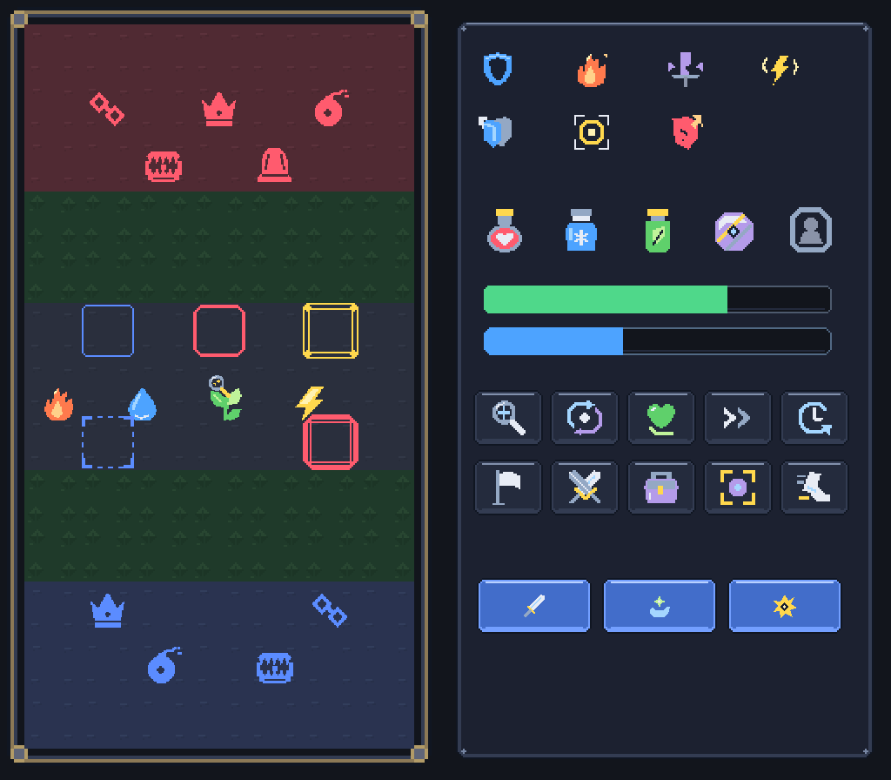
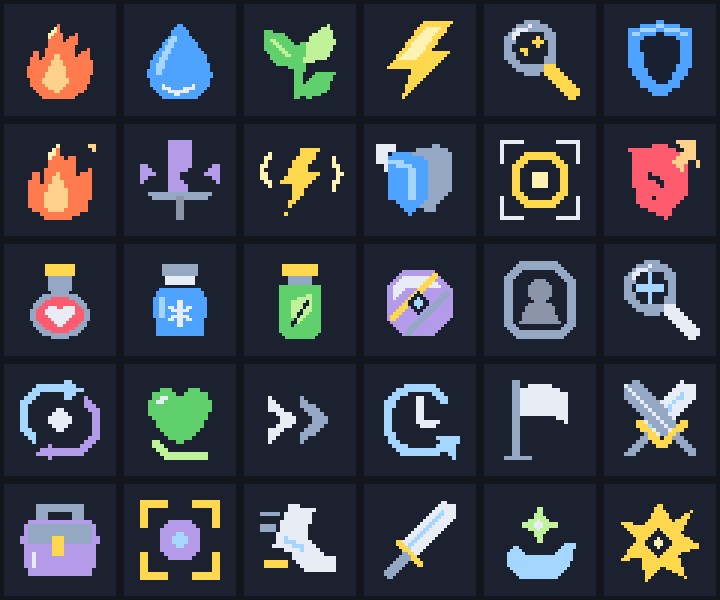

# [결정] Earth 납품 보고 — P0-B 잔여 / P0-C / P0-D

2026-09-09 · Ref #118 · Earth / IMPLEMENT / ART / assets·docs / instance_index null.

CJ 최신 요청: “earth-art-request.md의 P0-B 아이콘·흔적·속성, P0-C, P0-D 납품”.
**신규60PNG 납품 완료. 기존69개와 합쳐 기본 P0 129/129PNG가 준비됐다.**
이번 작업은 아트 파일·편집 원고·문서 납품이다. 게임 연결·업로드 완료나 P1/P2 완료를 뜻하지 않는다.

[Claude 적용 인계](../../roblox/claude-art-apply-handoff.md) · [60개 키·틴트·SliceCenter 전수표](../../../roblox/assets/ui/README.md) · [PNG manifest](../../../roblox/assets/manifest.csv).

## 1. 납품 수량·원본 보존

| 요청 묶음 | 이번 PNG | 기본 P0 누계 |
|---|---:|---:|
| P0-A 하수인 | 0 | 60/60 |
| P0-B 토큰·속성·흔적 | 속성4 + 흔적1 =5 | 14/14 |
| P0-C 타일·하이라이트·프레임 | 4 +5 +1 =10 | 10/10 |
| P0-D UI·상태·아이템·행동·기술 종류 | 20 +7 +5 +10 +3 =45 | 45/45 |
| **합계** | **60** | **129/129** |

신규60PNG 합계 **43,786 bytes**. 런타임 최대변128px, PNG RGBA8, 알파0/255.
원고3개 + 검토PNG9개 + 납품PNG60개 + README/보고/요청서/manifest8개 = 이번 변경 경로 **80개**.
로비6메시·7PNG와 공통 가림3D1종은 별도 기존 납품으로129PNG에 더하지 않는다.
P1 연출·배너·FX와 P2 스토어·모바일은 미납품이다.

기존 하수인60PNG, demo/minions101파일, 기존 pixel-source20, 전투 보정4,
토큰9PNG·모델, 로비 자산, 기존 Blender 원본을 변경하지 않았다.
Saturn의 작업 시작 baseline279개 중275개가 최종 검수에서도 바이트 그대로였다.
다른4개는 이번 루트 manifest·자산 README2개와 동시 작업자가 수정·커밋한 클라이언트/서버 진입점2개다.
기존 manifest69행도 보존하고 신규60행만 추가했다.

## 2. 제작 방법·편집 원본

기존 repo-native 픽셀 아이콘 체계를 확장했다. 사용자에게 허용받은 **Blender 내부 아트 명령**으로 픽셀 원고·PNG·검토 이미지를 제작했으며,
imagegen 그림이나 외부 소재를 사용한 작업이 아니다. 코드·도구·테스트 파일을 추가/수정하지 않았다.
문서화 스킬의 적용 계약 정리 방식으로 파일별 키·규격·검수 한계를 한 README에 모았다.

- [native-assets.json](ui-source/native-assets.json):60개 팔레트·픽셀 행·출력 크기·틴트·슬라이스를 갖는 **기준 원고**.
- [p0-ui.blend](ui-source/p0-ui.blend): 보조 편집 원본. Earth_P0_UI_Source 장면에 ui_native_assets_json과 ui_slice_review_json을 보존했다.
  납품PNG60개를 Earth_P0_Delivered_ 접두의 packed image로 포함하고 fake user를 설정했다. 내장PNG SHA는 납품본과60/60 일치한다.
  이전 로비/토큰 장면도 문맥 보존용으로 포함하므로 .blend 전체를 게임에 올리지 않는다. Text블록0, 드라이버0.
- [slice-review-cases.json](ui-source/slice-review-cases.json):26자산×2크기의 검토 위치·SliceCenter52사례.
- 원고 SHA-256: 325ec4afe00d32c7f34a028eecf244ff339905787ca3ba2868d589f14bc00b36. manifest60행의 source_sha256과 같다.
- 신규 원고는 earth-native-raster-v1 스키마다. 기존 tools/art/minion_art.py의20종 입력 형식이 아니며 그 도구 변경은 필요 없다.

속성/아이템64는 native32의2배, 흔적/상태/행동48은 native24의2배, 기술 종류32는 native32다.
타일·하이라이트·보드 프레임은 native32의4배, 나머지 UI는 원고의2배다. 납품 출력은 모두 최근접 정수 확대다.
**48계열을32px로 보는 시트는 비정수 최근접 스트레스 테스트**이며 정수 표시 권장은24/48/72px다.

## 3. 디자인 판단과 적용 계약

- HTML 속성색·진영 타일색을 계승했다. 숲은 낮은 대비의 잎 결, 다른 타일은 은은한 표면 결로 중앙 기호를 방해하지 않게 했다. 네 변은 원래 셀색으로 맞춰 반복 이음새를 제거했다.
- 속성4는 불꽃/물방울/잎 가지/번개로 색 없이도 구분한다. 흔적은 일반적인 돋보기와 점2개이며 특정 종의 발자국을 암시하지 않는다.
- 상태7개는 방패/화상 불꽃/부러진 칼/감전/겹방패/조준/금간 갑옷으로 구분한다. 피격+15% 등 수치는 그림에 쓰지 않았다.
- 회복약은 하트 플라스크, 해독제는 잎 바이알이다. 의료 적십자 표식을 쓰지 않았다.
- 포획 도구는 보라 다면체·사선 띠·마름모 코어다. 유명 IP의 빨강/흰 반구와 중앙 원 버튼 조합을 사용하지 않았다.
- 하이라이트5와 HP·방어막 채움2의 **신규7개만 흰색 단색 틴트**다. 전체129개 중 tint=yes는 기존 토큰9를 포함한16개다.
- 선택은 최신 요청서의 노랑이다. 이동/도망 후보는 파랑, 공격/강제는 빨강이며 테두리 굵기·끊김·모서리도 다르게 했다.
- 버튼12상태는 색과 베벨로 구분했다. disabled 입력 차단은 코드의 책임이다.
- 사진·폰트·문자·이모지 글리프는 쓰지 않았다. 글자와 숫자는 런타임 텍스트로 남겼다.

**9-slice26개**의 SliceCenter 좌표를 manifest에 넣었다. 좌표를 패딩값으로 읽으면 안 된다.
현재32px 내부 셀에128px 하이라이트를 쓰면 SliceScale0.25 또는 균등128→32 축소가 필요하다.
SliceScale1의64px 캡 합계를32px 칸에 넣지 않는다. HP/방어막 낮은 값은 전체fill을 클립하고0에서 숨긴다.
세부 수치와60개 업로드 키는 [UI README](../../../roblox/assets/ui/README.md)를 단일 적용표로 사용한다.

수동 메모는 토큰4+속성4를 재사용한다. 서버가 공개한 정보/허용한 흔적만 표시하며,
visibleTo=false이면 덮개도 표시하지 않는다. 공개 전 공통 덮개, 정보 은닉, HP 숫자 규칙은 바꾸지 않았다.

## 4. 검토 이미지

아래는 **납품PNG로 만든 정적 아트 검토**다. 실제 Roblox 화면 또는 확정된 모바일 UI 설계가 아니다.





아이콘 배열은6열×5행:
불·물·풀·번개·흔적·방어막 / 화상·약화·감전·감쇠·집중·취약 /
회복약·쿨링수·해독제·포획도구·예비슬롯·탐색 /
텔레포트·회복·생략·턴종료·기권·싸우기 / 가방·포획·도망·공격기·보조기·시그니처.

- [아이콘32px·세 배경](review/p0-icons32-backgrounds.png): 각 기호에 아군/적군/미공개 배경.
- [공통 기호9종 검수](review/p0-symbols9-proof.png): 왕·동료·폭탄·덫·가림·불·물·풀·번개. 세 배경32px와 흰/검정64px.
- [타일2×2 반복](review/p0-board-tiles-2x2.png): 자기/상대/숲/중앙.
- [버튼4상태×3종](review/p0-buttons-states.png): 행 default/primary/danger, 열 normal/hover/pressed/disabled.
- [보드·패널9-slice](review/p0-9slice-board-panels.png) · [버튼9-slice](review/p0-9slice-buttons.png) · [바·배지9-slice](review/p0-9slice-meters.png).

## 5. 검증과 독립 Saturn QA

| 검사 | 결과 |
|---|---|
| 요청 경로·수량·지정 크기·PNG RGBA8 | 신규60/60 PASS |
| JSON 원고의 정수 최근접 확대와 납품PNG RGBA 비교 |60/60, 불일치0 |
| 신규 흰색 틴트 마스크 |7/7, 모든 불투명RGB #ffffff |
| 전체 manifest path·kind_id 고유성 |129/129, 중복0 |
| manifest 파일/source SHA·bytes·크기·틴트·slice |PASS |
| 기호9종 흑백·세 배경, 아이콘30종32px 가독성 |정적 육안 PASS |
| 타일 외곽 연속성·숲 대비·버튼12상태 |PASS |
| 9-slice26개×2크기 |52사례, 모서리72,320픽셀 비교 불일치0 |
| Blender 내장JSON2종과 JSON 파일 |내용 일치 |
| Blender 신규 packed PNG·fake user·크기·바이트SHA |60/60 PASS |
| 기존 자산 보존 |기존 하수인·토큰·로비·모델 원본 PASS |
| 현행 업로더 dry-run |143대상, 신규 Image60, 재사용83, 신규 Model0 |

검수자: 독립 read-only Saturn / saturn_p0_ui. 코드·아트 수정 없이 원고·PNG·manifest·프리뷰·문서를 교차 검수했다.
초기 hl_flee의 네 모서리 방향 문제를 제작 중 수정했고, 최종 네 방향 안쪽 브래킷을 원고/PNG/프리뷰에 동기화했다.
처음 Blender 저장에서는 생성 이미지의 영속 보존이 부족해 JSON만 남는 문제를 발견했다.
최종 파일은60개를 명시적 load/pack + fake user로 재저장하고 내장PNG까지 재검증했다. 중간본을 최종 PASS로 세지 않는다.

**미실시:** Studio 표시·업로드 후 에셋 승인/권한·실기기 가독성·버튼 입력·두 클라이언트 정보 은닉·실제 플레이·사람 대상 블라인드 식별 시험·포괄적 IP 권리 조사.
정적 아트 PASS를 게임 구현/보안 PASS로 전용하지 않는다.

## 6. 현재 적용 상태·요청 사항

작업 시작 브랜치 feature/118-roblox-setup-ui, HEAD 5d200bf6fe599ebcb625e69490563a753ac9fff3.
공유 작업 도중 다른 작업자의 적용/Phase2c 커밋이 추가됐으며 최종 확인 HEAD는 ce1cc54dd4426587434cec01973b34ad215e06bc다.
Earth가 이 커밋이나 게임 코드를 작성한 것이 아니며, 다른 변경은 보존했다.

현행 업로더는 루트/로비/가림의 세 manifest를 읽고 PNG는 Image, FBX는 Model로 취급한다.
현재143대상은 기본129PNG + 로비13대상 + 가림FBX1이다. Image136·Model7 중83개는 기존 Mars 업로드이며 이번60개는 신규 대기다.
**Earth는 dry-run만 실행했다. 업로드·asset ID 파일 수정·Git 쓰기·외부 게시0건.**
이전 적용 보고의 “60PNG 미납품”은 이번 납품으로 해소됐다.
이전 ID 누출은 Mars가 셔플·정렬 수정/테스트를 보고했으므로 그대로 미수정이라고 반복하지 않는다. 최신 보안 QA는 별도다.

Mars에게: 신규60개 업로드 후 키·틴트·슬라이스를 연결하고, 기존83개 및 최근 로스터/수동 배치/합법 수 기능을 보존한다.
Saturn에게: 적용 후 Studio에서 작은 셀·상태 전환·짧은 바·은닉/폴백/모바일 입력을 별도 검수한다.
[기획 필요]: 모바일 세로7×13 보드의 스크롤/축소 정책, Experience 이름·아이콘 콘셉트. 신규 아트 조합으로 결정하지 않았다.

## 7. 라이선스

신규 아트·원고·검토 이미지는 [ASSET-LICENSE.md](../../../ASSET-LICENSE.md)에 따라 **Apache-2.0 제외**다.
Copyright 2026 Sung Changjo and the respective contributors. All rights reserved.
외부 소재·플랫폼 이모지·폰트 글리프를 가져오지 않았다. 육안 유사성 검토는 포괄적 권리 보증이 아니다.

## 8. worker_done → Mercury

아래 경로는 **workspace C:\WOOK\pvpserver 기준**이며 실제 저장소는 client다.80개를 각각 열거하며 glob·절대 경로를 사용하지 않는다.

```yaml
worker_done:
  role: Earth
  required_role: Earth
  mode: IMPLEMENT
  area: ART
  mutation: assets / docs
  instance_index: null
  dispatch_ref: "#118 P0-B 속성·흔적 / P0-C / P0-D 납품"
  status: completed
  files_modified:
    - "client/roblox/assets/elements/fire_64.png"
    - "client/roblox/assets/elements/water_64.png"
    - "client/roblox/assets/elements/grass_64.png"
    - "client/roblox/assets/elements/lightning_64.png"
    - "client/roblox/assets/tokens/trace_48.png"
    - "client/roblox/assets/status/shield_48.png"
    - "client/roblox/assets/status/burn_48.png"
    - "client/roblox/assets/status/weaken_48.png"
    - "client/roblox/assets/status/shock_48.png"
    - "client/roblox/assets/status/dmgcut_48.png"
    - "client/roblox/assets/status/focus_48.png"
    - "client/roblox/assets/status/vuln_48.png"
    - "client/roblox/assets/items/potion_64.png"
    - "client/roblox/assets/items/cool_64.png"
    - "client/roblox/assets/items/cure_64.png"
    - "client/roblox/assets/items/ball_64.png"
    - "client/roblox/assets/items/reserve_64.png"
    - "client/roblox/assets/actions/search_48.png"
    - "client/roblox/assets/actions/teleport_48.png"
    - "client/roblox/assets/actions/heal_48.png"
    - "client/roblox/assets/actions/skip_48.png"
    - "client/roblox/assets/actions/endturn_48.png"
    - "client/roblox/assets/actions/resign_48.png"
    - "client/roblox/assets/actions/fight_48.png"
    - "client/roblox/assets/actions/bag_48.png"
    - "client/roblox/assets/actions/capture_48.png"
    - "client/roblox/assets/actions/flee_48.png"
    - "client/roblox/assets/skillkind/attack_32.png"
    - "client/roblox/assets/skillkind/support_32.png"
    - "client/roblox/assets/skillkind/sig_32.png"
    - "client/roblox/assets/board/tile_own.png"
    - "client/roblox/assets/board/tile_enemy.png"
    - "client/roblox/assets/board/tile_forest.png"
    - "client/roblox/assets/board/tile_mid.png"
    - "client/roblox/assets/board/hl_move.png"
    - "client/roblox/assets/board/hl_attack.png"
    - "client/roblox/assets/board/hl_sel.png"
    - "client/roblox/assets/board/hl_flee.png"
    - "client/roblox/assets/board/hl_forced.png"
    - "client/roblox/assets/board/frame.png"
    - "client/roblox/assets/ui/panel_side.png"
    - "client/roblox/assets/ui/panel_battle.png"
    - "client/roblox/assets/ui/panel_modal.png"
    - "client/roblox/assets/ui/btn_default_normal.png"
    - "client/roblox/assets/ui/btn_default_hover.png"
    - "client/roblox/assets/ui/btn_default_pressed.png"
    - "client/roblox/assets/ui/btn_default_disabled.png"
    - "client/roblox/assets/ui/btn_primary_normal.png"
    - "client/roblox/assets/ui/btn_primary_hover.png"
    - "client/roblox/assets/ui/btn_primary_pressed.png"
    - "client/roblox/assets/ui/btn_primary_disabled.png"
    - "client/roblox/assets/ui/btn_danger_normal.png"
    - "client/roblox/assets/ui/btn_danger_hover.png"
    - "client/roblox/assets/ui/btn_danger_pressed.png"
    - "client/roblox/assets/ui/btn_danger_disabled.png"
    - "client/roblox/assets/ui/badge.png"
    - "client/roblox/assets/ui/hpbar_bg.png"
    - "client/roblox/assets/ui/hpbar_fill.png"
    - "client/roblox/assets/ui/shbar_bg.png"
    - "client/roblox/assets/ui/shbar_fill.png"
    - "client/docs/art/roblox-v0.5.0/review/p0-icons-contact.png"
    - "client/docs/art/roblox-v0.5.0/review/p0-icons32-backgrounds.png"
    - "client/docs/art/roblox-v0.5.0/review/p0-symbols9-proof.png"
    - "client/docs/art/roblox-v0.5.0/review/p0-board-tiles-2x2.png"
    - "client/docs/art/roblox-v0.5.0/review/p0-buttons-states.png"
    - "client/docs/art/roblox-v0.5.0/review/p0-9slice-board-panels.png"
    - "client/docs/art/roblox-v0.5.0/review/p0-9slice-buttons.png"
    - "client/docs/art/roblox-v0.5.0/review/p0-9slice-meters.png"
    - "client/docs/art/roblox-v0.5.0/review/p0-board-ui-composition.png"
    - "client/docs/art/roblox-v0.5.0/ui-source/native-assets.json"
    - "client/docs/art/roblox-v0.5.0/ui-source/slice-review-cases.json"
    - "client/docs/art/roblox-v0.5.0/ui-source/p0-ui.blend"
    - "client/roblox/assets/manifest.csv"
    - "client/roblox/assets/README.md"
    - "client/roblox/assets/ui/README.md"
    - "client/docs/art/roblox-v0.5.0/README.md"
    - "client/docs/art/roblox-v0.5.0/earth-report.md"
    - "client/docs/art/roblox-v0.5.0/earth-ui-report.md"
    - "client/docs/roblox/earth-art-request.md"
    - "client/docs/roblox/claude-art-apply-handoff.md"
  summary: |
    신규60PNG/43,786bytes 납품, 기본P0 129/129. 원고3개·검토PNG9개 포함.
    독립 Saturn 정적 아트 QA PASS: 원고/PNG·manifest·틴트·기호·타일·버튼·52슬라이스 사례·Blender packed60.
    기존 아트 보존. 코드/도구/테스트 수정, 업로드, Git 쓰기, 외부 게시 없음.
  requests_to_mars: |
    UI README와 Claude 인계서 기준 신규Image60 업로드·키 연결.
    기존83개 및 동시 구현 보존. 틴트7개·SliceCenter26개·작은셀SliceScale·HP clip·정보 은닉 회귀 확인.
  planning_needed:
    - "모바일 세로 7×13 보드 스크롤/축소 정책"
    - "Experience 이름·아이콘 콘셉트"
  qa_result: "Saturn 독립 정적 아트 PASS; Studio·실기기·게임/보안 QA는 별도"
  qa_request: "Mars 적용 후 Saturn Studio 검수와 CJ 실플레이 확인"
```
