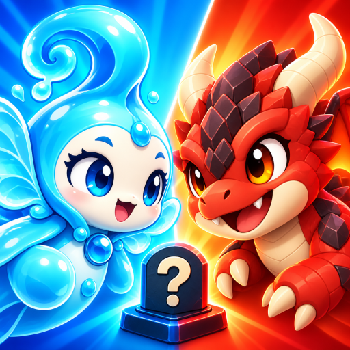
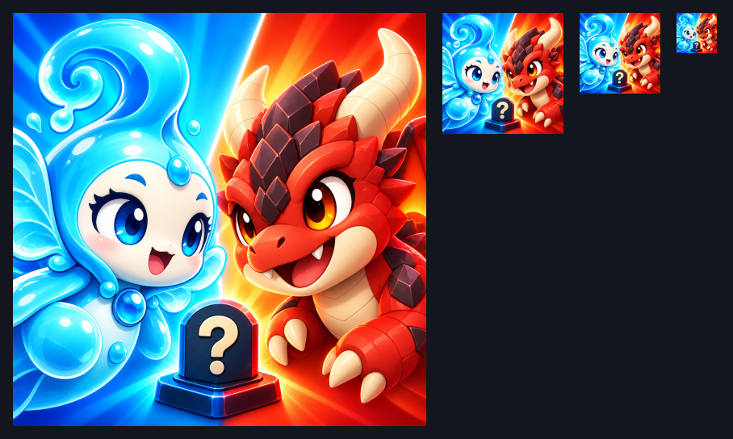

# [결정] Digit-Duel 경험 아이콘 v1 — Roblox 3D 게임 렌더 톤

2026-09-11 · Earth · Ref #118 · 요청: [earth-icon-request.md](../../../roblox/earth-icon-request.md)



## 납품

- 최종: [digit-duel-icon-v1.png](../../../../roblox/assets/marketing/digit-duel-icon-v1.png)
- **실제512×512 PNG / RGBA8 / 510,199 bytes / 모든 픽셀 alpha255.** 3MB 미만.
- SHA-256: `cd31d1dde77ae7fe758fbb131beb4aa7affa8b09d44acd76afd07c5d0acb7a94`
- 생성기가 반환한 [원본](generated-original.png)은 **1254×1254 RGB8 PNG / 1,966,451 bytes**. 원본SHA256: `fde0e763c443103e948bc85572cbc810f95271de303320d056bc099fd42b78cd`.
- 내장 image_gen으로 정사각형 구도를 별도 생성한 뒤, Blender 내부 이미지 내보내기로 **구도 변경/크롭 없이512×512 축소**했다. 생성기가512를 반환했다고 표기하지 않는다. CLI/API 대체 경로 미사용.
- 최종 PNG는 AI 생성 3D풍 홍보 이미지이며 실제 게임 화면 캡처나 새3D 메시 납품이 아니다.

## 디자인과 축소 검수

요청서의 물 요정↔새끼 용 제안, 글자/모노그램 없는 구도를 채택했다. 기존캐릭터의 청록색/아이보리 얼굴/물결 머리와 빨간 몸/크림색 뿔/짙은 비늘 정체성을 유지하면서 부드러운 장난감3D 재질로 바꿨다. 단순 파랑↔주황 대각 분할, 큰 표정, 가운데 물음표 말1개다. 캐릭터2체만 사용했고 사람/새캐릭터를 추가하지 않았다.



시트는 **908×544**, 왼쪽부터512/150/100/50px를 확대 없이 나란히 배치했다. 각 그림 좌상단좌표는(16,16)/(548,16)/(718,16)/(838,16). 시트의 여백은 검수용이며 아이콘 테두리로 납품한 것이 아니다.

- 별도 [150px](preview-150.png) · [100px](preview-100.png) · [50px](preview-50.png)
- 50px 육안: 파란 물 요정·빨간 용의 두 얼굴과 대결 방향이 구분된다. 세부 비늘/반사는 사라지므로 얼굴·큰색면을 기준으로 검수했다. 가운데물음표는 보조 의미다.
- 눈·얼굴이 귀퉁이가 아닌 내부에 있으며 최종PNG에 둥근모서리/테두리를 굽지 않았다.
- 게임명/영문/한글/숫자/모노그램 없음. 말의 물음표만 남겼다. 로블록스 로고·배지·가짜UI·버튼·화살표·무기·유혈 없음.

## 등록과 권리

메타데이터용 아트이므로 **runtime manifest/AssetIds에 추가하지 않았다**. 업로드/등록/심사는 미실행이며 CJ의 디자인 승인과 Creator Dashboard 적용은 별도다. Roblox 공식문서는512×512 아이콘과 축소 미리보기를 권장한다. [Roblox Icons](https://create.roblox.com/docs/production/publishing/experience-icons).

사용자 제공 타게임 썸네일 모음은 색감·단순3D 표현 참조로만 사용했다. 해당게임의 캐릭터·문구·UI·로고는 복사하지 않았다. 신규 아트/원본/검수 PNG는 [ASSET-LICENSE.md](../../../../ASSET-LICENSE.md)에 따라 Apache-2.0 제외. Copyright 2026 Sung Changjo and the respective contributors. All rights reserved.

## 최종 생성 프롬프트

```text
Use case: ads-marketing.
Asset type: ONE square Roblox experience icon, exact 512x512 if possible, opaque full bleed, designed to remain clear at 50x50.
Input image 1: original game character identity reference ONLY. Input image 2: Roblox thumbnail style reference ONLY; copy no characters, brands, words, buttons, or UI from it.
Make a completely fresh square composition in an unmistakable friendly Roblox 3D toy-pet render aesthetic. Do NOT crop the landscape artwork. Do NOT use its painted forest style.
Exactly TWO subjects: original cyan water fairy versus original red baby dragon. No leaf creature, no electric golem, no humans, no new characters.
The fairy has an ivory face, big blue eyes, cyan curled water crest, and small watery fin wings. The dragon has a red muzzle, big warm amber eyes, ivory horns, a cream lower jaw, dark-red angular crown scales, and a hint of its little red wing. Keep these identity-defining colors and silhouettes, but present them as chunky beveled low-poly toys with smooth plastic material, simple clean face graphics, large friendly expressive eyes, and broad glossy highlights. Not Minecraft voxel cubes; not anime painting; think approachable Roblox pet models.
Composition: EXTREME readable head-and-shoulders close-up, water fairy on the left looking inward/right and dragon on the right looking inward/left, playful competitive smiles. Heads together occupy roughly 80% of the square; both faces and eyes are large and clearly separated inside the central safe area. Keep important eyes, horns and crest well inside the edges so rounded-corner masking will not cut them.
Background: near-flat cool cyan-blue left and warm red-orange right separated on a diagonal, no forest, no buildings, no small decoration, no scenery. Distinct color masses support the duel.
At the lower center, in front of the two chests, at most ONE compact dark navy covered BOARD-GAME TOKEN with a bold cream question mark on its face, occupying about 15% of image width; simple square blue/red-accented base. It is a game piece, not a grave. The characters, not the token, dominate.
Text: NO game title, NO words, NO letters, NO monogram, NO numerals. The single question mark on the concealed game token is the only typographic symbol allowed.
Lighting: bright soft studio-style toy 3D lighting, simple shadows, saturated cyan/red, clear strong edges and facial expression. Minimal surface detail so both character identities survive 50px display.
Constraints: no Roblox logo, no other logo, no UI, no buttons, no arrows, no borders, no rounded-corner border baked into the image, no watermark, no promotional badges, no weapons, no gore. Produce only the square finished icon, not an icon embedded in a mockup or a multi-size sheet.
```

## worker_done

- required_role: Earth
- mode / area / mutation: IMPLEMENT / ART / assets, docs
- instance_index: null
- status: complete_art_delivery
- delivered: icon512 + generated_source1254 + size_review + previews150/100/50
- missing_deliverables: []
- files_modified: `roblox/assets/marketing/digit-duel-icon-v1.png`, `docs/art/roblox-v0.5.0/icon-source/README.md`, `docs/art/roblox-v0.5.0/icon-source/generated-original.png`, `docs/art/roblox-v0.5.0/icon-source/size-review.png`, `docs/art/roblox-v0.5.0/icon-source/preview-150.png`, `docs/art/roblox-v0.5.0/icon-source/preview-100.png`, `docs/art/roblox-v0.5.0/icon-source/preview-50.png`
- resolution / bytes / hash: 위 실측값
- checks: PNG8bit/RGBA512/전체alpha255/under3MB/축소 육안 확인
- code / runtime_manifest / AssetIds / git_writes / upload: none
