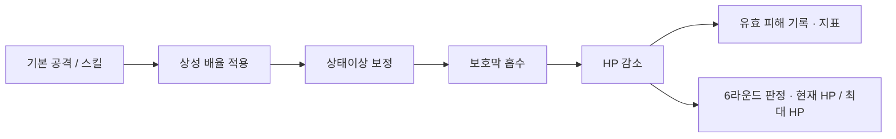

# 과거 Notion 원문 — 현행 기준으로 사용하지 않음

보관일: 2026-09-16. 임시 첨부 URL의 서명 쿼리는 제거했다. 원본 페이지는 영구 삭제하지 않고 휴지통에서 복구할 수 있도록 처리한다.

Here is the result of "fetch" for the Page with URL https://app.notion.com/p/3cd1e7f170858116bbdbd60e98cc6924 as of 2026-09-09T03:34:04.745Z:
<page url="https://app.notion.com/p/3cd1e7f170858116bbdbd60e98cc6924" icon="⚔️">
<ancestor-path>
<parent-data-source url="collection://cb30f124-3ae2-409c-a4c9-ed4c6fe9163a" name="Game Design Docs"/>
<ancestor-2-database url="https://app.notion.com/p/470445c36855472b9060cf597c2cb241" title="Digit Dual — Game Design Docs"/>
</ancestor-path>
<properties>
{"Editor":["<mention-user url=\"user://8e0a8270-d0e3-407e-a7d2-b3f992f1e366\"></mention-user>"],"Owner":["<mention-user url=\"user://8e0a8270-d0e3-407e-a7d2-b3f992f1e366\"></mention-user>"],"Project":["https://app.notion.com/p/3ae1e7f1708580f7bb88c7ee4f511aa0"],"Status":"백로그","Summary":"","Version":"v0.4 계약 — v0.4.5 D14 출시 (2026-09-08)","date:Edit Date:is_datetime":0,"date:Edit Date:start":"2026-09-09","url":"https://app.notion.com/p/3cd1e7f170858116bbdbd60e98cc6924","마지막 수정":"2026-09-15T01:06:06.126Z","문서 ID":"GDD-14","문서 상태":"승인","문서 유형":"Data·Economy","문서명":"\\[DATA\\] 전투 수치 — 판정·상성·쿨타임","상위 기획서":["https://app.notion.com/p/3cd1e7f17085817f8c35fa8548116f38"],"요약":"D14 무제한 텔레포트·만피 회복 지정 v0.4.5 출시. Saturn·CJ 플레이 QA PASS. 기존 AI 가치 재사용·밀기/재배치 난수0. D15\\~D19의 v0.4.4 이력과 일반 밸런싱 백로그 유지. Mercury.","참조 링크":"https://app.notion.com/p/3ca1e7f170858183beddfb1e8ecbbfe7","태그":["전투"],"템플릿 원본":"__NO__"}
</properties>
<iconMetadata>{"type":"emoji","emoji":"⚔️"}</iconMetadata>
<content>
<callout icon="⏸️" color="gray_bg">
	**2026-08-31 CJ 지시로 보류:** 수치·밸런싱 작업은 추후 진행합니다. 현재는 컨셉·게임 방향성 확립이 우선이며, D1\~D14를 백로그로 유지합니다(D8\~D13 결정, D14는 v0.4.5 무제한 개정 구현·독립 QA PASS 및 CJ 플레이 QA PASS·v0.4.5 출시, D3 데이터 수집 중, D7 GDD-16으로 이관, D1·D2·D4·D6 Open, D5는 2026-09-08 HP 비율 판정으로 판정 보정 비적용).
	**구현 현황 (2026-09-03 v0.3.1 대조, 확정 사실):** HTML 데모 v0.3.1(`demo/index.html`의 BAL 상수)은 이 문서의 제안 초기값(상성 1.3/0.75, 화상 5%×2R, 약화 20%×2회, 보호막 15%·회복 10%·흡수 상한 30%, 분산 ±20%)을 **승인 전 임시값**으로 사용 중이다. 이 사실은 승인 상태를 바꾸지 않는다.
</callout>
<callout icon="⚠️" color="yellow_bg">
	**Q8 A안 실행으로 생성된 문서입니다 (2026-08-31).** 이 문서의 모든 수치는 추론 Agent 제안 초기값이며, 확정으로 표기된 항목은 상위 기획서 <mention-page url="https://app.notion.com/p/3cd1e7f17085817f8c35fa8548116f38"/>에서 이미 확정된 규칙을 인용한 것입니다. CJ 승인 전까지 구현 기준으로 사용하지 않습니다.
</callout>
# 1. 문서 요약
- **대상 데이터:** 전투 판정·속성 상성·상태이상·스킬 쿨타임·경기 제한 수치
- **게임 내 목적:** GDD-13 4.6·4.10의 기획 필요 수치를 일괄 확정 (Q8 A안)
- **권위 주체:** 추론 정적 테이블 — 프로토타입은 클라이언트 로컬, 프로덕션은 서버 검증
- **갱신 주기:** 추론 플레이테스트 라운드마다 버전 태그로 갱신
# 2. 피해 계산 파이프라인
추론 확정 규칙(유효 피해 기록 순서)과 모순이 없도록 구성한 계산 순서입니다.

- 확정 보호막 흡수 피해는 유효 피해에서 제외, 초과 피해 제외, 누적 100% 상한, 회복은 기록 보존 (GDD-13 4.6)
# 3. 데이터 스키마
추론
<table fit-page-width="true" header-row="true">
<tr>
<td>필드</td>
<td>형식</td>
<td>필수</td>
<td>기본값</td>
<td>범위</td>
<td>설명</td>
</tr>
<tr>
<td>unitId</td>
<td>string</td>
<td>Y</td>
<td></td>
<td></td>
<td>말 식별자</td>
</tr>
<tr>
<td>maxHp</td>
<td>int</td>
<td>Y</td>
<td>100</td>
<td>1\~999</td>
<td>최대 HP</td>
</tr>
<tr>
<td>atk</td>
<td>int</td>
<td>Y</td>
<td>22</td>
<td>0\~99</td>
<td>기본 공격력</td>
</tr>
<tr>
<td>element</td>
<td>enum</td>
<td>Y</td>
<td></td>
<td>불/물/풀/번개</td>
<td>속성</td>
</tr>
<tr>
<td>skillId / skillCooldown</td>
<td>string / int</td>
<td>Y</td>
<td>쿨 2</td>
<td>0\~4</td>
<td>기술 4슬롯(<mention-page url="https://app.notion.com/p/3ce1e7f1708581f48640c974ec2dd540"/> v1.0, 쿨 0\~4)으로 확장 — 슬롯별 남은 쿨타임 유지 (연속 전투 간 유지 — 확정)</td>
</tr>
<tr>
<td>statusEffect / statusRemain</td>
<td>enum / int</td>
<td>N</td>
<td>없음</td>
<td>0\~2라운드</td>
<td>상태이상과 잔여 라운드 (전투 종료 시 전부 해제 — Q5 확정)</td>
</tr>
<tr>
<td>shieldRemaining</td>
<td>int</td>
<td>N</td>
<td>0</td>
<td>0\~최대 HP×0.15</td>
<td>풀 보호막 잔량</td>
</tr>
<tr>
<td>recordedDamage</td>
<td>int</td>
<td>Y</td>
<td>0</td>
<td>0\~상대 최대 HP</td>
<td>이번 전투 누적 유효 피해</td>
</tr>
<tr>
<td>roundNo / firstMover</td>
<td>int / playerId</td>
<td>Y</td>
<td>1</td>
<td>1\~6</td>
<td>라운드와 선공 (라운드마다 교대 — 확정)</td>
</tr>
</table>
# 4. 자원 소비 규칙 (상위 확정 인용)
확정 GDD-13 4.6·4.8 — 아이템 전투당 2개·라운드당 1개·동일 아이템 연속 불가, 일반 인벤토리 5개·몬스터볼 별도 3개, 포획 시도 이벤트당 1회.
# 5. 계산 규칙 — 제안 수치
## 5.1 기준 능력치
추론
<table fit-page-width="true" header-row="true">
<tr>
<td>말</td>
<td>최대 HP</td>
<td>기본 공격</td>
<td>스킬 공격</td>
<td>스킬 쿨타임</td>
</tr>
<tr>
<td>하수인</td>
<td>100</td>
<td>22</td>
<td>35</td>
<td>2라운드</td>
</tr>
<tr>
<td>동료</td>
<td>100</td>
<td>16 (약체 의도)</td>
<td>없음</td>
<td>—</td>
</tr>
<tr>
<td>왕</td>
<td>100</td>
<td>16 (약체 의도)</td>
<td>없음</td>
<td>—</td>
</tr>
<tr>
<td>포획·공용 하수인</td>
<td>100</td>
<td>20</td>
<td>30</td>
<td>2라운드</td>
</tr>
</table>
- 확정 전투 중 적 하수인 포획(D12)으로 생성되는 예비 하수인은 **현재 HP 70 / 최대 HP 100**, 공격 20·스킬 30·CD 2, 대상의 속성·아키타입·기술 구성 승계 (2026-09-02 QA 사이클 5, GDD-13 4.8). 숲 공용 하수인 포획은 100/100 유지.
- 의도: 기본 공격 22 기준 양측 교환 시 5라운드 전후 결판 → 6라운드 판정전과 즐사 결판이 섮이도록 설계. 동료·왕은 순수 전투력을 낮게 둬 포획 하수인·위치 운용 가치를 높임.
- 기획 필요 동료·왕의 HP·공격 차등 여부는 Q2(동료·왕 전투 판정) 결정과 묶어 확정 필요
- v0.4.4 계약(#95): 공격형 4종(M-F2·W2·G2·L2)의 기본 공격력 26→25, 결정타 기준 위력 44→40. 그 밖 HP·쿨·기술·아키타입 수치는 유지한다. Venus 권고를 PD가 채택한 1차값이며 사람 플레이 균형 확정을 뜻하지 않는다.
## 5.2 속성 상성
추론 순환 방향: 불 → 풀 → 번개 → 물 → 불 (앞이 뒤에 유리)
<table header-row="true">
<tr>
<td>관계</td>
<td>배율</td>
<td>반올림</td>
</tr>
<tr>
<td>유리</td>
<td>×1.3</td>
<td>사사오입</td>
</tr>
<tr>
<td>동일·무관</td>
<td>×1.0</td>
<td>—</td>
</tr>
<tr>
<td>불리</td>
<td>×0.75</td>
<td>사사오입</td>
</tr>
</table>
- 소프트 카운터 유지(확정 원칙)를 위해 배율 폭을 ±30% 이내로 제한. 순환 방향은 기획 필요 — CJ 확정 대상.
## 5.3 상태이상
추론 방향성은 GDD-13 추론 초안 유지, 수치만 구체화. 전투 종료 시 전부 해제(Q5 확정).
- 확정 부여 확률(D10): 일반 화상·약화 70%, 일반 감전은 v0.4.4 계약에서 70→50%(shockProb 별도)로 하향한다. 확정 부여 시그니처 잔류장과 레거시 지속형 100%는 유지한다. D10 초기값을 CJ 너프 지시에 따라 좁게 조정한 1차값이며 디버프 발생률·플레이테스트로 재평가한다.
- **v0.4.4 #96 실측(2026-09-07):** [PR #101](https://github.com/ChangjoSung/Digit-Duel/pull/101)을 Saturn PASS 후 dev d614392에 통합했다. #95 조정이 양쪽에 포함된 dadc8bc 기준으로 감전1,000회씩5창은67.6/67.9/72.3/69.1/69.7%→46.9/48.1/51.0/49.6/50.1%, 화상·약화 결과 벡터는 동일, 확정 잔류장300/300과 이후 난수도 동일했다. AI40판은430전투77감전→418전투58감전(전투당0.179→0.139)으로 감소했다. 이는 갈라진 게임 전개의 총합 비교이며 사람 체감·승률 보증이 아니다. Saturn 직접 스모크597·비교11·경계36·Chrome5를 통과했다. `docs/milestone/v0.4.4/issues/96/Saturn/issue96-saturn.md`·`docs/milestone/v0.4.4/issues/96/Mars/issue96-integration.md` 참조; 이전0.160→0.128은 #95 이전 기준이다.
<table fit-page-width="true" header-row="true">
<tr>
<td>상태이상</td>
<td>효과</td>
<td>지속</td>
<td>제한</td>
</tr>
<tr>
<td>화상 (불)</td>
<td>라운드당 최대 HP 5% 고정 피해</td>
<td>2라운드</td>
<td>중첩 불가, 동일 상태 연속 발동 불가 (확정)</td>
</tr>
<tr>
<td>약화 (물)</td>
<td>공격력 20% 감소</td>
<td>대상의 공격 2회</td>
<td>중첩 불가</td>
</tr>
<tr>
<td>보호막 (풀)</td>
<td>시전 시 최대 HP 15% 보호막 + 시전자 HP 10% 회복</td>
<td>소진 시까지</td>
<td>판정 비적용(2026-09-08): 잔여 HP 비율 판정 채택으로 흡수 상한은 승패 공식에 쓰이지 않는다. 기존 유효 피해 지표 기록은 보존하며 이 항목을 근거로 새 보정 수치를 구현하지 않는다</td>
</tr>
<tr>
<td>감전 (번개)</td>
<td>다음 라운드에 대상은 선공 교대와 무관하게 후공</td>
<td>1라운드</td>
<td>v0.4.4 일반 부여50%·확정 잔류장100%. 지속·선후공 교대는 이번 변경에서 유지. 현재 4슬롯 감전은1R, 레거시 지속형만2R이며 두 경로 차이는 별도 검토 부채. 라운드 두 번째 행동자가 부여하면 다음 라운드 선공 교대와 겹쳐 순서 효과가 없을 수 있다.</td>
</tr>
<tr>
<td>회피(공용 효과)</td>
<td>받는 피해 30% 감소</td>
<td>1회</td>
<td>완전 회피 없음 (확정 원칙)</td>
</tr>
</table>
## 5.4 판정·경기 제한
- 보드 회복(2026-09-08 CJ): 주 행동 지정 후 지속, 지정 턴부터 양측 개별 플레이어 턴 종료마다 `round(maxHp×0.05)`, 최대 HP 상한. 만피에서도 자세 유지, 이동·탐색·전투 시 해제. 세부 GDD-13 4.3·저장소 `docs/milestone/v0.4.4/specs/v0.4.4-turn-flow-spec.md`.
- 연출 시간(PD 채택): 보드/접촉/라운드/기술/피해 배너 2초, 3→2→1 및 시작 문구 각 1초, 결과 2.5초. 65턴 버닝타임 배너 2초를 일반 턴 배너보다 먼저 표시한다. 시간·입력 잠금은 로컬 표시이며 규칙 난수를 소비하지 않는다.
- v0.4.5 출시: 양측 밀기·공동 재배치는 난수를 소비하지 않는다. 영역·거리·자기 진영 방향 행·열로 결정적 순서를 정하며 정확한 비교 함수는 구현 계약에 기록한다. 재배치 배너는 기존 2초 설정을 사용한다. 텔레포트 경기당 제한은 없애되 주 행동·사전 차단·취소는 유지한다.
- 확정 판정 공식(2026-09-08 CJ): 각 전투원의 현재 HP ÷ 최대 HP가 높은 쪽 승리. 보호막 수치는 비율에 더하지 않는다. 누적 유효 피해는 지표 전용
- 확정 동률 시 기존 방어자 승 유지(PD 권고 채택). HP 70/100 대리 하수인도 같은 비율을 적용하며 이번 추가 보정은 없다
- 확정 최대 보드 턴: **상한 없음**(기권 버튼 운영, D3 데이터 수집 중 — 2026-08-31). AI vs AI 시뮬레이션만 안전 상한 500턴(무승부). 데모 상수 `maxTurns:60`은 AI의 후반 공세 압력 계산에만 쓰이며 경기 종료 조건이 아니다(2026-09-03 대조).
- 확정 버닝 타임 시작: 65턴 (D9 — 초기값, 자연 종료 턴 데이터로 조정. 규칙은 GDD-13 4.11)
- 추론 제한 시간: 경기 총 20분 — 대안: 인당 10분 체스클록 방식
- 반올림: 모든 피해 계산은 사사오입 후 정수 처리
- 확정 피해 분산(D8): 기본 공격·스킬 피해는 기대값 유지 ±20% 균등 분산 후 사사오입 (2026-08-31, CJ 2차 피드백). 화상 등 지속 피해와 포획 실패 피해는 고정값 유지. 판정 뒤집힘 비율을 측정해 폭 재조정.
# 6. 밸런스 가정
추론
- 전투의 60% 이상이 3\~5라운드 내 즐사로 종결, 판정전 비율 30% 이하 목표
- 평균 경기 25\~40 보드 턴, 무승부율 10% 이하 목표
- 위험: 배율 ±30%가 체감에서 무의미하면 상성 존재감 상실, 과도하면 속성 가위바위화 — A/B 데이터로 조정
# 7. 마이그레이션과 호환
추론 프로토타입 단계는 테이블 버전 태그(balance_v0_1 등)만 관리하고, 롤백은 직전 태그로 교체. 사용자 데이터 마이그레이션은 해당 없음(경기 종료 시 획득물 삭제 — 확정).
# 8. 분석과 모니터링
- 확정 측정 지표는 <mention-page url="https://app.notion.com/p/3ca1e7f170858183beddfb1e8ecbbfe7"/> 7장 비교 지표를 단일 기준으로 사용 (6라운드 판정률·동률률·공격자/방어자 승률 포함)
- 추론 추가 모니터링: 속성별 픽률·승률, 평균 종결 라운드, 풀 흡수 상한 도달 빈도
- **v0.4.4 #95 실측(2026-09-07, Saturn 독립 재현 PASS·PR#99 dev dadc8bc 통합):** [PR #99](https://github.com/ChangjoSung/Digit-Duel/pull/99), 동일 속성·5급 AI·아이템/볼0·조합당150·시드5000에서 공격형 후공−선공 격차는 도망 포함 전체14.2→5.2pt, 도망 제외 결판14.9→10.1pt. 도망 미결26\~28%를 분리한다. 전체 격차 감소9.0pt 중5.1pt는 공격형끼리 대진에서 발생했다. 비미러 결판 격차3.5→7.1pt, 불 속성17.4→18.2pt는 증가해 모든 대진의 균형 개선을 뜻하지 않는다. 분산 상단 불 연속 피해106은 HP100 제거가 가능하다. 초기 Venus 수치는 가설이고 구현 실측·Saturn 검수·CJ 플레이 결과를 구분한다. 근거는 저장소 `docs/milestone/v0.4.4/issues/95/Mars/issue95-mars.md`와 비교 JSON이다.
# 9. Acceptance Criteria
- [ ] 모든 속성 조합에 배율이 정의되어 있다.
- [ ] 화상·흡수·회복 결과가 현재 HP에 반영되고 6라운드 HP 비율 판정·동률 방어자 승과 일치한다. 기존 유효 피해 기록은 지표로 분리한다.
- [ ] 경기 종료 보장 — 턴 상한 없음(기권 운영) 결정에 따라 자연 종료 턴 분포를 측정해 D3·D4를 결정한다.
- [ ] 6라운드 내 종결 비율과 판정전 비율을 측정할 수 있다.
- [ ] 반올림·상한·하한 규칙이 있다.
# 10. 미확정 사항 — CJ 결정 필요
<table fit-page-width="true" header-row="true">
<tr>
<td>번호</td>
<td>항목</td>
<td>선택지</td>
<td>상태</td>
</tr>
<tr>
<td>D1</td>
<td>속성 순환 방향</td>
<td>A. 불→풀→번개→물→불 (제안) / B. 다른 순환 지정</td>
<td>Open</td>
</tr>
<tr>
<td>D2</td>
<td>상성 배율</td>
<td>A. 1.3 / 0.75 (제안) / B. 1.5 / 0.67 (강한 상성) / C. 1.2 / 0.85 (약한 상성)</td>
<td>Open</td>
</tr>
<tr>
<td>D3</td>
<td>최대 보드 턴</td>
<td>A. 60턴 (제안) / B. 40턴 / C. 80턴</td>
<td>데이터 수집 중 2026-08-31 — 데모 상한 해제(기권 버튼 운영), 자연 종료 턴 분포 축적 후 결정. AI 시뮬만 안전 상한 500턴. 근거: AI 시뮬 10판 + CJ 실플레이 전부 60턴 도달</td>
</tr>
<tr>
<td>D4</td>
<td>제한 시간 방식</td>
<td>A. 경기 총 20분 (제안) / B. 인당 10분 체스클록 / C. 턴 제한만 사용</td>
<td>Open</td>
</tr>
<tr>
<td>D5</td>
<td>풀 흡수 판정 상한 30% 제안</td>
<td>HP 비율 판정에서는 흡수 상한 보정 비적용</td>
<td>2026-09-08 판정 쟁점 종료. 기존 기록은 지표로 보존, 추가 수치 조정 없음</td>
</tr>
<tr>
<td>D6</td>
<td>동료·왕 능력치 차등 (Q2 연동)</td>
<td>A. 공격력만 약체 (제안) / B. HP도 차등 / C. 하수인과 동일</td>
<td>Open</td>
</tr>
<tr>
<td>D7</td>
<td>전용 스킬 목록과 개수 (하수인 6종)</td>
<td>A. 속성별 1종 × 4 + 공용 2종으로 시작 (제안) / B. 별도 목록 문서화</td>
<td>B로 이관 2026-08-31 — \[CONTENT\] 하수인 로스터 R1\~R4 A안 승인 → 2026-09-01 기술 4슬롯 체계(GDD-16 v1.0)로 대체, 데모 구현 완료</td>
</tr>
<tr>
<td>D8</td>
<td>피해 분산 폭 (2026-08-31 신규)</td>
<td>기대값 유지 균등 분산 ±20% — CJ "확률적 데미지" 지시 + Agent 권장(±15\~20%)</td>
<td>결정 2026-08-31 — 판정 뒤집힘 비율 데이터로 폭 재조정</td>
</tr>
<tr>
<td>D9</td>
<td>버닝 타임 시작 턴 (2026-08-31 신규)</td>
<td>65턴 — CJ 게임플레이 피드백</td>
<td>결정 2026-08-31 — 자연 종료 턴 분포 데이터로 재조정</td>
</tr>
<tr>
<td>D10</td>
<td>상태이상 부여 확률 (2026-09-01 신규)</td>
<td>최초 일반70% / 지속형100%. v0.4.4 일반 감전만50%로 조정(D17); 다른 상태70%·확정 시그니처100% 유지</td>
<td>결정 2026-09-01 — 상태 발동률 지표로 재조정</td>
</tr>
<tr>
<td>D11</td>
<td>시작 아이템 (2026-09-01 신규)</td>
<td>경기 시작 시 일반 아이템 무작위 2개 지급 (인벤 5 상한 내) — CJ QA 사이클 2</td>
<td>결정 2026-09-01 — 아이템 사용률 지표로 조정</td>
</tr>
<tr>
<td>D12</td>
<td>적 하수인 포획 (2026-09-02 신설)</td>
<td>전투 중·대상 HP 30% 미만·성공 70%·라운드당 1회, 성공 시 공용 예비 슬롯 1칸</td>
<td>결정 2026-09-02 — 포획 시도율·승률 영향 지표로 조정</td>
</tr>
<tr>
<td>D13</td>
<td>도망가기 (2026-09-02 신설)</td>
<td>자기 HP 50% 미만·성공 50%·실패 시 상대 즉시 공격 1회·성공 시 후방 교환 선택</td>
<td>결정 2026-09-02 — 도망 시도/성공률 지표로 조정</td>
</tr>
<tr>
<td>D14</td>
<td>텔레포트 사용 제한 (2026-09-02)</td>
<td>스와프형 전환 후 경기당 2회 → v0.4.5 경기당 무제한(주 행동 소모·사전 차단·취소 유지)</td>
<td>결정 2026-09-02(2회) → 2026-09-08 CJ 무제한 개정(v0.4.5 승인, Issue #114 구현·독립 QA PASS, PR #115 dev 통합·CJ 플레이 QA PASS·v0.4.5 출시). 사용률·역전률·AI 반복 교환 지표로 관찰. 새 상한 수치는 임의 도입하지 않음</td>
</tr>
<tr>
<td>D15</td>
<td>탐색 기술 교체</td>
<td>타 속성 공격기 후보1개·공격 슬롯0/1 교체 또는 유지·쿨 승계·공격은 기술 속성/방어는 본체 속성</td>
<td>v0.4.4 계약, 2026-09-07 Venus 권고 PD 채택. Issue #92 / PR#103 dev ad5f2a8 통합·Saturn 규칙/브라우저 PASS. 공격192조합·실제2클라이언트 교체/포획·메모 경합 검증. 보드 단계 본체속성 추정은 유지. 2026-09-08 CJ QA PASS·Issue #92 종료·v0.4.4 출시 완료</td>
</tr>
<tr>
<td>D16</td>
<td>공격형 화력 완화</td>
<td>공격형4종 atk25·결정타40, 다른 수치·교대 구조 유지</td>
<td>v0.4.4 1차값, 2026-09-07 Venus 권고 PD 채택. Issue #95 / PR#99 dev 통합·Saturn PASS. 전체 AI 표본 격차는 감소했으나 비미러/불 대진은 개선되지 않음(8장). CJ 플레이테스트로 조정</td>
</tr>
<tr>
<td>D17</td>
<td>일반 감전 확률 하향</td>
<td>shockProb0.5·다른 상태0.7·확정 시그니처100% 유지</td>
<td>v0.4.4 1차값, 2026-09-07 Venus 권고 PD 채택. Issue #96 / PR#101 dev 통합·Saturn PASS. 일반감전50%·다른상태70%·확정100% 검증. CJ 플레이테스트로 조정</td>
</tr>
<tr>
<td>D18</td>
<td>6라운드 승패 판정</td>
<td>현재 HP / 최대 HP 비교, 동률 방어자 승</td>
<td>2026-09-08 CJ 잔여 HP 판정 지시·PD 동률 유지 채택. Issue #106 구현·Saturn 독립 QA·CJ QA PASS, PR #109 통합 후 PR #111로 v0.4.4 출시 완료</td>
</tr>
<tr>
<td>D19</td>
<td>보드 지속 회복</td>
<td>주 행동 지정, 각 플레이어 턴 종료마다 최대 HP 5%, 두 턴 합계 10%</td>
<td>2026-09-08 CJ 확정. 지정 턴부터 지속·이동/탐색/전투 해제. Issue #106 구현·Saturn 독립 QA·CJ QA PASS, v0.4.4 출시 완료. 만피 신규 지정은 v0.4.5 구현·독립 QA PASS, CJ 플레이 QA PASS·v0.4.5 출시</td>
</tr>
</table>
</content>
</page>
