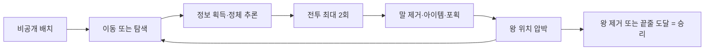

# 과거 Notion 원문 — 현행 기준으로 사용하지 않음

보관일: 2026-09-16. 임시 첨부 URL의 서명 쿼리는 제거했다. 원본 페이지는 영구 삭제하지 않고 휴지통에서 복구할 수 있도록 처리한다.

Here is the result of "fetch" for the Page with URL https://app.notion.com/p/3cd1e7f17085817f8c35fa8548116f38 as of 2026-09-16T03:40:25.230Z:
<page url="https://app.notion.com/p/3cd1e7f17085817f8c35fa8548116f38" icon="🎮">
<ancestor-path>
<parent-data-source url="collection://cb30f124-3ae2-409c-a4c9-ed4c6fe9163a" name="Game Design Docs"/>
<ancestor-2-database url="https://app.notion.com/p/470445c36855472b9060cf597c2cb241" title="Digit Dual — Game Design Docs"/>
</ancestor-path>
<properties>
{"Editor":["<mention-user url=\"user://8e0a8270-d0e3-407e-a7d2-b3f992f1e366\"></mention-user>"],"Owner":["<mention-user url=\"user://8e0a8270-d0e3-407e-a7d2-b3f992f1e366\"></mention-user>"],"Project":["https://app.notion.com/p/3ae1e7f1708580f7bb88c7ee4f511aa0"],"Status":"완료","Summary":"2026-09-13 Mercury_PD 후속 정리 완료: CJ가 v0.4.10 마일스톤을 종료했고 #217/#218 CLOSED 상태 확인. 종료 트랙 milestone/v0.4.10 원격·로컬 삭제. CJ README PR228의 최신 main d0bc196325102edbd8e8fb5787822a326083c389을 PR229 dev654a6e2, PR230 Roblox milestone/v0.5.0 dda7b3c, PR231 Unity milestone/v0.6.0 2077380에 동기화. 필수 CI 각각6/6/7 PASS, 기존 트랙 이력과 제품 폴더 보존, README main 일치, 로컬·원격동일. 동기화 임시브랜치2개 삭제 및 작업공간 정리. 기존 미커밋6파일·겹친로컬문서8개 보존 확인. PR필수·강제push금지인 공유트랙 rebase는 수행하지 않음. v0.4.10 정식 출시·공개주소 [https://digit-duel-mipa.onrender.com](https://digit-duel-mipa.onrender.com) 유지, 기획본문 과거 상태보다 이 운영Summary와 #217 최종댓글이 우선.","Version":"v0.4.10 정식 출시 — HTML 공개 방 온라인 대전 / main·Render","date:Edit Date:is_datetime":0,"date:Edit Date:start":"2026-09-16","url":"https://app.notion.com/p/3cd1e7f17085817f8c35fa8548116f38","마지막 수정":"2026-09-16T03:40:25.234Z","문서 ID":"GDD-13","문서 상태":"승인","문서 유형":"Game Overview","문서명":"Game Overview — Digit Duel","상위 기획서":["https://app.notion.com/p/3c91e7f17085801b8435fb3325a6e670"],"요약":"v0.4.10 공개 방 온라인 대전 정식 출시 및 CJ README 후속 최신화 완료. [https://digit-duel-mipa.onrender.com](https://digit-duel-mipa.onrender.com) 에서 PC·휴대폰 1대1 플레이. main b511a93 / Render Free 기본 도메인·TLS / CI 통과 후 자동 배포 Live. 모바일 기술 설명·교환 후 턴 동기화·전투 아트·승패 연출 보완 및 Saturn QA PASS. Roblox v0.5.0·Unity v0.6.0 미출시. 계정·채팅·랭킹·자동 매칭·관전은 범위 밖.","참조 링크":"https://app.notion.com/p/3ca1e7f170858183beddfb1e8ecbbfe7","태그":["전투","튜토리얼","UI"],"템플릿 원본":"__NO__"}
</properties>
<iconMetadata>{"type":"emoji","emoji":"🎮"}</iconMetadata>
<content>
<callout icon="🧭" color="blue_bg">
	**Digit Dual의 구현·QA 기준 문서입니다.** 원본 Concept(<mention-page url="https://app.notion.com/p/3c91e7f17085801b8435fb3325a6e670"/>)을 대체하며, 전 항목 결정 완료 상태입니다. 수치는 <mention-page url="https://app.notion.com/p/3cd1e7f170858116bbdbd60e98cc6924"/>의 보류 백로그(D1\~D14)로 관리합니다. DIGEST 3호(<mention-page url="https://app.notion.com/p/3d51e7f1708581ea868df38e869a4955">Digit Dual 룰셋 정리본 — 읽는 판 (DIGEST 3호, v0.4.5 기준)</mention-page>)는 v0.4.5 시점 스냅샷이며 현재 정식 규칙이 아니다 — 최신 규칙은 아래 4장 본문과 12장 Decision Log를 따른다. 이전 2호는 하단에 출시 이력으로 보존한다.
	**표기 범례:** 확정 CJ 승인 규칙(초기값은 플레이테스트 데이터로 조정 가능) · 추론 Agent 추론·검토 대기 · 기획 필요 CJ 결정 대기
</callout>
<callout icon="📌" color="gray_bg">
	**CURRENT — 이 문서에서 "지금"은 이 콜아웃이 전부다 (2026-09-16 기준).** 정식 출시 = main tag **v0.4.10**(HTML 데모). 마일스톤 번호는 2026-09-10 [Issue #169](https://github.com/ChangjoSung/Digit-Duel/issues/169) 재배번이 최종이다 — **v0.4.6 = HTML 데모 완결(2026-09-11 출시)** · **v0.5.0 = Roblox(미출시)** · **v0.6.0 = Unity(미출시)**. **v0.4.10은 완료**되었고 [#217](https://github.com/ChangjoSung/Digit-Duel/issues/217) 외부망 서버(<mention-page url="https://app.notion.com/p/3d91e7f170858110bf64f7416bba2d01"/>)와 #218 로비, 해당 마일스톤은 종료됐다. 다음 계획 버전 **v0.4.11**(전투·시너지·성장·상점 개편)은 **기획 단계**이며 GitHub 이슈·마일스톤을 아직 열지 않았다.
	**규칙의 최신 상태는 4장 본문이고, 근거·경과는 12장 Decision Log(DL1\~71)다** — 상단 배너에 경과를 다시 쌓지 않는다. 접촉·전투 규칙은 2026-09-10 CJ QA(**DL57** · #122 2차)가 최신이며 종전 밀어내기 계약(#114·#121·#146)을 대체한다. 본문의 "v0.4.4 출시"·"v0.4.5 출시" 같은 표기는 *그 동작이 어느 릴리스에서 나갔는지*를 가리키는 이력 표기이지 현재 정식 버전 표기가 아니다. v0.4.11 전투·시너지·성장·상점 개편은 <mention-page url="https://app.notion.com/p/3dc1e7f1708580329da6fe4986654f7b"/>이 원본이고 **기획 단계이며 아직 출시 규칙이 아니다**(DL71).
</callout>
<callout icon="🗒" color="yellow_bg">
	**이력은 상단에 쌓지 않고 12장 Decision Log에 둔다.** 재배번 이전 v0.4.7 트랙의 일정·통합 경과(게임 #119\~#131, Infra #132·#134, PR133·136·143·152·157·160·167)는 **DL33\~DL56**, 접촉·전투 규칙 개편과 #122·#124·#126 종결은 **DL57**, 버전 재배번·트랙 브랜치 도입(#169)은 **DL58**, hotfix 계약(#175)은 **DL59**, Unity 포팅 준비(#182·#183·#195)는 **DL60\~DL62**, 온라인 아트·함정 아이콘(v0.4.8·v0.4.9)은 **DL63\~DL64**, 이번 Notion 동기화는 **DL65\~DL67**이 원본이다. 연결 기획서: <mention-page url="https://app.notion.com/p/3d61e7f17085809ea410fe6a1431f06c"/> · <mention-page url="https://app.notion.com/p/3d71e7f1708581f292ede2ab862e63f5"/> · <mention-page url="https://app.notion.com/p/3d61e7f170858126a889e682610ebad7"/>
</callout>
<table_of_contents/>
# 1. Executive Summary
- **한 문장 피치:** 확정 7×13 대칭 전장에서 정체와 숲 속 위치를 감춘 14개의 말을 운용하고, 탐색과 짧은 속성 배틀을 통해 상대 왕을 제거하는 1대1 턴제 전략 게임
- **장르:** 확정 비공개 정보 기반 PvP 턴제 전술 / 보드게임
- **플랫폼:** 확정 Android 모바일 우선, Unity 엔진. 기획 검증용 데모는 로컬 HTML 선행(2트랙).
- **버전 관리·개발 인프라:** 확정 Git·GitHub, Milestone·Issue·PR 운영과 Unity 기본 구조(Table·Folder·Assembly·Addressable)는 MyFundManager 벤치마킹, audition_Idol 참조 구조 추가 검토. 운영 규칙은 저장소 [CLAUDE.md](http://CLAUDE.md). 2026-09-11 v0.6.0 사전 분석·이슈 등록 후 CJ가 #182·#183 실행을 승인했다. 순서는 #183 CLI·에이전트 설정 준비 → #182 최소 Unity 프로젝트 → #183 Pipeline·직접 CLI/MCP 실연결 검증 → #182 참조 구조·Android 환경 구성 및 테스트다. CLI 직접 실행을 기본 경로로 확보하며 MCP도 별도 검증한다. CJ 추가 지정에 따라 Unity MCP는 현재 PC의 로컬 stdio 서버로 구성하고 Orca/Codex 활성 계정·Claude Code에서 실제 도구 호출까지 확인한다. 최신 정식 Unity·Android APK, 공식 CLI/Pipeline을 통한 Codex·Claude 연동, 정적 TSV와 런타임/DB 분리가 준비 범위다. UI Toolkit은 실기 PoC 후 판단할 후보이고, gRPC·MongoDB 서버는 담당/계약 확정 전 등록만 한다. [v0.6.0 마일스톤](https://github.com/ChangjoSung/Digit-Duel/milestone/4)과 #182 환경·#183 MCP·#185 데이터·#186 Core·#187 UI·#184 온라인이 실행 단위다. 2026-09-11 기술 검증 결과: Unity6000.6.0f1·공식 Android 모듈11개·Core/Application 분리 기반, min26/target36 ARM64 IL2CPP 개발 APK를 구축해 삼성 Android16 기기 설치·터치·홈 복귀·세로/safe area·Atlas를 확인했다. 새 Codex/Claude의 실제 로컬 MCP 호출과 Claude 단일 writer의 임시 scene 변경/복구·다중 Editor 선택을 검증했고 Unity40개·MCP46개 검사 및 Saturn 최종 소스 검수는 PASS다. 짧은 공백 경로의 새 Git checkout에서 import·검사·최종 래퍼 APK 빌드도 성공했다. [Issue182](https://github.com/ChangjoSung/Digit-Duel/issues/182)·[Issue183](https://github.com/ChangjoSung/Digit-Duel/issues/183)는 2026-09-11 CJ의 QA Test PASS로 CLOSED 처리했다. 후속 [Issue195](https://github.com/ChangjoSung/Digit-Duel/issues/195)·[PR197](https://github.com/ChangjoSung/Digit-Duel/pull/197)에서 구조43·MCP46·Core/Application 실제 C# 빌드를 담당하는 F를 추가하고, 최종 CI7·Saturn 재검수 PASS 후 Unity 트랙에 squash했다(b5deb1c). Unity 트랙만 필수 검사7개이며 main/dev/Roblox 트랙은6개와 기존 보호를 유지한다. F는 실제 Unity Editor import/전체 컴파일·Edit/Play·APK CI를 대신하지 않는다. 해당 자동화는 전용 인증·실행 환경 검증 후 별도 활성화한다(DL62). 게임 구현·마일스톤 출시 완료를 뜻하지 않는다. 초기 Worker의 Hub DB 수동 열 추가는 무결성 검사 통과 후 보존 중이며 안전한 사전 백업을 입증하지 못해 원복하지 않았다(DL61).
- **대상 플레이어:** 확정 짧은 규칙 안에서 추리와 위치 선점, 위험 관리를 즐기는 전략 게임 플레이어
- **핵심 차별점:** 확정 정체 비공개(정보전)와 숲 위치 은폐(공간전)의 이중 은폐 구조 + 최대 6라운드의 짧은 속성 배틀
- **현재 단계·프로토타입 목표:** 확정 Pre-Production. 보드 판단이 탐색 운·전투 RNG보다 승패에 크게 작용하는지 검증
# 2. 게임 비전
## 플레이어 판타지
- 확정 감춰진 전장을 읽고 상대 말의 정체를 꿰뚫어 승부를 설계하는 지휘관 경험
## 디자인 필러
확정
1. **정보전:** 공개된 행동과 이동 기록으로 상대 말의 역할을 추론한다.
2. **공간전:** 7열 전선과 두 개의 숲을 점유하고 매복·후퇴 경로를 관리한다.
3. **심리전:** 왕을 다른 말처럼 운용하고 폭탄·함정·동료 가능성을 이용해 상대 판단을 흔든다.
4. **짧은 배틀:** 보드 판단의 결과를 최대 6라운드 전투로 빠르게 판정한다.
## 비목표
확정
- MVP에서 강화·초월, 시즌 보상, 대량의 스킬·아이템을 구현하지 않는다.
- 전투를 별도의 장시간 게임으로 확장하지 않는다.
- 랭크와 BM보다 코어 보드 플레이를 먼저 검증한다.
# 3. 코어 루프
추론 확정 규칙에서 재구성한 흐름

- **세션 시작:** 확정 양측 14개 말 비공개 배치 후 무작위 선공
- **핵심 행동:** 확정 턴당 이동·탐색·텔레포트·회복 택 1 + 조건 충족 시 전투 최대 2회. v0.4.5 출시: 유효한 주 행동이 없을 때만 자동 생략하며 수동 생략 버튼은 없다(만피 회복 자세 지정으로 대기 가능). v0.4.4 출시판에는 수동 생략이 있다
- **보상:** 확정 숲 이벤트 — 두 숲에 **아이템 패키지·버프 패키지·기술/포획 이벤트가 각 1개씩 총 6개**(#121 계약, 상세는 4.7). 기술은 신규 3종 중 직접 선택해 4슬롯 하나와 교체한다. 종전 v0.4.5의 6종 개별 보상·공격 슬롯 2개 교체는 이전 출시 이력이다.
- **재진입 동기:** 확정 코어 검증 후 별도 메타 진행 문서에서 설계(의도적 보류)
# 4. 코어 규칙 — 규칙·입력·출력·예외
## 4.0 입력·출력·예외 요약
<table fit-page-width="true" header-row="true">
<tr>
<td>규칙 그룹</td>
<td>입력 (플레이어 행동)</td>
<td>출력 (상태 변화)</td>
<td>주요 예외</td>
</tr>
<tr>
<td>이동</td>
<td>이동 가능한 말 + 상하좌우 1칸 (버닝 타임 최대 2칸)</td>
<td>위치 갱신, 숲 진입 시 위치 은폐, 끝줄 도달 시 승리 판정</td>
<td>숨겨진 적 칸 진입 시 직전 칸 정지 · 신규 인접 적과 강제 전투 (2026-09-01)</td>
</tr>
<tr>
<td>탐색</td>
<td>흔적 발견 칸에서 이동 대신 탐색</td>
<td>이벤트 발생·칸 소모, 상대에게 중립 문구</td>
<td>후퇴 턴 탐색 불가. 폭탄·함정은 흔적을 발견·점유할 수 있으나 탐색 실행 불가</td>
</tr>
<tr>
<td>전투</td>
<td>인접 적을 전투 대상으로 선택</td>
<td>최대 6라운드 배틀, 패자 제거, 정체 공개</td>
<td>폭탄·함정 발동도 전투 1회 계산. 함정과 걸린 말은 모두 정체 공개, 폭탄에서 생존한 말은 비공개 유지</td>
</tr>
<tr>
<td>폭탄·함정</td>
<td>상대가 전투 대상으로 선택, 또는 폭탄이 이동·텔레포트로 상대와 새로 인접. 능동 대상 클릭은 불가</td>
<td>발동 후 제거, 대상별 결과. 폭탄→폭탄·함정은 그 자리에서 폭탄 접촉이 발동해 둘 다 제거(2026-09-10 DL57·#122 2차, 종전 v0.4.5 밀기 계약을 대체)</td>
<td>동료·왕은 폭탄에서 생존. 폭탄은 평시 1칸·BT 2칸 이동하며 새로 인접하면 발동, 함정은 자발 걷기 불가·수동(기존 텔레포트 교환 허용, 새 강제 밀기·재배치도 허용 — v0.4.5 출시)</td>
</tr>
<tr>
<td>포획</td>
<td>동료·왕이 몬스터볼로 방식 선택</td>
<td>성공 시 포획 하수인, 실패 시 볼·대상 소멸</td>
<td>이벤트당 1회. 실패 피해는 기존 유효 피해 지표에서 제외, 전투 승패는 잔여 HP 비율</td>
</tr>
<tr>
<td>왕 전투</td>
<td>하수인 상대 왕 전투에서 왕 소유자가 왕·포획 하수인 출전 비공개 선택 (v0.4.5 출시)</td>
<td>양측 확정 후 공개, 패배 시 경기 종료</td>
<td>포획 하수인 패배도 왕의 패배. 왕↔동료·왕↔왕 모두 보통 전투 (2026-09-10 DL57 · 종전 v0.4.5의 밀기·불가침을 대체)</td>
</tr>
</table>
## 4.1 전장
확정
<table fit-page-width="true" header-row="true">
<tr>
<td>항목</td>
<td>규칙</td>
</tr>
<tr>
<td>대전 형식</td>
<td>1 vs 1</td>
</tr>
<tr>
<td>보드</td>
<td>7열 × 13행 (91칸) — 1–3행 상단 진영 / 4–5행 상단 숲 / 6–8행 공터 / 9–10행 하단 숲 / 11–13행 하단 진영</td>
</tr>
<tr>
<td>말 수</td>
<td>플레이어당 14개 (하수인 6·폭탄 3·동료 2·함정 2·왕 1)</td>
</tr>
<tr>
<td>기본 이동</td>
<td>이동 가능한 말은 상하좌우 1칸 (버닝 타임 예외 — 4.11)</td>
</tr>
<tr>
<td>기본 정보</td>
<td>상대 말의 정체는 비공개</td>
</tr>
<tr>
<td>승리 조건</td>
<td>① 상대 왕 제거 ② 자신의 왕이 상대 최후방 행(1행/13행) 도달 — 밀려 진입해도 인정, 도달 시 정체 공개</td>
</tr>
<tr>
<td>패배 조건</td>
<td>자신의 하수인 6·동료 2가 모두 제거되면 즉시 패배 — 폭탄·함정·왕만 남는 교착 방지 (2026-09-01)</td>
</tr>
</table>
- 보드 컨셉·UI 컨셉 이미지는 원본 문서 참조: <mention-page url="https://app.notion.com/p/3c91e7f17085801b8435fb3325a6e670"/>
## 4.2 경기 준비
확정
1. 각 플레이어는 하수인 6, 폭탄 3, 동료 2, 함정 2, 왕 1을 받는다.
2. 하수인 로스터에서 6종을 **중복 없이** 선택하고(20종 전체 — 2026-09-01 확장 — <mention-page url="https://app.notion.com/p/3cd1e7f1708581e089c4c98511095634"/>), 공용 스킬을 선택한다.
3. 자신의 3×7 진영에 14개 말을 비공개로 자유 배치한다. 배치 화면의 **무작위 배치** 버튼으로 즉시 자동 배치도 가능하다(구현 완료 — 별도 빠른 대전 전용 모드는 없다).
4. 각 플레이어는 몬스터볼 2개와 **시작 아이템 회복약·쿨링수·해독제 각 1개(고정)**를 받는다(#121 계약 2.1, 종전 D11 무작위 2개 대체 — 4.6 아이템 절과 동일).
5. 배치 완료 후 **무작위로 선공을 결정**한다 — 후공 보정 없음(체스·장기·숫자 장기 전통). 선공·후공 승률을 분리 기록해 문제 시 재검토.
## 4.3 턴 구조
확정
1. 턴 시작(나/상대 턴 배너 1.2초·입력 잠금 — #125 v0.4.7 CJ 결정, 2026-09-09 2000→1200ms) → 2. 이동·탐색·텔레포트(조건부)·회복 택 1(유효 행동이 없으면 자동 생략) → 3. 접촉 배너·상황 안내(신규 인접은 강제, 기존 인접은 선택) → 4. 조건 충족 시 전투 최대 2회 → 5. 턴 종료(행동 소진 시 자동, 주 행동 후 선택 전투가 남을 때만 “싸우지 않고 종료” 버튼) — v0.4.5 출시. v0.4.4 출시판에는 수동 주 행동 생략 버튼이 있다.
- 턴 시작 시 인접 적이 있어도 이동·탐색·전투 중 선택 가능. 후퇴한 턴에는 탐색 불가. 이미 인접한 적도 전투 대상 선택 가능.
- **강제 전투 (2026-09-01):** 이동(텔레포트 도착 포함)으로 **새로 인접하게 된 적**이 있으면 그중 1개와 반드시 전투한다(다수면 대상 선택). 턴 시작부터 인접해 있던 적과는 자유 선택 유지. 왕 vs 왕도 강제 대상 포함(2026-09-10 DL57 이후 · 그 이전에는 불가침으로 제외), **폭탄·함정은 강제 대상 포함**(지뢰밭 리스크 의도 — 폭탄 위치 추리 강화). 강제 전투도 전투 1회 계산, 연속 전투 규칙 불변. 왕 런 추격 회피 문제의 해결책.
**폭탄 직접 접촉(2026-09-08 CJ)**
- 폭탄이 이동·텔레포트·숲 충돌 정지로 새로 인접한 상대 1개를 선택해 발동한다. 하수인은 양측 제거, 동료·왕은 폭탄만 제거. 폭탄·함정 상대는 **2026-09-10 CJ QA(DL57)로 그 자리에서 폭탄 접촉이 발동해 둘 다 제거된다** — 함정 발동(2턴 이동 불가·trapTriggers)이 아니라 폭탄 폭발이다. v0.4.4의 아무 일 없음과 v0.4.5의 양측 밀기는 이전 출시 이력이다. 접촉은 전투 1회 계산하며 같은 접촉을 같은 턴에 반복 처리하지 않는다.
**회복(2026-09-08 CJ)**
- 주 행동으로 자기 보드 하수인·동료·왕 하나를 지정한다. 지정한 턴 종료부터 나/상대 각각의 개별 플레이어 턴 종료마다 최대 HP 5%를 정수 반올림해 회복한다(두 턴 합계 10%). 재지정 없이 지속하며 지정 시 별도 즉시 틱은 없다.
- 여러 말을 각각 주 행동으로 지정할 수 있고 다른 말의 행동은 기존 회복을 끊지 않는다. 만피에서도 자세를 유지하되 HP 상한을 넘기지 않는다. 예비 하수인·폭탄·함정은 대상이 아니다.
- 해당 말의 이동·탐색·텔레포트·전투(공격·방어·특수말 접촉·밀어내기) 시 틱 전에 해제한다. 같은 턴에 중복 회복하지 않는다. 소유자에게 이펙트·HP를 표시하고 상대에는 공개된 말만 표시하며 미공개 회복은 AI·로그에 노출하지 않는다.
- 구현·QA 계약: 저장소 `docs/milestone/v0.4.4/specs/v0.4.4-turn-flow-spec.md` 3\~7장. 자동 종료는 연출·강제 대상·텔레포트 선택·동기 모달이 끝난 뒤 행동자만 실행한다.
**연속 전투**
- 첫 전투에서 이동한 말이 승리·생존했을 때만 두 번째 전투 선택 가능. 두 번째 상대는 최초 이동 종료 시 인접했던 적 중 선택.
- 폭탄·함정 발동도 전투 횟수 1회로 계산. 첫 전투에서 말이 제거되면 미전투 상대 말은 기존 정보 상태 유지.
**텔레포트 (2026-09-01 신설 — 하수인 전진 인센티브)**
- **2026-09-10 CJ 최종 승인 · **[**#131**](https://github.com/ChangjoSung/Digit-Duel/issues/131)**, dev 반영:** 함정에 걸린 말은 첫/둘째 교환 대상에서 비활성화하고 실행 직전에도 자격을 재검사한다. 시작 알림은 `먼저 텔레포트를 할 말을 선택해주세요! (함정에 걸린 말은 제외)`, 유효한 첫 말 선택 후에는 `교체할 말을 선택해주세요` 순서다. 기존 UI의 immobile 필터에 두 단계 안내·소유자 전용 거부 표시와 실행 방어를 보완했고 PR152로 통합했다. 함정 말 자체의 교환이나 도망 후 교환·강제 밀기까지 금지하는 요청으로 확대하지 않는다.
- 자기 말이 상대 진영(상대 쪽 끝 3행)에 1개 이상 있는 동안, 주 행동으로 이동·탐색 대신 **텔레포트**를 선택할 수 있다.
- 효과 (2026-09-02 개정 — G3, 원 의도 복원): **자기 말 2개의 위치를 서로 교환**(왕·폭탄·함정 포함). 침투 하수인↔왕 교환 역전 러시, 위기의 왕↔후방 교환 방어. **경기당 횟수 제한 없음(v0.4.5 출시 2026-09-08 CJ QA PASS — D14 개정; v0.4.4 출시 동작은 2회).** 교환된 두 말의 신규 인접 강제 전투는 일반 연속 전투가 아니라 독립된 텔레포트 해결 queue다. 첫 말의 패배·도주와 무관하게 게임이 종료되지 않으면 둘째 말의 강제 전투도 진행한다. 남은 전투 횟수보다 발생할 강제 전투가 많으면 텔레포트를 실행 전에 차단하고 이유를 표시한다. 공개 구역 스와프는 자리 교환은 보이나 정체는 비공개 — 정체 셔플 심리전.
- 공개: 상대에게는 "상대가 텔레포트를 사용했습니다" 중립 문구만 표시(대상·출발·도착 비공개). 도착 후 위치 표시는 일반 위치 공개 규칙.
- 텔레포트는 걷는 이동이 아니므로 '이동한 말=유닛' 추론에 기록되지 않는다(폭탄 재배치 위장 가능 — 의도). 도착으로 생긴 신규 인접에는 강제 전투 적용.
- 지표: 사용 횟수·하수인 적진 진입률. 추가 전진 혜택은 지표 확인 후 판단(T7).
**v0.4.5 출시 · Saturn·CJ 플레이 QA PASS(2026-09-08, Issue #114):** 평소 주 행동 생략·턴 종료 버튼을 제거한다. 유효한 주 행동이 없으면 자동 생략하고, 주 행동 뒤 선택 전투가 남았을 때만 ‘싸우지 않고 종료’를 표시하며(기존 선택 전투 유지), 선택 전투가 없으면 1초 뒤 자동 종료한다. 보드에 놓인 자기 하수인·동료·왕 중 회복 지정이 가능한 말은 만피여도 대기 수단으로 지정할 수 있다(이미 자세인 말은 재지정 불가, 회복량 0). 강제 접촉·선택·연출 중 자동 종료 금지는 유지한다. 기권은 기존 자기 턴 조건을 유지한다. 텔레포트는 위와 같이 무제한이다. 위 v0.4.4 동작은 이전 출시 이력이다(이 문단의 "현재 정식은 v0.4.5"는 2026-09-08 작성 시점 표기이며, 현재 정식 출시는 main tag **v0.4.9**다 — 상단 📌 CURRENT 참조). PR #115 구현·독립 검수와 CJ 플레이 QA PASS를 거쳐 출시했다. 세부·AC: 저장소 `docs/milestone/v0.4.5/specs/v0.4.5-gameplay-spec.md` 2·5장.
## 4.4 정보와 공개 상태
**정체 공개** 확정
- 기본 비공개. 일반 전투 시작 시 참여 말의 정체가 공개되고 경기 종료까지 유지.
- 폭탄만 발동하고 생존한 말은 새 정체 공개 없이 기존 공개 상태를 유지. 함정 발동 시에는 함정과 걸린 말 모두 정체 공개(2026-09-08 CJ). **2026-09-10 CJ QA(DL57·#122 2차)로 대체:** 동료·왕끼리 접촉은 보통 전투이므로 전투 개시와 함께 참여 말의 정체가 공개된다. 폭탄이 폭탄·함정과 접촉하면 그 자리에서 둘 다 제거되며 새 정체를 공개하지 않는다. 종전 v0.4.5의 '양측 밀어내기·정체 미공개'는 이전 출시 이력이다. 왕 끝줄 도달의 공개·승리 처리는 유지한다. 행동 결과로 정체가 논리적으로 추론되는 것은 정상 정보전.
**위치 공개** 확정
- 공터·진영은 표시, 숲 진입 시 상대 화면에서 은폐. 인접 시 해당 말들만 일시 공개, 거리가 벌어지면 재은폐, 숲 이탈 시 즉시 표시.
- 위치 은폐(A) vs 전체 공개(B)는 첫 테스트에서 동일 조건 비교.
**숲 내부 충돌** 확정 초기값
- 숨겨진 적 점유 칸으로 이동 시도 → 직전 칸 정지, 양측 위치 일시 공개, 전투 가능 상태.
- 여러 적 동시 인접 시 위치 공개 후 최대 2개 선택. 마지막 목격 칸 표시는 A/B 테스트로 결정(결과 대기).
## 4.5 말 구성과 상호작용
확정
<table fit-page-width="true" header-row="true">
<tr>
<td>종류</td>
<td>수량</td>
<td>역할</td>
</tr>
<tr>
<td>하수인</td>
<td>6</td>
<td>로스터 종별 스탯·속성·전용 스킬·공용 스킬로 전투 (유일한 정규 전투원)</td>
</tr>
<tr>
<td>폭탄</td>
<td>3</td>
<td>이동 1칸(BT 2칸) 가능·능동 대상 클릭 불가. 전투 대상으로 선택되거나 이동으로 상대와 새로 인접하면 발동 — 하수인은 양측 제거, 동료·왕은 폭탄만 제거. 폭탄·함정과는 그 자리에서 폭탄 접촉이 발동해 둘 다 제거된다(2026-09-10 DL57·#122 2차; 종전 v0.4.5 밀기·v0.4.4 무반응은 이전 출시 이력). 함정 발동(2턴 이동 불가)이 아니라 폭탄 폭발이다. 밀려서 인접해도 발동하지 않는다. 폭탄으로 인한 정체 공개는 현행 유지</td>
</tr>
<tr>
<td>동료</td>
<td>2</td>
<td>아이템 획득·포획 가능. 전투는 기본 공격 또는 포획 하수인 대리</td>
</tr>
<tr>
<td>함정</td>
<td>2</td>
<td>자발 걷기 불가. v0.4.4부터 텔레포트·도망 교환으로 위치를 바꿀 수 있다. 종전 v0.4.5의 폭탄→함정 강제 밀기·재배치는 2026-09-10 DL57·#122 2차로 폐지됐고(그 자리에서 폭탄이 발동해 둘 다 제거), 밀기는 도망 성공 후 교환·밀기에만 남는다. 발동 시 함정만 제거, 대상 말은 소유자 기준 다음 2턴 이동 불가(함정과 걸린 말 모두 정체 공개, 이동 금지 중 피격 가능)</td>
</tr>
<tr>
<td>왕</td>
<td>1</td>
<td>동료형 탐색·포획 능력. 전투 패배 시 경기 종료, 상대 최후방 도달 시 승리</td>
</tr>
</table>
**폭탄·함정 행동 원칙** 확정 (2026-09-01 개정 — QA 사이클 2)
- **함정: 자발 걷기·능동 발동 불가** — 기존 텔레포트·도망 교환은 가능하며 상대가 대상 선택 시에만 발동. **2026-09-10 DL57·#122 2차로 대체:** 폭탄→함정 접촉은 그 자리에서 둘 다 제거하므로 종전 v0.4.5의 강제 밀기·재배치는 더 이상 일어나지 않는다. 도망 성공 후 교환·밀기로 옮겨진 함정도 수동 발동이다.
- **폭탄: 평시 이동 1칸, 버닝 타임부터 2칸**(원정 제한 준수) — 심리전 요소. 능동 대상 클릭은 불가하지만 폭탄의 이동·텔레포트로 새 인접이 생기면 발동한다(2026-09-08 CJ, 4.3 참조).
- 이동 이력 추론은 **'스스로 걸어서 이동한 말은 함정이 아니다'로 축소** — 움직이는 말도 폭탄일 수 있다(의도된 심리전 강화). 텔레포트와 도망 성공 후 교환·밀기로 옮겨진 말에는 이 추론을 적용하지 않는다(AI 포함). 종전 v0.4.5의 폭탄→폭탄·함정 강제 밀기·재배치는 DL57·#122 2차로 폐지됐다. 근거: 실플레이에서 동료·왕의 폭탄 해제 0건, 전멸 승리 위주 관찰.
**특수말 상호 조합** 확정
- **2026-09-10 CJ QA(DL57·#122 2차)로 대체:** 폭탄이 폭탄·함정과 접촉하면 그 자리에서 폭탄 접촉이 발동해 둘 다 제거된다(정체 공개 없음). 함정 발동(`trapTriggers`·2턴 이동 불가)은 붙지 않는다 — 함정이 걸린 것이 아니라 폭탄이 터진 것이다. 함정끼리는 능동 접촉을 일으키지 않는다. 위 v0.4.5의 양측 밀기·재배치(2026-09-08 CJ QA PASS)는 이전 출시 이력이다. 세부: 저장소 `docs/milestone/v0.4.6/issues/122/Mars/revise-cjqa-rules/report.md`.
**동료·왕 전투** 확정
- **2026-09-10 CJ QA(DL57·#122 2차)로 대체:** 동료 vs 동료·동료 vs 왕은 모두 보통 전투다. 대리 출전(포획 하수인) 선택 체인·정체 공개·패배 결과(동료=동료+포획 하수인 동시 제거 / 왕=경기 패배)는 그대로 적용한다. 위 v0.4.5의 '전투 없이 양측 밀어내기'(#114 상황 8)는 이전 출시 이력이다.
- **동료·왕끼리 접촉도 보통 전투다(2026-09-10 DL57·#122 2차).** 능동(`canBattle`)·강제(`forcedEligible`) 양쪽에서 성립하며, 밀어내기(`pushResolve`)는 도망 성공 후 교환·밀기에만 남는다. 위 v0.4.5 출시 밀어내기 개정과 v0.4.4 출시 대리 출전 밀기는 이전 출시 이력이다. 근거: 저장소 `docs/milestone/v0.4.6/issues/122/Mars/revise-cjqa-rules/report.md`.
- **왕 vs 왕 — 2026-09-10 CJ QA로 불가침 폐지(DL57).** 서로를 전투 대상으로 지정할 수 있고 강제 전투 대상에도 포함된다. CJ 실플레이에서 텔레포트로 두 왕이 맞닿는 상황이 실제로 나온 것이 근거다. 왕 본체가 지면 그 자리에서 경기 패배다. 전체 상호작용표: <mention-page url="https://app.notion.com/p/3ca1e7f170858183beddfb1e8ecbbfe7"/>
**\[이전 출시 이력 — 2026-09-10 DL57·#122 2차로 일부 대체\] v0.4.5 출시 · Saturn·CJ 플레이 QA PASS(2026-09-08, Issue #114):** 아래는 당시 승인된 밀어내기·재배치·함정 강제 이동 계약이다. 폭탄↔폭탄·폭탄↔함정과 동료·왕 접촉의 밀어내기는 DL57로 폐지됐고(각각 그 자리 제거·보통 전투), 재배치와 비노출 원칙은 도망 성공 후 교환·밀기에만 남는다. 함정은 자발 걷기가 불가하되 기존 텔레포트·도망 교환은 허용하며, v0.4.4에서도 완전히 고정된 말은 아니었다. 재배치는 숨은 적까지 피하되 후보·제외 사유·숨은 좌표를 UI·로그·AI에 노출하지 않으며 결과 위치의 간접 추론 가능성은 고지한다. 안전한 두 목적지 조합이 없을 때 위치 유지는 "항상 재배치"의 승인된 예외다. 밀기·재배치는 걷는 이동이 아니라 흔적·강제 전투·이동 이력을 만들지 않고 난수를 쓰지 않는다. 세부·AC: 저장소 `docs/milestone/v0.4.5/specs/v0.4.5-gameplay-spec.md` 3장.
## 4.6 배틀
**버전 기준:** #121·#125·#129 개발판은 dev 통합·독립 QA 및 2026-09-10 CJ QA PASS로 종결됐다. 후속 #146·#131·#130 구현과 #128 조사·회귀는 PR152로 dev 통합·개발 검증을 마쳤다. #130·#131·#146은 2026-09-10 CJ QA PASS로 CLOSED다. #128은 같은 주소 재방문의 기존 저장 동작을 확인하고 매 페이지 로드 노출로 개정했으며 PR157 dev 통합·독립 QA·최종 CI5개 PASS 후 2026-09-10 CJ QA Test PASS로 CLOSED다. 아래가 현재 적용 계약이다. 이 개발판은 #169 재배번으로 **v0.4.6**이 되어 2026-09-11 출시됐고 현재 정식은 main tag **v0.4.9**다 — 종전 "v0.4.7 미출시" 표기는 재배번 이전 이력이다. v0.4.5 시점 규칙 정리본은 DIGEST 3호와 해당 릴리스 기록에 보존한다.
**기본 구조** 확정
- 최대 6라운드, 개시자가 1라운드 선공·이후 교대. 차례마다 기본 공격 또는 스킬. HP 0 즉시 패배·제거.
- 6라운드 종료 시 남은 HP 비율(현재 HP ÷ 최대 HP)이 높은 쪽 승리(2026-09-08 CJ), 판정패도 제거. 동률은 기존 방어자 승을 유지한다. 보호막은 HP에 더하지 않는다. HP 70/100으로 시작한 대리 하수인도 같은 비율 기준을 적용하며 별도 보정은 없다.
- 피해량은 기대값 유지 **±20% 확률 분산** 적용(지속 피해는 고정 — D8). v0.4.6 힘 버프 사용자는 분산 상단1.2를 고정하며 이후 상성·약화·감쇠·보호막·반올림은 유지한다.
- **v0.4.6 시간 버프:** 자기1라운드 행동 때만 사용해 해당 전투 양쪽의 상한을3라운드로 바꾼다. 종료 시 기존 HP비율·동률 방어자 승 판정이며 사신의6라운드 조건을 충족하지 못한다.
**누적 유효 피해(지표 전용)** 확정
- v0.4.4 후속부터 승패 판정에는 쓰지 않고 공격·방어 지표 기록으로만 유지한다.
- 공식: 가한 누적 유효 피해 ÷ 상대 최대 HP (100% 상한). 실제 HP 감소분만 기록 — 초과·보호막 흡수 제외.
- 회복은 기록 피해를 되돌리지 않음(HP 0 방지 용도). 지속 피해는 부여자 피해로 기록, 자해·포획 실패 피해는 제외.
**도망가기** 확정 (2026-09-02 신설 — G2)
- **v0.4.6 CJ 최종 승인(#146, PR152 dev 반영):** HP 제한 없이 자기 전투 행동으로 도망을 시도하며 기본 성공률은 **30%**다. 도망의 수호자 사용 시 **해당 배틀 동안70%**로 적용한다(+70%p·1회 성공 보장 아님). 시도 상한을 신설하지 않는다.
- 실패는 자기 전투 행동1회를 소비하고 상대의 정상 차례는 유지한다. **2026-09-10 CJ QA(DL57)로 실패 페널티가 생겼다 — 도망에 실패하면 상대의 기본 공격 1회를 맞는다**(기술이 아니라 기본 공격 한정 · 상대가 힘의 수호자를 썼으면 피해 분산 상단 고정으로 최대 피해 · 그 뒤 상대의 정상 차례). 4슬롯 전투원의 기본 공격은 이 반격 경로에만 예외로 열리며 평시 전투 UI에는 만들지 않는다. 성공 후 교환·밀기·접촉 큐·전투 회계는 기존 규칙을 유지한다.
- 성공: 전투 즉시 종료(판정 없음 — 누적 유효 피해 소멸, 제거 없음, HP·쿨 유지). 자기 후방 말 1개와 위치 교환 선택 가능(교환 신규 인접 강제 전투 미적용). 앞서 있는 말과 교환 불가. v0.4.5(v0.4.5 출시): "도망 성공!" 배너 뒤 도망친 말의 소유자가 보드에서 후방 말을 골라 교환하거나 생략한다. 교환하면 전선에 들어온 말↔전투 상대를, 생략하거나 후방 후보가 없으면 도망친 말↔상대를 4.5의 양측 밀기 규칙으로 민다(전투 횟수 추가 계산 없음). 온라인에서는 도망 말 소유자(방어자일 수 있음)의 입력으로 처리하고 상대는 대기한다. 세부: 저장소 `docs/milestone/v0.4.5/specs/v0.4.5-gameplay-spec.md` 4장.
- 이전 #121 납품 당시 HP50% 미만·성공50%·실패 추가 반격·HP 조건만 해제하던 버프는 이번 승인으로 대체한다. 당시 QA와 릴리스 이력은 보존한다.
- 목적: 동료·왕 강제 전투 100% 사망 문제 해소, 왕 런 리스크 완화.
**상태 유지** 확정
- HP·스킬 쿨타임은 전투 간 유지(체력 리셋 없음). **상태이상은 전투 종료 시 전부 해제**(함정의 이동 금지는 보드 규칙이라 별도).
**전투 행동 체계** 확정 (2026-09-01, QA 사이클 3)
- 전투원(하수인·포획 하수인)은 **기술 4슬롯**(속성 공격 2 + 보조 1 + 아키타입 시그니처 1)을 장착하고 매 차례 4기 중 사용 가능한 1기를 선택한다. 기술 풀·종별 기본 장착·공개 규칙(사용 전 슬롯 유형만 공개)은 <mention-page url="https://app.notion.com/p/3ce1e7f1708581f48640c974ec2dd540"/> v1.0 기준. 기본 장착은 종 템플릿을 따른다. v0.4.4–v0.4.5 탐색 보상은 공격 슬롯2개만 타 속성 공격기로 교체한다. **v0.4.6은 신규 공용 기술3종을 직접 골라 보조·시그니처를 포함한4슬롯 어느 곳이든 교체**한다(4.7). 배치 단계 자유 커스텀은 보류(S2-A). 동료·왕 본체는 기본 공격만 유지.
**속성과 상태이상** 확정 구조 / 추론 수치
- 불·물·풀·번개 소프트 카운터 순환. 회피는 피해 일부 감소(완전 회피 없음), 동일 상태이상 연속 발동 불가.
- 방향 초기안: 불=화상 / 물=공격력 감소 / 풀=흡수·회복 / 번개=1회 후공.
- 확정 상태이상 부여는 확률제(D10). v0.4.4 계약은 일반 감전 50%(shockProb), 화상·약화 70%, 확정 부여 시그니처 잔류장 100%를 사용한다. 일반 감전 70→50%는 CJ 너프 지시 아래 Venus 권고를 PD가 채택한 1차값이다. 지속시간·선후공 교대 규칙은 변경하지 않는다. 전투 UI는 피해를 범위(예: 18\~26)로 표기하고 나/상대 턴을 명시한다. 배율·수치는 <mention-page url="https://app.notion.com/p/3cd1e7f170858116bbdbd60e98cc6924"/> (승인 대기).
**아이템** 확정 초기값
- **v0.4.6 승인:** 회복약·쿨링수·해독제 각1개와 몬스터볼2개로 시작하고 보유 상한은 없다. 실제 일반 아이템은 공격을 소모하지 않는 보너스 행동으로 **라운드당1회만** 제한한다. 전투당2개·같은 종류 연속 금지·과거 보유 상한 문구는 이 계약에서 제거한다.
- 아이템 패키지는 자기 전투 행동 차례에4종 중1개를 확정하면 소비한다. 개봉은 행동과 일반 아이템 횟수를 소모하지 않고 취소는 무소모다. 전투 볼 투척은 4.8의 기존 별도 행동·횟수로 유지한다.
- **v0.4.6 버프:** 힘·시간·도망3종 중 하나를 골라 적용한다. 플레이어별 한 전투1개만 적용 가능하며 아이템 사용 횟수와 별도다. 자기 행동 차례의 무료 행동, 미사용 패키지는 보관, 사용 효과는 모든 전투 종료 경로에서 정리한다.
- **#130 CJ 승인(PR152 dev 반영):** 보호막은 남은 수치에 이번 기술의 기존 부여량을 합산한다. 같은/다른 기술·공격 부가·레거시 경로에 동일하며 신규 상한·지속 시간·부여 수치는 없다. 최대HP 초과 보유도 수치를 보존하되 막대 영역을 넘기지 않는다. 전투 종료 초기화·보호막 우선 흡수·화상 우회·유효 피해 기록은 유지한다.
**v0.4.6 공용 기술** 확정 CJ 승인 범위의 Venus 권고값 채택·dev 구현·독립 QA 완료
- 드래곤 숨결 위력30/CD3: 속성 상대1.3, 무속성 왕·동료 본체1.0. 용은 기술 분류이며 본체4속성을 확장하지 않는다.
- 마녀의 장난 위력18/CD3: 어둠은 중립 공격. 화상2라운드·약화(자기 피해 공격2회)·감전(다음1라운드 후공)·풀 중 서로 다른2개를6조합 균등 추첨해100% 적용한다. 재부여는 누적하지 않고 지속값을 갱신하며 일반 기술의 기존 규칙은 유지한다. 풀은 **이번 공격이 준 실제 HP 피해만큼 즉시 자기 회복**(최대HP 상한, 보호막 흡수·초과 피해 제외)이다.
- 사신의 낫: **6라운드 자기 행동**에 자신의 남은 HP비율이 상대보다 엄격히 낮을 때 수동 사용해 보호막과 별개로 즉사시킨다. 쿨과 별도로 봉인 조건을 검사하므로 쿨링수로 앞당길 수 없다. 대리 패배·왕 패배는 기존 경로를 따르며 새 반동·면역을 추가하지 않는다. **#146 CJ 승인:** 4슬롯 모두 쿨/봉인/조건 불충족으로 사용 불가일 때만 기본 공격 대신 `공격할 것이 없습니다. 턴 종료할까요?`와 수동 종료 버튼을 제공한다. 보조·시그니처라도 합법이면 이 예외는 없다. 자동 진행하지 않으며 아이템·버프·포획·도망 선택을 유지하고 쿨링수 후 재평가한다. 전투 자기 행동1회만 넘기고 보드 턴·주 행동·전투 횟수는 바꾸지 않는다. 라운드 경계의 CD·화상·감전·아이템 리셋·3/6판정은 기존대로1회, 약화는 피해 공격 기준이다. **왕·동료 본체의 기본 공격은 유지**한다.
## 4.7 탐색과 숲 이벤트
확정 **#121 개발판 구현·독립 QA·CJ 플레이 QA 완료(2026-09-10). #169 재배번으로 v0.4.6에 포함돼 2026-09-11 출시됐다** — 종전 "v0.4.7 미출시" 표기는 재배번 이전 이력이다. 기존 v0.4.5의6종 개별 보상·공격 슬롯2개 교체는 DIGEST 3호·해당 릴리스 기록에 보존한다.
- 숲 진입은 이동이며 즉시 보상을 주지 않는다. 흔적을 발견한 다음 자기 턴에 탐색해 이벤트를 소비한다. 탐색은 하수인·동료·왕만 가능하고 폭탄·함정은 점유·흔적 발견만 가능하다. 상대 로그는 이벤트 발생 중립 문구만 표시한다.
- **두 숲 각각 아이템 패키지·버프 패키지·기술/포획 이벤트1개씩, 총6개.** 위치는 무작위·비공개다. 새 보상에 하수인 전용 즉시CD초기화나 종전 다음 전투+15%를 중복 부여하지 않는다.
- 기술/포획/포기를 탐색 말 종류와 관계없이 선택한다. 기술은 신규3종을 직접 고르고, 최초 로스터6명 중 살아 있는 보드 하수인을 선택해4슬롯 중 하나와 교체한다. 죽은 말은 비활성화, 포획/예비 하수인은 이6명 선택에 추가하지 않는다. 같은 기술 중복 장착 불가, 남은 슬롯 쿨 승계·공개 기록 초기화, 확정 전 취소 가능, 포기해도 이벤트는 소모한다.
- 포획은 빈 cap을 가진 살아 있는 동료·왕을 수령 대상으로 선택한다. 대상이 없으면 포획만 비활성화하고 기술/포기는 가능하다. 로스터20종에서 한 번 뽑은 후보를 유지하며 종의 HP·공격·4기술·아트를 그대로 승계한다(4.8).
- 선택·재고·미공개 기술·대상 부재는 소유자에게만 표시한다. 렌더에서 난수를 소비하지 않으며 기존 공유 시드·온라인 행동 재생과 AI 두 난이도에 동일한 규칙을 적용한다.
- **#129 완료 흐름:** 필수 선택/포기 완료 → 결과1.2초 → 선택 전투가 없으면 추가1초 없이 턴 종료. 선택 전투가 남으면 전투 선택과 ‘싸우지 않고 종료’를 유지한다. 모달·연출·강제 접촉·텔레포트·새 게임/턴·온라인 소유자 가드와 중복 종료 방지를 유지한다.
- **#125 연출:** 기존2초12종과 연결 CSS는1.2초, 보호막→HP는350ms씩 총700ms다. 결과2500ms·카운트/라운드 종료1000ms·메시지600ms·AI650ms·watchdog1000ms 및 탐색 외 자동 종료 유예1000ms는 유지한다.
- 상세 승인·검수 기준: <mention-page url="https://app.notion.com/p/3d61e7f17085809ea410fe6a1431f06c"/>.
## 4.8 포획
추론 초기값
<table header-row="true">
<tr>
<td>방식</td>
<td>비용</td>
<td>성공률</td>
<td>실패 결과</td>
</tr>
<tr>
<td>안전</td>
<td>볼 2</td>
<td>100%</td>
<td>없음</td>
</tr>
<tr>
<td>위험</td>
<td>볼 1</td>
<td>50%</td>
<td>볼·공용 하수인 소멸</td>
</tr>
<tr>
<td>공격</td>
<td>볼 1</td>
<td>70%</td>
<td>소멸 + 탐색 말 최대 HP 25% 피해</td>
</tr>
</table>
- 확정 시도는 이벤트당 1회, 공격 포획 전 위험 경고. 동료·왕 각 포획 하수인 1개 보유(초기값). "몬스터볼" 명칭은 프로토타입 유지, 프로덕션 전 변경.
**적 하수인 포획** 확정 (2026-09-02 신설 — G1)
- 전투 중 자기 행동으로 몬스터볼 투척 가능: 대상이 **적 하수인**이고 **HP 30% 미만**일 때만. 성공률 70%(D12), 라운드당 1회. **성공·실패 모두 사용한 볼을 소모한다.**
- 성공: 적 하수인 제거(전멸 판정 기여) + **공용 예비 슬롯 1칸**에 저장 — 동료·왕이 자기 포획 하수인 없을 때 대리 출전에 사용.
- 예비 하수인은 원본의 남은 HP·공격 수치를 승계하지 않는다. 공용 규격 **현재 HP 70 / 최대 HP 100 / 기본 공격 20 / 스킬 기준 30 / 기본 CD 2**로 생성하고, 쿨타임은 초기화하며 대상의 속성·아키타입·현재 장착 기술 구성(v0.4.4 탐색 교체 기술 포함)만 승계한다. 기술 배열은 복사하며 포획 직후 쿨타임은 전부0, 개별 기술 공개 기록은 초기화한다. 대상 기술 배열이 없는 레거시 경우에만 아키타입 템플릿으로 대체한다. 이 70/100 규칙은 **전투 중 적 하수인 포획에만** 적용한다. 숲 포획은 v0.4.5까지100/100 공용 규격이며, **v0.4.7은 로스터20종의 실제 종별 HP·공격·4기술·아트를 그대로 복사하고 쿨0·공개 기록 초기화**로 변경한다. 로스터 정체를 승계해 기술이 읽는 종별 지속시간·계수도 해당 종 그대로 적용한다. 기술 배열은 별도 복사하고 후보를 화면 갱신 때 재추첨하지 않는다. 숲 공격 포획 실패 피해는 수령자가 아니라 탐색한 말에게 적용하며 최저HP1을 유지한다.
- 실패: 볼 소멸 + 행동 소모.
## 4.9 왕 전투
확정
**2026-09-10 CJ QA(DL57·#122 2차) 기준:** 아래 출전 선택은 왕이 걸린 일반 전투에 적용한다. **왕↔하수인·왕↔동료·왕↔왕이 모두 보통 전투다** — 종전 v0.4.5의 '왕↔동료는 선택·전투 없이 양측 밀기'와 왕↔왕 불가침은 함께 폐지됐다(4.5 참조). 왕↔동료에서도 대리 출전(포획 하수인) 선택 체인·정체 공개·패배 결과를 그대로 적용한다.
1. 하수인 상대 대상 선택 → 2. 왕 소유자 비공개 출전 선택(왕/포획 하수인) → 3. 양측 확정 → 4. 전투 말·속성 공개 → 5. 왕이 걸린 전투임을 공개 후 시작.
- 포획 하수인 패배도 왕의 패배 — 즉시 경기 종료. 폭탄 발동으로 살아남은 왕은 새 정체 공개 없이 기존 공개 상태를 유지한다. 함정 발동 시에는 함정과 걸린 왕 모두 공개한다(v0.4.4 출시 규칙 유지).
## 4.10 경기 종료
확정
- 상대 왕 제거 또는 자신의 왕이 상대 최후방 행 도달 시 즉시 승리. 획득 아이템·포획 하수인은 종료 시 삭제.
- **턴 상한 없음** — 기권 버튼 운영, 자연 종료 턴 데이터를 축적해 상한(D3) 결정. AI vs AI 시뮬레이션만 안전 상한 500턴(무승부 처리).
## 4.11 버닝 타임 (Burning Time)
확정 (시작 턴은 초기값 — D9)
- **발동:** 65턴부터. 진입 시 “버닝타임입니다! 2칸씩 이동 가능합니다” 배너를 일반 턴 배너와 같은 1.2초 동안 먼저 표시한다(경기당 1회, CJ 2026-09-08 신설 · 지속시간은 같은 turnBanner 키를 쓰므로 #125 v0.4.7 개정(2초→1.2초)을 그대로 따른다).
- **이동 강화:** 이동 가능한 말은 직선 최대 2칸 — 경유 칸에 말이 있으면 불가, 경유·목적지의 숨은 적은 첫 접촉 지점에서 충돌 규칙 적용.
- **원정 제한:** 출발·경유·도착 중 하나라도 상대 측 숲·상대 진영이면 1칸만 (급습 러시 방지).
- **특수말 기동:** 함정은 버닝 타임에도 자발 걷기 불가(텔레포트 교환과 도망 성공 후 교환·밀기만 허용 — 종전 v0.4.5의 폭탄→함정 강제 밀기·재배치는 DL57·#122 2차로 폐지), 폭탄은 BT부터 2칸 (4.5 개정 참조, 2026-09-01).
- **목적:** 장기전 루즈함 해소·후반 변수·정보전 리셋. 지표: BT 도달률·BT 이후 종료 턴·끝줄 승리 수.
## 4.12 PVE AI 난이도 (2026-09-02 — QA 사이클 5)
확정
- **5급:** 기존 휴리스틱·성향 프로파일 기반 AI. QA 사이클 5 이전 체감과 동작을 기준선으로 유지한다.
- **5단:** 공정하게 관측 가능한 정보만 사용하는 탐색·추론 기반 강AI. 후보 행동의 즉시 결과를 평가하고, 보이는 상대의 최선 응수로 불리해질 가능성을 제한적으로 한 수 더 계산한다. 폭탄 이동·왕 러시·텔레포트·탐색·포획·도망을 상황에 따라 후보로 사용하며 판단 상한은 120ms다.
- **정보 공정성:** 숲 안에서 보이지 않은 이동 이력, 상대의 비공개 포획 하수인 보유 여부·정체 등 사람이 알 수 없는 정보를 읽지 않는다.
- **표기 경계:** 현재 구현은 학습 모델이 아니라 제한 탐색 AI다. self-play 데이터로 가중치를 튜닝하기 전에는 "학습 AI"로 표기하지 않는다.
## 4.13 HTML 데모 튜토리얼 노출 — #128, 2026-09-10 CJ 승인
- **구현·CJ QA PASS·CLOSED(2026-09-10):** 페이지를 새로 로드할 때마다 기존 열람 이력과 무관하게 튜토리얼1단계 자동 표시. 주소 새접속·새탭·새로고침·브라우저 재실행 후 새문서·LAN 서버 재시작 후 새접속에 동일하게 적용한다.
- 같은 열린 페이지의 새게임·재대전·모드 변경·온라인 연결 복구·탭 복귀·보존된 페이지 복원은 추가 자동 표시하지 않는다.
- 완료·건너뛰기·Esc로 즉시 닫고 게임 진행 가능. 같은 로드에서 자동 반복하지 않으며 ‘?’/수동 다시 보기는 언제든 가능하다. 10단계 강제 완주는 없다.
- 기존 tutorialSeen 값이 재접속 노출을 억제하지 않게 한다. 다른 브라우저 저장값·게임/온라인 상태를 보존하고 저장 전체 삭제·계정 시스템·LAN 실행기 변경은 하지 않는다. 브라우저별 최초1회가 불가능해서 바꾸는 것이 아니라 현재 QA 데모의 안내 정책 변경이다.
- [PR157](https://github.com/ChangjoSung/Digit-Duel/pull/157)로 dev 통합·독립 QA·최종 CI5개 PASS. 2026-09-10 [CJ QA PASS](https://github.com/ChangjoSung/Digit-Duel/issues/128#issuecomment-5613962951)로 Issue128을 종결했다(DL50). 이전 타 PC 공유 신고·PR152 관측 한계와 새 정책을 구분한다.
# 5. 메타 진행
- **성장·해금·장기 목표·복구:** 확정 코어 전투 검증 후 별도 문서(의도적 보류).
- **랭크·BM 원칙:** 확정 랭크전 능력치 정규화·전투 옵션 동등 제공, 수집 요소는 횡적 선택지, 강화·초월 랭크전 미적용. BM은 외형·연출·스킨 우선, 시즌 보상은 코어 검증 후 별도 문서.
# 6. 콘텐츠 범위
<table fit-page-width="true" header-row="true">
<tr>
<td>영역</td>
<td>MVP 확정</td>
<td>출시 목표 기획 필요</td>
<td>제외·보류 확정</td>
</tr>
<tr>
<td>시스템</td>
<td>2인 대전, 로스터 선택, 자유 배치, 이동, 탐색, 전투, 승리 2종, 버닝 타임</td>
<td>미정</td>
<td>랭크, 매치메이킹, 리플레이·관전·대회</td>
</tr>
<tr>
<td>콘텐츠</td>
<td>7×13 보드 1종, 말 유형 5종, 하수인 로스터 12종(→20종), 기본 스킬·아이템 소수</td>
<td>미정</td>
<td>추가 보드, 변형 말, 특수 지형, 대량 스킬·아이템</td>
</tr>
<tr>
<td>UI·UX</td>
<td>정체·위치 공개 상태, 행동 가능 표시, 포켓몬식 전투 화면(3→2→1 카운트다운, 행동별 나/상대 턴 배너, 싸우기·가방·포획·도망가기 4메뉴, HP·보호막 바, 상태 아이콘·피해 범위·기술 4슬롯), 보드 턴·접촉 배너와 입력 잠금·자동 턴 종료(v0.4.5 출시: 평소 생략/종료 버튼 없음, 선택 전투가 남을 때만 ‘싸우지 않고 종료’, ‘🔄 말 재배치!’ 배너, 도망 후 보드에서 후방 말 선택, 텔레포트 잔여 횟수 표기 삭제), 토스트 알림, **종료 후 전 말 정체 공개(리빌)**, **상대 말 추측 메모**(미공개 말 클릭 → 8종 이모지 선택, 물음표 자리에 반투명 표시, 자기만 열람, 2026-09-03 개선), **10단계 ELI5 튜토리얼**(v0.4.7은 매 문서 로드 자동 표시·같은 페이지 중복 방지, 다시 보기·건너뛰기·키보드 접근성·텔레포트/버닝 타임 첫 발생 상황 도움말 유지; v0.3.1의 최초1회는 이전 노출 정책) · v0.4.4 계약: 온라인 2P 자기 진영 하단(행 표시 순서 반사·공통 좌표 유지), 온라인 상대 턴·PVE AI 턴에도 가시 미공개 상대 말의 로컬 메모 편집. 기존 전투·이동·텔레포트 우선순위와 게임 행동 권한은 보존하며 오래된 메모 콜백은 무효화한다.</td>
<td>미정</td>
<td>고급 연출, 스킨, 장식</td>
</tr>
<tr>
<td>데이터·운영</td>
<td>위치, 정체, HP, 쿨타임, 상태, 이벤트, 인벤토리, 턴, 검증 지표</td>
<td>미정</td>
<td>시즌·수집·상점, 강화·초월, 유료 수집형 하수인</td>
</tr>
</table>
# 7. 레퍼런스와 포지셔닝
확정
<table fit-page-width="true" header-row="true">
<tr>
<td>레퍼런스</td>
<td>차용</td>
<td>차별화·회피</td>
</tr>
<tr>
<td>숫자 장기 (직접 벤치마킹)</td>
<td>격자 전술, 후공 보정 없는 대칭 전통</td>
<td>속성 배틀·숲 은폐·탐색 레이어 추가</td>
</tr>
<tr>
<td>Stratego</td>
<td>정체 비공개 말, 폭탄, 정보전 심리</td>
<td>즉결 판정 대신 6라운드 배틀, 위치 은폐라는 2차 은폐 축</td>
</tr>
<tr>
<td>체스·장기</td>
<td>왕 중심 승리, 대칭 전장, 무보정 선후공</td>
<td>비공개 정보·확률 요소 수용</td>
</tr>
<tr>
<td>포켓몬 시리즈</td>
<td>속성 카운터, 포획 판타지, 짧은 교전</td>
<td>수집·강화 성장은 비목표. "몬스터볼" 명칭은 프로덕션 전 변경</td>
</tr>
</table>
**포지셔닝 문구 후보** 추론 ① "스트라테고의 심리전과 속성 배틀을 한 판 10분의 보드 위에" ② "모든 말이 물음표인 전장 — 숲을 읽고, 정체를 꿰뚫고, 왕을 잡아라"
# 8. 주요 위험
추론
- **밸런스:** 왕 무작위 저격·왕 러시 수렴 가능성(끝줄 승리 vs 왕 제거 비율 지표로 감시), 선후공·공수 판정 유불리, 폭탄 제거 생존 시 왕 후보 노출 역추적, 잔여 HP 판정에서 회복·보호막의 가치와 HP 70 대리 출전의 불리함(보류 기획·대상 버전 미지정, 이번 v0.4.5 범위 밖; D5 과거 피해 판정 보정은 비적용).
- **v0.4.5 승인 경계:** 재배치는 숨은 적도 피하므로 결과 위치에서 간접 추론할 가능성이 남는다. 후보·제외 사유·숨은 좌표는 노출하지 않는다. 텔레포트 무제한의 AI 반복 교환은 관찰하되 새로운 벌점·횟수 제한을 임의로 도입하지 않는다.
- **IP:** "몬스터볼" 명칭·포획 연출의 포켓몬 유사성 — 프로덕션 전 변경 결정, 변경 태스크는 GitHub Issue로 추적.
- **기술·일정:** 기획 필요 Unity 포팅 계획 수립 시 별도 평가.
- **튜토리얼 UI 유지보수 부채 (2026-09-03 CJ 피드백 — 가독성):** 확정 현재 튜토리얼 장면은 단계마다 큰 단일 인라인 SVG를 고정 viewBox(320×H) 좌표로 그려 텍스트·이모지 좌표를 손으로 배치한다. 글꼴·플랫폼별 텍스트·이모지 메트릭 차이에 따라 겹침·정렬 오차가 발생하며(v0.3.1에서 1단계 문구 겹침을 좌표 보정으로 수습), 문구·단계 추가 때마다 좌표 재검증이 필요한 유지보수 부채로 기록한다. 기획 필요 개선 구현 방식은 아직 미승인 권고안 단계이며 CJ 승인 전 구현 착수·이슈 범위 확정을 하지 않는다.
# 9. 의존성
- **관련 문서:** 원본 Concept <mention-page url="https://app.notion.com/p/3c91e7f17085801b8435fb3325a6e670"/>(대체됨·이력 보존) · 검증 지표·상호작용표 <mention-page url="https://app.notion.com/p/3ca1e7f170858183beddfb1e8ecbbfe7"/> · 수치 명세 <mention-page url="https://app.notion.com/p/3cd1e7f170858116bbdbd60e98cc6924"/>(D1\~D9 백로그) · 로스터 <mention-page url="https://app.notion.com/p/3cd1e7f1708581e089c4c98511095634"/>(v1.0 승인)
- **UI:** 확정 숲 은폐·전투(포켓몬식)·포획·왕 출전 화면 구현됨(HTML 데모). 첫 플레이어용 튜토리얼은 **10단계 ELI5 설명 + 단계별 고유 인라인 SVG 장면**으로 `dev` 구현·자동/독립 QA 완료, 외부 이미지·서버 연동 없이 단일 HTML을 유지한다. 데스크톱 팝업은 기본 640px, 1400×960 이상 대형 PC는 760px이며, 내부 SVG가 팝업 가용 폭을 사용하도록 `width:100%`를 복구하고 1단계 텍스트 좌표를 실제 bbox 기준으로 보정했다. 360×640 모바일 회귀 없음. 상대 말 추측 메모는 8종 이모지 피커·opacity 0.5 점선 표시로 개선했다. CJ의 v0.3.1 Release 지시로 최종 승인 완료. `main` 릴리스 및 v0.3.1 태그·GitHub Release 게시 완료. 기획 필요 화면별 상세 UI·UX 기획서.
- **데이터:** 확정 위치·정체·HP·쿨타임·상태·이벤트·인벤토리·턴 + 검증 지표.
- **리소스 최신 적용(2026-09-11, v0.4.9):** #201의 왕·동료·하수인 온라인 아트 복구(v0.4.8)에 이어 함정 전용 SVG를 직접 제작해 보드·배치·추측 메모에 적용했다. 원본과 같은 도형을 인라인으로 사용해 폰트 및 새 HTTP 요청에 의존하지 않는다. 미공개 상대 물음표와 뷰어 전용 추측 정책을 보존한다. README는 새 온라인 보드v0.4.9·기존 오프라인 전투v0.4.8·튜토리얼v0.4.6을 구분한다. 튜토리얼/발동 효과의 장식 이모지는 이번 범위 밖이다. 출시·검수·한계는 DL64 및 [Issue201](https://github.com/ChangjoSung/Digit-Duel/issues/201)을 따른다.
- **이전 리소스 적용 이력(2026-09-07):** 확정 하수인20종 portrait·battle·native32 icon 최종100파일은 [PR #88](https://github.com/ChangjoSung/Digit-Duel/pull/88)로 납품했고 CJ 디자인 확인으로 Issue #87을 종료했다. 게임 적용은 [PR #90](https://github.com/ChangjoSung/Digit-Duel/pull/90)으로 dev에 통합했다(SHA eff5c169938ef0da2bb84524176e8dbc1030947a). 양측 알려진 하수인은 종 고유32px 아이콘·기존 원소 메모 기호를, 왕·동료·폭탄·함정은 기존 메모 기호를 공통 사용한다. 미공개 상대는 기존 ? 또는 뷰어가 직접 지정한 메모8종 점선·반투명을 유지하며 실제 종·HP·속성을 DOM·자산URL·접근성 문구에 생성하지 않는다. 배치 설명창 portrait192(낮은 화면128), 본체 하수인 전투 battle128을 연결했고 이미지 실패 시 같은 자리 대체 표시를 제공한다. 이모지 미지원 환경에서는 알려진 말·뷰어 메모에 같은 의미 텍스트를 사용한다. 상대경로 assets와48px 둥근 사각 말은 구현 선택이며 CJ의 개별 px 지시로 해석하지 않는다. 최종 Saturn 독립 QA PASS, 최종 회귀 합계571/571(구현자 결과 포함; Saturn 2차 직접249/249) 단언 및 Chrome82측정·PNG70파일 근거를 저장소 docs/qa/에 보존했다. 초기 REVISE와 테스트 보완 이력은 별도 보고서로 유지한다. 아트100파일·규칙·AI·서버는 무변경이다. 기존 lockstep의 상대 rosterId 클라이언트 메모리 보관은 기존 구조이며 이번 검수는 새 렌더·접근성·이미지 요청 노출 방지 범위다. 실제 모바일·비Chrome·브라우저 UI 확대 조작은 미검증이고 기존 모바일 가로 스크롤은 유지된다. CJ의 아트 디자인 적용 QA 통과로 [Issue #89](https://github.com/ChangjoSung/Digit-Duel/issues/89)를 종료했다. [Release PR #97](https://github.com/ChangjoSung/Digit-Duel/pull/97)의 dev→main merge commit cc3f382496473233334f374896d46639b83d7974에 annotated tag 및 [v0.4.3 Release](https://github.com/ChangjoSung/Digit-Duel/releases/tag/v0.4.3)를 발행하고 Milestone #7을 종료했다. 제품·아트 tree는 검수 dev와 동일하며 main의 기존 README 제목 변경을 보존했다. v0.4.4 Issue #91 분석 결과는 아트 부재가 아닌 정체·렌더 연결 누락이다. 중립 포획은 해당 속성 표준형, 적 포획은 원래 종의 외형 정보를 보존해 대리 출전 전투 토큰에 연결한다. 외형 메타데이터는 기존 공용 스탯·상태 규칙·RNG에 영향을 주지 않아야 한다. 왕·동료 본체 표시는 유지하며 신규 아트는 필요 없다. 표시 전용 `artRosterId`로 구현한 [PR #98](https://github.com/ChangjoSung/Digit-Duel/pull/98)은 Saturn 최종 PASS 후 dev dcb668e에 통합했다. K8 송신 검사 REVISE를 보완한 뒤 실제 송신 변형을 탐지했고, 제품·아트100파일·공용 수치·RNG는 보존했다. 최종 검사 기준 Saturn 직접 스모크482(최신 아트199 포함)·Chrome91측정 문제0, Mars 온라인157을 포함한 각 스위트 최신 합계639다. 당시 실제 온라인2연결 대리 출전은 미검증이었으며, 후속2026-09-08 CJ 플레이 QA PASS로 Issue #91을 종료했다.
- **말판 HP:** 확정 아이콘 아래 현재 HP 숫자 한 줄. 하수인·동료·왕의 기존 known 조건을 유지하고 폭탄·함정·미공개 상대·메모에는 HP를 표시하지 않는다. Issue #89에서 UI에 연결하고 Saturn 독립 검수 및 CJ 최종 플레이 확인을 통과해 v0.4.3에 출시했다.
- **서버:** 확정 현재 HTML 온라인 PVP는 같은 저장소의 `server/` LAN 릴레이와 `contracts/` 계약을 사용한다(v0.4.3 출시, 이후 동기화 수정 포함). 별도 서버 저장소 분리는 보류다. 외부 협력자 접근 분리, 독립 배포 주기, CI 비밀 격리, Gitea 이전 중 하나가 실제로 필요해질 때만 별도 private 서버 저장소로 분리한다. Unity 포팅 자체는 분리 조건이 아니다. path 기반 CI 분리는 계획이며 현재 CI 구축 완료를 뜻하지 않는다. **v0.4.10 **[**#217**](https://github.com/ChangjoSung/Digit-Duel/issues/217)** 외부망(WAN) 서버는 2026-09-13 CJ가 구현 승인 단계로 전환했다** — 전용 기획서 <mention-page url="https://app.notion.com/p/3d91e7f170858110bf64f7416bba2d01"/>가 원본이고, **서버 권위 전환(서버가 룸 상태를 소유·판정)과 최소 공개 로비(계정 없는 방 목록·자유 생성/참가/준비)의 구현이 승인됐다.** 이전 권고였던 비공개 초대 코드 모델은 이 승인으로 **SUPERSEDED**이며 검토 옵션으로만 보존된다(GDD-22 §2.2-A). **계정·채팅·랭킹/전적·자동 매칭(퀵매치)·관전은 이번 승인에 포함되지 않았다** — 이번 CJ 지시가 새로 요청한 범위가 아니다. 좌석 토큰·재접속 유예·룸 생명주기 등 구현 세부는 Jupiter_Server 설계(`docs/milestone/v0.4.10/issues/217/Jupiter/analysis.md`·`docs/milestone/v0.4.10/issues/217/Jupiter/public-rooms-analysis.md`)의 \[권고\]/(제안) 초기값을 구현 재량으로 따르며, 이는 CJ 원문 그대로의 지시가 아니라 이미 승인된 최소안 위의 구현 선택이다. 배포 호스팅(사업자/도메인/예산/TLS 운영 주체)는 이번 승인에 포함되지 않고 여전히 기획 필요다 — 구매·계약을 함의하지 않는다. **기존 게임 규칙(4장)은 변경되지 않는다** — 이번 승인은 온라인 인프라·룸 생명주기 범위다. 구현 완료 전까지 현재 LAN 릴레이 구조가 유효한 구현이다. 상세: `docs/milestone/v0.4.10/issues/217/Venus/implementation-approval.md`.
# 10. MVP Acceptance Criteria
확정
- [ ] 배치부터 승리·기권까지 중단 없이 진행할 수 있다.
- [ ] 모든 말 접촉 조합에 판정 결과가 존재한다.
- [ ] 탐색과 이동·전투 사이에 명확한 비용 차이가 있다.
- [ ] 위치 은폐·정체 공개 상태를 플레이어가 혼동하지 않는다.
- [ ] 합리적 추론 없이 왕을 무작위로 맞히는 전략이 지배적이지 않다.
- [ ] 플레이어별 행동 지표와 합산 지표를 함께 기록하고, 합산값은 양 플레이어 값의 합과 일치한다.
- [ ] 전투 회피·무승부·자연 종료 턴·왕 숲 체류를 정확히 기록하며 왕 숲 체류는 자기 턴 기준으로 중복 집계하지 않는다.
- [ ] 공격자·방어자 승리, 선공자·승자, 중립/적 포획 시도·성공·실패, 도망, 폭탄 이동, 함정 발동을 분리 기록한다.
- [ ] 숲 은폐 A/B 버전의 경기 시간과 만족도를 비교한다.
# 11. 결정 대장 (전 항목 결정 완료)
확정 상세 근거·CJ 원문은 12장 아카이브 참조. 열린 항목: 수치 D1·D2·D4·D6(Open), D5(HP 비율 판정 채택으로 판정 보정 비적용)·D3(데이터 수집 중), 숲 은폐 A/B(데모 미구현·미실시), 로스터 명칭 일괄 개명·경유 칸 흔적 처리(추후 결정), 튜토리얼 SVG 가독성 부채 개선안(8장, 미승인). D14 무제한 개정은 v0.4.5 구현·독립 QA·CJ 플레이 QA PASS로 출시 완료했다.
<table fit-page-width="true" header-row="true">
<tr>
<td>주제</td>
<td>결정 (전부 2026-08-31)</td>
</tr>
<tr>
<td>플랫폼·인프라 (Q1)</td>
<td>Android·Unity + HTML 데모 2트랙, Git/GitHub MyFundManager 벤치마킹</td>
</tr>
<tr>
<td>동료·왕 전투 (Q2·Q2-b)</td>
<td>일반 전투+대리 출전, 대리 패배 동시 처리, 일반 전투+대리 출전, 대리 패배 동시 처리 (양측 본체=밀어내기와 왕vs왕 불가침은 2026-09-10 DL57로 폐지 — 모두 전투)</td>
</tr>
<tr>
<td>폭탄·함정 (Q3·Q4)</td>
<td>평시 완전 고정형, 상호 조합=상호 발동·동시 제거 (버닝 타임부터 이동 1칸·실전화)</td>
</tr>
<tr>
<td>상태이상 지속 (Q5)</td>
<td>전투 종료 시 전부 해제, 체력은 유지</td>
</tr>
<tr>
<td>선공 (Q6)</td>
<td>무작위 선공, 후공 보정 없음</td>
</tr>
<tr>
<td>목격 칸 UI (Q7)</td>
<td>A/B 테스트로 결정 (대기)</td>
</tr>
<tr>
<td>수치 관리 (Q8·Q9)</td>
<td>수치 명세 문서 일괄 관리, P0 6건 권장안 초기값 채택</td>
</tr>
<tr>
<td>포지셔닝·메타 (Q10·Q11)</td>
<td>레퍼런스·판타지 확정, 메타 진행은 코어 검증 후</td>
</tr>
<tr>
<td>문서 체계 (Q12)</td>
<td>본 문서 기준 승격, 원본 대체됨, GDD-12는 검증 문서 유지</td>
</tr>
<tr>
<td>몬스터볼 명칭 (Q13)</td>
<td>프로토타입 유지, 프로덕션 전 변경</td>
</tr>
<tr>
<td>로스터 (R1\~R4)</td>
<td>중복 불가·아키타입 예산 승인·1차 12종·명칭 placeholder</td>
</tr>
<tr>
<td>UX·운영 (2\~3차 피드백)</td>
<td>undo 미구현(정보 노출), 턴 상한 해제+기권, 피해 분산 ±20%, Toast·전투 UI, 운영 계약 v1</td>
</tr>
<tr>
<td>승리·후반전 (4차 피드백)</td>
<td>왕 끝줄 도달 승리, 버닝 타임(65턴\~), 전투 UI 포켓몬식</td>
</tr>
<tr>
<td>QA 사이클 1 (T1\~T7)</td>
<td>강제 전투(신규 인접·폭탄 포함·왕vs왕 제외), 텔레포트(적진 진입 시 자기 진영 귀환), 하수인·동료 전멸 패배, 로스터 20종 가동, 상태 부여 확률화(D10), 피해 범위 표기, 나/상대 턴 UI, AI 프로파일 강화</td>
</tr>
<tr>
<td>QA 사이클 2</td>
<td>폭탄 이동 상시화(평시 1칸·BT 2칸, 함정은 고정, 추론 '함정 아님'으로 축소), 시작 아이템 2개(D11), 로스터 정보 팝업, 기술 4슬롯 체계는 Venus 설계 초안 후 결정</td>
</tr>
<tr>
<td>QA 사이클 4 (G1\~G3·조직 v3)</td>
<td>적 하수인 포획(HP 30% 미만·70%·예비 슬롯), 숲 이벤트 개편(3\~4개·풀 6종·하수인 소비), 도망가기(HP 50%·50%·후방 교환·실패 반격), 텔레포트 스와프형(경기당 2회). Venus=Claude·Saturn(QA/Codex) 신설·10단계 워크플로우</td>
</tr>
<tr>
<td>QA 사이클 5 (지표·AI·포획 HP·탐색 경계)</td>
<td>플레이어별 지표·선공/승자·누락 카운터 추가, 왕 숲 체류/전투 회피 정합 수정, PVE 5급/5단 분리, 적 포획 예비 HP 70/100(숲 중립 100/100), 탐색 실행은 하수인·동료·왕만. commit 4c3df3a, Mars 회귀 69/69, Saturn 독립 QA PASS</td>
</tr>
<tr>
<td>릴리스·운영 (2026-09-02\~03)</td>
<td>Git: main=릴리스·dev=통합·이슈 브랜치 squash 후 명시 삭제·릴리스 PR만 merge commit, 서버 저장소 분리 보류. v0.3.0 첫 main 릴리스(2026-09-02) → v0.3.1(2026-09-03): 10단계 ELI5 그림 튜토리얼, PC 팝업 640/760px, 8종 이모지 추측 메모, 회귀 218/218·Saturn PASS. 규칙 변경 없음</td>
</tr>
</table>
# 12. Decision Log
연대기 (상세는 결정 대장·본문 참조):
1. 포맷 변환(DRAFT — 원본 v0.3 → TEMPLATE 00) → 2. Q3\~Q12 일괄 결정·v0.5 → 3. Q2 패키지 A → 4. Q2-b 밀어내기·v0.6 → 5. Q1·Q13·7장 확정·v0.7(전 항목 결정) → 6. 2·3차 피드백(undo 취소·상한 해제·분산·로스터 방향·[CLAUDE.md](http://CLAUDE.md)) → 7. 로스터 R1\~R4·v1.0 승인 → 8. 끝줄 승리·버닝 타임·전투 UI·운영 계약 v1 → 9. 문서 정리 원칙(§8) 적용 → 10. QA 사이클 1(2026-09-01): T1\~T7 권장안 — 강제 전투·텔레포트·전멸 패배·로스터 20종·상태 확률화(D10)·표기·전투 턴 UI·AI 강화 → 11. QA 사이클 2(2026-09-01): 폭탄 이동 상시화(함정만 고정, 추론 축소)·시작 아이템 2개(D11)·로스터 팝업 → 12. QA 사이클 3(2026-09-01): 기술 4슬롯 승인·종료 리빌·추측 메모·Sub-issues 채택 → 13. QA 사이클 4(2026-09-02): G1 적 하수인 포획·숲 이벤트 개편, G2 도망가기, G3 텔레포트 스와프형(2회/D14). 조직 v3: Venus=Claude·Saturn(QA/Codex) 신설·Jupiter Server 대기·10단계 워크플로우+분기 규칙 → 14. QA 사이클 4 세부 규칙(2026-09-02 CJ 승인): 성공·실패 포획 모두 볼 소모, 하수인의 볼 이벤트는 공용 볼 +1, 예비 하수인 공용 규격 100/20/30/CD2+대상 정체 승계, 일시 버프 개체 귀속, 텔레포트 두 강제 전투 독립 queue·부족 슬롯 사전 차단 → 15. QA 사이클 5(2026-09-02 CJ 승인): 지표 플레이어별 분리·선공/승자·포획 시도/실패·폭탄 이동·함정 발동 추가, 왕 숲 체류/전투 회피 정합 수정, PVE 5급·5단 분리, 전투 중 적 포획 예비 HP 70/100(숲 중립 100/100 유지), 탐색 실행 가능 말을 하수인·동료·왕으로 제한. 구현 commit 4c3df3a, Mars 69/69·Saturn 독립 QA PASS.
→ 16. CJ 실플레이 1차 승인(2026-09-02): 5단 AI 선공·105턴·왕 제거 승리. 합산/플레이어별 핵심 지표 정합 확인. 적 포획과 도망 성공 후 위치 교환이 함정·폭탄 전선 상승과 결합하는 심리전을 핵심 재미로 확인. 단, N=1이므로 밸런스 확정이 아닌 코어 재미·기능의 1차 승인으로 한정. GitHub PR #22로 dev_html→dev 병합, Issue #19 종료.
→ 17. Git·서버·튜토리얼 운영 승인(2026-09-02): main=릴리스, dev=통합, 이슈 브랜치는 병합 후 명시 삭제. 현재 서버 저장소는 만들지 않고 온라인 기능 착수 시 동일 저장소의 server/contracts부터 시작. Digit-Duel v0.3.0을 첫 공식 main 릴리스로 발행하고, ELI5 튜토리얼을 v0.3.1 후속 범위로 분리.
→ 18. ELI5 튜토리얼 구현·독립 QA 완료(2026-09-02): Mars_1이 실제 게임 상태 `S`와 분리된 8단계 게임 내부 모달, 최초 방문·재보기, 텔레포트 최초 사용 가능 시점·버닝 타임 첫 진입 도움말, 모바일·키보드 접근성을 구현. Saturn_1 read-only 독립 QA 및 실제 Chromium 360×640·1280×800 검증 PASS, 기존 69 + 튜토리얼 69 = 138/138 PASS. GitHub PR #31로 `dev` 병합(SHA `593af1f`), 외부 서버·참조 사이트 연동 없음. CJ Play QA 전까지 Issue #26과 v0.3.1 마일스톤은 OPEN, v0.3.1은 미출시.
→ 19. CJ 튜토리얼 그림·설명 보완(2026-09-03): 기존 이모지 나열과 8단계 설명이 행동 전후·핵심 규칙 전달에 부족하다고 판정. Mars_1이 승리 조건부터 버닝 타임·복습까지 **10단계**로 재구성하고, 각 문단 번호와 대응하는 고유 인라인 SVG 장면·상세 `aria-label`을 추가했다. Saturn_1 재검증 PASS: 기존 69 + 튜토리얼 99 = **168/168**, 실제 Chrome 360×640·1280×800에서 SVG 글자 263개 전수 검사(보수 최소 12.1457px), bbox 초과·내부 스크롤·HTTP(S) 요청 0. [GitHub PR #33](https://github.com/ChangjoSung/Digit-Duel/pull/33)으로 `dev` 병합(SHA `c62ce6b`). CJ Play QA 전까지 Issue #32·Parent #26·v0.3.1 마일스톤 OPEN.
→ 20. CJ 튜토리얼 PC 가독성 보완(2026-09-03): 420px 모바일형 밀도를 데스크톱에 그대로 사용한 것이 가독성 병목이라고 판정. Mars_1이 PC 전용 팝업 폭을 640px, 1400×960 이상에서 760px로 확대하고 popup·scene·본문·페이지 표시·내비게이션의 간격만 조정했다. Saturn_1 1차 QA에서 글자·버튼·도트 크기 및 반경 변경을 범위 초과로 REVISE한 뒤 전부 제거했고, 최종 독립 QA PASS: Chrome 152의 6개 viewport×10단계에서 내부 스크롤·잘림 0/60, 버튼 노출 60/60, 회귀 테스트 168/168. [GitHub PR #35](https://github.com/ChangjoSung/Digit-Duel/pull/35)로 `dev` 병합(SHA `24d4818`). CJ Play QA 전까지 Issue #34·Parent #26·v0.3.1 마일스톤 OPEN.
→ 21. CJ 메모·튜토리얼 SVG 후속 보완(2026-09-03): 상대 미공개 말의 작은 메모 배지·자유 입력을 왕·동료·속성 하수인 4종·폭탄·함정의 **8종 이모지 피커**로 교체하고, 물음표 자리에 opacity 0.5·점선의 뷰어 전용 추측을 표시했다. 공개 말 우선, PVE/PVP 격리, AI·로그·영구 저장 비노출, 전투 클릭 우선 경계를 유지했다. 튜토리얼은 데스크톱 `.tut-scene`의 누락된 `width:100%`가 SVG를 약 320px로 수축시킨 원인임을 확정해 팝업 가용 폭을 사용하도록 복구했다. Saturn_1 1차 QA가 1단계 `맨 끝줄에 서면`/`승리` 실제 bbox 겹침을 발견해 REVISE했고, Mars_1이 y=111/130으로 수정한 뒤 최종 독립 QA PASS: 자동 회귀 **218/218**, Chrome 152의 6개 viewport×10단계에서 popup scroll·viewBox/컨테이너 잘림 0/60, 대상 문구 교차 0/6(최소 실제 간격 1.7531px). [GitHub PR #38](https://github.com/ChangjoSung/Digit-Duel/pull/38)로 `dev` 병합(SHA `364d0ea`). 외부 서버·참조 사이트 연동 없음. CJ의 v0.3.1 Release 지시로 최종 승인 게이트를 통과해 Issue #34·#36·#37을 종료했다.
→ 22. Digit-Duel v0.3.1 릴리스(2026-09-03): CJ의 Release 지시에 따라 [Release PR #39](https://github.com/ChangjoSung/Digit-Duel/pull/39)를 `dev`→`main` merge commit으로 병합(SHA `d8bb2ff`)하고, 같은 커밋을 가리키는 annotated tag `v0.3.1`과 [GitHub Release](https://github.com/ChangjoSung/Digit-Duel/releases/tag/v0.3.1)를 게시했다. `main`·`dev` tree 일치, 회귀 **218/218**, Saturn 독립 QA PASS를 재확인했다. v0.3.1 마일스톤(7개 이슈, open 0)과 Issue #26·#32·#34·#36·#37을 완료 처리했다. 장수 브랜치 `dev`는 유지했으며 외부 서버·참조 사이트 변경 없음.
→ 23. v0.3.1 기준 기획 문서 전수 점검(2026-09-03, Venus): Game Design Docs 활성 문서 5건(GDD-12·13·14·15·16)과 DIGEST 1호를 GitHub Release v0.3.1·`demo/index.html`·종료 이슈 #1\~#37과 대조해 최신화했다(규칙 신설 없음, 확정 사실만 치환). 신규 CJ 피드백 **튜토리얼 가독성**은 8장 위험에 '큰 단일 인라인 SVG + 고정 viewBox 좌표 기반이라 텍스트·이모지 메트릭에 따라 겹침·정렬 오차가 나는 유지보수 부채'로만 기록했다. 개선 구현 방식은 미승인 권고안이며 기획 필요 — CJ 승인 후 Mars 라우팅.
→ 24. v0.4.3 말판 아이콘 규격 확장 요청(2026-09-07 CJ Comment, Mercury 기록): 기존 컨셉 아트에서 말판용 소형 아이콘을 파생하고 메모·확정 말의 아이콘을 통일하며 동료·하수인의 잔여 HP를 함께 표시하는 방향의 문서화를 요청했다. Venus 문서 개정, Earth 아트 분석, Mars 말판·메모·공개 정보 경계 검토를 완료했다. 말판 32px 및 총 60개 설계 권장안을 [PR #85](https://github.com/ChangjoSung/Digit-Duel/pull/85)로 dev에 병합했다(9bb1bd7). 문서만 변경했으며 모든 Worker를 archive·release했다. 후속 CJ Comment 'HP 방식은 권장 방향으로 진행'에 따라 아이콘 아래 현재 HP 숫자 한 줄(A안)을 확정했다. 세부 픽셀 규격은 제안이며 제작·제품 구현 승인을 뜻하지 않는다. 문서 반영 위치: 저장소 `docs/minion-visual-spec-v0.4.3.md` 및 본문 9장 리소스. 운영 메타데이터는 Project=Digit Dual, Edit Date=2026-09-07, Editor=연결된 실제 사람 편집자 성창조로 기록한다.
→ 25. 전체 하수인 아트 등록·아이콘 제작 지시(2026-09-07 CJ Comment, Mercury 기록): CJ가 전체 아트 `all-minions-v0.4.3`를 제공하고 GitHub 업로드 및 동일 캐릭터 디자인의 규격 준수 말판 아이콘 제작을 요청했다. 작업량에 따라 Earth 병렬 분할을 허용했고 객관적인 최종 분석 보고 후 별도 구현 OK를 주겠다고 명시했다. Earth_1(불·물)·Earth_2(풀·번개) 각 10종 제작, Saturn 독립 아트 검수로 진행한다. 아트 제작·등록은 승인되었고 제품 구현은 승인 전이다. 원본 80파일 및 검수 문서는 [PR #86](https://github.com/ChangjoSung/Digit-Duel/pull/86)으로 dev에 병합했다(202edf3). Saturn은 원본 기술 PASS, M-F5·M-W4·M-G2·M-L2의 128px 가독성 REVISE 의견을 냈다. 아이콘 생성 시험 2건은 규격 실패로 참고본만 보존했으며 icon 납품은 0/20이다. PD가 Earth 직접 32px 픽셀 제작을 권장하고 CJ에게 제작 방식 선택을 요청했다. 모든 Worker는 현재 archive·release했고 제품 구현은 미착수다.
→ 26. 시각 REVISE·아이콘 납품 통합 작업 승인 및 완료(2026-09-07 CJ '구현 승인', Mercury 기록): Earth_1·Earth_2의 전투4종 보완과 직접 native32 아이콘20종, 4종 파일럿 후 잔여16종 확장, Saturn 독립 검수와 Mars 출력 도구를 승인·수행했다. 뇌격수는 두 차례 수정 후 통과했고 최종 Saturn ART20/20 PASS·REVISE0 및 Technical PASS를 받았다. 최종 자산100파일, 원본72파일 byte동일, 승인전투8파일 보완, manifest28행 일치. Mars 도구68/68 PASS 및 실제 재실행 멱등성, 병합 후 전체 검사 write0/unchanged36을 확인했다. [Issue #87](https://github.com/ChangjoSung/Digit-Duel/issues/87) 하나에 취합한 [PR #88](https://github.com/ChangjoSung/Digit-Duel/pull/88)을 dev에 squash 병합했다(258d4ea4e9f5e2f866775605809d29741942db63). 로컬·원격 feature 브랜치를 명시 삭제했고 모든 Worker를 archive·release했다. Issue는 CJ 최종 디자인 확인 전 OPEN, 최신 릴리스는 v0.4.2로 유지한다. 코드·납품 자산은 목표당 Issue1개+통합PR1개, 분할은 Orca Task·체크리스트, GitHub·Notion·Git 쓰기는 Mercury가 담당한다. 독립 출시·롤백 범위만 별도 분리한다. CLAUDE 운영 규칙·외형 규격8.2·아트 안내·인계 스냅샷과 본문9장을 동기화했다. 실제 게임 화면 이미지·말 컨테이너·메모/HP 적용은 이번 아트 납품 범위 밖이며 후속 제품 게이트로 남는다.
→ 27. 하수인 디자인 최종 수락·게임 적용 승인(2026-09-07 CJ Comment, Mercury 기록): CJ가 'Design 확인 완료. 해당 디자인을 게임에 적용 진행. 아이콘은 앞서 설명했듯이 메모 형식으로 내 말, 상대 말 모두 적용시키기. 객관적이고 냉철하게 분석 후 구현 시작'을 지시했다. 아트 납품 Issue#87을 종료하고 제품 적용은 [Issue #89](https://github.com/ChangjoSung/Digit-Duel/issues/89) 하나로 관리한다. Mars 기술 분석·구현, Venus 규격 계약 갱신, Saturn 독립 READ_ONLY QA, Mercury 단일 PR·Git·문서 취합으로 완료했다. 양측 확정 말 공통 아이콘·기존 메모8종·HP숫자·배치portrait·하수인battle 적용을 포함하고 공정관측·정보 은닉·게임 규칙·기존아트를 보존한다. 본문9장과 저장소 외형 규격·인계 상태를 함께 갱신하며, 최신 지시가 과거 제품 적용 미승인 게이트를 대체한다. 운영 이력: Mars 후속 납품 선언의 wildcard 산출물 경로를 CLAUDE 계약상 role_scope_mismatch로 거절하고, 동일 범위 올바른 Mars dispatch(ctx_17c9449a3717) 입력으로 이관해 경로·스크린샷 목록을 정정했다. 올바른 후속 납품(msg_6e016ddb006b)을 인수하고 해당 Worker를 archive·release했다. [PR #90](https://github.com/ChangjoSung/Digit-Duel/pull/90)을 dev에 squash 병합했다(eff5c169938ef0da2bb84524176e8dbc1030947a). 낮은 화면 이미지 실패 결함과 테스트 공백을 수정한 뒤 Saturn 독립 최종 PASS를 받았다(2차 직접249/249·Chrome82측정0문제, 전체 회귀 합계571/571). 실제 실패 대조와 원래/보완 테스트 수치의 귀속 정정을 보고서에 보존했다. PNG70파일·기존아트100파일 보존, 병합 tree 및 검수 해시 일치를 확인했고 로컬·원격 feature를 명시 삭제했다. PD 소유 Worker는 모두 archive·release, 1차 Saturn 터미널만 runtime user_takeover/user_owned retained를 존중해 강제 종료하지 않았다. CLAUDE·README·외형 규격8.2·인계 문서·본문9장을 동기화했다. Issue#89는 CJ 최종 플레이 확인 전 OPEN이며 최신 릴리스는v0.4.2, Milestone#7 v0.4.3은OPEN이다.
→ 28. v0.4.3 CJ QA 승인·출시 및 v0.4.4 착수(2026-09-07): CJ가 아트 디자인 적용 통과와 main 병합·마일스톤 종료를 지시했다. Issue #89 CLOSED, Release PR #97 MERGED(main cc3f382496473233334f374896d46639b83d7974), annotated tag 및 GitHub Release v0.4.3 게시, Milestone #7 CLOSED(open 0)를 완료했다. 다음 여섯 건은 새 Milestone #10 v0.4.4로 등록했다: #91 탐색 공용 하수인 대리 출전 아트 누락, #92 탐색에서 다른 속성 기술 획득·교체, #93 온라인 자기 진영 하단 시점, #94 상대 턴 추측 메모, #95 공격형 수치 너프, #96 감전 확률 너프. CJ가 객관적 분석 후 구현을 승인했으며 Mars 기술 분석·Venus 규칙/수치 계약 검토를 시작했다. 독립 목표별 Issue 1개·통합 PR 1개, worker 분할은 Orca Task로 관리한다. 구체 수치와 기술 교체 계약은 분석 결과를 본문·DATA 및 저장소에 동기화한다. 운영 이력: Mars 분석 납품 msg_9225fd125c3f의 절대 reportPath를 role_scope_mismatch로 거절하고 Task를 failed로 정정, Worker를 archive·release했다. 입력은 올바른 Mars IMPLEMENT task_8a6aaf784bad/ctx_8aacb5344e21로 이관해 원인 재확인·상대경로 납품을 요청했다.
→ 29. v0.4.4 분석·계약 채택(2026-09-07, Mercury): Venus 권고를 PD가 채택했다. #91 중립 표준형·적 원종 외형 승계, #92 타 속성 공격기 후보 1개·공격 슬롯 0/1 교체 또는 유지·쿨 승계·공격/방어 속성 분리, #93 온라인 P2 행 표시 반사·공통 좌표 보존, #94 상대 턴 로컬 메모·기존 게임 행동 우선순위 보존, #95 공격형 atk26→25·결정타44→40, #96 일반 감전70→50%·다른 상태70%·확정 시그니처100% 유지. 수치는 CJ가 직접 지정한 값이 아닌 보수적 1차 조정이다. AI 단독 전투 비교는 가설 근거이며 사람 플레이 밸런스 확정을 뜻하지 않는다. 저장소 `docs/v0.4.4-gameplay-spec.md`와 외형 규격 rev8, 해당 본문·DATA를 동기화하며 #91 구현부터 진행한다. 감전 순서 효과의 위치 의존성과 4슬롯1R/레거시 지속형2R 차이는 규칙 변경 없이 부채로 기록한다. 모든 v0.4.4 Issue는 최종 CJ 플레이 검수 전 OPEN이다. #92 후속 Venus 검토로 적 포획 시 대상의 현재 skills 배열을 복사해 습득 기술도 승계하는 계약을 채택했다(레거시만 템플릿 폴백, HP70·공용 스탯·쿨0·공개기록 초기화 유지). 임시 보조기 교체 때부터 잠재하던 기술 승계 불일치를 #92에서 정합화하며 #91 아트 PR에는 포함하지 않는다. 본문4.7·4.8과 저장소 계약2장8항·AC9에 반영했다. 진행 기록: #91은 PR#98 dev dcb668e 통합·최종 Saturn PASS, #95도 PR#99 dev dadc8bc 통합·Saturn PASS를 마쳤다(직접 스모크532·Chrome8측정·추가실행/UI32·통계80셀 확인). #96 PR#101은 Saturn PASS 후 dev d614392에, #94 PR#100은 최종 통합 PASS 후 dev cdfd349에 통합했다. #94는 실제 온라인 두 탭의 전투 도착·VIP 선택 모달 경합에서도 오래된 메모 저장/삭제/닫기의 무효화와 후속 동기화 진행을 확인했다(위치·VIP 예비 하수인은 양측 메모리 fixture). #93 PR#102도 Saturn 최종 PASS 후 dev 3f006bb에 통합했다. 항등 단언3개·흔적 span 칩 오판과 #94 통합 후 낡은 G6 검사를 보완했으며, 실제 온라인 시점18·메모18, 스위트별 최신 독립 근거736(수정66+기존나머지670)을 확인했다. #91\~#96 여섯 항목 모두 구현·독립 QA 후 dev 통합을 마쳤다. 마지막 #92는 PR#103 squash(ad5f2a8b066cd8ad6ec5fb7b02928db634e0dd68)로 반영했다. 최초 통합에서 상대 대기 모달이 공통 코어를 우회해 메모4검사가 실패했고, 코어 호출 복구와 회귀2개 추가 후 Mars 전체1009/1009를 통과했다. Saturn_3 직접852/852(파일을 쓰는 원본 online157 제외), 추가 규칙8그룹(공격192조합·후보집합576·AI정책34560·포획20종·공정AI60시드쌍·변형7개 탐지), Saturn_1 실제Chrome56 및 독립 메모/탐색 경합22 PASS를 확인했다. 이 추가 경우의 수와 반복은 고유 스위트 수에 합산하지 않는다. 검수 커밋1322c1d 이후 문서만 변경했고 squash 트리 동일을 확인했다. 기존 아트100파일을 보존했으며 모든 PD 소유 Worker를 archive·release하고 목표별 feature 로컬·원격을 삭제했다. 중복 브라우저 Task는 산출물0에서 취소했고 종료 확인 후 identity_unproven으로 보존된 메타데이터와 기존 user_owned Saturn은 강제 정리하지 않는다. 본문·README·저장소 계약·docs/qa/[v044-pd-report.md](http://v044-pd-report.md)·인계 스냅샷을 동기화했다. 모든 Issue#91\~#96와 Milestone#10은 CJ 플레이 QA 전 OPEN, v0.4.4 미출시다. 실제 원격LAN·모바일·비Chrome·wss·사람 밸런스는 미측정이며 보드 AI의 본체속성 근사는 이번 승인 범위 밖의 한계로 유지한다. #96의 비교 기준은 양쪽에 공격형 조정이 포함된 dadc8bc로 맞췄다. Mars 같은 시드 표본에서 일반 감전은46.9\~51.0%, 다른 상태 결과 벡터·확정 감전 이후 난수는 동일했고 AI40판 전투당 감전은0.179→0.139다. 이전 보고의0.160→0.128은 #95 이전 기준이며 현재 비교와 혼동하지 않는다. #95 구현자 비교에서는 후공−선공 격차가 전체 판 기준14.2→5.2pt, 도망 제외 결판 기준14.9→10.1pt로 줄었지만 비미러 결판 격차3.5→7.1pt·불 속성17.4→18.2pt는 줄지 않았다. 초기 AI 가설을 보편적 균형 보장으로 해석하지 않으며 독립 검수·사람 플레이와 구분한다.
→ 30. v0.4.4 CJ QA 후속(2026-09-08): #91·#92·#94·#95·#96 PASS를 수락·종료했다. #95·#96은 체감 개선을 확인했으며 신규 공용 하수인/아트, 속성 기술·전체 위력 분석, 감전 추가 하향 가능성은 v0.4.5 기획으로 보류한다(현재 구현 지시 아님). #93은 양측 말 정체·위치 불일치로 REVISE, GitHub 하위 #104를 연결해 최우선 수정한다. CJ는 같은 서버·같은 버전이며 중앙선을 넘을 때 문제를 의심한다고 보충했다. 이는 가설로 검증하며 이전 제한된 자동 QA PASS로 결함을 부정하지 않는다. 추가 #105 README/Releases8개 범주 게임 소개 형식, #106 턴·접촉·전투 연출/입력 잠금·지속 회복·전투4메뉴·자동 턴 종료를 v0.4.4에 등록했다. 회복은 CJ 최종 정정: 지정 시 주 행동 종료, 재지정 없이 지속한다. 지정한 이번 턴부터 나와 상대 각각의 개별 플레이어 턴마다 최대 HP 5% 자동 회복(나+상대 두 턴 합계 10%)하며 이동/탐색/전투 시 해제한다. 이전 최대 HP 10%/개별 턴 해석은 폐기한다. CJ 추가 확정(2026-09-08): 함정과 걸린 말 모두 공개하며, 폭탄이 직접 이동해 상대 말에 접촉해도 발동한다(하수인은 양측 제거·동료/왕은 폭탄만 제거·폭탄/함정에는 아무 일 없음). CJ는 65턴 버닝타임 시작 때 일반 턴 안내 전에 “버닝타임입니다! 2칸씩 이동 가능합니다” 배너를 2\~3초 표시하도록 추가했다. 미명시 경계는 Venus 계약으로 구분한다. #104는 행동자 시야 조건 수정과 자연 매칭·BT 숲 충돌 재현으로 Saturn 독립 PASS(신규23·기존852·Chrome22), PR#107 dev 6baa0b5에 통합했다. CJ는 65턴 이전은 직접 확인하지 못했지만 2P 하단 시점 전환 자체의 좌표·진행 방향을 원인으로 의심하므로 65턴 전후와 무관한 전 경로 점검을 추가 지시했다. 고정 통합본6baa0b5의 화면↔정규좌표·송수신·65턴 전후 모든 열 횡단 감사는 Saturn 독립 PASS(헤드리스8916·실제Chrome20·80클릭 좌표 불일치0)다. 초기 감사 도구의 실패 집계 오류는 수정 후 독자 변이28건의 실패 종료로 재검증했다. 현재 P2는 행만 반사하고 열을 유지하며 중앙선·턴 수에 따른 방향 변경은 발견하지 못했다. 실제Chrome의 이후 경로는 상대 숲까지, 끝행 전체 경로는 헤드리스가 검증했다. CJ 원경기는 재현하지 않았으므로 #93/#104는 플레이 QA 전 OPEN이며 전체 해결을 단정하지 않는다. #105는 읽기 전용 렌더 검증 도구·공개 링크 수정을 거쳐 Saturn 최종 PASS, PR#108 dev 40415c2에 통합했다. 소개 아트·README·튜토리얼10장과 기존 Release6개 본문 갱신을 완료했고 CJ 최종 확인 전 OPEN으로 유지한다. #106은 Saturn이 발견한 구세대 메시지 큐 삭제·보호막/HP 표시 순서·도망 후 추가 접촉 배너 소실3건을 고친 뒤 최종 PASS를 받았다. 최종 제품 a4932cb8의 독립 규칙198·타이머36·현재시점8910·실제Chrome 주50/기본시간보완65가 통과했다. 보호막 뒤615ms에 HP가 줄고 기존피해2초 안 완료, 양측BT안내2012/2013ms 뒤 일반턴2015ms를 확인했다. 자연배치 뒤 명시적 조건픽스처를 사용했으며 원격LAN·모바일·정지브라우저의 모든 일정은 미검증이다. [PR #109](https://github.com/ChangjoSung/Digit-Duel/pull/109)을 dev a6fdaad752a8ffedadd2781dfb5d95018273575f에 squash 통합했고 검수트리와동일함을 확인했다. 전용feature로컬/원격삭제·전체작업자archive/release 완료, #106과#105는CJ최종확인전OPEN이다. [PD 통합 보고](https://github.com/ChangjoSung/Digit-Duel/blob/39f022293008d352e4709762af07e42d63fb557e/docs/qa/v044-followup-pd-report.md)와 [Saturn 최종 보고](https://github.com/ChangjoSung/Digit-Duel/blob/39f022293008d352e4709762af07e42d63fb557e/docs/qa/issue106-saturn-final.md)에 판정·초기REVISE·범위밖390px페이지넘침을 구분했다. Worker의 Git 복원 및 프로필 접두사 기반 Chrome 정리 절차 위반도 별도 기록했다(GitHub106 코멘트5581097491, docs/qa/[issue106-pd-incident.md](http://issue106-pd-incident.md)). Saturn의 실제 검사 영향은 관찰되지 않았으며 이후에는 실행별 소유권을 확인한 대상만 정리한다. 회복은 여러 말에 지속할 수 있으며 만피에서도 자세를 유지하고 global endTurn마다 모든 활성 말에 한 번씩 적용한다. 당시에는 Milestone#10 OPEN·v0.4.4 미출시, latest v0.4.3 상태였다. 최종 출시는 다음 DL31을 따른다.
→ 31. v0.4.4 출시 완료(2026-09-08, Mercury): CJ의 “\[CJ QA Test\] PASS — Release 진행.”을 최종 승인으로 기록했다. #104와 부모 #93, #105·#106을 완료 처리했으며 기존 PASS #91·#92·#94·#95·#96을 포함한 v0.4.4 범위를 종료했다. 출시 문서 PR #110을 dev에 squash 통합한 뒤 [릴리스 PR #111](https://github.com/ChangjoSung/Digit-Duel/pull/111)을 merge commit으로 main에 병합했다. main 및 annotated tag v0.4.4의 대상은 `aff981217e33c88e8685adebe10351b6d5c5100d`, dev는 `ceca7ed7009debfcec17a6efb65dd59e1d11ed5a`로 보존했다. 두 브랜치의 파일 트리는 같으며 CJ 검수 제품 이후 제품·서버·아트 변경은 없다. [v0.4.4 Release](https://github.com/ChangjoSung/Digit-Duel/releases/tag/v0.4.4)를 최신 정식 버전으로 게시하고 Milestone #10을 열린 항목 0건으로 종료했다. README·패치노트·DIGEST·인계 문서와 Notion 상태를 출시 기준으로 동기화했다. 기존 자동 QA의 측정 범위와 제한은 그대로 보존하며 CJ PASS를 모든 환경의 오류 부재 보장으로 확대하지 않는다. v0.4.5는 기존 후속 기획 상태이며 신규 구현은 CJ Comment를 기다린다.
→ 32. Mercury PD 자가 점검(2026-09-08): CJ의 자가 점검 및 인수인계/계속 작업 판별 요청을 접수했다. GitHub 재조회에서 v0.4.4 정식 Release, main/tag aff9812, dev ceca7ed, main/dev 동일 트리, Milestone10 CLOSED·열린 항목0, 저장소 열린 Issue/PR0을 확인했다. 로컬 수정은 사용자 소유 미추적 art/와 [orca-hook-latency-report.md](http://orca-hook-latency-report.md)뿐이며 접근·변경하지 않았다. Orca 현재 터미널 목록에는 Mercury1개만 있고 활성 부서 Worker는 보이지 않는다. Orca 카드의 과거 #93 REVISE·in-progress 표기가 남은 상태 갱신 누락을 발견해 출시 완료·자가 점검 결과로 정정했다. 직전 릴리스에서 Mercury는 문서5개와 Git·메타데이터만 변경했고 제품/도구/테스트 구현을 하지 않았다. 이전 #106 Worker Git·프로세스 소유권 절차 위반은 기존 기록과 재발 방지 계약을 유지한다. [CLAUDE.md](http://CLAUDE.md)의 교대 신호 ‘마일스톤 종료’에 해당하므로 다음 신규 Work는 새 Mercury 세션으로 인수인계할 것을 판정한다. 이후 CJ가 수치 기반 재점검 후 교대가 적절하면 실제 인계를 진행하도록 승인했다. 현재 세션 JSONL에서 compacted 레코드15개를 확인했다. 2026-09-08 17:47:40 KST 마지막 token_count는 입력91,882+출력137=92,019, model_context_window258,400으로 기록돼 단순 차감 여유는166,381(64.4%)다. 이는 마지막 요청의 측정치이지 실시간 잔량이나 누적 처리 토큰이 아니다. 즉시 용량 부족은 아니며 판단력 저하율을 측정할 비교 평가도 없다. 그럼에도 마일스톤 종료·반복 압축 두 교대 조건이 성립하고 열린 구현 작업이 없으므로 교대 판정을 유지한다. 저장소 인계 문서의 최종 SHA·완료 문구와 수치 점검 보고서를 확정하고 resume/fork 없는 fresh GPT-6 Astra/high를 같은 체크아웃에 기동해 소유권을 전달한다. 기존 Mercury는 전달 후 신규 작업·감시를 종료하고 새 Mercury는 인수 보고 뒤 v0.4.5 CJ Comment를 기다린다. 운영 문서 [PR #112](https://github.com/ChangjoSung/Digit-Duel/pull/112)를 dev e44fc2305506ada654484db619d5c7785b124cc4에 squash 통합했고 전용 로컬·원격 브랜치를 삭제했다. main/tag v0.4.4는 aff9812로 유지되며 차이는 인계 문서2개다. 새 Mercury terminal `term_d2dcbfa3-a932-4ce2-a844-38526dd4975b`, 탭 ‘Mercury PD — v0.4.5’를 같은 폴더에 생성했고 시작 화면의 gpt-6-astra high를 확인했다. 이 터미널에 인수 절차와 CJ Comment 대기 지시를 전달하며 구 Mercury는 추가 작업·감시를 종료한다. 인수 확인 보고는 새 Mercury가 직접 수행한다.
→ 33. v0.4.5 CJ Comment 분석·문서 정리(2026-09-08, Mercury): 새 Mercury 인수 후 CJ의 턴 행동 추가 분석, docs 정리, 기존 방향의 README·Release Note·Milestones·튜토리얼10단계 갱신을 접수했다. 원문 <mention-page url="https://app.notion.com/p/3d51e7f1708580b0916ded4bd3d9d06e"/>의 외부 편집 Summary는 보존했다. Venus·Mars 분석을 [분석 취합](https://github.com/ChangjoSung/Digit-Duel/blob/39f022293008d352e4709762af07e42d63fb557e/docs/v0.4.5-analysis.md)에 기록했다. 새 요구는 텔레포트 횟수 제한 해제, 양측 밀기·재배치, VIP끼리 대리 유무와 무관한 비전투, 도망 후 보드 선택·밀기, 턴 버튼 정리다. 함정 발동 후 제거와 전투 승패 배너는 이미 구현돼 신규 변경으로 세지 않는다. CJ 후속 답변으로 평소 생략/종료 버튼을 없애고 선택 전투가 남을 때만 ‘싸우지 않고 종료’를 표시하는 안과, 함정의 강제 밀기·재배치 허용(자발 이동 금지)을 확정했다. 만피 말 회복 지정을 대기 수단으로 쓰는 동반 제안을 반영한다. 안전한 재배치 칸이 없을 때의 예외·도망 교환 생략 등은 남은 권고로 구분한다. 제품 구현은 아직 시작하지 않았다. 게임 내 튜토리얼에 v0.4.4 변경 일부는 반영돼 있으나 탐색 기술 교체 설명이 빠져 있고, README PNG10장은 v0.4.3 이력이므로 규칙 승인 후 함께 갱신한다. 전체11개 마일스톤 설명·일부 제목을 실제 출시·계획에 맞추고 ID·상태·날짜·기존 소속을 보존했다. v0.4.5는 턴 행동·문서·튜토리얼 범위, 수풀 탐색 전면 점검은 원문상 v0.4.6 예정이며 이전 아트·밸런스는 보류 기획이다. [문서 PR #113](https://github.com/ChangjoSung/Digit-Duel/pull/113)에 README·문서/릴리스 목록·권위 등록표·스냅샷을 정리했고 v0.4.4 Release 본문 회복 해제 조건을 명시했다. Saturn 문서5개·마일스톤11개 READ_ONLY PASS(상대링크61 오류0), 이후 PD 추가 문서 링크36 오류0. 파일 삭제0: QA·REVISE·출처 이력의 외부 참조를 보존한다. 문서 PR113을 dev c92ad57d049f3a34f1f9f0368ec227c0d604ffde에 squash 통합했고 전용 로컬·원격 브랜치를 삭제했다. 세 Worker는 수정0·inline 보고 후 archive/release 완료. 최신 Release·main/tag는 v0.4.4 aff9812이고 제품 blob f580e4f9는 불변이다.
→ 34. v0.4.5 구현 착수 승인(2026-09-08 CJ “구현 시작”, Mercury): DL33 분석의 세부 계약 전체를 채택했다. 안전한 공동 재배치 목적지 부재 시 가능한 밀기 결과 유지·동일 접촉 반복 방지, 도망 교환 생략/후방 후보 부재 시 도망 말과 상대 밀기, 만피 회복 자세 대기를 포함한다. [Issue #114](https://github.com/ChangjoSung/Digit-Duel/issues/114) 하나에서 Mars 제품·도구·테스트, Venus 문서, Saturn 독립 READ_ONLY QA, Mercury Git·메타데이터 취합으로 진행한다. 튜토리얼10단계와 검수한 정확한 커밋의 캡처10장·manifest를 동기화하고 dev 통합 후 CJ 플레이 QA를 요청한다. 현재 정식 출시는 v0.4.4이며 구현 승인과 출시 승인을 구분한다.
→ 35. v0.4.5 승인 규칙 본문 동기화(2026-09-08, Mercury): Venus 문서와 PD 검토를 반영해 본문 4.3·4.4·4.5·4.6·4.11·6장, GDD-12 접촉표와 GDD-14 D14를 승인된 설계로 동기화한다. [게임플레이 계약](https://github.com/ChangjoSung/Digit-Duel/blob/39f022293008d352e4709762af07e42d63fb557e/docs/v0.4.5-gameplay-spec.md), [읽는 판 초안](https://github.com/ChangjoSung/Digit-Duel/blob/39f022293008d352e4709762af07e42d63fb557e/docs/v0.4.5-rules-digest.md), [미출시 노트](https://github.com/ChangjoSung/Digit-Duel/blob/39f022293008d352e4709762af07e42d63fb557e/docs/releases/v0.4.5.md)는 Issue114에서 함께 관리한다. 기존 함정 텔레포트·도망 교환, 기공개 정체 유지, 전투 횟수 보존을 명시했다. CJ가 Claude 한도 중단 시 Codex 인계를 승인했고 실제 제한 메시지 확인 후 기존 Mars·Venus 터미널의 종료를 확인해 같은 역할 Codex로 인계했다. 제품·테스트·튜토리얼 구현과 독립 QA는 진행 중이고 최신 정식 출시는 v0.4.4다.
→ 36. v0.4.5 구현·독립 검수·dev 통합 완료(2026-09-08, Mercury): CJ의 “구현 시작”과 Claude 한도 중단 시 Codex 인계 승인을 집행했다. 실제 제한 메시지를 확인해 기존 Claude 두 터미널의 종료를 검증하고 같은 역할 Codex Mars·Venus로 인계했다. [PR #115](https://github.com/ChangjoSung/Digit-Duel/pull/115)를 dev `f4ae0870ce7f7316f22d96ff4ec7184f8943b469`에 squash 통합했다. 최종 feature와 전체 트리가 같고 제품 blob `61a3ce3e5927697ea80ec8ebd379ffb98ebfdb92`는 검수·캡처 커밋 `5de47a9db4960ae7392e85ed3a811248743d090b`와 같다. 무제한 텔레포트·양측 밀기/공동 재배치·함정 강제 이동·도망 소유자 보드 선택/생략·조건부 종료·만피 회복 대기·튜토리얼10단계를 구현했다. Saturn 독립 제품·문서·미디어 PASS: 최종 제품 신규16그룹·cycle69·튜토리얼124·기술교체116·현재시점8910·실제 두 클라이언트9개·튜토리얼140개, PNG10/10 재캡처 바이트 일치·README1100/390 렌더 통과. 새 AI 평가값·SVG3곳 잘림·Notion 상태/적용 범위는 REVISE 후 보완했다. 승계 회귀·연출 단축 픽스처·비공개 회복 로그 차이·원격 LAN/물리 모바일/비Chrome 미측정은 [PD 보고](https://github.com/ChangjoSung/Digit-Duel/blob/39f022293008d352e4709762af07e42d63fb557e/docs/qa/issue114-pd-report.md)에 구분했다. README·미출시 노트·정리본·문서 목록·Milestone·스냅샷을 갱신했고 기존 아트·QA·사용자 자원·System 외부 요약은 보존했다. 작업자 archive/release 및 검증 후 전용 feature 로컬/원격 삭제 완료. 다음 게이트는 CJ 플레이 QA이며 Issue114·Milestone11 OPEN, v0.4.5 미출시, 최신 정식 v0.4.4와 main/tag aff9812를 유지한다.
→ 37. v0.4.5 출시 완료(2026-09-08, Mercury): CJ가 “CJ Play QA Test : PASS”와 README(새 튜토리얼10단계 포함)·Release Note·Milestone 갱신 후 배포를 명시했다. Issue114를 수락 종결하고 출시 문서 [PR #116](https://github.com/ChangjoSung/Digit-Duel/pull/116)을 dev `39f022293008d352e4709762af07e42d63fb557e`에 squash 통합했다. [릴리스 PR #117](https://github.com/ChangjoSung/Digit-Duel/pull/117)은 dev→main merge commit이며 main 및 annotated tag v0.4.5의 대상은 `39a3af12a9b4dd5e8f82776f0f0d21994034387c`다. main/dev 전체 트리가 같고 제품 blob `61a3ce3e5927697ea80ec8ebd379ffb98ebfdb92`는 CJ 검수·캡처 SHA `5de47a9db4960ae7392e85ed3a811248743d090b`와 일치한다. [v0.4.5 Release](https://github.com/ChangjoSung/Digit-Duel/releases/tag/v0.4.5)를 최신 정식 버전으로 발행하고 Milestone11은 열린 항목0·완료5로 종료했다. README의 기존8범주·패치노트 방향을 유지했으며 튜토리얼10장과 manifest의 정확한 촬영 출처를 보존했다. 출시 문서 Saturn READ_ONLY PASS: 1100/390px 이미지13/13·튜토리얼10/10·넘침0, 문서11개 상대참조113 오류0, 제품/서버/도구/이미지 불변. 제품 테스트는 불변 확인과 CJ PASS에 따라 재실행하지 않았다. 초기 REVISE와 기존 QA 측정 한계는 보존하며 CI workflow는 미구성이다. GDD13/12/14 현재 표기를 출시로 치환하고 <mention-page url="https://app.notion.com/p/3d51e7f1708581ea868df38e869a4955">Digit Dual 룰셋 정리본 — 읽는 판 (DIGEST 3호, v0.4.5 기준)</mention-page>를 현재 규칙 정리본으로 승격했다. 2호·과거 태그·System 외부 편집 요약·사용자 소유 자원을 보존했다. Saturn 보고 archive/release와 전용 문서 브랜치 삭제 완료, main/dev 유지. Mercury는 추가 PD 스폰·교대 없이 다음 CJ Comment를 기다린다.
→ 38. v0.4.6 분석·등록(2026-09-09, Mercury): CJ가 구현 금지·객관적 분석 후 Milestone/Issue 등록을 먼저 지시했다. [Milestone12](https://github.com/ChangjoSung/Digit-Duel/milestone/12)에 Issue119–131 총13개를 OPEN/backlog로 등록했다. 공용 하수인·전체 기술/밸런스·탐색 기획, 세로 HTML 화면 흐름, 공용 아트와 독립 동료/왕 아트, 2초 연출12구간의1.2초 단축, 승패 연출 강화, ChatGPT Sites/ngrok 외부망, 최초 튜토리얼/탐색 종료/보호막 합산, 추가 함정 하수인 텔레포트 차단과 지정 문구를 포함한다. <mention-page url="https://app.notion.com/p/3d61e7f170858126a889e682610ebad7"/>에 현재 기술23개(정상 도달22)·20종80슬롯·6탐색 이벤트의 말별 결과 및 근거/미결정을 기록했다. 보호막 합산은 요청된 규칙 변경이며 상한·기간은 미정, 튜토리얼 PC간 공유 원인은 미입증, 탐색 모달 close 후 재평가 누락과 텔레포트 안내/실행부 가드 공백은 정적 분석 결과다. 공용 아트123은 기획119 완료 후, 나머지 조율 관계는 일괄 착수 승인이나 순환 선행조건이 아니다. 현재 제품·출시는 v0.4.5로 유지하고 코드·테스트·아트·터널·배포 변경은 없다. 처음 Claude3역할의 Fable 한도 중단을 확인해 기존 승인에 따라 같은 역할 Codex로 분석을 이어받았고, CJ의 최신 Claude 복귀 지시에 따라 완료된 Venus/Mars 보고를 보존·종료하고 남은 Jupiter 분석을 Claude에 전달했다. 이후 Venus/Mars/Jupiter=Claude, Earth/Saturn/Mercury=Codex. 기존 Issue118은 이번 작업 중 CJ 계정이 Milestone12에 연결한 것을 확인해 보존했다(2026-09-09 11:54:31 KST 이벤트). 이번 신규 등록13개와 기존118을 합친 Milestone 전체 OPEN은14개이며118의 구현 지시를 이번 범위로 추정하지 않는다. System 외부 요약과 사용자 자원도 보존한다. Claude Jupiter 최종 분석을 수령했고 전체 소관 분석 files_modified=\[\]를 확인했다. 완료된 Worker는 보고 보존 후 release했으며 신규 구현 Worker는 배치하지 않는다. CJ가 다음 Comment에서 이슈 번호별로 착수 요청할 때까지 구현을 시작하지 않는다.
→ 39. 선행 Infra 문서·PR CI 완료(2026-09-09, Mercury): CJ가 개별 게임 Issue 전에 문서 보관 구조와 HTML PR Actions 연동을 지시해 [Issue132](https://github.com/ChangjoSung/Digit-Duel/issues/132)를 진행했다. [PR133](https://github.com/ChangjoSung/Digit-Duel/pull/133)을 dev `c6dd0a8c0d435daea220df0e9c628def0a58c26b`에 squash 통합했으며 최종 검수 head `1d8e3d2a83919039bd6f55a3dd6e76e70a6b8561`과 전체 트리가 같다. docs 원본342자료를 306이동/36유지로 대응했다(Markdown73이동/19유지). 보고서는 버전/issues/번호/역할, 공통 규격과 다중 Issue 아트 데이터는 버전/specs 및 assets/minions에 보관하고 [MOVES.csv](https://github.com/ChangjoSung/Digit-Duel/blob/c6dd0a8c0d435daea220df0e9c628def0a58c26b/docs/milestone/MOVES.csv)로 전수 대응한다. 짧은 QA에도 고유 입력·측정·승계 범위가 있어 삭제·통합0건을 선택했으며 출처를 밝힌 향후 통합을 금지하는 원칙은 아니다. 이동 직후 SHA256306/306 동일, 최종 비Markdown250개 원본blob·이동Markdown73개 링크 외 본문·57파일 속성 보존을 Saturn이 확인했다. Venus/Mars는 Claude, 독립 Saturn은 Codex로 수행했고 전체·후속 READ_ONLY PASS 및 [최종 PR CI](https://github.com/ChangjoSung/Digit-Duel/actions/runs/34310675700) 5개잡 PASS를 확인했다. 규칙/AI완주, Linux서버, Windows실행기, 문서, 납품아트 검사이며 문서106/참조332/문제0, 링크회귀34, AI13경기59단언, Windows실행기71, 아트 unchanged29/mismatch0/write0 및68검사 PASS다. 최초 Linux D는 PNG14+manifest1 불일치로 실패했고 승인파일과 바이트비교를 유지한 채 Windows2025/Python3.14.3/Pillow12.3.0 환경으로 맞춰 해결했다. 압축구현 차이는 강한 추론이며 Linux 생성PNG 픽셀 직접비교는 하지 않았다. C는 현재v0.4.5 manifest를 명시했지만 기존 SHA불일치는 WARN이고 외부URL/제목앵커/모든CommonMark/물리모바일/브라우저시각검사는 범위 밖이다. main/dev에 PR필수·앱15368의5checks필수·strict·관리자적용·대화해결·forcepush/삭제금지·리뷰수0을 설정하고 PD와Saturn이 실제GET으로 확인했다. 워크플로는 dev 통합이며 수동실행은 차기릴리스로 기본main에 도달한 뒤 가능하고 이번 실제mainPR/수동실행 실증은 없다. GitHub 과거13본문/코멘트 링크34개와 GDD13 가변링크7종은 이동 전SHA로 고정했고 Release8개는 태그링크를 유지했으며 GDD13/14/12 현재 규칙경로도 갱신했다. 과거104 로그3개 미커밋과 초기Mars 전체용량집계의 보호경로 메타데이터 조회1건은 [예외 기록](https://github.com/ChangjoSung/Digit-Duel/issues/132#issuecomment-5595417870)에 보존한다. 내용읽기·수정은 관찰되지 않았고 즉시범위를 정정했으며 무접근AC를 완전충족으로 표시하지 않는다. 보호설정 첫API422와 PD의 선행완료메시지는 정정 후 실제GET으로 대체했고 최종설정만 완료근거다. 완료Worker는 archive/release, 전용브랜치는 로컬/원격삭제했고 소유권불명자원은 보존했다. 제품blob `61a3ce3e5927697ea80ec8ebd379ffb98ebfdb92`와 정식v0.4.5/main/tag는 불변이다. 게임119–131은 번호별착수대기, 기존118과 System외부Summary를 보존하며 새게임릴리스는 없다. Issue132는 CJ 수락계약에 따라 OPEN을 유지한다.

CJ Comment 원문 아카이브 (2026-08-31, 시간순)

	> **DRAFT 지시:** 참고한 기획서는 CJ가 Concept 기획서로 만든 내용이야. 현 포맷에 맞게 수정한 후 변환 진행.
	> **일괄 결정:** Q1 — Android 모바일 우선·Unity·버전 관리는 GitHub(MyFundManager 벤치마킹, Milestone·Issue·PR)·Unity 구조 MyFundManager+audition_Idol 참조·HTML 데모 방향 문의 / Q2 — 동료·왕은 일반 공격뿐이라 6라운드가 루즈할 듯하나 전투 불가는 과함, 왕vs왕은 체스 킹 대치 같아 의논 필요 / Q3\~Q9·Q11·Q12 — A안 / Q10 — B안 / Q5 — 체력은 Reset 없이 유지 / Q6 — 체스·장기·숫자 장기처럼 후공 보정 없이.
	> **분석 승인:** 1. 상세 토론 진행. 2\~5. 승인. 6. Digit Dual 표기 / 검토 예정일 오늘 / 왕 숲 체류·폭탄 제거 후 집중 공격 지표 추가 승인.
	> **Q2 결정:** A안 방향. 왕 전투 절차와 동일 사용, 동료는 동료·포획 하수인 동시 처리, 수치·밸런싱은 추후(컨셉 우선), 비교 지표 추가. \[질문\] 양측 포획 하수인이 없으면 어떻게 전투할지 토의 필요.
	> **Q2-b:** C안 훌륭하다. C안으로 가자.
	> **Q1·Q13·7장:** 1. B안으로 대체. 2. Unity 개발·HTML 데모·GitHub 관리(MyFundManager 벤치마킹)·audition_Idol 참조. 3. OK 확인 완료 → 확정. HTML 착수 전 git/github 구조 확립부터(Milestone 활용).
	> **2차 피드백:** 1. Toast 메시지 요청 2. 60턴 고정 해제·데이터 수집 3. 하수인 타입별 5종 확장·데미지 확률화·전투 로그 가독성 4. undo 요청 5. Light Orchestration 검토·새 세션 자동화 분석.
	> **3차:** undo는 구현하지 말자(정보 노출 미고려). Light를 타 프로젝트용으로 확장. 나머지 권장 방향 진행.
	> **로스터:** R1\~R4 모두 권장안으로 진행.
	> **4차:** 1. 프로세스 재적립(Issue 무한 추가·종결 누락·기획서 갱신 누락·eli-adult 미활용) 2. 왕 끝줄 승리 + Burning Time(65턴\~: 2칸 이동/폭탄·함정 이동/상대 숲부터 1칸) 3. 전투 UI 포켓몬식+이펙트.
	> **5차:** 1. 이슈 정리와 함께 진행 2. 추론 맞음, 구현 진행 3·4. 구현 진행. 승인.
	> **6차:** 운영 계약 추가 — 문서는 누적이 아닌 삭제+추가로 정리, 전 문서 적용, Light·Plan Prompt 정리, eli-adult 사용 안내서 작성(위치는 Agent 판단). 게임 QA는 진행 중.
	> **7차(QA 사이클 1):** QA 결과 — 1. 1차 방향성 괜찮음 2. AI 패턴 뻔함·학습 강화 3. 데미지 표시 30→25\~32 4. 하수인 전진 이유 필요(적진 혜택) 5. 전투 선택제라 왕 런 시 폭탄 추측 회피 발생 → 구조 변경 필요 6. 텔레포트(적진 진입 시 히든 행동)·무조건 접촉 전투·하수인/동료 전멸 패배·전투 나/상대 턴 UI·전투 시스템 재점검. 이후: PD 역할 수행 인지 확인 질문(테스트 기간→완전 위임 계획?) + T1\~T7 권장 방향 진행 승인.

<page url="https://app.notion.com/p/3cd1e7f17085813992ccd85ce72b1d0f">Digit Dual 룰셋 정리본 — 읽는 판 (DIGEST 2호, v0.4.4 기준)</page>
<page url="https://app.notion.com/p/3d51e7f1708581ea868df38e869a4955">Digit Dual 룰셋 정리본 — 읽는 판 (DIGEST 3호, v0.4.5 기준)</page>
→ 40. 후속 Infra·일정 재배치(2026-09-09, Mercury): CJ가 demo/test·tools도 버전·Issue·용도로 정리하도록 요청해 [Issue134](https://github.com/ChangjoSung/Digit-Duel/issues/134)를 시작했다. 이어 Roblox 포팅을 v0.4.6으로, 기존 CJ 이슈를 v0.4.7로 옮기고 마일스톤 설명·문서·README 개발자를 함께 갱신하도록 명시했다. Milestone12 제목·설명을 Roblox 포팅으로 바꾸고 [Milestone13 v0.4.7](https://github.com/ChangjoSung/Digit-Duel/milestone/13)을 신설해 게임119–131·Infra132/134·완료PR133을 옮겼다. 두 일정의 목표·수용 기준·선행 관계·미구현 상태와 Milestone11의 탐색 후속 버전도 정정했다. 기존118의 담당 lee775(공개 커밋 이름 이욱채)를 README의 Roblox 개발자로 표기하며 해당 작업자의 코드·브랜치·진행은 보존한다. 132는 CJ의 완료 보고 후 다음 Comment 무이의 계약으로 종결했고 당시 예외는 삭제하지 않았다. 134는 검사·도구40개 이동과 경로·CI 정합을 완료했다. Mars(Claude) 구현 후 Saturn(Codex) READ_ONLY PASS 및 최종 [CI5검사 성공](https://github.com/ChangjoSung/Digit-Duel/actions/runs/34318846668)을 확인하고 PR136을 dev `a073c0cecd4a10c346961d82d94bd4913b0c3f8f`에 squash 통합했다. 검수 head `b82ecfd`와 통합 트리는 동일하다. 정식v0.4.5와 게임13건 번호별 착수 대기는 유지한다. 분석 Mars가 mutation=none에서 임시 scratchpad/body.txt를 Write로 생성한 사실을 확인해 파일쓰기0 주장과 준수 완료를 role_scope_mismatch로 거부하고 Task를 failed 정정했다. [예외 기록](https://github.com/ChangjoSung/Digit-Duel/issues/134#issuecomment-5596518669)에 근거를 보존하며 새 mutation=code Task의 검토 입력으로만 이어간다. CJ의 최신 history 확인 요청으로 Roblox [PR135](https://github.com/ChangjoSung/Digit-Duel/pull/135)의 dev `4e7adf7745089549c96372c622244cb9d4e18da1` 통합(15:00:20 KST)을 확인하고 v0.4.6에 연결했다. Phase1·2a/3D로비/아트가 포함됐으며 PR 작성자 보고는 Luau646단언·게시version8, Roblox 코드 독립Saturn·CJ2인플레이는 미완료다. 기존 HTML CI5성공과 구분하며 #134 검수에서 incoming93blob 보존을 확인했다. 직접 빈 폴더 삭제는 자동 검토에서 거부됐으나 정상 dev checkout/fast-forward 후 v0.4.6의 빈 폴더4개가 모두 정리되고 Roblox 안내 README만 남았다. 전용134 브랜치는 정리했고, Mars는 release 완료, Saturn은 Orca user_takeover 판정으로 강제 종료하지 않았다. 역사 shock_compare는 이동 전후 stdout/stderr 동일·pass10/fail1·exit1의 기존 실패이며, 앞 exit0 보고는 파이프 측정 오류라 정정했다. [최종 완료·QA 기록](https://github.com/ChangjoSung/Digit-Duel/issues/134#issuecomment-5597114712)에 직접검증·구현자 근거·미검증·절차 예외를 구분한다. 2026-09-09 CJ가 “#134 Issue CJ QA 통과”를 명시해 [승인 근거](https://github.com/ChangjoSung/Digit-Duel/issues/134#issuecomment-5597311747)를 기록하고 Issue134를 completed로 종결했다. 게임13건은 계속 번호별 착수 대기다.
→ 41. #121·#125·#129 분석 착수·보고(2026-09-09, Mercury): CJ가 세 번호와 <mention-page url="https://app.notion.com/p/3d61e7f17085809ea410fe6a1431f06c"/>를 지정하고 객관적 분석 후 보고를 요청했다. Venus/Mars(Claude, mutation=none)가 규칙·밸런스와 코드 경로를 조사했고 Mercury가 원문·첨부 그림·HTML을 대조해 미승인 권고로 취합했다. 시작 자원·보유 상한 변경은 CJ 원문 요구로, 배치 단위·선택 전투 보존·패키지 비용·버프3/4 불일치·기술 교체/포획 대상·마녀 디버프·사신 봉인은 미확정으로 구분했다. #125는 2초12종과 CSS/보호막→HP의 시간 경계, #129는 close 후 종료 재평가 누락을 확인했다. Mars 제한 headless 재현4경로는 실제 브라우저·온라인·AI·독립 QA를 대신하지 않는다. 분석 기준 origin/dev는 `4aebfaf`(Roblox PR137–139 포함), HTML blob `61a3ce3`는 로컬 a073c0c와 동일하다. [121 분석](https://github.com/ChangjoSung/Digit-Duel/issues/121#issuecomment-5599539552)·[125 분석](https://github.com/ChangjoSung/Digit-Duel/issues/125#issuecomment-5599540010)·[129 분석](https://github.com/ChangjoSung/Digit-Duel/issues/129#issuecomment-5599540518)에 근거와 한계를 기록했다. 제품·테스트·도구 변경 및 신규 커밋/PR/QA PASS/릴리스는 없고 세 이슈는 OPEN·CJ 검토 대기다. Mars는 동일 범위의 상세 근거 보완에 한 번 즉시 재사용했으며 최종적으로 Venus/Mars 모두 archive·release했다. 최종 터미널 목록에서 Mercury만 남은 것을 확인했다. 원격 dev는 Roblox PR140의 `57c7cc3`로 전진했으나 추가3파일은 Roblox뿐이며 분석 HTML blob은 동일하다. 현재 적용 규칙은 v0.4.5, 계획 버전은 v0.4.7이다.
→ 42. #121·#125·#129 CJ 최종 승인·구현 착수(2026-09-09, Mercury): CJ가 권고 방향을 승인하면서 버프3종 중 전투당1개·아이템 라운드당1회만 별도 제한·보조/시그니처 포함4슬롯 교체·로스터 능력 그대로 포획을 확정했다. 추가 질문은 ‘직접 선택으로 최종 진행, 구현 시작’으로 확정했고 마녀 풀 효과는 ‘권고로 진행’에 따라 이번 공격의 실제 HP 피해만큼 즉시 회복한다. 드래곤30·마녀18은 승인 범위의 Venus 권고값을 채택했다. 사신은6라운드 자기 행동·자기 HP비율 열세일 때 수동 사용하며 시간 버프3라운드와 함께 발동하지 않는다. GitHub121/125/129·Milestone13과 본문4.6–4.8·GDD18을 승인 구현 계약으로 동기화했다. Mars(Claude) 구현·Venus(Claude) 규격/문서·Saturn(Codex) 독립 READ_ONLY QA 순서이며 현재 구현 진행, 신규 독립 QA·CJ Play QA·dev 통합·릴리스 완료는 아니다. 착수 dev는 Roblox PR140의57c7cc3, HTML 기준 blob61a3ce3, 통합 브랜치는 feature/121-exploration-packages다. 나머지 게임 이슈와 Roblox 작업은 각각 기존 담당·번호별 착수 범위를 유지한다.
→ 43. #121·#125·#129 구현·독립 QA·dev 통합 완료(2026-09-09, Mercury): [PR143](https://github.com/ChangjoSung/Digit-Duel/pull/143)을 dev `2b47a23`에 squash했다. 검수·촬영 ref157026ba와 HTML blob4535791이 같고 최종 PR head c46a96c의 전체 트리와 통합 트리도 일치했다. Mars(Claude) 현행 회귀18종·탐색289·연출82·Chrome57/0·튜토리얼10장 완료, Saturn(Codex) 제품 결함6건의 수정과 문서·증빙을 독립 검수해 PASS. [최종 CI](https://github.com/ChangjoSung/Digit-Duel/actions/runs/34348233074) 필수5개 모두 성공. 기술3종 직접 선택·아이템/버프 별도 제한·마녀 실HP 피해 즉시 회복·숲 포획 종별 기술 계수/지속시간 승계·탐색 결과1.2초 후 추가 유예 제거를 본문4.6–4.8·GDD18·README 튜토리얼10단계·미출시 노트·Milestone에 동기화했다. 역할 보고는 [PD 통합 기록](https://github.com/ChangjoSung/Digit-Duel/blob/c46a96cce326002f59b42fba3e444f6ce56300ad/docs/milestone/v0.4.7/issues/121/Mercury/report.md)에서 연결한다. 실제 두 기기 외부망 종단간·물리 모바일·사람 밸런스는 미측정, README 미디어 CI는 오프라인 부분 검사, 중단한 추가 변이 검사는 PASS로 계산하지 않았다. 해당 Worker archive/release·전용 feature 정리, Roblox 별도 변경과 보호 자원 보존. 세 Issue와 Milestone13은 CJ 플레이 QA 전 OPEN, v0.4.7 미출시·정식 v0.4.5 유지.
→ 44. CJ QA 수락 및 후속 규칙 분석·등록(2026-09-10, Mercury): CJ가 #121·#125·#129의 QA Test PASS를 명시해 [121](https://github.com/ChangjoSung/Digit-Duel/issues/121#issuecomment-5611571786)·[125](https://github.com/ChangjoSung/Digit-Duel/issues/125#issuecomment-5611572490)·[129](https://github.com/ChangjoSung/Digit-Duel/issues/129#issuecomment-5611573217)를 completed로 종결했다. Venus/Mars(Claude, mutation=none) 정적 분석 후 [#146](https://github.com/ChangjoSung/Digit-Duel/issues/146)을 v0.4.7에 등록했다: 도망 HP 제한 삭제·성공30%·실패 추가 반격 삭제/자기 행동 소모, 공격 불가 시 안내와 수동 종료·아이템/도망 선택 보존. 실제 기존 코드는 HP50% 미만·50% 성공·최고 pow 가용 공격 반격이며 30%/무작위 기술이 아니었다. 현재 기본 공격 폴백을 수동 전투 대기로 바꾸는 후속 규칙 개정으로 다룬다. 전 슬롯 불가일 때만 대기·왕/동료 본체 기본 공격 유지·도망의 수호자는 해당 전투30→50%로 재정의하는 안은 PD 권고이며 CJ 확정 전 구현하지 않는다. 추가 시도 상한·성공 후 교환 삭제는 채택하지 않았다. 3회65.7%는 생존·전투 지속으로 독립 시도3회를 확보할 때의 조건부 산술이며 실제 이탈률·무료 도망을 뜻하지 않는다. 텔레포트는 중복 Issue 없이 [#131](https://github.com/ChangjoSung/Digit-Duel/issues/131)을 확장해 함정에 걸린 양단 차단·실행 재검사·첫 말/교체할 말 단계 안내를 등록했다. 본문4.3·4.6·GDD18·Milestone13을 현재 구현과 후속 미구현 요청으로 구분했다. 분석 기준 dev840d267(Roblox PR144 포함), HTML blob4535791 불변, 저장소 추적 파일 수정·신규 커밋·PR·테스트 실행·QA 판정·릴리스 없음. 두 Worker archive/release 완료, Milestone13 OPEN·정식v0.4.5 유지. 다음 CJ Comment 대기.
→ 45. 후속 네 Issue 구현 승인(2026-09-10, Mercury): CJ가 도망 변경안·4슬롯 전부 불가 시 기본 공격 없이 수동 대기·왕/동료 본체 기본 공격 유지·도망의 수호자 해당 배틀70%·텔레포트 변경안과 #128/#130 동시 수정을 확정했다. DL44의 버프50% 권고는70%로 대체한다. #146·#131·#128·#130을 Milestone13의 통합 납품으로 착수했고 Venus/Mars는Claude, 독립 Saturn은Codex다. 보호막은 남은 값+기존 부여량 합산, 새 수치·상한·기간은 추가하지 않는다. 튜토리얼은 독립 PC/브라우저 프로필·origin별 완료/건너뛰기 저장과 수동 재보기를 유지하고 저장소 예외에도 게임 진행을 보장한다. 기존 localStorage를 서버 공유로 단정하지 않으며 변경 전 실제 브라우저 재현 또는 미재현과 한계를 기록한다. 출발 dev33bbc19(타 작업자 Roblox PR147–150 포함), HTML blob4535791. 신규 구현·독립 QA·CI·dev 통합 후 CJ Play QA를 기다리며 아직 완료나 출시로 기록하지 않는다. 기존 #121/#125/#129는 CLOSED, Roblox #118과 미지정 이슈·사용자 자원은 별도 보존한다.
→ 46. #146·#131·#130 구현 및 #128 조사·회귀의 dev 통합(2026-09-10, Mercury): [PR152](https://github.com/ChangjoSung/Digit-Duel/pull/152)을 dev `24ebf3644bc990d474ee8b1ae70cd43ebee79b9c`에 squash했다. 최종 head `8023ce2302b4cd32a8622b254089107dc7fb725c`와 통합 트리가 일치하고 [필수 CI5개](https://github.com/ChangjoSung/Digit-Duel/actions/runs/34439082014)가 모두 PASS다. 제품·촬영 ref `aa6998ae8d2ca8b5fc8136c5fa19bc6aca5c12ea`·HTML blob `2a9b54c769a58fc5c0db9e913ce4421bec6758e3`이다. HP 무관 도망30%·해당 배틀 버프70%·실패 추가 반격 삭제와 자기 행동1회, 4슬롯 전부 불가할 때만 기본 공격 없이 수동 대기(왕/동료 본체 기본 공격 유지), 텔레포트 함정 상태 양단/실행 재검사·2단계 알림·소유자 전용 거부, 보호막 잔여량+기존 부여량 합산을 반영했다. Mars(Claude) 회귀19종·신규207/0·Chrome81/0, Saturn(Codex READ_ONLY) 선택8종 최신 합1062/0·독립63/0 및 코어·미디어·최종 README 렌더 PASS다. Saturn 첫7종은 앞선 제품 해시였고 최종 신규 회귀/후속16개는 최종 해시에서 검사했다. 튜토리얼10장(2224×1636)·출처 manifest·README20참조·5/10번 실제 내용 캡션·1100/390px 렌더와 미출시 노트·마일스톤을 갱신했다. PNG10장의 해시/크기/바이트를 직접 대조했고 문서145개·내부링크789건 문제0이었다. 미디어 도구의 고정 경로 검사·근사 CSS 한계와 390px 코드 블록 관측을 보존한다. #128은 A/B 독립 프로필 탭 선개방→A 완료→B 관측, A 완료 후 미완료 B 재방문 자동 표시, 각 프로필 완료 후 독립 생략·origin 분리를 확인했다. B 첫 navigation이 A 완료 후였다는 증거로 확대하지 않으며 물리 두 PC 증상 해결은 미검증이다. 원인 미확인으로 저장 제품 코드는 유지했고 CJ의 발생 주소·브라우저 회신을 기다린다. 실제 두 기기 외부망 종단간·물리 모바일·사람 밸런스는 이번 자동 검증 범위가 아니다. README 렌더 후속 Mars Task `task_c5532cf6d758`가 자기 실행의 정확 소유 범위를 넘어 %TEMP%의 i146cdp-main/profA/profB 접두사 각8개·합24개를 wildcard rm -rf로 삭제했다. 개별 절대경로·생성 주체 대조가 없으므로 다른 주체의 같은 접두사 자원 가능성을 배제하지 못한다. PD는 추가 정리를 중지했고 후속 Task를 failed로 정산·archive/release했다. 제품 PASS와 절차 위반을 구분하고 보고 정정 문장은 PD 직접 대조로 명시한다. [경위·전체 증빙·한계](https://github.com/ChangjoSung/Digit-Duel/blob/8023ce2302b4cd32a8622b254089107dc7fb725c/docs/milestone/v0.4.7/issues/146/Mercury/report.md)에 원문을 보존한다. 신규 Worker 자원은 최종 소유자에서 release했고 과거 Mars Dispatch의 자원은 후속 Dispatch로 이전됐으므로 중복 종료하지 않았다. 전용 feature만 정리하고 기존 Roblox PR151·보호 자원은 보존했다. #146·#131·#128·#130은 새 CJ Play QA 대기로 OPEN이며 #128은 미해결, v0.4.7 미출시·정식v0.4.5 유지.
→ 47. CJ QA 수락·#128 노출 정책 개정 승인(2026-09-10, Mercury): CJ가 #130·#131·#146 QA Test PASS를 명시해 각각 completed로 종결했다. #128은 봤던 같은 LAN 주소에 서버 재시작 후 재접속하면 튜토리얼이 생략된다고 구체화했다. 이는 기존 tutClose의 localStorage tutorialSeen=1과 초기 tutSeen 게이트로 설명되며 LAN 실행기는 브라우저 저장을 초기화하지 않는다. 처음 제기된 타 PC 공유 증상을 입증하거나 해결했다고 소급하지 않는다. 계정 없이도 브라우저별 최초1회는 가능하지만 현재 QA 데모에는 매 페이지 로드 노출·즉시 건너뛰기를 권고했고 CJ가 ‘권고 방향으로 진행’으로 구현 승인했다. 본문4.13·GDD18·[Issue128](https://github.com/ChangjoSung/Digit-Duel/issues/128#issuecomment-5613625598)에 계약을 반영한다. 새 URL접속/새탭/새로고침/브라우저 재실행 후 새문서/LAN 재시작 후 새접속은 기존값과 무관하게1단계 표시, 같은 열린 페이지의 새게임/재대전/모드변경/WS재연결/탭복귀/BFCache복원은 추가표시 없음이다. 완료/건너뛰기/Esc·수동재보기·10단계내용·접근성·다른저장값을 보존하고 계정·서버·전역저장삭제는 도입하지 않는다. fix/128-tutorial-every-load는 원격 dev bdce124e73fe82534dd1757deef70976e12a7ef5(Roblox PR153, HTML blob2a9b54c 불변)에서 시작했다. Mars/Venus=Claude, Saturn=Codex READ_ONLY, Mercury=조정/Git/문서다. 새 구현·독립검수·CI·dev통합 후 #128 CJ QA를 기다리며 현재 구현 중·OPEN·미출시다. 과거 절차 위반과 관측 한계는 DL46/보고서에 보존하며 이번 임시자원은 해당 실행이 직접 만든 정확 경로/PID로만 관리한다.
→ 48. README·턴 행동 문서 GDD 이관(2026-09-10, Mercury): CJ가 프로젝트 진행 과정의 두 페이지를 기획 허브 Game Design Docs 보기로 옮기고 GDD18(#121) 형식으로 정리하도록 지시했다. 실제 대상은 collection cb30f124-3ae2-409c-a4c9-ed4c6fe9163a의 Project=Digit Duel·문서 상태=승인·템플릿 아님 필터다. 같은 ID/URL로 <mention-page url="https://app.notion.com/p/3d51e7f1708580f18f2dc4a643721059"/>(GDD19, Technical)와 <mention-page url="https://app.notion.com/p/3d51e7f1708580b0916ded4bd3d9d06e"/>(GDD20, System)를 이동하고 Project·상위 기획서·문서 상태·Version·Editor·Edit Date·요약·참조 Issue를 맞췄다. 상단 요약/이슈·표, CJ 요청 원문, 승인 계약·후속 버전 경계·검수·이관 기록으로 정리했다. README 원문/이미지4개는 동일하며 System은 토글 제목 끝 공백1개 정규화 외 원문과 이미지5개가 같다. 기존 Status/Summary도 보존했고 특히 System 외부 편집 Summary ‘v0.4.4 1차 완료 / v0.4.5 2차 완료’를 과거 PD 요약으로 덮어쓰지 않았다. 기존 링크·페이지·이미지를 삭제하거나 새 사본을 만들지 않았다. 이 이관은 문서 작업이며 추가 제품/연출/서버 구현 승인이 아니다. #128 승인 구현은 DL47 범위로 계속 진행한다.
→ 49. #128 노출 정책 구현·검수·dev 통합 완료(2026-09-10, Mercury): [PR157](https://github.com/ChangjoSung/Digit-Duel/pull/157)을 14:56:06 KST dev `1ed858b5d34dddca214703eae72b9fad9d46065a`에 squash했다. 최종 head `e44df95fbe21f57e9f9f06429b3f1baaefeee140`와 통합 트리 `1c9a310f7eb9860644825520768544209967f8d9`가 같고 [최종 필수 CI5개](https://github.com/ChangjoSung/Digit-Duel/actions/runs/34442894945)가 모두 PASS다. 과거 tutorialSeen 값과 무관하게 새 문서 로드마다1단계를 표시하고 즉시 건너뛰기/Esc·수동 재보기와 같은 문서 중복 방지를 유지한다. HTML blob은 `8027cd72d8445c9a7077d0e43b1c5559645ee165`이다. Mars 회귀19종·Chrome26/0, Saturn 독립 회귀465/0·추가 인메모리61/0 및 최종 README 1100/390px 렌더 PASS, 문서152개·내부링크843건 문제0을 확인했다. 기존 #146 튜토리얼10장과 내용은 유지했고 새 #128 촬영으로 소급하지 않는다. 물리 두 PC·실제 LAN 실행기/브라우저 재시작·BFCache/백그라운드 복귀는 이번 Chrome 실측 범위 밖이며 최초 타 PC 공유 신고도 미재현 상태다. 초기 Mars가 이미 전달된 README 동결 메시지를 누락해 렌더 대기로 조기 정산한 건은 즉시 같은 Worker 후속 Task로 보완·보고 정정·독립 검수했다. 별도 구형 #146 CDP 실행의 리소스 행은 출력 필터로 유실돼 개별 경로/PID·정리는 검증하지 못했으며 불명 자원 검색·삭제로 보충하지 않았다. 신규 #128 브라우저/렌더의 정확 소유 자원 정리와 구분하며 과거 DL46 절차 위반도 보존한다. [통합 기록·증빙·한계](https://github.com/ChangjoSung/Digit-Duel/blob/e44df95fbe21f57e9f9f06429b3f1baaefeee140/docs/milestone/v0.4.7/issues/128/Mercury/report.md)에 상세 근거를 남겼다. Roblox PR154–156 변경을 보존했고 Worker는 최종 소유자 기준 archive/release, 전용 feature 브랜치만 정리했다. GDD19/20 이동·원문/이미지/기존 Summary 보존은 DL48과 같다. #130·131·146은 CJ QA PASS/CLOSED, [#128](https://github.com/ChangjoSung/Digit-Duel/issues/128#issuecomment-5613893500)은 새 CJ Play QA 대기로 OPEN이다. v0.4.7은 미출시, 정식 v0.4.5를 유지한다.
→ 50. #128 CJ 최종 QA 수락·종결(2026-09-10, Mercury): CJ가 “Issue #128 — CJ QA Test : PASS”를 명시해 [승인 근거](https://github.com/ChangjoSung/Digit-Duel/issues/128#issuecomment-5613962951)를 남기고 completed로 종결했다. 매 문서 로드 튜토리얼 표시·같은 문서 중복 방지 정책의 제품 통합은 PR157(dev `1ed858b5d34dddca214703eae72b9fad9d46065a`), 독립 검수·필수 CI5 PASS·관측 한계는 DL49가 원본이다. 이번 수락을 과거 타 PC 공유 신고의 재현이나 미측정 항목의 자동 검사로 소급하지 않는다. 본문4.13·GDD18/19/20의 현재 상태·GDD13/18 요약·GitHub Milestone13을 QA PASS/CLOSED로 동기화했다. README·미출시 노트·마일스톤·문서 안내·CLAUDE·인계 스냅샷·PD 기록의 상태 문구8개 파일은 [문서 PR159](https://github.com/ChangjoSung/Digit-Duel/pull/159)로 dev `52932eddc644764c797f106b8bc1cf6b174fbf9b`에 통합했다. 최종 head `abbada96e5612319e7acf0a420a50b428af9310d`의 [필수 CI5개](https://github.com/ChangjoSung/Digit-Duel/actions/runs/34443960025)가 모두 PASS이고 병합 트리도 같았다. 전용 문서 브랜치만 정리했다. 로컬 문서152개·내부 링크843건 문제0, HTML blob `8027cd72d8445c9a7077d0e43b1c5559645ee165` 불변이다. PR158의 별도 Roblox 변경6개는 최신 base로 그대로 포함했고 해당 구현·QA를 이 PD의 납품으로 주장하지 않는다. 제품·규칙·이미지·문서 레이아웃 변경이나 신규 Worker 배정은 없으며 기존 렌더 해시·증빙·절차 정정은 작성 당시 기록으로 보존한다. #121·125·129·130·131·146·128은 모두 CJ QA PASS/CLOSED, 나머지 이슈는 번호별 CJ Comment 대기다. v0.4.7 미출시·정식 v0.4.5를 유지한다.
→ 51. #122 Art Architecture 러프 시안 납품(2026-09-10, Mercury): CJ가 실제 UI 제작 전에 “대충 설계해서 눈으로 느낌을 확인”하도록 요청했다. <mention-page url="https://app.notion.com/p/3d71e7f1708581f292ede2ab862e63f5"/>(GDD21, 검토 요청)과 [초안 PR160](https://github.com/ChangjoSung/Digit-Duel/pull/160)에 레트로 휴대용 전략 게임 방향의 6화면 개요(1440×2280), 보드·전투 상세(각390×844), 정보 레이어 참고(1440×1130)를 정적 SVG/PNG4쌍으로 보관했다. Earth(Codex)는 아트, Venus(Claude)는 읽기 전용 흐름 분석, Mercury는 원문·코드 대조와 취합을 수행했다. 기존 승인 하수인 이미지4개의 임베드 해시와 정적 SVG, PNG4개 시각 확인·문서155개/내부링크856건 문제0을 확인했다. 타이틀·화면 안 로비/재대전·전투 화면화는 새 제안이며 UI 적용·반응형·플레이·애니메이션 검증이 아니다. 정보 레이어의 팝업/복귀 버튼을 확정 동작으로 보지 않고 아이템·도망 선택과 기존 종료 경계·#128 튜토리얼·비공개 정보를 보존한다. PD가 초기에 왕 불가침 범위와 접속 코드 존재를 잘못 설명한 부분은 소스 대조로 즉시 정정해 왕 대 왕 불가침/왕 제거 가능, 서버 주소·인증코드 별도 입력을 최종 반영했다. Earth 임시 .chrome-render 폴더 삭제는 자동 승인 검토에서 blocked by policy로 거부돼 우회 없이 보존·로컬 exclude·납품 제외했다. Run run_9c2ce3f4c7e2 두 Worker는 archive/release, 회수 대기0이다. 제품 HTML blob8027cd72·dev/main·정식v0.4.5를 이 설계로 바꾸지 않았으며 PR160은 미병합 초안, #122는 OPEN·CJ 디자인 검토 대기다. 다른 Issue·Roblox 작업·신규 아트/연출 구현·릴리스는 착수하지 않았다.
→ 52. #122 러프 피드백 및 #124·#126 동시 제작 착수(2026-09-10, Mercury): CJ가 실제 수풀 칸만 수풀로 표현, 현행 HTML 보드 말의 표시 보존, 현재 전투와 첨부 휴대용 배틀 화면의 구성 결합을 지시하고 #124 왕·동료 픽셀 아트 및 #126 강한 승리/패배 효과도 함께 진행하도록 요청했다. <mention-page url="https://app.notion.com/p/3d71e7f1708581f292ede2ab862e63f5"/>·[PR160](https://github.com/ChangjoSung/Digit-Duel/pull/160)에서 같은 납품을 이어간다. 상대 오른쪽 위/아군 왼쪽 아래·HP 패널·하단 네 명령은 구성 방향이며 기존 규칙·온라인·비공개·보드/전투 종료·#128 튜토리얼을 보존한다. 새 아트·구체 효과/타이밍은 제작 중이고 최종 CJ 아트·플레이 QA 수락은 아직이다. #125가 기존 resultBanner2500ms를 단축하지 않았다는 사실을 보존하며 새 #126 효과 길이를 과거 승인 수치로 소급하지 않는다. Run run_031dae03dc6e에서 Earth(Codex)=아트, Mars(Claude)=HTML/툴링/테스트, Venus(Claude)=흐름 분석, 이후 Saturn(Codex)=독립 READ_ONLY QA; Mercury는 조정/Git/문서다. 최신 dev fe3d32c의 별도 Roblox PR161을 보존해 기존 branch에 포함했고 시작 HTML blob8027cd72다. 세 Issue OPEN·제작 중, 미지정 게임/서버/Roblox 작업·릴리스는 착수하지 않는다. 정식v0.4.5 유지·v0.4.7 미출시.
→ 53. 수풀 말 시각 피드백 추가(2026-09-10, Mercury): CJ가 시안의 수풀 안 물음표 하수인을 없애고 말에 투명도를 조금 주어 수풀 속 느낌을 강화하도록 지시했다. 정적 v2의 미확인 수풀 말 두 개를 제거하고 보이는 말은 카드 바탕·본체를 반투명하게, HP·소유자·선택 표시는 선명하게 보정한다. 현재 실제 HTML은 비인접 은폐 적을 렌더하지 않으며 인접·충돌 일시 공개의 미확인 상대 표시는 별도 규칙이다. CJ가 이어서 ‘상대가 근처에 없을 때 안 보이는 기존 규칙을 말한 것이며, 수풀에서 보이는 내 말과 상대 말 모두 투명도를 주라는 뜻’으로 명확히 했다. 따라서 기존 은폐·인접·일시 공개·정체·메모 규칙은 그대로 유지하고 양측 보이는 말에 동일한 반투명 원칙을 적용한다. 같은 Run에서 Mars가 제품, 새 Earth task_1326143e959e/ctx_9425bcbe8546이 시안 세 파일, Venus가 문서에 반영 중이다. 이전 Earth는 납품 후 release했으므로 같은 역할 병렬 작업이 아니다. 최종 시각/제품 검수는 아직이다.
→ 54. CI E 필수 검사 연결 승인·적용(2026-09-10, Mercury): CJ가 다른 Roblox 담당자의 요청을 승인해 [PR163](https://github.com/ChangjoSung/Digit-Duel/pull/163) / dev `2c04b7f4c14c3d6b71902b17b742205136c6ba83`의 `E. Roblox 클라이언트·규칙 (Luau)`를 dev·main branch protection에 여섯 번째 필수 검사로 등록했다. 두 보호 API 재조회에서 A·B·B2·C·D·E 전부 GitHub Actions 앱15368·strict=true이며 필수 검사 외 설정 전후 동일함을 확인했다. PR163 및 dev push의 E 성공 이력을 확인했고 고의 실패·우회 병합 시험이나 Roblox 제품 추가 QA는 수행하지 않았다. [Issue132 연결 기록](https://github.com/ChangjoSung/Digit-Duel/issues/132#issuecomment-5614971093)을 현재6개로 갱신하고 당시5개 성공·절차 예외·CLOSED 이력은 보존한다. E가 없는 작업 브랜치는 최신dev 워크플로를 포함해6개 검사를 받아야 한다. #122·124·126 제작은 계속 진행하며 이 보호 설정 완료를 UI 완료나 신규 출시로 기록하지 않는다.
→ 55. #122·#124·#126 구현·독립 제품 PASS·dev 통합(2026-09-10, Mercury): CJ 후속 피드백에 따라 타이틀→로비→로스터·비공개 배치→보드↔전투→결과→같은 문서 로비/재대전, 실제 숲 칸과 보이는 양측 말 반투명(바탕50%·본체70%), 왕·동료64/256px4자산, 강한 승패·구분된 포획/도망/경기무승부 효과를 구현했다. 은폐·인접·일시 공개·정체·메모·게임 수치·난수·온라인 프로토콜·#128 튜토리얼 정책은 보존했다. 기존 결과 배너2500ms 안의 computed 효과 종료는 승리1060·패배1080·포획930·무승부800ms다. 도망은1200ms 배너 뒤 교환 선택, 적 포획은1200ms 메시지 뒤2500ms 결과 단계이며 전체 대기를 새로 늘리지 않았다. 제품 checkpoint `b3e077b654167a31736898224b50d212ce349ac4`/HTML blob `6bd3bed5bcbeda415b7d43591371ab77e5d31045`, 게임43장·튜토리얼10·README 두 폭 렌더는 미디어 `eeb2d11e03819ae87603584f234c55a79ff1f0b0`에 보관했다. 회귀19종·신규93/0·Chrome159/0·아트76검사, Saturn 최종93/0·종료큐14/0·포획관측자12/0 및 실제 튜토리얼10해시/README20렌더해시를 확인해 제품·최종 미디어 PASS를 받았다. 앞선8종1152/0·AI13경기와 최종 delta 검증을 구분한다. 문서170개·내부링크1058건 문제0이다. [PR160](https://github.com/ChangjoSung/Digit-Duel/pull/160)의 최종 head `e2cb73edc7aca7db0586a70f340a6b1bdfb81019`가 [필수 CI6](https://github.com/ChangjoSung/Digit-Duel/actions/runs/34459042398)를 모두 통과해 dev `2055d5a9344f1476e87c3fb9dd19104a643bfe50`에 squash했고 전체 tree가 같았다. 별도 Roblox PR161–166을 최신dev a22b8c8까지 보존했으며 마지막7파일은 Roblox만의 변경이다. 그 담당자의 Studio QA를 이번 납품으로 주장하지 않는다. 전용 branch만 삭제하고 main·정식v0.4.5는 유지했다. Run run_031dae03dc6e의 Earth·Venus 납품 및 Mars·Saturn 최종 보고를 archive/release해 회수 대기0이다. Mars의 저장소 git add -N/git reset -q 지정6경로 쓰기 위반·FIFO 미ack 지연과 Saturn/PD의 검색 지정범위 이탈·보호 경로 탐색 부재 미입증은 [PD 통합 기록](https://github.com/ChangjoSung/Digit-Duel/blob/37be91bea6d71770032481e4479868d724f316be/docs/milestone/v0.4.7/issues/122/Mercury/report.md)에 정확히 남겼다. Mars·Saturn Task는 절차 failed, 제품 PASS와 별도다. 파일 유실은 관측되지 않았지만 모든 과거 영향 부재를 입증한 것은 아니다. Earth 프로필 삭제의 자동 승인 검토 거부는 우회 없이 보존·납품 제외했다. 물리 모바일·실제 두 PC 전체플레이·실제 프레임 시간은 미검증이며 보드 PNG와 기하 측정은 서로 다른 순간이다. <mention-page url="https://app.notion.com/p/3d71e7f1708581f292ede2ab862e63f5"/>와 [Issue122 통합 기록](https://github.com/ChangjoSung/Digit-Duel/issues/122#issuecomment-5616130019)을 현재 원본으로 삼는다. 세 Issue OPEN·CJ 아트/플레이 QA 대기, v0.4.7 미출시이며 다른 이슈는 번호별 CJ Comment 대기다.
→ 56. #122·#124·#126 CJ QA REVISE 보완·dev 통합(2026-09-10, Mercury): CJ가 좌상단 뒤로가기와 기존 어두운 계열의 하단/패널 배경을 요청했다. dev2055d5a에서 분기해 Mars(Claude)가 화면별 뒤로가기·전투 하위 메뉴의 좌상단 복귀·준비/기권 확인·관전 확인 중 AI 보류 및 어두운 보드/패널/전투를 구현했다. 규칙·은폐·양측 반투명·왕/동료 자산·승패 효과·온라인·#128 표시 정책은 보존했다. 제품21637d1720a67c0400a2025ee8dad585d231ba15/HTML blob2a2c26da1728935ec024253ef9fad44945e3eabf, 최종 미디어94873ad2b2332c1adb816a2ad138c5dd5f57673e다. Saturn(Codex) 독립 READ_ONLY QA에서 Back113/0·UI93/0·코어69/0·추가9/0 및 CSS/CI 변경분, 게임14PNG·새튜토리얼10·README 두 폭20렌더의 실제 해시를 확인해 PASS를 받았다. Chrome69/0, README1100×900/390×844 문제0이다. 튜토리얼 문안/레이아웃은 유지되나 기존10장과 픽셀은 달라 새10장을 README에 연결하고 과거 자료를 보존했다. 초기 픽셀 동일 추정과 대비 수치 오기를 철회·정정했고 정확한 배경합성 대비는 primary5.724:1·fallback 불15.043:1/번개13.657:1이다. [PR167](https://github.com/ChangjoSung/Digit-Duel/pull/167)의 최종 head94873ad가 [필수 CI6](https://github.com/ChangjoSung/Digit-Duel/actions/runs/34467432426)을 모두 통과해 dev8fb8876ed8c127d91492e8e66e78e80f9723122d에 squash했고 전체 tree/HTML 일치를 확인했다. Run run_593b37fa6871의 Mars task_7753c02bba5e/ctx_eb4e86fbc67d와 Saturn task_43c6bf801879/ctx_a8c2e0895fd4를 최종 보고 후 archive/release해 회수 대기0이다. Saturn은 파일 쓰기0이며 제품/브라우저 증빙을 독립 대조했지만 브라우저를 다시 촬영하지 않았다. FIFO 지연·조사 확대 중단 및 PD 중간 파일명 전달 정정은 [보완 기록](https://github.com/ChangjoSung/Digit-Duel/blob/94873ad2b2332c1adb816a2ad138c5dd5f57673e/docs/milestone/v0.4.7/issues/122/Mercury/revise-back-dark.md)에 보존한다. 전용 branch만 정리하고 사용자·소유권 불명 자원·Roblox·main·v0.4.5는 보존했다. <mention-page url="https://app.notion.com/p/3d71e7f1708581f292ede2ab862e63f5"/>와 [Issue122 통합 코멘트](https://github.com/ChangjoSung/Digit-Duel/issues/122#issuecomment-5617391394)를 현재 원본으로 삼는다. 세 Issue OPEN·CJ 재검수 대기, 물리 모바일/실제 두 PC 전체 플레이 미검증, v0.4.7 미출시다. DL55는 이전 납품 이력이며 최신 CJ 수락은 아직 REVISE다.
→ 57. **접촉·전투 규칙 개편 — CJ QA PASS·#122·#124·#126 종결(2026-09-10):** CJ 플레이 QA에서 6개 항목을 모두 PASS했다. **붙었을 때 아무 일도 일어나지 않던 조합을 전부 없앤다** — ① 동료↔동료·동료↔왕이 밀기가 아니라 **보통 전투**(#114 상황 8 폐지), ② **왕↔왕 불가침 폐지**(CJ 실플레이에서 텔레포트로 두 왕이 맞닿는 상황이 실제로 발생 — 능동 `canBattle`·강제 `forcedEligible` 양쪽에서 전투), ③ 폭탄↔폭탄·폭탄↔함정은 **그 자리에서 폭탄 접촉 발동, 둘 다 제거**(#114 상황 6 폐지 · 함정 발동 효과는 붙지 않음), ④ **도망 실패 시 상대의 기본 공격 1회**(#146 계약 1.2 "추가 반격 삭제"를 기본 공격 한정으로 대체 · 💪 힘의 수호자면 기존 분산 상단 고정으로 최대 피해 · 4슬롯 전투원의 기본 공격은 이 경로에만 예외로 열고 평시 UI에는 만들지 않아 #146 계약 2.4의 취지 유지). 표시 계층 2건도 함께 고쳤다 — 출전 준비 탭의 눌림 표시가 `uiApply`에서 갱신되지 않던 문제, 전투 하위 메뉴 '← 뒤로'를 행동창 아래로 이동. **이번 4건은 같은 날 앞서 확정한 CJ 결정 4건(#114 상황 6·8, #146 계약 1.2, 왕 불가침)을 명시적으로 대체한다 — 폐기가 아니라 치환이며 이력은 보존한다.** 이제 붙어도 전투가 없는 조합은 폭탄·함정이 공격측일 때뿐이고, 밀기(`pushResolve`)는 도망 성공 후 교환·밀기에 그대로 남는다. HTML과 Roblox 규칙을 같은 계약으로 맞췄다. 검증: HTML 회귀 19종·필수 CI 6개·Roblox `tests/run.luau` 1922 PASS/0 FAIL·변이체 음성 대조 6건 전부 검출·헤드리스 Chrome 실측 6건 콘솔 오류 0. **Codex 사용량 한도 초과로 Saturn 교차 모델 QA는 수행하지 못했고 CJ 승인 아래 Mars가 백업 QA를 대행했다 — 동종 편향 제거 효과가 없으므로 실질 최종 게이트는 CJ 플레이 QA였다. 이 예외를 소급 정상화하지 않는다.** 통합 [PR168](https://github.com/ChangjoSung/Digit-Duel/pull/168) → dev `28c3445`. 원본: [Mars 보고](https://github.com/ChangjoSung/Digit-Duel/blob/main/docs/milestone/v0.4.6/issues/122/Mars/revise-cjqa-rules/report.md).
→ 58. **버전 재배번·마일스톤 트랙 브랜치 도입(2026-09-11 CJ 승인, #169):** HTML 데모와 Roblox가 한 `dev`에 섞여 릴리스를 분리할 수 없던 문제를 버전 체계부터 정리했다. **HTML 완결분 ****`v0.4.7`****→****`v0.4.6`****(Milestone 13) · Roblox 포팅 ****`v0.4.6`****→****`v0.5.0`****(Milestone 12) · Unity 포팅 ****`v0.5.0`****→****`v0.6.0`****(Milestone 4)**. 중복 라벨이 한 순간도 생기지 않도록 ①M4→v0.6.0 ②M12→v0.5.0 ③M13→v0.4.6 순으로 개명했다. 버전 키 폴더 5개를 `git mv` 313건으로 함께 옮기고 `MOVES.csv`에 2차 이동을 기록했다 — **옮겨진 아카이브 본문의 옛 버전 서술은 "작성 당시의 판정"이라 고치지 않았고**(#132 이동 뒤에도 옛 경로가 66개 파일에 남아 있는 선례) 고친 것은 깨지는 링크 106건과 도구가 실행·소비하는 경로뿐이다. **브랜치 계약**: `이슈 →(squash) milestone/vX.Y.Z →(merge commit) dev →(merge commit) main(+tag)`. 트랙 브랜치는 `dev`에서 분기하고(main에서 자르면 미출시 통합분을 잃는다) `main`·`dev`와 같은 보호(PR 필수·필수 CI 6개·strict·관리자 우회 불가)를 적용하며, `dev` 변경을 주기적으로 내려받는다(Roblox·Unity가 HTML 규칙을 미러링하므로). 마일스톤 완료 시 `main` 직행은 금지다 — 통합 브랜치는 항상 배포된 모든 것을 포함해야 한다. 이름이 `dev/vX.Y.Z`가 아닌 이유는 git 제약(`refs/heads/dev` 파일이 같은 이름의 디렉터리를 막는다)이며 CJ 지정으로 `milestone/` 접두어를 쓴다. 잔여 기획 #119·#120·#123·#127은 Unity 개발·플레이테스트 이후로 보류해 **`not planned`****로 닫았고 삭제하지 않았다** — 승인된 기획 계약(#121·#146)이 그 번호를 인용하므로 필요해지면 CJ가 reopen한다. **v0.4.6 출시(2026-09-11 · main ****`0daea3d`****).** `roblox/` 소스가 main에 함께 들어가지만 필수 검사 E가 그 폴더에서 돌아 분리할 수 없을 뿐이며 **출시 기능이 아니다** — Roblox는 v0.5.0으로 따로 출시한다. Roblox 담당이 별도 개발자라 [작업자 안내](https://github.com/ChangjoSung/Digit-Duel/blob/main/docs/roblox/BRANCH-POLICY.md)를 두고 #118에 공지했다.
→ 59. **hotfix 개념 도입 — 파일럿 후 계약화(2026-09-11 CJ 승인, #175):** 마일스톤에 속하지 않으면서 현재 출시본에 즉시 반영해야 하는 수정을 위한 절차다. **`hotfix/<이슈>-<slug>`****를 ****`main`****에서 분기** → `main` 병합 + 패치 태그 → **`dev`**** 역병합** → **살아 있는 트랙 브랜치 동기화**까지가 완료다. `dev`에서 분기하지 않는 이유는 `dev`에 미출시 작업이 섞여 있어 `dev → main` 병합이 그 전부를 배포하기 때문이다(#169 착수 직전 실측: `dev`가 `main`보다 37커밋·1,027파일·+71,815줄 앞섰고 그중 235파일·+29,260줄이 미완성 Roblox였다). 이슈는 `hotfix` 라벨을 달고 **마일스톤에 넣지 않으며**(마일스톤=계획, hotfix=계획 밖) **필수 CI 6개를 우회하지 않는다**. 검사 자체가 고장 나 막히는 진짜 긴급 상황에서는 CJ만 `enforce_admins`를 일시 해제할 수 있고 끈 사실·이유·되돌린 시각을 그 이슈에 남긴다. **첫 적용은 v0.4.7 문서 hotfix**로, v0.4.6 출시 후에도 README가 "아직 릴리스가 없습니다 · 정식 버전은 v0.4.5"라고 표시하던 것을 고쳤다(게임 코드 변경 0건). PR [#176](https://github.com/ChangjoSung/Digit-Duel/pull/176)(main) → 태그 `v0.4.7` → [#177](https://github.com/ChangjoSung/Digit-Duel/pull/177)(dev 역병합) → [#178](https://github.com/ChangjoSung/Digit-Duel/pull/178)(트랙). **역병합·트랙 동기화가 형식이 아니라는 것을 파일럿이 실측으로 보여 줬다** — 역병합 전 `dev`가 9파일·+110/−157을 놓쳤고, 트랙에는 별도 개발자용 `v0.4.7` 구분 안내 문서 자체가 없었다. `main`에서 멈췄다면 정작 사람이 일하는 브랜치만 옛 상태로 남았을 것이다. 태그 `v0.4.7`은 재배번 전 계획 이름으로 쓰이던 `v0.4.7`(=지금의 `v0.4.6`)과 **다른 것**이며 태그로는 이번이 최초다 — 계획 버전은 Milestone, 배포 버전은 태그·Release로 따로 관리한다.
→ 60. **v0.6.0 Unity 포팅 사전 분석·이슈 등록(2026-09-11, Mercury):** CJ가 MCP·환경·HTML 전체 포팅·온라인 매칭의 네 안건에 대해 객관적 분석과 기존 정책에 따른 이슈 등록을 지시했다. 독립 검증 가능한 여섯 목표로 [#182 환경](https://github.com/ChangjoSung/Digit-Duel/issues/182), [#183 MCP](https://github.com/ChangjoSung/Digit-Duel/issues/183), [#185 정적 TSV](https://github.com/ChangjoSung/Digit-Duel/issues/185), [#186 Core·AI](https://github.com/ChangjoSung/Digit-Duel/issues/186), [#187 Android UI](https://github.com/ChangjoSung/Digit-Duel/issues/187), [#184 온라인](https://github.com/ChangjoSung/Digit-Duel/issues/184)을 Milestone4에 등록했다. 최신 정식 계열 Unity6.6의 확인 버전은 6000.6.0f1이며 설치 시 재확인·고정한다. CLI beta.9 설치와 Codex/Claude configure 지원을 확인했으나 연결 가능한 Pipeline Editor는 없고 실제 MCP 연결·설치는 이번에 하지 않았다. Codex 자동 configure 기본 경로와 Orca 활성 CODEX_HOME이 달라 실제 계정에서 재검증해야 한다. MyFundManager 기본 구조와 audition_idol 보완 후보를 선별하고, 정적 정의·매치 상태·영속 DB를 분리한다. UI Toolkit 채택·앱 튜토리얼 시점·서버 담당과 gRPC/MongoDB 상세 계약은 미확정이며 서버 이슈는 등록만이다. 추가 아트는 CJ가 목록을 검토한 뒤 Earth 범위를 정한다. 트랙 milestone/v0.6.0은 dev f6bbc7a에서 분기했고 필수 CI6·strict·PR·관리자 적용·force push/삭제 금지를 설정했다. 문서는 docs/milestone/v0.6.0의 reports/역할·issues/번호/역할에 보관하며 승인 전 specs로 올리지 않는다. 본문 9장 의존성에 같은 범위를 반영했다. 제품 포팅·APK 검증·마일스톤 종료·출시는 아직이다.
→ 61. **#183 CLI 우선·#182 Unity/Android 기반 실행·검증(2026-09-11, CJ 승인):** CJ가 ‘그렇게 진행하자’고 승인한 순서(#183 CLI 준비 → #182 최소 프로젝트 → #183 실제 로컬 MCP → #182 Android 기반)로 수행했다. Unity CLI1.0.0-beta.9·Editor6000.6.0f1·Pipeline0.6.0-exp.1·Android 공식 모듈11개를 설치했다. Codex는 활성 계정만 등록한 두 새 세션에서 Unity가 노출되지 않았고 기본 사용자·Orca 공용 runtime·활성 계정에 정상 CLI로 등록한 뒤 새 Codex149도구·실제4콜을 확인했다. 새 Claude의 실제 조회와 단일 writer의 임시 scene 변경/복구·Unity 검사 실행, 다중 Editor에서 Digit-Duel만 선택하는 것도 검증했다. 기존 MCP 항목은 보존했고 공식 unity-cli skill 설치와 플러그인 전체 설치는 구분한다. 개정 MCP 도구 회귀46/46·Saturn 최종 정적 검수 PASS·Mercury 실제 stdio 재실행 exit0. #182는 7개 asmdef 경계·자산 로더/핸들·Boot 진단·Android 빌드 래퍼를 구성했다. Unity Edit19/19·Play21/21·Saturn 최종 소스 검수 PASS. CJ 재연결 후 삼성 SM_S948N Android16 device 상태를 회복했고 min26/target36 ARM64 IL2CPP 원본 APK129,878,662바이트를 설치해 터치·홈 복귀·세로/safe area·ETC2 Atlas를 검증했다. API37은 android-37/37.0 식별자 불일치로 첫 빌드 실패해 개발 target36을 택했다. 짧은 공백 경로의 캐시 없는 Git checkout도 import 오류0·40검사·최종 래퍼 APK 빌드 exit0; 재빌드 APK129,877,150바이트는 원본과 구분한다. 첫 긴 경로 import 실패와 PlayMode0건을 PASS로 쓰지 않으며 로그를 보존한다. 첫 API37 실패 원본 로그는 덮어써 유실됐고 발췌만 남아 있다. 최종 래퍼의 시각별 로그로 재발을 방지했다. **통합:** [PR192](https://github.com/ChangjoSung/Digit-Duel/pull/192) `e99da0b`·[PR193](https://github.com/ChangjoSung/Digit-Duel/pull/193) `b1f7467`를 각각 필수 CI6 PASS 후 milestone/v0.6.0에 squash했다. strict·관리자 적용을 유지하고 우회하지 않았다. 2026-09-11 CJ가 Issue182/183 QA Test PASS를 명시해 두 이슈를 CLOSED 처리했다. #183 실제 설정 제거/복원 시험은 미실시 이력을 유지하며 CJ의 현재 납품 수락을 시험 실행 성공으로 바꾸지 않는다. #185 이후 게임/TSV/UI/서버·마일스톤 출시는 별도다. **설치/운영 예외:** 첫 Mars의 Hub DB writer_kind 직접 추가는 failed 처리했다. quick_check는 통과했지만 main-only 사본의 사전 상태/WAL 완전성을 입증하지 못해 원복하지 않고 현 상태를 보존한다. bootstrap retry 완료 metadata 위반도 failed로 기록하고 구현 증거를 후속 Task에 인계했다. 해당 terminal은 user_takeover retained, 최초 무보고 소스 QA terminal은 release_unknown이다. 대체 최종 QA와 구현 Worker는 archive/release했다. Run run_e7acdb9f7900의12개 Task 결과와 정리 예외는 [작업 정산](https://github.com/ChangjoSung/Digit-Duel/blob/milestone/v0.6.0/docs/milestone/v0.6.0/issues/182/Mercury/orchestration-summary.md), 실기 APK·실행법은 [납품 안내](https://github.com/ChangjoSung/Digit-Duel/blob/milestone/v0.6.0/docs/milestone/v0.6.0/issues/182/Mercury/delivery.md)에 보존한다.
→ 62. **Unity 전용 CI 적용(2026-09-11, CJ 요청·Mercury 납품):** 기존 CI6가 Unity 구조·C# 계층을 검사하지 않는 공백을 확인하고 [Issue195](https://github.com/ChangjoSung/Digit-Duel/issues/195)·[PR197](https://github.com/ChangjoSung/Digit-Duel/pull/197)로 단일 F. Unity 구조·순수 C#·MCP를 추가했다. 구조43·MCP46, 실제 Core/Application 두 netstandard2.1/C#9 어셈블리 빌드·산출 확인이 성공했다. Saturn 1차 P2(런타임 플랫폼 제외 누락)를 수정하고 독립 재검수113개 메모리 대조 PASS를 받았다. 최종 head7d087c3의 [CI7 전체 PASS](https://github.com/ChangjoSung/Digit-Duel/actions/runs/34579535397), F26초 확인 후 milestone/v0.6.0에 b5deb1c로 squash했고 검증 head와 전체 트리가 같다. Unity 트랙 필수 검사는7개, 기존6·strict·관리자 적용은 보존했고 main/dev/Roblox 트랙의 보호 응답은 변경 없음으로 재조회했다. 이슈 브랜치는 로컬·원격 정리했다. 실제 Editor import/전체 컴파일·EditMode/PlayMode·Android APK CI는 별도 인증·실행 환경이 없어 이번 범위에 포함하지 않았다. 계정 비밀값 전송·개인 PC runner 등록은 없었다. #195는 기술 납품 완료·CJ 확인 대기다. [운영·재현·되돌리기·작업 정산](https://github.com/ChangjoSung/Digit-Duel/blob/milestone/v0.6.0/docs/milestone/v0.6.0/issues/195/Mercury/operations.md)에 범위와 증거를 보관한다. Saturn 최종 터미널은 Orca가 user_takeover로 판정해 보존했으며 자동 release 성공으로 기록하지 않는다.
→ 63. **온라인 아트 HotFix 및 README 플레이 사진 교체(2026-09-11, CJ 요청):** [Issue201](https://github.com/ChangjoSung/Digit-Duel/issues/201)·[PR202](https://github.com/ChangjoSung/Digit-Duel/pull/202)로 서버의 겹치는 정적 요청 제한과 클라이언트의 영구 실패 기록을 보완했다. 구서버 같은 IP 두 페이지90요청 중29건429를 재현했고 새 고정 예산288/초당96은 같은 부하에서 실패0이다. 파일별 연속3회·수명8회 유한 복구, 능동 마감과 영구 결손 종료를 추가했다. 규칙·RNG·프로토콜·기존 인증·정보 은폐는 유지한다. Mars 회귀101 PASS/기준판43 FAIL, 기존 A22묶음·서버5묶음 PASS. Saturn 직접101/0과 최종 소스·5사진 독립 READ_ONLY 검수 PASS, 수정파일0이다. 실제 브라우저34/0에서 양쪽44자산·왕/동료/하수인·합법 이동 후28말 동기화·주입429복구·4회새로고침을 확인했다. README 두 사진은 같은 최종 소스이며 보드는 실제 온라인, 전투는 배치 완료된 오프라인 fixture로 명시했다. 실제 두 기기의 LAN 장기 플레이·온라인 동기 전투는 이번 증거 밖이며 전투 아트 복구는 다음 정상 모달 갱신부터다. [필수 CI6](https://github.com/ChangjoSung/Digit-Duel/actions/runs/34586041586) PASS 후 main b569ebb에 squash했고 검수 head b5a31a3과 트리 동일, annotated tag와 [v0.4.8 Release](https://github.com/ChangjoSung/Digit-Duel/releases/tag/v0.4.8)를 발행했다. [운영·되돌리기](https://github.com/ChangjoSung/Digit-Duel/blob/v0.4.8/docs/hotfix/201/Mercury/delivery.md)에 실행 안내를 보관한다. Mars delivery ACK 누락에 따른 전달 지연은 별도 QA 원장에 정정했고 Run run_3267eb5209f4의 5Task 모두 succeeded, 현재 소유 Worker3개 archive/release 완료(초기2행 retained는 후속 Task 소유권 승계 이력)다. **동기화 완료:** [PR204](https://github.com/ChangjoSung/Digit-Duel/pull/204) dev `94fb906`([CI6 PASS](https://github.com/ChangjoSung/Digit-Duel/actions/runs/34586294218)) → [PR205](https://github.com/ChangjoSung/Digit-Duel/pull/205) Unity `dcbbc8a`([CI7 PASS](https://github.com/ChangjoSung/Digit-Duel/actions/runs/34586470760)), [PR206](https://github.com/ChangjoSung/Digit-Duel/pull/206) Roblox `e7f1503`([CI6 PASS](https://github.com/ChangjoSung/Digit-Duel/actions/runs/34586488978)). 모두 merge commit이며 main→dev→두 트랙 조상 관계와 검수 head/통합 트리 일치를 확인했다. strict 보호 때문에 direct main→dev PR203은 닫고 dev 기반 통합 브랜치 PR204로 대체했다; 미출시 dev를 main에 넣거나 보호를 우회하지 않았다. Unity 인수인계 문서 충돌은 두 기록을 모두 보존했고 Unity 소스·CI F 및 Roblox PR200 아트는 유지했다. 현재 PC 원래 Unity checkout도 `dcbbc8a`로 fast-forward했으며 사용자 파일·실행 중 서버는 건드리지 않았다. 작업 전용 Orca checkout2개·완료 hotfix/통합 로컬·원격 브랜치와 추가 빈 셸을 정리했다. [최종 납품·정산](https://github.com/ChangjoSung/Digit-Duel/issues/201#issuecomment-5632751842)에 완료 근거를 보관한다. **#201은 기술 납품 완료, CJ 플레이 확인 전 OPEN이다.**
→ 64. **함정 전용 아이콘·README 재촬영 및 이력 정리(2026-09-11, CJ 후속 지시):** CJ가 함정이 글자로 남은 것을 지적하고 전용 아이콘 직접 제작·게임 적용·재촬영을 지시했다. Earth가 원본32px SVG를 제작하고 Mars가 보드·배치·추측 메모에 동일 좌표/색/선의 인라인 도형을 연결했다. 폰트·새 HTTP 요청에 의존하지 않으며 미공개 상대 물음표·규칙·RNG·서버/기존 아트 복구를 보존한다. Saturn 독립 PASS(메모리18·함정42·메모122·아트208·기본규칙69), 기준판 함정 단언8개 실패, 실제 브라우저38/38·각50자산 요청200·SVG 요청0이다. 원본/소스/최종P1·P2 사진 해시와 README를 독립 대조했다. 실제 두 탭 온라인 보드는 v0.4.9로 재촬영했고 기존 오프라인 전투v0.4.8·튜토리얼v0.4.6은 구분한다. 같은 PC의 관측이며 장기 실기 LAN 검증과 튜토리얼/발동 효과 장식 이모지 변경은 범위 밖이다. [PR207](https://github.com/ChangjoSung/Digit-Duel/pull/207) main `cd66d42`(CI6) → [PR208](https://github.com/ChangjoSung/Digit-Duel/pull/208) dev `a9d6419`(CI6) → [PR209](https://github.com/ChangjoSung/Digit-Duel/pull/209) Roblox `c2a8bb3`(CI6) / [PR210](https://github.com/ChangjoSung/Digit-Duel/pull/210) Unity `f0ff842`(CI7)로 반영했다. 모든 필수 검사·head/병합 트리·조상 관계를 확인했고 보호와 기존 트랙 소스를 보존했다. [v0.4.9 Release](https://github.com/ChangjoSung/Digit-Duel/releases/tag/v0.4.9)와 annotated tag를 발행하고 이미 출시한 v0.4.8은 유지했다. CJ의 이력 복잡성 질문에는 한 제품 PR·squash·불필요한 중복 병합 생략·완료 브랜치 정리로 대응했다. 향후 최종 화면 검수와 추가 수정을 한 배포에 모으는 방식을 권고했으며 새 전역 출시 정책 승인으로 해석하지 않는다. Run run_9dad5eea7542 Earth/Mars/Saturn3Task succeeded·archive/release, Orca checkout1개·임시 로컬/원격 브랜치4개 정리 완료다. 큐 미확인에 따른 QA 전달 지연·초기 검사 코드 오류·중단한 전체 반복은 [검증 원장](https://github.com/ChangjoSung/Digit-Duel/blob/v0.4.9/docs/hotfix/201/Mercury/trap-icon.md)에 보존했다. 원래 PC Unity checkout도 f0ff842로 갱신했고 사용자 파일·실행 서버는 건드리지 않았다. 새로고침해 적용한다. [최종 CI·사진·정산](https://github.com/ChangjoSung/Digit-Duel/issues/201#issuecomment-5633306990)이 최신 근거이며 **#201은 CJ 최종 플레이 확인 전 OPEN**이다.
→ 65. **GDD-13 Notion 동기화(2026-09-13, Venus·#217 번들 · CJ 승인):** CJ가 #217 진행과 함께 승인한 Notion 정정을 집행했다. Version·요약 속성을 최신 v0.4.9 정식 출시·재배번(#169) 기준으로 치환하고 Edit Date를 2026-09-13으로 갱신했다(Editor는 기존 실제 편집자를 유지 — 가짜 Agent person 미사용). 상단에 CURRENT 정정 배너(📌)를 추가해 기존 📋 배너의 재배번 이전 "v0.4.6=Roblox·v0.4.7=HTML" 서술을 폐기 표시했다. 본문 4.2 경기 준비(몬스터볼 3개·무작위 일반 아이템 2개 → 실제 구현 기준 몬스터볼 2개·회복약/쿨링수/해독제 각1 고정, #121 계약 2.1 — `demo/index.html` BAL.ballStart=2·itemStart 확인), 4.0 표 폭탄·함정 결과 칸, 4.5 폭탄 행·특수말 상호 조합·동료·왕 전투 두 문단의 "밀어내기" 서술을 2026-09-10 DL57·#122 2차(동료↔동료·동료↔왕·왕↔왕 보통 전투, 폭탄↔폭탄·폭탄↔함정 동반 제거)로 대체했다. 4.3 폭탄 직접 접촉·4.6 아이템·도망 문단은 이미 DL57 기준으로 최신이라 손대지 않았다. Decision Log 과거 항목(DL1\~64)과 Parent/참조 링크는 그대로 보존했다. v0.4.10(#217 서버 설계·#218 로비)은 계획 단계이며 서버 스택 선택은 \[기획 필요\]·PROPOSED로만 표기한다 — Jupiter가 #217 아키텍처를 별도 분석 중이라 이번 작업은 그 결과를 인용하거나 확정하지 않았다. 세부 전/후 대조표·Notion 링크·readback 근거: `docs/milestone/v0.4.10/issues/217/Venus/notion-sync.md`.
→ 66. **GDD-13 CURRENT 배너 정리·잔여 오탈 수정(2026-09-13, Venus·#217 후속 · CJ 승인, 추가 승인 불요):** DL65 직후 CJ가 "상단 배너가 계속 쌓인다"고 지적해, 세 개로 늘어났던 상단 콜아웃(🧭 안내·📋 재배번 이전 경과·📌 CURRENT)을 압축했다. 📌 콜아웃 본문을 3문단에서 2문장으로 줄이고 상세 경과는 12장 Decision Log(DL33\~65)를 참조하도록 안내만 남겼다. 🧭 콜아웃의 "현재 v0.4.5 규칙의 읽기 좋은 정리본" 문구를 "DIGEST 3호는 v0.4.5 시점 스냅샷이며 현재 정식 규칙이 아니다"로 고쳐 DIGEST가 최신이라는 오해를 없앴다. 📋 콜아웃은 이미 DL65에서 첫 문장을 폐기 표시했으므로 본문은 보존하되, 그 안의 잔여 모순 문장 3곳("정식 출시는 v0.4.5입니다" · "v0.4.7 출시는 대기 중입니다" · "v0.4.7은 미출시입니다")에 재배번 이전 이력이라는 짧은 괄호 주석을 달아 CURRENT 배너와 더 이상 모순되지 않게 했다. 본문 4.3 턴 구조의 턴 배너 지속시간(2초→1.2초)과 4.11 버닝 타임 배너 지속시간(2초→1.2초)을 `demo/index.html:719-723`의 `#125(v0.4.7 CJ 결정, 2026-09-09)` — turnBanner/contactBanner 등 12키 2000→1200ms 일괄 조정 — 실측에 맞춰 정정했다(두 배너 모두 같은 `turnBanner` fx 키를 공유해 동일하게 적용됨을 코드로 확인). 4.2 경기 준비의 "무작위 배치는 빠른 대전용 보조 옵션으로 보류"도 `demo/index.html:1960`(`autoPlace()` 버튼, 일반 배치 화면에 이미 구현)에 맞춰 "무작위 배치 버튼으로 즉시 자동 배치 가능(구현 완료)"으로 정정했다. 4.13 HTML 데모 튜토리얼 노출(#128, 매 페이지 로드 자동표시)은 재검증 결과 [CLAUDE.md](http://CLAUDE.md)·PR157·DL50과 일치해 변경하지 않았다. Decision Log(DL1\~65)와 Parent/참조 mention-page 링크는 전부 보존했다 — 이번 편집은 콜아웃 본문 압축·짧은 정정 문구 삽입뿐이며 어떤 mention-page·PR·Issue 링크도 제거하지 않았다. 세부: `docs/milestone/v0.4.10/issues/217/Venus/notion-sync.md`(추가 절).
→ 67. **상단 배너 단일화·잔여 구(舊) 밀어내기 서술 정정(2026-09-13, Venus·#217 후속 · CJ 승인, 추가 승인 불요):** DL66이 콜아웃 본문만 줄이고 긴 노랑 일정 배너를 그대로 둔 탓에 CURRENT 배너 **앞에** 재배번 이전 서술이 계속 남아 있었다. 이번에 배너 순서를 **CURRENT 먼저, 이력 요약 나중**으로 바꾸고, 약 3,000자였던 노랑 일정 배너를 **DL 번호 색인 한 문단**으로 치환했다(DL33\~56 재배번 이전 트랙 · DL57 접촉·전투 개편 · DL58 재배번 · DL59 hotfix · DL60\~62 Unity · DL63\~64 아트/함정 아이콘 · DL65\~67 Notion 동기화). 배너에 있던 mention-page 3건(#121 승인 계약 · #122 미디어 · 탐색 분석 원장)은 새 배너에 그대로 옮겨 관계를 보존했고, 삭제한 서술은 전부 같은 문서의 Decision Log 항목에 원본이 남아 있음을 대조 확인했다. 이어서 DL57(접촉·전투 규칙 2차)이 이미 폐지한 밀어내기 서술이 남아 있던 **4.4 정체 공개 · 4.5 말 구성표 함정 행 · 4.5 함정 행동 원칙 · 4.5 이동 이력 추론 · 4.5 섹션 말미 #114 문단 · 4.9 왕 전투 · 4.11 특수말 기동** 7곳을 DL57 기준으로 정정했다(동료·왕 접촉 = 보통 전투 / 폭탄↔폭탄·함정 = 그 자리 동반 제거 / 밀기는 도망 성공 후 교환·밀기에만 잔존). 재배번 이후에도 "미출시"로 남아 있던 **4.6 배틀 서두 · 4.7 탐색 서두**를 v0.4.6 출시·정식 v0.4.9 기준으로 고쳤고, **3장 코어 루프의 보상 서술**을 4.7의 6개 이벤트·신규 3종 직접 선택 계약과 일치시켰다. 9장 의존성 '서버' 항목에 v0.4.10 #217이 PROPOSED·CJ 미승인 상태임과 전용 기획서 GDD-22 링크를 추가했다. **DL1\~66은 한 글자도 수정하지 않았고, Editor·Owner·Reviewer·Project 등 사람/관계 속성도 그대로 보존했다.** 4.3 턴 배너 1.2초·4.11 버닝타임 배너 1.2초·4.2 무작위 배치 구현 완료·4.13 매 페이지 로드 튜토리얼은 재검증 결과 이미 최신이라 손대지 않았다. 남은 확인 항목(영문 `Summary` 속성의 Mercury 운영 이력, `Status`=백로그)은 Venus 소관이 아니어서 정정하지 않고 보고했다. 세부: `docs/milestone/v0.4.10/issues/217/Venus/notion-sync.md`.
→ 68. **CJ 오픈 룸·서버 권위 승인 및 재검토 지시 반영(2026-09-13, Venus·#217 후속 · CJ 결정):** CJ가 #217에 새 Comment로 (1) §2.1 서버 권위 전환(서버가 직접 규칙을 판정하는 구조로 이관)을 승인했고, (2) 기존 GDD-22 §2.2의 1회용 비공개 초대 코드 권고안을 확정 요구사항이 아니라 **재검토 대상**으로 되돌리며 [Battle.net](http://Battle.net)·프리스타일(Crazy Arcade)류 **초대 코드 없는 공개 오픈 룸/자유 참가** 방식의 객관적 실현 가능성 분석을 요청했다(비공개 코드 기본값을 CJ가 승인한 적이 없음을 직접 명시), (3) 배포 호스팅 후보로 도메인/고정 IP 직접 운영·ngrok류 터널링·무료 HTML 호스팅 포털의 분석도 요청했다. 이번 편집은 이 세 지시의 **현재 사실**만 GDD-22와 이 문서에 반영했다 — 호스팅 사업자·도메인·예산·TLS 운영 주체·공개/비공개 룸 최종 채택 등 세부는 여전히 \[기획 필요\]다. Mercury·Jupiter가 별도로 최신 호스팅 사실과 공개 룸 설계를 분석 중이며, 검증된 결과만 추후 권고로 반영하고 CJ 승인으로 표기하지 않는다. 문서 반영 위치: GDD-22 상단 콜아웃·§2.1 소제목·§2.2 소제목 및 재검토 콜아웃·§5 게이트 표 1·2번·3\~5번 안내 문단, GDD-13 CURRENT 배너·9장 의존성 '서버' 항목. DL1\~67은 한 글자도 수정하지 않았고 Editor·Owner·Reviewer·Project 등 사람/관계 속성도 보존했다. 세부: `docs/milestone/v0.4.10/issues/217/Venus/public-lobby-update.md`.
→ 69. **CJ 구현 승인 — 서버 권위 전환 + 최소 공개 로비(2026-09-13, Venus·#217 후속 · CJ 결정):** Mercury의 공개 룸 실현 가능성·서버 권위·호스팅 사실관계 취합 보고(`docs/milestone/v0.4.10/issues/217/Mercury/public-lobby-review.md`)에 CJ가 **구현 승인**으로 응답했다. 승인 범위는 (1) §2.1 서버 권위 전환(서버가 룸 상태를 소유하고 좌석별 필터링된 뷰만 전송)의 **구현 착수**, (2) 초대 코드 없이 방 목록을 보고 자유롭게 생성·참가·준비하는 **최소 공개 로비의 구현 착수**다. 이전 1회용 비공개 초대 코드 모델(GDD-22 §2.2)은 이 승인으로 **SUPERSEDED**다 — 삭제하지 않고 검토 옵션으로 보존한다. **승인 범위가 아닌 것**(이번 CJ 지시가 새로 요청하지 않음): 계정 시스템·채팅·랭킹/전적·자동 매칭(퀵매치)·관전. **함의하지 않는 것**: 호스팅 사업자·도메인 구매·월 비용 상한·TLS 운영 주체 결정 — 전부 여전히 \[기획 필요\]이며 이번 승인이 구매·계약을 뜻하지 않는다. **기존 게임 규칙(4장, 등급 A/B/C 노출·이동·전투·상성·폭탄·함정·밀어내기·판정)은 변경되지 않는다** — 이번 승인은 온라인 인프라·룸 생명주기 범위에 한정된다. 구현 수용 기준·룸 생명주기 계약은 Jupiter `docs/milestone/v0.4.10/issues/217/Jupiter/analysis.md` §2.3·§2.6과 `docs/milestone/v0.4.10/issues/217/Jupiter/public-rooms-analysis.md` §4의 기존 \[권고\]/(제안) 최소안을 "구현 선택"으로 재정리해 `docs/milestone/v0.4.10/issues/217/Venus/implementation-approval.md`에 담았다 — CJ 원문 발화 그대로의 지시가 아님을 그 문서가 명시한다. Server=Jupiter_Server, Client=Mars_Client가 이 워크트리에서 구현하며, Saturn 독립 QA·CJ 플레이 QA는 구현 완료 후 별도 게이트다. DL1\~68은 한 글자도 수정하지 않았고 Editor·Owner·Reviewer·Project 등 사람/관계 속성도 보존했다.
→ 70. **v0.4.11 전투·시너지·성장·상점 기획 승인 범위 확정 · GDD-23 재구성(2026-09-16, Venus · CJ 결정):** CJ가 <mention-page url="https://app.notion.com/p/3dc1e7f1708580329da6fe4986654f7b"/>의 14\~17번을 제외한 전 내용을 승인하고 일반 하수인 30종을 직접 정리한 뒤, 문서 전체를 읽기 쉬운 범주로 재구성하도록 지시했다. 14번(왕국 시너지는 같은 속성인 말만 · 아키타입은 모든 하수인) · 15번(전설 스탯을 같은 아키타입 일반 ⭐4 위로) · 16번(경기 시작 상점에서 아이템·전투 버프 구매 허용) · 17번(전설이 필드·가방 어디서든 아키타입 집계 · 용=표준형·마녀=지속형·사신=공격형 · 최고 단계 표준/공격/지속 (6)·나머지 (5) · 모든 왕국 6종 = 일반 하수인 30종, 스킬 120 + 전설 12)을 반영해 9개 장으로 치환했고, 아키타입 수혜자에서 왕·동료를 제외하는 해석 · 전설 고유 패시브의 적용 범위 · 경기 시작 상점의 아이템 5종/버프 3종 범위는 \[미확정\]으로, 전설 신규 스탯 21개 값은 \[제안\]으로 남겼다. **이는 기획 승인일 뿐 구현·밸런스 검증 전이며**, GDD-13 4장의 이동·폭탄·함정·밀어내기·판정 등 현행 출시 규칙은 이번 개편으로 바뀌지 않는다(GDD-24 System Flow도 S01·Y01·Y22 행과 상단 주석만 최소 동기화했다).
→ 71. **v0.4.11 CJ 추가 Comment 반영·최종 기획 정리(2026-09-16, Venus 초안·Mercury 마무리):** <mention-page url="https://app.notion.com/p/3dc1e7f1708580329da6fe4986654f7b"/>에 왕·동료를 포함한 모든 참전자의 아키타입 수혜, 전설 패시브의 본인 참전 시 적용, 시작 상점 소모품 4종 제한, 전설 스탯 21값 승인, 선턴·후턴, 연결 대기 중 행동·게임 타이머 정지, 상점 완료·레드닷·Dim 규칙을 반영했다. 일반 하수인 30종·일반 120/전설 12스킬은 유지했다. CJ 지시로 9장을 삭제하고 필요한 규칙을 1\~8장에 통합했으며, 추가 경계 해석은 해당 절에 \[설계 보완\]으로 구분했다. <mention-page url="https://app.notion.com/p/3dc1e7f1708581a48421fcec63d3cdf8"/>의 흐름표도 동기화하고 기존 그림의 미반영 항목을 표시했다. **현재는 기획 단계이며 Milestone·Issue 작성은 CJ의 별도 지시 후 진행한다.** 구현 후 시뮬레이션으로 검증해 CJ에게 보고하고 CJ·Venus가 밸런스를 조정한다. GDD-13 4장의 출시 규칙과 DL1\~70은 보존했다.
</content>
</page>
