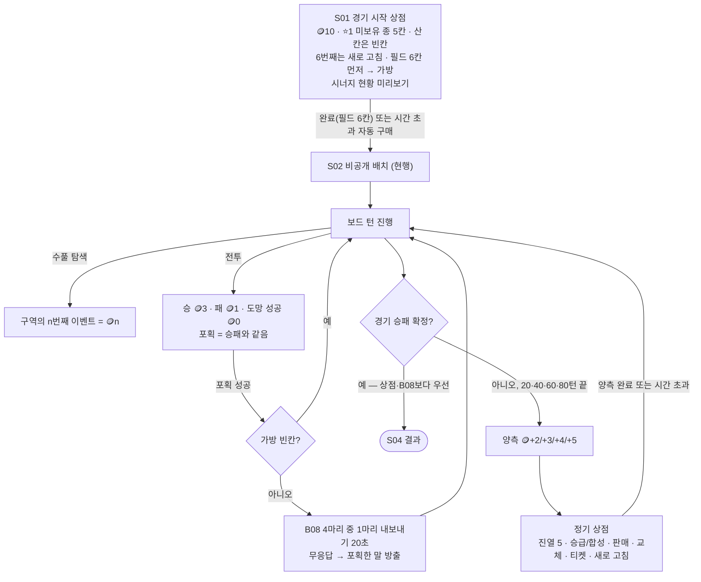

# #236 Venus 보고 — 경제 구현 계약과 수용 기준

- 작성: 2026-09-24 · Venus (Claude, PLAN/docs) · preflight `required_role=Venus, mode=PLAN, area=PLAN, mutation=docs, instance_index=null`
- 개정: 2026-09-24 2차 — AC04 산식 정정(Mars 지적 수용), E9 [추론] 표기, 7장 D1~D6 상태를 Mars 보고 기준으로 갱신, 7.1 Mars 해석 I1~I7 검토 추가, 8장 Issue 문구 정정 확인
- 개정: 2026-09-24 3차 — GDD-24 02절 M06 행 Notion 정정(I4 해소), 7.2 Jupiter J9(수풀 금액 역산) 판정 추가. D1은 여전히 CJ 대기
- 개정: 2026-09-24 4차 — **CJ 결정으로 D1 해소**: 핫시트 상점(S01·정기) 1인 90초·자기 상점이 보이는 순간부터(가림 뒤 차례는 가림 확인 후), 합계 최대 180초. E3·AC39·7장·10장·11장 갱신, GDD-23·GDD-24·GDD-13 Notion 반영
- 개정: 2026-09-24 5차 — **CJ 플레이 QA REVISE**: ① S01 구매 칸도 빈칸으로 남긴다(무료 즉시 보충 폐지) ② 시작·정기 상점에 소유자 시너지 현황 표시(E16). 여섯 번째 구매용 새로 고침 🪙1·예비 재화·시간 초과 자동 새로 고침은 **[PD 작업 가정]**(CJ 답변 대기, D9). E2·AC02·AC04·AC08 갱신, AC44~AC48 추가, GDD-23·GDD-24·GDD-13 Notion 반영
- 개정: 2026-09-24 6차 — **CJ 결정으로 D9 해소**: 5칸을 다 산 뒤 여섯 번째 하수인은 기존 유료 새로 고침 🪙1로 산다 · 예비 재화가 필수 하수인 6명 구매와 꼭 필요한 새로 고침 비용을 보호 · 시간 초과는 자동 새로 고침(5차 [PD 작업 가정] ⓐ 그대로 확정). 용어 · 4장 예시 · E2 · 7장 D9 · AC04 · AC08 · 10장 · 11장의 D9 표기를 [확정]으로 치환, GDD-23·GDD-24·GDD-13 Notion 반영
- 대상: [Issue #236](https://github.com/ChangjoSung/Digit-Duel/issues/236) · [GDD-23](https://app.notion.com/p/3dc1e7f1708580329da6fe4986654f7b) 2.1~2.4 · 7.1~7.9 · 8.1 · [GDD-24](https://app.notion.com/p/3dc1e7f1708581a48421fcec63d3cdf8) 00.10 · 01~03
- 기준 코드: worktree `ChangjoSung/issue-236-economy-v0411` base `6d1b788` (`demo/js/*.js`, `server/authoritative/*.js`)
- 분류: [피드백] 착수 전 기획 감사 — 새 규칙을 만들지 않고, 이미 정한 규칙을 구현 계약으로 옮긴다
- 표기: **[확정]** = GDD-23/24에 CJ 결정으로 적힌 것 · **[현행]** = 지금 코드에서 확인한 사실 · **[추론]** = 확정 문장에서 Venus가 끌어낸 해석(이의 없으면 기본값) · **[제안]** = Venus 권장, 결정 아님 · **[PD 작업 가정]** = CJ 답변 전 PD가 정한 임시 방향, CJ 답이 오면 대체 · **[기획 필요]** = 규칙 없음, 결정 요청

---

## 1. 한 줄 요약

#236은 "말을 공짜로 고르는 게임"을 **"코인으로 사고, 키우고, 팔고, 포획하는 게임"**으로 바꾼다. 경기는 🪙10과 시작 상점에서 출발하고, 20·40·60·80턴 뒤 정기 상점에서 성장하며, 모든 거래는 **원장**(그 말에 실제로 낸 코인의 누적 기록)으로 정산돼 사고팔기로 이득을 볼 수 없다.

## 2. 무엇이 바뀌나 — 현행 코드 → v0.4.11

| 영역 | 현행 (headless로 확인, `6d1b788`) | v0.4.11 [확정] |
|---|---|---|
| 시작 자원 | 회복약·쿨링수·해독제 각 1, 볼 2 (`BAL.itemStart`·`ballStart`) · 코인 개념 없음 | 🪙10, 아이템·버프·볼 0 (2.2) |
| 말 고르기 | 준비 화면에서 20종 중 6종 무료 선택 (`S.roster`, `applyRoster`) | 경기 시작 상점 S01에서 서로 다른 ⭐1 6명 **구매 필수** (8.1 ⑪) |
| 왕·동료 속성 | 필드 최다 속성 자동 배정만 (`assignLeaderElements`, 선택 UI 없음) | S01에서 3명 각각 무료 선택, 안 고르면 자동 배정 (2.2) |
| 수풀 | 구역당 3개(아이템 패키지·버프 패키지·기술/포획), 총 6개 | 구역당 4개, **코인 전용** 🪙1→2→3→4, 총 8개 (7.2, 8.1 ⑬) |
| 포획 | 수풀 중립 포획 → 왕·동료 `cap` 슬롯 / 전투 포획 → 공용 예비 `reserve` 1칸, 공용 규격 HP 70/100 | 수풀 포획 폐지, 전투 포획만 → **가방** 칸, 등급·스킬 승계, 최대 HP 70% (7.7, 8.1 ⑫) |
| 성장 | 없음 (⭐1 고정, ⭐2~4는 검사 경로만) | 상점에서만 승급·합성, 승급 시 풀 회복 (7.1) |
| 가방·판매·원장 | 없음 | 가방 3칸, 1:1 교체, 원장 100% 환급 판매 (7.5~7.6) |
| 버프·교체 티켓 | 수풀 패키지로 획득 | 정기 상점 전용 구매 (7.3, 7.8) |

## 3. 경제의 흐름

**용어** — *진열*: 상점에 뜬 상품 5칸. *차액 승급*: 가진 종의 더 높은 등급을 (진열 등급가 − 내 등급가)만 내고 사는 것. *동급 합성*: 같은 등급을 정가에 사서 한 등급 올리는 것. *원장(ledger)*: 그 개체에 실제로 낸 코인 합계, 판매가와 같다. *예비 재화 규칙*: 시작 상점에서 칸을 채우지 않는 지출 뒤에도 '남은 필수 비용'(빈 필드 칸 k + 꼭 필요한 새로 고침 비용) 이상 🪙가 남아야 하는 규칙 — 6명 구매를 보장하는 안전장치(새로 고침 비용 포함은 [확정: 2026-09-24 CJ, D9]). *시너지 현황*: 상점 화면에 보이는 내 왕국·아키타입 칸 수와 달성 단계. *가림*: 핫시트에서 다음 사람에게 기기를 넘길 때 앞 사람 화면을 덮는 창. *공정 관측*: AI가 사람이 볼 수 있는 정보만 쓰는 원칙.

## 4. 해 보기 — 한 개체의 코인 일생

1. S01: 🪙10. 필드가 비어 k=6이고 여섯 번째를 사려면 새로 고침 1회가 필요하므로, 볼 같은 하수인 외 지출은 최대 🪙3 [확정: D9]. 물 여우 ⭐1을 🪙1에 산다 → 원장 1, 필드 1칸.
2. 20턴 끝: 턴 보너스 🪙2. 진열에 물 여우 ⭐3가 뜨면 "🪙~~3~~ → 2"로 보인다. 사면 제자리에서 ⭐3이 되고 새 최대 HP까지 회복, 원장 1+2=3.
3. 40턴 상점: 가방과 교체해 가방으로 옮긴 뒤 판매 → 🪙3 환급(원장 그대로). 판매 당시 HP 50%면 "물 여우 50%"가 기록되고 이번 오픈 동안 물 여우는 진열·구매 잠금.
4. 60턴 상점: 물 여우 ⭐3을 🪙3에 다시 사면 새 최대 HP × 50%로 들어온다. 사고팔기만으로는 코인도 HP도 늘지 않는다.

---

## 5. 구현 계약 (#236이 만들 것)

모두 **[확정]**이며 괄호는 GDD-23 절이다. [추론]·[제안]은 따로 표시했다.

### E1. 상점이 열리는 때 (2.1 · 7.2)
- 턴 = 한 플레이어의 차례 1회. 현행 `S.turnCount`(endTurn마다 +1)와 같은 단위다 [현행].
- 정기 상점은 `turnCount`가 20·40·60·80이 되는 턴의 이동·탐색·전투·연출이 **모두 끝난 뒤**, 다음 턴 시작 전에 연다 [추론: 코드 단위 매핑]. 이 4회 뒤에는 열지 않는다. 턴 상한은 새로 만들지 않는다.
- 열기 직전 양측에 🪙+2/+3/+4/+5.
- 그 턴에 승패가 나면 상점·보너스 없이 경기를 끝낸다. 상점 동안 이동·탐색·전투가 잠기고 `turnCount`는 늘지 않으므로 버닝 타임(65턴~) 계산에 영향이 없다.

### E2. 경기 시작 상점 S01 (2.2 · 7.3 · 8.1 ⑪⑯)
- 🪙10, 소모품·버프·볼 지급 0. 현행 `itemStart`·`ballStart` 지급과 로스터 무료 선택을 대체한다.
- 진열 5칸: 모두 ⭐1 · 미보유 종 · 서로 다른 종. **산 칸은 빈칸으로 남고 저절로 채워지지 않는다** — 정기 상점(E4)과 같다 **[확정: 2026-09-24 CJ 플레이 QA REVISE]**. 종전 "S01 전용 무료 즉시 보충"은 폐지.
- 여섯 번째 하수인: 5칸을 다 사면 살 칸이 0이므로 새로 고침으로 새 5칸(⭐1 · 미보유 · 서로 다름)을 받아 산다. 새로 고침 가격 🪙1 유지 **[확정: 2026-09-24 CJ, D9]**.
- 판매 품목: 하수인 + 소모품 4종(회복약·쿨링수·해독제·몬스터 볼) 각 🪙1. **교체 티켓·전투 버프 3종은 팔지 않는다.** 숨길지 Dim할지는 [기획 필요] D2.
- 산 하수인은 필드 6칸 먼저, 그다음 가방. 합성·승급은 일어나지 않는다.
- 예비 재화 규칙 **[확정: 2026-09-24 CJ, D9]**: 칸을 채우지 않는 지출(소모품 4종 · 새로 고침)은 **지출 뒤 상태**에서 🪙 ≥ 필수(k, v)일 때만 허용.
  - 필수(k, v) = k + ⌈max(0, k − v) ÷ 5⌉ × 🪙1. k = 빈 필드 칸 수, v = 지금 살 수 있는 진열 칸 수(빈칸 · '판매함' 제외).
  - 소모품: v 그대로 → 🪙 − 1 ≥ 필수(k, v). 새로 고침: 지출 뒤 v = 새 진열의 살 수 있는 칸 수(보통 5) → 🪙 − 1 ≥ 필수(k, 5).
  - 하수인 구매는 🪙 · k · v를 함께 1 줄여 필수와의 여유가 그대로라 이 규칙에 막히지 않는다(코인 부족만 거부).
  - 결과: 시작 🪙10 · k=6 · v=5 → 필수 7 → 하수인 외 지출 최대 🪙3(종전 🪙4). k=6에서 새로 고침은 🪙 ≥ 8일 때만(새 5칸으로도 1칸 모자라 한 번 더 필요).
- '완료'는 필드 6칸일 때만 활성, 누르면 되돌릴 수 없다.
- 왕·동료 3명 속성을 각각 무료 선택. 안 고르면 필드 하수인 최다 속성(동률 🔥→💧→⚡→🗻→🌿) — 현행 `assignLeaderElements` 재사용.
- 시간 초과: 빈 필드 칸이 있으면 살 수 있는 진열 칸을 순번 ①부터 자동 구매한다. 산 칸은 빈칸. 살 칸이 없는데 필드가 비어 있으면 **새로 고침 🪙1을 자동 실행한 뒤 다시 ①부터** 산다 **[확정: 2026-09-24 CJ, D9]**. 예비 재화 규칙이 비용을 보장하므로 6칸을 못 채우고 멈추지 않는다. 확정 거래 보존 · 미확정 확인 창 취소(E3). 속성 미선택은 자동 배정.
- [추론] S01도 상점이므로 가방이 생긴 뒤의 교체·판매는 정기 상점과 같은 규칙을 쓴다(금지 문장이 없음). 막아야 한다면 D6에서 정한다.

### E3. 제한 시간과 여는 방식 (2.3 · 2.4)
- PVE: 사람 90초, AI는 즉시 처리. 온라인 동시 90초는 #237.
- 핫시트: 1인 **90초** 순차(상점 시간 합계 최대 180초) **[확정: 2026-09-24 CJ "가림 확인 후 상점이 보이는 순간부터 90초 시작"]**. 90초는 자기 상점이 처음 보이는 순간부터 흐른다 — S01의 P1은 상점 표시 순간, 가림 뒤 차례는 가림 확인 후 상점이 보이는 순간. 가림이 떠 있는 시간은 누구의 90초에도 들어가지 않는다. S01·정기 상점 공통. 첫 오픈 P1 → 가림 → P2, 이후 오픈마다 먼저 하는 사람을 바꾼다. 자기 차례가 아닐 때 상대 상점·가방은 가린다.
- 완료한 쪽은 다시 열 수 없고, 상대 완료 또는 시간 끝까지 대기.
- 시간 초과: 확정된 거래(구매·판매·승급·교체·티켓)는 보존, 확인 모달에서 아직 승인 안 한 입력만 취소. 로컬·PVE 확정 시점 = 승인 순간.
- 확인 버튼은 누르는 순간 잠근다(연타 이중 처리 금지).

### E4. 정기 상점 진열 (7.4)
- 회차 등급: 20턴 ⭐1~2 · 40턴 ⭐2~3 · 60턴 ⭐3~4 · 80턴 ⭐4~⭐5(⭐5 = 전설 3종 중 하나). 칸마다 낮은 등급 60% / 높은 등급 40%, 속성 무작위.
- 플레이어별 진열, 공유 풀·수량 제한 없음, 한 진열에 같은 종 1번.
- 제외: 내 등급보다 낮은 같은 종 · 최대 등급(일반 ⭐4, 전설) · 이번 오픈에 판매한 종.
- 후보 고갈: 그 칸 등급 후보가 없으면 같은 회차 다른 등급으로, 둘 다 없으면 빈칸(구매 불가). 새로 고침도 같다.
- 새로 고침 🪙1·무제한. 산 칸은 새로 고침 전까지 비어 있고, 상점이 닫히면 진열은 사라진다.

### E5. 구매·승급·합성 (7.1 · 7.4 · 7.5)
- 가격 ⭐N = 🪙N, 전설 🪙10. 코인 부족이면 거부, 상태 불변.
- 같은 종은 필드(살아 있음)+가방 합쳐 1마리. **사망 칸의 종은 다시 살 수 있다.**
- 미보유 종 신규 구매 → 가방(빈칸 필요, 가득 차면 거부). 확인 모달 없이 확정, 들어간 슬롯에 신규 표시(레드닷, 위치·해제는 #238).
- 보유 종이 진열되면 자동 승급(새 칸 불필요, 가방 가득이어도 가능), 확인 모달 1회:
  - 높은 등급 → 차액 = 진열 등급가 − 현재 등급가, 원장 += 차액.
  - 같은 등급 → 정가로 한 등급 상승, 원장 += 정가.
  - 그 자리 그대로(필드/가방) 오르고, 새 최대 HP까지 풀 회복, 스킬 슬롯 1칸 개방.
- 한 거래의 변경(코인 차감·원장 가산·등급·HP·슬롯·진열 칸 비우기)은 전부 적용되거나 전부 거부된다.

### E6. 가방·교체 (7.5 · 8.1 ⑤⑥)
- 가방 3칸, 구매한 말·포획한 말·전설 공용.
- 교체: 상점이 열린 동안만, 무제한. 살아 있는 필드 하수인 ↔ 가방 말 1:1, 들어온 말은 나간 말의 보드 칸에 놓인다. 왕·동료·사망 칸은 대상이 아니다(GDD-24 M04).
- 가방에 있는 동안 HP 동결, 교체로 회복되지 않는다. 쿨타임은 전투마다 0으로 시작(현행 #233).
- 사망 칸은 구매·교체로 채우거나 되살릴 수 없다. 전멸 판정은 필드에서 죽은 말만 센다 — 가방의 생존 말은 패배를 막지 못한다.
- 공개된 말은 가방을 거쳐도 공개 유지. 공개된 칸에 비공개 말이 들어오면 "상점에서 교체됨" 표식 + 비공개 유지.

### E7. 판매·원장 (7.6)
- 가방 말만 판매, 확인 모달 1회. 판매가 = 원장 100%: 구매·승급 개체는 누적 지출, 포획한 말은 🪙0에서 시작해 이후 승급에 낸 코인만, 전설 🪙10. 새로 고침 비용은 환급 없음.
- 판매한 종: 그 오픈이 끝날 때까지 진열·새로 고침·구매 잠금, 이미 진열된 칸은 즉시 '판매함' 잠금.
- 판매 당시 HP 비율을 종별로 기록. 다시 살 때 새 개체 HP = 새 최대 HP × 비율(반올림). 그 뒤 정상 승급하면 풀 회복.
- [추론] 기록은 그 종의 마지막 판매값으로 덮어쓴다. 기록은 구매에만 적용하고 포획(HP 70% 고정)에는 쓰지 않는다.

### E8. 수풀 (7.2 · 7.7 · 8.1 ③⑬)
- 구역(4·5행 / 9·10행)마다 이벤트 4개, 총 8개. 위치는 현행처럼 무작위.
- 보상은 코인만: 그 구역에서 찾힌 순서대로 🪙1→2→3→4(누가 찾든 구역 공통 카운트, 구역당 🪙10).
- 아이템 패키지·버프 패키지·기술 교체·중립 포획은 생성하지 않는다. 기술 교체 코드는 분기로 보존(D1, `recruitSkillSwap:false`) [현행].
- [추론] 획득량은 보유 재화이므로 상대 화면엔 금액 없는 중립 문구만(7.9). 발견 순서로 금액을 역산하는 것은 누설이 아니다 — 이 보고서 7.2절(J9) 참조.

### E9. 전투 보상 (7.2)
- 승 🪙3 · 패 🪙1 · 도망 성공 양측 🪙0 · 포획으로 끝난 전투는 포획한 쪽 🪙3, 당한 쪽 🪙1.
- 그 전투로 경기가 끝나면 보상은 결과에 영향이 없다(경기 종료 우선) [추론: 7.2에는 문장이 없고 7.7 "포획 처리는 결과에 영향을 주지 않습니다"·2.1 종료 우선을 확장]. 지급을 생략하는 구현(Mars I6)과 지급하는 구현은 경기 결과·8.4 지표(상점 회차별 재화)가 같으므로 어느 쪽이든 규칙 위반이 아니다.
- 폭탄·함정 접촉의 보상은 [기획 필요] D5.

### E10. 전투 포획 (7.7 · 8.1 ⑫)
- 조건(현행 유지): 볼 보유 · 라운드당 1회 · 상대 **일반 하수인** HP 30% 미만 · 성공률 70% · 성공·실패 모두 볼 소모 · 성공 시 전투 즉시 종료.
- 대상 제외: 왕·동료 본체, 전설, 내가 보유한 종(필드 생존+가방). 불가 사유는 내 화면에만.
- 포획한 말: 상대의 등급·스킬 승계, HP = 최대 HP 70%, 상태·⌛ 초기화, 원장 🪙0. **가방 칸**에 들어간다. 현행 왕·동료 `cap`·공용 `reserve` 슬롯은 폐지.
- 포획당한 칸: 사망 칸처럼 동결, 전멸 판정에 센다.
- [추론] 포획한 말은 비공개로 가방에 들어간다(7.1 I1).
- 가방 가득: B08 — 소유자만 보는 "가방 3 + 포획 1" 중 1마리 선택 20초, 고른 말은 자동 판매(원장 환급, 포획한 말 🪙0). 무응답이면 포획한 말만 내보낸다(기존 가방 말 임의 매각 금지). 핫시트에서 포획한 쪽이 지금 화면 주인이 아니면 가림 먼저.
- 포획으로 경기가 끝나면 B08을 띄우지 않는다.
- [추론] B08 자동 판매도 '판매'이므로 E7의 HP 비율 기록을 남긴다. 판매 잠금은 열린 상점이 없으므로 적용 대상이 없다.

### E11. 왕·동료 대리 출전 (7.5)
- 후보 = 본체 또는 가방 말 1마리(일반·전설·포획). 선택은 현행 순차 블라인드(접촉을 건 쪽 → 상대), 즉시 확정·취소 없음. 가방이 비면 본체 자동 출전.
- 대리 승리 → 받은 피해를 안고 가방 복귀. 대리 패배 → 대리 제거, 왕 대리면 경기 패배, 동료 대리면 그 동료도 제거(현행).
- 시너지 수혜·집계는 #235 구현을 그대로 쓴다(가방 전설 아키타입 집계 포함).

### E12. 시너지 교체 티켓 (7.8)
- 🪙1, 정기 상점에서만 사고 쓴다. 살아 있는 왕·동료의 속성을 현재와 다른 속성으로 바꾸고, 그 말의 스킬도 새 속성으로 바뀐다. HP 유지. 확인 모달 1회.
- 바뀐 속성은 **다음 전투 스냅샷부터** 시너지에 반영(#235 스냅샷 경계). 죽은 왕·동료는 변경 불가.

### E13. 전투 버프·소모품 (7.3)
- 힘·시간·도망의 수호자 각 🪙1, 정기 상점 전용. 아이템은 라운드당 1회, 전투 버프는 한 전투 1개(현행 사용 규칙 유지). 보유 상한은 새로 만들지 않는다(현행 없음).

### E14. 비공개·공정 관측 (7.9 · 8.1 ⑦)
- 소유자에게만: 가방 내용·개수, 재화, 등급, 쓰지 않은 스킬, 시너지 정확 집계·단계, 원장, 판매 기록, 포획 선택 창.
- 상대에게는 "상대가 상점을 이용했습니다" 같은 중립 문구와 "상점에서 교체됨" 표식만.
- PVE AI는 같은 규칙으로 사고팔며, 상대 진열·재화·가방·등급을 읽지 않는다. AI의 구매 전략(무엇을 살지)은 규칙이 아니라 구현 선택이며, 밸런스는 8.4 시뮬레이션 뒤 CJ·Venus가 조정한다 [제안].

### E15. 우선순위와 무결성 (2.1 · 2.4 · 7.7 · Issue #236)
- 경기 종료 > 상점 열기 > B08. 경기가 끝나면 상점·보너스·B08 없음.
- 같은 요청이 두 번 오거나 실패한 요청은 코인·HP·원장·가방을 바꾸지 않는다.

### E16. 상점 시너지 현황 (5차 · GDD-23 2.2 · 8.2 · 5장) — [확정: 2026-09-24 CJ 플레이 QA REVISE]
왜 필요한가: 왕·동료 속성 무료 선택(S01)과 티켓 구매(정기 상점)는 "지금 무엇이 몇 칸인가"를 알아야 고를 수 있는데, 현재 상점 화면에는 그 숫자가 없다.

- **현행 사실 [현행]**: #235 `synView(owner)`는 전투 밖에서 `synCount`를 부르고, `synCount`는 `placed===true`인 칸만 센다. S01은 배치(S02) 전이라 모든 칸이 `placed:false` → 모든 집계가 0이다. 그래서 S01에는 `synView`를 그대로 쓸 수 없다.
- **S01 = 현재 구성 미리보기**
  - 셈에 넣는 것: 이 상점에서 사서 **필드 칸에 배정된 하수인**(속성 · 아키타입) + **속성을 직접 고른 왕 · 동료**(`leaderElChosen`, 왕국 속성만 — 왕 · 동료는 아키타입 집계에 없다, 5.1).
  - 셈에 넣지 않는 것: 속성을 고르지 않은 왕 · 동료(따로 "미선택 — 상점 완료 때 필드 최다 속성으로 자동 배정" 표시), 가방 말(S01에는 전설이 없으므로 가방 전설 +1도 생기지 않는다).
  - 배치 위치는 집계에 영향이 없으므로 배치 전 값이 배치 후 값과 같다 — 단 미선택 왕 · 동료의 자동 배정분만 완료 순간에 더해진다. 그래서 S01 값은 **미리보기**라고 표시한다.
- **정기 상점 = 실제 집계**: 왕국 · 아키타입은 소유자의 `synView`(전투 밖 → 현재 보드) 그대로 — 필드 9칸(사망 · 포획 칸 동결 포함), 가방 전설 아키타입 +1. 왕 · 동료 시너지(5.3)는 **죽은 동료 수**(0~2)로 센다 — `synView.dead`는 죽은 하수인까지 더한 값(사신 패시브용)이라 그대로 쓰면 안 된다 [현행: `synCount`의 `dead`는 왕 외 사망 칸 전부]. 이 값이 다음 전투 시작 스냅샷에 들어갈 값이다. 티켓으로 바꾼 속성도 바로 보인다(적용은 다음 전투 스냅샷부터, E12 — 상점 동안 전투가 없으므로 모순 없음).
- **보여 줄 값**(두 상점 공통): 왕국 5속성별 칸 수와 달성 단계((2)·(4)·(6)·(9) 또는 미달) + 다음 단계까지 남은 칸 수 · 아키타입 6종별 칸 수와 달성 단계(표준·공격·지속 최고 (6), 방어·속공·보호 최고 (5)). 정기 상점은 왕 · 동료 시너지 단계(사망 동료 0~2)도 함께. 단계 · 수치는 #235 상수(`V2_KINGDOM_STEPS` · `V2_ARCH_STEPS` · 5장 표) 재사용, **새 효과 · 새 수치 없음**. 효과 문구를 붙인다면 5장 표 값 그대로.
- **갱신 시점**: 구매 · 승급 · 교체 · 판매 · 속성 선택 · 티켓이 확정될 때마다 다시 센다. 미확정 확인 창 단계에서는 바꾸지 않는다.
- **비공개**: 소유자 화면에만. 상대 화면 · 로그 · 토스트 · 핫시트 가림 뒤 · 상대 좌석 AI 입력에 싣지 않는다(7.9 · E14). 온라인은 경제가 없어(D3) 해당 없음 — #237.

---

## 6. 소유 경계

| 항목 | #236 (로컬·PVE·핫시트·AI vs AI) | #237 (온라인 권위) | #238 (최종 HUD) |
|---|---|---|---|
| 경제 규칙 E1~E15 | **Core에 구현**. 거래마다 Core 액션 1개, 전부 적용/전부 거부 | 같은 Core 액션을 서버가 검증·보관 | 표시만, 규칙 재계산 금지 |
| 요청 ID·진열 번호·stale/마감 거부 | 진열에 회차·새로 고침 번호를 붙여 두는 정도만 [제안] | **소유** | — |
| 시간 | 로컬 타이머, 만료를 Core 액션(`shopTimeout` 류)으로 전달 [제안] — 헤드리스 검사 가능 | 서버 시각 마감·단절 중 정지·유예 60초 | 카운트다운 시각 |
| 단절·재연결·몰수·경기 전 취소 | 없음 | **소유** | X01 표시 |
| 비공개 정보 | 로컬 화면·로그·AI에서 비노출 | 응답·snapshot·재접속 경로 비노출 | 연출도 비노출 |
| UI | **플레이 QA가 가능한 기능형 최소 UI**: S01·M01 목록·버튼, 확인 모달, 가방 3칸, B08 선택, 티켓, 속성 선택, 남은 턴 숫자, 신규 표시, 가림 [제안] | 클라이언트 연결 adapter | 세로 5칸 카드·레드닷 위치/해제·Dim·배지·연출·reduced-motion·포커스 |
| 온라인 모드 동작 | 아래 D3 | 새 경제로 전환 | — |

**중요 사실 [현행]**: 서버 엔진(`server/authoritative/engine.js`·`runtime.js`)은 `demo/js`의 data·state·core를 그대로 실행한다. 그래서 #236이 Core 경제를 바꾸면 **온라인도 즉시 영향**을 받는다(시작 지급 0, 수풀 코인, 로스터 6종 검증 `room.js` 526–528). 이 경계는 D3에서 정해야 한다.

## 7. 결정 요청

"PD 수용"은 [Mars 보고](../Mars/report.md) 4장에 적힌 상태를 옮긴 것이며, Venus가 PD 결정을 따로 확인하지 않았다. **CJ 결정으로 바뀐 항목은 D1 · D9 둘이다(2026-09-24).**

| # | 질문 | 상태 · 권장 | 누가 | #236 차단? |
|---|---|---|---|---|
| D1 | 핫시트 상점(S01·정기) 시간은 언제부터 흐르나 | **[확정] 2026-09-24 CJ 결정 — 해소.** CJ 원문 "가림 확인 후 상점이 보이는 순간부터 90초 시작"(앞선 지시 "가림 해제 후 상점 표시부터 90초로 시작"). 1인 **90초**(종전 60초·최대 120초 대체), 합계 최대 180초. P1 첫 상점은 표시 순간부터, 가림 뒤 차례는 가림 확인 후 상점이 보이는 순간부터. 종전 Venus 제안(가림을 걷은 순간부터)과 같은 방향이고 시간만 90초로 바뀌었다. GDD-23 2.2·2.3·2.4·9장, GDD-24 00.10-5, GDD-13 9장 반영 | CJ(완료) | 해소 — Mars가 핫시트 S01·정기 상점의 1인 90초 타이머를 구현했고 Saturn 독립 QA가 확인했다 |
| D1-B | B08 20초는 언제부터 흐르나 | [추론] **창이 소유자에게 보이는 순간부터**(핫시트는 가림 뒤). 근거: 7.7이 20초를 "선택 창"의 제한 시간으로 적고, 핫시트에서는 그 창을 가림 "뒤에 띄운다"고 적는다. 상점과 같은 "보이는 순간부터" 원칙이며, D1 CJ 결정(2026-09-24)과도 일관된다. Mars 구현·PD 수용과 같다 | PD 확인 (이의 시 CJ) | 아니오 |
| D2 | S01에서 정기 상점 전용 상품(티켓·수호자 3종)을 숨기나 Dim하나 | 구매 불가는 [확정]. 표시 방식은 **[기획 필요] CJ 미결정**(00.10-2). #236은 PD 수용대로 숨김(요청은 거부) — 임시값이며 Dim 전환은 #238 표시만 | CJ | 아니오 |
| D3 | #236 동안 온라인 모드는 어떻게 두나 | PD 수용: 새 경제는 온라인이 아닌 경기(PVE·핫시트·AI vs AI)에만, 온라인은 #237 전환까지 종전 경제. 분기 1개(Mars 1장) · 마일스톤 출시는 #237 뒤 | PD | 해소 |
| D4 | 핫시트 S01 순서 | PD 수용: S01 = 첫 오픈(P1 → 가림 → P2), 20턴 상점 P2 먼저, 이후 교대 [추론: 2.3·GDD-24 01] | PD | 해소 |
| D5 | 폭탄·함정 접촉(전투 화면 없이 끝나는 접촉)에 전투 보상 🪙3/1을 주나 | 7.2에 문장 없음 → **[기획 필요] CJ 미결정**. #236은 PD 수용대로 지급 안 함 — 임시값, 결정 시 값만 교체 | CJ | 아니오 |
| D6 | S01에서 교체·판매를 허용하나 | PD 수용: 허용 [추론: 금지 문장 없음, 상점 공통 규칙] | PD | 해소 |
| D7 | 8.4 검증 지표를 #236에 넣나 | [제안] 8.4가 경제 지표로 이름 붙인 것만: 상점 회차별 양측 재화 · 판매→재구매 횟수. 평균 경기 길이·역전율은 기존 지표로 계산 | PD | 아니오 |
| D8 | 상점·B08 도중 기권을 허용하나 (Mars I5) | **[기획 필요]** — GDD-23에 기권 문장이 없고, GDD-24 00.4는 기권을 S03 보드에서만 적는다(M01·B08 행에 없음). Venus 제안: #236은 Mars 구현(상점·B08 동안 기권 불가)을 임시값으로 둔다 — 두 창 모두 시간 제한(상점 90초·B08 20초)이 있어 닫힌 뒤 곧바로 기권할 수 있고, 기권과 거래의 처리 순서를 새로 정할 필요가 없다. 00.10-4(X01 중 기권)와 같은 묶음으로 CJ가 정하면 좋다 | CJ | 아니오 |
| D9 | S01 구매 칸이 빈칸으로 남은 뒤 여섯 번째 하수인을 어떻게 사나 (5차) | **[확정] 2026-09-24 CJ 결정 — 해소(6차).** PD가 CJ에게 ⓐ 유료 새로 고침 · 비용 보존(권장) ⓑ 5칸 소진 시 무료 새로 고침 ⓒ 별도 규칙을 질문했고(5차 동안 ⓐ를 [PD 작업 가정]으로 진행), CJ가 **ⓐ를 명시 승인**했다(PD 전달, Venus는 CJ 원문 미확인). 확정 규칙: 구매한 5칸이 빈칸으로 남으면 여섯 번째는 기존 유료 새로 고침 🪙1로 산다 · 예비 재화가 필수 하수인 6명 구매와 꼭 필요한 새로 고침 비용을 보호(E2 필수(k, v)) · 시간 초과는 자동 새로 고침. 결과: 하수인 외 지출 한도 🪙4 → 🪙3(시작 🪙10 유지 시). ⓑ · ⓒ는 채택하지 않음. 빈칸 규칙(AC44)과 시너지 현황(E16)은 별개의 CJ 플레이 QA 확정 사항이다. GDD-23 2.2 · 7.4 · 9장, GDD-24 01 S01 · Y01, GDD-13 9장 반영 | CJ(완료) | 해소 — Mars가 ⓐ대로 구현(Mars 5-6) |

### 7.1 Mars 구현 해석 검토 (I1~I7)

| # | Mars 해석 | Venus 판정 | 근거 |
|---|---|---|---|
| I1 | 포획한 말은 비공개(`revealed:false`)로 가방에 든다 | **[추론] 수용.** 7.5의 공개 유지 문장은 "가방을 거쳐 다시 **돌아와도**"로, 내 필드에 있던 말이 대상이다. 포획한 말은 내 필드에 선 적이 없으니 새 가방 말처럼 비공개로 들어가고, 공개된 칸에 교체로 들어가면 "상점에서 교체됨" 표식만 붙는다. 그러면 상대는 자기 말이 **포획됐다는 사실**(전투에서 공개된 결과)은 알지만, 그 말이 **내 필드 어느 칸에 들어갔는지**는 모른다(7.9 가방 비공개와 일치). 공정 관측상 AI가 "상대가 X를 포획했다"를 기억해 쓰는 것은 허용된다. 규칙 문장이 직접 있는 것은 아니므로 CJ 플레이 QA에서 확인 | GDD-23 7.5·7.7(전투 중 정체 공개)·7.9 |
| I2 | 신규 표시(🔴)는 그 상점이 닫힐 때 해제 | **임시값 수용.** 위치·읽음 해제는 GDD-23 7.5 [설계 보완], GDD-24 00.5 "레드닷 읽음 여부 — [CJ 결정 필요], #238". #236의 해제 방식은 확정이 아니며 #238에서 교체될 수 있다. 조건: 레드닷은 소유자 화면에만(핫시트 상대 차례·가림 중 비노출) — 신규 구매 사실 자체가 7.9 비공개 정보다 | GDD-23 7.5·7.9 · GDD-24 00.5 |
| I3 | 티켓은 정기 상점에서 사서 보유하고 정기 상점에서 쓴다 | **수용** — E12와 같다 | GDD-23 7.3·7.8 |
| I4 | 새로 고침은 확인 모달 없음 | **수용 (GDD-23 우선).** GDD-23 7.5·8.2는 확인 팝업 대상을 승급·판매·티켓으로 열거하고, 새로 고침을 넣지 않는다. GDD-24 02의 M06 행 제목 "새로 고침 / 티켓 확인 (모달)"은 둘을 한 모달로 묶어 읽힐 수 있어 상위 문서(GDD-23)와 어긋난다. GDD-24는 "최신 규칙은 GDD-23 기준"이라고 스스로 적으므로 GDD-23을 따른다. **해소(3차)** — GDD-24 02절 M06 행을 Notion에서 정정했다(10장). | GDD-23 7.5·8.2 · GDD-24 02 M06 |
| I5 | 상점·B08 동안 기권 불가 | 위 D8 | — |
| I6 | 경기 종료 전투의 보상은 지급하지 않음 | **수용** — 결과 동일(E9 [추론]) | GDD-23 2.1·7.7 |
| I7 | AI 상점·대리 전략 | 구현 선택, 규칙 아님. 밸런스는 8.4 뒤 CJ·Venus | E14 |

### 7.2 Jupiter J9 — 수풀 금액 역산 판정 (3차)

**판정: 누설 아님 · #236 수정 불필요 · CJ 결정 불필요** [추론 — 근거는 모두 확정 문장과 현행 코드].

| 구분 | 내용 |
|---|---|
| 규칙이 만든 추론 | GDD-23 7.2 [확정]: "순서는 구역 단위로 양측이 함께 세며, 누가 찾든 그 구역의 n번째 이벤트가 🪙n". 금액이 공개된 순서의 함수이므로, 상대가 그 구역의 소모 수를 알면 금액을 계산할 수 있다. 이것은 규칙 설계의 결과이지 숨긴 값이 흘러나간 것이 아니다. 7.9도 "상대가 공개된 필드 말을 보고 직접 세는 것은 막지 않습니다"라고 적어, **공개 사실로부터의 계산은 허용**하고 **표시**만 막는다 |
| 실제 누설(금지) | 비소유자의 화면·로그·토스트·연출·AI 입력·(#237) 좌석 뷰에 **금액·보유 재화·구역 카운트 값을 직접 싣는 것**. 현행 코드 확인 [현행]: 비소유자 배너는 `🌿 숲 이벤트` / `상대가 숲에서 무언가를 마쳤습니다.`(금액 없음), 금액·보유 🪙 토스트는 소유자만, 🔍 흔적은 자기가 발견한 미소모 이벤트만 보인다 |
| 추론의 한계 | 상대가 역산하려면 그 탐색이 **어느 구역**에서 일어났는지와 그 구역의 이전 소모 수를 알아야 한다. 탐색한 말이 시야 밖이면 구역도 모른다. 내가 받은 n(소유자 문구 "n번째 발견")으로 상대의 그 구역 발견 횟수를 알 수 있는 것도 같은 공개 카운트 규칙의 결과다 |
| 보유 재화 전체 | 턴 보너스·전투 승패(🪙3/1)·수풀 순서는 모두 공개 사건이라 **수입**은 대략 추정 가능하다. 7.9가 막는 것은 재화 **표시**이며, 상점 지출·판매 환급은 비공개라 잔액은 여전히 확정할 수 없다 |
| #236 계약 | E8·E14·AC38 그대로: 상대 화면·로그에 금액을 쓰지 않는다. 공정 관측 AI가 공개 사건으로 상대 수입을 추정하는 것은 허용(치팅 아님), 상대 `eco.coins`를 직접 읽는 것은 금지 |
| #237 입력 | 좌석 뷰에 상대 좌석 `eco.coins`·구역 카운트 원값을 싣지 않는다(Jupiter J6와 같은 화이트리스트 원칙). 구역별 소모 여부는 각 좌석이 이미 볼 수 있는 흔적 범위만 |
| CJ 선택지(차단 아님) | 금액을 **추론조차 못 하게** 하려면 확정 규칙 7.2(구역 공통 카운트)를 바꿔야 한다(예: 플레이어별 카운트). 이는 새 규칙이라 CJ 결정 사항이지만 #236에 필요하지 않다. Venus 권장: 현행 유지 — 수풀 경쟁(먼저 찾을수록 적게, 늦게 찾을수록 많이)의 핵심 재미가 공통 카운트에 있다 [제안] |

직전 #253 미결 중 #236과 무관한 것(S01 자발적 나가기·X01 중 기권·로딩·결과 창·모션 수치·S01을 SETUP 뒤로)은 #237·#238 소관이라 여기서 다시 묻지 않는다.

## 8. Issue 본문 대조

- ~~Issue #236의 "개인 20/40/60/80턴"~~ → **정정 확인(2차)**: 현재 Issue 본문은 "양측 합산 20/40/60/80번째 턴 종료 뒤"로 GDD-23 2.1과 일치한다. Venus는 GitHub에 쓰지 않았다.
- 그 밖의 Issue 항목(시작 10, 소모품 0, ⭐1 6명, 5칸, 90초(온라인·PVE), 등급 확률, 후보 고갈, 가방 3칸, 원장, HP 비율, 수풀 4회·총 8회, 포획 조건, 4택1/20초, 티켓 다음 전투)은 GDD-23과 일치한다. **5차 상태 확인**: Mercury가 Issue 본문을 CJ 결정(핫시트 1인 90초·최대 180초)으로 갱신했고, 2026-09-24 Saturn이 현재 본문을 재조회해 일치함을 확인했다. Venus는 GitHub에 쓰지 않았다.

## 9. 수용 기준 매트릭스

검증 방법: **C** = Core 헤드리스 contract 테스트(`smoke_issue236` 권장) · **A** = AI vs AI 완주/공정 관측 · **H** = 핫시트·UI 헤드리스 · **Q** = CJ 플레이 QA. 모든 거부 사례는 "코인·원장·HP·가방·진열 불변"을 함께 단언한다.

| AC | 조건 → 기대 | 근거 | 방법 |
|---|---|---|---|
| AC01 | 새 경기(로컬 모드) → 양측 🪙10, 인벤·볼·버프 0, `cap`·`reserve` 경로 미사용 | E2 | C |
| AC02 | S01 진열 5칸 = 서로 다른 미보유 ⭐1. **(5차)** 구매한 칸은 빈칸으로 남고 새로 고침 전까지 채워지지 않음(AC44). 새로 고침 진열도 서로 다른 미보유 ⭐1 | E2 | C |
| AC03 | S01 구매 순서: 1~6번째 필드, 7번째부터 가방. 가방 3칸 초과 신규 구매 거부 | E2·E6 | C |
| AC04 | **(5차 · 6차 [확정] D9)** 필수(k, v) = k + ⌈max(0, k − v) ÷ 5⌉. 시작 🪙10·k=6·v=5 → 필수 7, 여유 3. 볼 3개 → 🪙7, 4번째 볼은 지출 뒤 🪙6 < 7이라 거부. 이 상태에서 k=6 새로 고침도 거부(지출 뒤 🪙6 < 필수(6, 5)=7), 볼 0개일 때 k=6 새로 고침은 허용(🪙9 ≥ 7). 하수인 구매는 🪙·k·v를 함께 1 줄여 여유 불변 — 볼 3개 뒤 5칸을 다 사면 🪙2·k=1·v=0 → 볼 거부(🪙1 < 필수(1, 0)=2), 새로 고침 허용(🪙1 ≥ 필수(1, 5)=1) → 6번째 구매 → 🪙0·필드 6칸. 순서와 무관하게 칸을 채우지 않는 지출 합계(필수 새로 고침 1회 제외)는 최대 🪙3 | E2·D9 | C |
| AC05 | 필드 5칸이면 '완료' 거부, 6칸이면 허용. 완료 뒤 모든 S01 거래 거부 | E2·E3 | C |
| AC06 | S01에서 티켓·수호자 구매 요청 거부 | E2 | C |
| AC07 | 속성 미선택 → 최다 속성·동률 순서로 자동 배정. 선택하면 그 값 유지 | E2 | C |
| AC08 | S01 시간 초과(필드 2칸 · 살 칸 3) → 살 수 있는 칸을 ①부터 3개 자동 구매 → 살 칸 0·필드 5칸 → 자동 새로 고침 🪙1 → ①을 사서 6칸. 필드 0칸에서 만료해도 5개 구매 → 자동 새로 고침 → 1개로 6칸. 산 칸은 빈칸, 확정 거래 보존, 미확정 모달 취소, 미선택 속성 자동 배정. 자동 새로 고침 · 가격은 **[확정: 2026-09-24 CJ] D9** | E2·E3·D9 | C |
| AC09 | 20턴 끝 → 보너스 🪙2 후 상점. 19·21턴에는 안 열림. 80턴 뒤 추가 상점 없음 | E1 | C |
| AC10 | 20번째 턴의 전투로 왕 제거 → 상점·보너스 없이 종료 | E1·E15 | C |
| AC11 | 상점 동안 이동·탐색·전투 거부, `turnCount` 불변, 버닝 진입 턴 불변 | E1 | C |
| AC12 | 진열 등급 분포: 회차별 낮은 60%/높은 40%(시드 고정 표본), 80턴 높은 등급 = 전설 | E4 | C |
| AC13 | 제외 규칙: 내 ⭐3 종의 ⭐2 미진열, ⭐4·보유 전설 미진열, 한 진열 중복 없음 | E4 | C |
| AC14 | 후보 고갈: 전설 3종 모두 보유 → ⭐4로 재추첨, 둘 다 없으면 빈칸·구매 거부. 새로 고침도 동일 | E4 | C |
| AC15 | 새로 고침 🪙1·무제한, 잔액 0이면 거부, 환급 없음 | E4·E7 | C |
| AC16 | ⭐1 보유 + ⭐3 진열 구매 → 🪙2 차감, 원장 3, 제자리 ⭐3, 새 최대 HP 풀, 슬롯 +2 | E5 | C |
| AC17 | ⭐2 보유 + ⭐2 진열 → 🪙2, ⭐3, 원장 4 | E5 | C |
| AC18 | 가방 가득 + 보유 종 승급 → 허용. 가방 가득 + 신규 종 → 거부 | E5·E6 | C |
| AC19 | 같은 종 2마리 보유 상태가 어떤 경로로도 생기지 않음(구매·포획·교체) | E5·E10 | C |
| AC20 | 사망한 종 → 다시 구매 가능, HP 풀(판매 기록 없음) | E5·E6 | C |
| AC21 | 교체: 생존 필드 하수인 ↔ 가방 말, 같은 칸, HP 동결. 사망 칸·왕·동료 대상 거부. 상점 밖 거부 | E6 | C |
| AC22 | 가방에 생존 말이 있어도 필드 하수인 6·동료 2 전멸 → 패배 | E6 | C |
| AC23 | 공개된 말 → 가방 → 복귀 시 공개 유지. 공개 칸에 비공개 말 → 교체 표식 + 상대 뷰 비공개 | E6·E14 | C·H |
| AC24 | 판매: 원장 100% 환급. 포획 말 🪙0, 전설 🪙10. 필드 말 판매 거부 | E7 | C |
| AC25 | 판매 종 → 이번 오픈 진열·새로 고침·구매 잠금, 이미 진열된 칸 '판매함' | E7 | C |
| AC26 | HP 50%에 판매 → 다음 오픈 재구매 HP = round(새 최대 HP × 0.5). 이후 승급 시 풀 회복 | E7 | C |
| AC27 | 사고팔기 반복·교체 반복으로 코인·HP가 늘지 않음(불변식) | E7 | C |
| AC28 | 수풀 구역당 4개·총 8개, 구역 n번째 발견 = 🪙n, 양측 공통 카운트. 패키지·중립 포획·기술 교체 미생성 | E8 | C |
| AC29 | 전투 보상: 승 3 · 패 1 · 도망 0 · 포획 3/1 | E9 | C |
| AC30 | 포획 조건: HP<30%·일반 하수인·볼 보유·라운드 1회·70%, 실패도 볼 소모. 왕·동료·전설·보유 종 대상 거부 | E10 | C |
| AC31 | 포획 성공 → 가방, 등급·스킬 승계, HP 70%, ⌛0, 원장 0. 포획당한 칸 동결·전멸 판정 포함 | E10 | C |
| AC32 | 가방 가득 포획 → B08. 기존 말 선택 → 원장 환급 매각. 20초 무응답 → 포획한 말만 방출, 기존 가방 불변 | E10 | C·H |
| AC33 | 포획으로 상대 전멸 → B08 없이 경기 종료 | E10·E15 | C |
| AC34 | 대리 출전 후보 = 가방 말(일반·전설·포획), 가방 비면 본체 자동. 대리 승리 → 피해 안고 가방 복귀. 왕 대리 패배 → 경기 패배 | E11 | C |
| AC35 | 티켓: 정기 상점에서만, 생존 왕·동료만, 같은 속성·사망 대상 거부. 속성·스킬 변경, HP 유지, 다음 전투 스냅샷부터 반영 | E12 | C |
| AC36 | 확인 버튼 연타·같은 거래 두 번 → 1회만 처리. 실패 거래는 상태 불변 | E3·E15 | C·H |
| AC37 | PVE AI: 합법 거래만 하고 상대 진열·재화·가방·등급을 읽지 않음. AI vs AI 완주 | E14 | A |
| AC38 | 상대(사람·핫시트 상대) 화면·로그에 재화·가방·원장·등급·수풀 금액 비노출, 중립 문구만 | E14 | H |
| AC39 | 핫시트(S01·정기 공통): P1 90초 → 가림 → P2 90초(합계 최대 180초), 다음 오픈 순서 교대, 차례 아닌 사람 상점 가림. **각자의 90초는 자기 상점이 처음 보이는 순간부터**: S01 P1은 표시 순간, 가림 뒤 차례는 가림 확인 후 상점이 보이는 순간. 가림이 떠 있는 동안 두 사람의 남은 시간은 줄지 않는다(D1 확정 2026-09-24) | E3·D1·D4 | H·Q |
| AC40 | PVE 사람 90초 만료 처리, AI 즉시 완료 | E3 | C·H |
| AC41 | 온라인 모드가 D3 결정대로 동작하고 기존 서버 검사(E)·2-client 회귀 통과 | D3 | CI |
| AC42 | #233·#234·#235·#241·#245 기존 smoke·typecheck 회귀 통과, 필수 CI 6개 | Issue | CI |
| AC43 | 전체 흐름(S01→배치→20·40턴 상점→포획·B08→결과) 로컬·PVE·핫시트 플레이 | Issue | Q |
| AC44 | **(5차)** S01 하수인 구매 → 그 진열 칸 = 빈칸(구매 불가 요청은 거부 · 상태 불변), 나머지 칸 불변. 5칸을 다 사면 살 칸 0. 새로 고침 → 5칸 모두 ⭐1 · 필드+가방 미보유 · 서로 다른 종. 정기 상점 빈칸 동작(7.4)은 종전 그대로 | E2 | C |
| AC45 | **(5차)** 불변식: 시드 고정 무작위 합법 요청 열(구매 · 소모품 · 새로 고침 · 속성 선택, S01 교체 · 판매 포함) N회 어느 것에서도 "필드 빈칸 > 0인데 살 칸 0이고 새로 고침도 거부"인 막힘 상태가 생기지 않는다. 시간 초과 처리 뒤 항상 필드 6칸 · 🪙 ≥ 0. PVE AI · AI vs AI의 S01도 새로 고침을 써서 6칸 완료(AC37 공정 관측 유지) | E2·D9 | C·A |
| AC46 | **(5차)** S01 시너지 미리보기: 필드에 배정된 구매 하수인 + 속성을 고른 왕 · 동료만 센다. 예) 불 하수인 2 + 왕 🔥 선택 → 불 3칸 · (2) 달성 · (4)까지 1칸. 가방의 하수인은 세지 않음. 미선택 왕 · 동료는 0으로 세고 "미선택 — 완료 때 자동 배정" 표시. 배치(S02) 전 `placed:false` 상태에서도 0이 아님. 완료 · 배치 뒤 `synView`의 왕국 · 아키타입 = 미리보기 + 자동 배정분 | E16 | C·H |
| AC47 | **(5차)** 정기 상점 시너지 현황 = 소유자 `synView` 왕국 · 아키타입(사망 · 포획 칸 동결 포함, 가방 전설 아키타입 +1) + 죽은 동료 수(0~2). 구매 · 승급 · 교체 · 판매 · 티켓 확정마다 갱신(교체로 속성이 바뀌면 즉시 반영, 티켓 속성도 즉시 표시), 확인 창 취소 · 거부 요청에는 불변. 단계 경계는 #235 상수 그대로(새 효과 · 수치 없음) | E16 | C·H |
| AC48 | **(5차)** 시너지 현황은 소유자에게만: 핫시트 상대 차례 · 가림 화면 · 상대 로그 · 토스트에 칸 수 · 단계가 없고, AI 판단 입력에 상대 집계가 추가되지 않는다 | E16·E14 | H |

## 10. 문서 반영 위치

| 문서 | 변경 | 이유 |
|---|---|---|
| [GDD-23](https://app.notion.com/p/3dc1e7f1708580329da6fe4986654f7b) | **4차 갱신(2026-09-24T05:11Z)** — 2.2 시간 초과 처리 `핫시트 1인 60초` → `핫시트 1인 90초 · 시작 시점은 2.3` · 2.3 핫시트 행 `각 60초 · 최대 120초` → `각 90초 · 합계 최대 180초` + 시작 시점 문장(자기 상점이 처음 보이는 순간 · S01 P1 표시 순간 · 가림 뒤 차례는 가림 확인 후 · 가림 시간 불산입 · S01·정기 공통) · 2.4 타임아웃 첫 문장에 시작 시점 참조 추가 · 9장 Decision Log `2026-09-24 #236` 행 추가(확정 · 반영 2.2·2.3·2.4) · 속성 Edit Date 2026-09-24 · Summary 치환(Editor 사람 편집자 유지). 재연결 대기 60초(2.4)는 별개 규칙이라 그대로 | D1 CJ 결정 |
| [GDD-24](https://app.notion.com/p/3dc1e7f1708581a48421fcec63d3cdf8) | **정정 완료(3차, 2026-09-24T03:18Z)** — 02절 M06 행 ① 화면·판정 칸 `새로 고침 / 티켓 확인 (모달)` → `새로 고침 (즉시) / 티켓 확인 (모달)` ② 조건 칸 첫 구절 `새로 고침 1코인·무제한,` → `새로 고침은 확인 모달 없이 즉시 1코인·무제한,` ③ 00절 운영 이력 callout 끝에 한 줄 추가(`2026-09-24 Venus(Claude) — #236: 02절 M06 행에서 새로 고침을 확인 모달과 분리 …`). 그 밖의 본문·링크·그림·속성은 그대로(Edit Date 2026-09-24·Editor 사람 편집자 기존값 유지). **남은 차이**: 02-shop-flow PNG/SVG 그림 속 M06 라벨은 수정하지 않았다 — 페이지 상단이 이미 "최신 규칙은 흐름표 기준"이라 적는다 | I4 — GDD-23 7.5·8.2가 확인 팝업을 승급·판매·티켓으로만 열거. #236 범위로 dispatch가 승인 |
| [GDD-24](https://app.notion.com/p/3dc1e7f1708581a48421fcec63d3cdf8) | **4차 갱신(2026-09-24T05:12Z)** — 00.2 타이머 행 `핫시트 60초` → `핫시트 1인 90초 순차` · 00.7 핫시트 X02 문단의 `60초 … [CJ 결정 필요] — Venus 제안` → `90초 … [확정: 2026-09-24 CJ]` · 00.9 미결 목록에서 `핫시트 60초 시작 시점` 삭제 · 00.10 머리말에 5번만 CJ 확정 문장 추가 · 00.10-5 행 `[CJ 확정]` + CJ 원문 · 01절 시간 줄 `핫시트 1인 60초` → `1인 90초·최대 180초(…)` · 00절 운영 이력 한 줄 추가. CJ 원본 스케치 2장·그림·02·03절·다른 00.10 항목은 그대로 | D1 CJ 결정 |
| [GDD-13](https://app.notion.com/p/3cd1e7f17085817f8c35fa8548116f38) 9장 Decision Log | **4차 갱신(2026-09-24T05:13Z)** — 맨 위에 2026-09-24 행 추가: CJ 원문 두 개(정확 인용) · 결정 내용 · **우선순위**(GDD-23 2.3 종전 60초·최대 120초와 아래 행의 미결 "핫시트 상점 60초 시작 시점"을 대체) · 반영 위치. 기존 "권장 방향" 행은 당시 기록이라 그대로 두고, 1~8장(현행 v0.4.10 규칙)은 변경 없음 · 운영 이력 한 줄 추가 | D1 CJ 결정 |
| 이 보고서 | 4차 개정 | 개정 이력 · E3 · 7장 D1·D1-B·D8 · 8장 Issue 주의 · AC39 · 10장 · 11장 |
| [GDD-23](https://app.notion.com/p/3dc1e7f1708580329da6fe4986654f7b) | **5차 갱신(2026-09-24)** — 2.2 표 `무료 보충` 행 → `구매한 칸`(빈칸 유지 · 여섯 번째는 새로 고침 · 가격 🪙1은 [PD 작업 가정]) · 예비 재화 규칙 문단 치환(남은 필수 비용 = k + 꼭 필요한 새로 고침, 예시 최대 🪙4 → 🪙3, [PD 작업 가정]) · 시간 초과 문단의 `무료 보충` → 빈칸 + 자동 새로 고침([PD 작업 가정]) · 2.2에 `📊 시너지 현황` 문단 신설(S01 미리보기 규칙) · 7.4 새로 고침 줄에 `경기 시작 상점도 같습니다` · 8.2에 `상점 시너지 현황` 줄 신설(정기 상점 실제 집계 · 비공개) · 9장 `2026-09-24 #236 REVISE` 행(① ② 확정 · ③ PD 작업 가정) · Summary 치환 | CJ 플레이 QA REVISE ① ② · PD 작업 가정 ③ |
| [GDD-24](https://app.notion.com/p/3dc1e7f1708581a48421fcec63d3cdf8) | **5차 갱신(2026-09-24)** — 상단 그림 미반영 목록에 S01·Y01 빈칸과 S01·M01 시너지 현황 추가 · 01절 S01 행(`산 행은 무료 보충*` → 빈칸 · 새로 고침 · 시너지 미리보기) · Y01 행(자동 구매 + 자동 새로 고침, 남은 필수 비용) · 02절 M01 행(내 시너지 현황) · M06 행(시작 상점 예비 조건 `≥ 빈 필드 수` → `≥ 남은 필수 비용`) · 00절 운영 이력 한 줄. 그림 · 00.10 표는 그대로 | 같은 이유 |
| [GDD-13](https://app.notion.com/p/3cd1e7f17085817f8c35fa8548116f38) 9장 Decision Log | **5차 갱신(2026-09-24)** — 맨 위 행 추가: PD 전달 요지(CJ 원문 미확보라고 명시) · 결정 ① ② · 정하지 않은 것 = 여섯 번째 구매 방식(CJ 질문 중, PD 작업 가정) · 운영 이력 한 줄. 1~8장 변경 없음 | 같은 이유 |
| 이 보고서 | 5차 개정 | 개정 이력 · 표기 · 3장 흐름도 · 용어 · 4장 예시 · E2 · E16 신설 · 7장 D9 · AC02 · AC04 · AC08 · AC44~AC48 · 10장 · 11장 |
| [GDD-23](https://app.notion.com/p/3dc1e7f1708580329da6fe4986654f7b) | **6차 갱신(2026-09-24)** — 2.2 표 `구매한 칸` 행 · 예비 재화 규칙 머리 · 시간 초과 문단의 `[PD 작업 가정 — CJ 답변 대기]` → `2026-09-24 CJ 확정` · 7.4 새로 고침 줄 `PD 작업 가정` → `2026-09-24 CJ 확정` · 9장 `#236 REVISE` 행 ③ 문장·구분(`③ PD 작업 가정` → `③ 확정`, 가정 기간은 이력으로 보존) · Summary 치환 | D9 CJ 결정 |
| [GDD-24](https://app.notion.com/p/3dc1e7f1708581a48421fcec63d3cdf8) | **6차 갱신(2026-09-24)** — 01절 S01 행 `🪙1 — PD 작업 가정` · Y01 행 `PD 작업 가정` → `2026-09-24 CJ 확정` · 00절 운영 이력 한 줄 추가(5차 이력 문장은 보존). 그림 · 00.10 표 · M06 행은 그대로 | 같은 이유 |
| [GDD-13](https://app.notion.com/p/3cd1e7f17085817f8c35fa8548116f38) 9장 Decision Log | **6차 갱신(2026-09-24)** — 맨 위에 D9 행 추가(PD 전달 요지 · 확정 규칙 · 채택하지 않은 선택지 · 반영 위치) · 5차 `#236 REVISE` 행의 `정하지 않은 것` 칸을 "당시 질문 중 → 위 행에서 확정"으로 치환 · 운영 이력 한 줄. 1~8장 변경 없음 | 같은 이유 |
| 이 보고서 | 6차 개정 | 개정 이력 · 용어 · 4장 예시 · E2 · 7장 머리말 · D9 · AC04 · AC08 · 10장 · 11장 |

**D9는 2026-09-24 CJ가 ⓐ로 확정했다(6차)** — 5차의 [PD 작업 가정] 표기만 [확정]으로 바꿨고 규칙 · 수치는 그대로다. 시너지 현황(E16)과 빈칸 규칙(AC44)은 D9와 별개의 CJ 확정 사항이다.

D1(핫시트 상점 시간·시작 시점)은 **2026-09-24 CJ 결정으로 해소**됐다(1인 90초·자기 상점이 보이는 순간부터). CJ가 D2·D5·D8을 정하면 Venus가 GDD-23 해당 절(2.2·7.2·2.1 또는 8.2)과 GDD-13 9장 Decision Log를 동시에 갱신한다.

## 11. 검증과 근거

- 읽은 것: CLAUDE.md · Issue #236·#237·#238(gh 읽기) · GDD-23 전문(Notion fetch, 최종 편집 2026-09-17) 중 1장 숫자·2.1~2.4·7.1~7.9·8.1~8.4·9장 · GDD-24 00~03절 · GDD-13 9장 · `docs/milestone/v0.4.11/issues/235/Mercury/report.md`, `253/Venus/report.md`.
- 코드 대조: `demo/js/data.js` 12–33(BAL 시작 지급·포획 규격) · `state.js` 60–110(상태 칸), 150–223(`newGame`·`applyRoster`·`genEvents`) · `core.js` 1243(턴 시작), 1549–1640(`capReceivers`·`tryCapture`), 2571–2652(`finishBattle`·`finishByCapture`) · `ui.js` 918–952(준비 화면 로스터) · `ui-overlays.js` 89(가림 `handoff`) · `server/authoritative/engine.js` 머리말(데모 Core 직접 실행), `room.js` 516–541(로스터 6종 검증).
- 헤드리스 실측(스크래치 스크립트, 저장소 미기록): `freshPlay("pve")` → `inv` 3종×2, `balls [2,2]`, `reserve [null,null]`, 이벤트 6개(itemGift·battleBuff·recruit 각 2), 로스터 6/6, 하수인 ⭐1, 왕·동료 속성 자동 배정, `coins`·`bag` 상태 없음, `BAL.maxTurns 60`(AI 공세 압력 계수일 뿐 경기 상한 아님), `burnStart 65`.
- 2차 검토(2026-09-24): Mars 보고 4장, Issue #236 현재 본문(gh 읽기), GDD-23 2.3·7.2·7.5·7.7·7.9·8.2, GDD-24 00.4·00.5·00.10·02·03 재조회(Notion fetch, GDD-24 최종 편집 2026-09-24T01:04Z). `core.js` 1345 포획 개체 `revealed:false` 확인. GDD-23에 "기권" 문장 0건.
- AC04 산식: 여유 = 🪙 − k. 소모품·새로 고침 1회 = 여유 −1, 하수인 구매 = 🪙 −1·k −1 → 여유 불변. 시작 여유 10 − 6 = 4.
- 하지 않은 것(2차까지): 제품·런타임·빌드·도구·테스트·아트 수정, Git·GitHub 쓰기, Notion 수정, 다른 Worker·하위 에이전트 기동.
- 3차(2026-09-24): Jupiter 보고 J9, GDD-23 7.2·7.5·7.9·8.2 재조회(Notion fetch), GDD-24 fetch → M06 행 치환 → 재fetch로 반영 확인(최종 편집 2026-09-24T03:18Z). 코드 대조: `core.js` 465–469(코인 수풀 금액 = 구역 소모 수, 소유자 문구 `이 수풀 n번째 발견 · 보유 🪙`), 1145–1151(`searchDone` 비소유자 = `🌿 숲 이벤트`·`상대가 숲에서 무언가를 마쳤습니다.`, 토스트는 소유자만), `ui.js` 725–726(🔍 흔적은 자기 `traces`에 있는 미소모 이벤트만). Notion 이외 쓰기 없음. 제품·런타임·테스트·도구·아트·Git·GitHub 무수정, #237 미착수.
- 4차(2026-09-24): 입력 = dispatch에 전달된 CJ 결정 원문 "가림 확인 후 상점이 보이는 순간부터 90초 시작"(앞선 지시 "가림 해제 후 상점 표시부터 90초로 시작") — Venus는 CJ Comment 원본을 직접 보지 않았고 PD 전달문을 인용했다. GDD-23·GDD-24·GDD-13 fetch → `update_content`(문자열 치환) → 재fetch로 반영 확인. 재fetch 기준 잔여 검색: GDD-23의 `60초`는 2.4 재연결 대기 3곳과 8장 표 1곳(모두 재연결 대기, 상점 시간 아님), `120초`는 9장 새 행의 "종전 … 최대 120초" 1곳뿐. GDD-24의 `60초`는 00.3·00.4·00.5·M07의 재연결 대기·X03, 00.10-5 행과 운영 이력의 "종전 60초" 인용뿐. GDD-13의 `60초`는 9장 두 행(새 행의 대체 대상 인용, 기존 행의 당시 기록)뿐. 이 보고서의 `60초`는 재연결 유예(5장 표)와 D1·AC39·개정 이력의 "종전" 인용뿐. **[추론]** 정기 상점에서 먼저 하는 사람 앞에 가림 화면이 오는지는 문서에 없다 — 결정 문장이 "보이는 순간부터"라서 어느 쪽이든 같은 규칙으로 처리되므로 새로 정하지 않았다. 코드·Git·GitHub·다른 Worker 무수정.
- 5차(2026-09-24): 입력 = dispatch의 CJ 플레이 QA REVISE 요지(① S01 구매 칸 빈칸 ② 시작·정기 상점 시너지 현황)와 PD 메시지 "S01 여섯 번째 구매 임시 방향"(새로 고침 🪙1 유지 · 예비 재화에 필수 새로 고침 포함 · 시간 초과 자동 새로 고침 · GDD에는 PD 작업 가정으로 표기). Venus는 CJ Comment 원본을 직접 보지 않았다. 코드 대조 [현행]: `core.js` `ecoReduce` shopBuy의 S01 무료 보충 1줄(`if(start){ … ecoDraw … } // S01 무료 보충`), `ecoReserveOk`(🪙 − 비용 ≥ 빈 필드 칸 수 — 새로 고침 비용 미포함), shopTimeout 자동 구매 루프(보충에 의존, 살 칸 0이면 `break` 후 "필드 6칸" 거부), `synCount`(`placed===true`만 셈, `dead` = 왕 외 사망 칸 전부), `synView`(UI 사용처 없음), `ai.js` `aiShop` S01 루프(보충에 의존 — 5칸 뒤 멈춤), `ui.js` `shopHtml`(시너지 표시 없음, 예비 문구 "지출 뒤 🪙k 이상"), `data.js` `assignLeaderElements`(`leaderElChosen` 아닌 왕·동료만 완료 때 배정). GDD-23·GDD-24·GDD-13 fetch → `update_content` → GDD-23 재fetch로 2.2·7.4·8.2·9장 반영 확인. 제품·런타임·도구·테스트 코드, Git·GitHub 무수정. 다른 Worker 미기동.
- 6차(2026-09-24): 입력 = dispatch `task_5d890fc433c1`의 PD 전달 "CJ explicitly approved D9 paid refresh and cost reserve"(여섯 번째 하수인은 5칸이 빈칸으로 남은 뒤 기존 🪙1 유료 새로 고침 · 예비 재화가 필수 6명 구매와 꼭 필요한 새로 고침 보호 · 시간 초과 자동 새로 고침). Venus는 CJ Comment 원본을 직접 보지 않았다. Mars 5-6(`ecoReserveNeed`, 코드 주석 "D9 — 2026-09-24 CJ 확정")과 규칙이 같음을 대조. GDD-23 · GDD-24 · GDD-13 fetch → `update_content` 좁은 치환 → 세 페이지 재fetch로 D9 표기 확인. D2 · D5 · D8 미결, 5차 이력 문장은 보존. 제품 · 런타임 · 도구 · 테스트 코드, Git · GitHub 무수정. 다른 Worker 미기동.
