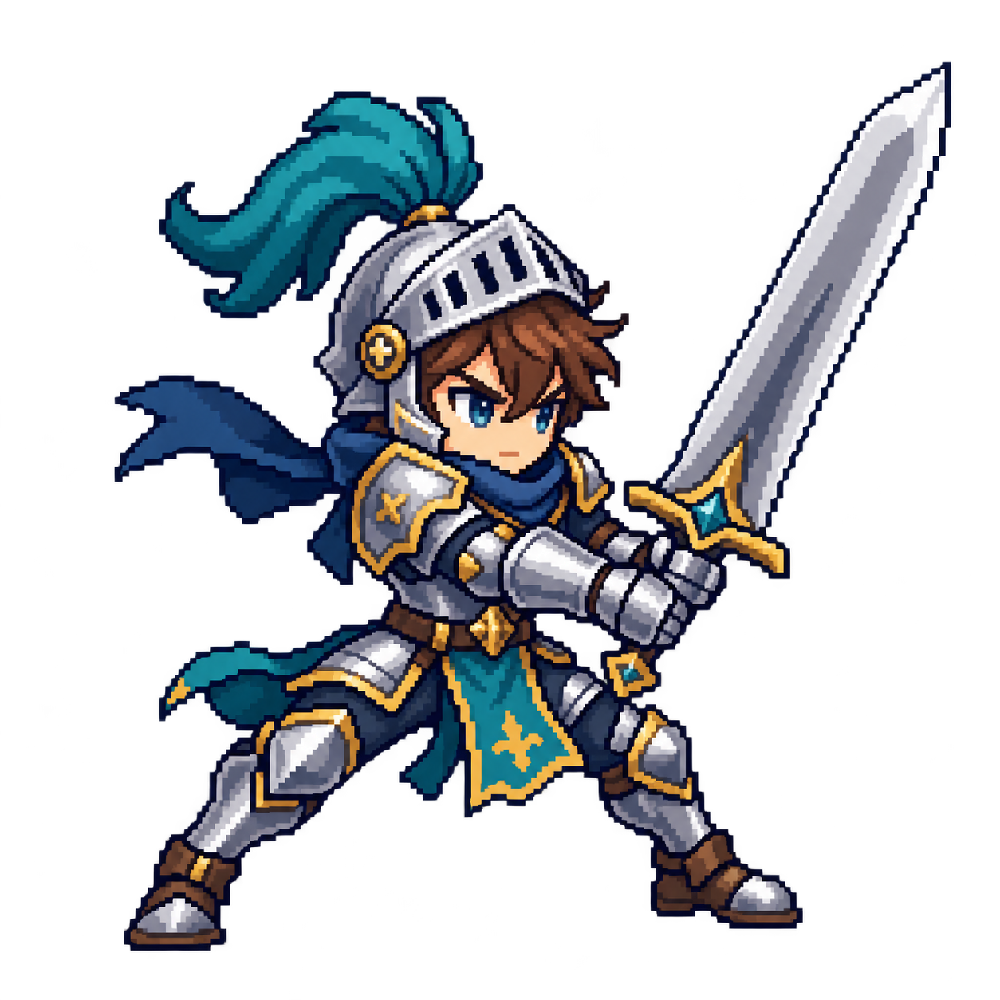
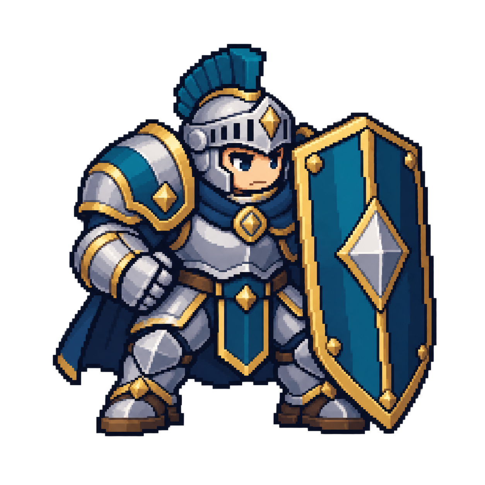

# Companion original contact evidence

Source comparison viewed: `demo/assets/leaders/companion/battle256.png`, `demo/assets/leaders/king/battle256.png`, and CJ Image 4 from the revision brief. The native tool outputs were visually inspected at master size. These embedded thumbnails are review aids, not exported game assets or a claim of completed runtime QA.

| Size | Attack: sword / wide stance | Defense: shield / compact mass |
|---|---|---|
| 128 |  |  |
| 64 |  |  |
| 32 |  |  |

Both full bodies and equipment are visible, with no scenery, lettering or UI. At alpha >15, transparent margins left/top/right/bottom are attack **143/77/60/61 px**, defense **136/113/124/125 px**. Alpha-1 edge noise means raw alpha bounds are unsuitable for tight crops. Actual derivative filtering and small-size readability acceptance remain with Mars/QA; preserve these master bytes.
