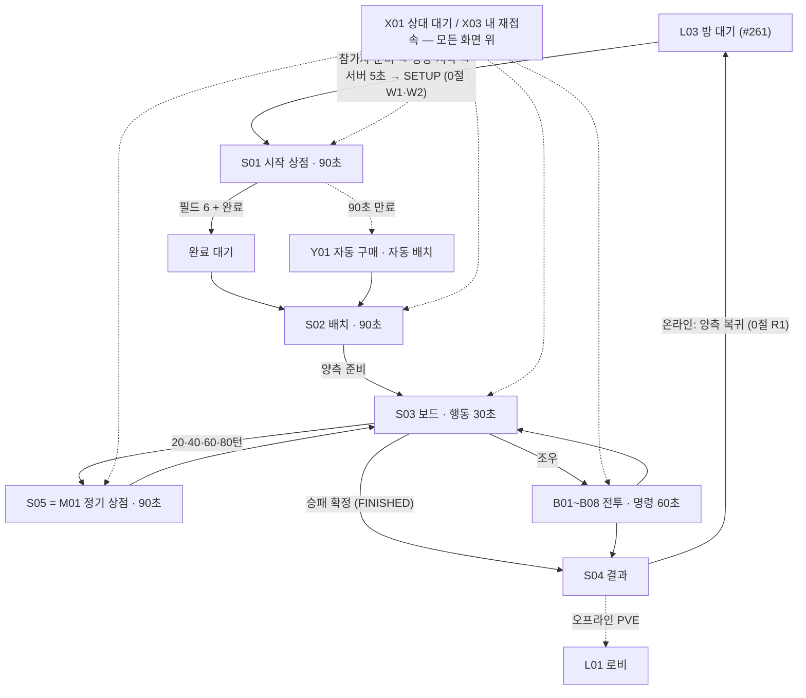

# #238 경기 UI 시스템 — 구현 계약 (S · M · B · X)

- 작성: 2026-09-28 Venus(Claude, PLAN) · 이슈 [#238](https://github.com/ChangjoSung/Digit-Duel/issues/238) · 마일스톤 v0.4.11
- 원본: [GDD-24](https://app.notion.com/p/3dc1e7f1708581a48421fcec63d3cdf8) 00.2~00.10·01~03절, [GDD-23](https://app.notion.com/p/3dc1e7f1708580329da6fe4986654f7b) 2.2·2.4·7.9·8.2, [#253 Earth 인계](../issues/253/Earth/report.md), [#238 착수 전 분석](../issues/238/Mercury/prestart-analysis.md)
- **2026-09-28 CJ 시각 REVISE**: 기능·방향 PASS, 화면 모습은 REVISE. 타이틀·로그인·가입·로비·방 검색·방 대기·보드·상점을 CJ 스케치대로 다시 만들고 전투 배치는 보존, 이력 토글 제거 — 화면별 기준은 [시각 정렬 계약](../issues/238/Venus/visual-alignment.md)이 원본이다. 그전 로컬 QA는 **기능 증거**이며 시각 PASS가 아니다.
- **2026-09-28 CJ QA 재수정 8항목(최신 · 이 문서의 옛 서술보다 우선)**: [PD 전달 원본](../issues/238/Mercury/cj-revise-8-items.md) · CJ 첨부 9장. 0절이 수용 기준 원본이며, 옛 "두 번째 참가 = 자동 시작 · 새 준비 버튼 없음", "결과 뒤 로비로", "결과에 말판 없음" 서술은 **[대체됨 · 2026-09-28]**으로 표시했다. 07:26 로컬 PASS는 당시 기준의 이력이며 8항목 완료 증거가 아니다.
- **2026-09-28 CJ 기록 아이콘 높이 명확화(가장 최신 · 최신 2의 위치만 대체)**: 왼쪽 이전 승인 기록(책) 아이콘은 **오른쪽 ★ 이벤트 아이콘과 같은 높이**. ~~받침대 아래 왼쪽~~ [대체됨 · 높이 명확화]. 아이콘 · 팝업(최근 20경기) · 접근성 · 8항목 나머지 규칙은 그대로. CJ PASS: 잠금 Toast · 참가자 나가기 · 5초 목록·인원 집계 갱신 · 로그인 계정 인원 갱신 — **이 위치 수정 뒤 추가 CJ 플레이 QA 면제**, 구현·QA·CI·통합 현황은 GitHub #238의 기존 완료 조건과 Mercury 원장에서 관리한다.
- **2026-09-28 CJ 최신 3항목(8항목 서술보다 우선)**: ① 잠금 안내 = 잠깐 떴다 사라지는 **상단 Toast** ② 로비 기록 = **이전 승인 기록 아이콘 복원**, 위치 = 위 높이 명확화(~~받침대 아래 왼쪽~~ [대체됨]) · 팝업 = 현행 최근 20경기 그대로 ③ 대기방 **방장 나가기 = 방 파괴 · 참가자 나가기 = 방 유지·재모집**. 나머지 항목은 모두 CJ PASS. 0절 표의 2·3행, 최신 1행, W1·R1·유지 줄이 이 기준으로 치환됐다. 참조: CJ Image #1(잠금 문구 → 상단 빨간 칸) · Image #2(기록 위치 화살표 — 위치는 높이 명확화로 [대체됨]).
- **2026-09-28 CJ 추가 요청(최신 4 · 보조 기능)**: L02 방 찾기 상단에 승인 아이콘 + **현재 멀티 접속 인원 숫자**. 0절 '최신 4' 행 · W5가 원본. 다른 화면 · 방/경기 기능은 그대로.
- 표기: **[확정]** = CJ 결정 또는 GDD 본문 · **[현행]** = 코드에 이미 있는 동작 · **[PD]** = PD 기술 기본값(CJ 수치 아님) · **[설계 보완]** = Venus 기본값(규칙이 아님, 바꿀 수 있음) · **[제안]** = CJ 시각 확인 전 값 · **[기획 필요]**

## 0. 2026-09-28 CJ 재수정 8항목 — 화면 · 서버 · 아트 수용 매트릭스

비유: 경기장(방)은 경기가 끝나도 **허물지 않는다**. 두 선수가 라커룸(대기방)으로 돌아와 도전자가 "준비"를 외치고, 방장이 휘슬을 불면 **5초 카운트다운** 뒤 다음 경기가 시작된다. 기록원은 경기마다 **한 줄씩만** 적는다.

| # | 화면 (Mars) | 서버(Jupiter) · 클라이언트 통신(Mars) | 아트 (Earth) | 수용 기준 |
|---|---|---|---|---|
| 1 L02 | ← 뒤로를 제목 줄 **좌상단**으로(이미지 1은 우상단). 방 만들기 모달 = 제목 **한 줄 가로**, ✕ 닫기 **44×44 정사각**(늘어나지 않음) 우상단, 모달 폭 = 화면 − 32px | 없음 | 기존 `icons.svg#back`·`#close` | 320·360·390·432px에서 제목 줄바꿈 0 · ✕ 폭=높이 · ← 좌상단 · ✕/Esc로 닫고 [생성] 버튼으로 포커스 복귀 · 방 이름 검증 문구 [현행] 유지 |
| 최신 4 L02 | 방 찾기 **상단 줄**(← 뒤로 · 제목 옆)에 승인된 사람 아이콘(`gi("team")` — 로비 하수인 탭 · 싱글 버튼과 같은 기존 아이콘) + **숫자** = 지금 멀티 서버에 접속한 인원. 값은 기존 방 목록 응답과 함께 5초 · 수동(↻) 갱신 때만 바뀐다. 못 받았거나 끊기면 숫자를 꾸미지 않고 **`—`** | 아래 **W5** | 없음 — 기존 승인 아이콘 재사용 | 숫자 = 서버 `onlineCount` 그대로(화면 계산 0) · 값 없음 · 0 미만 · 정수 아님 · 연결 끊김 = `—` · 접근성 이름 "멀티 접속 n명"(없으면 "접속 인원 확인 불가") · 44px 줄 안에서 ← · 제목 · ↻와 겹치지 않음 · 320px에서 줄바꿈 0 · 기존 방 목록 · 검색 · 핑 · 오류 문구 불변 |
| 최신 1 공통 | 잠긴 메뉴를 누르면 화면에 박힌 고정 문구(Image #1 하단 "🔒 싱글플레이 — … 추후 공개 예정입니다") 대신 **상단 Toast**(Image #1 빨간 칸 — 미션 줄 아래)가 잠깐 뜨고 사라진다. [현행] Toast 모양(`.toast` · `toastFade`)과 기본 표시 시간(2300ms) 재사용, 로비에서는 미션 줄 아래에 붙는 로비 전용 자리(`lobbyToastHost` · `LOBBY.toast`)에 띄움 — 새 시간값 없음 | 없음 | 없음 | 잠금 누름 → Toast 1개, 스스로 사라짐 · 화면에 남는 잠금 문구 0 · **실제 오류·입력 검증 안내(로그인·가입·방 이름 등)는 [현행] 자리·방식 유지**(Toast로 옮기지 않음) · 게임 행동 시계와 무관 · Toast가 버튼·타이머를 막지 않음(누름 통과) |
| 2 L01 (최신 2) | 기록 버튼 = **이전 승인 기록 아이콘**(Earth_1 "official records" 책 아이콘 `gi("record")`)으로 복원 — ~~`n승 n패` 배지~~ [대체됨 · 최신 2]. 위치 = **왼쪽, 오른쪽 ★ 이벤트 아이콘과 같은 높이**(CJ 높이 명확화 · ~~받침대 아래 왼쪽, Image #2 화살표~~ [대체됨]). 누르면 팝업 = [현행] 공식 **최근 20경기** 그대로(최신순, 페이지 넘김 없음 · 팝업에 전체 승·패 줄을 새로 넣지 않음). 전체 승·패는 [현행] 상단 프로필 줄 | 없음 — [현행] 공식 전적 API · 전체 보존 그대로 | 없음 — 기존 승인 아이콘 재사용 | 기록 아이콘과 이벤트 아이콘의 세로 위치(높이) 같음 · 아이콘은 받침대·대표 하수인 그림·이름표를 가리지 않음 · 44px · 접근성 이름에 "공식 전적 n승 n패 — 최근 20경기 보기" · 팝업 ≤20행 · 바뀌는 것은 아이콘(`gi("record")`)과 위치뿐 · 마우스·터치·Enter로 열고 Esc·✕로 닫음 |
| 3 L03 (최신 3 포함) | 두 번째 참가 뒤에도 **L03에 머문다**(`WAITING`). 참가자 = [준비]/[준비 취소], 방장 = [시작](참가자 준비 + 양측 연결일 때만 활성). 시작하면 서버 5초 카운트다운 표시. **이모티콘 6종 버튼을 채팅 🔒 패널 옆**에 둔다. 자유 채팅 없음. **[방 나가기]: 방장 = 방 파괴(둘 다 방 목록으로) · 참가자 = 참가자만 나가고 방장은 빈 대기방에 남아 새 참가자를 기다림**(최신 3) | 아래 **W1~W4** | 없음 | 참가만으로 S01 진입 0 · 참가자 준비 전 [시작] 거부(서버) · 5초는 서버 시각 · 준비 취소·나가기·단절 시 카운트다운 취소 · S01 90초는 5초가 끝나 열린 순간부터 · 참가자가 나간 뒤 방장 화면에 옛 참가자 카드·준비 표시·카운트다운 0 · 방 목록에서 그 방이 다시 `OPEN 1/2`(참가 가능) |
| 4 S01 | 왕·동료 속성 선택 3줄(왕 · 공격 동료 · 방어 동료) = **말 그림 + 속성 아이콘 5개**, 선택은 **테두리 강조**(+ `aria-pressed`), "동료 · 불 선택됨" 긴 문장 삭제(접근성 이름에만) | 없음 — [현행] 무료 선택 · 미선택 기본값 규칙 | **동료 원본 2종 새로**: 공격 동료(`allyKind:"assassin"`) · 방어 동료(`"shield"`). 기존 `leaders/{king,companion}` 규격(icon64 · battle256) 그대로. **왕·기존 동료·하수인 바이트 보존**(원본 manifest 177파일) | 177파일 해시 불변 · 새 2종 각 2파일 · 내 말은 종류별 그림, **상대 동료는 지금처럼 공용 그림**(상대 뷰에 `allyKind`를 새로 싣지 않음 — 정보 은닉) · 그림 로드 실패 시 [현행] 폴백 |
| 5 B04 | 시너지 아이콘을 **전투창 우상단**(이미지 5 빨간 칸 · "상대 턴!" 제목 줄 오른쪽)으로 옮긴다. 전투원 HP 카드의 시너지 문장("🔥 불 왕국 (6) 표준 2칸…") 삭제. 모양은 보드 상단 시너지 칩(이미지 6)과 같은 아이콘+숫자 | 없음 — [현행] `ownSyn`만(상대 집계 없음) | 기존 왕국 5·아키타입 6 아이콘 | 내 시너지만 · 상대 시너지 0 · 전투 배치(대각 · HP 카드 · 행동 2×2) 불변 · 모달 버튼·타이머·HP 가림 0 |
| 6 공통 | 시너지 아이콘을 **누르거나 터치하거나 Enter/Space**로 열면 이름 + **실제 단계별 효과 전체**(달성 단계 강조) 안내(이미지 7 참고). S01/M01 시너지 · S03 상단 칩 · B04 우상단 같은 안내 하나를 공유. 지금의 "칸 수 · 다음 단계"만 보이던 안내를 대체 | 없음 | 없음 | 수치 원본 = `V2_KINGDOM_STEPS/STAGES` · `V2_ARCH_STEPS/SYN`(배열 길이 = 그 타입 상한) · `V2_LEGEND_SYN` 재사용, **화면에 수치 복사 0** · Esc·바깥 누름으로 닫힘 · 44px · 상대 시너지 안내 없음 |
| 7 공통 | 상점 완료(M07, 이미지 8) 등 **모든 팝업**을 로비와 같은 **남색 · 파랑 · 금색** 패널로(회색 카드 폐기). 제목 줄 · 금색 주 버튼 · 파란 테두리 | 없음 | 기존 #253 패널 · 버튼 스킨 | 모달 동작 · 타이머 · 포커스 · Esc 규칙(5절) 불변 · 대비 4.5:1 이상 · 전투 배치 불변 |
| 8 S04 | 결과 카드 **아래 빈 공간에 최종 공개 말판**(이미지 9). [로비로 돌아가기] → 온라인은 **[방으로 돌아가기]**(같은 L03). 오프라인 PVE는 [현행] | 아래 **R1 · R2** | 없음 | 말판은 FINISHED 뷰에만 · 상대 등급·안 쓴 스킬 0 · 두 사람 모두 돌아와야 다음 경기 준비 가능 · 같은 방 2경기 = 계정마다 기록 2줄(덮어쓰기·중복 0) |

**서버 계약 (Jupiter · `server/**`), 클라이언트 통신 (Mars · `demo/js/network.js`)** — 실제 구현 원본 = [Jupiter 계약](../issues/238/Jupiter/cj-revise-contract.md). [확정] = CJ 8항목 · [PD] = PD 기본값

- **W1 대기 상태** [확정 3 · PD]: 새 방 상태 **`WAITING`**(두 좌석이 앉은 경기 전 대기방). `OPEN`(방장 혼자) → 두 번째 참가 → `WAITING`. 시작 상점을 자동으로 열지 않는다. 대기 준비는 `lobby_ready`/`lobby_unready`(참가자) · 시작은 `lobby_start`(방장, 참가자 준비 + 두 좌석 연결) — **기존 배치 준비 `ready`/`unready`(SETUP 전용)와 별개 명령·별개 값**. 목록 행은 `WAITING · 2/2` = 참가 불가.
- **W2 5초** [PD]: 뷰 `lobby.countdownMs`(보낸 순간 남은 ms, 화면은 표시만). 완료 순간 서버가 조건을 다시 보고 `SETUP` → S01 90초가 그때 시작. 준비 중 다시 준비·카운트다운 중 다시 시작 = noop(연장·재시작 없음). **취소**: 준비 취소 · 어느 좌석이든 단절(참가자 단절은 준비도 해제) · 나가기.
- **W3 대기 이모티콘** [확정 3]: `WAITING`에서 두 좌석이 연결돼 있으면 기존 6종 · 서버 5초 · 표시 2.5초 · 숨기기. 단절 중 금지, 자유 문자열 없음.
- **W4 대기방 나가기** [확정 최신 3]: 경기 전 대기방(`OPEN`·`WAITING`, 카운트다운 중 포함)에서 **방장의 명시적 [방 나가기] = 방 파괴**(참가자는 `phase:'closed'` → 방 목록 · 기록 없음). **참가자의 [방 나가기] = 참가자 좌석만 비움** → 방은 `OPEN 1/2`로 돌아가 목록에서 다시 참가 가능. 비울 때 옛 참가자 좌석 토큰·연결·대기 준비·대표 하수인·이모티콘 쿨다운과 **진행 중 5초 카운트다운을 해제**(남은 값이 새 참가자에게 이어지지 않음). 방 번호·이름·방장 좌석은 유지. 비운 좌석의 옛 토큰으로 온 명령은 거부. **실제 경기(SETUP 이후) 중 기권·단절·S01 [방 나가기]=경기 취소 규칙은 바꾸지 않는다.**
- **W5 멀티 접속 인원** [확정 최신 4 · PD 기준]: 방 목록 응답(`lobby_rooms` — 첫 응답 · `list_rooms` 모든 분기)의 최상위에 선택 필드 **`onlineCount`**(0 이상 정수). 셈 = 지금 게임 서버 WebSocket에 연결된 **유효 로그인 계정의 고유 수**(방 찾기 · 대기방 · 상점 · 배치 · 대국 · 결과 포함, 같은 계정 여러 연결 = 1명). 빼는 것 = 연결이 끊겨 유예 중인 좌석 · 오프라인 PVE · 미로그인. 로비 인증은 선택이라 미로그인 목록 읽기 권한은 그대로(숫자에만 안 셈). 세션 폐기 · 만료와 겹친 연결은 세지 않는다. **새 타이머 · DB · 이력 · 관리자 페이지 · 계정 식별 정보 노출 없음** — 합계 숫자 하나뿐.
- **R1 같은 방 복귀** [확정 8 · PD]: FINISHED 뷰에서 좌석마다 `lobby_return`. 먼저 돌아온 좌석은 `WAITING` 뷰 + `lobby.peerInResult=true`(준비·시작 불가 표시). **두 좌석 모두 복귀** → 같은 방 `WAITING`, 경기별 상태(엔진·결과·final·fx·별칭·배치/준비·대기 준비) 비움, 방 번호·이름·좌석 토큰·대표 하수인 유지, `revision`·`seq`는 이어서(지난 경기 명령은 `E_STALE_REVISION`). 모든 뷰에 `round`(경기 번호) — 바뀌면 화면이 경기별 상태를 비운다. **[PD] 한 좌석이 복귀해 기다리는 동안 옛 FINISHED 5분 정리가 같은 방 복귀를 깨지 않는다.** **결과 뒤 나가기 [확정 최신 3 · PD]**: 방장이 나가면 방 파괴(W4). 참가자가 먼저 대기방으로 복귀한 뒤 나가도(또는 결과에서 바로 나가도 [Venus 해석 — 참가자 나가기 = 방 유지 원칙 적용]) **방장이 아직 결과를 보고 있으면 방장의 결과 화면·방을 그대로 둔다** — 방장 복귀 전에는 새 참가·새 경기를 열지 않고(목록 참가 불가), 방장이 [방으로 돌아가기]를 누르면 **빈 대기방(`OPEN 1/2`)**으로 전환돼 새 참가자를 받는다. ~~상대가 결과에서 [나가기]로 떠나면 방을 닫는다~~ [대체됨 · 최신 3].
- **R2 경기별 기록** [확정 8]: 경기마다 새 `matchId` · `(match_id, account_id)` `ON CONFLICT DO NOTHING` → 경기당 계정마다 한 줄, 복귀·재시작이 이전 기록을 고치지 않는다.
- **유지** [현행]: S01(`SETUP`) [방 나가기] = 즉시 경기 취소(기록 없음 · 2026-09-28 CJ) · 대기방 [방 나가기]는 W4(~~`OPEN`·`WAITING` 나가기 = 방 취소~~ [대체됨 · 최신 3]) · 단절 60초(경기 전 만료 = 방 취소 — 최신 3은 명시적 나가기만 다루므로 **단절 규칙은 바꾸지 않는다**) · 타이머 30/60/20/90 · 서버 난수 · HP 세 단계 · 등급·안 쓴 스킬 비공개.
- **말판 공개 범위**: 새 필드 없이 [현행] FINISHED 뷰(`units` = 살아 있는 상대 말 전체 · 등급·미사용 스킬 없음)를 결과 카드 아래에 그린다. 죽은 말·가방은 결과 카드(`final.sides`)가 이미 보인다.
- **화면 API** (클라이언트 `demo/js/network.js` = Mars 소유 · 서버 `server/**` = Jupiter): `netLobbyReady(flag)` · `netLobbyStart()` · `netReturnToRoom()` · `NET.lobby` · `netLobbyCountdownLeft()` · `NET.round`.

**최소 검증** (QA_MINIMUM — 변경에 필요한 자동 검증만): 서버 2-client 1개로 ① 참가 → WAITING ② 준비 전 시작 거부 ③ 5초 뒤 SETUP·중복 시작 noop ④ 준비 취소·단절 시 취소 ⑤ 대기 이모티콘 ⑥ 한 쪽만 복귀 시 시작 불가 → 양측 복귀 → 두 번째 경기 → 계정마다 기록 2줄 ⑦ WAITING 뷰에 `final` 없음 · ⑧ 한 좌석 복귀 대기 중 5분 정리로 방이 닫히지 않음 ⑨ (최신 3) WAITING·카운트다운 중 참가자 나가기 → 방 `OPEN 1/2` · 카운트다운 해제 · 새 참가자 입장 시 옛 준비/좌석 흔적 0, 방장 나가기 → 방 파괴 ⑩ (최신 3) 참가자가 먼저 복귀 후 나가도 방장 FINISHED 뷰·방 유지, 방장 복귀 → 빈 `OPEN` 대기방 ⑪ (최신 4) `onlineCount` — 두 연결 한 계정 = 1 · 미로그인 · 끊긴 유예 좌석 제외 · 필드 없음이면 화면 `—`. 화면은 최신 1·2·4 + 1~8 대표 스크린샷 320·432px(잠금 Toast 표시·소멸, 기록 아이콘 = 이벤트 아이콘과 같은 높이 왼쪽) + 아트 manifest 해시 대조.

## 1. 한 줄 요약

#238은 **새 규칙을 만드는 일이 아니라, 이미 확정된 규칙(#236·#237·#259~#263)을 보기 좋고 실수하기 어려운 화면으로 옷 입히는 일**입니다. 화면은 서버가 준 값을 보여 주기만 하고, 재화·HP·시너지·승패를 다시 계산하지 않습니다.

## 2. 왜 이 문서가 필요한가

지금 상점·전투·결과 화면은 기능만 되는 최소 화면입니다(`shopHtml`·`bagPickShow`·`netRenderEcoOverlay`). 규칙은 끝났는데 화면마다 "뒤로 가면?", "Esc를 누르면?", "연결이 끊기면?"이 흩어져 있어, 구현자가 빈칸을 추측으로 메우기 쉽습니다. 아래 **화면 매트릭스**는 그 빈칸을 한 표에 모아 Mars(화면)·Jupiter(서버)·Earth(아트)·Saturn(QA)이 같은 답을 보게 합니다.

비유하면 **공연장의 무대 감독 큐시트**입니다. 대본(규칙)은 이미 있고, 큐시트는 "막이 언제 오르고, 누가 어느 문으로 나가고, 정전이면 무엇을 하는지"만 적습니다. 대본을 고치지 않습니다.

## 3. 기준선과 상속

| 항목 | 상태 |
|---|---|
| 작업 트리 | `issue-238-game-ui` · `ChangjoSung/issue-238-game-ui` HEAD `e1bfdc2` |
| 부모 | #262(이모티콘 + 상대 HP 표기) — **CJ 최종 QA PASS(2026-09-28)**, CI·PR 대기. 코드 근거는 부모 #262 트리를 읽어 얻었고, PD가 #262 통과 파일 22/22를 #238 트리에 상속하고 같은 해시임을 확인했다(2026-09-28) — **지금 #238 기준선 = 통과한 #262 코드** |
| 이미 끝난 것 (재설계 금지) | 계정·로비·방 목록(#259~#261) · 이모티콘 기능·서버 계약(#262) · 상점 6칸/SOLD OUT·타이머 다섯 종·단절 정지(#263) · 서버 권위 거래(#237) |

## 4. 화면이 이어지는 모양

## 5. 모든 화면에 공통으로 적용하는 규칙

**층 순서** (아래 → 위): 보드 → 모달·scrim(한 단계) → 안내 오버레이(M02·M07·B03) → 승패 배너 → **이모티콘 버튼·팝오버·말풍선** → **X01·X03**. [확정: GDD-24 00.6 중첩 규칙] X02는 제거돼 없다.

**단절 잠금** [확정 · 2026-09-25 · #263]: 서버가 단절을 확정하면(`room_state.pause`) 복구 프로토콜 외 **모든 입력**을 막는다 — 구매·배치·이동·전투 명령·**기권**·X03 [포기]·서랍·이모티콘 전부. 게임 타이머 다섯 종은 잔여 시간을 안고 멈추고 재연결 유예 60초만 흐른다. **새 타이머를 추가하지 않는다.**

**타이머 표시** [확정]: 화면의 숫자는 서버 `clock` 잔여 시간을 보여 주기만 한다. 한 번에 한 개(지금 이 좌석에 걸린 것)를 상단 바 타이머 칸에 보인다. 정지 중에는 "정지" 표기.

| 타이머 | 값 | 만료 처리(서버) |
|---|---:|---|
| 상점(S01·M01) | 90초 | S01 = Y01 자동 구매·배치 / M01 = 확정 거래만 보존하고 닫기 |
| 배치(S02) | 90초 | 미배치 말 자동 배치 → 준비. **Y01로 자동 배치된 좌석은 표시하지 않는다** |
| 보드 행동(S03·B01 대상 선택·B02) | 30초 | 주 행동 1회 생략·평범한 턴 종료 / 복수 강제 대상 = 균등 난수 / B02 = 서버가 후보 선택 |
| 전투 명령(B04) | 60초 | 그 전투원의 행동 1회 생략, 전투 계속 |
| 가방 초과(B08) | 20초 | 포획한 말만 내보냄 |

**모달·포커스·Esc** [확정: 00.6 · 설계 보완 부분 표기]:
- 모달이 열리면 제목 또는 첫 주요 버튼으로 포커스, Tab은 모달 안에서만 돈다. **예외: 이모티콘 버튼·팝오버는 모달 Tab 순환에 포함**(#262).
- **Esc = 취소**는 취소 버튼이 있는 확인 모달(M03·M04·M05·M06 티켓)에서만. 취소가 없는 M01·M07·B02·B08·X01·X03에서는 무시. 이모티콘 팝오버가 열려 있으면 Esc는 팝오버만 닫는다.
- 닫히면 연 버튼으로 복귀, 그 버튼이 사라졌으면 보드 상점 아이콘 → 턴 표시 순.
- 확인 버튼은 누르는 즉시 잠그고, **서버가 받아준 뒤에만** 화면에 반영한다(낙관적 표시 금지).
- 누를 수 있는 모든 칸 44px 이상, 검증 폭 320·360·390·432px.

**비공개** [확정: GDD-23 7.9]: 상대의 가방 내용·개수, 재화, 등급 표기, 쓰지 않은 스킬, 시너지 집계·단계, 원장, 판매 기록, 포획 선택 창, 상점 구매·판매·승급 연출은 상대 화면·로그·FX·타이머로 새지 않는다. 상대에게는 "상대가 상점을 이용했습니다"·"상점에서 교체됨" 같은 중립 표식만.

**상대 HP 표기** [확정 · 2026-09-27 · #262 CJ QA · 2026-09-28 CJ 최종 QA PASS]: 싸우기 전 공개된 상대 말 = 최대 HP 대비 **%** · 전투 중 두 전투원 = **현재 / 최대** 실제 숫자 · 전투 뒤 실제로 싸운 개체 = 보드에서 **현재 HP** 숫자. #238 리디자인은 이 세 단계를 그대로 유지한다.

## 6. 화면 매트릭스

열 뜻: **진입** 언제 뜨나 · **나가기** 정상 출구와 뒤로/Esc · **할 수 있는 것** · **타이머** · **비공개·주의**

### S — 경기의 큰 단계

| ID | 진입 | 나가기 · 뒤로 · Esc | 할 수 있는 것 | 타이머 | 비공개 · 주의 |
|---|---|---|---|---|---|
| **S01** 시작 상점 | 서버 SETUP(두 좌석) — 두 좌석 동시 | 필드 6칸 + [완료] → 완료 대기(되돌릴 수 없음) → 양측 완료 → S02. 만료 → Y01 → S02. 뒤로·Esc 없음. **[방 나가기] = 즉시 경기 취소**(CANCELED · 공식 전적 기록 없음 · 몰수 아님 · 이탈 횟수 기록 없음) [확정 · 2026-09-28 CJ]. 확인 모달(Esc = 취소) → L02. 현행 서버 동작 그대로 | 하수인 **6행 고정**(산 행은 SOLD OUT, 수동 🔄 1코인 전 재구매 불가) · **아이템 5종 + 전투 버프 3종 각 1코인 실제 구매**(잠금·Dim 없음) · 왕·동료 속성 무료 선택(미선택 = 필드 최다 왕국, 공동 1위 = 서버 난수 하나 공유) · 내 시너지 미리보기 · 잔액·필드 n/6 · 이모티콘 | 상점 90초(양측 동시) | 상대 진열·코인·완료 여부 미노출. 예비 코인 부족으로 막힌 버튼은 이유를 문구로 — 안내 문구는 "남은 빈 필드 칸 × 🪙1을 남겨야 합니다"(Core 보호 계산은 #263 상속 그대로 둠) |
| Y01 (처리) | S01 90초 만료 | → S02, 그 좌석은 **이미 배치·준비 완료** | 없음(서버) | — | 결과 요약만(산 말·남은 코인) 소유자에게 |
| **S02** 배치 | 양측 S01 닫힘 | 양측 준비 → S03. [준비 취소]로 다시 편집(시계는 멈춘 자리부터). 뒤로·Esc 없음 | 비공개 배치 · 준비 완료/취소 · 이모티콘 | 배치 90초 — **Y01 자동 배치 좌석에는 타이머를 걸지도 보이지도 않음**, "자동 배치 완료" 문구만 | 상대 배치·준비 전 위치 미노출 |
| **S03** 보드 | IN_PROGRESS, 서버가 내 차례를 열 때 | 차례 종료 → 상대 차례. 조우 → B. 20·40·60·80턴 → M01. 승패 → S04. [기권] = 확인 모달(Esc = 취소) | 이동·탐색·텔레포트·회복·선택 전투 · 상점 아이콘(닫힘 = Dim + 남은 턴 숫자) · 가방 보기 · 기권 · 이모티콘 | 행동 30초 (복수 강제 대상이면 대상 선택 30초 새로) | 기권은 현행 #237대로 **상대 차례·상점·B08 중에도 가능**하되 단절 중 불가 |
| **S05 = M01** | D03 20·40·60·80턴 끝 | 아래 M 표 | 아래 M 표 | 상점 90초 | 아래 M 표 |
| **S04** 결과 | 서버 **FINISHED** 뒤에만 | 온라인 [방으로 돌아가기] → 같은 L03(0절 R1) · ~~[로비로] → L01~~ [대체됨 · 2026-09-28]. 오프라인은 [현행]. Esc 무시 | 승패·승리 조건·턴 · **양측 하수인 전체 + 양측 시너지**(서버 제공 값 그대로) · 결과 카드 아래 **최종 공개 말판**(0절 8) · 상대가 연결돼 있으면 이모티콘 | 없음 | FINISHED 전에는 상대 숨은 정보 0. FINISHED 뒤에도 **상대 등급 표기·쓰지 않은 스킬은 비공개**, HP는 세 단계 규칙. **UI는 시너지를 다시 세지 않는다** — 8절 서버 계약 |

### M — 상점 · 가방 (정기 상점 팝업, 소유자 전용)

| ID | 진입 | 나가기 · 뒤로 · Esc | 할 수 있는 것 | 타이머 | 비공개 · 주의 |
|---|---|---|---|---|---|
| **M01** 상점 팝업 | S05 오픈(양측 동시) | [완료] → M07. 만료 → M07. Esc 무시(취소 없음) | 6행 구매·자동 승급 분기 · 🔄 1코인 · 아이템 5·버프 3·티켓 · 가방 3칸(판매·교체) · 필드 6칸 보기(직접 판매 불가) · 내 시너지 현황 · 기권 · 이모티콘 | 상점 90초 | 레드닷 없음 — 새 말은 슬롯 상태로만 구분 |
| **M02** 구매 불가 안내 | 서버 거부(코인 부족·판매 잠금·자격·가방 가득) | [확인]·Esc → M01 [설계 보완] | 읽기만 | M01 시계 계속 | 상태 불변 |
| **M03** 승급 확인 | 보유 동종 구매 | [확인] → Y12 → M01 · [취소]·Esc → M01 | 별 변화·실제 비용·최대 HP 회복 미리보기 | 계속 | 확인 즉시 잠금 |
| **M04** 교체 대상 선택 | 가방 말 [교체] | 살아 있는 필드 하수인 선택 → M01 · 취소·Esc → M01 | 대상 선택 | 계속 | 사망 칸·왕·동료는 선택 불가 |
| **M05** 판매 확인 | 가방 말 [판매] | 확인 → M01 · 취소·Esc → M01 | 판매가(누적 지불액·포획 0·전설 10) | 계속 | 판매 종은 이번 오픈 재구매 잠금 |
| **M06** 새로 고침 / 티켓 | 🔄는 즉시(모달 없음) · 티켓은 확인 모달 | 티켓 확인 → M01 · 취소·Esc → M01 | 티켓: 생존 왕·동료, 다른 속성으로 | 계속 | 티켓 **사용**은 현행대로 정기 상점 전용(S01에서는 8종 모두 구매만). S01 사용은 나중 질문이며 막지 않음 |
| **M07** 완료·마감·단절 | M01~M06 어디서든 완료·만료, 또는 단절 | 양측 완료 → S03. Esc 무시 | 대기 문구 · 기권(단절 중 제외) · 이모티콘 | 상대 대기 중 표시 없음 | 상대 남은 시간 미노출 |

### B — 전투

| ID | 진입 | 나가기 · 뒤로 · Esc | 할 수 있는 것 | 타이머 | 비공개 · 주의 |
|---|---|---|---|---|---|
| **B01** 조우 | 이동 후 접촉 | 강제 대상 1개 → 즉시 전투 · 2개 이상 → 보드에서 대상 선택 | 대상 선택(보드 강조) | 대상 선택 30초(만료 = 균등 난수) | 상대는 강제 여부 미노출 |
| **B02** 본체/대리 선택 | 왕·동료 참전 | 선택 즉시 확정 → B03 또는 Y22. **취소 버튼·Esc 없음** | 본체 또는 가방 말 1(일반·전설·포획) · 확정 전 변경 | **그때 돌던 행동 30초 잔여**(만료 = 서버 선택) | 상대 후보·가방 수 미노출 |
| **B03** 상대 선택 대기 | 순차 블라인드의 다음 선택자 | 상대 선택 → Y22. Esc 무시 | 대기 · 이모티콘 | 표시 없음(상대 시간·후보 수 붙이지 않음) | 온라인 문구 "상대가 선택 중입니다"만. **핫시트 '상대에게 넘기세요' 삭제** |
| **B04** 전투 HUD | Y22 시작 스냅샷 | 결판 → B07 · 도망 성공 → B05. Esc 무시 | 싸우기(스킬 4슬롯·잠김/쿨 비활성) · 가방(아이템 라운드 1회·버프 전투 1개) · 포획 · 도망 | 명령 60초 | 양측 HP = 현재/최대. 내 시너지 칩만 |
| **B05** 후방 교환 | 도망 성공 | 말 선택 또는 [생략] → S03. Esc 무시(생략 버튼 사용) | 후방 말 선택 | GDD에 별도 규칙 없음 — 서버 `clock`이 주는 값만 표시 | — |
| **B06** 포획 | B04 [포획] | 성공 → 전투 종료 · 실패 → B04 | 볼 소모 | B04 60초 안 | 불합법 사유는 소유자에게만 |
| **B07** 전투 결과 | 결판 | 배너(≤1.2초) 뒤 → S03 / Y25 / B08 / S04 | 읽기만 | — | 코인 보상 표시는 소유자에게만 |
| **B08** 가방 초과 | 포획 + 가방 가득 | 1마리 선택 → S03. **Esc·취소 없음** | 4마리 중 내보낼 1 | 20초(만료 = 포획한 말) | 상대에게는 "상대가 가방을 정리하는 중"만 [현행] |

### X — 정상 흐름을 덮는 예외

| ID | 진입 | 나가기 | 할 수 있는 것 | 타이머 | 주의 |
|---|---|---|---|---|---|
| **X01** 상대 연결 대기 | 서버 `pause`에 상대 좌석 | 복구 → 멈춘 화면·잔여 시간부터 / 경기 중 60초 만료 → S04 몰수승 / 경기 전 만료 → 취소 → L02 | **아무것도 없음** (기권·서랍·이모티콘 포함 잠금) | 재연결 유예 **서버 잔여**만 | 맨 위 층, 아래 화면 `inert`. 포커스는 X01 제목. 상대 비공개 정보는 그대로 가림 |
| **X02** 핫시트 가림 | **제거** | — | — | — | 9절 |
| **X03** 내 재접속 중 | 내 소켓 끊김 | 서버 응답: 복구 → 원래 화면 / 몰수·취소 결과 → S04·L02 | 자동 재시도만. **[포기하고 방 목록으로] 버튼은 숨긴다** [확정] | 끊긴 동안 서버 시각을 받을 수 없으므로 **초 단위 카운트다운을 보이지 않고** "재접속 중 · 시도 n회"만 [PD 수락 기술 선택 · 2026-09-28] — 만료는 서버 권위, 클라이언트 60초 마감 없음 | 11절 X03 항목 |

## 7. 이모티콘 여는 버튼 · 말풍선 — 더 잘 보이게 [제안]

#262 기능·서버 계약은 PASS이며 **바꾸지 않는다**(6종·5초·2.5초·숨기기·단절 중 금지). CJ QA 지적("눈에 덜 띄고 작다")만 고친다. **2026-09-28 CJ 3항: 두 사람이 모두 있는 L03 대기방에서도 같은 6종을 보낸다**(버튼은 채팅 🔒 패널 옆 · 0절 W3). 아래 수치는 **Venus 제안이며 CJ 시각 확인 전**이다.

| 항목 | 현행(부모 #262) | 제안 |
|---|---|---|
| 여는 버튼 | 상단 바 오른쪽 44×44, 다른 아이콘과 같은 색 | 같은 자리 **48×48**, 글리프 22px, 강조 테두리(`#5b8cff`)로 다른 상단 아이콘과 구분. 쿨다운 초는 버튼 모서리 숫자 배지 |
| 말풍선 | 상단 바 제목 칸 안, 11.5px | 상단 바 **바로 아래 전용 줄**, 글자 15px, 한 줄 최대 폭 = 화면 폭 − 32px. 상대 = 왼쪽 정렬 + '상대' 칩, 나 = 오른쪽 정렬 |
| 층 | 모달 위 · X01/X03 아래 | 그대로 |
| 가림 금지 | 행동 버튼·타이머·HP·재화·상점/가방 카드·모달 버튼 | 그대로 — 모달이 열려 있으면 말풍선 줄은 모달 상단 여백과 겹치지 않게 모달 `padding-top`을 그만큼 늘린다 |
| 움직임 줄이기 | 불투명도만 100ms | 그대로 |

수용: 320·360·390·432px × S01·S02·S03·M01·B02·B04·B08·S04 대표 스크린샷에서 가림 0, 버튼 44px 이상, 모달 위에서 마우스·터치·Tab으로 닿음.

## 8. S04 결과 — 서버가 줄 것, 화면이 할 것

**착수 때 발견한 차이 (부모 #262 코드 실측 · 이력)**: `server/authoritative/room.js` `toSeatView`는 FINISHED일 때 **살아 있고 놓인 말만** 공개해, 죽은 말·가방·양측 시너지가 결과 화면에 올 길이 없었다.

**합의된 구현 [PD · Venus 구현 해석 채택 · 2026-09-28 — CJ가 가방을 직접 언급한 것은 아님, 새 규칙 아님]**
- FINISHED 좌석 뷰에만 최상위 `final`을 싣는다: `final.sides[]` = `{seat, pieces, bag, syn}`. **새로 영구 저장하는 스냅샷이 아니다** — FINISHED 뒤 더 이상 바뀌지 않는 엔진 상태에서 그때그때 만든다.
- `pieces` = **보드 9칸**(왕 1 + 동료 2 + 필드 하수인 6, 사망 포함), `bag` = **가방 하수인 ≤3**. 폭탄·함정은 싣지 않는다.
- `syn` = Core 기존 집계 결과 그대로(왕국 키 `fire`·`water`·`lightning`·`land`·`grass` · 아키타입 칸 수 · 사망 동료 수).
- **상대 좌석 값의 비공개 경계** [확정: GDD-23 7.9 · 2026-09-28 PD 전달]: 등급 표기와 쓰지 않은 스킬은 FINISHED 뒤에도 싣지 않는다. HP는 세 단계 규칙(싸운 개체 = 실제 현재 HP, 아니면 %). 내 좌석 값은 소유자 화면 그대로.
- 가방 포함의 근거: GDD-24 01 S04 "양측 하수인 전체와 시너지" · 00.2 ② "양측 말 전체 · 시너지", 가방 전설이 보이는 아키타입 시너지에 이미 들어감, 7.9 비공개는 "종료 전" 경계. PD가 이 해석을 구현 기준으로 채택했다.
- CANCELED·VOID·진행 중에는 `final`을 싣지 않는다.
- 화면(Mars)은 `final`을 그리기만 한다. 단계 이름(예: "(3) 달성")은 기존 상수 표를 읽는 표시 변환이며 집계를 새로 하지 않는다.
- 오프라인 PVE는 서버가 없으므로 같은 Core 함수가 만든 같은 모양의 값을 쓴다(진입점은 잠겨 있으나 규칙·테스트 보존).

## 9. 제품에서 지우는 것 · 남기는 것

| 지운다 (제품 UI만) | 남긴다 |
|---|---|
| 핫시트 가림 `handoff()` 호출·`#overlay.handoff` 불투명 가림(X02)·"기기를 넘기세요"·B03 핫시트 문구·"상대는 시선 회피" | Core 규칙·소유자 판정(`viewerIsOwner`·`offlinePvp`)·PVE 엔진·회귀 테스트 |
| 신규 구매 레드닷 `🔴` (`x.fresh`·`u.fresh` 표시) | Core의 `fresh` 필드 자체(다른 규칙이 쓰면 유지 — Mars 확인) |
| 이력 토글: [기록]·📜 공개 기록·📊 경기 지표·▶ 전투 이력 [확정 · 2026-09-28 CJ] | 엔진·서버 로그·지표·공식 전적 데이터 |
| — | 계정·로비·방 목록(#259~#261), 이모티콘 서버 계약(#262) |

## 10. 연출(FX) — 공용 프리셋과 전설 전용

원칙 [확정: GDD-23 8.2]: 일반 30종은 **짧은 공용 프리셋**을 속성 색·아키타입 모양·강도로 구분해 재사용, 화려한 전용 연출은 **전설 3종만**, 강조 1회 **1.2초 이하**, 움직임 줄이기면 색·테두리만.

| 프리셋 | 쓰는 때 | 재료(현행 CSS 재사용) |
|---|---|---|
| 타격 | 피해 스킬 | 속성색 플래시(`fx.flash`) + 흔들림 + 피해 숫자 |
| 상태이상 | 부여 스킬 | 대상 토큰 속성색 링(`fxRing`) |
| 방어막 | 방어막 스킬 | 방어막 바 + 안쪽으로 모이는 링(`fxConverge`) |
| 회복 | 회복 스킬 | `healPulse` |
| 아키타입 구분 [설계 보완] | 공격 = 터짐(`fxBurst`) · 방어 = 링 · 표준 = 플래시만 · 유지 = 맥동 · 속도 = 잔상(`fxWind`) | |
| 성장 강조 | 등급 업 · 3·4차 스킬 | 테두리 점멸(`sigblink`, 750ms) |

전설 3종(🐉 용 · 🕯 마녀 · 💀 사신)은 각자 **한 가지 고유 조합**(예: 용 = `fxRays` + 금색, 마녀 = `fxConverge` + 보라, 사신 = `fxDark` + `fxCrack`)을 1회 재생한다 [제안]. 새 비트맵 없음.

**모션 토큰 [제안 — CJ 승인 수치 아님]**: screen-in 240 · screen-out 180 · panel-in 200 · panel-out 160 · button 120 · emphasis ≤1200ms(1회) · 움직임 줄이기 = 즉시(0ms, 색·문구 유지). 프로토타입에 써도 되지만 "CJ 확정 수치"라고 쓰지 않는다.

## 11. 역할 분담

| 역할 | 할 일 |
|---|---|
| **Earth_1** (UI 아트) | [시각 정렬 계약](../issues/238/Venus/visual-alignment.md) 2·4절 E1 목록 — 로고·로비·아이콘 세트·버튼·VS·리본 등. `goods.svg` 8칸은 납품 완료. 종전 "새 아트는 아이콘 8칸만" 제한은 2026-09-28 CJ 시각 REVISE로 **폐기** |
| **Earth_2** (하수인) | 없는 13종(보호형 4 · 땅 6 · 전설 3), 기존 20종 규격 |
| **Earth** (동료 2종 · 0절 4) | 공격 동료 · 방어 동료 **원본 2종**(현행 왕·동료 그림은 속성별이 아니라 공용 2종이므로 5속성×2 세트가 아님). 기존 바이트 보존 |
| **Mars** | **0절 1~8 화면**(L02 뒤로·모달, L01 기록 아이콘(왼쪽 · 이벤트 아이콘과 같은 높이 · 높이 명확화)·20경기 팝업, 잠금 상단 Toast(최신 1), L02 접속 인원 아이콘+숫자(최신 4 · `onlineCount` 파싱 · `—`), L03 준비/시작/5초/이모티콘/방장·참가자 나가기(최신 3), S01 속성 선택, B04 시너지 우상단, 시너지 안내, 팝업 색, S04 말판·방 복귀) · 시각 정렬 계약의 T·A·L·S 화면 재구성(B04 보존) · S·M·B·X 화면 구성·전환·포커스·Esc·잠금, 제거 항목(9절), 이모티콘 배치(7절), FX 프리셋(10절), S01 상품 8종 표시, X03 [포기] 숨김·카운트다운 제거, S04 `final` 표시, 모든 화면 320~432px |
| **Jupiter** | `startGoods` 4 → 8종 서버 수락, FINISHED 엔진에서 `final.sides` 구성·FINISHED 전용 전달, **0절 W1~W4 · R1 · R2**(대기 준비·방장 시작·5초·대기 이모티콘·방장 나가기 파괴·참가자 나가기 재모집·같은 방 복귀·경기별 기록) · **W5 `onlineCount`** 및 2-client 최소 회귀 |
| **Saturn** | 매트릭스 행마다 진입·나가기·Esc·잠금·비공개 검증, 2-client 단절 중 전면 잠금(기권 포함), 1.2초 상한·움직임 줄이기, 비공개 누설 0 |

## 12. 한 장면으로 보기

A가 방을 만들고 B가 들어온다 — 방은 WAITING이고 둘 다 L03에서 👋를 주고받는다. B가 [준비], A가 [시작]을 누르면 5초 뒤 SETUP. 두 사람 모두 S01에 들어가고 상단 바에 90초가 흐른다. A는 하수인 4명과 도망의 수호자 1개를 산다 — 산 네 행은 SOLD OUT으로 남는다. 시간이 끝나자 서버가 A의 남은 두 칸을 채우고 자동 배치까지 마친다(Y01). 그래서 S02에서 A 화면에는 배치 90초가 **보이지 않고** "자동 배치 완료"만 있다. B는 90초 안에 배치를 마친다. 경기 중 B의 연결이 끊기면 A 화면 맨 위에 X01이 덮이고 A의 행동 30초는 "정지", 기권·이모티콘 버튼까지 잠긴다. B가 40초 만에 돌아오면 멈춘 자리부터 이어진다. 경기가 끝나 FINISHED가 되면 두 사람 모두 S04에서 서로의 하수인 전체·시너지와 최종 말판을 처음 본다. A가 먼저 [방으로 돌아가기]를 누르면 L03에서 B 자리에 "결과 확인 중"이 보이고, B까지 돌아오면 다시 준비 → 시작 → 5초. 두 경기는 기록 두 줄로 남는다.

## 13. 이것이 아닌 것

- **새 규칙이 아니다** — 타이머·가격·시너지·승패는 GDD-23 그대로다. 화면이 계산을 대신하지 않는다.
- **계정·로비의 기능 개편이 아니다** — #259~#260 기능·서버·저장값 그대로, **모습만** 스케치대로 바꾼다(2026-09-28 CJ). **방(L03)은 예외** — 2026-09-28 CJ 재수정 3·8항으로 준비·방장 시작·5초·같은 방 복귀가 새로 들어온다(0절). 옛 "새 준비 버튼 없음"은 [대체됨].
- **새 타이머가 아니다** — X03 카운트다운을 없애는 것은 규칙 변경이 아니라, 서버 시각이 아닌 숫자를 보이지 않는 것이다.
- **이모티콘 재설계가 아니다** — 위치·크기만.

## 14. 남은 것 · 한계

| 항목 | 상태 | 막는가 |
|---|---|---|
| S01 티켓 **사용** | 현행 = 정기 상점 전용 사용(S01은 8종 구매만). S01 사용은 나중 질문 | 아니오 — S01에 사용 버튼 없음 |
| S01 예비 코인 | [PD 결정 · 2026-09-28] Core 보호 계산(가상 새로 고침 안전장치)은 #263 상속 그대로 두고, 화면 문구만 "남은 빈 필드 칸 × 🪙1"로 바꾼다(옛 "필요한 새로 고침" 문장 삭제) | 아니오 |
| Y01 추가 지출 뒤 만료 | **해결됨** — GDD-23 9장(#263): 예비 코인이 빈 필드 칸만큼 늘 남고 S01에서 후보가 바닥나지 않는다. 종전 [기획 필요] 질문은 이력 | 아니오 |
| X03 만료 처리 | [PD 수락 기술 선택 · 2026-09-28] 만료는 서버 권위. 클라이언트는 서버 답(복구·몰수·취소)을 받을 때까지 재시도하고, 자체 60초 마감·[포기] 버튼을 두지 않는다 | 아니오 |
| 모션 수치·이모티콘 크기 | [제안] CJ 시각 확인 때 확정 | 아니오 |
