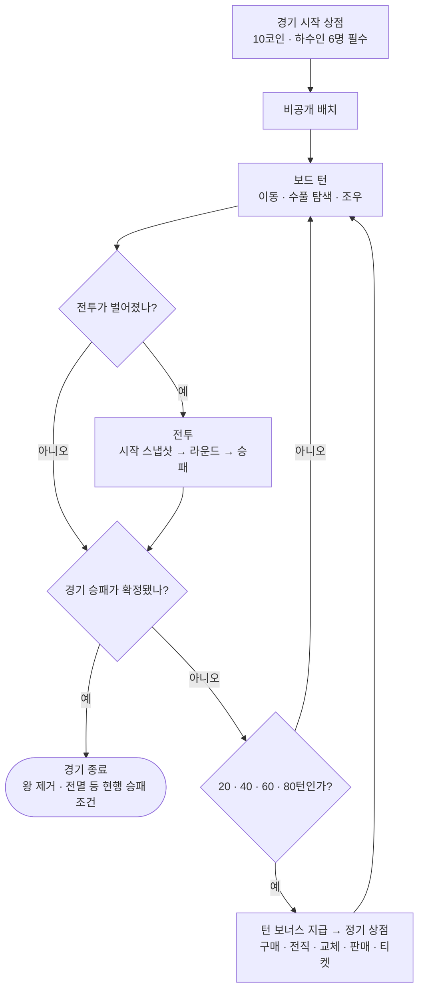
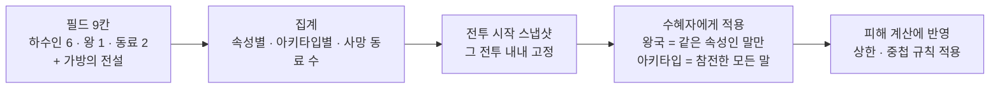

# 일정 등록용 Notion 스냅샷 — 2026-09-16

원본: https://app.notion.com/p/3dc1e7f1708580329da6fe4986654f7b
이 파일은 일정 등록 시점의 보조 자료이며 기획 원본은 Notion이다.

Here is the result of "fetch" for the Page with URL https://app.notion.com/p/3dc1e7f1708580329da6fe4986654f7b as of 2026-09-16T03:55:30.680Z:
<page url="https://app.notion.com/p/3dc1e7f1708580329da6fe4986654f7b" icon="⚙️">
<ancestor-path>
<parent-data-source url="collection://cb30f124-3ae2-409c-a4c9-ed4c6fe9163a" name="Game Design Docs"/>
<ancestor-2-database url="https://app.notion.com/p/470445c36855472b9060cf597c2cb241" title="Digit Dual — Game Design Docs"/>
</ancestor-path>
<properties>
{"Editor":["<mention-user url=\"user://8e0a8270-d0e3-407e-a7d2-b3f992f1e366\"></mention-user>"],"Issue":"미생성","Milestone":"v0.4.11 · 기획","Owner":["<mention-user url=\"user://8e0a8270-d0e3-407e-a7d2-b3f992f1e366\"></mention-user>"],"Project":["https://app.notion.com/p/3ae1e7f1708580f7bb88c7ee4f511aa0"],"Status":"검토 중","Summary":"2026-09-16 CJ 추가 Comment 반영. 9장을 삭제하고 필요한 규칙·검증 기준을 1\\~8장에 통합했다. 일반 하수인 30종·일반 120/전설 12스킬·승인된 전설 스탯 21값 보존. 아키타입 수혜, 시작 상점 4종 소모품, 선턴·후턴, 연결 대기·상점 UX 정리. 새 경계 해석은 설계 보완으로 표시. 기획 단계이며 구현·시뮬레이션·Milestone·Issue 작성 전.","Version":"v0.4.11 대규모 패치","date:Edit Date:is_datetime":0,"date:Edit Date:start":"2026-09-16","url":"https://app.notion.com/p/3dc1e7f1708580329da6fe4986654f7b","마지막 수정":"2026-09-16T03:58:53.057Z","문서 ID":"GDD-23","문서 상태":"검토 요청","문서 유형":"System","문서명":"Digit Duel — v0.4.11 기획","요약":"30종 하수인·전투·시너지·성장·상점의 다음 패치 기획.","참조 링크":"","템플릿 원본":"__NO__","하위 기획서":["https://app.notion.com/p/3dc1e7f1708581a48421fcec63d3cdf8"]}
</properties>
<iconMetadata>{"type":"emoji","emoji":"⚙️"}</iconMetadata>
<content>
<callout icon="✅" color="gray_bg">
	**문서 상태** — CJ Comment를 반영한 기획입니다. 추가한 경계 해석은 해당 규칙 옆에 \[설계 보완\]으로 표시했습니다. **구현·밸런스 검증은 별도 착수 지시 후 진행합니다.**
</callout>

---
## 1. 이 패치가 무엇인가
v0.4.11은 **말을 모으고 조합하는 층**을 숫자 장기 위에 얹는 패치입니다. 경기 도중 열리는 상점에서 하수인을 사고 키우고 바꾸면서, 어떤 말을 나란히 세웠는지가 전투 결과를 바꾸도록 만듭니다.
### 무엇을 고치려는 것인가
- 하수인 · 왕 · 동료의 스킬과 조합 선택을 늘려 전투의 반복감을 줄입니다.
- 시너지로 속성 상성의 열세를 보완할 선택지를 만듭니다.
### 한 경기는 이렇게 돌아갑니다

- **상점에서 만든 구성**이 **필드 9칸**(하수인 6 + 왕 1 + 동료 2)에 남고, 그 9칸이 **시너지**를 만들고, 시너지가 **전투 수치**를 바꿉니다. 가방은 세지 않지만 **가방의 전설만 예외로 아키타입 시너지에 함께 셉니다**(5.1).
### 한눈에 보는 숫자
<table fit-page-width="true" header-row="true">
<colgroup>
<col width="143.14236450195312">
<col width="311.357666015625">
</colgroup>
<tr>
<td>항목</td>
<td>값</td>
</tr>
<tr>
<td>일반 하수인</td>
<td>30종 = 5속성 × 6아키타입 (각 4스킬 = 120스킬)</td>
</tr>
<tr>
<td>전설 하수인</td>
<td>3종 (각 4스킬 = 12스킬 + 고유 패시브 1개)</td>
</tr>
<tr>
<td>속성</td>
<td>🔥 불 · 💧 물 · ⚡ 번개 · 🗻 땅 · 🌿 풀</td>
</tr>
<tr>
<td>아키타입 (전투 역할)</td>
<td>표준형 · 공격형 · 방어형 · 속공형 · 지속형 · 보호형</td>
</tr>
<tr>
<td>필드 칸</td>
<td>하수인 6 + 왕 1 + 동료 2 = 9칸 · 가방 3칸</td>
</tr>
<tr>
<td>스탯</td>
<td>8종 (❤️ 💪🏻 🎯 🛡️ 🫧 🏃🏻 💨 💫)</td>
</tr>
<tr>
<td>상점</td>
<td>경기 시작 1회 + 20 · 40 · 60 · 80턴 4회</td>
</tr>
<tr>
<td>시작 재화</td>
<td>🪙10 (아이템 · 전투 버프 · 몬스터 볼 지급 없음)</td>
</tr>
</table>
---
## 2. 한 경기의 흐름
### 2.1 상점이 열리는 때
- **"턴"은 한 플레이어의 차례 1회**입니다. 10턴이면 플레이어당 5번뿐이라 **20턴 간격**으로 엽니다.
- 정기 상점은 **20 · 40 · 60 · 80번째 턴**의 이동 · 탐색 · 전투 · 연출이 **모두 끝난 뒤** 열리고, 이 4회 이후에는 더 열리지 않습니다.
- 그 턴의 전투로 승패가 나면 상점을 열지 않고 경기를 끝냅니다. 상점이 열려 있는 동안에는 보드 이동 · 탐색 · 전투가 모두 잠기므로 상점 도중 새 승패가 생기지 않습니다.
- 현행 경기에는 턴 상한이 없습니다(GDD-13). AI vs AI 시뮬레이션만 500턴 안전 상한이 있습니다. 경기가 먼저 끝나면 남은 상점이 열리지 않을 뿐입니다.
- **버닝 타임(65턴부터)은 그대로**입니다. 80턴 상점은 버닝 타임 중에도 정상으로 열리고, 상점이 열려 있는 동안에는 턴 수가 늘지 않으므로(보드 일시 정지) 버닝 타임의 시작 턴과 진행에 영향을 주지 않습니다.
- 실제 평균 경기 길이는 AI vs AI 시뮬레이션으로 확인해 조정합니다.
### 2.2 경기 시작 상점 — 말을 처음 고르는 자리
배치 단계 **전에** 양측이 한 번 여는 준비 상점입니다. 20 · 40 · 60 · 80턴 4회에는 포함되지 않습니다.
<table fit-page-width="true" header-row="true">
<colgroup>
<col>
<col width="878.0833740234375">
</colgroup>
<tr>
<td>항목</td>
<td>규칙</td>
</tr>
<tr>
<td>시작 재화</td>
<td>🪙10. 아이템 · 전투 버프 · 몬스터 볼은 0개로 시작합니다(현행 시작 아이템 3종 · 볼 2개 지급 폐지)</td>
</tr>
<tr>
<td>살 수 있는 것</td>
<td>하수인 + **소모품 4종**(회복약 · 쿨링수 · 해독제 · 몬스터 볼)입니다. **시너지 교체 티켓과 전투 버프 3종**(힘 · 시간 · 도망의 수호자)**은 정기 상점 전용**이라 여기서는 팔지 않습니다. 가격은 정기 상점과 같습니다</td>
</tr>
<tr>
<td>하수인 진열</td>
<td>5칸 모두 **⭐1** · **아직 가지지 않은 종** · 서로 다른 종. 회차 등급 무작위와 별개입니다</td>
</tr>
<tr>
<td>무료 보충</td>
<td>이 상점에서만, 구매로 빈 진열 칸은 **즉시 무료로** 새 미보유 ⭐1 종으로 채워집니다. 그래서 새로 고침 없이 6명을 살 수 있습니다</td>
</tr>
<tr>
<td>구매 순서</td>
<td>산 하수인은 먼저 **필드 6칸**을 채우고, 6칸이 찬 뒤에 산 것은 가방으로 들어갑니다. 모두 새 칸을 채우므로 합성 · 승급은 일어나지 않습니다</td>
</tr>
<tr>
<td>완료 조건</td>
<td>필드 6칸이 모두 찼을 때만 '완료'를 누를 수 있습니다. **'완료'를 누르면 그 상점은 다시 열리지 않습니다**(2.3)</td>
</tr>
</table>
**🪙 예비 재화 규칙** — 필드 빈 칸이 k개일 때, 칸을 채우지 않는 지출(소모품 4종 · 새로 고침)은 **지출 후 🪙가 k 이상 남을 때만** 할 수 있습니다.
- 예: 🪙10으로 시작해 필드가 비어 있으면(k=6) 하수인 외 지출은 **최대 🪙4**까지입니다. 하수인을 한 명 살 때마다 k가 줄어 예비도 함께 풀립니다.
**왕 · 동료의 속성을 여기서 정합니다.** 현행 왕 · 동료는 무속성이라 왕국 집계에 넣을 속성이 없습니다. 이 상점에서 왕 · 동료 3명의 속성을 각각 **무료로** 고릅니다. 고르지 않으면 필드 하수인에 가장 많은 속성(동률이면 🔥 → 💧 → ⚡ → 🗻 → 🌿 순)으로 정합니다. 이후 변경은 시너지 교체 티켓으로만 합니다. 이 속성은 정체 비공개 원칙에 따라 소유자 화면에만 보이고, 전투에 참전해 공개될 때 상대도 알게 됩니다.
**시간 초과 처리** — 제한 시간(온라인 · PVE 90초 / 핫시트 1인 60초)이 끝났는데 빈 칸이 있으면, 현재 진열의 **진열 순번이 낮은 칸부터**(화면 위 → 아래) 자동 구매합니다. 구매한 칸은 무료 보충으로 다시 채워집니다. PVE의 AI도 같은 규칙으로 구매하며 상대 상점 내용은 보지 않습니다(공정 관측).
### 2.3 상점을 여는 방식
<table fit-page-width="true" header-row="true">
<colgroup>
<col>
<col width="1259.420166015625">
</colgroup>
<tr>
<td>모드</td>
<td>진행</td>
</tr>
<tr>
<td>온라인 PVP · PVE</td>
<td>양측에 **동시에** 열리고 각자 제한 시간 90초. 둘 다 '완료'를 누르거나 90초가 지나면 함께 닫힙니다. PVE의 AI는 즉시 처리하고 공정 관측 원칙을 따릅니다</td>
</tr>
<tr>
<td>핫시트(로컬 2인)</td>
<td>한 사람씩 각 **60초**로 순차 진행(최대 120초). 첫 오픈은 P1 → 가림 화면("상대에게 넘기세요") → P2 순서이고, 이후 오픈마다 순서를 바꿉니다(2회차는 P2 먼저). 자기 차례가 아닐 때 상대 상점 · 가방 화면은 가려집니다</td>
</tr>
</table>
- **완료는 되돌릴 수 없습니다** — '완료'를 누른 쪽은 그 상점을 다시 열 수 없고 구성을 고칠 수 없습니다. 고치고 싶으면 **다음 상점이 열렸을 때** 합니다. 완료한 쪽은 상대가 완료하거나 시간이 끝날 때까지 대기 화면에 머뭅니다.
### 2.4 시간 초과 · 중복 입력 · 연결 끊김
- **타임아웃** — 제한 시간이 끝나면 이미 **확정된** 구매 · 판매 · 전직 · 교체 · 티켓 사용은 그대로 보존하고, 확정되지 않은 입력만 취소합니다. 확인 팝업 승인은 '요청'이고, 거래 확정 기준은 핫시트 · PVE는 **승인 순간**, 온라인은 **서버가 요청을 수락한 순간**입니다.
- **중복 입력 방지** — 확인 버튼은 누르는 순간 잠겨 연타로 두 번 처리되지 않습니다.
- **온라인 권위** — 서버가 재화 · 원장 · 판매 기록 · 진열 · 가방 · 필드 · 시너지 상태를 권위적으로 보관합니다. 상점을 열 때마다, 그리고 새로 고침할 때마다 진열 번호를 새로 붙이고, 모든 거래 요청에 고유 요청 ID와 진열 번호를 담습니다. 서버는 같은 요청 ID를 한 번만 처리하고 지난 진열 번호로 온 구매 요청은 거부합니다. 마감은 서버 시각 기준이며 마감 뒤 도착한 요청은 거부합니다. 한 요청에 따른 변경(🪙 차감 · 원장 가산 · 자동 승급 · 진열 칸 비우기)은 **전부 적용되거나 전부 거부**됩니다.
- **연결 감지** — 서버와 클라이언트가 주기적으로 연결 확인 신호(ping · pong)를 주고받습니다. 점검 주기는 서버 구현에서 정합니다. **서버가 단절을 확정한 순간부터** 상대 화면에 "상대 연결 대기" Indicator가 뜨고, **모든 행동과 게임 타이머가 멈춥니다** — 상점 제한 시간 · 가방 초과 20초 · 전투 입력이 모두 포함됩니다. 이때 흐르는 것은 **재연결 대기 타이머뿐**입니다.
- **재연결 대기 시간은 60초**입니다. 서버 재인증과 상태 복구가 확인되고 양측 연결이 갖춰지면 **저장해 둔 잔여 시간부터** 이어서 재개하고, 60초가 지나면 **몰수패**로 처리합니다. 재연결 횟수 제한은 두지 않으며, 다시 끊기면 그 단절을 감지한 시점부터 다시 60초를 셉니다.
- **양측이 동시에 끊기면** 각자 60초를 따로 세고 **먼저 만료된 쪽이 몰수패**입니다. 만료 시각이 완전히 같으면 승자 없는 경기 종료로 둡니다. 경기가 시작되기 전(로비 · 배치) 만료는 **경기 취소**입니다. 서버 재시작 등으로 복구 자체가 불가능한 경우는 GDD-22의 기존 무효 · 재접속 불가 계약을 따릅니다. 의도적 항복은 현행대로 즉시 종료합니다.
- **상점 중 끊긴 경우** — 서버가 수락한 거래는 유지됩니다. 재연결하면 멈춰 둔 시간부터 이어서 상점을 씁니다. 단절 전에 이미 완료 · 마감된 상점은 재개방하지 않습니다. 몰수 패배가 확정되면 거래보다 승패 판정이 우선합니다 — 처리 순서는 **수락된 거래 유지 → 몰수 패배 판정 → 경기 종료**이고, 몰수가 확정된 뒤 도착한 거래 요청은 처리하지 않습니다.
- 타이머를 멈추는 규칙은 **현재 서버에 아직 구현되어 있지 않습니다.** 대기 60초는 현행 서버 값을 그대로 가져왔고, 유사 턴제 게임의 공식 사례로 [Chess.com 게임 포기 규정](https://support.chess.com/en/articles/8593801-how-does-game-abandonment-work)(시간 설정별 30초\~3분, Rapid 10\|0의 예가 60초)을 참고했습니다.
---
## 3. 말과 스탯
### 3.1 스탯과 스킬을 가진 전투원
<table fit-page-width="true" header-row="true">
<tr>
<td>말</td>
<td>등급</td>
<td>스킬</td>
<td>속성</td>
<td>아키타입</td>
</tr>
<tr>
<td>일반 하수인 30종</td>
<td>⭐1\~⭐4 (상점에서 성장)</td>
<td>등급마다 1개씩, 최대 4개</td>
<td>있음</td>
<td>있음</td>
</tr>
<tr>
<td>전설 하수인 3종</td>
<td>⭐⭐⭐⭐⭐ 고정 (성장 없음)</td>
<td>처음부터 4개 + 고유 패시브 1개</td>
<td>없음(무속성)</td>
<td>있음</td>
</tr>
<tr>
<td>왕 1명</td>
<td>없음</td>
<td>고정 칸 (시너지로 최대 4개)</td>
<td>있음(경기 시작 상점에서 선택)</td>
<td>없음</td>
</tr>
<tr>
<td>동료 2명 (암살자 · 방패병)</td>
<td>없음</td>
<td>고정 칸 (시너지로 최대 3개)</td>
<td>있음(경기 시작 상점에서 선택)</td>
<td>없음</td>
</tr>
</table>
### 3.2 스탯 8종
모든 전투원이 아래 스탯을 가집니다.
<table fit-page-width="true" header-row="true">
<colgroup>
<col width="154.29515075683594">
<col width="276.7986145019531">
<col width="1205.826416015625">
</colgroup>
<tr>
<td>스탯</td>
<td>뜻</td>
<td>규칙 · 상한</td>
</tr>
<tr>
<td>❤️ 최대 HP</td>
<td>말의 체력</td>
<td>전투 사이에 현재 HP가 유지됩니다(현행)</td>
</tr>
<tr>
<td>💪🏻 공격력</td>
<td>말의 기본 공격력</td>
<td>스킬 위력 💪🏻 N%는 "공격력 × N%"입니다</td>
</tr>
<tr>
<td>🎯 치명타 확률</td>
<td>피해 스킬의 **타격마다** 확률 판정</td>
<td>치명타면 그 타격 피해 ×1.5. 상한 50%. 상한은 확률 합계에만 걸리고 '치명타 확정' 효과는 확률 판정을 건너뛰므로 상한보다 우선합니다(확정 효과는 다음 피해 스킬 1회에 소모). '확률 100%' 효과도 같습니다</td>
</tr>
<tr>
<td>🛡️ 방어력</td>
<td>받는 피해를 비율로 줄입니다</td>
<td>방어력 1 = 받는 피해 1% 감소. 경화 등 받는 피해 감소 효과와 합산해 상한 50%</td>
</tr>
<tr>
<td>🫧 방어막</td>
<td>HP보다 먼저 피해를 막는 전투용 체력</td>
<td>기본값 0. 스킬 · 보호형 기본값 · 보호형 시너지로 얻고, 전투가 끝나면 사라집니다</td>
</tr>
<tr>
<td>🏃🏻 속도</td>
<td>말의 기본 속도</td>
<td>속도가 더 빠른 말이 그 라운드에 먼저 행동합니다</td>
</tr>
<tr>
<td>💨 회피율</td>
<td>피해 스킬의 **타격마다** 확률 판정</td>
<td>회피하면 그 타격의 피해와 대상에게 거는 효과가 모두 없습니다(자기 대상 효과는 유지). 상한 40%. 사신의 낫(즉사)은 회피 판정이 없습니다</td>
</tr>
<tr>
<td>💫 상태이상 부여 확률</td>
<td>상태이상 · 버프 부여 확률에 %p로 더합니다</td>
<td>스킬 효과와 왕국 시너지 효과 모두에 적용. 상한 100%</td>
</tr>
</table>

🫧 방어막 층 규칙 — 여러 번 얻으면 어떻게 되나

	방어막은 얻을 때마다 획득원(보호형 기본 · 시너지 · 스킬 이름)이 붙은 **층**으로 쌓입니다. 화면에는 층 합계를 방어막 바 1개로 표시합니다.
	- 피해는 **가장 나중에 얻은 층부터** 깎고, 남은 피해가 그 아래 층으로 넘어갑니다.
	- "이 방어막" = 그 스킬이 만든 층. "막아낸 피해" = 그 층이 실제로 줄어든 양. "방어막이 공격을 막음" = 한 타격에 층이 1 이상 줄어듦.
	- **깨짐 1회** = 피격으로 한 층의 남은 양이 0이 된 순간. 한 타격이 여러 층을 깨면 깨진 층 수만큼 셉니다.
	- 스킬의 전환 · 소모(균사 전환 · 화산 폭발), 상대의 버프 해제 · 제거(변덕 주문 등), 전투 종료로 사라진 층은 **깨짐이 아니며** 깨짐을 조건으로 쓰는 효과를 일으키지 않습니다.
	- 버프 제거 효과는 모든 층을 한꺼번에 지우며 '방어막 1개'로 셉니다. '방어막 무시' 공격은 층을 깎지 않고 HP에 들어갑니다.

### 3.3 아키타입 기본 스탯 (⭐1)
같은 아키타입의 종은 기본 스탯이 같고, **종의 개성은 스킬로** 만듭니다. ❤️ · 💪🏻는 현행 로스터 값을 그대로 이어받습니다.
<table fit-page-width="true" header-row="true">
<tr>
<td>아키타입</td>
<td>❤️</td>
<td>💪🏻</td>
<td>🛡️</td>
<td>🏃🏻</td>
<td>💨</td>
<td>🎯</td>
<td>💫</td>
<td>🫧</td>
</tr>
<tr>
<td>표준형</td>
<td>100</td>
<td>22</td>
<td>10</td>
<td>10</td>
<td>5%</td>
<td>5%</td>
<td>+0%p</td>
<td>0</td>
</tr>
<tr>
<td>공격형</td>
<td>90</td>
<td>25</td>
<td>5</td>
<td>10</td>
<td>0%</td>
<td>10%</td>
<td>+0%p</td>
<td>0</td>
</tr>
<tr>
<td>방어형</td>
<td>120</td>
<td>18</td>
<td>20</td>
<td>6</td>
<td>0%</td>
<td>0%</td>
<td>+0%p</td>
<td>0</td>
</tr>
<tr>
<td>속공형</td>
<td>85</td>
<td>24</td>
<td>5</td>
<td>14</td>
<td>10%</td>
<td>5%</td>
<td>+0%p</td>
<td>0</td>
</tr>
<tr>
<td>지속형</td>
<td>95</td>
<td>20</td>
<td>10</td>
<td>8</td>
<td>5%</td>
<td>0%</td>
<td>+10%p</td>
<td>0</td>
</tr>
<tr>
<td>보호형</td>
<td>110</td>
<td>19</td>
<td>10</td>
<td>7</td>
<td>0%</td>
<td>0%</td>
<td>+0%p</td>
<td>전투 시작 시 최대 HP 10%</td>
</tr>
</table>
**아키타입의 역할** — 표준형은 고르게, 공격형은 한 방, 방어형은 **받는 피해를 비율로 줄이고**(방어력 · 경화), 속공형은 먼저 때리고, 지속형은 상태이상을 걸고, **보호형은 정해진 양을 HP보다 먼저 막아냅니다**(방어막). 방어형과 보호형은 "버틴다"는 점이 같고 **막는 방식이 다릅니다.**
### 3.4 등급 성장 (일반 하수인)
- ❤️ 최대 HP = 기본값 × (1 + 0.15 × (등급 − 1)) → ⭐2 ×1.15 / ⭐3 ×1.30 / ⭐4 ×1.45
- 💪🏻 공격력 = 기본값 × (1 + 0.10 × (등급 − 1)) → ⭐2 ×1.10 / ⭐3 ×1.20 / ⭐4 ×1.30
- 결과는 정수 반올림합니다. **방어력 · 속도 · 회피 · 치명 · 💫는 등급으로 바뀌지 않습니다.** 예: 표준형 ⭐4 = ❤️ 145 / 💪🏻 29.
- 보유 스킬: ⭐1은 1차, ⭐2는 1\~2차, ⭐3은 1\~3차, ⭐4는 1\~4차.
### 3.5 왕 · 동료 스탯 (등급 없음)
<table fit-page-width="true" header-row="true">
<tr>
<td>말</td>
<td>❤️</td>
<td>💪🏻</td>
<td>🛡️</td>
<td>🏃🏻</td>
<td>💨</td>
<td>🎯</td>
<td>💫</td>
</tr>
<tr>
<td>왕</td>
<td>100</td>
<td>16</td>
<td>10</td>
<td>8</td>
<td>0%</td>
<td>0%</td>
<td>+0%p</td>
</tr>
<tr>
<td>동료 (암살자)</td>
<td>100</td>
<td>18</td>
<td>5</td>
<td>12</td>
<td>10%</td>
<td>10%</td>
<td>+0%p</td>
</tr>
<tr>
<td>동료 (방패병)</td>
<td>100</td>
<td>14</td>
<td>20</td>
<td>6</td>
<td>0%</td>
<td>0%</td>
<td>+0%p</td>
</tr>
</table>
### 3.6 전설 하수인 스탯
전설은 🪙10 완제품(일반 ⭐4는 🪙4)이고 등급 성장이 없으며 속성이 없어 왕국 시너지 효과를 받지 못합니다. 그래서 **같은 아키타입 일반 하수인의 ⭐4 값보다 높게** 잡습니다. 스킬 위력 · ⌛ · 고유 패시브는 등급과 무관하게 고정입니다.
<table fit-page-width="true" header-row="true">
<tr>
<td>전설 (아키타입)</td>
<td>❤️</td>
<td>💪🏻</td>
<td>🛡️</td>
<td>🏃🏻</td>
<td>💨</td>
<td>🎯</td>
<td>💫</td>
</tr>
<tr>
<td>🐉 용 (표준형)</td>
<td>175</td>
<td>35</td>
<td>15</td>
<td>11</td>
<td>5%</td>
<td>10%</td>
<td>+0%p</td>
</tr>
<tr>
<td>🕯 마녀 (지속형)</td>
<td>165</td>
<td>32</td>
<td>12</td>
<td>13</td>
<td>10%</td>
<td>5%</td>
<td>+25%p</td>
</tr>
<tr>
<td>💀 사신 (공격형)</td>
<td>158</td>
<td>40</td>
<td>8</td>
<td>14</td>
<td>15%</td>
<td>20%</td>
<td>+0%p</td>
</tr>
</table>
기준이 되는 일반 ⭐4 값과의 대조:
<table fit-page-width="true" header-row="true">
<tr>
<td>비교</td>
<td>일반 ⭐4 ❤️</td>
<td>전설 ❤️</td>
<td>일반 ⭐4 💪🏻</td>
<td>전설 💪🏻</td>
</tr>
<tr>
<td>표준형 → 🐉 용</td>
<td>145</td>
<td>175 (+21%)</td>
<td>29</td>
<td>35 (+21%)</td>
</tr>
<tr>
<td>지속형 → 🕯 마녀</td>
<td>138</td>
<td>165 (+20%)</td>
<td>26</td>
<td>32 (+23%)</td>
</tr>
<tr>
<td>공격형 → 💀 사신</td>
<td>131</td>
<td>158 (+21%)</td>
<td>33</td>
<td>40 (+21%)</td>
</tr>
</table>
---
## 4. 전투 규칙
### 4.1 5속성 상성 순환
- **이기는 순서: 🔥 불 → 🌿 풀 → 🗻 땅 → ⚡ 번개 → 💧 물 → 🔥 불** (화살표 왼쪽이 유리)
- 유리 ×1.3 / 불리 ×0.75 / 중립 ×1.0
- 공격 쪽은 **스킬 속성**(일반 하수인 · 왕 · 동료 스킬은 모두 본체 속성), 방어 쪽은 **본체 속성**으로 판정합니다.
- 전설 스킬과 무속성 대상은 중립입니다. 드래곤 숨결만 전설 항목의 고유 배율을 씁니다.
### 4.2 피해 계산 순서 (타격 1회)
<table fit-page-width="true" header-row="true">
<colgroup>
<col width="57.739585876464844">
<col width="684.2986450195312">
</colgroup>
<tr>
<td>단계</td>
<td>계산</td>
</tr>
<tr>
<td>①</td>
<td>**회피 판정** — 회피하면 그 타격은 여기서 끝납니다</td>
</tr>
<tr>
<td>②</td>
<td>기본 피해 = 💪🏻 공격력 × 스킬 위력% (+ 스킬에 적힌 고정 피해)</td>
</tr>
<tr>
<td>③</td>
<td>× 피해 분산 0.8\~1.2 (현행 · 💪 힘의 수호자면 1.2 고정)</td>
</tr>
<tr>
<td>④</td>
<td>× 속성 상성 (유리 1.3 / 불리 0.75 / 중립 1.0)</td>
</tr>
<tr>
<td>⑤</td>
<td>× (1 + 가하는 피해 증가 합계, 상한 +50%)</td>
</tr>
<tr>
<td>⑥</td>
<td>× (1 − 약화 감소율)</td>
</tr>
<tr>
<td>⑦</td>
<td>**치명타 판정** — 치명타면 × 1.5</td>
</tr>
<tr>
<td>⑧</td>
<td>× (1 − 받는 피해 감소 합계 = 방어력 + 경화 등, 상한 50%)</td>
</tr>
<tr>
<td>⑨</td>
<td>× (1 + 받는 피해 증가 합계 = 균열 등, 상한 +50%)</td>
</tr>
<tr>
<td>⑩</td>
<td>**정수 반올림 1회**, 0보다 크면 최소 1</td>
</tr>
<tr>
<td>⑪</td>
<td>🫧 방어막이 먼저 막고 남은 피해가 HP를 깎습니다. 흡수 · 회복 계산은 **HP에 실제로 들어간 피해**를 기준으로 합니다</td>
</tr>
</table>
전투 판정용 유효 피해 집계(현행 방어막 흡수 상한 규칙)는 바뀌지 않습니다.
### 4.3 일반 피해가 아닌 피해
<table fit-page-width="true" header-row="true">
<colgroup>
<col width="636.1909790039062">
<col width="1025.513916015625">
</colgroup>
<tr>
<td>종류</td>
<td>계산</td>
</tr>
<tr>
<td>반사 (빙벽 반사: 받은 피해의 X%)</td>
<td>그 값에서 시작해 ⑧ 방어력 · 경화 감소 → ⑨ 균열 증가 → ⑩ 반올림 → ⑪ 방어막 · HP 순서만 따릅니다. 회피 · 분산 · 상성 · 가하는 피해 증감 · 치명타 · 시너지 판정은 없습니다</td>
</tr>
<tr>
<td>반격 (집게 반격: 💪🏻 X%)</td>
<td>② 공격력 × X%에서 시작해 ④ 상성 → ⑧ → ⑨ → ⑩ → ⑪을 따릅니다. 회피 · 분산 · 치명타 · 시너지 판정은 없습니다</td>
</tr>
<tr>
<td>지속 피해 (화상 · 이끼 잠식 · 번식 포자 · 불꽃 표식 · 폭발 연소처럼 '최대 HP %' 또는 화상 피해를 쓰는 효과)</td>
<td>계산한 값을 ⑩ 반올림만 하고 **방어막을 무시해 HP에 직접** 들어갑니다(현행 화상과 같음). 회피 · 방어력 · 균열 · 치명타 · 시너지 판정은 없습니다</td>
</tr>
<tr>
<td>예고 피해 (해일 예고)</td>
<td>발동 시점에 일반 피해 ①\~⑪을 모두 따릅니다</td>
</tr>
<tr>
<td>즉사 (사신의 낫)</td>
<td>단계 없이 HP를 0으로 만듭니다</td>
</tr>
</table>
### 4.4 선턴 · 후턴 (라운드 시작 시 확정)
한 라운드에서 먼저 행동하는 쪽이 **선턴**, 나중에 행동하는 쪽이 **후턴**입니다. 종전 기획서의 '공격자 / 방어자'를 대체하는 용어입니다.
1. 순서 효과로 먼저 나눕니다 — 선턴 효과가 있으면 '선턴', 감전 같은 후턴 효과가 있으면 '후턴', 둘 다 없으면 '기본'. **둘 다 있으면 후턴이 우선**합니다.
2. **선턴 → 기본 → 후턴** 순서로 행동합니다.
3. 같은 분류끼리는 아래 순서로 먼저 행동합니다.
	1. 🏃🏻 **속도**가 더 높은 쪽
	2. 속도가 같으면 **⭐ 등급이 더 낮은** 하수인
	3. 그래도 같으면 **먼저 공격을 건 말**(접촉을 먼저 건 쪽)
- 접촉을 먼저 건 쪽은 **마지막 동률 기준일 뿐**이며, 순서 효과와 속도가 먼저입니다.
- \[설계 보완\] 2단계의 등급 비교는 **양쪽 모두 ⭐ 등급을 가졌을 때만** 합니다(전설은 ⭐5로 비교). 등급이 없는 왕 · 동료 본체가 끼면 등급 단계를 건너뛰어 바로 3단계로 갑니다.
- **승패 판정은 현행 그대로입니다** — HP 비율로도 승부가 갈리지 않을 때는 **접촉을 받은 쪽이 승리**합니다(GDD-13 4장의 '방어자 승'과 같은 규칙, 표현만 바꿨습니다).
- 출전자를 고르는 **순차 블라인드도 현행 그대로**입니다 — 접촉을 건 말의 소유자가 먼저, 다음에 상대가 고릅니다. 선택 버튼을 누르면 즉시 확정되고 취소 버튼은 없으며, 대리 후보가 없으면 본체가 자동으로 나갑니다(7.5). 선턴 · 후턴은 양측이 확정해 공개된 **실제 참전자의 스탯과 효과로** 정합니다.
R은 **전투 라운드**(양측이 각 1회 행동)이며 보드의 "턴"과 다릅니다.
### 4.5 상태이상 · 버프 사전
<table fit-page-width="true" header-row="true">
<colgroup>
<col width="187.8819580078125">
<col width="502.5972595214844">
<col>
</colgroup>
<tr>
<td>이름</td>
<td>효과</td>
<td>분류</td>
</tr>
<tr>
<td>화상 (불)</td>
<td>라운드 종료 시 최대 HP 5% 피해, 2R (현행)</td>
<td>상태이상</td>
</tr>
<tr>
<td>약화 (물)</td>
<td>가하는 피해 −20%, **대상의 공격 2회** (현행)</td>
<td>상태이상</td>
</tr>
<tr>
<td>감전 (번개)</td>
<td>다음 1라운드 후턴 (현행 감전과 같은 효과, 용어만 바꿈)</td>
<td>상태이상</td>
</tr>
<tr>
<td>균열 (땅)</td>
<td>대상이 받는 피해 +10%, 2R</td>
<td>상태이상</td>
</tr>
<tr>
<td>속도 감소 · 회복 감소</td>
<td>표기된 값 · 지속</td>
<td>상태이상</td>
</tr>
<tr>
<td>경화</td>
<td>자신이 받는 피해 −X%, 표기된 지속 (땅 왕국 시너지와 같은 버프)</td>
<td>버프</td>
</tr>
<tr>
<td>흡수 (풀)</td>
<td>1R 동안 자기 공격이 HP에 준 피해의 20% 회복 (풀 왕국 시너지와 겹치면 큰 값)</td>
<td>버프</td>
</tr>
<tr>
<td>🫧 방어막</td>
<td>HP보다 먼저 피해를 막고 전투 종료 시 사라집니다. 여러 번 얻으면 합산합니다(현행)</td>
<td>버프</td>
</tr>
<tr>
<td>회피 증가 · 가하는 피해 증가</td>
<td>표기된 값 · 지속</td>
<td>버프</td>
</tr>
</table>
**해독제는 상태이상만 해제합니다** — 경화 · 흡수 · 방어막 같은 버프는 해제하지 않습니다.
### 4.6 발동 제약
- 기본기를 뺀 모든 스킬은 ⌛1 이상이거나 전투당 1회라서, 조건이 맞아도 **연속으로 반복할 수 없습니다.**
- 추가 사용 · 반사 · 반격은 한 행동에 **1회까지**이고, 그 피해가 다시 추가 사용 · 반사 · 반격을 일으키지 않습니다(연쇄 금지).
- HP 소모는 최대 HP 기준이고, 현재 HP가 소모량 이하이면 사용할 수 없습니다(자해로 쓰러지지 않음).
- 예고 · 지연 효과(해일 예고 등)는 발동 전에 전투가 끝나면 취소됩니다.
- "회복 총량"은 최대 HP를 넘지 않고 실제로 오른 HP만 합산합니다.
- 상대 스킬의 ⌛를 늘리는 효과는 비공개 스킬을 고르는 화면 없이 **자동으로** 정합니다 — 기본기를 뺀 스킬 중 남은 ⌛가 가장 짧은 것, 같으면 슬롯 순서(2차 → 4차).
- 효과 대상은 **그 전투에 참전한 자신과 상대뿐**이며, 참전하지 않은 왕 · 동료 · 하수인은 대상이 아닙니다.
### 4.7 해 보기 — 한 대 때리면 이렇게 계산됩니다
<callout icon="🧮" color="blue_bg">
	**상황** — 내 **새끼 화룡**(🔥 불 · 표준형 · ⭐3)이 2차 **불씨 브레스**(💪🏻 140% · 화상 70%)로 상대 **고대 골렘**(🗻 땅 · 지속형 · ⭐2)을 칩니다. 내 필드에는 표준형이 3마리(표준형 시너지 (3): 공격력 +5%), 불 속성이 4칸(불 왕국 (4): 화상 40% / 최대 HP 4% / 1R) 있습니다. **상대에게는 추가 버프도 시너지도 없다고 가정합니다.**
</callout>
<table fit-page-width="true" header-row="true">
<colgroup>
<col width="89.00000762939453">
<col width="415.0000305175781">
<col>
</colgroup>
<tr>
<td>단계</td>
<td>계산</td>
<td>값</td>
</tr>
<tr>
<td>공격력</td>
<td>표준형 기본 22 × ⭐3 배율 1.20 = 26.4 → 26, 표준형 시너지 +5%</td>
<td>27.3</td>
</tr>
<tr>
<td>①</td>
<td>고대 골렘 회피율 5% — 회피 실패(맞음)</td>
<td>계속</td>
</tr>
<tr>
<td>②</td>
<td>27.3 × 140%</td>
<td>38.22</td>
</tr>
<tr>
<td>③</td>
<td>× 피해 분산 (예시로 1.0)</td>
<td>38.22</td>
</tr>
<tr>
<td>④</td>
<td>× 상성 — 불 대 땅은 순환에서 서로 안 물리므로 중립 1.0</td>
<td>38.22</td>
</tr>
<tr>
<td>⑤⑥⑦</td>
<td>가하는 피해 증가 · 약화 · 치명타 없음</td>
<td>38.22</td>
</tr>
<tr>
<td>⑧</td>
<td>× (1 − 지속형 방어력 10 = 10%)</td>
<td>34.398</td>
</tr>
<tr>
<td>⑨⑩</td>
<td>균열 없음 → 정수 반올림 1회</td>
<td>**34**</td>
</tr>
<tr>
<td>⑪</td>
<td>고대 골렘은 방어막 0 → HP에 34</td>
<td>HP −34</td>
</tr>
</table>
**같은 타격에 붙는 화상** — 스킬의 화상 70%와 불 왕국 (4)의 화상 40%를 각각 판정합니다(왕국 판정은 스킬 사용 1회당 1번). 둘 다 걸리면 중첩하지 않고 **큰 % · 긴 지속 하나로 합쳐** 최대 HP 5% · 2R가 됩니다. 고대 골렘 ⭐2의 최대 HP는 95 × 1.15 = 109이므로 한 번에 109 × 5% = **5**입니다. 화상은 부여된 라운드를 세지 않으므로 **다음 2개 라운드의 종료 시에 각 5**가 들어가고, 이 피해는 방어막을 무시해 HP로 직행합니다.
---
## 5. 시너지 — 같이 세운 말이 전투를 바꿉니다
시너지는 **필드 칸을 세어** 조건을 채우면 전투원에게 붙는 보너스입니다. 종류는 네 가지입니다.

### 5.1 무엇을 세고, 누가 받나 — 한 장 요약
<table fit-page-width="true" header-row="true">
<colgroup>
<col width="153.02430725097656">
<col>
<col width="824.27783203125">
<col width="901.545166015625">
</colgroup>
<tr>
<td>시너지</td>
<td>단계</td>
<td>무엇을 세나 (집계)</td>
<td>누가 효과를 받나 (수혜자)</td>
</tr>
<tr>
<td>왕국 (속성)</td>
<td>2 · 4 · 6 · 9</td>
<td>필드 **9칸**(하수인 6 + 왕 1 + 동료 2)을 속성별로. 사망 · 포획 칸은 동결해 계속 셉니다. **가방은 세지 않습니다.** 전설이 있는 칸은 무속성이라 0</td>
<td>참전한 전투원 중 **그 왕국과 같은 속성인 말만**(하수인 · 왕 · 동료, 가방 말의 대리 출전 포함). 전설은 무속성이라 받지 않습니다 — 용의 고유 패시브만 예외</td>
</tr>
<tr>
<td>왕 · 동료</td>
<td>1 · 2</td>
<td>자기 진영에서 **사망한 동료 수**(0\~2)</td>
<td>살아 있는 동료와 왕이 **스킬 칸으로** 얻습니다</td>
</tr>
<tr>
<td>아키타입 (하수인 타입)</td>
<td>2 \~ 6</td>
<td>필드 **하수인 6칸**을 아키타입별로(사망 칸 동결 포함), 여기에 **가방에 있는 전설**을 더합니다. 왕 · 동료는 세지 않습니다(효과는 받습니다)</td>
<td>참전한 **모든 말** — 일반 · 전설 하수인과 **왕 · 동료 본체**, 대리 출전 포함. 자기 아키타입이 없거나 달라도 **활성화된 모든 아키타입 효과**를 받습니다</td>
</tr>
<tr>
<td>전설 고유 패시브</td>
<td>—</td>
<td>전설마다 다른 조건(아래 5.5)</td>
<td>**그 전설이 직접 참전할 때만**</td>
</tr>
</table>
여기서 말하는 **"말"은 전투 스탯을 가진 전투원**(하수인 · 전설 · 왕 · 동료)입니다. 폭탄 · 함정처럼 전투 스탯이 없는 보드 말은 기존 의미 그대로이고 시너지와 무관합니다.
### 5.2 왕국 시너지 — 속성을 모으면
같은 속성 말을 9칸에 모을수록 **그 속성의 말들**이 강해집니다. 🔥 불 · 💧 물 · ⚡ 번개는 **공격 대상에게** 상태이상을, 🗻 땅 · 🌿 풀은 **사용자 자신에게** 버프를 겁니다.
<table fit-page-width="true" header-row="true">
<colgroup>
<col>
<col width="363.3715515136719">
<col width="188.63890075683594">
<col>
<col>
</colgroup>
<tr>
<td>왕국</td>
<td>(2)</td>
<td>(4)</td>
<td>(6)</td>
<td>(9)</td>
</tr>
<tr>
<td>🔥 불 — 화상</td>
<td>✅ 20% / 🔥 최대 체력 2% / 🧭 1R</td>
<td>✅ 40% / 🔥 4% / 🧭 1R</td>
<td>✅ 60% / 🔥 6% / 🧭 1R</td>
<td>✅ 100% / 🔥 10% / 🧭 1R</td>
</tr>
<tr>
<td>💧 물 — 약화</td>
<td>✅ 25% / 💧 가하는 피해 −4% / 🧭 대상의 다음 공격 1회</td>
<td>✅ 45% / 💧 −8% / 🧭 1회</td>
<td>✅ 65% / 💧 −12% / 🧭 1회</td>
<td>✅ 100% / 💧 −20% / 🧭 1회</td>
</tr>
<tr>
<td>⚡ 번개 — 감전</td>
<td>✅ 15% / ⚡ 다음 1R 후턴 / 🧭 1R</td>
<td>✅ 30% / ⚡ / 🧭 1R</td>
<td>✅ 45% / ⚡ / 🧭 1R</td>
<td>✅ 70% / ⚡ / 🧭 1R</td>
</tr>
<tr>
<td>🗻 땅 — 경화 (자신)</td>
<td>✅ 20% / 🛡️ 받는 피해 −3% / 🧭 1R</td>
<td>✅ 40% / 🛡️ −6% / 🧭 1R</td>
<td>✅ 60% / 🛡️ −9% / 🧭 1R</td>
<td>✅ 100% / 🛡️ −15% / 🧭 1R</td>
</tr>
<tr>
<td>🌿 풀 — 흡수 (자신)</td>
<td>✅ 20% / 🌿 준 피해의 10% 회복 / 🧭 1R</td>
<td>✅ 40% / 🌿 20% / 🧭 1R</td>
<td>✅ 60% / 🌿 30% / 🧭 1R</td>
<td>✅ 100% / 🌿 50% / 🧭 1R</td>
</tr>
</table>
- **화상**: 대상은 지속 라운드마다 라운드 종료 시 자기 최대 체력의 🔥% 피해를 1회 받습니다.
- **약화**: 뜻(대상이 가하는 피해 감소)은 현행을 따르고, 지속은 라운드가 아니라 **대상의 공격 횟수**로 셉니다. 현행 기술 약화(피해 −20%, 2회)와 같은 약화이고 수치만 다릅니다. 기술 약화와 겹치면 큰 감소율 · 많은 남은 횟수 하나로 합칩니다.
- **감전**: 뜻(다음 1라운드 후턴)은 현행을 따릅니다. 순서를 뒤집는 효과가 강해 다른 왕국보다 확률을 낮게 잡았습니다(현행 기술 감전 확률은 50%).
- **경화**: 공격한 **사용자 자신**이 받는 피해가 줄고, 당첨된 공격 직후부터 적용됩니다.
- **흡수**: 지속 동안 자기 공격이 HP에 준 피해의 🌿%만큼 자신을 회복시키며, 당첨된 **그 공격부터** 적용됩니다. 지속이 있는 버프이므로 연장 효과도 받습니다.
**(9)는 사망 칸을 포함한 9칸 전부가 같은 속성일 때만** 달성됩니다. 한 속성의 하수인 6종을 필드에 모두 세우고 왕 · 동료 3명을 시너지 교체 티켓으로 같은 속성에 맞추면 도달합니다. 전설을 필드 칸에 올리면 그 칸이 0이 되므로 (9)와는 맞바꿈 관계입니다.
### 5.3 왕 · 동료 시너지 — 동료가 쓰러질수록
카운트는 **자기 진영에서 사망한 동료 수(0\~2)**입니다. 왕 사망은 즉시 경기 패배(현행)이므로 세지 않고, 하수인 사망은 왕국 · 아키타입 시너지의 동결 칸으로 이미 남으므로 여기서 중복해 세지 않습니다. 사망한 동료 칸도 왕국 집계에는 동결 칸으로 남습니다. 대리 출전 패배로 동료가 함께 제거된 경우도 1명으로 셉니다.
<table fit-page-width="true" header-row="true">
<colgroup>
<col>
<col width="505.1944580078125">
<col>
<col width="180.0416717529297">
<col width="873.7604370117188">
</colgroup>
<tr>
<td>단계</td>
<td>스킬</td>
<td>수치</td>
<td>들어가는 칸</td>
<td>붙는 효과</td>
</tr>
<tr>
<td>(1)</td>
<td>🪄 **동료의 복수** — 동료 1명이 사망하면 살아 있는 남은 동료와 왕이 얻습니다</td>
<td>💪🏻 220% / ⌛2</td>
<td>왕 3번째 칸 · 동료 3번째 칸</td>
<td>사용자 속성 왕국의 효과를 **확률 판정 없이 100%** 부여. 수치 · 지속은 그 왕국의 현재 최고 달성 단계 값이고, (2)도 달성하지 못했다면 (2) 값을 씁니다</td>
</tr>
<tr>
<td>(2)</td>
<td>🪄 **왕의 분노** — 동료 2명이 모두 사망하면 왕이 얻습니다(동료의 복수도 계속 보유)</td>
<td>💪🏻 280% / ⌛2</td>
<td>왕 4번째 칸</td>
<td>동료의 복수와 같은 효과 · 대상을 100% 부여하고, 그 효과의 지속(🧭)을 **+1라운드 연장**합니다</td>
</tr>
</table>
- 대상 구분은 왕국과 같습니다 — 🔥 화상 · 💧 약화 · ⚡ 감전은 공격 **대상**에게, 🗻 경화 · 🌿 흡수는 **사용자 자신**에게 걸립니다.
- 다섯 속성 효과가 모두 지속을 가지므로 어느 속성이든 연장이 적용됩니다. 예: 화상 1R → 2R, 경화 1R → 2R, 흡수 1R → 2R, 약화 1회 → 2회.
- 왕이 죽으면 즉시 경기가 끝나므로 왕 사망에는 보상을 붙이지 않습니다. 동료를 일부러 희생해 노리는 전략은 역전 수단으로 우선 허용하고, 지표상 과도하면 재조정합니다.
### 5.4 아키타입 시너지 — 같은 타입을 모으면
**표준형 · 공격형 · 지속형은 (6)까지, 방어형 · 속공형 · 보호형은 (5)까지** 단계가 있습니다. 이것은 **정의된 최고 단계**이지 집계 수의 상한이 아닙니다 — 사망 칸 동결과 같은 종의 재구매 때문에 집계 수가 그보다 커질 수 있고, 그때는 정의된 가장 높은 단계가 적용됩니다.
<table fit-page-width="true" header-row="true">
<tr>
<td>아키타입</td>
<td>(2)</td>
<td>(3)</td>
<td>(4)</td>
<td>(5)</td>
<td>(6)</td>
</tr>
<tr>
<td>표준형 ⚙️</td>
<td>공격력 +3% · 방어력 +3 · 속도 +1</td>
<td>+5% · +5 · +1</td>
<td>+7% · +7 · +2</td>
<td>+9% · +9 · +2</td>
<td>+12% · +12 · +3</td>
</tr>
<tr>
<td>공격형 🎯</td>
<td>치명타 확률 +5%</td>
<td>+10%</td>
<td>+15%</td>
<td>+20%</td>
<td>+25%</td>
</tr>
<tr>
<td>방어형 🛡️</td>
<td>방어력 +5</td>
<td>+10</td>
<td>+15</td>
<td>+20</td>
<td>—</td>
</tr>
<tr>
<td>속공형 🏃🏻</td>
<td>속도 +1 · 회피율 +3%</td>
<td>+2 · +6%</td>
<td>+3 · +9%</td>
<td>+4 · +12%</td>
<td>—</td>
</tr>
<tr>
<td>지속형 💫</td>
<td>상태이상 부여 확률 +5%p</td>
<td>+10%p</td>
<td>+15%p</td>
<td>+20%p</td>
<td>+25%p</td>
</tr>
<tr>
<td>보호형 🫧</td>
<td>전투 시작 방어막 최대 HP +5%</td>
<td>+8%</td>
<td>+11%</td>
<td>+14%</td>
<td>—</td>
</tr>
</table>
- 표준형 · 공격형 · 방어형 · 속공형 · 지속형 효과의 지속은 🧭 **전 라운드**(그 전투의 모든 라운드)입니다. 보호형만 🧭 **전투 시작 1회**입니다.
- **표준형**: 전투 중 최대 HP를 바꾸면 전투 사이 HP 유지 · 가방 HP 동결과 충돌하므로, HP를 뺀 기본 스탯을 고르게 올립니다.
- **공격형**: 🎯 치명타 확률은 스탯 정의를 따르고 아키타입 기본 확률에 더합니다.
- **방어형**: 방어력 +X는 받는 피해 감소 X%p를 기본 방어력에 더합니다. 합계 상한 50%.
- **보호형**: 이 방어막은 수혜자 규칙대로 참전한 **모든 말**(왕 · 동료 본체 포함)에게 생기며, 각자의 최대 HP를 기준으로 계산합니다. **보호형 본체만** 자기 기본 방어막(최대 HP 10%)에 합산되고, 왕 · 동료는 기본 방어막이 없어 시너지 방어막만 얻습니다. 방어막은 전투 시작 시 1회 생기고, 깨진 뒤 자동으로 다시 차지 않습니다.
### 5.5 전설 고유 패시브
전설마다 고유 패시브 시너지 1개를 가집니다. 내 필드 구성에 반응하며, **그 전설이 직접 참전할 때만** 적용됩니다. 가방에서 대기하는 전설은 **아키타입 집계에만 보태고** 패시브는 아군에게 퍼지지 않습니다.
<table fit-page-width="true" header-row="true">
<colgroup>
<col>
<col>
<col width="1034.7604370117188">
</colgroup>
<tr>
<td>전설</td>
<td>패시브</td>
<td>효과</td>
</tr>
<tr>
<td>🐉 용</td>
<td>「용의 군주」</td>
<td>  • 참전 시 내 왕국 시너지 중 **달성 단계가 가장 높은 속성 1개**의 효과를 받습니다. 동률이면 필드 칸 수가 많은 속성, 그래도 같으면 🔥 → 💧 → ⚡ → 🗻 → 🌿 순서로 고릅니다.    • 효과 대상 · 확률 · 수치는 그 왕국 규칙 그대로이고, 상성 배율은 받지 않습니다(무속성 유지). 달성한 왕국이 하나도 없으면(모든 속성이 (2) 미만) 효과가 없습니다</td>
</tr>
<tr>
<td>🕯 마녀</td>
<td>「마녀의 집회」</td>
<td>  • 내 필드 9칸(사망 동결 칸 포함)에 있는 **서로 다른 속성 수 × 💫 +5%p** (최대 +25%p).    • 한 속성으로 모으는 왕국 빌드와 반대로, 여러 속성을 섞은 필드에서 강해집니다</td>
</tr>
<tr>
<td>💀 사신</td>
<td>「죽음의 수확」</td>
<td>  • 내 진영 **사망 칸 수(하수인 · 동료) × 공격력 +5%** (최대 +40%).    • 사망 칸 동결 집계와 같은 칸 수를 씁니다. 불리한 후반의 역전 카드입니다</td>
</tr>
</table>
### 5.6 시너지 공통 규칙

집계 대상 — 어느 칸을 세는가

	- **왕국 시너지**: 하수인 6칸 + 왕 1칸 + 동료 2칸 = 9칸을 속성별로 셉니다.
	- **아키타입 시너지**: 하수인 6칸을 아키타입별로 셉니다(왕 · 동료 제외). 여기에 **가방에 있는 전설**이 자기 아키타입으로 1 더해집니다.
	- **사망 칸 동결** — 하수인 · 동료가 사망하면 그 칸은 **사망 당시의 속성**(하수인은 아키타입도)으로 고정되어 계속 집계됩니다. 사망 칸은 교체할 수 없고, 시너지 교체 티켓도 쓸 수 없습니다.
	- **살아 있는 칸** — 살아 있는 하수인은 상점에서 가방의 말과 교체할 수 있고, 교체 후에는 들어온 말 기준으로 셉니다. 살아 있는 동료(와 왕)는 시너지 교체 티켓으로 속성을 바꿀 수 있습니다.
	- 왕 칸은 왕이 살아 있을 때만 셉니다(왕 사망 = 즉시 경기 패배, 현행).
	- 상대에게 포획된 하수인 칸도 사망 칸과 같이 동결 집계합니다.
	- **가방 안의 말은 어느 시너지에도 세지 않습니다.** 전설만 예외로, 필드 칸에 있든 가방에 있든 자기 아키타입으로 셉니다.
	- **전설은 속성이 없어 왕국 집계에는 0**입니다. 살아 있는 전설 한 마리는 **한 번만** 세며, 필드와 가방에서 이중으로 세거나 대리 출전 중에 추가로 세지 않습니다.
	- 필드에 출전한 전설이 사망하면 그 칸은 사망 칸 동결 규칙대로 **그 아키타입으로 동결**되어 계속 세고(왕국은 0), 가방의 전설이 대리 출전 패배로 제거되면 집계에서 빠집니다.

전투 시작 스냅샷 · 최고 달성 단계

	- **스냅샷** — 전투 참전이 확정되는 순간 집계해 그 전투가 끝날 때까지 고정합니다. 전투 중 사망은 그 전투에서는 바뀌지 않고, 다음 전투 스냅샷부터 동결 칸으로 반영됩니다.
	- **최고 달성 단계** — 달성한 단계 중 **가장 높은 단계 1개만** 적용합니다(예: 불 6마리 → (6)만 적용, (2)(4)와 합산하지 않음). 왕국과 아키타입은 **각각 따로** 판정하므로, 표준형 (4)와 공격형 (2)가 동시에 활성이면 두 줄이 각각 1단계씩 붙습니다.

발동 트리거 (왕국 시너지)

	- 자신의 **피해 스킬(기본기 포함)이 대상에게 적중한 순간**, 스킬 사용 1회당 확률을 1번 판정합니다. 여러 번 때리는 스킬도 1번입니다.
	- 회피된 공격은 적중이 아니므로 판정하지 않습니다. **방어막에 전부 막혀도 적중으로 봅니다.**
	- 도망 실패 페널티 기본 공격은 스킬이 아니므로 판정하지 않습니다.
	- 최종 확률 = 표의 확률 + 💫 상태이상 부여 확률, 상한 100%.

적용 · 지속(🧭)

	- 모든 효과는 부여된 순간부터 적용됩니다.
	- "N 라운드" 지속은 부여된 라운드를 세지 않고 **다음 라운드부터** N라운드가 끝날 때 해제됩니다(현행 감전과 같은 방식).
	- 1R 감전 · 경화 · 흡수는 부여 라운드의 남은 행동과 다음 1라운드 동안 유효합니다.
	- **약화만 예외로 횟수제**입니다(대상이 공격할 때마다 1회 소모, 연장 +1은 횟수 +1).
	- 화상 피해는 지속을 1 소모하는 라운드 종료 시에만 나므로, 1R 화상은 **다음 라운드 종료 시 1회** 피해입니다(부여 라운드 종료 시에는 피해 없음).
	- 전투가 끝나면 모든 상태이상 · 버프 · 방어막이 해제되고, **모든 스킬의 ⌛도 0으로 초기화**됩니다. 전투를 넘어 유지되는 전투 상태는 **HP뿐**이며, 모든 전투는 모든 스킬 ⌛0으로 시작합니다.

중첩 · 재부여 · 상한 · 반올림

	- **중첩** — 같은 종류의 효과는 한 대상에 1개만 존재합니다. 이미 걸린 효과에 다시 당첨되면 수치는 둘 중 **큰 값**, 남은 지속도 둘 중 **긴 값**으로 갱신하고 더하지 않습니다. 화상도 같습니다 — 시너지 화상과 기술 화상이 겹치면 큰 % · 긴 지속 하나로 합칩니다. **방어막만 예외**로 층으로 쌓아 합산합니다.
	- **상한** — 확률 100% · 가하는 피해 증가 합계 +50% · 받는 피해 감소 합계 50% · 받는 피해 증가 합계 +50% · 치명타 확률 50% · 회피율 40%.
	- **반올림** — 피해 · 회복 · 방어막은 피해 계산 순서대로 모든 배율을 적용한 뒤 **마지막에 1회** 정수 반올림합니다(현행 전투 계산과 동일). 결과가 0보다 크면 최소 1입니다.

시너지 표시 UI

	- 전투 화면에서 내 전투원 초상 옆에 지금 받는 시너지를 **칩**으로 보여 줍니다.
	- 칩 종류: 왕국(속성 아이콘 + 달성 단계) · 하수인 타입(아키타입 아이콘 + 달성 단계) · 전설 고유 패시브 · 왕 · 동료 시너지 스킬 보유.
	- 칩을 누르면 그 단계의 효과 수치를 보여 줍니다.
	- 상대 전투원의 칩은 보이지 않고, 발동한 효과만 상태 아이콘 · 전투 로그로 보입니다(비공개 원칙).

---
## 6. 로스터 — 하수인 30종 · 전설 3종 · 왕 · 동료
### 6.1 스킬은 이렇게 짜여 있습니다
**모든 공격은 스킬입니다.** 하수인 · 왕 · 동료 · 전설의 1차(첫 칸) 스킬은 **기본기**입니다 — 💪🏻 100% · ⌛0 · 사용 조건 없음 · HP 소모 없음.
- 기본기는 언제나 쓸 수 있으므로 ⭐1(스킬 1개)도 가만히 있는 라운드가 생기지 않습니다.
- ⌛를 늘리거나 스킬 사용을 막는 효과(동결 · 자기장 · 수면 포자 등)는 **기본기를 대상으로 삼지 않습니다.**
- **도망 실패 페널티 기본 공격만 스킬 밖의 예외**입니다: 상대 공격력 100%, 피해 계산 순서 적용, 스킬 효과 · ⌛ · 시너지 판정 없음.
- 공격하지 않는 스킬(굴 파기 등)을 고르는 것은 선택입니다. 상대의 무효화 효과(환영 무도)를 빼면 강제로 행동을 잃는 경우는 없습니다.
**쿨타임 표기는 ⌛만 씁니다.** ⌛N = 사용 후 자기 행동 N회 동안 다시 쓸 수 없음. ⌛0 = 매 행동 사용 가능. **모든 전투는 모든 스킬 ⌛0으로 시작하고, 전투가 끝나면 ⌛가 0으로 초기화됩니다.** "전투당 1회"는 한 전투에서 1번만, "봉인형"은 ⌛와 별개인 사용 조건(사신의 낫)입니다.
<table fit-page-width="true" header-row="true">
<colgroup>
<col>
<col width="442.76043701171875">
</colgroup>
<tr>
<td>칸</td>
<td>무엇인가</td>
</tr>
<tr>
<td>1차</td>
<td>종별 이름의 **기본기** (💪🏻 100% · ⌛0 · 추가 효과 없음)</td>
</tr>
<tr>
<td>2차</td>
<td>**아키타입 골격 + 속성 효과.** 공용 골격 재사용을 허용하는 구간입니다</td>
</tr>
<tr>
<td>3차</td>
<td>**종마다 다른 운용**을 만드는 스킬. 일부 효과는 다른 종과 겹칠 수 있습니다</td>
</tr>
<tr>
<td>4차</td>
<td>**30종 모두 서로 다른 시그니처**</td>
</tr>
</table>
2차 아키타입 골격:
<table fit-page-width="true" header-row="true">
<colgroup>
<col>
<col width="342.5243225097656">
</colgroup>
<tr>
<td>아키타입</td>
<td>2차 골격</td>
</tr>
<tr>
<td>표준형</td>
<td>💪🏻 140% · 효과 70% / ⌛2</td>
</tr>
<tr>
<td>공격형</td>
<td>💪🏻 170% · 효과 50% / ⌛3</td>
</tr>
<tr>
<td>방어형</td>
<td>💪🏻 120% · 효과 40% · 자기 경화 10%(1R) / ⌛2</td>
</tr>
<tr>
<td>속공형</td>
<td>💪🏻 120% · 효과 40% / ⌛1</td>
</tr>
<tr>
<td>지속형</td>
<td>💪🏻 110% · 효과 100% / ⌛2</td>
</tr>
<tr>
<td>보호형</td>
<td>💪🏻 110% · 자기 방어막 최대 HP 12% · 효과 40% / ⌛2</td>
</tr>
</table>
**감전만 예외로 낮춥니다** — 순서를 뒤집는 효과가 강해 표준형 50% · 지속형 100% · 그 밖의 아키타입 30%로 잡습니다.
보유 스킬: ⭐1은 1차, ⭐2는 1\~2차, ⭐3은 1\~3차, ⭐4는 1\~4차. 전설은 처음부터 4개를 모두 가집니다.
### 6.2 왕 · 동료 스킬
왕 · 동료는 등급이 없고 스킬 칸이 고정입니다. 왕 · 동료 시너지 스킬은 조건을 달성하면 정해진 칸에 추가됩니다. 수치는 왕 · 동료 스탯 기준입니다.
<table fit-page-width="true" header-row="true">
<colgroup>
<col>
<col width="232.56251525878906">
<col width="939.3923950195312">
<col width="256.3715362548828">
<col width="239.15972900390625">
</colgroup>
<tr>
<td>말</td>
<td>1차</td>
<td>2차 (본체 속성 스킬)</td>
<td>3차</td>
<td>4차</td>
</tr>
<tr>
<td>👑 왕</td>
<td>왕의 일격 · 기본기 💪🏻 100% / ⌛0</td>
<td>💪🏻 180% / ⌛3 · 속성 효과 (티켓으로 속성이 바뀌면 함께 바뀜) 🔥 파이어 볼 — 화상 70% / 💧 물방울 던지기 — 약화 70% / ⚡ 스파크 볼트 — 감전 50% / 🗻 락 스매시 — 균열 70% / 🌿 리프 커터 — 자신에게 흡수 70%</td>
<td>🪄 동료의 복수 (동료 1명 사망 시 추가)</td>
<td>🪄 왕의 분노 (동료 2명 사망 시 추가)</td>
</tr>
<tr>
<td>⚔️ 동료 (암살자)</td>
<td>단검 찌르기 · 기본기 💪🏻 100% / ⌛0</td>
<td>💪🏻 200% / ⌛3 · 속성 효과 30% 🔥 화염 단검 / 💧 급류 베기 / ⚡ 전격 찌르기 / 🗻 암석 관통 / 🌿 맹독 가시 — 자신에게 흡수 30%</td>
<td>🪄 동료의 복수 (다른 동료 사망 시 추가)</td>
<td>—</td>
</tr>
<tr>
<td>🛡️ 동료 (방패병)</td>
<td>방패 치기 · 기본기 💪🏻 100% / ⌛0</td>
<td>💪🏻 120% · 자기 방어막 최대 HP 15% / ⌛2 · 속성 효과 40%(감전 30%) 🔥 인화 방패 / 💧 조류 방패 / ⚡ 절연 방패 — 감전 30% / 🗻 대지 방패 / 🌿 가시 방패 — 자신에게 흡수 40%</td>
<td>🪄 동료의 복수 (다른 동료 사망 시 추가)</td>
<td>—</td>
</tr>
</table>
암살자는 **공격형 계열** — 한 번에 크게 때리는 대신 효과 확률이 낮습니다. 방패병은 **방어형 계열**입니다.
### 6.3 일반 하수인 30종 — 속성 × 아키타입
속성마다 6종, 아키타입마다 5종입니다. **같은 하수인은 1마리까지만** 보유할 수 있습니다.
<table fit-page-width="true" header-row="true" header-column="true">
<tr>
<td></td>
<td>표준형</td>
<td>공격형</td>
<td>방어형</td>
<td>속공형</td>
<td>지속형</td>
<td>보호형</td>
</tr>
<tr>
<td>🔥 불</td>
<td>새끼 화룡</td>
<td>화염 투사</td>
<td>용암 거북</td>
<td>불티 정령</td>
<td>재의 주술사</td>
<td>화산 딱정벌레</td>
</tr>
<tr>
<td>💧 물</td>
<td>물방울 요정</td>
<td>심해 사냥꾼</td>
<td>빙벽 정령</td>
<td>안개 무희</td>
<td>파도 술사</td>
<td>방패 게</td>
</tr>
<tr>
<td>⚡ 번개</td>
<td>스파크</td>
<td>뇌격수</td>
<td>피뢰 골렘</td>
<td>번개 여우</td>
<td>전자기 술사</td>
<td>축전 해파리</td>
</tr>
<tr>
<td>🗻 땅</td>
<td>바위 두더지</td>
<td>돌창 거인</td>
<td>철갑 코뿔소</td>
<td>모래 여우</td>
<td>고대 골렘</td>
<td>황토 아르마딜로</td>
</tr>
<tr>
<td>🌿 풀</td>
<td>새싹 파수꾼</td>
<td>가시 덩굴</td>
<td>고목 수호자</td>
<td>포자 요정</td>
<td>이끼 거인</td>
<td>방패 버섯</td>
</tr>
</table>
아래 토글에 종별 스킬 4개가 모두 들어 있습니다.

🔥 불 하수인 6종 — 스킬 전문

	**표준형 · 새끼 화룡** — 운용: 라운드가 지날수록 강해지는 후반형
	- 1차 불씨 할퀴기 : 기본기 · 💪🏻 100% / ⌛0
	- 2차 불씨 브레스 : 💪🏻 140% · 화상 70% / ⌛2
	- 3차 달군 비늘 : 자기 방어막 최대 HP 10% · 다음 피해 스킬 가하는 피해 +20% / ⌛3
	- 4차 성룡의 포효 : 💪🏻 (100% + 현재 라운드 × 20%) · 화상 100% / ⌛4
	**공격형 · 화염 투사** — 운용: 화상을 걸어 두었다가 한꺼번에 터뜨리는 폭발형
	- 1차 불꽃 주먹 : 기본기 · 💪🏻 100% / ⌛0
	- 2차 화염 방사 : 💪🏻 170% · 화상 50% / ⌛3
	- 3차 조준 사격 : 💪🏻 120%, 대상이 화상이면 치명타 확정 / ⌛2
	- 4차 폭발 연소 : 대상 화상의 남은 피해 전부(남은 라운드 × 1회 피해) × 1.5를 즉시 주고 화상 해제, 화상이 없으면 💪🏻 120% / ⌛4
	**방어형 · 용암 거북** — 운용: 막아낸 피해를 모아 되돌려 치는 역습형
	- 1차 등껍질 박치기 : 기본기 · 💪🏻 100% / ⌛0
	- 2차 용암 박치기 : 💪🏻 120% · 화상 40% · 자기 경화 10%(1R) / ⌛2
	- 3차 달궈진 껍질 : 경화 20%(1R) · 그동안 자신을 공격한 상대에게 화상 100% / ⌛3
	- 4차 분화 : 💪🏻 80% + 이번 전투에서 방어력 · 경화로 줄인 피해 총량(최대 40)을 고정 피해로 추가 / ⌛4
	**속공형 · 불티 정령** — 운용: 화상 대상에게 짧은 ⌛로 계속 붙는 추격형
	- 1차 불티 튀기기 : 기본기 · 💪🏻 100% / ⌛0
	- 2차 스치는 열기 : 💪🏻 120% · 화상 40% / ⌛1
	- 3차 불꽃 표식 : 💪🏻 60%, 대상이 화상이면 화상 피해 1회를 즉시 발생(지속은 줄지 않음) / ⌛2
	- 4차 꺼지지 않는 불티 : 💪🏻 130% · 대상이 화상이면 지속 +1R(최대 3R) · 다음 라운드 선턴 효과 / ⌛3
	**지속형 · 재의 주술사** — 운용: 풀리지 않는 화상으로 끝까지 깎는 장기전형
	- 1차 재 뿌리기 : 기본기 · 💪🏻 100% / ⌛0
	- 2차 재의 저주 : 💪🏻 110% · 화상 100% / ⌛2
	- 3차 잿불 심기 : 대상 화상 피해율 +3%p(그 화상 한정, 최대 +6%p) · 자기 최대 HP 5% 회복 / ⌛2
	- 4차 영겁의 재 : 대상에게 화상 100%(없으면 새로 부여) 후 지속 +2R, 이 화상은 해독제로 해제되지 않음 / 전투당 1회
	**보호형 · 화산 딱정벌레** — 운용: 쌓은 방어막을 터뜨려 한 번에 되갚는 폭발 방벽형
	- 1차 딱지 들이받기 : 기본기 · 💪🏻 100% / ⌛0
	- 2차 용암 껍질 : 💪🏻 110% · 자기 방어막 최대 HP 12% · 화상 40% / ⌛2
	- 3차 열기 축적 : 자기 방어막 최대 HP 15%, 이 방어막이 남은 동안 자신을 공격한 상대에게 화상 70% / ⌛3
	- 4차 화산 폭발 : 자기 방어막을 전부 소모해 💪🏻 100% + 소모량 × 150% 고정 피해 · 화상 100% / ⌛4

💧 물 하수인 6종 — 스킬 전문

	**표준형 · 물방울 요정** — 운용: 상태이상을 씻어내고 되돌려주는 대응형
	- 1차 물방울 톡 : 기본기 · 💪🏻 100% / ⌛0
	- 2차 물방울 탄 : 💪🏻 140% · 약화 70% / ⌛2
	- 3차 맑은 물 : 자기 상태이상 1개 해제 · 최대 HP 8% 회복 / ⌛3
	- 4차 거울 수면 : 💪🏻 80% · 1R 동안 자신에게 걸리는 상태이상을 건 상대에게 되돌림 / ⌛4
	**공격형 · 심해 사냥꾼** — 운용: 약화를 소모해 크게 찌르는 사냥형
	- 1차 작살 찌르기 : 기본기 · 💪🏻 100% / ⌛0
	- 2차 심해 작살 : 💪🏻 170% · 약화 50% / ⌛3
	- 3차 잠영 : 회피율 +20%(1R) · 다음 라운드 선턴 효과 / ⌛3
	- 4차 심연의 일격 : 💪🏻 150%, 대상의 약화를 소모(해제)하면 💪🏻 250% / ⌛4
	**방어형 · 빙벽 정령** — 운용: 받은 피해를 되돌려주는 반사형
	- 1차 서리 조각 : 기본기 · 💪🏻 100% / ⌛0
	- 2차 빙결 강타 : 💪🏻 120% · 약화 40% · 자기 경화 10%(1R) / ⌛2
	- 3차 동결 : 💪🏻 60% · 대상의 기본기 외 스킬 1개 ⌛ +1(자동 선정) / ⌛3
	- 4차 빙벽 반사 : 2R 동안 받은 HP 피해의 30%를 공격자에게 되돌림 / ⌛4
	**속공형 · 안개 무희** — 운용: 상대의 한 수를 지워 버리는 회피형
	- 1차 물보라 발차기 : 기본기 · 💪🏻 100% / ⌛0
	- 2차 물보라 스텝 : 💪🏻 120% · 약화 40% / ⌛1
	- 3차 안개 걸음 : 회피율 +30%(1R) / ⌛3
	- 4차 환영 무도 : 상대의 다음 행동 1회를 무효(피해 · 효과 0, 상대 ⌛는 정상 소모) / 전투당 1회
	**지속형 · 파도 술사** — 운용: 약화를 길게 늘린 뒤 예고 공격으로 마무리하는 지연형
	- 1차 물결 치기 : 기본기 · 💪🏻 100% / ⌛0
	- 2차 파도의 저주 : 💪🏻 110% · 약화 100% / ⌛2
	- 3차 밀물 : 💪🏻 60% · 대상 약화 남은 횟수 +1(최대 4) / ⌛2
	- 4차 해일 예고 : 2라운드 뒤 라운드 시작 시 💪🏻 (120% + 대상 약화 남은 횟수 × 30%) 피해 / 전투당 1회
	**보호형 · 방패 게** — 운용: 방어막이 남은 동안 집게로 되받아치는 반격 방벽형
	- 1차 집게 찍기 : 기본기 · 💪🏻 100% / ⌛0
	- 2차 거품 방패 : 💪🏻 110% · 자기 방어막 최대 HP 12% · 약화 40% / ⌛2
	- 3차 껍질 닫기 : 자기 방어막 최대 HP 18% / ⌛3
	- 4차 집게 반격 : 2R 동안 자기 방어막이 공격을 막을 때마다 공격자에게 💪🏻 50% 반격(라운드당 1회) / ⌛4

⚡ 번개 하수인 6종 — 스킬 전문

	**표준형 · 스파크** — 운용: 감전을 건 횟수만큼 강해지는 누적형
	- 1차 찌릿 박치기 : 기본기 · 💪🏻 100% / ⌛0
	- 2차 스파크 샷 : 💪🏻 140% · 감전 50% / ⌛2
	- 3차 충전 : 다음 피해 스킬의 감전 확률 100% · 속도 +3(2R) / ⌛3
	- 4차 연쇄 번개 : 💪🏻 (100% + 이번 전투에서 감전을 건 횟수 × 30%, 최대 220%) / ⌛4
	**공격형 · 뇌격수** — 운용: 선턴을 잡고 한 번에 끝내는 순간 폭딜형
	- 1차 번개 주먹 : 기본기 · 💪🏻 100% / ⌛0
	- 2차 뇌격 일섬 : 💪🏻 170% · 감전 30% / ⌛3
	- 3차 번개 발도 : 이번 라운드 선턴일 때만 사용, 💪🏻 160% / ⌛2
	- 4차 천둥 낙인 : 대상이 이번 라운드 후턴이면 💪🏻 260%, 아니면 130% / ⌛4
	**방어형 · 피뢰 골렘** — 운용: 큰 한 방을 잘라내는 피해 상한형
	- 1차 피뢰 주먹 : 기본기 · 💪🏻 100% / ⌛0
	- 2차 피뢰 강타 : 💪🏻 120% · 감전 30% · 자기 경화 10%(1R) / ⌛2
	- 3차 접지 : 자기 감전 해제 · 2R 동안 감전 면역 · 경화 15%(1R) / ⌛3
	- 4차 과부하 방벽 : 2R 동안 한 번에 받는 피해가 최대 HP 15%를 넘지 않음 / 전투당 1회
	**속공형 · 번개 여우** — 운용: ⌛를 당겨 스킬을 몰아 쓰는 가속형
	- 1차 번개 할퀴기 : 기본기 · 💪🏻 100% / ⌛0
	- 2차 스파크 스침 : 💪🏻 120% · 감전 30% / ⌛1
	- 3차 전광석화 : 💪🏻 70% · 자기 다른 스킬 중 남은 ⌛가 가장 긴 1개 ⌛ −1 / ⌛2
	- 4차 번개 꼬리 : 💪🏻 100% 후, ⌛0인 다른 피해 스킬 1개(기본기 제외)를 위력 · 효과 60%로 이어서 사용. 이어 쓴 스킬의 ⌛는 정상 적용, 없으면 첫 타격만 / ⌛4
	**지속형 · 전자기 술사** — 운용: 매 라운드 감전을 다시 걸어 순서를 묶는 제압형
	- 1차 자력 튕기기 : 기본기 · 💪🏻 100% / ⌛0
	- 2차 전자기 저주 : 💪🏻 110% · 감전 100% / ⌛2
	- 3차 자기장 : 💪🏻 50% · 대상이 감전이면 대상의 기본기 외 스킬 1개 ⌛ +1(자동 선정) / ⌛2
	- 4차 영구 자기장 : 2R 동안 매 라운드 시작 시 대상에게 감전 100% 재부여 / 전투당 1회
	**보호형 · 축전 해파리** — 운용: 막아낸 전기를 모아 방출하는 충전 방벽형
	- 1차 촉수 쏘기 : 기본기 · 💪🏻 100% / ⌛0
	- 2차 전류막 : 💪🏻 110% · 자기 방어막 최대 HP 12% · 감전 30% / ⌛2
	- 3차 축전 : 자기 방어막 최대 HP 15%, 이 방어막이 막아낸 피해만큼 다음 피해 스킬에 고정 피해 추가(최대 30) / ⌛3
	- 4차 방전 : 💪🏻 120% + 현재 자기 방어막의 50%를 고정 피해로 추가(방어막은 유지) · 감전 100% / ⌛4

🗻 땅 하수인 6종 — 스킬 전문

	**표준형 · 바위 두더지** — 운용: 한 라운드 땅굴에 숨었다가 튀어나오는 매복형
	- 1차 흙 할퀴기 : 기본기 · 💪🏻 100% / ⌛0
	- 2차 록 태클 : 💪🏻 140% · 균열 70% / ⌛2
	- 3차 굴 파기 : 이번 행동은 공격 없음, 다음 라운드가 끝날 때까지 받는 피해 −40% / ⌛3
	- 4차 지하 매복 : 굴 파기를 쓴 다음 라운드에만 사용, 💪🏻 230% · 방어막 무시 / ⌛4
	**공격형 · 돌창 거인** — 운용: 상대의 방어 수단을 무시하고 뚫는 관통형
	- 1차 돌 주먹 : 기본기 · 💪🏻 100% / ⌛0
	- 2차 돌창 투척 : 💪🏻 170% · 균열 50% / ⌛3
	- 3차 창 박기 : 💪🏻 110%, 방어막 무시 / ⌛2
	- 4차 대지 관통 : 💪🏻 180%, 대상의 방어력 · 받는 피해 감소 효과(경화 · 방어형 시너지 등) 전부 무시 / ⌛4
	**방어형 · 철갑 코뿔소** — 운용: 한 번 완전히 막고 되받아치는 돌파형
	- 1차 뿔 들이받기 : 기본기 · 💪🏻 100% / ⌛0
	- 2차 철갑 돌진 : 💪🏻 120% · 균열 40% · 자기 경화 10%(1R) / ⌛2
	- 3차 강철 가죽 : 경화 30%(1R) / ⌛3
	- 4차 철벽 돌파 : 다음 라운드가 끝날 때까지 받는 피해 1회 무효 · 다음 피해 스킬 위력 +80%p / ⌛4
	**속공형 · 모래 여우** — 운용: 상대의 상태이상 운용을 꺾는 방해형
	- 1차 모래 할퀴기 : 기본기 · 💪🏻 100% / ⌛0
	- 2차 모래 스침 : 💪🏻 120% · 균열 40% / ⌛1
	- 3차 모래바람 : 대상의 다음 피해 스킬 가하는 피해 −30% · 자기 회피율 +10%(1R) / ⌛2
	- 4차 모래 폭풍 : 2R 동안 대상의 상태이상 부여 확률 절반 · 대상 속도 −5 / ⌛4
	**지속형 · 고대 골렘** — 운용: 4라운드 이후 깨어나는 후반 회복형
	- 1차 돌덩이 내려치기 : 기본기 · 💪🏻 100% / ⌛0
	- 2차 태고의 저주 : 💪🏻 110% · 균열 100% / ⌛2
	- 3차 풍화 : 대상 균열 지속 +1R(최대 3R) · 자기 경화 10%(1R) / ⌛2
	- 4차 태고의 각성 : 4라운드부터 사용, 최대 HP 30% 회복 · 경화 20%(2R) / 전투당 1회
	**보호형 · 황토 아르마딜로** — 운용: 방어막을 겹겹이 쌓아 버티는 요새형
	- 1차 몸통 굴리기 : 기본기 · 💪🏻 100% / ⌛0
	- 2차 황토 껍질 : 💪🏻 110% · 자기 방어막 최대 HP 12% · 균열 40% / ⌛2
	- 3차 웅크린 공 : 이번 행동은 공격 없음, 자기 방어막 최대 HP 25% / ⌛3
	- 4차 요새 전환 : 2R 동안 자기 방어막이 막는 피해를 절반만 소모(방어막 내구 2배) · 자기 방어막 최대 HP 10% / ⌛4

🌿 풀 하수인 6종 — 스킬 전문

	**표준형 · 새싹 파수꾼** — 운용: 회복한 만큼 되돌려 치는 성장형
	- 1차 새싹 치기 : 기본기 · 💪🏻 100% / ⌛0
	- 2차 잎날 베기 : 💪🏻 140% · 자신에게 흡수 70% / ⌛2
	- 3차 광합성 : 최대 HP 10% 회복, 이번 라운드 선턴이면 15% / ⌛3
	- 4차 성장 매듭 : 💪🏻 100% + 이번 전투 회복 총량의 50%(최대 40)를 고정 피해로 추가 / ⌛4
	**공격형 · 가시 덩굴** — 운용: 도망 · 회복을 막고 마무리하는 포식형
	- 1차 가시 찌르기 : 기본기 · 💪🏻 100% / ⌛0
	- 2차 가시 채찍 : 💪🏻 170% · 자신에게 흡수 50% / ⌛3
	- 3차 뿌리 고정 : 💪🏻 100% · 이 전투 동안 대상 도망 불가 · 2R 동안 대상 회복량 −50% / ⌛3
	- 4차 포식 : 💪🏻 160%, 대상 HP 30% 이하면 💪🏻 260% · 이 공격으로 쓰러뜨리면 자기 최대 HP 20% 회복 / ⌛4
	**방어형 · 고목 수호자** — 운용: 쓰러질 한 방을 한 번 버티는 재생 탱커
	- 1차 가지 휘두르기 : 기본기 · 💪🏻 100% / ⌛0
	- 2차 뿌리 강타 : 💪🏻 120% · 자신에게 흡수 40% · 자기 경화 10%(1R) / ⌛2
	- 3차 나이테 : 2R 동안 라운드 종료 시 최대 HP 6% 회복 / ⌛3
	- 4차 천년목 : 사용 후 2R 안에 HP를 0으로 만드는 첫 피해를 받으면 최대 HP 15%로 버팀(부활이 아니며 1회만 발동) / 전투당 1회
	**속공형 · 포자 요정** — 운용: 상대의 스킬 사용을 막는 교란형
	- 1차 포자 뿌리기 : 기본기 · 💪🏻 100% / ⌛0
	- 2차 포자 스침 : 💪🏻 120% · 자신에게 흡수 40% / ⌛1
	- 3차 수면 포자 : 대상의 다음 행동은 기본기만 가능 / ⌛3
	- 4차 번식 포자 : 2R 동안 대상이 기본기가 아닌 스킬을 쓸 때마다 대상에게 최대 HP 5% 피해 · 같은 양 자기 회복 / ⌛4
	**지속형 · 이끼 거인** — 운용: 체력을 빼앗는 흡혈 소모전형
	- 1차 이끼 주먹 : 기본기 · 💪🏻 100% / ⌛0
	- 2차 이끼 덮기 : 💪🏻 110% · 자신에게 흡수 100% / ⌛2
	- 3차 이끼 흡혈 : 💪🏻 90% · 이 공격이 HP에 준 피해의 50% 회복 / ⌛3
	- 4차 이끼 잠식 : 3R 동안 라운드 종료 시 대상 최대 HP 4% 피해 · 같은 양 자기 회복(상태이상, 해독제로 해제) / ⌛4
	**보호형 · 방패 버섯** — 운용: 방어막을 포자로 바꿔 회복하는 재생 방벽형
	- 1차 갓 부딪기 : 기본기 · 💪🏻 100% / ⌛0
	- 2차 버섯갓 방패 : 💪🏻 110% · 자기 방어막 최대 HP 12% · 자신에게 흡수 40% / ⌛2
	- 3차 포자 막 : 자기 방어막 최대 HP 15%, 이 방어막이 막아낸 피해의 50%만큼 라운드 종료 시 회복 / ⌛3
	- 4차 균사 전환 : 현재 자기 방어막을 전부 HP 회복으로 전환(최대 HP 30% 한도) · 2R 동안 흡수 30% / ⌛4

### 6.4 전설 하수인 3종
전설은 **80턴 상점에서 ⭐⭐⭐⭐⭐ 완제품으로만** 구매하며 등급 성장이 없습니다. 속성이 없어 왕국 시너지에 집계되지 않고 효과도 받지 않지만(용의 고유 패시브 「용의 군주」만 예외), **아키타입은 있어** 아키타입 시너지에는 필드 · 가방 어디에서든 집계됩니다. 스탯은 3.6에 있습니다. 고유 스킬 4개를 처음부터 모두 가지며 1차는 기본기(⌛0), 4차는 현행 대표 기능입니다. 몬스터 볼 포획 대상이 아닙니다.
**출전 방법 두 가지**
1. **필드 출전** — 상점이 열린 동안 가방의 전설을 살아 있는 필드 하수인 칸과 교체해 보드 말로 씁니다. 필드 6칸 중 1칸으로 셉니다. 보유 하수인으로 출전하면 노출과 왕국 시너지 손해는 감당해야 합니다.
2. **대리 출전** — 가방에 있는 전설로 왕 · 동료의 전투를 대신합니다. 대리 선택은 현행과 같은 순차 블라인드로 받고, 확정 전까지 상대에게 정체를 공개하지 않습니다.
대리 출전 · 패배 처리는 현행 포획 하수인 대리 출전과 같습니다 — **왕 대리가 지면 경기 패배**, **동료 대리가 지면 전설과 그 동료가 함께 제거**됩니다. 살아서 돌아오면 받은 피해가 그대로 남습니다. 필드에 출전한 전설이 사망하면 그 칸은 사망 칸이 되고 왕국 시너지는 0으로 남습니다.

🐉 용 (표준형) — 스킬 전문

	- 🐉 고유 패시브 「용의 군주」 : 참전 시 내 왕국 시너지 중 달성 단계가 가장 높은 속성 1개의 효과를 받습니다(5.5 참조)
	- 1차 용 발톱 : 기본기 · 💪🏻 100% / ⌛0
	- 2차 비늘 세우기 : 자기 방어막 최대 HP 15% · 경화 15%(1R) / ⌛3
	- 3차 날개 강타 : 💪🏻 140% · 대상 속도 −4(2R) / ⌛2
	- 4차 드래곤 숨결 : 💪🏻 140% · 상성표 대신 **속성이 있는 상대에게 항상 ×1.3**, 무속성 상대(전설)에게 ×1.0 / ⌛3
		- 현행 왕 · 동료 본체는 무속성이었지만, 이번 개편에서는 속성을 가지므로 ×1.3 대상입니다.

🕯 마녀 (지속형) — 스킬 전문

	- 🕯 고유 패시브 「마녀의 집회」 : 내 필드 9칸(사망 동결 칸 포함)에 있는 서로 다른 속성 수 × 💫 +5%p (최대 +25%p)
	- 1차 저주 손짓 : 기본기 · 💪🏻 100% / ⌛0
	- 2차 독약 병 : 💪🏻 110% · 대상에게 화상 · 약화 중 걸려 있지 않은 것 1개를 70%로 부여(둘 다 없으면 무작위 1개, 둘 다 있으면 남은 지속이 짧은 쪽을 70%로 기본 지속까지 갱신, 같으면 화상) / ⌛2
	- 3차 변덕 주문 : 대상 버프 1개 제거 · 자기 상태이상 1개 해제 / ⌛3
	- 4차 마녀의 장난 : 💪🏻 80% · 화상 · 약화 · 감전 · 풀 회복(이번 공격이 HP에 준 피해의 100% 즉시 회복) 중 **서로 다른 2개를 확률 판정 없이** 적용 / ⌛3

💀 사신 (공격형) — 스킬 전문

	- 💀 고유 패시브 「죽음의 수확」 : 내 진영 사망 칸 수(하수인 · 동료) × 공격력 +5% (최대 +40%)
	- 1차 낫 베기 : 기본기 · 💪🏻 100% / ⌛0
	- 2차 영혼 수확 : 💪🏻 130% · 이 공격이 HP에 준 피해의 30% 회복 / ⌛2
	- 3차 죽음의 그림자 : 회피율 +25%(1R) · 다음 피해 스킬 치명타 확정 / ⌛3
	- 4차 사신의 낫 : 6라운드부터, 자기 차례에, 내 HP 비율이 상대보다 낮을 때만 — 방어막을 무시하고 **즉사**(회피 판정 없음) / 봉인형
		- 봉인은 ⌛와 별개라 쿨링수 · ⌛ 감소로 풀리지 않습니다. 시간의 수호자로 3라운드가 된 전투에서는 쓸 수 없습니다(현행).

---
## 7. 성장과 경제 — 상점 · 가방 · 재화
### 7.1 등급과 전직
하수인은 등급이 올라가면 **스킬을 하나씩** 얻고 최대 4개까지 가집니다. 등급을 올리는 **전직은 상점에서만** 일어납니다.
<table fit-page-width="true" header-row="true">
<colgroup>
<col>
<col width="800.7604370117188">
</colgroup>
<tr>
<td>등급이 오르면</td>
<td>내용</td>
</tr>
<tr>
<td>스탯</td>
<td>최대 HP와 공격력이 오릅니다(3.4 등급 성장 공식)</td>
</tr>
<tr>
<td>스킬</td>
<td>스킬 슬롯이 1칸 열립니다. 승급은 상점에서만 일어나고 모든 전투는 ⌛0으로 시작하므로 **새 슬롯은 다음 전투부터 바로** 쓸 수 있습니다</td>
</tr>
<tr>
<td>HP</td>
<td>**새 최대 HP까지 풀로 회복**합니다</td>
</tr>
<tr>
<td>잠긴 슬롯</td>
<td>아직 열리지 않은 슬롯은 잠김(회색, 선택 불가)으로 표시합니다</td>
</tr>
</table>
- 쓸 수 있는 스킬이 없어 행동을 못 하는 경우는 없습니다(6.1).
- 전설은 ⭐⭐⭐⭐⭐ 고정이며 등급이 오르지 않습니다. 왕 · 동료도 등급이 없습니다.
- AI 상대도 같은 등급 · 스킬 규칙을 쓰며, 상대의 공개되지 않은 등급 · 스킬은 공정 관측 원칙대로 참조하지 않습니다.
**전직 = 이미 가진 종을 다시 사는 것**입니다. 별도 전직 버튼은 없고 진열 규칙(차액 승급 · 동급 합성)으로만 일어납니다. 하수인 가격은 등급 수와 같습니다(⭐N = 🪙N).
<table fit-page-width="true" header-row="true">
<colgroup>
<col>
<col width="342.5278015136719">
<col width="401.00001525878906">
</colgroup>
<tr>
<td>경로</td>
<td>예시</td>
<td>누적 지출 🪙 (판매가는 7.6)</td>
</tr>
<tr>
<td>차액 승급</td>
<td>⭐1 보유(🪙1 지출) → ⭐3 진열을 🪙2에 구매 → ⭐3</td>
<td>🪙3 (완제품 가격과 같음)</td>
</tr>
<tr>
<td>동급 합성</td>
<td>⭐2 보유(🪙2 지출) → ⭐2 진열을 🪙2에 구매 → ⭐3</td>
<td>🪙4 (상위 등급이 안 나와도 올릴 수 있는 대신 🪙1 더 듭니다)</td>
</tr>
<tr>
<td>완제품</td>
<td>미보유 종의 ⭐3 진열을 🪙3에 구매 → ⭐3</td>
<td>🪙3</td>
</tr>
</table>
⭐1을 가진 상태에서 ⭐4 진열을 사면 추가 투자 🪙3만으로 ⭐4가 됩니다(1 + 3 = 완제품 ⭐4 가격 4). 완제품으로 산 개체는 최대 HP · ⌛0 상태로 가방에 들어옵니다(경기 시작 상점에서는 필드로). 같은 종의 판매 기록이 있는 개체를 다시 살 때는 아래 '판매'의 HP 기록 규칙이 먼저 적용됩니다.
### 7.2 재화는 이렇게 들어옵니다
<table fit-page-width="true" header-row="true">
<colgroup>
<col>
<col width="1390.697998046875">
</colgroup>
<tr>
<td>출처</td>
<td>지급</td>
</tr>
<tr>
<td>경기 시작</td>
<td>🪙10</td>
</tr>
<tr>
<td>전투</td>
<td>이긴 쪽 **🪙3**, 진 쪽 **🪙1**(진 말은 죽지만 보상은 플레이어가 받는 열세 보정). 포획으로 끝난 전투도 승패와 같습니다 — 포획한 쪽 🪙3, 포획당한 쪽 🪙1. **도망 성공으로 끝난 전투는 양측 🪙0**</td>
</tr>
<tr>
<td>수풀 탐색</td>
<td>수풀 구역마다 이벤트 **4개**가 있고, 그 구역에서 찾은 순서대로 **🪙1 → 🪙2 → 🪙3 → 🪙4**(구역당 합계 🪙10). 순서는 구역 단위로 양측이 함께 세며, 누가 찾든 그 구역의 n번째 이벤트가 🪙n입니다. 이벤트 칸 위치는 현행처럼 무작위입니다</td>
</tr>
<tr>
<td>턴 보너스</td>
<td>상점이 열리기 직전 양측에 **20턴 🪙2 · 40턴 🪙3 · 60턴 🪙4 · 80턴 🪙5**. 첫 상점에서도 최소 ⭐1 구매 + 승급 1회가 가능한 수준입니다</td>
</tr>
</table>
### 7.3 상점 가격표
<table fit-page-width="true" header-row="true">
<colgroup>
<col>
<col width="906.1354370117188">
<col width="347.69793701171875">
</colgroup>
<tr>
<td>분류</td>
<td>상품</td>
<td>가격</td>
</tr>
<tr>
<td>아이템</td>
<td>회복약 (최대 HP 20% 회복, 현행과 동일)</td>
<td>🪙1</td>
</tr>
<tr>
<td>아이템</td>
<td>쿨링수 (현행과 동일)</td>
<td>🪙1</td>
</tr>
<tr>
<td>아이템</td>
<td>해독제 — 현행처럼 상태이상을 해제합니다. 신규 균열 · 속도 감소 · 회복 감소 · 이끼 잠식도 해제하고, 경화 · 흡수 · 방어막 같은 버프는 해제하지 않습니다</td>
<td>🪙1</td>
</tr>
<tr>
<td>아이템</td>
<td>몬스터 볼 (전투 중 적 하수인 포획 전용)</td>
<td>🪙1</td>
</tr>
<tr>
<td>아이템</td>
<td>시너지 교체 티켓 (상점에서만 사용)</td>
<td>🪙1</td>
</tr>
<tr>
<td>전투 버프</td>
<td>💪 힘의 수호자 (피해 분산 최대 고정)</td>
<td>🪙1</td>
</tr>
<tr>
<td>전투 버프</td>
<td>⏳ 시간의 수호자 (그 전투 최대 3라운드)</td>
<td>🪙1</td>
</tr>
<tr>
<td>전투 버프</td>
<td>🏃 도망의 수호자 (도망 성공률 70%)</td>
<td>🪙1</td>
</tr>
<tr>
<td>하수인</td>
<td>🔥 · 💧 · ⚡ · 🗻 · 🌿 모두 같은 가격</td>
<td>⭐ 🪙1 / ⭐⭐ 🪙2 / ⭐⭐⭐ 🪙3 / ⭐⭐⭐⭐ 🪙4</td>
</tr>
<tr>
<td>전설</td>
<td>✨ ⭐⭐⭐⭐⭐</td>
<td>🪙10</td>
</tr>
<tr>
<td>—</td>
<td>새로 고침 (진열 교체, 횟수 제한 없음)</td>
<td>🪙1</td>
</tr>
</table>
아이템 · 전투 버프는 사서 보유했다가 기존 방식대로 씁니다 — **아이템은 라운드당 1회, 전투 버프는 한 전투에 1개.** **경기 시작 상점에서는 회복약 · 쿨링수 · 해독제 · 몬스터 볼 4종만** 살 수 있고, 시너지 교체 티켓과 전투 버프 3종은 정기 상점 전용입니다(2.2). 가격표는 완제품 가격이며, 승급은 진열 규칙의 차액 · 합성 가격을, 판매는 그 개체에 실제로 낸 누적 🪙(원장)를 따릅니다.
### 7.4 진열 규칙

화면 구성(위 CJ 스케치 기준): **세로 진열 5칸 · 아래 필드 하수인 6칸 · 가방 3칸 · 판매 버튼 · 새로 고침(🪙1) 버튼.**
<table fit-page-width="true" header-row="true">
<colgroup>
<col>
<col width="345.8403015136719">
</colgroup>
<tr>
<td>상점 회차</td>
<td>나오는 등급</td>
</tr>
<tr>
<td>20턴</td>
<td>⭐ \~ ⭐⭐</td>
</tr>
<tr>
<td>40턴</td>
<td>⭐⭐ \~ ⭐⭐⭐</td>
</tr>
<tr>
<td>60턴</td>
<td>⭐⭐⭐ \~ ⭐⭐⭐⭐</td>
</tr>
<tr>
<td>80턴</td>
<td>⭐⭐⭐⭐ \~ ⭐⭐⭐⭐⭐ (⭐5는 전설 3종 중 하나)</td>
</tr>
</table>
- 상점이 열릴 때마다 **무작위로 5개**가 진열됩니다(속성도 무작위). 칸마다 **낮은 등급 60% / 높은 등급 40%**로 정합니다.
- 진열은 플레이어마다 따로이고 공유 풀 · 수량 제한은 없습니다. 같은 진열 안에는 같은 종이 두 번 나오지 않습니다. 경기 시작 상점은 별도 보장 목록(⭐1 · 미보유 종)을 씁니다.
- **새로 고침**은 🪙1이 들고 횟수 제한이 없습니다. 산 칸은 비어 있다가 새로 고침 때 다시 채워지고, 상점이 닫히면 진열은 사라집니다.
- **후보 고갈** — 한 칸의 등급으로 나올 수 있는 종이 없으면(보유 · 최대 등급 · 판매 잠금 · 같은 진열 중복을 뺀 뒤) 그 회차의 다른 등급으로 다시 뽑습니다. 예: 80턴에 전설 3종을 모두 보유하면 ⭐4로 뽑습니다. 두 등급 모두 후보가 없으면 그 칸은 빈칸(구매 불가)으로 둡니다. 새로 고침도 같은 규칙입니다.
**같은 하수인은 1마리까지만** 보유 및 가방에 가질 수 있으며, 이미 보유한 하수인을 구매하면 자동으로 등급이 올라가면서 부족한 🪙만 지불합니다.
- ⭐1인 하수인을 가지고 있을 때 ⭐2가 진열되면 "🪙~~2~~ → 1" 할인가로 등장합니다.
- 내가 가진 것과 **동일한 등급**의 하수인은 "⭐1 → 2"로 표시되며 기존 가격으로 구매합니다(합성 개념).
- **차액 계산** = "진열 등급 가격 − 내 개체의 현재 등급 가격". 실제로 낸 누적 🪙(원장)는 차액 계산에 쓰지 않고, 낸 차액만 원장에 더합니다. 동급 합성은 낸 전액을 원장에 더합니다.
- 내가 가진 등급보다 **낮은** 등급의 같은 종은 진열에 나오지 않습니다(음수 차액 · 의미 없는 구매 방지).
- 동종 1마리 제한은 **필드에 살아 있는 말과 가방의 말만** 셉니다. **사망 칸의 종은 다시 살 수 있습니다.**
- 승급 대상이 필드에 있으면 필드에서, 가방에 있으면 가방에서 **그 자리 그대로** 오릅니다. 포획한 말도 같습니다.
- \[예외\] 이미 **최대 등급**(⭐4 · 전설 ⭐5)인 하수인은 구매해도 의미가 없으므로 진열에 등장하지 않습니다.
- 그 상점 오픈에서 **판매한 종**도 오픈이 끝날 때까지 진열 · 재구매에서 빠집니다. 이미 진열된 칸이면 즉시 **'판매함' 잠금**으로 바뀝니다.
### 7.5 구매 · 가방 교체
- **정기 상점 기준**으로, 구매한 하수인은 **가방(최대 3칸)**에 보관됩니다. 가방이 가득 찼다면 구매할 수 없습니다. 경기 시작 상점만 예외로 **필드 6칸을 먼저 채우고** 그 뒤에 산 것이 가방으로 들어갑니다(2.2). 가방 3칸은 **구매한 말 · 포획한 말 · 전설이 함께** 씁니다.
- \[예외\] 이미 가진 종의 **자동 승급 구매는 새 칸이 필요 없으므로** 가방이 가득 차도 살 수 있습니다.
- **교체**는 상점이 열려 있는 동안만, 횟수 제한 없이 할 수 있습니다. **살아 있는 필드 하수인 ↔ 가방 말(일반 · 전설 · 포획) 1:1**이며, 들어온 말은 나간 말이 있던 칸에 그대로 놓입니다. **가방에 있는 동안 HP는 동결**되고 교체로 회복되지 않습니다.
- **일반 신규 구매는 확인 모달 없이** 곧바로 확정됩니다. 거래가 확정되면 새로 들어온 말에 **레드닷**이 붙어 무엇이 새로 왔는지를 그 자리에서 확인할 수 있습니다 — 필드로 들어가든 가방으로 들어가든 **그 슬롯에** 붙습니다. 승급(전직) · 판매 · 시너지 교체 티켓은 **확인 팝업 1회**를 그대로 거칩니다. \[설계 보완\] 레드닷의 정확한 위치와 읽음 해제 방식은 화면 설계에서 정합니다.
- **이미 공개된 말**은 가방을 거쳐 다시 돌아와도 공개 상태가 유지됩니다. 공개된 말 자리에 비공개 말이 들어오면 **"상점에서 교체됨" 표식**이 붙은 채 비공개 상태가 유지됩니다.
- **사망 칸** — 죽어서 빈 칸은 구매 · 교체로 채우거나 되살릴 수 없습니다. 부활 수단은 없고, 현행 패배 조건(하수인 6 · 동료 2 전멸)은 **필드에서 죽은 말만** 세므로 가방에 살아 있는 말이 남아 있어도 패배를 막지 못합니다.
- **내 필드 하수인 수는 살아 있는 칸 수만큼 항상 채워야** 합니다. 필드 말을 팔고 싶다면 가방 말과 교체한 뒤 팔아야 합니다. 교체는 항상 1:1이라 이 개수가 줄지 않습니다.
**왕 · 동료의 대리 출전** — 왕 · 동료는 본인이 나가거나 **가방 말(일반 · 전설 · 포획) 중 1마리**를 골라 대신 내보낼 수 있습니다. 선택은 **현행 순차 블라인드** 그대로입니다 — 접촉을 건 말의 소유자가 먼저 고르고 다음에 상대가 고릅니다. 버튼을 누르면 그 자리에서 확정되고 취소 버튼은 없으며, 대리 후보가 없으면 본체가 자동으로 나갑니다. 확정 전까지 상대에게 정체를 공개하지 않으며, 양측이 확정해 공개된 뒤에 그 참전자의 스탯으로 선턴 · 후턴을 정합니다(4.4).
- 이기면 대리 말은 살아서 가방으로 돌아오고 받은 피해가 남습니다.
- 지면 대리 말은 제거되고, **왕 대리면 경기 패배 / 동료 대리면 그 동료도 함께 제거**됩니다(현행).
- 대리 말은 **자기 속성 왕국의 현재 단계 효과**와 **활성화된 모든 아키타입 효과**를 받습니다. 대리로 나간 것만으로 왕국 집계에 들어가지는 않습니다(가방의 전설이 아키타입 집계에 들어가는 것은 별도 규칙입니다).
### 7.6 판매
- **가방에 있는 하수인만** 판매할 수 있습니다(필드 말은 가방과 교체한 뒤 판매).
- **판매가 = 그 개체에 실제로 낸 🪙의 누적(원장)**입니다. 완제품 가격 + 차액 승급에 낸 🪙 + 동급 합성에 낸 🪙를 모두 더하고, 판매 시 100% 돌려받습니다.
<table fit-page-width="true" header-row="true">
<tr>
<td>사례</td>
<td>판매가</td>
</tr>
<tr>
<td>구매 · 승급한 일반 하수인</td>
<td>7.1 경로표의 **누적 지출 🪙** 그대로</td>
</tr>
<tr>
<td>포획한 말 (원장 🪙0에서 시작)</td>
<td>🪙0 (이후 승급에 낸 🪙만 환급)</td>
</tr>
<tr>
<td>전설</td>
<td>🪙10</td>
</tr>
</table>
- **차익이 없습니다** — 판매로 받는 🪙는 언제나 그 개체에 낸 🪙와 같으므로 사고팔기를 반복해도 🪙가 늘지 않습니다. 새로 고침에 쓴 🪙는 돌려받지 않습니다.
- **HP 리필 방지** — 전액 환급만 있으면 "다친 개체 판매 → 미보유가 됨 → 다시 진열 → 최대 HP로 재구매"로 🪙 손해 없이 HP만 채울 수 있습니다. 그래서 두 가지를 둡니다.
	1. 판매한 종은 그 상점 오픈이 끝날 때까지 진열 · 새로 고침에 나오지 않고 구매할 수 없습니다. 이미 진열된 칸(최대 등급 진열 포함)은 즉시 '판매함' 잠금으로 바뀝니다.
	2. 경기 중 판매한 종은 **판매 당시 HP 비율을 기록**합니다. 이후 그 종을 다시 사면 새 개체는 기록된 HP 비율(최대 HP × 비율, 반올림)로 들어옵니다. 그 뒤 정상 승급하면 규칙대로 풀 회복됩니다.
- 최대 HP일 때 판 종은 기록이 100%라 불이익이 없습니다. 가방과 교체해도 HP는 동결되므로 교체로는 회복되지 않습니다. 경기 후반 리필 빈도(보완 후 남는 우회가 있는지)는 **검증 전**이며 AI vs AI 지표로 확인합니다.
### 7.7 몬스터 볼과 포획
수풀 탐색이 재화 전용이 되어 **수풀 중립 포획은 사라지고 전투 중 적 하수인 포획만** 남습니다. 몬스터 볼은 그 전용 소모품입니다.
<table fit-page-width="true" header-row="true">
<colgroup>
<col width="164.86111450195312">
<col width="1194.135498046875">
</colgroup>
<tr>
<td>항목</td>
<td>규칙</td>
</tr>
<tr>
<td>던지기 조건 (현행 유지)</td>
<td>상대 **일반 하수인의 HP 30% 미만** · 라운드당 1회 · 성공률 70% · 성공하면 전투가 즉시 끝납니다</td>
</tr>
<tr>
<td>포획 제외</td>
<td>왕 · 동료 본체와 전설은 포획할 수 없습니다. **내가 이미 가진 종**(필드에 살아 있거나 가방에 있는 종)에도 던질 수 없습니다 → 동종 1마리 제한을 지키고 공짜 승급 · 회복을 막기 위해서입니다.  → 전투 중에는 상대 정체가 이미 공개되어 있으므로 이 비활성 표시는 내 보유 정보를 내 화면에만 보여 줍니다</td>
</tr>
<tr>
<td>포획한 말의 상태</td>
<td>상대가 쓰던 **등급과 스킬을 그대로** 가져옵니다. HP는 최대 HP의 **70%**(현행 포획 HP 비율)이고 전투 상태 · ⌛는 초기화됩니다. **원장은 🪙0**에서 시작하며, 이후 그 종으로 승급하면 실제로 낸 🪙만 더합니다</td>
</tr>
<tr>
<td>포획당한 쪽</td>
<td>그 칸은 **사망 칸과 같이 동결**되고, 현행처럼 전멸 패배 판정에 셉니다</td>
</tr>
<tr>
<td>어디로 들어가나</td>
<td>**가방 칸**을 씁니다(현행 왕 · 동료 포획 슬롯은 폐지). 빈칸이 있으면 바로 들어갑니다</td>
</tr>
<tr>
<td>가방이 가득 찬 경우</td>
<td>  • 소유자가 "가방 3마리 + 포획한 말" 4마리 중 1마리를 골라 내보내고, 내보낸 말은 **자동 판매**됩니다(원장만큼 🪙 환급, 포획한 말은 🪙0). 선택 창은 소유자 화면에만 뜨고 제한 시간은 **20초**입니다. 온라인에서 연결이 끊기면 이 20초는 **남은 초 계산까지 멈추고**, 재연결이 확인되면 남은 초부터 이어서 셉니다(2.4).    • 핫시트에서 포획한 쪽이 지금 화면의 주인이 아니면 가림 화면("상대에게 넘기세요") 뒤에 띄웁니다.    • 시간 안에 고르지 않으면 이미 가진 가방 말은 건드리지 않고 **포획한 말을 내보냅니다**(기존 자산 임의 매각 금지)</td>
</tr>
<tr>
<td>경기가 끝나는 경우</td>
<td>포획으로 상대 전멸 등 경기 승패가 확정되면 **경기 종료가 우선**합니다. 가방 초과 선택 창은 띄우지 않고, 포획 처리는 결과에 영향을 주지 않습니다</td>
</tr>
</table>
### 7.8 시너지 교체 티켓
- 🪙1이며 **정기 상점에서만** 사고 씁니다(경기 시작 상점에서는 팔지 않습니다). **살아 있는 왕 · 동료**의 속성을 현재와 다른 것(🔥 · 💧 · ⚡ · 🗻 · 🌿)으로 바꿉니다.
- 속성을 바꾸면 **그 말의 스킬도 해당 속성에 맞게 바뀝니다** (👑 ⚔️ 🛡️ → 🔥 / 💧 / ⚡ / 🗻 / 🌿).
- 티켓을 써도 현재 HP는 초기화되지 않습니다. 바뀐 속성은 **다음 전투 스냅샷부터** 시너지에 반영됩니다.
- 죽은 하수인 · 동료는 죽었을 때의 시너지를 남긴 채 그 칸에서 계속 집계되며, **티켓으로도 변경할 수 없습니다.**
### 7.9 무엇이 상대에게 보이지 않나
- **소유자 화면에만** 보이는 것: 가방 내용 · 개수, 보유 재화, 등급, 쓰지 않은 스킬, 시너지의 정확한 집계 수와 달성 단계, 원장(누적 투자액), 판매 기록, 포획 선택 창.
- 상대 화면에는 **"상대가 상점을 이용했습니다"** 같은 중립 문구와 "상점에서 교체됨" 표식만 보입니다. 상대가 **공개된 필드 말을 보고 직접 세는 것은 막지 않습니다.**
- 온라인은 서버가 재화 · 가방 · 시너지 상태를 권위적으로 보관합니다(2.4 참조).
---
## 8. 기존 시스템에서 바뀌는 것
### 8.1 변경 목록
<table fit-page-width="true" header-row="true">
<colgroup>
<col width="32.99652862548828">
<col width="1579.5208740234375">
</colgroup>
<tr>
<td>#</td>
<td>바뀌는 것</td>
</tr>
<tr>
<td>①</td>
<td>🗻 **땅 속성 신설**과 5속성 순환(풀 ↔ 번개 유리 → 중립 포함)</td>
</tr>
<tr>
<td>②</td>
<td>왕 · 동료의 **"기본 공격만" 제약 폐지** → 기본 공격 보존 + 본체 속성 스킬 추가. 이래야 왕 · 동료 스킬이 성립합니다</td>
</tr>
<tr>
<td>③</td>
<td>**수풀 중립 포획 폐지** → 몬스터 볼은 전투 중 적 포획 전용으로 유지</td>
</tr>
<tr>
<td>④</td>
<td>치명타 · 방어력처럼 **현행 전투에 없던 수치**를 스탯 8종 · 등급 성장 · 피해 계산 순서 · 행동 순서로 재정의(3 · 4장)</td>
</tr>
<tr>
<td>⑤</td>
<td>사망 칸은 구매 · 교체로 되살아나지 않아 **현행 패배 조건**(하수인 6 · 동료 2 전멸, 왕 제거)을 그대로 지킵니다</td>
</tr>
<tr>
<td>⑥</td>
<td>**가방에 든 말은 HP만 동결**해 GDD-13 "상태 유지" 원칙과 충돌하지 않게 했습니다. 쿨타임은 새 전투 시 리필됩니다</td>
</tr>
<tr>
<td>⑦</td>
<td>가방 · 재화 · 등급 · 미사용 스킬 · 시너지 집계를 **비공개**로 두어 GDD-13 정체 비공개 · 공정 관측 원칙을 지킵니다</td>
</tr>
<tr>
<td>⑧</td>
<td>수풀 탐색을 **재화 전용**으로 좁히면 열세 플레이어의 캐치업 창구가 줄어드는 **스노우볼 위험**이 있어 관찰 지표(상점 회차별 양측 재화 격차 · 열세 측 역전율)에 남깁니다</td>
</tr>
<tr>
<td>⑨</td>
<td>**전투가 끝나면 ⌛도 0으로 초기화**합니다(현행은 전투 사이 쿨타임 유지)</td>
</tr>
<tr>
<td>⑩</td>
<td>**모든 공격은 스킬**이고 1차는 기본기(⌛0)입니다. 도망 실패 페널티 기본 공격만 예외이며, 왕 · 동료의 "기본 공격"도 기본기 스킬로 바뀝니다(②와 함께 읽습니다)</td>
</tr>
<tr>
<td>⑪</td>
<td>**경기 시작 자원 🪙10**, 현행 시작 아이템 3종 · 몬스터 볼 2개 지급 폐지, 경기 시작 상점에서 **하수인 6명 필수 구매**(현행 로스터 선택을 대체)</td>
</tr>
<tr>
<td>⑫</td>
<td>포획한 말 : 왕 · 동료 **포획 슬롯**(현행 HP 70/100 공용 규격) → **가방 칸**, 등급 · 스킬 승계</td>
</tr>
<tr>
<td>⑬</td>
<td>수풀 이벤트 **구역당 3개 → 4개**(재화 전용)</td>
</tr>
<tr>
<td>⑭</td>
<td>**왕국 시너지는 같은 속성인 말에게만**, **아키타입 시너지는 참전한 모든 말에게**(왕 · 동료 본체 포함) 적용합니다. 집계는 왕국 9칸 · 아키타입 하수인 6칸 + 가방 전설로 그대로입니다(5.1)</td>
</tr>
<tr>
<td>⑮</td>
<td>**전설 스탯을 같은 아키타입 일반 ⭐4보다 높게** 잡습니다(3.6)</td>
</tr>
<tr>
<td>⑯</td>
<td>**경기 시작 상점에서 소모품 4종**(회복약 · 쿨링수 · 해독제 · 몬스터 볼)**을 살 수 있습니다**(2.2). 시너지 교체 티켓과 전투 버프 3종은 정기 상점 전용이고, 지급은 여전히 0개이며 🪙 예비 규칙이 하수인 6명을 보장합니다</td>
</tr>
<tr>
<td>⑰</td>
<td>**전설은 필드 · 가방 어디에 있든 아키타입 시너지에 집계**됩니다. 전설에 아키타입을 붙이고(용 = 표준형 · 마녀 = 지속형 · 사신 = 공격형), 최고 단계를 표준 · 공격 · 지속 = (6) / 방어 · 속공 · 보호 = (5)로 정정하며, **모든 왕국의 하수인을 6종**(= 일반 하수인 30종)으로 맞춥니다. 전설은 **아키타입 집계만** 보태고 고유 패시브는 아군에게 퍼지지 않습니다</td>
</tr>
<tr>
<td>⑱</td>
<td>**'공격자 / 방어자' 대신 '선턴 / 후턴'**을 씁니다. 라운드 행동 순서는 속도 → 낮은 ⭐ 등급 → 접촉을 건 쪽 순이고(4.4), 기존 스킬의 선공 · 후공 효과도 같은 용어로 통일했습니다. 의미 · 위력 · 확률 · ⌛와 승패 판정 규칙은 그대로입니다</td>
</tr>
<tr>
<td>⑲</td>
<td>**연결이 끊기면 모든 행동 · 게임 타이머를 멈추고** 재연결 대기 60초만 셉니다(2.4 · 7.7). 상점은 완료 후 재편집할 수 없고(2.3), 일반 신규 구매는 레드닷으로 확인하며(7.5), 닫힌 상점 아이콘은 Dim 처리에 남은 턴을 숫자로 보여 줍니다(8.2)</td>
</tr>
</table>
### 8.2 UI와 연출
- **상점 · 가방 진입** — 말판 옆에 아이콘 버튼을 두고, 누르면 말판 위에 팝업으로 상점과 가방을 엽니다. 가방에서는 대기 중인 하수인을 볼 수 있습니다. 화면 배치는 7.4의 CJ 스케치를 따릅니다. 상점이 닫혀 있는 동안 상점 아이콘은 **Dim 처리**하고 그 위에 **다음 상점이 열릴 때까지 남은 턴 수**를 숫자로 보여 줍니다.
- **톤과 오조작 방지** — 상점 · 가방 팝업은 기존 전투 화면과 같은 톤(어두운 배경, GDD-13 7장)을 따르고, 가방 3칸은 **항상 보이는 고정 슬롯**으로 그려 빈칸/채워짐을 한눈에 구분합니다. 시너지 교체 티켓 사용 · 등급업(전직) · 판매는 모두 **확인 팝업 한 번**을 거칩니다. 일반 신규 구매만 확인 팝업 없이 확정하고 **레드닷**으로 알립니다(7.5).
- **전투 화면** — 내 전투원이 받는 시너지 칩을 표시합니다(5.6).
- **연결 대기** — 상대의 연결이 끊기면 "상대 연결 대기" Indicator를 띄우고 모든 행동 · 게임 타이머가 멈췄음을 화면에서 분명히 보여 줍니다. 이때 흐르는 것은 재연결 대기 타이머뿐입니다(2.4).
- **스킬 이펙트** — 하수인 30종 전부에 완전히 다른 이펙트를 새로 만들지 않고, **짧은 공용 프리셋**(타격 / 상태이상 부여 / 방어막 / 회복 등 몇 종류)을 색상 · 실루엣 · 강도로 속성별 · 아키타입별로 구분해 재사용합니다. 화려한 전용 연출은 **전설 3종에만** 한정합니다.
- 일반 하수인도 등급이 올라 새 스킬이 열릴 때와 3 · 4차 스킬을 쓸 때 **짧은 강조**(테두리 · 색)로 성장 단계를 구분하고, 화려함의 정도만 전설과 차등을 둡니다.
- 연출 길이는 현행 빠른 템포 기준(전시성 연출 **1.2초**)을 넘지 않게 설계하고, 기기의 **동작 줄이기(reduced-motion)** 설정이 켜져 있으면 움직임 없이 색 강조로 대체합니다. 프레임 · 성능 영향은 측정 전에는 단정하지 않습니다.
- **역할 분담** — 이 문서에 나오는 화면 배치 · 전환 · 이펙트의 **시각 설계는 Earth**, **실행 코드는 Mars**, 서버 · DB 구현은 Jupiter가 맡습니다.
### 8.3 그대로 가는 것
위 ①\~⑲ 외의 기존 기능은 그대로 가져갑니다. 특히 **기존 이동 · 폭탄 · 함정 · 밀어내기 · 판정 규칙(GDD-13 4장)은 이번 시스템으로 바뀌지 않습니다.** 전투 종료 시 상태이상 · 버프 해제도 현행대로 유지합니다.
### 8.4 구현 뒤에 확인할 것
이 문서는 **기획 단계**입니다. 별도 착수 지시 뒤에 구현하고, **구현이 끝나면 AI vs AI 시뮬레이션으로 검증해 CJ에게 보고한 뒤 CJ와 Venus가 함께 밸런스 패치를 진행합니다.** 시뮬레이션에서 볼 지표는 아래와 같습니다.
<table fit-page-width="true" header-row="true">
<colgroup>
<col width="542.857666015625">
<col width="325.8819580078125">
</colgroup>
<tr>
<td>확인할 것</td>
<td>보는 지표</td>
</tr>
<tr>
<td>상성 열세를 시너지로 뒤집을 수 있는가</td>
<td>개편 전후 **상성 열세 측의 전투 승률**</td>
</tr>
<tr>
<td>수풀 재화 전용화로 격차가 벌어지는가 (⑧)</td>
<td>**상점 회차별 양측 재화 격차** · **열세 측 역전율**</td>
</tr>
<tr>
<td>상점 4회(20 · 40 · 60 · 80턴)가 실제 경기 길이에 맞는가</td>
<td>**평균 경기 길이**</td>
</tr>
<tr>
<td>HP 리필 우회가 남아 있는가 (7.6)</td>
<td>**경기 후반 판매 → 재구매 빈도**</td>
</tr>
<tr>
<td>아키타입 효과가 참전한 모든 말(왕 · 동료 포함)에게 퍼지면서 전력이 과하게 오르는가 (⑭)</td>
<td>**전투당 평균 라운드 수** · 합산 상한에 걸리는 빈도</td>
</tr>
<tr>
<td>동료를 일부러 희생해 왕 · 동료 시너지를 노리는 전략이 과한가 (5.3)</td>
<td>**의도적 동료 희생 후 역전율**</td>
</tr>
<tr>
<td>선턴 / 후턴 순서 규칙이 속공형 · 감전에 과하게 쓸리는가 (⑱)</td>
<td>**선턴 점유율별 전투 승률** · 동률로 3단계까지 간 빈도</td>
</tr>
</table>
</content>
</page>
