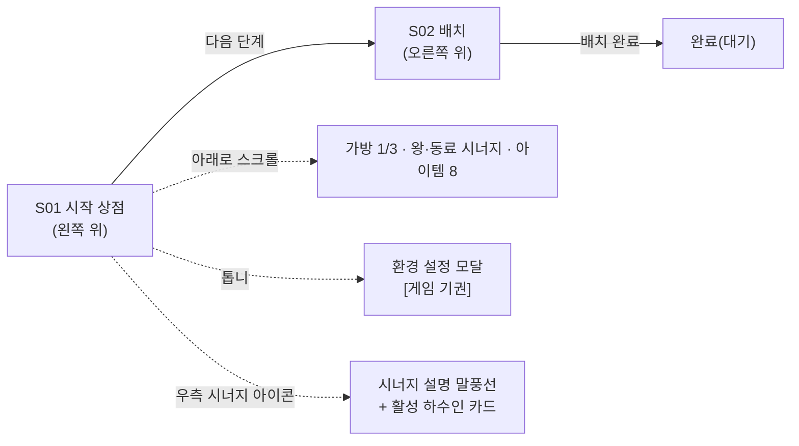
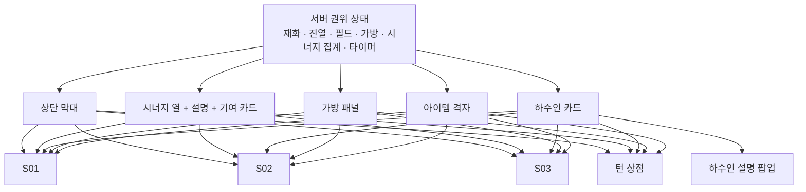
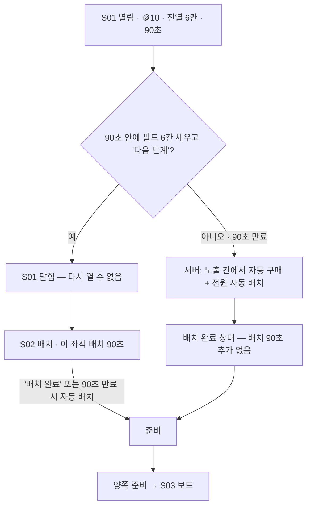
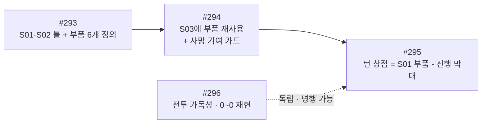

# v0.4.13 #293~#296 구조 시안 분석 — 시작 상점 → 배치 → 완료

- 작성: Venus(Plan · Claude `claude-opus-5-5` high) · 2026-10-01 · dispatch `ctx_551cacb7e5a9` / task `task_92158dcdcf0e`
- 입력 분류: **[결정]** 2026-10-01 CJ의 v0.4.13 이슈 재정리 · 옛 #296 마녀 상향 폐지 · **[피드백]** CJ 시작 흐름 원본 스케치 2장 · **[질문 아님]** "객관적이고 냉철하게 분석 후 보고"
- **CJ 원문: 확보 · 직접 읽음** — `references/CJ_COMMENT.md`(2026-10-01, 후속 dispatch `ctx_3f27e4cf7560`에서 읽음). 첫 작성(`ctx_551cacb7e5a9`) 때는 원문이 없어 "PD 전달 요지 · 원문 미확보"로 적었고, 이 판은 그 표기를 원문 근거로 정정했습니다. 원문에 없는 연결(옛 #293 → #294, 옛 #297 → #296, 옛 #295 이력 보존)은 **Mercury의 행정 연결**로 따로 분류합니다(4.1).
- **최신 상태(2026-10-01 후속 · dispatch `ctx_46004fba4863`)**: CJ가 **#293 전체 흐름 PASS + 문서 갱신 뒤 구현 착수**를 지시했습니다(`references/CJ_COMMENT.md` 둘째 Comment). #293의 현재 기준은 **11장**과 [`implementation-contract.md`](implementation-contract.md)이며, 아래 1~10장 가운데 #293 부분(6.1 Acceptance 초안 · 7장 D1 · D2 · D5 · D6)은 11장으로 대체됩니다. #294 · #295 · #296 부분은 여전히 분석 단계입니다. **제품 QA PASS는 아닙니다.**
- 문서 상태(첫 작성 당시): **구조 시안 · 분석**입니다. **기획 확정이 아니고, QA PASS도 아닙니다.** 제품 구현은 시작하지 않았습니다. 첫 작성 때는 Notion을 읽기만 했고, 후속 dispatch에서 **CJ 원문 결정만** GDD-13 · 23 · 24에 작게 덧붙였습니다(증거: [`decision-sync.md`](decision-sync.md)). 아래 7장의 권고는 Notion에 확정으로 적지 않았습니다.
- 기준 WorkTree: `issue-293-start-flow-concept` · 브랜치 `ChangjoSung/issue-293-start-flow-concept` · 기준 `origin/milestone/v0.4.13` `4f638a12dbab5e85b5b3b8d1d50ab17d029ea5b3`(dispatch 기재값 · Worker Git 명령 미사용)

---

## 0. 두 문장 요약

CJ는 경기 시작 직전 구간을 **"상점 → 배치 → 완료" 세 칸짜리 진행 막대가 있는 두 화면**(S01 시작 상점, S02 배치)으로 다시 그렸고, 가방 말은 **"교체할 필드 하수인 선택" 모달**로 필드와 바꾸게 했습니다. 규칙(90초 · 🪙10 · 필드 6 · 자동 구매 등)은 **현재 GDD-23 그대로 두고 화면 구조만 바꾸는 안건**이며, 같은 화면 부품(상단 막대 · 우측 시너지 열 · 하수인 카드 · 가방 · 설명 팝업)을 #294 · #295가 이어 쓰므로 **#293에서 부품을 한 번 정의하고 나머지가 재사용**하는 순서가 가장 적게 다시 만듭니다.

## 1. 이 문서를 읽는 법 — 네 가지 표지

기획 문서에서 가장 위험한 일은 **추측이 결정처럼 굳는 것**입니다. 그래서 모든 문장에 아래 표지 중 하나를 붙였습니다. 계약서에서 "합의된 조항"과 "검토 메모"를 다른 색으로 쓰는 것과 같습니다.

| 표지 | 뜻 | 누가 바꿀 수 있나 |
|---|---|---|
| **[승인 결정]** | CJ가 정한 것. 이번 문서에서는 2026-10-01 CJ Comment 원문(`references/CJ_COMMENT.md`)과 GDD에 이미 "CJ 확정"으로 적힌 것 | CJ만 |
| **[PD 행정 연결]** | CJ 원문에 없고 Mercury가 이슈 재편을 집행하려고 정한 연결(옛 요구의 이관 · 이력 보존) | Mercury(GitHub) · CJ |
| **[현재 규칙]** | GDD-23 · GDD-24 · GDD-13에 이미 있는 규칙. 이번 안건이 **유지**해야 하는 기준 | CJ 결정으로만 |
| **[추론]** | Venus가 스케치 · 문서에서 읽어 낸 해석. 틀릴 수 있음 | CJ 확인 필요 |
| **[미결정]** | 규칙이 없거나 문서끼리 어긋나 정하지 않은 것. 구현 전에 CJ 답이 필요 | CJ |

---

## 2. 무엇을 읽었나 — 실제 호출 증거

| 원본 | 실제 호출 · 방법 | 확인한 내용 |
|---|---|---|
| **CJ Comment 원문** `references/CJ_COMMENT.md` (후속 dispatch에서 추가) | 파일 직접 읽기(무수정) | 1. v0.4.13 Issue 재정리(#293~#296) · 2. 옛 #296 마녀 상향 폐지 · 다음 Milestone 밸런싱 · "전체적인 UI/UX 개선 방향" · 말미의 Mercury 운영 해석 문단(원문과 구분 표기됨) |
| CJ 원본 `references/cj-start-flow.png` (2428×3264) | Read로 직접 시각 판독 + PIL로 5구역 확대 판독(스크래치패드, 원본 무수정) | 3장 전체 판독 |
| CJ 원본 `references/cj-replacement-modal.png` | Read로 직접 시각 판독 | 3장 교체 모달 |
| GDD-23 `3dc1e7f1708580329da6fe4986654f7b` "⚙️ Digit Duel — v0.4.11 기획" | 로컬 Notion MCP `notion-fetch` 1회 · `page_last_edited_at` 2026-09-29T23:46:37.737Z · 문서 상태 "승인" | 1 · 2.1~2.4 · 5.1~5.3 · 5.6 · 7.3~7.9 · 8.2 |
| GDD-24 `3dc1e7f1708581a48421fcec63d3cdf8` "🧭 Digit Duel — v0.4.11 UI/UX" | 로컬 Notion MCP `notion-fetch` 1회 · 2026-09-29T23:47:12.196Z | 상단 그림 미반영 목록 · 00.1 · 00.2 ①② · 00.10-3 · 01절 S01~S05 · 02절 M01~M07 |
| GDD-13 `3cd1e7f17085817f8c35fa8548116f38` "🎮 Digit Duel — v0.4.10 규칙 이력" | 로컬 Notion MCP `notion-fetch` 1회 · 2026-09-29T23:47:48.021Z | 3장(보드 7열×13행 · 말 14개) · 7장 예고 · 9장 #295 행들 |
| GitHub #293~#297 현재 본문 | `gh issue view` 읽기 전용(수정 · 댓글 없음) | 옛 제목 · 완료 조건 · #295 CLOSED · PR #303 |
| 현행 코드 `demo/js/core.js` 1546~1571 · `server/authoritative/test/test-issue263-timers.js` 160~174 (후속 · Mercury 지시) | 파일 읽기만(실행 · 수정 없음) | S01 직접 완료 = 그 좌석만 배치 90초 · 시간 초과 = 즉시 자동 배치 · 준비(7장 D2) |
| 저장소 `main` 원본의 `CLAUDE.md` · `docs/creat2ve/WORKER_MODELS.md` · `HANDOVER_SNAPSHOT.md` | 파일 읽기(원본 checkout 무수정) | 역할 계약(Venus = PLAN · mutation docs) · #293~#297 대기 상태 |
| `~/.claude/skills/eli-adult/SKILL.md` | 파일 읽기 | 서술 방식 적용 |

- 첫 작성 때 Notion 쓰기는 하지 않았습니다. 후속 dispatch의 Notion 쓰기 · 재조회 증거는 [`decision-sync.md`](decision-sync.md)에 따로 둡니다. Google Drive/Calendar/Gmail/Docs 호출 · Git 명령 · 추가 Worker 기동은 **하지 않았습니다.**
- 같은 폴더에 Earth가 만든 `Earth/flow-overview.svg` · `Earth/replacement-detail.svg`가 생겼습니다. Venus 소유가 아니므로 **열거나 고치지 않았습니다.**
- 세 GDD 본문에서 이슈 번호 참조를 세면 **`#295`가 GDD-13 47회 · GDD-23 39회 · GDD-24 23회**이고, #293 · #294 · #296 · #297은 0회입니다(4.2의 번호 재사용 위험 근거).

---

## 3. CJ 스케치 판독

### 3.1 첫 장 `cj-start-flow.png` — 무엇이 그려져 있나

| 스케치 요소 | 판독 | 표지 |
|---|---|---|
| 상단 막대 | "창조 VS 꾸레" · 시계 120 · 코인(왼쪽 10, 오른쪽 4) · 톱니 | 판독 |
| 진행 막대 | ① 상점 — ② 배치 — ③ 완료. 양쪽 플레이어 아바타가 **각자 현재 단계** 위에 올라감(왼쪽 화면은 둘 다 ①, 오른쪽 화면은 창조 ②·꾸레 ③) | 판독 |
| 오른쪽 위 붉은 버튼 | S01 "다음 단계" · S02 "배치 완료" | 판독 |
| 하수인 구매 | 6행. 첫 행 "방패버섯 · SOLD OUT", 나머지 5행 🪙1. 제목 옆 새로 고침 "↻ 🪙1" | 판독 — **6행은 현재 규칙(6칸 고정)과 일치** |
| 필드 1/6 | 2×3 카드. "심해 사냥꾼" 카드에 [판매] | 판독 — S01 필드 판매(#285)와 일치 |
| 우측 좁은 열 | 시너지 아이콘 → ⚡4 → 아키타입 아이콘들(3 · 1 · 0 …) | 판독(작은 아이콘 일부 판독 불확실) |
| 시너지 설명 말풍선 | "각 시너지를 누르면 옆에 설명이 뜨도록 합니다." ⚡번개왕국 "(2) 감전 15% 확률 · 대상은 다음 1라운드 후턴(판독 불확실)", 빨간 테두리 "(4)" 빈 칸, 아래 기여 하수인 카드 3칸 | 판독 — (2) 15% · 1라운드 후턴은 GDD-23 5.2 ⚡(2)와 일치 |
| 말풍선 곁 메모 | **"번개왕국 활성화 하수인 표시 (턴상점에서는 죽은 하수인도 표시)"** | 판독 — 옛 #293 요구의 원형 |
| 스크롤 아래 ① 가방 1/3 | "파괴 골렘" 카드에 [교체] · [판매] | 판독 — "파괴 골렘"은 현행 30종에 없음(고대 골렘은 있음) → **예시 이름**으로 읽음 [추론] |
| 스크롤 아래 ② 왕·동료 시너지 | 행 3개(왕 · 동료 · 동료) × 속성 아이콘 5개, ⚡열 강조. 제목 옆 "티켓 ×3" | 판독 — 왕·동료 속성 무료 선택(현재 규칙)으로 읽음 [추론] |
| 스크롤 아래 ③ 아이템 | HP 회복(×1) · 쿨타임 회복 · 디버프 해제 · 상대 하수인 포획(×1) · 왕·동료 시너지 교체 · 최대 데미지(🪙3) · 배틀 3라운드 제한(🪙3) · 도망가기 확률 업(🪙3) + 빗금 빈칸 | 판독 — 8칸 = **아이템 5 + 전투 버프 3**(회복약 · 쿨링수 · 해독제 · 몬스터 볼 · 교체 티켓 · 힘 · 시간 · 도망의 수호자)으로 대응 [추론]. ×1 두 개는 시작 보급 회복약 1 · 볼 1(#285)과 일치 |
| S02 배치 | 격자 7열 × 약 6행, 아래 "필드 하수인 목록" 4×3 = 12칸(폭탄 모양 3 · 함정 2 · HP 110 하수인 · 빈칸 · 체크 표시 3), [무작위 배치] · [전체 회수] | 판독 |
| 톱니 → 환경 설정 | 모달에 [게임 기권] 하나 | 판독 |

### 3.2 둘째 장 `cj-replacement-modal.png`

[교체] 버튼 → **"교체할 필드 하수인 선택"** 모달(오른쪽 위 X), 안에 카드 6칸(2×3). 필드 6칸과 같은 배열로 읽습니다 [추론].

### 3.3 스케치의 숫자는 예시다 — 규칙과 구별

GDD-24 상단 callout은 **"화면 모습은 CJ 스케치가 기준, 스케치 속 숫자는 최신 규칙으로 바꿔 읽는다"**(00.10-12)고 정해 두었습니다 [현재 규칙]. 그래서 아래 값은 규칙으로 옮기지 않습니다.

| 스케치 값 | 규칙 값 [현재 규칙] | 판단 |
|---|---|---|
| 시계 **120** | S01 **90초** · 배치 **90초**(GDD-23 2.2 · 2.4) | 예시. 90초 유지 |
| 코인 **10 → 4** | 🪙10 시작, 6명을 🪙1씩 사면 🪙4 남음(GDD-23 2.2) | 규칙과 **같은 결과를 보여 주는 예시**. 새 규칙 아님 |
| 배치 트레이 **12칸** | 말 **14개** = 하수인 6 · 폭탄 3 · 동료 2 · 함정 2 · 왕 1(GDD-13 3장) | 예시. 14개 유지 |
| 격자 **7×약 6** | 보드 **7열 × 13행**, 자기 진영 3행에 배치(GDD-13 3장) | 개념도. 규격 불변(GDD-24 '읽는 방법') |
| 티켓 **×3** | 시작 시 티켓 0개(#285) | 예시 보유 수 |
| 아이템 **최대 데미지 · 배틀 3라운드 제한 · 도망 확률** 🪙3 | 전투 버프 3종 모두 🪙1(GDD-23 7.3) | 가격은 예시. 🪙1 유지 |
| 카드 왼쪽 위 **빨간 별** | 신규 구매 레드닷은 **삭제됨**(#238) | 등급 ⭐ 표시로 읽음 [추론]. 레드닷 부활 아님 |

---

## 4. 네 이슈의 경계

### 4.1 재정리 결과 — CJ 원문과 PD 행정 연결을 나눠 읽기

**[승인 결정] CJ 원문(2026-10-01 · `references/CJ_COMMENT.md`)이 직접 정한 것**

| 번호 | CJ 원문의 새 범위(요지 · 괄호는 원문 표현) | 옛 GitHub 제목(현재 본문) |
|---|---|---|
| **#293** | "시작 상점 → 배치 → 완료" Flow UI/UX 개선 — 시작 상점 · 배치 후 완료 · 교체 UI/UX("교체는 가독성이 좋게 기존 텍스트 형식에서 변경될 예정"). CJ 스케치 2장 첨부. Earth는 "#122 전체 시안"처럼 구조만 잡은 시안을 만들고 CJ가 스케치와 비교해 이해 여부를 확인 | 사망 하수인 시너지 유지와 기여 하수인 표시 |
| **#294** | **"메인 화면"** Flow UI/UX 개선 — (Right Side) 시너지 추가 · (Top Bar) 개선 · (Bottom Bar) 가방 팝업 개선 · 하수인 설명 추가 | 상점 교체 · 판매 · 하수인 설명 UI 재구성 |
| **#295(턴 상점 · 2026-10-01 신규 범위)** | "턴 상점" Flow — "시작 상점과 비슷한 UI/UX로 개선" | 게임 룸 로비 · 결과 화면 핑과 끊김 처리 — **CLOSED · PR #303 · CJ 최종 QA PASS** |
| **#296** | "배틀" Flow — **전체적인 배틀 UI/UX 개선** · 전투 기술 가독성 · 피해 0~0 표시 오류 해결 | 전설 마녀 상향 기획 |
| (옛 #296) | **전설 마녀 상향 기획 폐지** · 다음 Milestone에서 밸런싱을 한 번에 · v0.4.13은 전체 UI/UX 개선 방향 | — |

**[PD 행정 연결] CJ 원문에 없고 Mercury가 재편을 집행하려고 정한 것** — CJ가 새 범위를 정한 것은 원문이지만, 아래 **개별 요구의 이관**은 CJ가 명시하지 않았습니다. CJ가 달리 말하면 바뀔 수 있습니다.

| 연결 | 내용 |
|---|---|
| 옛 #293 → #294 | 옛 #293 요구(시너지 설명 아래 기여 하수인 명단 · 사망 하수인 표시 · 사망 뒤 기여 유지)를 #294가 승계 |
| 옛 #297 → #296 | 옛 #297 본문(기술 가독성 · 0~0 조사 범위)을 #296으로 이관, #297은 중복. 단 "기술 가독성 · 0~0"이라는 **범위 자체는 CJ 원문 #296에 있음** |
| 옛 #295 보존 | 옛 #295(방 핑 · PR #303 · 2026-09-30 완료)의 완료 · QA 이력 보존 |

첫 작성본은 이 표 전체를 "[승인 결정] · PD 전달 요지"로 한데 적었습니다. 원문 확인 뒤 위처럼 나눴습니다. 또 #294를 "메인 **게임** 화면"으로 적었으나 원문 표현은 **"메인 화면"**입니다.

### 4.2 번호 재사용 위험 — Mercury 판단용 [추론]

- **#295가 가장 위험합니다.** 이 번호는 이미 CLOSED이고, 완료 조건 4개가 체크돼 있고, PR #303 · 커밋 `4f638a1 fix: #295 로비·결과 화면 핑…` · GDD 세 문서의 **109곳**(2장 증거 · 첫 작성 시점 기준. 후속 반영으로 구분 꼬리표를 단 새 언급 18곳이 더해짐)이 "#295 = 방 대기 핑 · 방장 승계"를 뜻합니다. 같은 번호를 "턴 상점"으로 다시 쓰면, 앞으로 GDD에서 "#295 행"이 두 가지 뜻이 됩니다 — 같은 주민번호를 두 사람에게 주는 것과 같습니다.
- #293 · #294 · #296은 OPEN이고 GDD 참조가 0이라, 제목 · 본문만 바꿔도 문서 충돌이 없습니다. 다만 옛 본문의 완료 조건(#293의 "사망 기여 양쪽 화면 · 판정 일치")은 #294로 옮겨야 사라지지 않습니다.
- GitHub 반영 방식(재사용 · 새 번호 · 본문 이관)은 **Mercury 소관**이라 Venus는 선택하지 않습니다. 기획 문서에서는 **"#295(턴 상점)" · "#295(방 핑 · PR #303)"처럼 괄호 꼬리표**를 붙이면 재사용하더라도 혼동을 줄일 수 있습니다.

### 4.3 #294 "메인 화면"은 어느 화면인가

CJ 원문은 "메인 화면 구조인 UI/UX를 개선합니다"라고만 쓰고 화면 ID를 적지 않았습니다. 원문의 부품(Right Side 시너지 · Top Bar · Bottom Bar 가방 팝업 · 하수인 설명)으로 아래와 같이 추론합니다.

| 후보 | 근거 | 판단 |
|---|---|---|
| **S03 보드(경기 중 말판 화면)** | 요구 부품이 **시너지 · 가방 · 하수인 설명** — 모두 경기 안 정보. 스케치의 우측 시너지 열 · 상단 막대가 S01 · S02와 같은 틀. 옛 #293 요구("말판 하수인 중심으로만 보이는 시너지")도 경기 중 화면 불만 | **유력 [추론]** |
| L01 계정형 로비 | GDD-24의 "메인 로비"는 L01. 그러나 로비에는 시너지 · 가방이 없고, 로비 상점은 잠금(00.2 ①) | 가능성 낮음 [추론] |

→ **CJ 확인 1개 필요**(6장 D0). 확인 전까지 #294는 S03 기준으로 읽습니다.

---

## 5. 공통 요소와 공유 구조의 최소 범위

### 5.1 어느 화면에 무엇이 반복되나

| 부품 | #293 S01 | #293 S02 | #294 S03 | #295 턴 상점 | #296 전투 |
|---|---|---|---|---|---|
| 상단 막대(양측 이름 · 시계 · 🪙 · 톱니) | ● | ● | ● | ● | (기존 전투 HUD) |
| 진행 막대(상점 · 배치 · 완료) | ● | ● | — | **없음** | — |
| 우측 시너지 열 + 설명 말풍선 | ● 미리보기 | ● [추론] | ● | ● | 칩(5.6) |
| 기여 하수인 카드(사망 표시 포함) | 사망 없음 | — | ● | ● | — |
| 하수인 카드(상태 · 버튼 자리) | ● | ●(트레이) | ● | ● | — |
| 가방 패널 1/3 | ● | — | ● 팝업 | ● | — |
| 교체 모달 | ● | — | — | ● | — |
| 아이템 8칸 격자 | ● 구매 | — | ● 보유 수만 | ● 구매 | — |
| 하수인 설명 팝업(스킬) | ● [추론] | — | ● | ● | 기술 설명(#296) |

### 5.2 최소 공유 구조 — "부품 여섯 개, 조립은 화면마다"

- **만들 것 [추론]**: 위 여섯 부품만. 각 화면은 부품을 **골라 배치**합니다. 레이아웃 엔진 · 화면 설정 파일 같은 일반화 층은 **만들지 않습니다**(쓰는 곳이 네 화면뿐이라 YAGNI).
- **지켜야 할 경계 [현재 규칙]**
  - 시너지 수치 · 단계는 **UI가 새로 계산하지 않습니다**(GDD-24 00.2 S04 · 00.10-6). 서버/Core 집계를 그대로 보입니다.
  - 모든 부품은 **소유자 화면 전용 정보**입니다(GDD-23 7.9). 상대 가방 · 시너지 집계 · 등급은 나오지 않습니다.
  - 모든 거래 · 교체는 서버 권위 · 요청 ID · 전부 적용 또는 전부 거부(GDD-23 2.4).
  - 단절 중에는 모든 입력 잠금 · 게임 타이머 정지(GDD-23 2.4).
- **기술 결정은 구현 부서 몫**: 기여 카드 목록을 서버가 내려줄지 Core 공용 함수로 뽑을지는 Mars/Jupiter가 정합니다. 기획 조건은 "판정과 같은 결과"뿐입니다.

---

## 6. 이슈별 분석과 Acceptance 초안

> Acceptance는 **초안**입니다. CJ 승인 전에는 완료 조건이 아닙니다.

### 6.1 #293 — 시작 상점 → 배치 → 완료 · 교체 모달

**[현재 규칙] 유지 기준 — 이번 시안이 바꾸면 안 되는 것**

- S01: 🪙10 · 90초 · 필드 6 · 왕 1 · 동료 2 · 가방 3 · 아이템 5 + 버프 3 = 8종 실구매 · 진열 6칸 고정 · SOLD OUT · 수동 새로 고침 🪙1 · 6명 몫 예비 🪙 · 필드 판매(막힘 방지 조건 포함) · 왕·동료 속성 무료 선택(미선택 = 최다 왕국, 동률 = 서버 난수 1회 공유)(GDD-23 2.2 · 7.3 · 7.6).
- **수동 완료 = 상점 재개방 금지, 그 뒤 배치 90초**(GDD-23 2.2 · 2.3).
- **상점 시간 초과 = 자동 구매 + 자동 배치, 그 뒤 배치 90초 추가 없음**(GDD-23 2.2 · 2.4).
- S02: 보드 7×13 · 트레이 14개 · 배치 90초 · 준비 · 준비 취소는 멈춘 자리부터(GDD-13 3장 · GDD-23 2.4).
- 모든 시계는 서버 시각 · 단절 중 정지 · 재연결 유예 60초 · S01/배치 중 유예 만료 = 경기 취소(GDD-23 2.4).
- S01 도중 스스로 나가기 = 즉시 경기 취소 · 기록 없음(GDD-24 00.10-3, CJ 확정 2026-09-28).

**[추론] 스케치가 새로 요구하는 화면 구조**

1. S01 · S02 두 화면이 **같은 틀**(상단 막대 + 진행 막대 + 우측 시너지 열 + 오른쪽 위 붉은 진행 버튼)을 씁니다.
2. S01은 **한 장의 세로 스크롤**: 하수인 구매 → 필드 → 가방 → 왕·동료 속성 → 아이템.
3. 가방 카드 [교체] → **"교체할 필드 하수인 선택" 모달** → 필드 카드 하나 선택 → 1:1 교체 · X는 아무것도 바꾸지 않고 닫기.
4. S02는 보드 + 트레이 + [무작위 배치] · [전체 회수] + [배치 완료].
5. 톱니 → 환경 설정 모달의 [게임 기권].

**Acceptance 초안**

- [ ] S01 · S02가 스케치 구도(상단 막대 · 3단 진행 막대 · 우측 시너지 열 · 붉은 진행 버튼)로 보이고, 숫자는 3.3의 규칙 값(90초 · 🪙10 · 14개 · 7×13)으로 표시된다.
- [ ] S01의 '다음 단계'는 필드 6칸 전까지 비활성이고, 누르면 S01을 다시 열 수 없으며 그 좌석의 배치 90초가 서버 시각으로 시작된다.
- [ ] S01 90초 만료 시 자동 구매 · 자동 배치 후 **배치 90초가 걸리지 않는다.**
- [ ] 교체 모달은 교체 가능한 필드 카드만 고를 수 있고, X · 바깥 닫기는 상태를 바꾸지 않으며, 한 번의 선택이 한 번의 서버 교체 요청이다(연타 잠금).
- [ ] 우측 시너지 열과 설명 말풍선은 S01 미리보기 규칙(GDD-23 2.2: 필드 배정 하수인 + 직접 고른 왕·동료만)과 같은 값을 보인다.
- [ ] 아이템 8칸은 #285 규칙(아이콘 = 설명 · 별도 [구매] · 보유 ×n · 6명 몫 예비로 막히면 이유 표시)을 지킨다.
- [ ] 단절 중 모든 버튼 · 모달이 잠기고 시계가 멈췄다가 남은 시간부터 이어진다.
- [ ] 휴대폰 세로 화면에서 버튼 44px 이상, 키보드 · 터치로 모달 대상이 분명하다.

**[미결정]** → 7장 D1 · D2 · D5 · D6.

### 6.2 #294 — 메인 화면(S03 [추론])

**[승인 결정]** CJ 원문: "메인 화면" 구조 UI/UX 개선 — Right Side 시너지 추가 · Top Bar 개선 · Bottom Bar 가방 팝업 개선 · 하수인 설명 추가.

**[PD 행정 연결]** 옛 #293 요구 승계: 시너지 설명 아래 **기여 하수인 명단**, 사망 하수인도 사망 상태로 표시, 사망 뒤에도 기여 유지(옛 #293 본문). CJ 원문이 이 이관을 명시하지는 않았습니다. 다만 CJ 스케치 메모 "턴 상점에서는 죽은 하수인도 표시"(3.1)는 같은 방향의 CJ 자료입니다.

**[현재 규칙] 계산은 이미 정해져 있다 — 새로 정하지 않는다**(GDD-23 5.1 · 5.6)

- 왕국: 필드 9칸(하수인 6 · 왕 1 · 동료 2)을 속성별로 셈. **사망 · 포획당한 칸은 사망 당시 속성으로 동결해 계속 셈.** 전설 칸은 왕국 0.
- 아키타입: 필드 하수인 6칸 + **가방의 전설만** 자기 아키타입 +1. 왕·동료는 세지 않음.
- **가방의 일반 하수인은 어느 시너지에도 기여하지 않음.** 옛 #293 본문은 "가방 기여 여부는 미확정"이라 했지만, GDD-23 5.1 · 5.6에 이미 규칙이 있으므로 **새 결정이 필요 없습니다** — 표시가 이 규칙을 따르기만 하면 됩니다.
- 왕·동료 시너지: 사망한 동료 수 0~2.
- 정기 상점 현황 = 지금 보드의 실제 집계(GDD-23 8.2).

**[추론] 화면 구조**: 상단 막대 · 우측 시너지 열(S01과 같은 부품) · 시너지 말풍선 아래 기여 카드(생존 / 사망 / 포획당함 구분) · 하단 가방 팝업 · 하수인 카드 탭 → 하수인 설명 팝업(보유 스킬). 말판 높이 맞춤(#286)을 해치지 않도록 우측 열 폭을 먼저 확보해야 합니다.

**Acceptance 초안**

- [ ] 시너지 설명 아래 기여 하수인 이름 · 상태가 보이고, 사망 하수인이 한눈에 구분된다.
- [ ] 사망 뒤에도 기여가 유지되고, 표시 값이 다음 전투 스냅샷 판정과 같다(UI 재계산 금지).
- [ ] 가방 일반 하수인은 기여 명단에 없고, 가방 전설은 아키타입에만 나타난다(표시 범위는 D4 답에 따름).
- [ ] 상대 시너지 · 가방 · 등급은 나오지 않는다(7.9).
- [ ] 하수인 설명 팝업이 보유 스킬을 보이고, 행동 버튼과 겹쳐 오조작되지 않는다.
- [ ] S03 말판은 #286 높이 맞춤(칸 44px 목표 · 최소 32px)을 유지한다.

**[미결정]** → D0 · D3 · D4.

### 6.3 #295 — 턴 상점(20 · 40 · 60 · 80턴)

**[현재 규칙] 유지 기준**(GDD-23 2.1 · 2.3 · 7.4~7.8 · GDD-24 S05 = M01)

- 20 · 40 · 60 · 80턴 행동 · 전투 · 연출이 끝난 뒤 열림, 직전 턴 보너스 🪙2/3/4/5, 승패가 났으면 열지 않음.
- 90초 · 양측 동시 · 만료 = **확정 거래만 보존하고 닫음**(S01의 자동 구매 · 자동 배치를 확장하지 않음).
- 닫히면 **곧바로 S03 보드로 복귀**. 교체 · 판매는 이 상점이 열린 동안만: 교체 = 살아 있는 필드 하수인 ↔ 가방 말 1:1, 판매 = **가방 말만**.
- 6명 의무 · 예비 🪙 · 자동 새로 고침 없음.

**[승인 결정]** CJ 원문: "턴 상점" Flow를 "시작 상점과 비슷한 UI/UX로 개선". → S01 부품 재사용 방향은 CJ 원문이 뒷받침합니다. "비슷한"이 어디까지인지는 원문에 없습니다.

**[추론] 가장 중요한 경계**: 턴 상점은 S01 화면 부품을 재사용하되, **"상점 → 배치 → 완료" 진행 막대와 배치 단계를 이식하지 않습니다.** 정기 상점 도중 말을 다시 배치하는 규칙은 없고(보드 위치는 교체된 칸 그대로), 배치 단계를 넣으면 보드 일시 정지 규칙과 버닝 타임 턴 계산을 새로 정해야 합니다.

**[추론] 스케치 근거**: "턴 상점에서는 죽은 하수인도 표시" → 턴 상점의 시너지 기여 카드에 사망 하수인이 보여야 함. #294와 같은 부품.

**Acceptance 초안**

- [ ] 20 · 40 · 60 · 80턴에만 열리고, 닫히면 배치 없이 S03으로 돌아간다.
- [ ] 90초 만료 시 확정 거래만 남고 자동 구매 · 자동 배치가 없다.
- [ ] 교체 모달 대상은 살아 있는 필드 하수인뿐(사망 칸 · 왕 · 동료 · 빈칸 제외), 판매는 가방 말만 가능하다.
- [ ] 시너지 열 · 기여 카드가 사망 · 포획 동결 칸을 포함한 실제 집계를 보인다.
- [ ] #295(방 핑 · PR #303)의 확정 동작이 바뀌지 않는다.

**[미결정]** → D1(교체 모달 대상) · D4.

### 6.4 #296 — 배틀 · 기술 가독성 · 피해 0~0

**[승인 결정]** CJ 원문: "배틀" Flow — **전체적인 배틀 UI/UX 개선** · 전투 기술 가독성 · 피해 0~0 표시 오류 해결. 옛 #296 전설 마녀 상향 기획은 폐지, 밸런싱은 다음 Milestone에서 한 번에(범위 · 번호 미정). 첫 작성본은 범위를 "기술 가독성 · 0~0"으로만 좁혀 적었으나, 원문은 **배틀 UI/UX 전체**입니다.

**[PD 행정 연결]** 옛 #297 본문(조사 범위 · 완료 조건)을 #296으로 이관하고 #297은 중복 처리.

**[현재 규칙]** 피해 계산 순서 · 반올림(결과 > 0이면 최소 1 — GDD-23 5.6) · 공격 ±20% 변동(GDD-13 4장) · 전투 명령 60초 · 시너지 칩(5.6).

**원인은 분석하지 않았습니다.** 이번 dispatch 범위가 아니고, 코드 · 재현 없이 원인을 적으면 추측이 결론이 됩니다. 향후 검증이 가를 경계만 적습니다.

| 가를 질문 | 왜 필요한가 |
|---|---|
| 0~0이 **표시 계산만**의 문제인가, **실제 판정**도 0인가 | 규칙 문제인지 화면 문제인지가 여기서 갈림 |
| 어떤 기술 · 상태에서 나오나(피해 없는 기술 · 방어막 · 회복 · 상태 기술 등) | "피해 없음" 기술을 0~0으로 적는 표기 문제일 가능성과, 수치 버그를 구분 |
| 같은 입력에서 서버 판정 값과 화면 값이 같은가 | 서버 권위 원칙과의 일치 확인 |

**Acceptance 초안**: 기술 목록 · 상세가 휴대폰에서 읽히고 선택 상태가 분명하다 · 0~0의 재현 조건과 원인이 기록되고 수정 뒤 화면 값과 판정 값이 같다 · 확정 피해 규칙은 근거 없이 바꾸지 않는다 · 마녀 수치는 건드리지 않는다.

---

## 7. 최소 결정 항목 — CJ 답이 필요한 것만

규칙이 이미 있는 것은 넣지 않았습니다. 각 항목은 **구현을 막는 것**만 남겼습니다.

| ID | 질문 | 왜 막히나 | 선택지 (Venus 권고 — 확정 아님) |
|---|---|---|---|
| **D0** | #294 "메인 화면" = S03 보드인가? | 화면이 다르면 부품 · 범위가 전부 달라짐 | (A) S03 보드 · (B) L01 로비 — **권고 A**(4.3 근거) |
| **D1** | **교체 선택 적격성** — ① S01에서도 가방↔필드 교체를 허용하나? ② S01 필드 판매로 빈칸이 생겼을 때 가방 말을 그 **빈칸으로 옮기기**가 되나? | ① GDD-23 7.5는 "상점이 열려 있는 동안"이라 S01 포함으로 읽히지만 2.2가 명시하지 않음 ② 7.5는 **살아 있는 하수인 ↔ 가방 1:1**만 정의 — 빈칸 이동은 규칙에 없음 [미결정] | ① 허용(7.5 그대로) · ② (A) 불가, 빈칸은 구매로만 채움 / (B) 허용 — **권고 ① 허용 · ② A**(새 규칙 없이 끝남) |
| **D2** | **완료 대기** — ① S01에서 '다음 단계'를 누르면 **즉시 내 배치(S02)로 가나, 상대 상점이 끝날 때까지 기다리나?** ② 진행 막대에 **상대의 현재 단계**를 보여 주나? | ① GDD-23 안에서 서로 어긋남: 2.2 흐름도 = "이 좌석에만 배치 90초 시작"(즉시), 2.3 = "둘 다 완료하거나 90초가 지나면 함께 닫힘 · 완료한 쪽은 대기", 2.4 = "배치 90초는 **양쪽** 시작 상점이 닫힌 순간 시작". 스케치는 두 사람이 서로 다른 단계(창조 ② · 꾸레 ③)에 있는 모습 ② 상대 진행 단계는 7.9 공개 목록에 없는 새 공개 정보(구성은 드러나지 않음) | ① **현행 동작 읽기 증거(후속 추가 · 코드 읽기만, 테스트 실행 안 함)**: `demo/js/core.js` 1546~1571의 #263 주석 · 분기 = 직접 완료(`shopDone`) 좌석은 **그 좌석만** 배치 90초를 받고, 시간 초과(`shopTimeout`) 좌석은 즉시 `autoPlace` · 준비라 배치 90초가 없음. `server/authoritative/test/test-issue263-timers.js` 160~174의 기존 단언 = "직접 완료 → 그 좌석만 배치 90초 시작" · 상대가 아직 S01이면 경기는 SETUP 유지. 즉 **현행은 좌석별 즉시 배치**입니다. 새 화면이 이 현행 동작을 유지하면 **CJ에게 새 선택 질문을 할 필요는 없고**, 남는 것은 GDD-23 2.3 · 2.4 문장과 현행 동작의 **문서 정합성 확인 필요**입니다. 이 읽기는 새 CJ 결정이 아니며, Venus는 GDD 2.3 · 2.4 본문을 고치지 않았습니다(미해결 유지) ② **CJ 원본 스케치가 진행 막대 위 양쪽 아바타를 명시**(3.1) — CJ 자료이므로 선택 질문에서 뺍니다. 7.9 "소유자 화면에만" 목록과의 문구 정합성만 확인 필요 |
| **D3** | **S03 가방 팝업**이 할 수 있는 일 | 7.5상 교체 · 판매는 상점이 열린 동안만. 스케치에 없는 행동을 만들면 새 규칙 | (A) 보기 전용(하수인 · 아이템 보유 ×n · 하수인 설명) — **권고 A**(새 규칙 없음) |
| **D4** | **죽음 카드 표시 범위** — ① 포획당한 칸을 사망과 다른 라벨로 보이나? ② 왕국 기여 명단에 왕 · 동료도 넣나? ③ 가방 전설을 아키타입 기여 명단에 보이나? | 계산 규칙은 5.6에 있음. 정할 것은 **보이는 방식**뿐. 스케치 말풍선에는 하수인 카드만 그려짐 | ①② ③ 모두 "집계에 들어가는 칸은 전부 보인다"가 판정 일치에 가장 가까움 — **권고: 셋 다 보임 · 포획은 '포획됨' 라벨** |
| **D5** | 톱니 → **[게임 기권]** 문구 | S01 · S02(SETUP)에서 스스로 나가기는 **경기 취소 · 기록 없음**(00.10-3). "기권"은 몰수패로 읽힘 | (A) S01·S02에서는 "경기 나가기(취소)"로 표기, S03부터 "기권" / (B) 스케치 문구 유지 — **권고 A**(규칙 불변 · 오해 방지) |
| D6 (비차단) | S01에서 산 시너지 교체 티켓을 바로 쓰나 | 이미 GDD-23 7.8의 "나중 질문 · 비차단". 스케치의 '티켓 ×3'이 다시 떠올리게 함 | 기존 권고 A(정기 상점부터) 유지 — 이번 시안을 막지 않음 |

---

## 8. 권장 순서

1. **#293 먼저** — 부품 여섯 개를 여기서 정의합니다. S01은 사망이 없어 가장 단순한 조건에서 부품을 굳힐 수 있습니다.
2. **#294** — 사망 기여 카드(옛 #293 요구)를 이 이슈가 소유하므로, 그 부품을 여기서 완성합니다.
3. **#295** — S01 상점 화면 + #294 기여 카드를 조립하고 진행 막대 · 배치를 뺍니다. 새로 만들 부품이 거의 없습니다.
4. **#296** — 화면 · 부품이 겹치지 않아 **병행 가능**합니다. 다만 0~0 원인 확인(재현)을 UX 개편보다 먼저 두는 것이 안전합니다 — 규칙 문제로 밝혀지면 UX 설계가 바뀝니다.

D0 · D1은 #293 착수 전에, D3 · D4는 #294 착수 전에 답이 필요합니다. D2는 현행 동작(좌석별 즉시 배치)과 CJ 스케치(양쪽 아바타)를 그대로 따르면 새 CJ 질문이 아니라 **GDD 문서 정합성 확인** 항목입니다(7장 D2).

---

## 9. GDD 반영 — 확정된 CJ 결정만

> **반영 완료(2026-10-01 후속 dispatch `ctx_3f27e4cf7560`)**: CJ 원문을 확보한 뒤 GDD-13 9장에 새 행 1개, GDD-23 · GDD-24 끝에 '2026-10-01 v0.4.13 UI/UX 재편 — 분석·시안 검토 단계' 절을 덧붙였습니다. 실제 문구 · 재조회 · 보존 증거는 [`decision-sync.md`](decision-sync.md)입니다. 반영본은 CJ 원문 결정과 PD 행정 연결을 나눠 적었고, #295는 "#295(턴 상점 · 2026-10-01 신규 범위)" · "#295(방 핑 · PR #303 · 2026-09-30 완료)"로 구분했습니다. 7장의 D0~D6 권고와 GDD-23 2.2 · 2.3 · 2.4 해석은 넣지 않았습니다.
>
> 아래 두 제안은 **첫 작성(`ctx_551cacb7e5a9`) 당시 원문 확보 전의 문구**로, 이력으로만 남깁니다. 옛 #293 승계 등 PD 행정 연결을 CJ 결정과 한데 적은 점, #294를 "메인 게임 화면"으로 적은 점, GDD-24 상단 callout 줄은 실제로 반영하지 않은 점이 반영본과 다릅니다.

**(이력) GDD-13 9장 Decision Log — 첫 작성 당시 새 행 제안**

| 날짜 | 지시 | 결정 | 비고 |
|---|---|---|---|
| 2026-10-01 v0.4.13 재배정 | CJ 지시(PD 전달 요지 · 원문 미확보) — v0.4.13 이슈 범위 재배정 | #293 = 시작 상점 → 배치 → 완료 흐름과 교체 모달 시안 · #294 = 메인 게임 화면(우측 시너지 · 상단 · 하단 가방 팝업 · 하수인 설명)이며 옛 #293의 '사망 하수인 시너지 기여 표시' 요구를 승계 · #295 = 턴 상점(옛 #295 방 핑 · PR #303 CJ QA PASS 이력은 보존) · #296 = 배틀 · 기술 가독성 · 피해 0~0 표시(옛 #297에서 이관) · 옛 #296 전설 마녀 상향은 폐지하고 밸런싱은 다음 마일스톤. | 규칙 · 수치 변경 없음. 화면 구조는 시안 단계이며 기획 확정 전. 현행 v0.4.10 규칙(1~7장)은 바뀌지 않음 |

**(이력 · 미반영) GDD-24 상단 callout — 첫 작성 당시 한 줄 추가 제안**

> 2026-10-01 CJ 시작 흐름 스케치(상점 → 배치 → 완료 · 교체 모달) 접수 — v0.4.13 #293 시안 단계입니다. 이 스케치의 숫자(120초 · 트레이 12칸 등)도 00.10-12에 따라 최신 규칙으로 바꿔 읽습니다.

(D0~D5에 CJ 답이 오면 그 결정만 GDD-23 2.2 · 2.3 · 2.4 · 7.5 · 8.2와 GDD-24 01 · 02절에 동시 반영합니다.)

---

## 10. 하지 않은 것 · 남은 것

- 하지 않음: 제품 · 도구 · 테스트 코드 수정, Notion 쓰기, Git · GitHub 쓰기, 추가 Worker 기동, #296 0~0 원인 분석, 마녀 수치 검토.
- 이 문서는 **QA PASS도 기획 확정도 아닙니다.** 4.1의 CJ 결정은 원문(`references/CJ_COMMENT.md`)으로 확인했고, PD 행정 연결은 CJ 명시 결정이 아님을 따로 표기했습니다.
- 후속 dispatch에서 한 것: CJ 원문 결정만 GDD-13 · 23 · 24에 덧붙임(기존 제목 · 문서 상태 · Status · 규칙 · #295 QA PASS · PR #303 증거 불변, Edit Date만 2026-10-01로). 증거는 [`decision-sync.md`](decision-sync.md).
- 남은 것(11장 반영 뒤): #294 착수 전 D0 · D3 · D4 · #293의 R1(상대 단계 구분 공개) · R2(Earth 토큰) · GitHub 처리(Mercury). D1 · D2 · D5 · D6은 현행 동작 유지로 닫았습니다(11.3).

---

## 11. 2026-10-01 CJ #293 흐름 PASS 뒤 추가 분석

입력 분류: **[결정]** 전체 흐름 PASS · 문서 갱신 뒤 구현 착수 · **[피드백]** (1) 카드 정보 · 필드 판매 · 가방 한 줄 (2) 등급 테두리 · 시너지 단계 색 (3) 불필요한 글 제거 · 두 줄 → 한 줄. 읽은 것: CJ 원문 둘째 Comment · CJ 원본 2장 재판독 · Earth 시안 보고 · 현행 `demo/js/ui.js`(989~1065 배치 화면, 1369~1396 시너지 설명, 1847~2043 상점 · 교체) · `demo/js/core.js`(1359~1580 경제, 2207~2307 시너지) · `demo/js/data.js`(등급 · 시너지 경계) · `server/authoritative/room.js`(1660~1700 좌석 뷰, 1833~1863 경제 · 상점 뷰, 2010~2041 자기 말) · `demo/css/game.css` 상점 부분. **읽기만 했고 실행 · 수정은 없습니다.**

### 11.1 CJ가 승인한 것과 승인하지 않은 것

| 구분 | 내용 |
|---|---|
| 승인 [승인 결정] | 흐름 구조: 상점 → 배치 → 완료 3단계 · 교체 모달 · 문서 갱신 뒤 **#293 구현 착수** |
| 승인 아님 [승인 결정] | 시안의 **카드 모양 그대로 만들기**("시안은 이해를 돕는 것일 뿐"). 두 줄로 바뀐 배치(상단 시계/코인 · 가방 교체/판매) |
| 새 요구 [승인 결정] | 모든 하수인 카드에 등급 · 왕국 · 아키타입 · HP / 필드 [판매] / 가방 [교체][판매] 한 줄 / 등급별 테두리 / 시너지 단계별 색 / 불필요한 글 최소화 / 웬만하면 CJ 스케치대로 |
| 범위 밖 | 최종 CJ 플레이 QA · 병합 · 출시 · #294~#296 착수(Mercury 접수 분류) |

### 11.2 냉정한 대조 — 요구와 현행 코드의 거리

| CJ 요구 | 현행 | 거리 · 위험 |
|---|---|---|
| 카드에 등급 · 왕국 · 아키타입 · HP | 진열 카드: ★ · 그림 · 이름 · 속성/아키타입 아이콘(**HP 없음**). 필드 · 가방 카드: 그림 · ★ · 이름 · HP(**왕국 · 아키타입 없음**). 교체: **글자 버튼 목록**. 트레이: 말 그림만 | 데이터는 전부 이미 있음(자기 말은 `grade · element · rosterId · hp/maxHp`를 받음). **새 데이터 · 서버 변경 불필요.** 카드가 자리마다 따로 조립돼 있어 한 부품으로 모으는 것이 실제 작업 |
| 필드 판매 "추가" | **S01 필드 판매는 이미 있음**(#285 · `shopSell pieceId`). 시안이 일부 카드에만 그렸을 뿐 | 새 규칙 아님. 현행 자격(S01만 · 살아 있는 칸) · 교착 거부 유지. "턴 상점 필드에도 판매"로 넓히면 **새 규칙**이라 하지 않음 |
| 가방 교체 · 판매 한 줄 | CSS는 이미 가로 배치(`.slotGrid.bag .acts{flex-direction:row}`). 두 줄은 Earth 시안의 것 | 버튼 글자(`판매 +🪙n`)가 길어 좁은 칸에서 넘칠 수 있음 → 글자를 `판매`로 줄이고 환급액은 확인 창에 |
| 등급 테두리 | 등급 값 1~4 + 전설 5는 있으나 **테두리 색 구분은 없음**(★만) | S01은 전부 ⭐1이라 **이 화면에서는 색이 모두 같음** — 결함이 아니라 규칙의 결과. 효과는 턴 상점 · 보드에서 드러남. 가격 · 원장으로 색을 정하면 승급 차액 구매에서 틀림 |
| 시너지 단계 색 | 칩은 "달성/미달" 2색뿐(`.synChip.on`) | 왕국(2·4·6·9)과 아키타입(2·3·4·5·6, 일부 5단계 상한)의 **경계가 달라** 칸 수로 색을 정하면 틀림. 왕국은 서버가 `stage`를 주고 아키타입은 기존 `synTier`가 계산 — 둘 다 이미 있음 |
| 상단 한 줄 | 시계 · 코인이 상점 시트 머리줄에, 이름 · 상대 상태가 별도 줄에 흩어져 있음 | 재배치 작업. 시계는 "내게 걸린 시계 하나"만 있으면 됨 |
| 양쪽 단계 표식 | 서버가 공개하는 상대 값은 **준비 여부(`seats.ready`)뿐**. 상대의 상점 완료는 일부러 숨김(좌석 뷰 주석 · GDD-23 7.9) | **유일하게 스케치와 현행이 어긋나는 곳.** 상대 ① · ② 구분은 새 공개 정보 + 서버 변경. 기본값은 현행 공개 범위 유지(계약 3.2), 구분 여부는 R1 |
| 교체 6카드 | `shopSwap`은 살아 있는 내 필드 하수인 ↔ 가방 1:1만 받음(사망 · 빈칸 · 왕 · 동료 거부). S01도 같은 경로 | 창만 바꾸면 됨. 같은 함수가 턴 상점에도 쓰여 **턴 상점 교체 창도 함께 바뀜** — 사망 칸 비활성이 필요한 이유 |
| 글 줄이기 | S01에 안내 문장 4~5개 | 지우면 안 되는 것: 거부 사유 · 확인 창 · 단절 잠금 · 접근성 이름. 안내 문장은 `srOnly`/tooltip으로 이동 |
| 보드 · 트레이 | 7×13 · `fitBoard`(#286) · 트레이는 **미배치 말만** 나열 | 스케치는 14칸 고정 + 배치된 칸 ✓. 우측 시너지 열이 보드 폭을 줄이므로 칸 최소 32px(#286) 확인 필요 |

**가장 큰 실사용 위험 두 가지**: ① 390px 폭에서 우측 열(44px 이상) + 6행 진열 + 한 줄 상단이 모두 들어가는지 — Earth 치수 계약이 먼저 필요합니다. ② 상점 카드 함수가 S01과 턴 상점 공용이라, #293 변경이 턴 상점 화면에 번집니다 — 카드 · 교체 창까지만 허용하고 턴 상점의 모달 · 흐름은 건드리지 않습니다(계약 6장).

### 11.3 옛 결정 항목 정리 — 현행 동작 유지로 닫음 (새 CJ 질문 아님)

| 옛 ID | 닫는 근거 [현재 규칙 · 코드 읽기] | 결론 |
|---|---|---|
| D1 ① S01 교체 | `shopSwap`에 시작 상점 제한 없음(`core.js` 1525~1535 · `start`면 로스터 동기화까지 함) | S01에서도 교체 가능 — 유지 |
| D1 ② 빈칸 이동 | 같은 줄이 빈칸(`!ecoKey`)을 "교체할 수 없는 칸"으로 거부 | 불가 — 유지. 빈칸은 구매로만 채움 |
| D2 ① 완료 뒤 | `shopDone` = 그 좌석만 배치 90초 · `shopTimeout` = 자동 구매 + 자동 배치 + 준비(`core.js` 1546~1571 · 서버 `_onClock`) | 좌석별 즉시 배치 — 유지. GDD-23 2.3 · 2.4의 "함께 닫힘 · 양쪽 닫힌 순간" 문장보다 **2.2 · #263 확정 동작이 기준**임을 Notion 새 절에 한 줄로 명시(본문 미수정) |
| D2 ② 상대 단계 | 서버가 주는 값은 `seats.ready`뿐 | 준비 여부만 표시 — R1로 축소 |
| D5 나가기 문구 | 현행 표기 `방 나가기` + "바로 취소 · 전적 없음" 확인 창(`ui.js` 1066~1067 · CJ 2026-09-28) | 현행 표기 유지. 스케치의 "게임 기권"은 자리(톱니 → 메뉴)만 따름 |
| D6 티켓 | 시작 상점에서 `shopTicket` 거부("티켓은 정기 상점에서만 씁니다") | S01은 구매 · 보유 표시만 — 유지 |

D0 · D3 · D4는 #294 화면의 문제라 #293을 막지 않습니다.

### 11.4 남은 실제 결정

- **R1** 상대 표식의 ① · ② 구분 공개 여부(서버 필드 1개 + GDD-23 7.9 한 줄). 기본값 = 공개 추가 없음.
- **R2** Earth 색 · 치수 토큰(`Earth/UI_CONTRACT.md`). Venus는 색 값을 정하지 않습니다.

구현 가능한 계약과 Acceptance 13개는 [`implementation-contract.md`](implementation-contract.md)에 있습니다.
