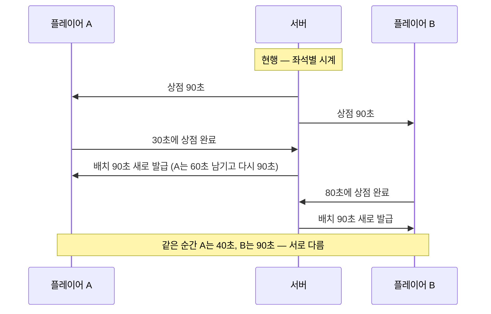

# #293 CJ QA REVISE(2026-10-01) 분석 — 준비 구간 7항목

- 작성: Venus(Plan · Claude `claude-opus-5-5` high) · 2026-10-01 · dispatch `ctx_fe2cc805738d` / task `task_27ec37330097`
- 입력 분류: **[결정]** 준비 180초 고정 · 판매 허용 · 확인 창 삭제 · % 삭제 · 등급 배경색 · 시너지 표시 추가 / **[피드백]** 준비 현황 UI · 말 얼굴 표시 누락(이미지 6장) / **[질문]** 시작 상점의 "티켓 불필요"를 어떻게 보여 줄지
- 원문: [`references/CJ_QA_REVISE_20261001.md`](../references/CJ_QA_REVISE_20261001.md) + 원본 `cj-qa-revise-01.jpg` · `02`~`06.png`(직접 판독)
- 이전 판: 종전 분석(#293~#296 구조 시안 · 흐름 PASS 뒤 11장)은 Git 이력 `469b279`에 있습니다. 이 판은 **치환**입니다. #294~#296에 대한 종전 분석(D0 · D3 · D4)은 그 이력을 기준으로 하며 이번 범위가 아닙니다.
- 구현 계약: [`implementation-contract.md`](implementation-contract.md) · 상태: **분석 + 계약이며 제품 QA PASS가 아닙니다.** 코드 실행 · 테스트 · 브라우저 0회.

표지: **[확정]** CJ 원문 · 이미지 또는 Mercury가 전달한 확정 해석 / **[추론]** Venus의 읽기 / **[미확정]** CJ 답 대기(현재 0건).

## 1. 두 문장 요약

CJ가 직접 플레이해 보니 **경기 전 준비 구간**에서 두 플레이어의 남은 시간이 서로 달랐고, 방금 산 하수인을 팔 수 없었으며, 말에 붙어야 할 정보(왕국 · 아키타입 · 실제 HP · 등급)가 빠지거나 %로 가려져 있었습니다. 일곱 항목 모두 원인 위치가 코드에서 확인됐고, 새 수치나 새 효과 없이 고칠 수 있습니다. 작성 중 남았던 질문 하나(U1)는 CJ 추가 결정(17:58 KST)으로 닫혔습니다.

## 2. 왜 생긴 문제인가 — 시계가 두 개였다

**서버 권위**란 "시간과 판정은 서버가 정하고 화면은 받아서 보여 주기만 한다"는 원칙입니다. 지금도 시계는 서버에 있지만, **좌석마다 따로** 있고 단계가 바뀔 때 **새로 감깁니다.**

근거 [확정 · 코드 읽기]: `server/authoritative/room.js` 1345~1358이 좌석별 키 `shop:0` → `place`를 주고, 1449~1450이 키가 바뀌면 전체 시간으로 다시 세웁니다. 준비 완료 중에는 멈춥니다(1357). 상수는 `demo/js/data.js` 62~63(90 + 90)입니다. 오프라인도 같은 구조입니다(`demo/js/ui.js` 1736~1746 · 2066~2084).

CJ 결정 [확정]: **벽시계 하나.** 180초, 양쪽 동일, 다시 감지 않음. 축구의 전광판 시계처럼 선수 교체나 항의가 있어도 경기 시계는 하나로 흐릅니다.

## 3. 일곱 항목 — 원인과 고치는 방식

| # | CJ 지시 | 원인(파일 · 줄) | 고치는 방식 | 담당 |
|---|---|---|---|---|
| 1 | 서버 시간 동기화 · 180초 고정 | 위 2장 | 방 단위 `prep` 시계 1개 · 마감 시각 공유 · 재발급 없음 | Jupiter(서버) + Mars(상수 · 표시 · 오프라인) |
| 2 | 양쪽 준비 현황 UI | 서버가 상대의 준비 여부만 공개(`room.js` 1678~1690) → 상대 표식이 옆 상자로 빠짐(`ui.js` 2037~2045) · 대기 문구가 하단에 그려짐 | `seats.step` 공개 → 양쪽 표식을 막대에 · 옆 상자와 하단 영역 삭제 · 중앙 팝업 | Jupiter + Mars |
| 3 | 구매 후 판매 불가 | 진열 칸 수 가드(`core.js` 1515): 6칸 다 사면 열린 칸 0 → 모든 필드 판매 거부. 서버는 이를 일반 거부 토스트로 전달(이미지 3) | 그 가드 절반만 삭제 · 예비 코인 가드 유지 | Mars(Core) — 만료 보충(U1 결정)과 한 납품 |
| 4 | 시작 상점 티켓 표시 | 배지가 보유 수 > 0일 때만 나오고 "정기 상점에서 사용"만 안내(`ui.js` 1945) | 항상 티켓 아이콘 + `무료` | Mars |
| 5 | 판매 확인 창 삭제 | `ui.js` 2108(필드) · 2113(가방)의 확인 창 | 바로 요청 | Mars |
| 6 | 말 표시 규칙 | ① 왕 · 동료 속성을 보드에 안 그림(`ui.js` 1677 · 1701~1706) ② 땅 하수인 기호 누락(`data.js` 86~87) ③ 보드에 아키타입을 그리는 경로 없음 ④ 미선택 왕 · 동료를 상점 완료 뒤에도 집계에서 뺌(`core.js` 2305 · `ui.js` 1400) ⑤ % 가림(`room.js` 2060 · 1815, `engine.js` 173~187, `ui.js` 1700~1709) ⑥ 등급 = ★ | 공용 얼굴 부품 1개 · 서버는 실제 HP + 등급 전송 · 등급 = 배경색 | Jupiter + Mars |
| 7 | 시너지 표시 추가 | 칩 목록이 왕국 5 + 아키타입 6뿐(`ui.js` 2015~2030). 왕관 칩은 정기 상점에만(2023). 전설 개인 효과는 Core에 있으나 칩이 없음(`core.js` 2281~2283) | 같은 목록에 전설 칩(조건부) + 왕관 칩 추가 | Mars |

4 · 5 · 7은 서버 데이터 변경이 없습니다 [확정 · 정적 분석 2건 일치].

## 4. 이미지 판독 [확정 — 직접 봄]

| 이미지 | 보이는 것 | 읽은 뜻 |
|---|---|---|
| 01 | 진행 막대 왼쪽 상대 상자에 X · `01 상점` 위 P1 옆에 P2를 손으로 그림 | 상대 표식도 막대 위 해당 단계로. 옆 상자 삭제 |
| 02 | 보드 중앙에 "준비 완료 / 상대 기다리는 중…" 손글씨 상자 · 하단 "공개 방 #1 / 상대의 준비를 기다리는 중 / 내 준비 · 상대" 영역에 X · 우상단 `준비 취소` 버튼은 그대로 | 하단 영역을 지우고 중앙 팝업으로. 취소는 우상단 버튼 |
| 03 | 진열 6칸 전부 SOLD OUT · 필드 6/6 · [판매] 누르자 "지금은 할 수 없는 행동입니다." | 3장 3번 원인과 일치 |
| 04 | "왕·동료 속성" 제목 줄 오른쪽에 티켓 모양 + X | 그 자리에 티켓 표시, "필요 없음"을 알릴 것 |
| 05 | 배치 보드의 하수인은 `85`만 · 트레이의 왕 · 동료는 `100`만(속성 없음) · 트레이 하수인에는 ★ | 왕국 · 아키타입 누락, ★ 삭제 대상 |
| 06 | 손그림: 칸 왼쪽 위 물방울, 오른쪽 위 작은 표시, 가운데 말, 아래 ♥100, 노란 배경 | 왼쪽 위 왕국 · 오른쪽 위 아키타입 · 아래 HP · 배경 = 등급 색 |

## 5. 한 가지 예 — 준비 구간을 처음부터 끝까지

A와 B가 방에 들어와 S01이 열립니다. 서버가 마감 시각을 "지금 + 180초"로 한 번 정합니다.

1. 40초: A가 6칸을 사고 [다음 단계]. A 표식은 `02 배치`로, B 화면에서도 A가 `02`에 보입니다(B의 구매 내용은 여전히 A에게 안 보임). 시계는 양쪽 모두 140.
2. 70초: A가 방금 산 하수인 하나를 팔고 싶어도 이미 상점을 닫았으므로 불가 — 판매는 S01 안에서만입니다(현행). B는 아직 S01이라 방금 산 하수인을 **확인 창 없이** 팔 수 있습니다.
3. 100초: A가 배치를 끝내고 [배치 완료]. 중앙에 "준비 완료" 팝업. 시계는 80에서 계속 줄어듭니다. A가 우상단 [준비 취소]를 누르면 팝업이 닫히고 다시 배치 — **시계는 그대로**입니다.
4. 180초: B가 아직 상점이면 서버가 B의 남은 칸을 자동 구매(진열이 모자랄 때만 B의 예비 코인으로 새로 고침 1회 뒤 무작위 구매) · 자동 배치하고, A가 미준비면 남은 말을 자동 배치한 뒤 경기를 시작합니다.

## 6. 흔한 오해

| 오해 | 실제 |
|---|---|
| "180초 = 상점 90 + 배치 90의 합" | 아닙니다. 구간이 나뉘지 않은 **하나의 180초**입니다. 상점에 150초를 쓰면 배치는 30초입니다 |
| "상대 단계를 보여 주면 상대 정보가 샌다" | 공개되는 것은 `상점/배치/완료` 셋 중 하나뿐입니다. 무엇을 샀는지 · 코인 · 가방은 계속 비공개입니다 |
| "왕 · 동료에도 아키타입을 붙인다" | 왕 · 동료에는 아키타입이 **없습니다.** 오른쪽 위에는 역할(왕 / 공격 동료 / 방어 동료) 기호가 오고 아키타입 시너지에는 세지 않습니다 |
| "가방의 전설도 개인 시너지 칩이 뜬다" | 현행 규칙에 가방에서 켜지는 개인 효과가 없어 **지금은 0개**입니다. 가방 전설의 기여(아키타입 +1)는 이미 아키타입 칩에 들어 있습니다 |
| "% 삭제 = 상대 말이 전부 공개" | `?`(정체 미공개) 말은 그대로 아무것도 안 보입니다. 정체가 공개된 말만 실제 HP와 등급이 보입니다 |
| "판매 가드를 없애면 코인을 다 쓸 수 있다" | 예비 코인 가드는 남습니다. 빈칸을 다시 채울 코인은 계속 묶입니다 |

## 7. 남은 결정과 한계

**[확정] U1 — 만료 때 빈칸이 남고 진열이 모자란 경우 (CJ 추가 결정 2026-10-01 17:58 KST).** 3번을 고치면 "필드 빈칸 있음 + 살 수 있는 칸 부족"으로 180초가 끝날 수 있고, 현행 만료는 노출된 칸만 사므로 채우지 못해 서버가 방을 닫습니다(`core.js` 1553~1559 · `room.js` 1502). CJ는 **예비 코인으로 새로 고침 1회 뒤 무작위 구매 · 배치**를 선택했습니다. 남은 진열로 채울 수 있으면 기존 경로 그대로이고, 무료로 하수인을 만들어 주는 규칙은 승인되지 않았습니다. 예비 코인 규칙이 새로 고침 1회 값을 이미 묶어 두므로 [확정 · `core.js` 1425~1428] 새 수치가 필요 없습니다. 3번과 이 보충은 한 납품입니다.

**확정 해석으로 닫힌 것** [확정 — Mercury 전달]: 준비 시계는 단절 중에도 흐름(입력 잠금 유지 · 다른 시계 불변) · 전송 키 `prep` + `deadline`/`serverNow` · `seats.step` 공개 · 공개된 상대 말의 실제 HP + 등급(보드 · 결과 · 회복 로그) · 왕 · 동료는 역할 기호 · 티켓 `무료` · 전설 칩 조건 · 판매는 진열 칸 수 가드만 삭제 · 핫시트는 두 사람이 180초 하나.

**따라 나오는 결과** [추론 — 새 규칙 아님]: ① 핫시트에서 첫 사람이 오래 쓰면 둘째 사람의 시간이 줄어듭니다. ② 단절 중 180초가 끝나면 서버가 자동 마무리해 경기를 시작하고, 이후 경기 시계는 기존대로 단절 동안 멈춥니다. ③ 등급이 공개되므로 "상대 등급 비공개"를 전제로 한 GDD-23 7.9 · 8.1 ⑦ 문장이 바뀝니다.

**한계**: 이 분석은 코드 읽기와 이미지 판독뿐입니다. 테스트 후보 파일 목록은 정적 분석 인용이라 실제 단언 위치는 구현 때 확인해야 합니다.

## 8. 문서 반영 위치

| 대상 | 반영 | 상태 |
|---|---|---|
| 로컬 `Venus/implementation-contract.md` | 7항목 계약 · AC 13개 · 담당 분할 · 테스트 대체 목록 | 치환 완료 |
| 로컬 `Venus/analysis.md` | 이 문서 | 치환 완료 |
| GDD-13 `3cd1e7f17085817f8c35fa8548116f38` | 9장 Decision Log 끝에 '2026-10-01 #293 CJ QA REVISE' 행 1개 + 문서 끝 운영 이력 1줄 | 반영 · 재조회 확인 |
| GDD-23 `3dc1e7f1708580329da6fe4986654f7b` | 2.2(제목 아래 안내 callout) · 2.3(첫 문단) · 2.4('준비 180초' 항목 + '배치 90초' 대체 표기) · 7.6(판매 허용 · 확인 창 삭제) · 7.9(공개 범위 새 첫 항목) · 8.1 ⑦(대체 표기) · 문서 끝 절 | 반영 · 재조회 확인 |
| GDD-24 `3dc1e7f1708581a48421fcec63d3cdf8` | 00.7(HP % 삭제 · 등급 공개 항목) · 01 표 S02 행 · Y01 행(대체 표기) · 01 '시간' 줄 · 문서 끝 절(준비 화면 · 말 얼굴 · 시너지 칩 표) | 반영 · 재조회 확인 |

**Notion 쓰기 증거** (기존 로컬 Notion MCP 연결만 사용 · 새 페이지 · 계정 · 댓글 없음 · Google 호출 없음)

| 페이지 | 쓰기 전 마지막 수정(UTC) | 호출 | 쓰기 뒤 마지막 수정(UTC) | 본문 변화 |
|---|---|---|---|---|
| GDD-13 | 2026-10-01T00:04:14.765Z | `update_content` 1 · `insert_content` 1 | 2026-10-01T09:06:13.124Z | 삽입 2곳 +1,742자 · 삭제 0 |
| GDD-23 | 2026-10-01T00:03:53.792Z | `update_content` 1(6곳) · `insert_content` 1 | 2026-10-01T09:05:51.788Z | 삽입 7곳 약 +4,270자 · 기존 문장 삭제 0 |
| GDD-24 | 2026-10-01T00:04:12.459Z | `update_content` 1(4곳) · `insert_content` 1 | 2026-10-01T09:06:11.356Z | 삽입 5곳 +3,099자 · 삭제 0 |

- 검증 방법: 쓰기 전후 `notion-fetch` 본문을 서명 URL만 정규화해 줄 단위로 대조했습니다(스크래치패드 · 저장소 밖). 모든 `update_content`의 새 문자열은 옛 문자열 전체를 그대로 포함합니다(덧붙이기만). GDD-23의 정확한 글자 수는 2.4 항목이 한 줄 안 두 곳 삽입이라 대조 도구가 한 덩어리로 세어 "약 4,270자"로만 적습니다.
- 속성: 세 페이지 모두 Notion 자동 `마지막 수정`만 달라졌습니다. Editor(사람) · Owner · Project · 문서 상태 · Status · Edit Date(이미 2026-10-01)는 건드리지 않았습니다. 재조회 응답에 `truncated` · `unknown_block` 표시는 없습니다.
- 보존 확인: `98a26a1` 언급 수 2 → 2 / 1 → 1 / 2 → 2, "최종 플레이 QA PASS" 3 → 3 / 6 → 6 / 4 → 4(GDD-13 / 23 / 24). 늘어난 "PR #303"은 새 행 · 새 절의 "기록은 바뀌지 않음" 문구입니다.
- 의도적으로 하지 않은 것: GDD-23 2.2의 흐름도 · 표 안의 옛 "90초" 문장들을 하나씩 고치지 않고, 절 머리의 안내로 **대체 사실을 표기**했습니다(큰 블록을 덮어쓰지 않기 위함). 옛 문장은 이력으로 남아 있습니다.
