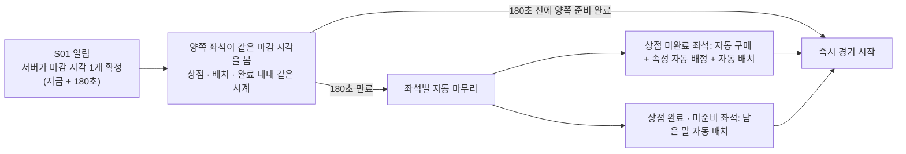
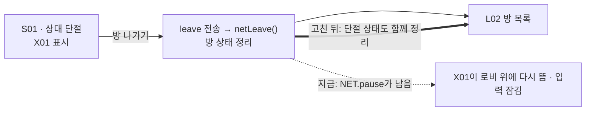

# #293 구현 계약 — CJ QA REVISE(2026-10-01) 7항목

- 작성: Venus(Plan · Claude `claude-opus-5-5` high) · 2026-10-01 · dispatch `ctx_fe2cc805738d` / task `task_27ec37330097`
- **최신 우선(2026-10-02)**: [`references/CJ_QA_REVISE4_20261002.md`](../references/CJ_QA_REVISE4_20261002.md) 추가 4건 + 원본 3장 → **9장**. 9장이 1~8장과 어긋나면 9장이 이깁니다. 9장이 말하지 않은 1~8장(AC 1~13 포함)은 그대로 유효합니다.
- 권위: [`references/CJ_QA_REVISE_20261001.md`](../references/CJ_QA_REVISE_20261001.md) 원문 + 원본 6장. 이 CJ Comment가 **기존 90초+90초 · 판매 확인 창 · HP % · 등급 별 표기 계약보다 우선**합니다.
- 이전 판: 이 파일의 종전 내용(흐름 PASS 계약)은 Git 이력 `469b279`에 그대로 있습니다. 이 판은 **치환**이며, 아래에서 "유지"라고 적지 않은 종전 조항 중 이 문서와 어긋나는 것은 효력이 없습니다.
- 상태: **CJ가 명시한 수정 범위의 구현 계약**입니다. 제품 QA PASS · 병합 · 출시 승인이 아닙니다. 구현은 이 문서 확정 뒤 fresh Mars · Jupiter Worker가 합니다. 미결 항목은 없습니다 — U1은 CJ 추가 결정(2026-10-01 17:58 KST)으로 닫혔습니다(4.3).
- 근거 읽기: 코드는 읽기만 했고 실행 · 테스트 · 브라우저는 0회입니다. 줄 번호는 HEAD `469b279` 기준입니다.

표지: **[CJ]** CJ 원문 · 이미지가 정한 것 / **[확정 해석]** Mercury가 CJ 지시를 구현 가능하게 확정해 전달한 것 / **[현행]** 지금 코드 · GDD 동작 그대로 유지.

## 0. 한 문단 요약

경기 전 준비 구간을 식당 주방에 비유하면, 지금은 요리사 둘이 **각자 손목시계**로 90초씩 두 번 재고 있어 서로 남은 시간이 달랐습니다. CJ는 이것을 **벽에 걸린 시계 하나**(서버 시각 180초, 다시 감지 않음)로 바꾸라고 했습니다. 나머지 여섯 항목은 그 준비 화면의 표시(양쪽 단계 · 준비 팝업 · 티켓 · 말 얼굴 · 시너지)와 판매 동작(막힘 제거 · 확인 창 삭제)입니다. **새 수치 · 새 시너지 효과는 하나도 만들지 않습니다.**

## 1. 준비 시계 — 공통 180초 [CJ 1]

용어: **마감 시각(deadline)** = 서버가 정한 "이 시각에 끝난다"는 절대 시각. **남은 시간**은 화면이 마감 시각에서 계산해 보여 주는 값일 뿐입니다.



| 규칙 | 내용 | 표지 |
|---|---|---|
| 길이 | 준비 시간은 양쪽 모두 **180초 한 번**. 상점 90초 + 배치 90초 구조는 폐지 | [CJ] |
| 기준 | 서버 시각. 마감 시각은 S01이 열릴 때 **방에 하나** 정해지고 양쪽 좌석이 같은 값을 받음 | [CJ] |
| 재발급 없음 | 상점 완료 · 배치 시작 · 준비 · 준비 취소 · 재연결 **어느 것도** 마감 시각을 바꾸지 않음 | [CJ] |
| 준비 중 | 준비 완료해도 시계는 계속 흐름(종전 "준비 동안 정지 · 취소하면 멈춘 자리부터"는 폐지) | [확정 해석] |
| 단절 중 | 준비 시계는 **단절 유예 중에도 서버에서 계속 흐름**. 입력 잠금(단절 중 요청 거부)과 재연결 유예 60초는 그대로 | [확정 해석] |
| 다른 시계 | 정기 상점 90초 · 행동 30초 · 대상 선택 30초 · 전투 행동 60초 · B08 20초와 그 단절 정지 규칙은 **변경 없음** | [현행] |
| 조기 시작 | 180초 전에 양쪽 모두 준비 완료면 시작 | [CJ] · [현행] |
| 만료 | 그 시점의 말 기준으로 무작위 배치하고 시작. 좌석별 처리는 위 그림(기존 `shopTimeout` · 자동 배치 경로 재사용) | [CJ] |
| 만료 때 부족한 말 | 남은 진열로 채울 수 있으면 기존 자동 구매. 진열이 모자랄 때만 **예비 코인으로 새로 고침 1회 뒤 무작위 구매 · 배치**(4.3) | [CJ 17:58] |
| 늦은 입력 | 마감 뒤 도착한 준비 구간 입력은 기존 `E_DEADLINE` 거부 | [현행] |

파생 결과(새 규칙 아님 — 위 규칙에서 따라 나오는 것): 단절 중 180초가 먼저 끝나면 서버가 양쪽을 자동 마무리해 경기를 시작하고, 경기 중 시계는 기존대로 단절 동안 멈춥니다. 유예 60초가 준비 중에 먼저 끝나면 기존대로 경기 취소입니다.

**전송 계약(Jupiter · Mars 공유)** — 준비 구간의 시계 뷰:

```
clock: { key: "prep", leftMs, running: true, deadline, serverNow }
```

- `deadline` · `serverNow`는 서버 epoch ms. **같은 revision에서 양쪽 좌석의 `deadline`이 같아야** 합니다. 화면은 `deadline − (serverNow 기준 보정)`으로 그리며, 자기 기기 시계로 새 180초를 만들지 않습니다.
- 키는 `prep` 하나. 종전 `shop:0`(S01) · `place` 키는 준비 구간에서 쓰지 않습니다. 정기 상점의 `shop:<턴>` 키는 그대로입니다.
- 상수: `ECO.prepSec = 180` 추가. `ECO.shopSec`(정기 상점 90초)는 유지, `ECO.placeSec`은 쓰는 곳이 없어지면 삭제.

**오프라인** [확정 해석]: 핫시트(한 기기 2인)는 **두 사람이 180초 하나를 함께** 씁니다 — 사람마다 180초가 아닙니다. 가림 화면 · 차례 넘김에서도 다시 감거나 멈추지 않고, 만료되면 아직 끝내지 못한 좌석을 위 그림대로 자동 마무리합니다. PVE도 같은 `prep` 180초 하나입니다(AI 좌석은 종전처럼 즉시 완료).

## 2. 준비 현황 UI [CJ 2 · 이미지 1 · 2]

**공개 정보 추가(서버)** — 좌석 뷰 `seats.step: [좌석0, 좌석1]`, 값은 `"shop" | "place" | "done"` 셋뿐.

- 파생 규칙: 시작 상점 미완료 = `shop` / 상점 완료 · 미준비 = `place` / 준비 완료 = `done`.
- 이것으로 종전 R1(상대 단계 구분 공개 여부)은 CJ "Concept Conti 대로"로 **닫힙니다.** 상대의 구매 · 진열 · 코인 · 필드 · 가방 · 시너지 · 등급은 계속 비공개입니다.

| 자리 | 바뀌는 것 |
|---|---|
| 진행 막대 | 내 표식과 **상대 표식을 둘 다 막대 위 해당 단계에** 올림(이미지 1의 P1 · P2). 값은 `seats.step`만 읽음 — 추측 금지 |
| 막대 왼쪽 상대 상자("준비 중") | **삭제**(이미지 1의 X) |
| 하단 대기 영역(방 이름 · "상대의 준비를 기다리는 중" · 내 준비/상대 배지) | **삭제**(이미지 2의 X) |
| 준비 완료 상태 | 보드 **중앙 팝업** — "준비 완료 · 상대 기다리는 중…"(상태 알림 `role="status"`). 팝업은 상단 막대 · 진행 막대를 가리지 않음 |
| 준비 취소 | **우상단 `준비 취소` 버튼**(진행 버튼 자리 · 이미지 2) → 기존 준비 취소 요청 → 팝업이 닫히고 다시 배치 가능. 시계는 그대로 흐름 |
| 상단 시계 | 준비 완료 상태에서도 공통 시계를 계속 표시 |

오프라인(핫시트 · PVE)은 그 기기가 아는 실제 진행 상태로 같은 막대를 그립니다.

## 3. 표시 규칙 — 티켓 · 말 얼굴 · 시너지

### 3.1 왕·동료 속성 제목의 변경 티켓 [CJ 4 · 이미지 4]

- 시작 상점의 "왕·동료 속성" 제목 줄 오른쪽에 **티켓 아이콘 + `무료`를 항상** 표시합니다(보유 수와 무관). 접근성 이름: "시작 상점은 티켓 없이 속성을 바꿀 수 있습니다". [확정 해석 — CJ가 결정을 요청한 항목]
- 정기 상점의 티켓 `×N` 표시 · 사용 조건은 변경 없음. 규칙(S01 무료 변경 · 티켓 사용은 정기 상점)도 변경 없음. [현행]

### 3.2 말 얼굴 — 왕국 · 아키타입 · HP · 등급 [CJ 6 · 이미지 5 · 6]

보드 · 배치 트레이 · 결과 화면이 **같은 얼굴 부품 하나**를 씁니다.

| 자리 | 하수인 | 왕 · 동료 | 폭탄 · 함정 |
|---|---|---|---|
| 왼쪽 위 | 왕국(속성) 아이콘 — 풀 · 땅 포함 **5속성 전부**, 전설은 기존 왕관 | 왕국 아이콘 — **상점 완료 뒤에는 직접 고르지 않았어도 실제 배정된 속성** | 변경 없음 |
| 오른쪽 위 | 아키타입 아이콘 | **역할 기호**(왕 / 공격 동료 / 방어 동료 — 기존 글리프 재사용 · 접근성 이름 "역할 — …") | — |
| 아래 | ♥ + 실제 HP 숫자(**% 없음**) | ♥ + 실제 HP 숫자 | 표시 없음 |
| 배경 | 등급 색(상점의 기존 등급 색 `g1`~`g5` 그대로) · **★ 삭제** | 등급이 없으므로 중립 배경 | 변경 없음 |

- 왕 · 동료에는 **아키타입이 실제로 없습니다.** 오른쪽 위는 아키타입이 아니라 역할 표시이며, 아키타입 시너지 집계 · 스탯에 아무것도 더하지 않습니다(가짜 아키타입 금지).
- 등급은 색만으로 전달하지 않습니다 — 접근성 이름/title에 등급을 남깁니다.
- 상점 완료 전(S01 미리보기)에는 직접 고르지 않은 왕 · 동료에 왕국을 표시하지 않고 시너지에도 세지 않습니다(현행 `pending`). **상점 완료 뒤에는 배정된 속성을 얼굴과 시너지 열 집계 모두에 반영**합니다 — 현재 누락의 원인은 `leaderElChosen=false`인 칸을 상점 완료 뒤에도 거르는 것(`core.js` 2305 · `ui.js` 1400)입니다.
- 상점 카드(구매 · 필드 · 가방 · 교체)의 종전 표기(등급 테두리 + ★ · `현재/최대` HP)는 이번 지시 대상이 아니라 그대로 둡니다. 삭제 대상 ★는 **보드 말 · 배치 트레이 · 결과 화면의 말 얼굴**입니다. 색 · 치수는 Earth [`UI_CONTRACT.md`](../Earth/UI_CONTRACT.md)의 시각 토큰(상점과 같은 등급 팔레트)을 따릅니다.

**상대 말 공개 범위** [CJ 6 + 확정 해석]

| 상대 말 상태 | 보이는 것 |
|---|---|
| 정체 미공개(`?`) | 종전 그대로 아무것도 없음 — 종 · 속성 · HP · 등급 비공개 |
| 정체 공개 | 종 · 속성 · **실제 HP/최대 HP · 등급**(→ 배경색). 보드 · 결과 화면 · 보드 회복 로그 세 곳 모두 실제 값 |
| 상대 동료의 역할 | 종전대로 **공개된 기술로 알 수 있을 때만**(새 필드 없음). 모르면 역할 기호 없음 |

- 종전의 "싸운 적 없는 상대 말은 100 눈금 %" 가림(`room.js` 2060 · 1815, `engine.js` 173~187)과 화면의 `%` 붙이기(`ui.js` 1700~1709 · 결과 화면)를 **삭제**합니다. 양쪽 플레이어 모두 %는 어디에도 없습니다.
- 계속 비공개: 상대 코인 · 경기 중 가방 · 시너지 집계 · 쓰지 않은 기술 · 원장.

### 3.3 시너지 표시 추가 [CJ 7]

대상: 우측 시너지 열과 경기 중 시너지 줄이 쓰는 **같은 칩 목록**(왕국 5 + 아키타입 6 뒤에 덧붙임). 수치 · 효과는 전부 기존 값입니다.

| 칩 | 보이는 조건 | 내용(기존 효과) |
|---|---|---|
| 전설 개인 시너지 | **내가 가진** 전설이고 그 개인 효과가 **지금 실제로 적용될 수 있을 때만.** 그 전에는 칩 자체가 없음 | 용: 달성한 최고 왕국 효과 1개 / 마녀: 필드 속성 종류 × 5%p(최대 25) / 사신: 사망 칸 × 5%(최대 40) |
| 왕·동료 시너지(왕관) | 항상 표시, 죽은 동료 수 0/2는 미달 표시 | 1명 = 동료의 복수 해금 · 2명 = 왕의 분노 해금(정기 상점의 기존 칩과 같은 문구) |

- 전설 개인 효과는 현행 코드에서 **그 전설이 직접 싸울 때만** 적용됩니다(`core.js` 2280~2283). 그래서 "실제로 적용될 수 있음" = **필드에 나가 살아 있는 전설이고 값이 0보다 큼**입니다.
- **가방에만 있는 전설**: CJ는 "가방에 있어도 개인 시너지가 활성화되는 전설은 표시"라고 했지만, 현행 규칙에는 **가방에서 켜지는 개인 효과가 없습니다**(가방 전설은 아키타입 칸 수 +1뿐이고, 그것은 이미 아키타입 칩에 들어 있음). 따라서 가방 전용 칩은 지금 **0개**이며, 없는 효과를 만들어 표시하지 않습니다. 그런 전설이 규칙에 생기면 같은 조건으로 자동 표시됩니다.

## 4. 판매 [CJ 3 · 5 · 이미지 3]

### 4.1 확인 창 삭제 [CJ 5]

필드 판매 · 가방 판매의 확인 창을 삭제하고 누르는 즉시 판매합니다(시작 상점 · 정기 상점 공통 — 같은 함수). 연타 잠금(`once`) · 판매 토스트 · 코인 증가 표시는 그대로. **승급 · 티켓 사용 확인 창은 변경 없음.**

### 4.2 구매 직후 필드 판매 허용 [CJ 3]

원인: 필드 판매 뒤 "빈칸 수 > 살 수 있는 진열 칸 수"면 거부하는 가드(`core.js` 1515 앞 절반). 6칸을 다 사면 진열이 전부 품절이라 **모든 판매가 거부**됩니다.

| 항목 | 처리 |
|---|---|
| 진열 칸 수 가드(`ecoEmptyField > 살 수 있는 칸`) | **삭제 — 이것 하나만** |
| 예비 코인 가드(`ecoReserveOk`) | 유지 — 빈칸을 다시 채울 코인(+필요한 새로 고침 값)은 계속 강제 |
| 원장 100% 환급 · 판매 종 잠금(이번 상점에서 재구매 불가) · 품절 칸 유지 · 판매 HP 비율 기록 | 유지 |
| 거부 문구 | 예비 코인 부족일 때만 기존 문구 계열로 안내 |

### 4.3 만료 때 빈칸이 남고 진열이 모자란 경우 [CJ 추가 결정 2026-10-01 17:58 KST]

4.2 뒤에는 "필드에 빈칸이 있는데 살 수 있는 진열 칸이 모자란" 채 180초가 끝날 수 있습니다. 현행 만료 경로는 노출된 칸만 사므로 그대로 두면 채우지 못하고 서버가 방을 닫습니다(`core.js` 1553~1559 · `room.js` 1502). CJ 결정:

| 만료 순간의 상태 | 처리 |
|---|---|
| 남은 진열로 빈칸을 다 채울 수 있음 | **기존 자동 구매 경로 그대로**(새로 고침 없음 · 비용은 구매가만) |
| 남은 진열로 모자람 | 먼저 남은 진열을 사고, 그래도 빈칸이 있으면 **예비 코인으로 새로 고침 1회**(기존 새로 고침 값) → 새 진열에서 **무작위 구매** → 자동 배치 |

- 비용은 전부 그 좌석의 코인에서 나갑니다. 예비 코인 규칙(`ecoReserveNeed`)이 "빈칸 수 + 필요한 새로 고침 1회 값"을 이미 묶어 두므로 코인이 모자랄 수 없습니다.
- **무료로 하수인을 만들어 주는 규칙은 승인되지 않았습니다.** 새로 고침은 **만료 때 · 모자랄 때만 · 1회**이며, 평소의 자동 새로 고침 폐지(#263)는 그대로입니다. 품절 칸을 다시 여는 방식도 쓰지 않습니다.
- 판매 종 잠금 · 100% 환급 · 판매 HP 비율 기록 · 다른 시계는 그대로입니다.
- 4.2와 4.3은 **한 납품**으로 넣습니다(4.2만 먼저 넣으면 만료 때 방이 닫히는 경로가 열림).

## 5. 담당 분할

| 담당 | 파일 | 일 |
|---|---|---|
| **Mars** (Core · 화면) | `demo/js/data.js` · `core.js` | `ECO.prepSec` · 판매 가드(4.2) + 만료 보충(4.3) · 상점 완료 뒤 왕·동료 집계(3.2) |
| | `demo/js/ui.js` · `network.js` · `demo/css/game.css` | `prep` 시계 표시 · 오프라인 단일 180초(종전 `SHOPCLK` + `place` 대체) · 진행 막대 양쪽 표식 · 중앙 팝업 · 티켓 `무료` · 확인 창 삭제 · 공용 얼굴 부품 · % · ★ 삭제 · 시너지 칩 |
| **Jupiter** (서버) | `server/authoritative/room.js` | 방 단위 `prep` 시계(준비 · 단절로 멈추지 않음 · 만료 시 좌석별 분기) · 시계 뷰 `deadline`/`serverNow` · `seats.step` · 공개 상대 말 실제 HP + 등급(보드 · 결과) |
| | `server/authoritative/engine.js` | 회복 로그 100 눈금 변환 삭제 |
| **Earth** | [`Earth/UI_CONTRACT.md`](../Earth/UI_CONTRACT.md) | 말 얼굴 · 준비 팝업 · 진행 막대 표식 · 칩의 시각 토큰(상점과 같은 등급 팔레트). Mars는 색 · 치수를 지어내지 않고 이 문서를 따름 |

- `core.js` · `data.js`는 서버도 불러 쓰는 Mars 소유 파일입니다. **Mars가 Core를 먼저** 고치고 Jupiter가 그 위에서 서버를 맞춥니다. 전송 계약(1장 시계 뷰 · 2장 `seats.step` · 3.2 공개 범위)은 이 문서가 기준입니다.
- Saturn은 읽기 전용 독립 QA입니다.

## 6. Acceptance Criteria

1. **공통 마감** — S01이 열리면 양쪽 좌석 시계 뷰가 `key:"prep"`이고 `deadline`이 같다. 한쪽의 상점 완료 · 준비 · 준비 취소 · 재연결 전후로 `deadline`이 변하지 않는다.
2. **단절** — 준비 중 한쪽이 끊겨도 `prep` 마감은 그대로다. 그 동안 준비 구간 입력은 거부되고, 재연결 유예 60초 · 다른 단계 시계의 단절 정지는 종전과 같다.
3. **조기 시작 · 만료** — 양쪽 준비 완료면 180초 전에 시작한다. 만료 시 상점 미완료 좌석은 자동 구매 · 속성 배정 · 자동 배치, 상점 완료 좌석은 남은 말 자동 배치 뒤 시작한다. 준비 구간에 새 90초가 걸리는 경로가 없다.
4. **오프라인** — 핫시트는 두 사람이 180초 하나를 쓰고(차례 넘김에 재발급 · 정지 없음), PVE도 `prep` 하나다.
5. **단계 공개** — 좌석 뷰 `seats.step` 값이 `shop/place/done`뿐이고 정의대로 파생된다. 준비 구간 좌석 뷰에 상대의 구매 · 진열 · 코인 · 필드 · 가방 · 시너지가 새로 나가지 않는다.
6. **준비 UI** — 진행 막대에 양쪽 표식이 `seats.step` 위치로 보인다. 왼쪽 상대 상자와 하단 대기 영역이 없다. 준비 완료 시 중앙 팝업이 뜨고 우상단 `준비 취소`로 닫히며 다시 배치할 수 있다.
7. **티켓** — 시작 상점 제목 줄에 티켓 아이콘 + `무료`가 보유 수와 무관하게 있고 접근성 이름이 있다. 정기 상점 `×N`은 그대로다.
8. **확인 창** — 필드 · 가방 판매가 확인 창 없이 요청 1회로 끝난다. 승급 · 티켓 확인 창은 남아 있다.
9. **판매 허용 · 만료 보충** — 6칸을 모두 산 직후 필드 하수인 판매가 성공하고 코인이 원장만큼 늘며 그 종은 이번 상점에서 다시 살 수 없다. 예비 코인이 모자라면 거부된다. 그 상태로 만료되면 그 좌석 코인에서 새로 고침 1회 값 + 구매가가 빠지고 필드 6칸이 차서 경기가 시작된다(방이 닫히지 않음). 남은 진열로 채울 수 있는 만료에서는 새로 고침이 0회다.
10. **말 얼굴** — 보드 · 트레이 · 결과의 하수인에 왕국 · 아키타입 · 실제 HP · 등급 배경이 있고 ★ · %가 없다. 땅 · 풀 하수인도 왕국 아이콘이 나온다. 왕 · 동료는 왕국 + 역할 기호 + HP이며 아키타입 집계가 늘지 않는다. 상점 완료 뒤 미선택 왕 · 동료도 배정 속성이 얼굴과 시너지 열에 나온다.
11. **상대 공개 범위** — 정체 공개된 상대 말은 보드 · 결과 · 회복 로그에서 실제 HP와 등급이 같은 값으로 나온다. `?` 말에는 종 · 속성 · HP · 등급이 없다.
12. **시너지 칩** — 전설 칩은 필드에 살아 있는 내 전설이고 값 > 0일 때만 있고, 가방에만 있으면 없다. 왕관 칩은 죽은 동료 0 · 1 · 2에 맞게 표시된다. 칩 수치가 Core 값과 같다.
13. **불변** — 정기 상점 90초 · 행동 30초 · 전투 60초 · B08 20초, 🪙 예비 규칙, 교체, 티켓 규칙, 턴 상점 흐름의 기존 규칙 단언이 기대값 수정 없이 통과한다.

## 7. 테스트 — 기존 파일만, 최소로

새 테스트 파일을 만들지 않고 아래 **기존 파일**의 해당 단언을 고치거나 그 파일에 더합니다. 후보 파일은 정적 분석 인용이며, 실제 단언 위치는 구현 Worker가 확인합니다.

| 이번 CJ 결정으로 **명시적으로 대체되는** 옛 기대값 | 후보 파일 |
|---|---|
| S01 90초 → 배치 90초 재발급 · 좌석별 시계 · 준비 중 정지 · 준비 구간 단절 정지 → 공통 `prep` 180 | 서버 `test-issue263-timers.js` · 데모 `smoke_issue263_client.js` · `smoke_turnflow_timers.js` |
| 상대 HP 100 눈금 % · 회복 로그 % → 실제 값 + 등급 | 서버 `test-issue237-economy.js` · `test-authority-rules.js` · `test-issue292-art.js` · 데모 `smoke_issue236.js` |
| 판매 확인 창 있음 → 없음 | 데모 `smoke_issue236.js` · `smoke_issue285.js` · `smoke_issue293.js` |
| 진열 칸 수 판매 가드 거부 → 허용 · "만료 때 자동 새로 고침 0회" → 모자랄 때만 1회 | 서버 `test-issue237-economy.js` · 데모 `smoke_issue285.js` |
| 상대 단계 비공개(준비 여부만) → `seats.step` 공개 | 서버 `test-issue238-lobby.js` · 데모 `smoke_issue293.js` · `smoke_issue238.js` |
| ★ 표기 · 왼쪽 상대 상자 · 하단 대기 영역 · 티켓 배지 조건 | 데모 `smoke_issue293.js` |

- **고쳐도 되는 것은 위 표의 대체된 기대값뿐**입니다. 그 밖의 규칙 단언을 고치거나, 테스트를 통째로 지우거나, 단언을 약화하면 REVISE입니다. 대체된 단언은 삭제가 아니라 **새 기대값으로 치환**합니다.
- 더할 단언은 AC 1(양쪽 `deadline` 동일 · 전이 뒤 불변) · AC 5 · AC 11 · AC 12 정도면 충분합니다. 검증 운영은 `docs/creat2ve/QA_MINIMUM_POLICY.md`(자동 검증 우선 · 브라우저 수동 최소)입니다.
- 종전 계약 AC10의 "수정 허용 11개" 목록은 그 납품의 기록으로 Git 이력에 남고, 이번 납품의 허용 범위는 위 표입니다.

## 8. 범위 밖

메인 화면 개편(#294) · 턴 상점 개편(#295) · 전투 화면(#296) · 밸런스 수치(**9.2의 수호자 3종 구매가만 예외**) · 새 시너지 효과 · 품절 칸 재개방 · 무료 하수인 생성 · 만료 밖의 자동 새로 고침.

## 9. 2026-10-02 CJ QA REVISE 추가 4건 — 최신 · 우선

- 작성: Venus(Plan · Claude `claude-opus-5-5` high) · 2026-10-02 · dispatch `ctx_d3fd963a3aef` / task `task_afcf059b8238`
- CJ 판정은 **REVISE**입니다("방향은 좋다 · 4가지만 수정"). 제품 QA PASS · 병합 · 출시 승인이 아닙니다.
- 근거 읽기: 코드는 읽기만 했고 실행 · 테스트 · 브라우저는 0회입니다. 줄 번호는 HEAD `08e3995` 기준입니다.
- 한 문단 요약: 가게로 치면 ① 교환 창구의 "취소" 버튼을 떼고(닫기 ✕면 충분), ② 수호자 3종의 가격표를 1 → 3으로 바꾸고, ③ 진열대 맨 아래 깨알 설명 대신 물건을 누르면 뜨는 **상품 카드 한 장**으로 바꾸고, ④ 손님이 가게를 나갔는데도 따라 나오던 "상대 연결 대기" 안내판을 가게 안에 두고 나오게 합니다. **새 수치는 ②의 가격 셋뿐이고 새 효과는 없습니다.**

### 9.1 교체 창 — 맨 아래 [취소] 삭제 [CJ 1]

| 항목 | 내용 |
|---|---|
| 삭제 | "교체할 필드 하수인 선택" 창의 맨 아래 `[취소]` 버튼(`ui.js` 2169의 `[["취소",cancel]]`). 시작 상점 · 정기 상점 공통(같은 경로) |
| 닫는 길 | **우상단 ✕**와 **Esc** 둘. 둘 다 아무것도 바꾸지 않고(요청 0회) 닫고, 누른 `[교체]` 버튼으로 포커스를 돌려줌(현행 `cancel` 동작 그대로) |
| 주의(현행 구조) | ✕는 지금 **맨 아래 첫 버튼을 대신 누르는** 방식(`#obBtns button` 클릭)이라 버튼만 지우면 ✕가 죽습니다. ✕ · Esc가 `cancel`을 직접 부르게 합니다(Mars 정적 확인: Esc도 같은 버튼에 의존). 닫기는 게임 입력이 아니므로 **입력 잠금(연출 · 단절 정지) 중에도** ✕ · Esc · 포커스 복귀가 동작하고 상태를 바꾸지 않습니다 |
| 포커스 | 열릴 때 첫 선택 가능 카드(현행). 선택 가능 카드가 0장이면 ✕. Tab은 창 안에서만 순환 |
| 불변 | 교체 판정 · 연타 잠금(`UI.swapLock`) · 단절 중 거부 · 다른 창(승급 · 티켓 · 방 나가기)의 `[취소]` |

### 9.2 수호자 3종 구매가 1 → 3 [CJ 2]

| 상품 | 키 | 종전 | 새 구매가 |
|---|---|---|---|
| 힘의 수호자 | `power` | 🪙1 | **🪙3** |
| 시간의 수호자 | `time` | 🪙1 | **🪙3** |
| 도망의 수호자 | `escape` | 🪙1 | **🪙3** |
| 회복약 · 쿨링수 · 해독제 · 몬스터 볼 · 시너지 교체 티켓 | `potion` `cool` `cure` `ball` `ticket` | 🪙1 | 🪙1 (변경 없음) |

- 시작 상점 · 정기 상점 공통입니다(가격표가 하나 — GDD-23 7.3 "가격은 정기 상점과 같습니다").
- **구현 최소안**: `ECO.buffPrice = 3` 하나 + Core의 가격 함수 하나(`BUFF_KEYS`에 있으면 `buffPrice`, 아니면 기존 `goodPrice`). `shopGood`의 코인 부족 · 예비 코인 검사 · 차감 3곳(`core.js` 1499~1501)과 화면의 가격 · 활성 판정(`ui.js` 1963 · 1967)이 그 함수 하나를 읽습니다. 상품별 가격표 객체 · 설정 화면은 만들지 않습니다.
- `[구매]` 활성 판정은 **상품별**이 됩니다(지금은 8종이 `goodOk` 하나를 공유). 🪙2일 때 수호자만 비활성이어야 합니다.
- 따라 나오는 결과(새 규칙 아님): 예비 코인 규칙은 그대로이므로 시작 시점(🪙10 · 빈칸 6)의 하수인 외 지출 한도 🪙4 안에서 수호자는 **최대 1개**(+ 🪙1 상품 1개)입니다.
- 불변: 수호자의 **효과 · 사용 규칙**(한 전투 1개 · 시간은 1라운드만) · 보유 수 · 탐색 패키지로 얻는 경로 · 상품은 원래 판매 불가 · AI(현행 AI는 수호자를 사지 않음 — `ai.js` 809 · 820).

### 9.3 아이템 설명 — 팝업 한 장 [CJ 3 · 이미지 1 · 2]

| 항목 | 내용 |
|---|---|
| 삭제 | 상점 맨 아래 설명 줄 `#goodDesc`(이미지 1의 "시간의 수호자 — … · 🪙1 · 보유 0") — 요소 · `goodInfoText` · `UI.goodInfo` · `aria-controls="goodDesc"` |
| 새 표시 | 아이템 아이콘을 누르면 **시너지 설명 창과 같은 모양의 팝업**(이미지 2). 기존 시너지 안내(`synHelp` · `.synHelp` · `acctHead` · `acctX`)의 틀 · 닫기 동작을 **재사용**하고 새 창 체계를 만들지 않습니다 |
| 구성(이미지 2) | 머리줄: 아이콘 + 이름 · 우상단 ✕ / 본문: 왼쪽 큰 아이콘, 오른쪽 위 **이름 + 🪙가격**, 그 아래 **설명**. 이것뿐 — 구매 버튼 · 안내 문장 · 보유 문구를 넣지 않습니다 |
| 닫기 · 포커스 | ✕ · Esc · 바깥 누름으로 닫힘. 열릴 때 ✕로, ✕ · Esc로 닫으면 누른 아이콘으로 포커스 복귀. Esc는 이 팝업만 닫습니다(뒤 상점은 그대로). `role="dialog"` + 이름 연결 |
| 구매 | 카드의 `[구매 🪙n]` 버튼 그대로(#285 "아이콘 = 설명 · 버튼 = 구매" 유지). 팝업은 코인 · 보유 · 서버 상태를 바꾸지 않습니다(요청 0회) |
| 보유 수 | 카드의 `×n` 배지와 아이콘 접근성 이름에 현행대로 남습니다 |
| 범위 | 시작 상점 · 정기 상점이 같은 상품 줄을 쓰므로 함께 바뀝니다. 그 밖의 정기 상점 배치 · 흐름은 건드리지 않습니다(#295 별도) |

**상품별 문구(8종).** 효과는 전부 현행 데이터(`ITEMS` · `BUFFS` · `GOOD_DESC` · `BAL`) 그대로이고 말만 줄였습니다. 이모지 접두는 이름에서 뺍니다(현행 `goodNm`).

| 키 | 이름 | 가격 | 설명 |
|---|---|---|---|
| `potion` | 회복약 | 🪙1 | 최대 HP 20% 회복 |
| `cool` | 쿨링수 | 🪙1 | 스킬 쿨타임 초기화 |
| `cure` | 해독제 | 🪙1 | 상태이상 해제 |
| `ball` | 몬스터 볼 | 🪙1 | HP 30% 미만인 적 하수인 포획 |
| `ticket` | 시너지 교체 티켓 | 🪙1 | 왕 · 동료 속성 교체 (정기 상점에서 사용) |
| `power` | 힘의 수호자 | 🪙3 | 이 전투 동안 내 피해 최대치 고정 |
| `time` | 시간의 수호자 | 🪙3 | 이 전투 최대 3라운드 · 1라운드에만 사용 (사신의 낫 불가) |
| `escape` | 도망의 수호자 | 🪙3 | 이 전투 동안 도망 성공률 70% |

- 설명은 **한 줄 · 이 표의 글자 그대로**입니다. 가격은 문구에 박지 않고 9.2의 가격 함수 값을 그립니다(표와 화면이 어긋나지 않게).
- 문구는 Venus가 CJ의 "불필요한 말 삭제 · 한눈에" 지시에 맞춰 현행 설명을 줄인 것입니다 — CJ가 글자 단위로 정한 것은 아니므로 플레이 QA에서 고칠 수 있습니다.
- 전투 · 선물 선택 화면이 쓰는 `ITEMS.desc` · `BUFFS.desc` 문구는 이번 지시 대상이 아니라 그대로 둡니다. 상점 팝업 문구는 위 표 한 곳입니다.

### 9.4 상대 단절 중 [방 나가기] 뒤 남는 대기 화면 [CJ 4 · 이미지 3]

용어: **X01** = "상대 연결 대기" 오버레이(맨 위 층 · 아래 화면 입력 잠금). 경기 시작 전(시작 상점 · 배치)에는 그 안에 `[방 나가기 (경기 취소)]`가 있습니다.

- **증상** [CJ]: 상점에서 상대가 끊긴 뒤 X01의 `[방 나가기]`를 누르면 방 목록(L02)으로 나왔는데도 X01이 그대로 덮여 있고 유예 초가 계속 줄어듭니다.
- **원인** [추론 · 정적 읽기 · 실행 확인 아님]: 나가기 정리 함수 `netLeave()`(`ui.js` 1118)가 **단절 상태 `NET.pause`를 지우지 않습니다.** 나간 직후 방 목록 소켓이 다시 열리며 `NET.publicMode`가 켜지고(`network.js` 376), `netResumeBarSync()`(1217)가 남은 `NET.pause`를 보고 X01을 다시 그리고 화면을 잠급니다(`xLock`). 구현 Worker가 재현으로 확정합니다.



| 규칙 | 내용 |
|---|---|
| 수명 | X01은 **그 방 · 그 경기에 속한 표시**입니다. 방을 떠나는 순간(어느 경로든) 단절 상태 · 초 갱신 타이머 · 화면 잠금(`inert`)이 함께 끝납니다 |
| 고칠 자리 | **공용 정리 함수 한 곳**(`netLeave`)에서 지웁니다 — `[방 나가기]`만이 아니라 헤더 ← · 재접속 실패 · 유예 만료 취소 · 방 삭제 등 `netLeave`를 타는 모든 출구가 같이 고쳐집니다. 버튼별 땜질 금지 |
| 서버 | 변경 없을 것으로 봅니다 [추론]. Jupiter는 **확인만**: 경기 전 단절 정지 중 `leave` → 즉시 경기 취소(현행), 떠난 좌석의 소켓 · 방 목록 응답에 `pause`가 실리지 않음. 어긋날 때만 고칩니다 |
| 불변 | 단절 중 입력 잠금 · 재연결 유예 60초 · 준비 180초가 단절 중에도 흐름(1장) · 경기 중 X01에는 `[방 나가기]` 없음 · 남은 상대 쪽 처리(현행 방 나가기 규칙) · 경기 취소 = 공식 전적 없음 |

### 9.5 담당 · 범위

| 담당 | 파일 | 일 |
|---|---|---|
| **Mars** | `demo/js/data.js` · `core.js` | `ECO.buffPrice` + 가격 함수 · `shopGood` 3곳(9.2) |
| | `demo/js/ui.js` · `demo/css/game.css` | 교체 창 `[취소]` 삭제 + ✕ · Esc 직결(9.1) · 상품별 가격/활성 · 설명 팝업 + `#goodDesc` 삭제 · 문구 표(9.3) · `netLeave` 단절 상태 정리(9.4) |
| | `demo/js/network.js` | 9.4에 필요할 때만(오버레이 숨김 · 타이머 정리) |
| **Jupiter** | `server/authoritative/*` | 가격은 공용 Core를 읽으므로 **코드 변경 없음 예상** — 서버 경유 구매가 🪙3으로 차감 · 거부되는지와 9.4 서버 항목을 확인하고, 어긋날 때만 수정 |
| **Earth** | — | 새 시각 토큰 없음(시너지 창 틀 재사용) |

Mars가 Core를 먼저 고치고 Jupiter가 그 위에서 확인합니다(5장과 같은 순서). Saturn은 읽기 전용 독립 QA입니다.

### 9.6 Acceptance Criteria (추가분 — AC 1~13은 그대로 유효)

14. **교체 창** — 창에 `[취소]` 버튼이 없다. ✕와 Esc가 각각 요청 0회로 창을 닫고 누른 `[교체]`로 포커스가 돌아온다. 시작 상점 · 정기 상점 모두 같다. 카드 선택 → `shopSwap` 1회는 종전과 같다.
15. **수호자 가격** — `power` · `time` · `escape` 구매 시 코인이 3 줄고, 코인 2 이하 또는 예비 코인 위반이면 기존 문구로 거부된다(온라인은 서버가 같은 값으로 판정). 나머지 5종은 1이다. 화면 버튼 · 팝업 가격이 Core 값과 같고, 🪙2일 때 수호자 `[구매]`만 비활성이다.
16. **설명 팝업** — 아이콘을 누르면 9.3 구성의 팝업이 뜨고 이름 · 가격 · 설명이 9.3 표와 글자 그대로 같다(8종). 상점 맨 아래 설명 줄(`#goodDesc`)이 없다. 팝업 열고 닫기 전후로 코인 · 보유 · 전송 수가 변하지 않는다. ✕ · Esc · 바깥 누름으로 닫히고 포커스가 아이콘으로 돌아오며, Esc가 뒤 상점을 닫지 않는다.
17. **단절 뒤 나가기** — 경기 전 상대 단절(X01) 상태에서 `[방 나가기]` 뒤: `leave`가 전송되고, 방 목록 화면에 X01이 보이지 않으며(`#netResumeBar` 숨김), `#app`에 `inert`가 없고, 단절 초 타이머가 없다. 이어서 방 목록 응답이 와도 X01이 되살아나지 않는다. 그 뒤 새 방 생성 · 입장이 된다.
18. **불변** — 수호자 효과 · 사용 규칙, 승급 · 티켓 · 방 나가기 확인 창의 `[취소]`, 단절 중 입력 잠금 · 유예 60초, 준비 180초 · 조기 준비 · 만료 보충 · 공개 범위 · 예비 코인 규칙(AC 1~13)의 기존 단언이 기대값 수정 없이 통과한다(아래 표의 대체분 제외).

### 9.7 테스트 — 기존 파일만

7장 원칙 그대로입니다(새 테스트 파일 없음 · 대체된 기대값만 치환 · 약화 금지). 후보 파일은 정적 검색 인용이며 실제 단언 위치는 구현 Worker가 확인합니다.

| 이번 4건으로 **명시적으로 대체되는** 옛 기대값 | 후보 파일 |
|---|---|
| 교체 창 `[취소]` 버튼 있음 · ✕ = 첫 버튼 대리 누름 → 버튼 없음 · ✕/Esc 직결 | 데모 `smoke_issue293.js` |
| 수호자 구매가 1 · 상품 8종 같은 가격/같은 활성 판정 → 수호자 3 · 상품별 | 데모 `smoke_issue236.js` · `smoke_issue285.js` · 서버 `test-issue237-economy.js` |
| `#goodDesc` 설명 줄 · `goodInfoText` 문구 → 팝업 + 9.3 표 | 데모 `smoke_issue285.js` · `smoke_issue293.js` · `smoke_issue236.js` |

- 더할 단언은 AC 17 하나면 충분합니다(후보: 데모 `smoke_issue263_client.js` — 기존 "정지 중에도 방 나가기는 보낸다" 옆에 "나간 뒤 정지 상태가 남지 않는다").
- 검증 운영은 `docs/creat2ve/QA_MINIMUM_POLICY.md`(자동 검증 우선 · 브라우저 수동 최소)입니다.

### 9.8 범위 밖 · 미확정

- 범위 밖: 수호자 효과 수치 · 다른 상품 가격 · 정기 상점 배치(#295) · 메인 화면(#294) · 전투 화면(#296) · 전투/선물 화면의 아이템 문구 · 새 창 체계.
- 미확정: 규칙 결정으로 남은 것은 없습니다. 9.4의 원인은 [추론]이라 재현으로 확정할 항목이고, 9.3 문구는 CJ 플레이 QA에서 조정될 수 있습니다.
