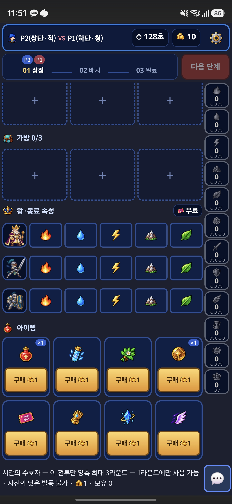
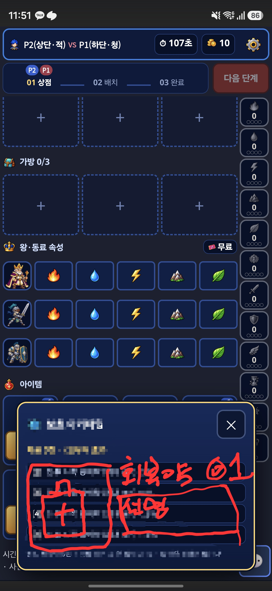
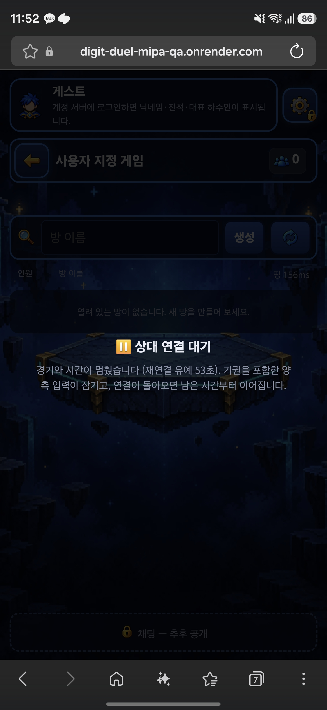

# CJ QA REVISE — 추가 4건 (2026-10-02 KST 접수)

CJ 최신 Comment 원문. 이전 7건 수정 방향을 긍정 평가했지만 최종 판정은 **REVISE**다.

> CJ QA Test : REVISE
> - 너무 좋은 방향으로 수정되었습니다. 완벽합니다. 4가지만 수정해주세요.
> [UI] 교체 시 맨 아래 취소 버튼은 삭제합니다. X 버튼으로 충분할 거 같습니다.
> [System] 버프인 수호자 아이템 3 종류는 모두 1->3원으로 구매 가격을 상승 시킵니다.
> [UI/UX] 아이템 설명을 다음과 같이 변경합니다.
> [Image #2]
> - 시너지 설명 창과 비슷한 창 형태로 변경합니다.
> [Image #1]
> - 기존 맨 아래 텍스트 설명은 삭제합니다.
> - 지금 텍스트 설명도 너무 가독성이 떨어집니다. 불필요한 말은 삭제한 채 가독성 좋고 한눈에 알아볼 수 있게 설명을 붙입니다.
> [Bug] 상점에서 상대방이 팅겼을 시 방나가기 항목이 나오는데 이때 방나가기를 누르면 다음과 같이 나옵니다. 수정이 필요합니다.
> [Image #3]

원본 이미지 바이트를 보존했다. 구현 전 기준 HEAD `08e39959f3c3ddb78d24cd8219761756332a1d30`, QA 실행 소스 `0a132ecdc8783007bc91b99fde596ec68ff89666`. 기존 Issue293/PR305와 Free QA 사이트를 사용하며 최종 CJ 플레이 QA·병합·Release·운영 배포는 별도 단계다.
