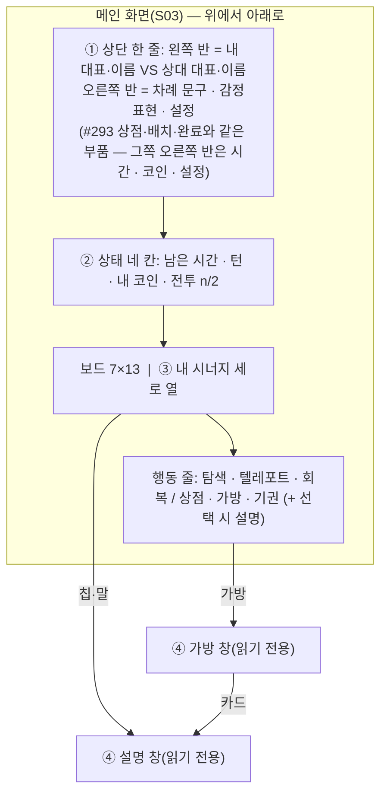
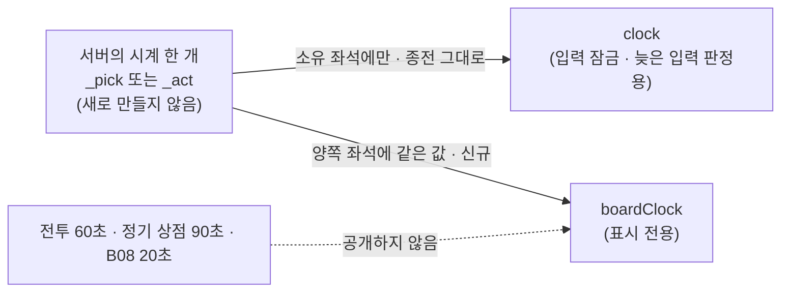

# #294 구현 계약 — 메인 화면 흐름 + 공통 신원 머리줄

- 작성: Venus(Plan · Claude `claude-opus-5-5` high) · 2026-10-02 · dispatch `ctx_7a9740b9f845` / task `task_5dc46662877d`
- 권위: [`references/CJ_COMMENT.md`](../references/CJ_COMMENT.md)(CJ "승인합니다. 구현 시작하세요." + 승인된 PD 보고) · [CJ 콘티 원본](../references/CJ_CONCEPT_CONTI_20261002.png)(직접 확인). 시각 규격은 Earth [`UI_CONTRACT.md`](../Earth/UI_CONTRACT.md) · [`analysis.md`](../Earth/analysis.md), 준비 화면의 기존 규칙은 [#293 계약](../../293/Venus/implementation-contract.md).
- 상태: **구현 계약**입니다. 제품 QA PASS · 병합 · 출시 승인이 아닙니다. 구현은 fresh Mars · Jupiter Worker가 합니다.
- 근거 읽기: 코드는 읽기만 했고 실행 · 테스트 · 브라우저는 0회입니다. 줄 번호는 `origin/milestone/v0.4.13` `39241d2` 기준입니다.
- **개정 — 2026-10-02 CJ QA REVISE** (Venus · dispatch `ctx_f65750c1da75` / task `task_95c1ccfa1a07`): CJ 그림 [1](../references/CJ_REVISE_20261002_1.png) · [2](../references/CJ_REVISE_20261002_2.png) · [3](../references/CJ_REVISE_20261002_3.png) · [4](../references/CJ_REVISE_20261002_4.png)를 직접 확인하고 **1장 · 2장 · 4.1 · 4.2와 AC 1~4 · 10 · 11 · 12 · 15를 치환**했습니다. 이 장들의 줄 번호는 이슈 브랜치 HEAD `d20f312` 기준입니다. 3장(공개 시계) · 5장(시너지 열) · 6장의 규칙은 그대로입니다. 대체된 옛 문장은 [`report.md`](report.md)에 이력으로 남깁니다. 이 개정은 CJ의 직접 지시이며 별도 승인 대기가 없습니다.

표지: **[CJ]** CJ 원문 · 콘티가 정한 것 / **[확정 해석]** 승인된 PD 보고와 CJ 지시를 구현 가능하게 좁힌 것 / **[현행]** 지금 코드 · GDD 동작 그대로 / **[추론]** 정적 읽기 결론(실행 확인 아님).

## 0. 한 문단 요약

경기장을 예로 들면, 지금 메인 화면에는 **선수 명패가 없고**(일반 아이콘 하나), **전광판 시계가 내 공격 때만 켜지며**, 내 전력표(시너지)는 달성한 것만 한 줄로 나옵니다. 이번 납품은 ① 준비 화면과 메인 화면에 같은 **양측 명패**(계정 대표 하수인 + 이름)를 달고, ② 전광판 시계를 **양쪽이 같은 값으로** 보게 하고, ③ 전력표를 오른쪽 세로 열로 전부 펼치고, ④ 가방과 하수인 설명을 **읽기 전용 창**으로 정리합니다. **새 규칙 · 수치 · 비용 · 시계 길이는 하나도 없습니다.** 서버가 새로 내보내는 것은 "보드 시계의 남은 시간" 한 가지뿐입니다.



## 1. 상단 한 줄 — 왼쪽 반 신원 · 오른쪽 반 상태 [CJ QA REVISE · 2026-10-02 · 그림 1]

용어: **계정 대표 하수인** = 계정 프로필에서 고른 얼굴 그림(#260). 경기의 **왕 · 동료 · 필드 하수인과 아무 관계가 없습니다.**

중계 화면의 자막 한 줄을 떠올리면 됩니다. 왼쪽 절반은 "누구 대 누구", 오른쪽 절반은 "지금 상황"입니다. 종전에는 이 둘이 **두 줄**(신원 줄 + 도구 줄)이었고, CJ가 그림 1에서 아래 줄을 위로 올려 **한 줄**로 합치라고 지시했습니다.

```
|←──────────── 왼쪽 정확히 50% ────────────→|←────── 오른쪽 정확히 50% ──────→|
 [내 대표 · 파랑 테두리] 내 이름  VS  [상대 대표 · 빨강 테두리] 상대 이름 │ 준비: 남은 시간 · 내 코인 · ⚙
                                                                          │ 보드: 차례 문구 · 감정표현 · ⚙
```

**부품은 하나**입니다. 상점(S01) · 배치(S02) · 완료 대기와 메인(S03)이 같은 함수 · 같은 마크업을 씁니다(현행 `idHeadHtml` · `idSeat` — `ui.js` 1000~1009. `flowHeadHtml` 2191과 `renderBoardInfo` 988이 부릅니다).

| 항목 | 계약 | 표지 |
|---|---|---|
| 줄 수 | **한 줄.** 신원만 있는 전체 폭 줄(`.idHead`가 100%를 차지하던 것)과 따로 떨어진 도구 줄(`.hudTools`)을 **없앱니다.** 준비 화면에서 시계 · 코인 · ⚙이 둘째 줄로 내려가던 것도 없앱니다 | [CJ 그림 1] |
| 폭 | 왼쪽 신원 = 줄 폭의 **정확히 50%**, 오른쪽 = 나머지 **정확히 50%**(같은 크기 두 칸 · 예: `grid-template-columns:1fr 1fr`, 두 칸 모두 `min-width:0`). 320px에서도 비율이 변하지 않고 둘째 줄로 넘어가지 않습니다 | [CJ] |
| 왼쪽 내용 | `[내 대표] 내 이름 VS [상대 대표] 상대 이름`. 그 밖의 것(시계 · 코인 · 버튼)은 왼쪽에 넣지 않습니다 | [CJ] |
| 오른쪽 — 준비(상점 · 배치 · 완료) | 남은 시간(`#prepClock` · 공통 180초) / 내 코인 / ⚙ — 셋 다 현행 값 · 현행 동작 | [CJ] · [현행] |
| 오른쪽 — 보드 | **짧은 차례 문구** / 감정표현 / ⚙ (2장) | [CJ] |
| 이름 원천 | 온라인 `NET.players[좌석]`(서버 권위 · `ACCT_NICK_RE` 통과분만). 오프라인은 기존 `pname()` | [현행] |
| 대표 원천 | 온라인 `NET.reps[좌석]`(`lobbyRepOk` 통과분만). 그림은 `lobbyRepHtml(id,…)` 재사용. 새 서버 필드 없음 | [현행] |
| **테두리 — 항상 파랑/빨강** | 내 대표 = 파랑 `#5b8cff`, 상대 대표 = 빨강 `#ff5b6e`. **대표 값이 없을 때도 같습니다.** 종전의 "중립 = 회색 테두리"(`.idSeat.nt` · `.idCard.nt` · `#8a93a8`)는 **폐지** | [CJ "fallback도 파랑/빨강"] |
| 대표가 없을 때의 그림 | 대표 값이 `null`(누락 · 규칙 밖 값)이거나 오프라인이면 종전의 **일반 프로필 아이콘**(`gi("profile")`)을 그 테두리 안에 그립니다. **종을 지어내지 않습니다** — `lobbyRepHtml`은 모르는 ID를 기본 종으로 그리므로(`lobby.js` 124~) `null`일 때 부르지 않습니다. 왕 · 동료 그림으로 대신하지 않습니다 | [CJ "종 지어내기 금지"] · [현행] |
| 내/상대 구분 | **보는 사람 기준**: 왼쪽 = 나(`NET.me`), 오른쪽 = 상대. 좌석 0 = 파랑으로 고정 금지. 색만으로 구분하지 않도록 **자리(왼쪽/오른쪽)와 접근성 이름 `나 · 이름` / `상대 · 이름`**이 함께 갑니다 | [현행] |
| 화면 글자 | 이름이 있으면 **이름만**(작은 `나` / `상대` 글자는 화면에서 빼고 접근성 이름에만 — 절반 폭에 이름 자리를 남기기 위함). 이름이 `null`이면 `나` / `상대`를 이름 자리에 | [확정 해석] |
| 12자 이름 | 저장값은 건드리지 않고 **한 줄 말줄임**. 대표 그림 · `VS`는 줄지 않습니다. 전체 이름은 ① 신원 칸의 접근성 이름 ② 신원 칸을 누르면 뜨는 기존 읽기 전용 표식(`idHelp`)에 있습니다 | [CJ] · [현행] |
| 누르는 크기 | 신원 칸 두 개 · ⚙ · 감정표현은 각각 **44×44px 이상** | [CJ] |
| 금지 | 대표에 왕관 · HP · 등급 · 속성 표식을 붙이지 않음. 좌석 토큰 · 내부 ID를 대체 글자로 쓰지 않음. 값은 텍스트로 이스케이프 | [현행] |
| 상대 없음 | `OPEN`(상대 입장 전 · 퇴장 뒤)은 상대 이름이 비고(`상대`), 그림은 프로필 아이콘 + **빨강 테두리** | [현행 + 위 테두리 규칙] |
| 수명 | 새 경기 · 방 나가기(`netLeave`) · 재대전 초기화에서 신원 표식 창을 닫고 이전 값을 버림 | [현행] |

**320px 계산** [추론 — 정적 계산]: 절반 ≈ 156px. 대표 2개(테두리 포함 36px씩) + `VS` 약 20px + 간격을 빼면 이름 한 칸은 약 2~3글자 뒤 말줄임입니다. CJ가 "정확히 50%"와 "말줄임 + 전체 이름 접근 가능"을 함께 지시했으므로 허용합니다.

**준비 진행 막대의 표식** [CJ 그림 1 — `P1` · `P2` 칩에 X표]: `01 상점 — 02 배치 — 03 완료` 위의 표식(`flowHeadHtml`의 `mk` · `ui.js` 2181~2182)에서 **보이는 글자 칩을 전부 없앱니다** — `P1`/`P2`, 이름 첫 글자, `나`/`상대`. 표식은 **대표 그림 하나**이고 내 것은 파랑 테두리, 상대 것은 빨강 테두리입니다(대표가 없으면 위와 같은 프로필 아이콘 + 같은 색 테두리 · `idFaceHtml(rep,"xs")`). 누가 어느 단계인지는 종전대로 막대의 접근성 이름(`진행 단계 — 이름: 상점 · 이름: 배치`)이 읽어 줍니다. 단계 값은 여전히 `NET.steps`(`seats.step`)만 읽고, 같은 단계의 두 표식은 겹치지 않게 나란히 둡니다. **준비 180초 · 재발급 없음 · 준비 취소 위치 · 중앙 팝업은 #293 그대로**입니다.

## 2. 보드 상단 — 오른쪽 반과 상태 네 칸 [CJ — Top Bar · REVISE 2026-10-02]

| 자리 | 계약 | 표지 |
|---|---|---|
| 차례 문구 | 상단 한 줄의 오른쪽 반 맨 앞. **짧게**: 현행 `who` 값만 — `내 차례` / `상대 차례` / AI 차례 표시. 넘치면 말줄임 | [CJ "short"] |
| 긴 안내 문장 | 종전에 차례 옆에 붙던 문장(`자기 말을 선택하세요` · `주 행동 완료` · `상대가 행동을 선택하고 있습니다` · 선택한 말의 이름 · HP)은 **화면 상단에서 뺍니다.** 같은 문자열을 차례 문구의 **접근성 이름**에 그대로 둡니다(새 문구 없음). 선택한 말의 값은 설명 창(4.1)에서 봅니다 | [확정 해석] |
| `설명` 버튼 | 상단에 자리가 없으므로 **행동 줄(6장)로 옮깁니다.** 내 말을 선택했을 때만 나오는 44px 버튼 하나 · 호출은 종전 그대로(`unitHelpPiece`). 보드 탭의 뜻(선택 · 이동 · 전투)은 바뀌지 않습니다 | [확정 해석] |
| 감정표현 | **기존 기능 · 잠금 그대로**(`emoteSync`). 새 채팅 없음 | [CJ "UI 위치만"] |
| 설정(톱니) | 준비 화면과 같은 틀(`gearHtml`). 그 화면의 **기존 나가기 진입점**(동작 · 확인 창 불변) + `사운드 · 환경설정 — 추후 제공` 비활성 한 줄 | [CJ] |
| 상태 네 칸 | 상단 한 줄 **아래**에 종전대로: 남은 시간 / 현재 턴(`S.turnCount+1`) / 내 코인 / 전투 `n/2` — 전부 현행 값. 상대 코인 없음 | [현행] |
| 시간 칸 | 3장의 공개 보드 시계 | [CJ "[Bug] 상대방 시간일 때도 표시"] |

## 3. 공개 보드 시계 [CJ — 시간 표시 고정 · 상대 시간에도 표시]

**원인** [확정 — 코드 읽기]: 서버 `_clockView(seatIndex)`(`room.js` 1887~1897)는 준비 구간 밖에서 **`owner === seatIndex`인 시계만** 돌려줍니다. 그래서 상대 차례에는 좌석 뷰에 `clock`이 없고 시간 칸이 빕니다. 화면만 고쳐서는 해결되지 않습니다.

용어: **보드 시계** = 한 턴에 하나 있는 행동 30초(`_act`)와, 강제 전투 대상이 둘 이상일 때 도는 대상 선택 30초(`_pick`). 둘 다 **방에 하나**이고 `owner`로 답할 좌석만 가리킵니다(`room.js` 1392~1418).



### 3.1 전송 계약 (Jupiter · Mars 공유)

경기 중(`IN_PROGRESS`) 좌석 뷰에 **표시 전용 필드 하나**를 더합니다.

```
boardClock: { leftMs, running, deadline, serverNow } | null
```

| 필드 | 뜻 |
|---|---|
| `leftMs` | 남은 ms. 흐르는 중이면 `deadline − serverNow`, 멈췄으면 서버가 들고 있는 `left`, 만료면 `0` |
| `running` | 서버에서 지금 흐르는가(`deadline != null`) |
| `deadline` · `serverNow` | 서버 epoch ms. 멈춘 동안 `deadline`은 `null`. 준비 시계와 같은 보정식(`netClockText`, `network.js` 775) 재사용 |

- **원천**: `[this._pick, this._act]` 중 **흐르는 것, 없으면 앞의 것** — 소유 좌석 `clock`이 쓰는 고르기 규칙(1893)에서 `_bclock` · `_clock[좌석]`만 뺀 것입니다. 둘 다 없으면 `null`.
- **같은 객체를 읽기만** 합니다. 새 타이머 · 새 키 · `_tick` 호출을 더하지 않으므로 뷰를 몇 번 만들어도 남은 시간이 다시 서지 않습니다.
- **양쪽이 같아야 하는 것은 권위 값**입니다: 같은 revision에서 두 좌석의 `running`과 `deadline`이 같고, 멈춘 시계면 `leftMs`가 같습니다. `serverNow`와 흐르는 중의 `leftMs`는 **뷰를 만드는 순간마다 새로 재는 값**이라 좌석 뷰를 차례로 만들면 몇 ms 다를 수 있고, 전달 지연만큼 화면 초가 어긋날 수 있습니다 — 허용합니다. 객체를 똑같이 만들려고 revision별 시계 캐시를 두거나 시계를 다시 세우지 않습니다.
- **"다시 서지 않는다"의 범위**: **같은 시계가 살아 있는 동안** 어느 좌석이 보든 · 몇 번 읽든 · 재접속하든 `deadline`이 그대로라는 뜻입니다. 턴이 바뀌어 다음 행동 30초가 서는 것, 대상 선택 30초가 따로 서는 것, 정지 뒤 재개로 `deadline`이 다시 계산되는 것은 **현행 규칙 그대로**이며 막지 않습니다.
- **싣지 않는 것**: `key`(act/pick 구분) · `owner` · 전투 행동 60초 · 정기 상점 90초 · B08 20초 · 상대의 선택 내용. 차례는 이미 공개된 `current`로 읽습니다.
- 기존 `clock`(소유 좌석 전용)은 **한 글자도 바꾸지 않습니다** — 입력 잠금(`turnClockLate`) · 전투 · 상점 · B08 표시가 계속 이것을 씁니다.
- 준비 구간(`SETUP`)에는 `boardClock`이 없습니다(공통 `prep` 180초가 이미 양쪽 공개 · #293).

### 3.2 상황별 값과 화면

| 상황 | `boardClock` | 시간 칸 표시 |
|---|---|---|
| 누구 차례든 보드 행동 중 | `running:true` + 같은 `deadline` | `N초` — 양쪽 같은 초 |
| 강제 전투 대상 선택(대상 2 이상)과 이어지는 출전 선택 | 그 30초(`_pick`) | `N초` |
| 전투가 열려 있는 동안 · B08(가방 초과) 동안 | 멈춘 행동 시계(`running:false`) | `정지 · N초`(보드는 창 뒤) |
| 단절 정지 | `running:false` · 값 보존 | `정지 · N초` + 기존 X01 |
| 만료 직후(서버 처리 전 프레임) | `leftMs:0` | `0초 · 처리 중` — **화면은 아무 명령도 만들지 않음** |
| 정기 상점 · 종료 | `null` | 현행(표시 없음) |
| 온라인인데 필드가 없음(구 서버) | 없음 | 내 차례는 종전 `clock`, 상대 차례는 `확인 중` — 로컬 30초를 지어내지 않음 |

- **재접속**: 재접속 프레임의 `boardClock`도 같은 시계 객체에서 나옵니다. 키가 그대로라 다시 30초가 되지 않고, 정지 중이면 멈춘 값입니다(현행 `_tick` 보존 규칙).
- **만료 처리**: 서버의 기존 `_actTimeout` 하나뿐입니다. 상대 화면이 대신 만료 입력을 보내지 않습니다.
- **표시 자리는 보드 상단 시간 칸 하나**입니다. 상대의 출전 선택을 기다리는 창(B03 "상대가 선택 중입니다")에는 종전대로 남은 시간 · 후보 수를 붙이지 않습니다(GDD-24 00.7).
- **오프라인**: 핫시트 · PVE는 종전 기기 시계(`TURNCLK`) 그대로. AI 차례에는 종전처럼 시계가 없습니다.
- **변하지 않는 것**: 행동 30초 · 대상 선택 30초 · 전투 60초 · 정기 상점 90초 · B08 20초의 길이 · 정지 · 만료 규칙, 준비 180초 한 번 · 재발급 없음.
- **남는 공개량** [추론]: 대상 선택 30초가 돌면 상대도 "새 30초"를 봅니다. 이것은 "이동한 말이 내 말 둘 이상과 새로 맞닿았다"는 뜻인데, 맞닿은 말은 규칙상 이미 내 화면에 보이므로 보드에서 읽을 수 있는 사실입니다. CJ의 "상대 시간일 때도 표시"가 이 표시를 요구하므로 채택합니다.

## 4. 읽기 전용 창 — 한 틀

설명 · 표식 창은 전부 **#293의 안내 창 틀 하나**(`synHelpOpen` / `synHelpClose`, `ui.js` 1430~1442)를 씁니다. 새 창 체계를 만들지 않습니다.

| 공통 규칙 | 내용 |
|---|---|
| 닫기 | ✕ · Esc · 바깥 누름. Esc는 이 창만 닫음(뒤 화면 불변). ✕ · Esc는 연 자리로 포커스 복귀 |
| **닫는 탭이 명령이 되지 않음** | 현행 바깥 누름은 `pointerdown`에서 창만 지워, **같은 탭이 뒤의 보드 칸 · 행동 버튼에 그대로 떨어질 수 있습니다** [추론]. 창이 열려 있는 동안 바깥 탭은 **닫기만** 하고 이동 · 선택 · 전투 · 판매 · 교체 · 구매를 일으키지 않아야 합니다. 틀 한 곳에서 고칩니다(창마다 땜질 금지) |
| 전송 0 | 열기 · 닫기 · 창 안 스크롤은 서버 요청 · seq · 시계 · 코인을 바꾸지 않음. 상대 차례 · 단절 정지 · 입력 잠금 중에도 열고 닫을 수 있음 |
| 정리 | 새 경기 · 방 나가기 · 단계 전환(준비 → 경기 → 결과) · 전투/상점 창이 열릴 때 · 대상 말이 죽거나 안 보이게 될 때 닫음. 낡은 내용을 남겨 두지 않음 |
| 접근성 | `role="dialog"` + 이름 연결, 창 안에서만 Tab 순환, 긴 내용은 창 안 스크롤, 누르는 곳은 44×44 이상 |

### 4.1 하수인 설명 창 [CJ QA REVISE · 2026-10-02 · 그림 4 손그림]

선수 카드 한 장을 떠올리면 됩니다. 위에는 이름, 왼쪽에는 큰 사진, 오른쪽에는 기록 숫자, 아래에는 쓸 수 있는 기술 목록입니다. 종전의 `하수인` · `스킬` **탭 두 장을 없애고 한 장**에 이어 붙입니다(창 안 스크롤).

```
┌──────────────────────────────────────────┐
│ 재의 주술사 ★                        [✕] │  ← 이름 + 등급 별 + 닫기
├───────────────┬──────────────────────────┤
│               │ [왕국] [아키타입] [♥ 95/95] │
│   큰 그림     │ [공격 20]    [방어 10]     │
│               │ [속도 8]     [회피 5%]     │
│               │ [치명타 0%]  [상태 부여 +10%p] │
│               │ [개인 시너지 …]  ← 있을 때만 │
├───────────────┴──────────────────────────┤
│ 스킬                                      │
│ [재 뿌리기 ★] [위력 100%] [쿨 0]          │
│ [재의 저주 ★★] [위력 110%] [쿨 2]  짧은 설명 │
└──────────────────────────────────────────┘
```

**숫자는 전부 지금 그 개체가 들고 있는 값**입니다. 손그림의 `22` · `10` · `5%`는 자리 예시이며 화면에 옮기지 않습니다(위 그림의 숫자는 실제 `재의 주술사` ★1 값입니다 — `data.js` 248 · 296).

**① 내 것에만 열리는 창의 칸별 원천** — 대상: 메인 보드의 내 하수인 · 왕 · 동료, 내 가방 하수인, 상점의 내 필드/가방 카드, 상점 진열 칸.

| 칸 | 보드의 내 말 · 가방 개체 | 진열 칸(아직 안 산 종 + 등급) | 표시 | 이름표(접근성 · 툴팁) |
|---|---|---|---|---|
| 이름 | `x.name`(동료 · 왕은 `leadNm`) | `unitName(key)` | 글자 | — |
| 등급 | `pcMeta(x).g` / `unitGrade(key,u.grade)` | `unitGrade(key,slot.grade)` | ★ × 등급. 왕 · 동료는 등급이 없어 별 없음 | `등급 N` |
| 큰 그림 | `pcFaceHtml(x)` / `unitIco(key)` | `unitIco(key)` | 기존 그림을 크게(새 그림 자산 없음) | 장식 |
| 왕국 · 아키타입 | `pcMeta(x)` / `unitTags(key)` | `unitTags(key)` | 아이콘 2개. 왕 · 동료는 종전처럼 역할 기호 | `불 · 지속` 등 기존 글자 |
| HP | `x.hp` / `x.maxHp` | `unitHp(key,g)` | `♥ 현재/최대`(진열은 최대만) | `HP` |
| 공격 | `x.atk` | `gradeAtk(ROSTER 종.atk, g)` · 전설 `LEGEND_BASE[키].atk` | 정수 | `공격력` |
| 방어 | `x.def` | `ARCHETYPE_BASE[아키타입].def` · 전설 `LEGEND_BASE` | 정수 | `방어력` |
| 속도 | `x.spd` | 같은 표 `.spd` | 정수 | `속도` |
| 회피 | `x.dodge` | 같은 표 `.dodge` | `×100` 뒤 `%` | `회피` |
| 치명타 | `x.crit` | 같은 표 `.crit` | `×100` 뒤 `%` | `치명타` |
| 상태 부여 확률 | `x.statusPct` | 같은 표 `.statusPct` | `+N%p` — **0이면 칸 없음** | `상태 부여 확률` |
| 개인 시너지 | `synExtraView(p,S).legends` 중 **그 말**의 항목 | — (진열 칸에는 없음) | 시너지 열의 전설 칩과 같은 문구 · **없으면 칸 없음** | 같은 문구 |
| 상태 줄 | `이동 불가 N턴`(`x.immobile`) · `회복 자세`(`x.healing`) · `사망` · `가방` · 가격(`ecoPrice`) | 가격 | 종전 글자 그대로 숫자 칸 아래 한 줄 | — |

- **값이 이미 있습니다** [확정 — 코드 읽기]: 온라인의 내 말은 서버가 `atk` · `def` · `spd` · `dodge` · `crit` · `statusPct` · `grade`를 한 묶음으로 싣습니다(`room.js` `_serializeOwn` 2050 · 2069~2070). 오프라인은 말 객체에 같은 값이 있습니다(`applyArchStats` · `applyFixedStats`). **서버 · Core · 데이터 변경 없음.**
- 가방 개체에 스탯 필드가 없으면 진열 칸과 같은 방법(종 표)으로 읽습니다 — 온라인이 공개 말에 쓰는 것과 같은 표입니다(`netStubStats` · `network.js` 617). [추론 — 가방 개체의 실제 필드는 구현 때 확인]
- 이름표 글자는 기존 `SYN_STAT_KO`(`ui.js` 1409)의 것을 씁니다. 아이콘은 기존 아이콘표(`gi`)에서 고르고, 맞는 아이콘이 없으면 글자 이름표를 그대로 보입니다. **새 아이콘 자산을 만들지 않습니다.**
- 숫자는 **그 말의 기본 값**입니다. 시너지 가산은 전투가 확정될 때 따로 붙는 값이라(`applySynergy`) 여기 더하지 않습니다 — 내 시너지는 오른쪽 세로 열이 보여 줍니다.
- 폭탄 · 함정은 숫자 칸 없이 종전대로 종류 + 한 줄 설명(`UNIT_NOTE`)입니다.

**② 손그림 아이콘을 실제 칸에 맞춘 해석** — 손그림만으로는 뜻이 확정되지 않는 칸입니다.

| 손그림 | 맞춘 칸 | 근거 |
|---|---|---|
| 첫 두 그림 · 하트 `95/95` | 왕국 · 아키타입 · HP | 재의 주술사 = HP 95, 지속형(모래시계 아이콘) |
| 근육 `22` · 방패 `10` | 공격 · 방어 | 스킬 줄의 근육 = 위력과 같은 그림 |
| 달리는 사람 `10` · 바람 `5%` | 속도 · 회피 | 정수 하나, 확률 하나 |
| 과녁 `5%` | **치명타** | 엔진에 **명중 스탯이 없습니다** — 빗나감은 상대의 회피(`dodge`)로만 정해집니다. 과녁 그림을 "명중"으로 읽으면 보여 줄 실제 값이 없으므로 확률형 실제 스탯인 치명타에 맞췄습니다. **명중 칸은 만들지 않습니다** |
| 별표 `+10%p` | 상태 부여 확률 | 지속형 기본 값이 실제로 10%(`ARCHETYPE_BASE.sustain.statusPct`) |
| 사람들 `최대♥ +10%` | 개인 시너지 | 실제 개인 시너지는 필드에 살아 있는 내 전설의 것뿐(`synExtraView`). 일반 하수인에게는 개인 시너지 데이터가 없어 **칸이 나오지 않습니다** |

**③ 스킬 목록** — 숫자 칸 아래. 읽기 전용이며 사용 버튼이 아닙니다. 줄 목록은 종전 `unitSkillRows`가 읽던 그 스킬 ID들입니다(가진 것만 — 아직 안 열린 등급의 스킬은 보이지 않음).

| 칸 | 원천 | 표시 |
|---|---|---|
| 이름 | `skillNameKo(id, 속성)` | 글자 |
| 별 | 종 스킬의 차례(`speciesSkills`는 등급 순서 — 1차 ★ … 4차 ★★★★) | 일반 하수인만. 전설 · 왕 · 동료 스킬은 별 없음 |
| 위력 | `SKILLS[id].pct` | `N%` + 이름표 `위력`. **`pct`가 없는 스킬은 칸 없음**(보조형 등) |
| 쿨타임 | `SKILLS[id].cd` · `once`면 `전투당 1회` | 숫자 + 이름표 `쿨타임` |
| 남은 쿨 | `cds[i]` | 0보다 클 때만 `남은 쿨타임 N`(종전 문구) |
| 짧은 글 | `SKILLS[id].desc` **원문 그대로** | 위력 · 쿨만으로 뜻이 다 전해지는 **기본기에는 글을 붙이지 않고**, 그 밖의 스킬에만 붙임 |

스킬 글을 새로 줄여 쓰지 않습니다(문구는 GDD-23 6.3의 것 — 줄이려면 기획 개정이 필요합니다).

**④ 맥락별 허용 필드(allowlist).** 창은 아래 표의 값만으로 만든 표시용 묶음을 받습니다. **오프라인(핫시트 · PVE)은 기기에 상대 말의 전체 값이 있으므로, 상대 말은 반드시 이 표를 거쳐 걸러야 합니다.**

| 맥락 | 대상 | 보이는 것 | 보이지 않는 것 |
|---|---|---|---|
| 메인 보드 | 내 말(하수인 · 왕 · 동료) | ① 표 전부 + ③ 스킬 전부 | 원장(`paid`) |
| 메인 보드 | 내 폭탄 · 함정 | 종류 · 한 줄 설명(기존 문구) | — |
| 가방 창 · 상점의 내 필드/가방 카드 | 내 하수인 | 위 "내 말"과 같음 | — |
| 상점 진열(아직 안 산 칸) | 진열 종 + 진열 등급 | ① 표의 진열 열 + 그 등급의 스킬 + 가격 | 상대 것 일체 |
| 메인 보드 | **정체 공개된** 상대 말 | **종전 그대로** — 서버가 이미 싣는 값만: 이름 · 종류 · 그림 · 왕국 · 등급 · HP/최대 · 생존 · 이동 불가 · "상점에서 교체됨" 표식. 상대 동료 역할은 현행 규칙(공개된 기술로 알 때만) | **공격 · 방어 · 속도 · 회피 · 치명타 · 상태 부여 · 개인 시너지 숫자 칸 없음. 스킬 영역 · 쿨타임 없음.** 포획 · 원장 · 상대 가방 · 코인 · 시너지 집계 · 진열도 없음 |
| 메인 보드 | 미공개 `?` 상대 말 | **설명 창 없음.** 기존 추측 메모만 | 종 · 속성 · HP · 등급 — 마크업 · `alt` · `title` · 그림 주소에도 넣지 않음 |

- 공개된 상대 말의 스탯은 종 표에서 **계산해 낼 수 있어도 그리지 않습니다**(오프라인에서 말 객체를 읽는 것도, 온라인에서 `netStubStats`로 채워진 값을 읽는 것도 금지). 서버 변경 **없음** — `_serializeKnownOpponent`(`room.js` 2094~2106) 그대로입니다.
- 공개된 상대 말의 창은 같은 틀(이름 + 등급 + ✕ / 큰 그림 / 왕국 · 아키타입 · HP)에서 **숫자 칸과 스킬 영역이 빠진 모습**입니다. `상대 말 — 공개된 정보만 표시` 문구는 유지합니다.
- 전투 화면의 상대 기술 표시(공개된 칸만)는 현행 그대로이며 이번 범위가 아닙니다(#296). 정기 상점(#295)은 같은 창을 그대로 물려받습니다.

**들어가는 길 — 보드 조작을 바꾸지 않습니다.**

| 누르는 것 | 동작 |
|---|---|
| 내 차례 · 내 말 | **그대로 선택.** 행동 줄의 `설명` 버튼(44px · 2장)으로만 창을 엶 |
| 내 차례 · 빈 칸/적 칸(이동 · 전투 가능) | **그대로** 이동 · 전투 |
| 공개된 상대 말(이동 · 전투 대상이 아닐 때) | 설명 창(전송 0 — 기존 `memoClickTarget` 분기 그대로) |
| 미공개 `?` 상대 말 | **그대로** 추측 메모 |
| 상대 차례 · 내 말(온라인 · PVE의 AI 차례) | 설명 창(로컬 · 전송 0) |
| 가방 창 · 상점의 카드 얼굴 | 설명 창. 옆의 `[교체]` · `[판매]` · `[구매]`는 **별개 버튼** |

강제 전투 대상 · 텔레포트 · 도망 교환 선택 중의 탭은 **현행 규칙 경로가 먼저**이고 설명 창으로 빠지지 않습니다(기존 `memoClickTarget` 우선순위).

### 4.2 가방 창 [CJ — Bottom Bar 가방 팝업 · "팝업창 유지"]

행동 줄 `가방 n/3`을 누르면 현행 정보 서랍(`uiDrawer("side")`)이 열립니다. 그 **윗부분을 콘티대로 재구성**합니다.

| 영역 | 계약 | 표지 |
|---|---|---|
| 머리줄 | `가방 n/3` + ✕. `n` = 실제 가방 수, 3 = `ECO.bagMax` | [CJ] · [현행] |
| 카드 3칸 | 실제 가방 하수인을 공용 카드(`unitCard`)로. 빈칸은 `+` **장식**(기존 `EMPTY_SLOT` — 누를 수 없음 · 탭 순서 없음) | [CJ] |
| `+`의 뜻 | 빈칸 표시일 뿐. **구매 · 용량 확장 명령을 만들지 않음** | [확정 해석] |
| 아이템 | 기존 `ownGridHtml`(8종 · 실제 보유 `goodOwned`). `×0`도 표시. 없는 수량을 지어내지 않음 | [현행] |
| 명령 | **없음.** 사용 · 교체 · 판매 · 이동은 그것이 허용되는 기존 자리(전투 · 상점)의 버튼에서만. 카드 얼굴 = 설명(4.1) | [확정 해석] |
| **아이템 아래 — 삭제** | CJ가 그림 2 · 3에서 빨간 X로 지운 묶음을 창에서 **없앱니다**(`renderSide` 경기 분기 · `ui.js` 939~943 · 949~953): ① 플레이어 이름 머리(`나(P1)` 등 `<h2>`) ② 배지 줄 전체 — 🎁 선물 수 · ✨ 버프 수 · `전투 n/2` · 예비 하수인 · `주 행동 가능/완료` · 🪙 코인 ③ `자기 말을 클릭해 선택하세요` 안내와 그 자리에 대신 나오던 `선택: …` 요약. 같은 값은 이미 다른 자리에 있습니다 — 코인 · 전투 횟수는 보드 상태 네 칸, 선택한 말은 설명 창(4.1), 🎁 · ✨는 전투 창의 기존 버튼 | [CJ 그림 2 · 3] |
| 아이템 아래 — 유지 | **조건이 맞을 때만 나오던** 보드 입력 안내는 그대로 둡니다: 텔레포트 2단계 안내 · 도망 교환 안내 · 강제 전투 안내 · 추측 메모 목록. 문구 · 조건 · 순서 불변. 행동 줄의 기존 안내 배지(`강제 전투 대상 선택` 등)도 그대로 | [현행] |
| 게임 동작 | **변화 없음.** 지우는 것은 표시뿐이고 선택 · 이동 · 전투 · 패키지 · 시계는 손대지 않습니다 | [CJ] |
| 언제 | 상대 차례 · 정지 중에도 열림(정보 보기 — 현행 "잠금 무관") | [현행] |
| 비공개 | 상대 가방 · 코인 · 아이템은 이 창에 들어오지 않음 | [현행] |

## 5. 우측 시너지 열 [CJ — Right Side 시너지]

메인의 활성 칩 한 줄(`hudSynHtml`, `ui.js` 990)을 **#293 준비 화면과 같은 세로 열**(`synRailHtml`)로 바꿉니다. 계산 함수 · 효과 표는 건드리지 않습니다.

| 항목 | 계약 | 표지 |
|---|---|---|
| 누구 것 | **내 것만.** 상대 집계 · 기여자는 어디에도 없음 | [현행 7.9] |
| 칩 | 왕국 5(`V2_ELEM_ORDER`) → 아키타입 6(`V2_ARCH_SYN`) → 왕관 → 활성 전설. **미달(0 포함)도 표시.** 개수로 자르지 않고 열 안에서 스크롤 | [CJ] |
| 숫자 · 단계 | Core `synView` 그대로(전투 중이면 그 전투 스냅샷) | [현행] |
| 왕관 | 죽은 **동료** 수 0~2(`synExtraView.deadAllies`). `synView.dead`(사신용 · 하수인 포함)를 쓰지 않음 | [현행] |
| 전설 칩 | `synExtraView.legends` — 필드에 살아 있는 내 전설이고 값 > 0일 때만. 가방 전설이라는 이유로 만들지 않음. 누르면 같은 창에 이름 · 효과 문구(현행 `title` 문구) | [현행 #293 3.3] |
| 기여 목록 | 칩을 누르면 단계표 + **그 숫자를 만든 칸들**(`synContrib`). 죽은 말은 지우지 않고 `사망` 표시로 남김. 가방 · 예비 · 포획 전설은 해당 아키타입에 `가방` 꼬리표 | [CJ 승계 "사망 기여 유지"] |
| 일반 가방 | 기여하지 않음 — 목록에 없음 | [현행] |
| **숫자 = 목록** | 전투가 없을 때 11개 칩 모두 `칩 숫자 === 기여 목록 칸 수`. 전투 스냅샷은 칸 수만 들고 있으므로(`applySynergy`) **전투가 열려 있는 동안에는 기여 목록을 붙이지 않고** 단계표만 엽니다. 전투 창 안의 칩은 종전 그대로(#296) | [확정 해석] |

Core 변경 **없음** — 스냅샷에 명단을 더하지 않습니다(전투 창이 덮는 동안 보드 열은 조작 대상이 아니고, 전투가 끝나면 현재 값으로 돌아옵니다).

## 6. 행동 줄 [CJ — Bottom Bar]

순서: 탐색 · 텔레포트 · 회복 / 상점 · 가방 · 기권. **활성 조건 · 명령 · 확인 창은 현행 `renderTurnBar`(`ui.js` 846~890) 그대로**이고, 도망 교환 · 선택 전투 · 강제 전투의 기존 전용 표시도 그대로입니다.

| 버튼 | 바뀌는 것 |
|---|---|
| 상점(닫힘) | 숫자만 있는 배지 → **`상점` + `N턴 후 열림`** 두 줄. `N` = 현행 계산(`ECO.shopTurns` 중 `> S.turnCount`인 첫 값 − `S.turnCount`). 더 없으면 `예정 없음`. 재화 · 가격 배지 모양 금지 [CJ "남은 턴 가독성"] |
| 가방 | `가방 n/3` → 4.2 |
| `설명`(REVISE) | 내 차례에 내 말을 선택했을 때만 나오는 44px 버튼. 상단 도구 줄에 있던 것을 옮긴 것이고 호출 · 조건은 종전 그대로(4.1). 명령이 아니라 읽기 전용 창 열기 |
| 나머지 | 표시 · 배치만(Earth 규격). 동작 불변 |

## 7. 담당 분할

| 담당 | 파일 | 일 |
|---|---|---|
| **Jupiter** | `server/authoritative/room.js` | `boardClock`(3.1) — 경기 중 좌석 뷰에 필드 하나. 그 밖의 뷰 · 직렬화 · 시계 로직 불변 |
| | `server/authoritative/test/test-issue263-timers.js` | 단언 추가(9장) |
| **Mars** | `demo/js/ui.js` · `ui-overlays.js` · `network.js` · `lobby.js` · `demo/css/game.css` · `demo/index.html` | 상단 한 줄(1) · 오른쪽 반/상태 칸(2) · `boardClock` 수신 · 표시(3.2) · 창 틀의 바깥 탭 차단 · 정리(4) · 설명 창 + allowlist(4.1 — 보드 탭 진입점 `memoClickTarget` · `memoModal`이 있는 **`ui-overlays.js`는 Mars 소유**) · 가방 창(4.2) · 시너지 열(5) · 행동 줄(6) |
| | `tools/typecheck/*` 의 클라이언트 타입 · 계약 | `boardClock` 등 타입 반영 |
| | `demo/test/regression/*` | 대체 기대값 치환 + 단언 추가(9장) |
| | `demo/js/core.js` · `data.js` | **변경 없음 예상.** 실제로 필요할 때만, 그리고 규칙 · 수치는 건드리지 않음 |
| **Earth** | `294/Earth/*` | 시각 규격(납품 완료). 코드 없음 |
| **Mercury** | GitHub · Git · PR | 통합 Issue 1 + PR 1 |
| **Saturn** | — | 읽기 전용 독립 QA |

순서: Jupiter의 `boardClock`과 Mars의 화면은 3.1 필드 이름만 맞으면 **병렬**로 갑니다(Mars는 필드가 없을 때의 대체 표시를 이미 가짐). 새 의존성 · 새 테스트 파일 · 새 창 체계 · 새 서버 메시지는 없습니다.

## 8. Acceptance Criteria

| # | 기준 | 화면 · 원천 |
|---|---|---|
| 1 | **상단 한 줄** — S01 · S02 · 완료 대기 · S03 모두 같은 부품의 **한 줄**이다. 왼쪽 칸과 오른쪽 칸의 폭이 같고(각 50% · 320 · 390 · PC 폭에서 실측 차이 1px 이내) 줄바꿈이 없다. 왼쪽 = 내 대표 + 내 이름 · `VS` · 상대 대표 + 상대 이름. 오른쪽 = 준비: `#prepClock` · 내 코인 · ⚙ / 보드: 차례 문구 · 감정표현 · ⚙. **신원만 있는 전체 폭 줄과 따로 떨어진 도구 줄이 없다.** 대표는 `NET.reps`, 이름은 `NET.players` 값이고 왕 · 동료 그림이 아니다 | `idHeadHtml` · `flowHeadHtml` · `renderBoardInfo` |
| 2 | **테두리와 대체 그림** — 내 대표 테두리는 항상 파랑, 상대는 항상 빨강이다 — **대표가 `null`일 때와 오프라인에서도.** 회색 테두리 상태가 없다. 대표가 `null`이면 프로필 아이콘이 그 테두리 안에 나오고 **어떤 종 그림도 나오지 않는다**(`lobbyRepHtml` 미호출). 이름이 `null`이면 `나`/`상대` | `idSeat` · `idFaceHtml` |
| 3 | **보는 사람 기준 · 진행 막대** — 좌석 0 · 좌석 1 어느 쪽으로 들어가도 왼쪽이 나(파랑), 오른쪽이 상대(빨강)다. 접근성 이름에 `나` / `상대`가 있다. 준비 진행 막대의 표식은 **대표 그림만**(내 것 파랑 · 상대 것 빨강 테두리)이고 `P1` · `P2` · 이름 첫 글자 · `나`/`상대` 글자 칩이 화면에 없다. 막대의 접근성 이름은 종전대로 두 사람의 단계를 읽는다 | `flowHeadHtml` |
| 4 | **12자 · 누르는 크기** — 양쪽 12자 이름에서 320px에 대표 · VS가 겹치거나 줄지 않고 이름만 한 줄 말줄임된다. 전체 이름이 접근성 이름과 신원 표식 창(`idHelp`)에 있다. 신원 칸 · ⚙ · 감정표현이 각각 44×44px 이상이다 | 1장 |
| 5 | **공개 시계 값** — 경기 중 같은 revision의 두 좌석 뷰 `boardClock`의 `running` · `deadline`이 같다(멈춘 시계면 `leftMs`도 같다). **같은 시계가 살아 있는 동안** 보는 좌석을 바꿔도, 뷰를 여러 번 만들어도, 재접속해도 `deadline`이 변하지 않는다. 턴 전환 · 별도 대상 선택 시계 · 정지 뒤 재개의 기존 재설정은 종전과 같다. 검증: 시간을 고정하면 두 뷰가 통째로 같고, 시간을 흘린 뒤에도 `deadline`이 같으며 `leftMs`만 준다 | `room.js` 좌석 뷰 |
| 6 | **공개 시계 경계** — `boardClock`에 `key` · `owner`가 없다. 전투 60초 · 정기 상점 90초 · B08 20초만 걸려 있는 좌석의 값이 실리지 않는다. 기존 `clock`의 내용과 소유 규칙이 종전과 같다 | 같음 |
| 7 | **공개 시계 표시** — 상대 차례에도 시간 칸에 초가 나오고 양쪽이 같은 마감에서 계산한 초를 본다(전달 지연만큼의 차이는 허용). 단절 · 전투 · B08 동안 `정지`로 값이 멈춘다. 만료 뒤 화면이 턴 넘김 등 명령을 보내지 않는다. 필드가 없으면 로컬 30초를 만들지 않는다 | `turnClockText` |
| 8 | **시너지 열** — 왕국 5 + 아키타입 6 + 왕관이 미달 포함 항상 있고 전설 칩은 조건이 맞을 때만 있다. 숫자 · 단계가 Core `synView` · `synExtraView` 값과 같다. 상대 집계가 없다 | `synRailHtml` |
| 9 | **기여 = 숫자** — 전투가 없을 때 칩마다 기여 목록 칸 수가 칩 숫자와 같다. 죽은 기여 말이 `사망` 표시로 목록에 남는다. 일반 가방 말은 없고 가방 전설은 `가방` 꼬리표로 있다. 전투 중에는 목록 없이 단계표만 열린다 | `synContrib` · `synHelp` |
| 10 | **가방 창** — `가방 n/3` + ✕, 카드 3칸(실제 가방 + 빈칸 `+`), 실제 보유 아이템 8종이 보인다. `+`는 누를 수 없고 어떤 요청도 보내지 않는다. 창 안에 사용 · 교체 · 판매 · 구매 명령이 없다. 상대 차례에도 열린다. **아이템 아래에 플레이어 이름 머리 · 🎁 · ✨ · `전투 n/2` · `주 행동 …` · 🪙 배지 · `자기 말을 클릭해 선택하세요` · `선택: …` 요약이 없다.** 텔레포트 · 도망 · 강제 전투 안내와 추측 메모 목록은 조건이 맞을 때 종전 문구로 나온다. 지우기 전후로 같은 입력의 게임 결과가 같다 | `renderSide` |
| 11 | **설명 창 — 내 것** — 탭 없이 한 장이다. 이름 + 등급 별 + ✕, 큰 그림, 숫자 칸(HP 현재/최대 · 공격 · 방어 · 속도 · 회피 · 치명타, 값이 0보다 클 때만 상태 부여 확률, 내 살아 있는 필드 전설에만 개인 시너지), 아래에 스킬 줄(이름 · 위력 · 쿨타임 · 남은 쿨 · 기본기 외 짧은 글). **모든 숫자가 4.1 ①③ 표의 원천 값과 같다**(예: 말의 `atk` · `def` · `spd` · `dodge×100` · `crit×100`, 스킬의 `SKILLS[id].pct` · `cd`). 명중 칸이 없다. 숫자 칸마다 접근성 이름과 툴팁에 뜻(이름표)이 있다 | 4.1 ①~③ |
| 11b | **설명 창 — 상대 것** — 공개된 상대 말 창에는 4.1 ④의 허용 값만 있고 **공격 · 방어 · 속도 · 회피 · 치명타 · 상태 부여 · 개인 시너지 · 스킬 · 쿨타임이 마크업 어디에도 없다(오프라인 포함).** `?` 말은 창이 열리지 않으며 마크업에 종 · 속성 · HP · 등급이 없다 | 4.1 ④ |
| 12 | **입력 분리** — 내 차례의 내 말 탭은 종전대로 선택이고 이동 · 전투 탭은 종전대로 실행된다. 내 말을 선택하면 행동 줄에 `설명` 버튼(44px)이 나오고 그것으로 창이 열린다. 설명 창을 열고 닫는 동안 전송 수 · 선택 · 시계가 변하지 않는다. **바깥 탭으로 닫을 때 그 탭이 보드 칸 · 행동 버튼 · 판매/교체/구매를 실행하지 않는다** | 4장 공통 규칙 |
| 13 | **정리** — 새 경기 · 방 나가기 · 단계 전환 · 전투 시작 · 대상 사망 뒤 열린 설명/표식 창이 남지 않는다. Esc는 이 창만 닫고 포커스가 연 자리로 돌아온다 | `synHelpClose` |
| 14 | **행동 줄** — 닫힌 상점이 `N턴 후 열림` / `예정 없음`으로 읽히고 `N`이 현행 계산과 같다. 여섯 버튼의 활성 조건 · 명령이 종전과 같다 | `renderTurnBar` |
| 15 | **차례 문구 · 설정 · 감정표현** — 보드 상단 오른쪽 반의 차례 문구는 `내 차례` / `상대 차례` / AI 차례 표시뿐이고, 종전 안내 문장은 그 접근성 이름에 있다. 톱니에 기존 나가기 진입점이 동작 그대로 있고 사운드 줄은 비활성이다. 감정표현 동작 · 잠금이 종전과 같다 | `renderBoardInfo` · `gearHtml` · `emoteSync` |
| 16 | **불변** — 준비 180초 한 번 · 재발급 없음 · `seats.step` · 준비 취소, 예비 코인 · 가격 · 시계 길이 · 7×13 보드 · 시야 · 추측 메모 · 상대 비공개 범위의 기존 단언이 기대값 수정 없이 통과한다(9장 대체분 제외) | #293 AC 1~18 |

## 9. 검증 — 기존 파일만, 각 1회

새 테스트 파일 · 새 의존성 · 네트워크 반복 자동 QA는 없습니다(`docs/creat2ve/QA_MINIMUM_POLICY.md`). 실패하면 고친 뒤 **영향받은 것만** 다시 돌립니다. 후보 파일은 정적 검색 인용이고 실제 단언 위치는 구현 Worker가 확인합니다.

| 담당 | 명령(각 1회) | 보는 것 |
|---|---|---|
| Jupiter | `server/`에서 `node authoritative/test/test-issue263-timers.js` | 시계 불변 + AC 5 · 6 단언 추가 |
| Jupiter | `server/`에서 `node authoritative/test/test-issue237-economy.js` | 좌석 뷰 공개 경계 회귀 |
| Mars | `node demo/test/regression/smoke_issue293.js` | 준비 머리줄 · 시너지 열 · 안내 창(AC 1~4 · 8 · 9 · 13) |
| Mars | `node demo/test/regression/smoke_issue238.js` | 보드 상단 · 행동 줄 · 서랍(AC 10 · 14 · 15) |
| Mars | `node demo/test/regression/smoke_issue263_client.js` | 시계 표시(AC 7) |
| Mars | `node demo/test/regression/smoke_memo.js` | 상대 말 탭 · 메모(AC 11 · 12) |
| Mars | `node demo/test/regression/smoke_issue260.js` | 대표 값 검증(AC 2) |
| Mars | `npm run typecheck` | 클라이언트 타입 · 계약 |
| 공통 | PR 필수 CI 6개 | Mercury 확인 |

**명시적으로 대체되는 옛 기대값**(이것만 새 값으로 치환 · 삭제나 약화 금지):

| 옛 기대값 | 새 기대값 | 후보 파일 |
|---|---|---|
| 준비 · 보드 머리줄 = 프로필 아이콘 하나 + 이름 / 진행 표식 = 이름 첫 글자 | 공용 신원 부품 / 대표 표식 | `smoke_issue293.js` · `smoke_issue238.js` |
| 메인 시너지 = 달성 칩만 가로 줄(`hudSyn`) | 세로 열 전체 | `smoke_issue238.js` · `smoke_issue293.js` |
| 닫힌 상점 = 숫자 배지 · 가방 서랍 = 글자 배지 | `N턴 후 열림` · 카드 3칸 | `smoke_issue238.js` |
| 공개된 상대 말 탭 = "이미 공개된 말" 토스트 | 설명 창 | `smoke_memo.js` |
| 상대 차례 좌석 뷰에 시계 없음 | `boardClock` 있음(`clock`은 종전대로 없음) | `test-issue263-timers.js` |
| **(REVISE)** 신원 줄 + 도구 줄 두 줄 · 대표 없음 = 회색 테두리 · 진행 표식 = 대표 + `나/상대` 글자 또는 글자 칩 | 한 줄 50/50 · 항상 파랑/빨강 · 대표 그림만 | `smoke_issue293.js` · `smoke_issue238.js` |
| **(REVISE)** 가방 창 아래에 이름 머리 · 배지 줄 · 선택 안내/요약 | 없음(조건부 안내 · 메모 목록만 유지) | `smoke_issue238.js` · `smoke_own_side.js` 등 `renderSide` 문구를 보는 기존 단언 |
| **(REVISE)** 설명 창 = `하수인`/`스킬` 탭 + 글 목록 · 상단 도구 줄의 `설명` 버튼 | 한 장(숫자 칸 + 스킬 줄) · 행동 줄의 `설명` 버튼 | `smoke_issue238.js` · `smoke_memo.js` |

REVISE로 바뀌는 표시 문자열을 보는 기존 단언은 정적 검색으로 21개 회귀 파일에 흩어져 있습니다 [추론 — 검색어 일치 수이며 실제 영향 단언은 구현 Worker가 확인]. 원칙은 같습니다: **새 화면에 맞는 값으로 치환만** 하고 지우거나 느슨하게 하지 않습니다. 새 테스트 파일은 만들지 않습니다.

**화면 확인(1회)**: 320px · 390px · 대표 PC 폭에서 메인 · 준비 · 가방 창 · 설명 창 · 시너지 창을 한 번씩 캡처해 콘티 · Earth 시안과 대조합니다. 브라우저 조합 반복은 하지 않습니다.

## 10. 범위 밖 · 미확정

- 범위 밖: 계정 로비(L01) 개편 · 정기 상점 배치(#295) · 전투 화면과 전투 중 상대 기술 표시(#296) · 결과 화면(S04) · 사운드/환경설정 동작 · 새 채팅 · 가방 용량/구매 · 비용 · 밸런스 · 시계 길이 · 전투 스냅샷에 명단 추가 · 전투 60초/상점/B08 시계의 상대 공개.
- 미확정(규칙): **없습니다.** Earth 분석의 미해결 3건은 3장(공개 시계) · 4.1(공개 범위) · 5장(기여 일치)으로 닫았습니다.
- **REVISE 범위 밖**: 서버 · Core · 데이터 · 수치 · 스킬 문구 · 새 아이콘/그림 자산 · 새 의존성 · 새 창 체계. 이번 개정은 Mars의 화면 표시(`ui.js` · `game.css` · 영향받는 기존 회귀 단언)만 건드립니다.
- **[기획 필요] 명중**: 엔진에 명중 스탯이 없어 명중 칸을 만들지 않았습니다(4.1 ②). CJ가 실제 명중 수치를 원하면 전투 규칙(GDD-23 3장) 개정이 먼저입니다 — 이번 구현을 막지 않습니다.
- **[기획 필요] 스킬 글 줄이기**: 손그림의 "설명은 간결하게"는 기본기에 글을 붙이지 않는 것으로만 반영했습니다. 문구 자체를 줄이는 것은 GDD-23 6.3 문구 개정이라 별도 안건입니다.
- REVISE의 해석 4건(전부 4.1 · 1장 · 2장에 [확정 해석]/해석 표로 표기): 과녁 = 치명타 · 손그림의 빈 ★★★ · ★★★★ 줄은 자리 예시(가진 스킬만 표시) · `설명` 버튼은 행동 줄로 · 화면의 작은 `나`/`상대` 글자는 접근성 이름으로.
- Earth [`UI_CONTRACT.md`](../Earth/UI_CONTRACT.md)의 신원 줄/도구 줄 두 줄 배치 · 회색 중립 테두리 · 설명 창 탭 규격은 이 개정과 다른 곳에서 **이 계약이 우선**합니다(Earth 파일은 Venus가 고치지 않습니다).
- [추론]이라 구현 때 확인할 것: 4장 "바깥 탭이 뒤 화면에 떨어짐"의 실제 재현 여부, 5장 "전투 중 보드 열은 조작 대상이 아님".
- Earth 시안과의 차이: 모순은 없습니다. 두 곳만 좁혔습니다 — ① 공개된 상대 말의 설명 창에는 `스킬` 탭을 두지 않음(Earth "허용된 것만"의 구체화), ② 전투 스냅샷의 기여 목록은 "확인 대기" 문구 대신 **목록 자체를 붙이지 않음**.
