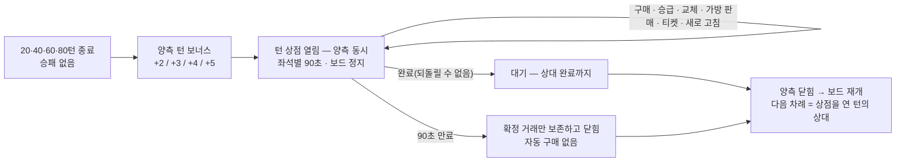

# #295 턴 상점 — 구현 전 분석 (Venus)

- 작성: Venus(Plan · Claude `claude-opus-5-5` high · bypass) · 2026-10-02 · dispatch `ctx_3697141268a5` / task `task_844084a8ab3d` · session `4b47c72e-95d7-4170-a243-04904a5e5f8b`
- 입력: [`references/CJ_COMMENT_20261002.md`](../references/CJ_COMMENT_20261002.md) — "#294 작업 방식과 동일하게 · 턴 상점 UI/UX는 #293 시작 상점과 **동일한 구조** · 객관적 분석 뒤 구현 전 최종 보고". **새 콘티는 없습니다.** 비교 기준은 #293 최종 구현과 #294 상세/공통 UI입니다.
- 상태: **분석 문서**입니다. 구현 계약 · 구현 승인 · 제품 QA PASS가 아닙니다. 구현 승인 게이트는 Mercury의 최종 보고 뒤 CJ입니다.
- 근거 읽기: 코드 · 문서는 **읽기만** 했고 실행 · 테스트 · 브라우저 · 시뮬레이션은 0회입니다. 줄 번호는 `origin/milestone/v0.4.13` `a78a65e` 기준입니다. Notion GDD-13 · 23 · 24는 2026-10-02 02:45 UTC 조회본을 읽기만 했습니다(쓰기 0회).
- 번호 주의: 여기의 #295는 **턴 상점(2026-10-01 신규 범위)** 입니다. 방 핑 · PR #303의 CJ QA PASS는 다른 범위의 이력이며 이 문서의 근거가 아닙니다.

표지: **[CJ]** CJ 원문이 정한 것 / **[현행]** 지금 GDD · 코드의 규칙 그대로 / **[제안]** Venus 권고(확정 아님) / **[미확인]** 정적 읽기로 확정하지 못한 것.

## 0. 한 문단 요약

같은 가게가 두 번 문을 엽니다. 경기 전에는 **넓은 매장**(시작 상점 — 화면 전체, 위에 명패 · 시계 · 지갑, 오른쪽에 전력표)으로, 경기 중 20 · 40 · 60 · 80턴에는 **보드 위에 펼친 간이 좌판**(턴 상점 — 팝업 하나에 제목 · 시계 · 지갑 · 버튼이 따로 놓임)으로 엽니다. 파는 물건과 계산 규칙은 이미 같은 함수 하나(`shopHtml` · `ecoReduce`)인데 **가게 모양만 다릅니다.** CJ 지시는 좌판을 매장과 같은 모양으로 맞추라는 것입니다. 분석 결론은 셋입니다 — ① **규칙 · 수치 · 서버 전송은 바꿀 것이 없습니다**(바꾸면 범위 이탈). ② 일은 대부분 Mars의 화면 틀 재배치입니다. ③ 다만 "동일한 구조"만으로는 정해지지 않는 선택이 **7개** 있고(4장), 그중 CJ 눈으로 확인받을 만한 것은 **3개**(U1 · U5 · U7)입니다.



## 1. 왜 지금 필요한가

#293 · #294로 준비 화면과 메인 화면은 같은 상단 한 줄 · 같은 시너지 열 · 같은 설명 창을 쓰게 됐습니다. 턴 상점만 옛 팝업 머리줄(`shopHead`)과 옛 시너지 두 줄(`shopSynHtml`)이 남아, 한 경기에서 **같은 정보가 세 번째 다른 자리에** 나옵니다. 코드 주석도 이것을 #295로 미뤄 둔 상태입니다(`ui.js:2113` "턴 상점(모달)은 종전 머리줄 그대로(#295 범위)" · `ui.js:2177` "배치 개편은 #295").

## 2. 턴 상점(S05 = M01)의 현행 계약 — 전부 [현행]

이 표는 **바꾸지 않을 것의 목록**입니다. 구현 · QA는 이 표의 단언이 기대값 수정 없이 통과해야 합니다.

| 항목 | 규칙 | 근거 |
|---|---|---|
| 열리는 때 | 20 · 40 · 60 · 80번째 턴의 이동 · 탐색 · 전투 · 연출이 끝난 뒤. 그 턴에 승패가 나면 열지 않음. 4회 뒤에는 없음. 버닝 타임(65턴~) 무영향 | GDD-23 2.1 · `data.js:57` · `core.js:1593-1600` |
| 턴 보너스 | 열기 직전 **양측** 🪙 +2 / +3 / +4 / +5 | `data.js:57` · `core.js:1595` · GDD-24 01 D03 |
| 여는 방식 | 온라인 · PVE는 양측 동시. 핫시트 순차 + 가림은 이력 보존(제품 진입점 없음) | GDD-23 2.3 · `core.js:1598` |
| 진열 | 6칸 고정 · 칸마다 낮은 등급 60% / 높은 40% · 회차 등급 20턴 ★1~2 … 80턴 ★4~5(전설). 산 칸은 **SOLD OUT**, 판 종은 **판매함** 잠금. 후보 고갈이면 빈칸 | GDD-23 7.4 · `data.js:58` · `core.js:1424` · `ui.js:2079-2081` |
| 새로 고침 | 수동만 · 🪙1 · 횟수 제한 없음 · 확인 창 없음. 자동 새로 고침 없음 | GDD-23 7.4 · `core.js:1489-1495` |
| **예비 코인 규칙 없음** | "필드 6칸 몫을 남겨라"는 시작 상점 전용. 턴 상점은 항상 통과 | `core.js:1428` (`kind!=="start"`) · GDD-23 7.5 |
| 신규 구매 | **가방**으로(최대 3 · 구매 · 포획 · 전설 공용). 가방이 가득이면 거부. 확인 창 없음 | GDD-23 7.5 · `core.js:1466` · `1481-1483` |
| 승급 | 보유 동종이 진열되면 차액 또는 동급 합성. **그 자리에서** 오르고 새 최대 HP까지 회복. 가방이 가득이어도 가능. **확인 창 1회 유지**. 턴 상점 전용(시작 상점은 거부) | GDD-23 7.4 · `core.js:1463` · `1469-1475` · `ui.js:2269-2270` |
| 필드 — 살아 있는 하수인 | 교체 대상. **직접 판매 불가**(교체 뒤 가방에서 판매) | GDD-23 7.5 · 7.6 · `core.js:1510` (`!start` 거부) · `ui.js:2092` |
| 필드 — 사망 · 포획당한 칸 | 동결. 구매 · 교체로 채우거나 되살릴 수 없음. 시너지에는 죽은 채 집계 | GDD-23 7.5 · 7.7 · `core.js:1528` |
| 교체 | 살아 있는 필드 하수인 ↔ 가방 말 1:1 · 같은 보드 칸 · HP 그대로(회복 없음) · 횟수 제한 없음. 공개 칸에 비공개 말이 들어오면 "상점에서 교체됨" 표식. 선택 창은 필드 6카드, 닫기는 ✕ · Esc | GDD-23 7.5 · `core.js:1526-1536` · `ui.js:2288-2299` |
| 판매 | **가방 말만.** 원장 100% 환급(포획 0 · 전설 10) · 판 종은 이번 오픈 잠금 · 판매 당시 HP 비율 기록. **확인 창 없음**(#293) | GDD-23 7.6 · `core.js:1520-1524` · `ui.js:2276-2283` |
| 티켓 | **턴 상점에서만 사용.** 살아 있는 왕 · 동료 · 현재와 다른 속성 · 스킬도 바뀜 · HP 유지 · 다음 전투 스냅샷부터 시너지. **확인 창 1회 유지** | GDD-23 7.8 · `core.js:1537-1546` · `ui.js:2300-2303` |
| 상품 8종 | 5종 🪙1 · 수호자 3종 🪙3 · 아이콘 = 설명 팝업 · `[구매]` = 구매 · 활성 판정은 상품별 | GDD-23 7.3 · `data.js:56,61,236` · `ui.js:2086-2088` |
| 시너지 현황 | **지금 보드의 실제 집계**(필드 9칸 · 사망 칸 포함 · 가방 전설 아키타입 +1 · 죽은 동료 수). 거래가 확정될 때마다 다시 셈. 티켓으로 바꾼 속성도 즉시 표시(적용은 다음 전투) | GDD-23 8.2 · `core.js:2307` (`ecoSynView`) · `ui.js:2178-2182` |
| 시간 | **좌석별 90초** · 서버 시계 · 키 `shop:<턴>` · 완료한 좌석은 시계 없음 · 단절 중 정지 | GDD-23 2.3 · 2.4 · `data.js:63` · `room.js:1371-1377` · `1888-1897` |
| 만료 | **확정된 거래만 보존하고 닫힘.** 열려 있던 확인 창(미확정)은 취소. 자동 구매 · 자동 배치 · 자동 새로 고침 **없음** | GDD-23 2.3 · `core.js:1547-1588` (정기 분기) · `ui.js:2247` |
| 완료 | **되돌릴 수 없음.** 상대가 완료하거나 만료될 때까지 대기 → 양측 닫힘 | GDD-23 2.3 · GDD-24 02 M07 · `core.js:1568-1582` · `network.js:804` |
| 복귀 | 보드로. 다음 차례 = 상점을 연 턴의 상대(`sh.next`). 닫힌 상점은 다시 열지 않음 | `core.js:1583-1587` · `1597` |
| 단절 | 게임 타이머 정지 · 모든 입력 잠금(기권 포함) · 유예 60초만 흐름. 상점 조작은 `fieldset disabled` 한 겹 | GDD-23 2.4 · `ui.js:2108-2120` |
| 기권 | 턴 상점 · 완료 대기 중에도 가능(온라인 경제 방) | GDD-24 01 · `network.js:793-805` |
| **상대에게 보이는 것** | "상대가 상점을 이용했습니다" 중립 로그와 "상점에서 교체됨" 표식뿐. 진열 · 구매 · 재화 · 가방 · 시너지 집계 · **턴 상점 90초의 남은 시간** · 상대의 완료 여부는 비공개 | GDD-23 7.9 · `core.js:1234` · `room.js:1866-1880` (자기 좌석 값만) · `room.js:1900-1911` (상점 시계는 공개 시계에 없음) |

## 3. "동일한 구조"가 뜻하는 것 — 현재 두 화면의 차이

### 3.1 무엇이 이미 같고 무엇이 다른가 — 전부 [현행 · 코드 읽기]

| 자리 | 시작 상점(#293 최종) | 턴 상점(지금) | 근거 |
|---|---|---|---|
| 그릇 | 준비 화면 **본문**(화면 전체 · 한 장 세로 스크롤) | 보드 위 **팝업** | `ui.js:1060` / `ui.js:2236` · `network.js:805` |
| 상단 한 줄 | 왼쪽 50% 나 VS 상대 · 오른쪽 50% 시계 · 코인 · ⚙ | 없음. 팝업 머리줄에 `N턴 상점` · 시계 · 코인 · 새로 고침 · `완료`가 2줄 격자 | `ui.js:2214-2216` / `ui.js:2116-2119` · `game.css:990-996` |
| 진행 버튼 줄 | `01 상점 — 02 배치 — 03 완료` + `[다음 단계]` | 단계 없음. `완료`는 머리줄 안 | `ui.js:2217-2218` / `ui.js:2119` |
| 시너지 | **오른쪽 세로 열**(왕국 5 → 아키타입 6 → 왕관 → 활성 전설 · 미달도 표시) | 본문 안 **두 줄 + 왕관 칩**. 전설 개인 칩 없음 | `ui.js:2188-2189` / `ui.js:2178-2182` |
| 새로 고침 | `하수인 구매` 제목 줄 오른쪽 | 팝업 머리줄 | `ui.js:2114` / `ui.js:2118` |
| 본문 순서 | 구매 6 → 필드 6 → 가방 3 → 왕 · 동료 속성 → 아이템 8 | 구매 6 → 필드 6 → 가방 3 → 시너지 → `[🎟 티켓 사용 (N)]` 버튼 → 아이템 8 | `ui.js:2121-2128` |
| 왕 · 동료 | 말 그림 + 속성 아이콘 5개 3줄(무료) | 글자 버튼 팝업 3단(대상 → 새 속성 → 확인) | `ui.js:2101-2105` / `ui.js:2300-2303` |
| 완료 뒤 | 보드 중앙 팝업 "준비 완료 · 상대 기다리는 중…" + 우상단 `준비 취소` | 팝업 "🛒 상점 완료 · 상대가 상점을 마치면 경기가 이어집니다" | `ui.js:1036-1039` / `network.js:804` |
| 나가기 · 기권 | ⚙ 안 `방 나가기` | 팝업 맨 아래 `🏳️ 기권` 버튼 | `ui.js:2216` / `network.js:805` |
| **이미 같은 것** | 진열 카드 · 필드/가방 공통 카드 · 교체 선택 창 · 상품 줄과 설명 팝업 · 하수인 설명 창(8칸 · 스킬 4줄) — 같은 함수라 #293 · #294 변경이 이미 턴 상점에 들어와 있음 | | `ui.js:2076-2094` · GDD-24 "#293 흐름 PASS" 절 '범위' 항목 |

### 3.2 범위 경계

| 구분 | 내용 | 표지 |
|---|---|---|
| **안** | 턴 상점 화면의 틀 · 정보 순서 · 완료 대기 표시. 화면 코드(`demo/js/ui.js` · `network.js` · `demo/css/game.css`) | [CJ] "턴 상점 UI/UX는 시작 상점과 동일한 구조" |
| **밖 — 시작 상점 전용이라 가져오지 않는 것** | `01 상점 — 02 배치 — 03 완료` 진행 단계와 좌석 표식(`seats.step`) · 배치 트레이 · `준비 취소` · 공통 준비 180초 · 예비 코인 규칙과 그 안내 · 필드 직접 판매 · 속성 무료 선택과 `무료` 배지 · 만료 자동 구매/보충 | [CJ] 지시 경계("start prep → place → done 제외") · 2장 [현행] |
| **밖 — 다른 이슈** | 메인 화면(#294 · 완료) · 전투 화면(#296) · 밸런스 수치 · 새 아트 자산 | [현행] |
| **바꾸지 않는 것** | 2장 표 전부 · 서버 좌석 뷰 · Core 거래 판정 | [현행] |

"동일한 구조"를 **글자 그대로** 옮기면 시작 상점 전용 규칙(예비 코인 · 필드 판매 · 180초 공유 시계)까지 딸려 올 위험이 있습니다. 이 문서는 **틀과 정보 순서만** 같게 하고 규칙은 2장 그대로 둔다고 읽습니다. [제안 — CJ 원문에 규칙 변경 지시가 없다는 것이 근거]

## 4. 실제로 정해지지 않은 선택과 최소 기본값

"동일한 구조"만으로 답이 나오지 않는 것만 적습니다. 권고는 모두 **기존 계약 · 기존 부품 재사용**이며 새 규칙을 만들지 않습니다.

| # | 선택 | 권고 기본값 [제안] | 근거 · 위험 | CJ 확인 |
|---|---|---|---|---|
| **U1** | **그릇** — 팝업 유지 vs 시작 상점처럼 화면 전체 | **화면 전체 시트**(상단 한 줄 + 진행 버튼 줄 + 오른쪽 시너지 열 + 한 장 스크롤). 보드는 어차피 정지 상태라 가려도 정보 손실 없음. 게임 단계(`phase "shop"`) · 서버 상태는 그대로 | 팝업 안에는 오른쪽 시너지 열과 50/50 상단 줄이 들어갈 폭이 없어(`#overlayBox`) "동일한 구조"가 성립하지 않음. **위험**: GDD-24는 S05를 "(모달)"로 적고 있어 문서 동기화 필요. 팝업이 닫힐 때 설명 창을 함께 닫던 수명 정리(#293 C'9 · `modal/closeModal`의 `synHelpClose`)를 새 그릇에서도 지켜야 함 | **필요**(시각) |
| U2 | 진행 버튼 줄에 무엇을 두나 — 단계가 없음 | 왼쪽 `N턴 상점` 제목(현행 문구), 오른쪽 `[완료]`(시작 상점의 `[다음 단계]` 자리). **01 · 02 · 03 단계와 좌석 표식은 두지 않음** | 상대의 완료 여부는 지금 비공개(`room.js:1871` 자기 좌석 `done`만). 표식을 올리면 **새 공개 정보** → 요구가 생기면 [기획 필요] | 불필요 |
| U3 | 시계 | **현행 좌석별 90초 그대로**, 자리만 상단 오른쪽 반(시계 · 코인 · ⚙). 공통 마감으로 바꾸지 않음. 완료한 좌석 화면에는 시계 없음(현행) | #293 계약 1장 · #294 계약 3장이 "정기 상점 90초 불변 · 비공개"를 명시. 시작 상점 시계(공통 · 공개)와 **성격이 다르다는 점**은 QA 주의 항목 | 불필요 |
| U4 | 기권 버튼 자리 | 팝업 맨 아래 `🏳️ 기권`을 **⚙ 메뉴**로(메인 화면 ⚙의 기존 "나가기 (기권 확인)"과 같은 자리 · 같은 확인 창 · 같은 잠금) | `ui.js:980` 메인 ⚙와 일관. 동작 · 단절 중 잠금(`network.js:793-800`)은 불변. 위치 이동뿐 | 불필요 |
| **U5** | **완료 뒤 대기 화면** | 시작 상점의 중앙 상태 팝업과 같은 모양으로 **"상점 완료 · 상대 기다리는 중…"**. 단 **취소 버튼 없음**(완료는 되돌릴 수 없음 — 2장). 기권은 ⚙에 유지 | 시작 상점은 `준비 취소`가 있어 **구조는 같고 동작은 다름**. 같은 모양이 "취소할 수 있다"는 기대를 줄 수 있어 문구 · 버튼 부재를 분명히 해야 함 | **필요**(문구 · 모양) |
| U6 | 시너지 열의 값 | 열은 `synRailHtml` 재사용, **값은 현행 `ecoSynView`**(거래마다 다시 세는 상점 집계). 왕관 · 활성 전설 칩은 기존 `synExtraChips` 그대로 추가(#293 계약 3.3과 같은 목록) | `synRailHtml`은 지금 `phase==="setup"`일 때만 `ecoSynView`를 읽음(`ui.js:2188`) → 턴 상점 분기 한 줄 필요. [미확인] 턴 상점 중 `synView`와 `ecoSynView`가 같은 값을 내는지(티켓 직후 등)는 구현 때 확인 — 다르면 GDD-23 8.2에 따라 `ecoSynView`가 기준 | 불필요 |
| **U7** | **왕 · 동료 구역** — 시작 상점은 속성 아이콘 줄, 턴 상점은 글자 팝업 3단 | 같은 자리에 **같은 3줄**(말 그림 + 속성 아이콘 5개). 아이콘을 누르면 **기존 티켓 사용 확인 창 1회** → 기존 `shopTicket`. 제목 줄 배지는 현행 `🎟 ×N`. 티켓 0장 · 사망한 왕/동료 · 현재 속성은 비활성 + 사유(접근성 이름) | 규칙은 그대로(생존 · 다른 속성 · 확인 1회 · HP 유지). #293 CJ 방향("글자 형식 → 읽기 좋은 카드")과 일치하고 글자 팝업 2단이 사라짐. **대안(더 작음)**: 현행 `[🎟 티켓 사용 (N)]` 버튼을 그 자리에 그대로 둠 — 구조는 덜 같음. 사망한 동료 줄을 보일지(흐리게) 숨길지는 시각 결정 | **필요**(대안 중 택일) |

정해져 있어 **선택이 아닌 것**(참고): 본문 순서는 시작 상점과 같게(5장) · 새로 고침은 `하수인 구매` 제목 줄로 · 필드 카드에 `[판매]` 없음 · 가방 카드 `[교체][판매]` 한 줄 · 승급 배지와 할인 가격 표기 유지 · 교체 창과 설명 팝업은 손대지 않음.

작은 관찰(변경 권고 아님): 턴 상점의 `필드 n/6` 제목은 계산식상 **항상 6/6**입니다(`ui.js:2107,2124` — 빈칸은 시작 상점에만 생김). 죽은 칸이 있어도 6/6이라 정보가 없습니다. 생존 수로 바꾸는 것은 표시 의미 변경이라 이번 권고에 넣지 않았습니다 — CJ가 원하면 한 줄 수정입니다.

[미확인] 이모티콘: GDD-24는 "상점 모달이 열려 있어도 보낼 수 있다"고 정합니다. 이모티콘은 별도 고정 층(`#emoteLayer` · `ui.js:1165-`)이라 그릇을 바꿔도 남을 것으로 보이나, 새 시트 위에서 버튼이 가려지지 않는지는 **실행 확인이 필요**합니다(정적 읽기로 확정 못 함). 기능 · 잠금 · 간격 규칙은 불변입니다.

## 5. 의도하는 정보 순서 [제안 — U1 · U7 권고안 기준]

```
┌──────────────────────────────────────────────┬────────┐
│ ① [내 대표] 이름 VS [상대 대표] 이름 │ ⏱90초 · 🪙 · ⚙ │        │  ← #294 상단 한 줄 그대로(50/50)
├──────────────────────────────────────────────┤ ⑨ 내   │
│ ② 20턴 상점                         [ 완료 ] │ 시너지 │  ← 진행 버튼 줄(단계 표식 없음)
├──────────────────────────────────────────────┤  열    │
│ ③ 하수인 구매                  [새로 고침 🪙1] │ 왕국 5 │
│    진열 6행 (등급 · 그림 · 이름 · 왕국/아키타입 │ 아키 6 │
│    · HP · 승급 배지 · 가격 | SOLD OUT | 판매함) │ 왕관   │
│ ④ 필드 6  (사망 칸은 사망 표시 · 판매 없음)   │ 전설   │
│ ⑤ 가방 n/3  [교체][판매]                      │        │
│ ⑥ 왕·동료 속성            🎟 ×N               │        │
│ ⑦ 아이템 8  (아이콘 = 설명 · [구매 🪙n])      │        │
└──────────────────────────────────────────────┴────────┘
 ⑧ 단절 시 X01 + 조작 잠금(현행)
```

| 순서 | 내용 | 값의 원천 | 표지 |
|---|---|---|---|
| ① | 양측 신원 · **내** 남은 시간 · **내** 코인 · ⚙(기권) | `topBarHtml` · 좌석 시계 `shop` · `S.eco.coins[p]` | [현행 부품] · U3 · U4 |
| ② | `N턴 상점` · `[완료]` | `sh.turn` · `shopDone` | U2 |
| ③ | 진열 6 + 새로 고침 | `sh.slots[p]` · `ECO.refresh` | [현행] |
| ④ | 필드 6(살아 있음 / 사망) | 내 필드 말 | [현행] |
| ⑤ | 가방 3(빈칸 `+`) | `S.eco.bag[p]` | [현행] |
| ⑥ | 왕 · 동료 + 티켓 수 | 내 왕 · 동료 · `S.eco.tickets[p]` | U7 |
| ⑦ | 상품 8 | `ECO.goods` · `ecoGoodPrice` | [현행] |
| ⑨ | 내 시너지 열 | `ecoSynView` + `synExtraView` | U6 |

상대의 것은 ①의 **이름 · 계정 대표 그림**뿐입니다(이미 공개된 값). 상대 코인 · 시계 · 진행 · 구매는 어디에도 없습니다.

## 6. 상태표 — 구현 승인용

| 상태 | 화면 | 조작 | 시계 | 상대에게 | 표지 |
|---|---|---|---|---|---|
| T0 닫힘(평소) | 보드. 행동 줄 `상점 · N턴 후 열림` / `예정 없음`, 누를 수 없음 | 없음 | 보드 시계 | — | [현행] `ui.js:883-885` |
| T1 열림 · 미완료 | 5장 시트 | 구매 · 승급(확인) · 새로 고침 · 교체 · 가방 판매 · 티켓(확인) · 상품 구매 · 설명 창들 · 완료 · 기권 | 내 90초 흐름 | 중립 로그뿐 | [현행 규칙] + 5장 틀 |
| T1a 확인 · 선택 창 열림 | 승급 확인 / 티켓 확인 / 교체 선택 | 확정 또는 닫기(닫기는 요청 0) | 계속 흐름 | — | [현행] |
| T1b 거부 | 같은 시트 + 사유 토스트(코인 부족 · 가방 가득 · 품절 · 판매함 · 진열 바뀜 · 더 올릴 수 없음 · 교체/대상 불가 · 티켓 없음) | 다시 선택 | 계속 | — | [현행] `core.js:1457-1541` |
| T2 내 완료 · 상대 미완료 | 대기 표시(U5) | 기권만 | 내 시계 없음 | — | [현행 규칙] · U5 |
| T3 내 90초 만료 | T2와 같음(확정 거래 보존 · 열린 확인 창 취소) | 기권만 | 없음 | — | [현행] |
| T4 양측 완료/만료 | 보드로 복귀 · 다음 차례 시작 | 보드 규칙 | 보드 시계 새로 시작(현행) | "상점을 이용했습니다" 로그 · 교체 표식 | [현행] |
| T5 단절(누구든) | X01 "상대 연결 대기" + 조작 전부 비활성(기권 포함) | 없음(설명 창 닫기는 가능) | 정지 · 유예 60초만 | — | [현행] |
| T6 재연결 | 서버 좌석 뷰대로 T1 또는 T2 복구 · 남은 시간부터 | — | 남은 값부터 | — | [현행] GDD-24 02 M07 |
| T7 경기 종료(기권 · 몰수) | 결과 화면. 시트 · 설명 창 · 확인 창 모두 닫힘 | — | — | — | [현행] |
| 오프라인(PVE) | 같은 시트. AI는 즉시 완료, 사람 90초는 기기 시계 | T1과 같음 | 기기 90초 | — | [현행] `ui.js:2239-2251` |

## 7. 다음 단계 — 담당과 최소 AC [제안]

Ponytail lite 검토 결과: **새 파일 · 새 창 체계 · 새 서버 필드 · 새 의존성 · 새 아트 자산이 필요하지 않습니다.** 기존 `topBarHtml` · `synRailHtml` · `gearHtml` · `shopHtml` · 중앙 상태 팝업 스타일의 재배치입니다.

| 담당 | 일 | 비고 |
|---|---|---|
| **Mercury** | CJ에게 U1 · U5 · U7 확인을 포함한 구현 전 최종 보고 | 승인 게이트 |
| **Venus** | CJ 승인 뒤 구현 계약(이 문서의 권고 → 확정 표기) + GDD-23 · 24 · 13 동기화(S05 "(모달)" 표기 포함) | 승인 전에는 Notion 쓰기 없음 |
| **Earth** | 새 자산 **없음** 예상. 320 / 390px에서 상단 50% 안의 시계 · 코인 · ⚙ 배치와 대기 표시 토큰만 기존 #293 · #294 `UI_CONTRACT.md`에서 확인 | 필요 시에만 기동 |
| **Mars** | `demo/js/ui.js` · `network.js` · `demo/css/game.css` — 턴 상점 그릇 · 머리줄 교체, 시너지 열 분기(U6), 왕 · 동료 줄(U7), 기권 → ⚙(U4), 대기 표시(U5), 설명 창 수명 정리 유지 | Core(`core.js` · `data.js`) 변경 **없음** 예상 |
| **Jupiter** | 코드 변경 **없음** 예상. 확인만: 좌석 뷰에 상대의 상점 완료 · 시계 · 진열이 새로 나가지 않음 | 어긋날 때만 수정 |
| **Saturn** | 읽기 전용 독립 QA. `QA_MINIMUM_POLICY.md` — 자동 검증 우선, 시각은 대표 대조 1회 | CJ 새 콘티가 없으므로 시각 기준은 **#293 최종 화면** |

최소 AC(계약 때 번호 확정):

1. **구조** — 턴 상점에 #294 상단 한 줄(50/50), 진행 버튼 줄(`N턴 상점` + `완료`), 오른쪽 내 시너지 열이 있고, 본문 순서가 구매 → 필드 → 가방 → 왕 · 동료 → 아이템이다. 옛 `shopHead` 머리줄과 본문 안 시너지 두 줄이 없다.
2. **규칙 불변** — 2장 표의 기존 단언(가방 구매 · 가방 가득 거부 · 승급 확인 · 필드 판매 거부 · 가방 판매 즉시 · 교체 1:1 · 티켓 조건과 확인 · 예비 코인 규칙 없음 · 만료 = 확정 거래 보존 · 완료 되돌리기 없음 · 복귀 차례)이 **기대값 수정 없이** 통과한다.
3. **시계** — 표시 값이 좌석 시계 `shop`의 값이고, 화면이 새 90초를 만들지 않으며, 완료한 좌석에는 시계가 없다. 단절 중 정지한다.
4. **시너지 열** — 값이 `ecoSynView`와 같고 거래 · 티켓 확정 직후 갱신된다. 왕관 · 활성 전설 칩 조건은 #293 AC 12와 같다.
5. **비공개** — 좌석 뷰와 화면 어디에도 상대의 코인 · 진열 · 구매 · 가방 · 시너지 · 상점 시계 · 완료 여부가 새로 나오지 않는다.
6. **대기 · 종료** — 완료 뒤 대기 표시에 취소 수단이 없고 기권은 가능하다. 양측 완료/만료 시 보드로 돌아오며 열려 있던 설명 창 · 확인 창이 남지 않는다.
7. **단절** — 턴 상점에서 X01이 뜨면 모든 조작(기권 포함)이 비활성이고, 재연결 뒤 서버 상태대로 복구된다.
8. **시작 상점 무변화** — #293 AC 1~18과 #294 AC가 기대값 수정 없이 통과한다(같은 `shopHtml`을 쓰므로 회귀 위험이 가장 큰 곳).
9. **폭** — 320 / 390px에서 가로 넘침이 없고 누르는 곳이 44px 이상이다.

테스트는 **기존 파일만** 씁니다(#293 계약 7장 원칙). 옛 머리줄 · 턴 상점 문구를 직접 보는 후보: `demo/test/regression/smoke_issue236.js`(7곳) · `smoke_issue293.js`(2곳) · `demo/test/integration/smoke_public_eco_live.js`(1곳) — 문자열 검색 인용이며 실제 단언 내용은 구현 Worker가 확인합니다. 고쳐도 되는 것은 **옛 화면 구조 기대값뿐**이고 규칙 단언은 약화하지 않습니다.

## 8. 위험 — 냉정하게

| 위험 | 내용 | 완화 |
|---|---|---|
| 기준 그림 없음 | CJ 새 콘티가 없어 "동일한 구조"의 해석이 Venus 권고에 의존합니다. U1 · U5 · U7이 CJ 기대와 다르면 REVISE가 납니다(#293 · #294 모두 CJ QA REVISE가 각각 최소 2회 있었습니다) | 최종 보고에서 세 항목을 **명시적으로** 확인받기 |
| 규칙 딸려 오기 | 시작 상점 전용 가드(예비 코인 · 필드 판매 · 무료 속성)가 `start` 분기로 갈려 있어, 틀을 합치다 분기를 잘못 건드리면 규칙이 바뀝니다 | AC 2 · 8. Core 무변경을 계약에 명시 |
| 그릇 변경의 수명 문제 | 팝업의 닫힘에 묶여 있던 정리(설명 창 · 시계 `shopClockStop` · 확인 창)가 새 그릇에서 빠질 수 있습니다. #293에서 같은 종류의 잔존 버그가 실제로 있었습니다(C'9 · X01 잔존) | AC 6. 공용 정리 경로 재사용 |
| 시계 오해 | 상단 같은 자리에 시작 상점은 공통 · 공개 시계, 턴 상점은 개인 · 비공개 시계가 옵니다. 구현 · QA가 공통 마감으로 오인할 수 있습니다 | AC 3 · 5 |
| 대기 화면 오해 | 시작 상점과 같은 모양인데 취소가 없습니다 | U5 문구 · CJ 확인 |
| 좁은 화면 | 320px 오른쪽 반(약 156px)에 시계 · 코인 · ⚙ + 시너지 열 폭 — #293에서 성립한 배치이나 턴 상점의 코인은 자릿수가 더 클 수 있습니다 | AC 9 · Earth 확인 |

## 9. 확정 / 추론 / 미확정 구분

- **확정(CJ)**: 턴 상점 UI/UX는 #293 시작 상점과 동일한 구조 · #294 방식으로 진행 · 구현 전 최종 보고가 먼저.
- **확정(현행 규칙 · 코드와 GDD 일치 확인)**: 2장 표 전부, 3.1의 차이 목록.
- **추론(Venus 권고)**: 3.2의 경계 해석, 4장 U1~U7 기본값, 5 · 6 · 7장.
- **미확정**: U1 · U5 · U7의 CJ 선택 / 턴 상점 중 `synView` = `ecoSynView` 여부(U6) / 새 그릇에서 이모티콘 버튼 가림 여부 / 영향받는 테스트 단언의 정확한 위치.
- **이 문서가 하지 않은 것**: 실행 검증, 시각 확인, QA 판정. PASS를 주장하지 않습니다.

운영 참고: 이 WorkTree의 `CLAUDE.md`는 Mercury · Saturn 모델을 `gpt-6-sol`로 적고 있고 root `C:/Users/pc_77/orca/Digit-Duel/CLAUDE.md` · `WORKER_MODELS.md`는 `gpt-6.1-sol`입니다. dispatch 지시대로 root를 현행 권위로 읽었으며 Venus 실행값(`claude-opus-5-5` high)은 양쪽이 같습니다.
