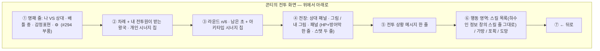
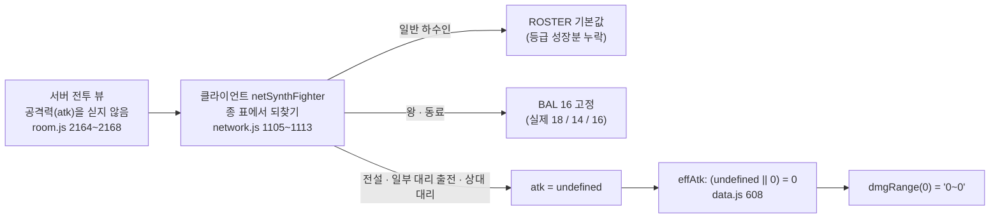

# #296 배틀 Flow — 구현 전 분석

- 작성: Venus(Plan · Claude `claude-opus-5-5`) · 2026-10-02 · dispatch `ctx_7d63d3b8675a` / task `task_735c50aa2be0`
- 상태: **분석 보고**입니다. 구현 계약 · 제품 QA PASS · 병합 승인이 아닙니다. CJ 결정(5장) 뒤 구현 계약으로 치환합니다.
- 근거: [Issue #296 본문](https://github.com/ChangjoSung/Digit-Duel/issues/296)(#297 이관 포함) · [CJ 콘티 원본](../references/CJ_CONCEPT_CONTI_20261002.png)(직접 확인) · [#293 계약](../../293/Venus/implementation-contract.md) · [#294 계약(REVISE2 포함)](../../294/Venus/implementation-contract.md) · [#295 최종 기록](../../295/Mercury/cj-revise-report.md).
- 현행 GDD 규칙(코디네이터가 2026-10-02 Notion을 읽어 전달 `msg_9988ff70a5a8` — Venus가 Notion을 직접 다시 읽지는 않았습니다): GDD-23 5.6 "시너지 칩은 **내 전투원 것만**, 상대 것은 숨기고 발동한 효과는 상태 아이콘 · 전투 로그로만" / GDD-23 7.9 · GDD-24 00.7 "전투 중 양쪽 전투원의 실제 HP/최대 HP · 방어막은 공개, 쓰지 않은 스킬 · 등급 · 정확한 시너지는 비공개" / 보드 30초 공개 예외는 **전투 행동 60초를 상대에게 공개하지 않음**.
- 읽기 방식: 코드는 **읽기만** 했습니다. 실행 · 테스트 · 브라우저 0회. 줄 번호는 `origin/milestone/v0.4.13` `e48a8aa` 기준입니다.

표지: **[CJ]** 이슈 본문 · 콘티 손글씨가 정한 것 / **[현행]** 지금 코드 · 승인된 규칙 / **[권고 해석]** 코디네이터 · Venus가 구현 가능하게 좁힌 안(CJ 확정 아님) / **[추론]** 정적 읽기 결론(재현 전) / **[기획 필요]** CJ 결정 없이는 못 정하는 것.

## 0. 한 문단 요약

전투 화면을 권투 중계 화면에 비유하면, 지금은 **자막(선수 명패 · 라운드 · 전적표)이 작은 글씨 한 덩어리**이고, 기술 버튼에는 "이름 + 숫자 범위"만 붙어 있어 무엇이 쿨인지 · 무슨 효과인지 한눈에 안 들어옵니다. 콘티는 이것을 **#293 · #294에서 이미 만든 부품**(양측 명패 줄 · 능력치 칸 · 스킬 줄 · 아이템 격자)으로 다시 조립하라는 그림입니다. 새 규칙은 필요 없습니다 — **다만 콘티의 손글씨 "상대도 공개"는 현행 비공개 규칙과 충돌**하므로 CJ 결정이 필요합니다(5장 D1 · 작은 확인 2건 D2 · D3). `0~0`은 [추론] **온라인 표시 전용 오류**로 보입니다: 서버가 전투 화면에 공격력을 싣지 않아 클라이언트가 종 표에서 되찾는데, **전설(마녀 포함)은 그 표에 없어 공격력이 0으로 처리**됩니다. 실제 피해는 서버가 계산하므로 판정은 영향받지 않는 것으로 읽힙니다.

## 1. 요구 · 현행 · 해석 구분

| # | 내용 | 출처 | 현행 코드 | 처리 |
|---|---|---|---|---|
| 1 | 기술 이름 · 대상 · 효과 · 예상 피해 · 쿨/사용 가능을 모바일에서 구분 | [CJ] 이슈 AC | 버튼 한 줄 `이름 a~b (쿨N)` + ⓘ 토글 — `ui.js` 1657 · 1664 | 스킬 줄 재사용(3.4) |
| 2 | `0~0` 재현 조건 · 원인 · 표시/판정 영향 구분 | [CJ] 이슈 AC | 2장 | 2장 |
| 3 | 마녀 상향 · 전투/피해/쿨/차례/비공개/시계 규칙 변경 **금지** | [CJ] 이슈 본문 | — | 불변 조건 |
| 4 | 상단 = 같은 양측 명패 · `배틀중` · 감정표현 · ⚙ · "가운데 정렬(모든 구간)" | [CJ] 콘티 | 전투 창 제목은 `▶ 나의 턴!` 한 줄(`ui.js` 1709) | `topBarHtml` 재사용(`ui.js` 1010) |
| 5 | 차례 줄 오른쪽 = "해당 하수인에게 적용되는 왕국 · 개인 시너지", 둘째 줄 = "아키타입 시너지" | [CJ] 콘티 | `battleSynChips`(1403)가 받는 왕국 1 + 달성 아키타입을 한 줄로 | 같은 값 · 두 줄 배치. 전설 개인 칩은 `synExtraView`(`core.js` 2318) |
| 6 | 라운드 `1/6` · 남은 초 | [CJ] 콘티(숫자는 예시) | 1710~1711 그대로 있음 | 배치만 |
| 7 | 전투원 패널: 등급 / 하수인 이름 / 닉네임 · **HP와 방어막 한 줄** · **스탯 두 줄** | [CJ] 콘티 | 이름 · 배지 · HP 바 · 방어막 바 · HP 숫자(1591~1596). 스탯 없음 | 3.3 |
| 8 | 손글씨 원문 **`상대도 공개`** — 화살표가 상대 패널(이름 · HP 줄 · 스탯 칸 6개)을 가리킴 | [CJ] 콘티 손글씨(글자 그대로) | **상대 스탯은 어느 뷰에도 없음**(금지 단언 있음 · GDD-23 7.9) | **5장 D1 — CJ 결정 필요.** 손글씨는 "무엇을" 공개하는지(패널 전체인지 · 스탯 칸까지인지 · 시너지 가산 포함인지) 적지 않았습니다. "스탯 6칸까지"는 그림 위치에서 읽은 **해석**입니다 |
| 9 | "하수인마다 어울리는 색상으로 전장 변경" | [CJ] 콘티 | 속성색 토큰 원형(1626) | [권고 해석] 속성 5색 + 무속성 중립(기존 `--fire` 등 CSS 변수). 종별 색 · 새 배경 그림은 만들지 않음 — Earth 확인 |
| 10 | 전투 상황 메시지 | [CJ] 콘티 | `#msgBox`(1714) | 문구 그대로 · 자리만 |
| 11 | "하수인 정보 스킬창 그대로" | [CJ] 콘티 | `unitSkillRows`(1512) — #294 REVISE2 | 그 줄을 **선택 가능한 줄**로 재사용 |
| 12 | "가방도 구현된 아이템 표시 그대로 가독성 좋게" | [CJ] 콘티 | 전투 가방은 글자 버튼(1694) · 가방 창은 `ownGridHtml`(2062) | 격자 재사용 + 기존 사용 버튼 |
| 13 | "포획 · 도망가기 마찬가지" | [CJ] 콘티 | 글자 안내 + 버튼(1724~1725) | 같은 카드 모양으로 정돈. **코드에 미니게임은 없습니다**(검색 0건) — 확률 판정 그대로 |
| 14 | `← 뒤로` | [CJ] 콘티 | 1726 그대로 | 유지 |

콘티 숫자(44초 · 165/165 · 20 · 5% 등)는 자리 예시이며 화면에 옮기지 않습니다(#294 4.1과 같은 원칙).

## 2. `0~0` — 원인 분석 [추론 · Mars가 재현으로 확정]

용어: **위력 범위** = 버튼 옆 `a~b`. 계산은 `dmgRange(slotPow(f,sk))` — 공격력 × 스킬 % 에 분산 ±20%만 씌운 값입니다(`core.js` 2876 · `data.js` 189~190 · 608).

| 경우(온라인 공개 방) | 화면 표기 | 실제 값 | 근거 |
|---|---|---|---|
| **전설 본체**(용 · 마녀 · 사신) — 내 것 · 상대 것 모두 | **`0~0`** | 35 / 32 / 40 기준 | 서버가 `rosterId`에 `L-WITCH` 등을 실음(`room.js` 2195) → `ROSTER.find` 실패(`network.js` 1098) → 1107~1112 어느 분기도 안 탐 |
| 상대의 대리 출전(포획 · 가방 말) | **`0~0`** | 모름(비공개) | 주석은 `"?"` 표기를 의도(1094)했지만 `effAtk`가 0으로 바꿔 `"?"` 분기(2876)에 못 감 |
| 내 대리 출전(가방 말) | `0~0` 가능 | 그 개체 값 | 1110의 `p.cap` 대조가 가방 개체에 맞는지 미확인 — **Mars 확인** |
| 내 일반 하수인 ★2 이상 | 낮게 표기 | `gradeAtk`(등급당 +10%) | 1107이 `rd.atk`(★1 값)을 씀 — `0~0`은 아니지만 **같은 원인의 불일치** |
| 내 동료(암살자 18 · 방패병 14) | 16 기준 표기 | 18 / 14 | 1108 `BAL.ally.atk` |
| 오프라인(PVE · 핫시트) | 정상 | — | 전투원이 실제 말 객체 |

- **판정 영향** [추론]: 없음. 공개 방 클라이언트는 피해를 계산하지 않고(`network.js` 1091), 서버 Core가 실제 말로 `slotPowRaw`를 계산합니다(`core.js` 2840). `synAtk`만 2026-09에 소유자 전용으로 보강됐고(`room.js` 2205) 그때 `atk`는 빠졌습니다. "유도 가능"이라는 근거(2164)는 등급 · 전설 · 동료 역할이 생기기 전의 것입니다.
- **CJ 제보와의 연결** [추론]: `0~0`과 "마녀가 약하다"는 같은 2026-09-29 플레이 테스트 제보입니다. 마녀의 공격 스킬 3개가 전부 `0~0`으로 보였을 가능성이 있습니다 — 재현으로 확인할 항목이며, 마녀 상향 폐지 결정과는 무관합니다.
- **합법적인 0 · 비피해와의 구분** [현행]:

| 종류 | 예 | 올바른 표기 |
|---|---|---|
| 위력 %가 있는 스킬(`pct>0`) | 기본기 · 2차 · 독약 병 | 범위 숫자. **`0~0`은 어떤 경우에도 오류**(전투원 공격력은 0이 될 수 없음) |
| 비피해 스킬(`pct` 없음) | 달군 비늘 · 변덕 주문 · 맑은 물 | 숫자 없음(현행 1657이 이미 생략) |
| %가 아닌 피해 | 사신의 낫(즉사) · 해일 예고 · 이끼 잠식 · 번식 포자 | 숫자 없음 + 설명 원문 |
| 조건부 배율 · 고정 추가 | 심연의 일격 150/250 · 천둥 낙인 · 분화 · 방전 | 기본 % 범위 + 설명 원문(범위는 **하한 성격**) |
| 결과가 0 | 회피 · 환영 무도 무효 · 방어막이 전부 흡수 | 전투 메시지의 일(미리보기 아님) |
| 공격력을 모름 | 상대 대리 출전 | `?` |

- **권고 수정 경로(최소)**: ① Jupiter — 전투 뷰의 **자기 전투원에만** `atk` 한 칸(`synAtk` 옆 · 내 말의 `atk`는 이미 `you.pieces`로 가므로 새 노출 아님). 클라이언트는 이미 `sd.atk`를 먼저 읽습니다(1105). ② Mars — 상대 전설은 공개 상수 `LEGEND_BASE`로, 끝내 모르면 `?`(공격력이 숫자가 아닐 때 `effAtk`를 거치지 않게 표기 한 곳에서 가드). Core의 `effAtk` · `dmgRange` · 피해 식은 손대지 않습니다.

## 3. 화면 계약 초안 — 재사용 경로

### 3.1 상단 · 차례 · 시계

| 자리 | 내용 | 재사용 | 표지 |
|---|---|---|---|
| 명패 줄 | 왼쪽 50% `나 VS 상대`, 오른쪽 50% `배틀 중` · 감정표현 · ⚙ | `topBarHtml` · `idHeadHtml`(#294 1장) · #295의 "창 맨 위에 붙이기" | [CJ] |
| 차례 | `나의 턴!` / `상대 턴!`(핫시트 `P1 턴!`) | `fxTurnLabel`(735) | [현행] |
| 시너지 칩 | 첫 줄 = 받는 왕국 + 내 전설 개인, 둘째 줄 = 달성 아키타입. **내 전투원 것만** | `battleSynChips` · `synExtraView` | [CJ] + [현행 7.9] |
| 라운드 | `라운드 n/최대` | `battleMaxRounds` | [현행] |
| 시계 | 내 행동 차례: 전투 60초. 상대 차례: 현행 `⏳ 상대 응답 대기` | `turnClockText("battle")` | [현행] — 전투 60초의 상대 공개는 #294 3.1에서 **명시적으로 제외**. 바꾸지 않음 |

### 3.2 전투 상태표

| 상태 | 온라인 내 화면 | 행동 영역 | 비공개 경계 |
|---|---|---|---|
| 내 행동 선택 | 내 스킬 전부(잠긴 등급 줄 포함) · 가방 · 포획 · 도망 활성 | 4메뉴 → 하위 → `← 뒤로` | — |
| 상대 행동 선택 | 대기 표시 | 상대의 **공개된 스킬만** 읽기 전용 + `? 미공개` 한 줄(현행 1651 · 1666). 상대 아이템 · 패키지 · 볼 수량 비공개(1694 · 1701 · 1724) | 칸 수 = 등급이므로 미공개 칸을 개수만큼 그리지 않음(`room.js` 2116~2133) |
| 판정 재생(메시지 · 연출) | 메시지 줄 진행 · HP/방어막 갱신 | 전부 비활성(`busy`, 1566) | 사용한 스킬은 그 순간 공개(`core.js` 2788) |
| 번개 꼬리 추가 공격 | 스킬 선택만(1580) | 가방 · 포획 · 도망 비활성 | 허용 칸은 소유자에게만(`room.js` 2220) |
| 공격 수단 없음 | 안내 + `턴 종료` — **소유자 화면에만**(1644) | — | 상대에게 "전부 막힘"을 알리지 않음 |
| 왕 · 동료 본체 | 같은 스킬 줄(잠긴 줄 없음) | — | 상대 동료 역할은 공개된 기술로만 |
| 대리 출전(포획 · 가방) | 이름 `대리 …` · 종 그림(공개 범위 현행) | 같음 | 상대 대리의 공격력은 `?` |
| 포획 | 조건 불충족 사유는 소유자에게만(1724) | 버튼 1개 · 성공률 | 볼 수량 비공개 |
| 도망 | 성공률(30% / 수호자 70%) · 실패 페널티 문구 | 버튼 1개 | — |
| 시한 만료 | 늦은 입력 잠금(`turnClockLate`, 1632) → 서버 자동 처리 | 화면은 명령을 만들지 않음 | — |
| 단절 정지 | 기존 X01 오버레이 · 시계 정지 | 입력 잠금 · 읽기 전용 창은 열림 | — |
| PVE AI 차례 · 핫시트 | 마스킹 기준 = 소유자 관측(`viewerIsOwner`, 1634) | AI 재고 비공개 | 오프라인도 같은 allowlist |

### 3.3 전투원 패널

| 줄 | 내용 | 원천 | 표지 |
|---|---|---|---|
| 1 | 등급(색 · 접근성 이름) / 이름 / 소유자 닉네임 | 등급: 내 것 `grade`, 상대 것은 #293 보드 공개 값 · 이름 `fighterName` | [CJ] · [현행] |
| 2 | `♥ 현재/최대` + 방어막 수치를 **한 줄**(바 1개 위에 겹침) | 양쪽 실제 값(#262 · `room.js` 2142~2143) | [CJ] |
| 3~4 | 스탯 **3칸 × 2줄**: 공격 · 방어 · 속도 / 회피 · 치명타 · 상태 부여 | 내 것: `unitStatChips`(1503)의 값 그대로 | [CJ] 콘티 그림 |
| 상태 | 화상 · 약화 등 적용 효과(양쪽 공개) | `stIcons`(`core.js` 2895) | [현행] |

- **칸 수 해석** [권고 해석 · 5장 D3]: #294 설명 창은 8칸 4×2이지만 콘티 전투 패널은 손글씨 `HP와 방어막 표시 한줄` · `하수인 스텟 두줄`과 함께 **HP 줄 + 6칸(3×2)**으로 그려져 있습니다. 8개 중 HP는 줄 2가, 시작 방어막은 전투가 시작되면 실제 방어막 수치가 대신하므로 빠지는 값이 없습니다. 값의 원천은 어느 쪽이든 #294의 `unitStatChips`입니다.
- **스탯은 기본 값** [권고 해석]: #294와 같이 말 자체의 값을 보이고, 시너지 가산분은 칩이 설명합니다. 가산된 숫자를 패널에 넣으면 상대 쪽에서 필드 구성이 역산됩니다(`ui.js` 1635 주석의 같은 이유).
- 상대 패널의 스탯 칸은 **D1 결정 전에는 값을 넣지 않습니다.** 칸을 두더라도 `비공개`로 표기하고, 종 표 · 기본값에서 계산해 채우지 않습니다(#294 보드 설명 창의 금지와 같은 원칙이지만 근거는 전투 뷰 직렬화 — `room.js` 2151~2161 — 입니다).

### 3.4 스킬 목록

`unitSkillRows`의 줄(이름 · ★ · 위력 % · 쿨 · 남은 쿨 · 잠김 · 설명 원문)을 그대로 쓰고 전투에서만 두 가지를 더합니다.

| 더하는 것 | 내용 |
|---|---|
| 위력 범위 | `pct`가 있는 줄에 `a~b`(2장 규칙). 이름표는 **`위력`** — 5장 D2 |
| 사용 상태 | `사용 가능` / `쿨 N` / `봉인`(+사유 `reaperWhy`) / `불가`(조건 · 전투당 1회 · 수면 포자) / `🔒 ★N 필요`. 판정은 현행 `slotUsable` · `reaperWhy` 그대로. 색만으로 구분하지 않음(글자 + 흐림) |

- **대상 · 효과**: `SKILLS`에 대상 필드가 없습니다. 1대1 전투라 설명 원문이 이미 "자기 …" / "대상 …"으로 구분합니다. **대상 칸을 새 데이터로 만들지 않고 설명 원문을 줄 안에 항상 보이게** 합니다(현행은 ⓘ를 눌러야 보임). 문구 축약은 GDD-23 6.3 개정이라 범위 밖입니다(#294와 같은 판단).
- 줄 전체가 누르는 곳(44px 이상), 잠긴 · 불가 줄은 `disabled`. 별도 ⓘ 버튼은 설명이 항상 보이면 불필요 — 삭제 후보.

### 3.5 가방 · 포획 · 도망

| 메뉴 | 표시 | 불변 |
|---|---|---|
| 가방 | `ownGridHtml` 모양 격자(아이콘 · 이름 · `×n`) + 사용. 수호자 3종은 같은 격자 | 라운드당 1회 · 전투당 버프 1개 · 시간의 수호자 1라운드 전용 · 행동 미소모 |
| 포획 | 조건 · 성공률 · 보유 볼(소유자만) 카드 1장 + 버튼 | `ballWhy` 판정 · 라운드당 1회 |
| 도망 | 성공률 · 실패 페널티 카드 1장 + 버튼 | `fleeProbOf` · 페널티 규칙 |

## 4. 수용 기준 초안(좁게)

1. **`0~0` 없음** — 온라인 합성 전투 뷰에서 내 전설 · ★3 하수인 · 방패병 동료 · 가방 대리 출전의 위력 범위가 서버 Core의 `effAtk` × 스킬 %와 같은 값에서 나온다. `pct>0` 스킬에 `0~0`이 어떤 모드에도 없다.
2. **모르면 `?`** — 공격력을 알 수 없는 상대 전투원의 공개 스킬은 `?`이고 숫자를 지어내지 않는다.
3. **판정 불변** — 같은 시드 · 같은 입력의 전투 결과(HP · 로그)가 변경 전후로 같다. 기존 전투 회귀가 표시 문자열 치환 외 기대값 수정 없이 통과한다.
4. **스킬 줄** — 줄마다 이름 · 위력(있을 때) · 쿨 · 사용 상태 · 설명 원문이 320px에서 잘리지 않고 읽힌다. 상태 5종이 글자로 구분된다. 잠긴 · 불가 줄은 눌러도 전송 0.
5. **패널** — 양쪽 HP · 방어막이 한 줄에 실제 수치로, 내 패널에 스탯 6칸이 말의 실제 값으로 나온다.
6. **시너지 칩** — 내 전투원 것만, 값이 `synView` · `synExtraView`와 같다. 상대 칩이 마크업에 없다.
7. **비공개 유지** — 상대의 미공개 스킬 · 칸 수 · 아이템 · 볼 · 패키지 · 시너지 · "공격 수단 없음" 안내가 마크업에 없다(오프라인 포함). D1 승인분 외 `NEVER_IN_BATTLE` · `NEVER_TO_OPPONENT` 단언(`test-combat-stats-boundary.js` 19 · 25)이 그대로 통과한다.
8. **상단 줄** — #294와 같은 부품 · 50/50 · 감정표현 · ⚙ 44px.
9. **메뉴 · 뒤로** — 메뉴 전환 · 뒤로는 전송 0이고 행동을 소모하지 않는다.
10. **시계 · 규칙 불변** — 전투 60초 · 라운드 수 · 쿨 · 차례 · 포획/도망 확률 값이 변경 전과 같다.
11. **시각 대조(1회)** — 320 · 390 · PC에서 콘티와 구역 순서 · 가운데 정렬을 대조한다(`QA_MINIMUM_POLICY.md` 시각 REVISE 항).

검증은 기존 파일에 더합니다(새 테스트 파일 없음): 데모 `smoke_attack_balance.js` D절(표기) · `smoke_issue238.js` · `smoke_issue234.js`/`235.js`(합성 전투), 서버 `test-combat-stats-boundary.js`.

**담당(안)**: Jupiter — 전투 뷰 소유자 전용 `atk` 한 칸(+ D1 승인 시 그 필드). Mars — `ui.js` `battleModal` · `network.js` `netSynthFighter` · `game.css`, 깊은 재현 추적. Earth — 전장 색 · 패널 시각 토큰. Core · 데이터 · 수치 변경 없음.

## 5. CJ 결정이 필요한 것

| # | 질문 | 왜 Venus가 못 정하나 | 선택지 | 권고 |
|---|---|---|---|---|
| **D1** | 콘티 "상대도 공개" — 전투 중 **상대 전투원의 스탯 6칸**을 공개하는가 | 이슈 본문은 "비공개 규칙을 UI 명목으로 바꾸지 않는다"이고, 현행은 전투 뷰에 `def · spd · dodge · crit · statusPct · grade`를 **싣지 않도록 단언으로 고정**(GDD-23 7.9 · #294 4.1 ④). 콘티 손글씨와 정면 충돌 | (a) 현행 유지 — 상대 패널은 이름 · HP · 방어막 · 상태만 (b) **기본 스탯만 공개**(시너지 가산 제외) (c) 종 표로 유도 가능한 것만(본체 하수인 · 왕 · 전설), 동료 · 대리는 `—` | **(b)**. 새로 드러나는 것은 ① 스킬을 쓰기 전의 상대 동료 역할(암살자/방패병) ② 상대 대리 출전 개체의 스탯 둘뿐이고, 본체 하수인 · 전설은 이미 공개된 종 · 등급으로 계산되는 값입니다. 시너지 가산은 계속 비공개. 승인 시 Jupiter 필드 추가 + 금지 단언 치환 |
| **D3** | 내 패널 스탯 칸 수 | 콘티 그림은 HP 줄 + 3×2(6칸), #294 설명 창은 4×2(8칸). 둘 다 CJ 지시 | (a) 콘티대로 HP · 방어막 한 줄 + 6칸 (b) #294와 같은 8칸 | **(a)** — 이 화면을 직접 그린 최신 콘티이고 빠지는 값이 없음(3.3) |
| **D2** | 이슈 AC의 "예상 피해" = 무엇인가 | 현행 숫자는 **위력 범위**(공격력 × % ± 20%)이고 상대 방어력 · 상성 · 치명 · 조건부 배율을 반영하지 않음. 진짜 "이 상대에게 들어갈 피해"는 상대 방어력이 필요(D1 의존)하고 피해 식의 화면용 사본이 생김 | (a) 현행 값 유지 + 이름표 `위력` 명시 (b) 상대 반영 예상 피해 신설 | **(a)**. 규칙 사본을 만들지 않고 `0~0`만 바로잡습니다 |

**D1이 건드리는 서버 자리(Jupiter 분석 대상 · 지금은 구현 없음)**: `server/authoritative/room.js` `_serializeBattle`의 `side()`(2138~2214).

| 안 | 필드 | 테스트 |
|---|---|---|
| D1과 무관(2장 수정) | 소유자 전용 블록(2205 `synAtk` 옆)에 `atk: f.atk` | `test-combat-stats-boundary.js`에 "자기 전투원에만 있고 상대 쪽에는 키가 없다" 단언 추가 |
| D1 (a) | 변경 없음 | 금지 단언 19 · 25~28 그대로 |
| D1 (b) | 양쪽 전투원에 `atk · def · spd · dodge · crit · statusPct`(말의 기본 값). `syn*` 가산칸 · `grade` · `shieldStartPct` · `shieldLayers`는 계속 제외 | `NEVER_IN_BATTLE`(25)에서 `STAT_BUNDLE` 5개를 빼는 **명시적 치환** + GDD-23 7.9 개정 |
| D1 (c) | 서버 변경 없음 — 클라이언트가 공개된 종 · 등급(#293) · `LEGEND_BASE` · `KING_BASE`에서 유도. 동료 · 대리는 `비공개` | 금지 단언 그대로. 다만 "숨긴 기본값에서 계산하지 않는다"는 코디네이터 원칙과 어긋날 수 있어 (a)/(b)보다 후순위 |

콘티가 **명시적으로 바꾸지 않은 것**(손글씨 없음 → 현행 유지): 상대 시너지 칩(칩 손글씨는 `해당 하수인에게 적용되고 있는 …`뿐이고 상대 패널 쪽에는 칩이 없음 · GDD-23 5.6) · 상대 차례의 60초(그림의 `44초`는 내 차례 예시).

그 밖은 CJ 결정 없이 진행 가능한 [권고 해석]입니다: 전장 색 = 속성 토큰(1장 9) · 대상은 설명 원문으로(3.4) · 상대 차례 시계는 현행 대기 표시(3.1) · "포획 · 도망 마찬가지" = 같은 카드 정돈(미니게임 없음).

## 6. 범위 밖 · 미확인

- 범위 밖: 마녀 · 전설 수치, 스킬 문구 축약, 명중 스탯, 전투 60초의 상대 공개, 새 아이콘/배경 자산, 결과 화면, 전투 로그 재도입, Core 피해 식.
- Mars 재현으로 확정할 [추론]: 2장 표 전체(특히 내 가방 대리 출전 · 마녀 3스킬 `0~0`) · 판정 영향 없음.
- 문서 반영 위치(결정 뒤): GDD-23 7.9(D1 승인 시) · GDD-24 전투 화면(B04) · Decision Log. 이 분석은 Notion에 쓰지 않았습니다.
