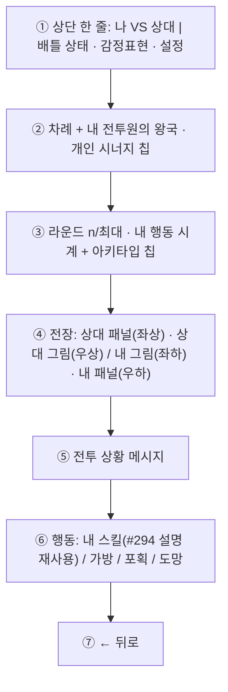

# #296 배틀 Flow — 구현 계약 (2026-10-02 CJ 정정 반영본)

- 작성: Venus_2(Plan · Claude `claude-opus-5-5` / high) · 2026-10-02 · dispatch `ctx_87e824689a9d` / task `task_a2b072b12c0b`. 1차본(Venus_1 · `ctx_f4ff44206299`)을 **치환**했습니다. Venus_3(`ctx_d5374db2cbe6`)이 Mercury 검토에 따라 문구만 정정했습니다(상대 스킬 = 표시 규칙 · 값 없음 = `—`).
- 근거: CJ 2026-10-02 구현 승인 + **같은 날 CJ 명시 정정(PD 전달)** · [구현 전 최종 보고](../Mercury/pre-implementation-report.md) · [CJ 콘티](../references/CJ_CONCEPT_CONTI_20261002.png) · GDD-23 / GDD-24 현행 본문(이번 dispatch 읽기 전용 조회).
- 우선순위: **CJ 최신 정정 > 최종 보고 > 이 계약 > [분석 초안](analysis.md)**.
- 상태: 구현 단계 계약입니다. 제품 QA PASS · CJ 플레이 QA · 병합 · 출시 승인이 아닙니다. Venus는 코드 · 테스트 · 도구를 고치지 않았고 Notion · GitHub에 쓰지 않았습니다.
- 짝 문서: [GDD 치환 초안](gdd-replacement-draft.md) · [Notion 실행 JSON](notion-296-updates.json) · [GitHub #296 Description 초안](github-296-description-draft.md)

표지: **[확정]** CJ 결정 / **[설계 보완]** 그 결정을 구현 가능하게 옮긴 Venus 기본값 / **[추론]** 정적 읽기 결론 / **[기획 필요]** 이번에 정하지 않는 것.

## 0. 한 문단

권투 중계에 비유하면, 전광판에 링에 오른 두 선수의 **체급(등급)과 기본 신체 수치 6가지**가 양쪽에 똑같이 나옵니다. **내 기술표는 이미 만들어 둔 선수 소개 카드(#294 하수인 정보 창)를 그대로** 링 옆에 붙입니다 — 아직 못 쓰는 기술도 소개는 보이고, 실제로 낼 수 있는 것은 심판(서버)이 지금 쓸 수 있다고 확인한 기술뿐입니다. **상대의 기술표는 전투 화면에 붙이지 않습니다**(상대가 이미 쓴 행동은 종전처럼 중계 메시지 · 연출로 알려집니다). 전투 화면이 따로 계산해 붙이던 "위력 숫자"는 소개 카드와 겹치므로 없앱니다. 규칙 · 수치 · 시계 · 확률은 하나도 바뀌지 않습니다.

## 1. 확정된 결정

| # | 결정 | 구분 |
|---|---|---|
| 1 | 전투 중 **지금 싸우는 두 전투원**의 이름 · **실제 등급** · HP/최대 HP · 현재 방어막 · 기본 6스탯(공격 · 방어 · 속도 · 회피 · 치명타 · 상태 부여 확률) · 상태 아이콘을 양쪽에 공개. **전투 화면 한정** — 보드 · 설명 창 · 결과 화면으로 넓히지 않음 | [확정] |
| 1-1 | **대리 출전 개체의 실제 등급도** 싸우는 동안 전투 화면에 공개(CJ 명시 지시 · 전투 한정). 가방에 있는 말의 등급은 계속 비공개 | [확정] |
| 2 | 패널 = 이름 · 등급(그림 옆 이름 줄) + **HP/최대 HP + 현재 방어막 한 줄** + **기본 6스탯 3열 × 2행**. #294 설명 창의 8칸 4×2를 옮기지 않음 | [확정] |
| 3 | 6스탯은 **그 개체의 실제 기본값**(등급 성장 포함 · 시너지/일시 효과 가산 제외). 가산분은 칩과 상태 아이콘이 설명 | [확정] |
| 4 | **내 스킬은 #294 하수인 정보 창의 스킬 설명을 그대로 사용** — **아직 열리지 않은 기술의 소개 포함**. 누를 수 있는 것은 **서버가 지금 열려 있다고 확인한 활성 슬롯뿐** | [확정 · CJ 정정] |
| 5 | **상대 스킬 목록 · 설명 · 칸 · 도움말 열기를 전투 화면에 표시하지 않음** — 이미 쓴 기술 줄 · 가려진 줄 · 칸 수 · `?` 모두 없음. **표시 규칙이며 새 비공개 규칙이 아님**: 미사용 기술 · 칸 수 · 내부 상태는 계속 비공개, 이미 쓴 행동의 기존 통신 · 연출 · 전투 메시지 · 보드 규칙은 그대로 | [확정 · CJ 정정] |
| 6 | 전투 화면의 **동적 위력 숫자 · 범위 표시를 전부 제거**. 기존 설명 안의 고정 계수(위력 % · 쿨타임)는 그대로. 위력 계산 도우미 · `0~0` 처리 로직을 새로 만들지 않음 | [확정 · CJ 정정] |
| 7 | `?` 표시 없음. **실제 0인 스탯은 0 그대로**, 값이 없으면 **`—`**(0으로 지어내지 않음). `—`는 불완전한 데이터의 방어 표시일 뿐이며 정상 게임은 실제 숫자가 나옴 | [확정 · CJ 정정] · `—` 표기는 Mercury 수용 |
| 8 | 글보다 UI — 불필요한 문장을 없애고 #293 · #294 · #295와 같은 부품 · 스타일 | [확정] |
| 9 | 시너지 칩은 전투 시작 스냅샷(`ownSyn`) 기준, **현재 전투원에게 실제 적용되는 것만** | [확정] |
| 10 | 동료 공격력은 **엔진 실제 값 16**을 표시. 18/14 표와의 차이는 보류(6장) | [확정] |
| 11 | 포획 · 도망에 새 미니게임 없음. 사운드 기능 신설 없음 | [확정] |

**폐기된 1차 해석(이력)** — "내 미해금 기술 소개 제거", "상대는 이미 쓴 기술만 표시", "`위력 a~b` / `?` / 0 구분 표기", "대리 등급 비공개"는 PD 전달 해석이었고 CJ 정정으로 4 · 5 · 6 · 7 · 1-1이 대체했습니다.

## 2. 공개 경계 (오프라인 · 온라인 공통)

| 항목 | 내 전투원 | 상대 전투원 |
|---|---|---|
| 이름 · 정체 · 그림 | 공개 | 공개(현행) |
| **지금 싸우는 개체의 실제 등급** | 공개 | **공개 — 대리 출전 포함(전투 한정)** |
| 현재 HP / 최대 HP · 현재 방어막 합계 | 공개 | 공개(현행) |
| 기본 6스탯 | 공개 | 공개(전투 한정) |
| 적용 중 상태 아이콘 | 공개 | 공개(현행) |
| **스킬 목록 · 설명 · 칸** | #294 설명 그대로(미해금 소개 포함) · 활성 슬롯만 누를 수 있음 | **전투 화면 표시 없음**(미사용 기술 · 칸 수는 비공개) |
| 사용 가능 여부 · 불가 사유 · 쿨 · 내부 상태(`onceUsed` 등) | 소유자만 | 비공개 |
| 시너지 칩 · 집계 · 가산 수치(`syn*`) · 개인 시너지 수치 | 소유자만 | 비공개 |
| 가방 · 아이템 · 볼 수량 · **가방에 있는 말의 등급** | 소유자만 | 비공개 |
| 전투 행동 60초 시계 | 내 차례에만 | 비공개(대기 표시) |
| 방어막 시작 비율 · 층별 출처 · `uid` | — | 비공개 |

**이 공개로 알려지는 것 [확정 · 사실 기록]** — "UI만 바뀌고 공개 정보는 같다"가 아닙니다.
- 대리 출전 개체의 **실제 등급**이 싸우는 동안 보입니다.
- 방어 · 속도 · 회피 · 치명타 값으로 **상대 동료의 역할(암살자 / 방패병)** 을 알 수 있습니다.
- 이보다 넓히려면 별도 CJ 지시가 필요합니다.

상대의 행동 결과는 종전처럼 **전투 상황 메시지 · 연출 · 상태 아이콘**으로 읽습니다(기존 메시지 불변 · 새 스킬 목록 아님). **범위**: 5번은 전투 화면의 표시 규칙입니다 — 상대가 이미 쓴 행동의 기존 통신 · 연출 · 메시지 · 보드 규칙을 새로 가리지 않고, 비공개 범위를 넓히지도 않습니다.

## 3. 화면 계약

| 구간 | 내용 | 재사용 |
|---|---|---|
| 상단 | 왼쪽 50% 신원(`나 VS 상대`), 오른쪽 50% 배틀 상태 · 감정표현 · 설정. 구간마다 가운데 정렬 | #294 상단 한 줄 부품 |
| 요약 1줄 | 내 차례 / 상대 차례 + 왕국 칩 + 개인 칩(**현재 출전한 전설 것만**) | 기존 칩 · Core selector |
| 요약 2줄 | 라운드 n/최대 · 내 행동 시계(상대 차례는 대기 표시) + 아키타입 칩 | 기존 시계 문구 |
| 전장 | 상대 패널 좌상 · 상대 그림 우상 / 내 그림 좌하 · 내 패널 우하. 발판은 속성/정체의 **기존 색** + 이름 · 아이콘 병행 | 기존 아트 · 실패 시 대체 표시 |
| 패널 | 1) 이름 · 등급 2) `HP 현재/최대` + 현재 방어막 3) 공격 · 방어 · 속도 4) 회피 · 치명타 · 상태 부여 | — |
| 전투 상황 | 기존 전투 메시지. 표시가 행동을 만들거나 소모하지 않음 | 기존 메시지 |
| 행동 — 내 스킬 | **#294 하수인 정보 창의 스킬 줄 · 설명**. 미해금 기술은 흐림 · 자물쇠 · 필요 등급의 소개 줄(누를 수 없음). 활성 슬롯에는 사용 상태 `사용 가능` / `쿨 N` / `불가`(글자 + 흐림, 색만으로 구분하지 않음) | #294 스킬 줄 · 설명 |
| 가방 · 포획 · 도망 · 뒤로 | 기존 항목 · 제한 · 확률 · 실패 처리 유지, 가독성만. 뒤로는 메뉴 이동뿐 | 기존 아이템 표시 |

- **값이 없을 때** [설계 보완 · Mercury 수용]: 패널 칸은 `—`입니다. `?`를 쓰지 않고 0으로 채우지 않습니다. 실제 0(예: 회피 0 · 상태 부여 0)은 `0`으로 보입니다. 불완전한 데이터에 대한 방어 표시일 뿐이며(Mars 현행 가드) 게임 데이터를 추정하지 않습니다.
- 사용 가능 여부는 **서버의 기존 판정 결과 하나**를 버튼 · 불가 안내 · 수동 턴 종료가 함께 씁니다. 클라이언트가 등급으로 해금을 다시 추정해 버튼을 열지 않습니다.
- 시너지 스냅샷이 없으면 현재 보드로 추정해 그리지 않습니다.
- 좁은 화면에서 두 그림과 HP · 방어막 줄이 겹치지 않아야 하고, 스킬 설명은 행동 영역 안에서 읽습니다.
- #293 보드 · 상점, #294 도움말 창 자체는 다시 고치지 않습니다.

## 4. 역할별 범위 (Ponytail lite — 있는 것을 쓰고, 없는 것만 최소로)

| 역할 | 한다 | 하지 않는다 |
|---|---|---|
| Jupiter | 전투 뷰 양쪽 전투원에 실제 `atk · def · spd · dodge · crit · statusPct`와 **지금 싸우는 개체의 실제 등급(대리 포함)** 허용. 내 활성 슬롯에 기존 `slotUsable` 결과 전달. 전투 allowlist · 프로토콜 · 경계 단언을 **명시적으로 치환** | 보드 뷰에 6스탯 · 가방 말 등급 추가 · 상대 스킬 관련 새 필드 · **이미 공개된 기술의 기존 통신 · 연출 · 로그 메시지 · 보드 규칙 변경/은닉** · `uid` · `syn*` · 내부 상태 배열 전송 · 판정 변경 |
| Mars | 패널이 서버의 실제 6스탯 · 등급을 직접 소비(종 표 복원 제거 방향) · `battleModal` 콘티 배치 · **내 스킬에 #294 설명 렌더 재사용(미해금 소개 포함, 활성 슬롯만 입력)** · **동적 위력/범위 표시와 상대 스킬 목록 · 줄 · 도움말 열기 제거** · `?` 표시 제거(값 없음 = `—`). 온라인 · PVE · 핫시트 같은 공개 경계 | 위력 계산 도우미 · `0~0` 보정 로직 신설 · Core `effAtk` · `dmgRange` · 피해 식 수정 · 설명 문구 고정 계수 변경 · 새 의존성 · 새 미니게임 |
| Earth | 기존 아트 · 색 토큰으로 발판 · 패널 정리 | 새 아트 팩 · 렌더러 · 코드 |
| Saturn | 아래 AC의 독립 검증(읽기 전용) | 파일 수정 |
| Venus | 이 계약 · GDD/Issue 치환 초안 | 코드 · 테스트 · 외부 쓰기 |
| Mercury | Notion/GitHub 반영 · Git · 메타데이터 | 제품 구현 · QA 판정 |

6스탯 전송은 **패널이 쓰기 때문에 유지**합니다(위력 표시를 없앴다고 되돌리지 않음).

## 5. 수용 기준

1. 온라인 양 좌석에서 **일반 2등급 이상 · 전설 · 가방 대리 출전**의 패널 등급과 6스탯이 서버의 실제 전투원 값과 일치한다. 동료 공격력은 엔진 값(16)이다.
2. 실제 0인 스탯은 `0`으로 보이고, 값이 없는 칸은 `—`이며 화면 어디에도 `?` 표시와 지어낸 0이 없다.
3. 내 스킬 영역은 #294 하수인 정보 창과 **같은 설명**이고 미해금 기술 소개가 보인다. 누를 수 있는 줄은 서버가 확인한 활성 슬롯뿐이며 미해금 · 불가 줄은 눌러도 전송 0.
4. 전투 화면에 동적 위력 숫자 · 범위(`a~b` · `0~0` 포함)가 없다. 설명 안의 고정 계수 문구는 변경 전과 같다.
5. 상대 쪽 마크업에 스킬 목록 · 줄 · 쓴 기술 · 가려진 줄 · 칸 수 · 도움말 열기가 없다. 이미 쓴 행동의 기존 통신 · 연출 · 메시지는 변경 전과 같다. 상대 전투 뷰에 `syn*` · 시너지 칩 · 내부 상태 · 가방/볼 · 60초 시계 · `uid`가 없다. **보드 뷰에는 6스탯과 가방 말 등급이 없다.**
6. 내 칩은 스냅샷 값과 같고 현재 전투원에게 적용되는 것만 나온다.
7. 같은 입력의 전투 결과(HP · 승패)가 변경 전과 같다 — 표시 문자열 외 기대값 수정 없음.
8. 메뉴 전환 · 뒤로는 전송 0이며 행동을 소모하지 않는다. 시계 · 확률 · 쿨 · 라운드 값 불변.
9. 대표 모바일 폭에서 콘티의 구간 순서 · 가운데 정렬 · 겹침 없음을 1회 대조한다.

검증은 [QA_MINIMUM_POLICY](../../../../../creat2ve/QA_MINIMUM_POLICY.md)를 따릅니다: 기존 검사에 좁은 단언 추가, 관련 회귀와 필수 CI 6개는 변경 뒤 각 1회, 전수 QA · 반복 네트워크 · 전체 밸런스 시뮬레이션 없음. `test-combat-stats-boundary.js`의 전투 스탯 금지 단언은 **전투 한정 allowlist로 치환**하되 보드 · 시너지 은닉 단언은 낮추지 않습니다.

## 6. 배경 · 범위 밖 · 미확정

- **`0~0` 배경 [추론 · 정적]** — 온라인 전투 뷰가 전투원 공격력을 보내지 않아 화면이 공격력을 0으로 보고 위력 범위를 `0~0`으로 그리던 **표시 경로**입니다. 실제 판정은 서버가 실제 전투원으로 계산합니다. 그 숫자 표시 자체를 없애므로 **CJ 제보 장면을 다시 재현해 대조하지 않습니다.**
- **[기획 필요 · 보류 유지]** GDD-23 3.5 표는 동료 공격력 암살자 18 / 방패병 14인데 엔진은 둘 다 16입니다. #296은 엔진 값을 표시하고 표 · 수치 · 판정을 바꾸지 않습니다. 다음 밸런싱 마일스톤에서 CJ 확인 대상입니다.
- 범위 밖: 마녀 · 전설 수치, 스킬 설명 문구 수정, 명중 스탯, 상대 60초 시계 공개, 결과 화면, 실제 HP 감소 예측, 새 아트 · 사운드.

## 7. 문서 반영 위치

| 문서 | 위치 | 내용 | 집행 |
|---|---|---|---|
| GDD-23 | 5.6 '시너지 표시 UI' | **변경 없음**(현행이 맞음) | — |
| GDD-23 | 7.9 — 첫 항목 · '전투 중에 보이는 것'과 하위 항목 · '보이지 않는 것' · '알려지는 것' | 상대 스킬 표시 삭제(표시 규칙 · 미사용 기술 비공개 유지) · 대리 등급 전투 공개 · `?` → `—` | Mercury(A1~A5) |
| GDD-23 | 8.2 '전투 화면' 항목 | 위력 삭제 · 내 미해금 소개 복원 · 상대 스킬 없음 | Mercury(A6) |
| GDD-23 | 9장 **기존** `2026-10-02 #296` 행 둘째 · 셋째 칸 | 치환(새 행 없음) | Mercury(A7 · A8) |
| GDD-23 | 문서 끝 **기존** '2026-10-02 #296' 절 | 치환(새 절 없음) | Mercury(A9~A17) |
| GDD-24 | 00.7 첫 항목 · #296 항목 | 공개 경계 | Mercury(B1 · B2) |
| GDD-24 | 03절 표 B04 칸의 '화면 구성' 문장 · 표 아래 '공개 경계' | 화면 구성 · 경계 | Mercury(B3 · B4) |
| GDD-24 | 문서 끝 **기존** '2026-10-02 #296' 절 | 치환(새 절 없음) | Mercury(B5~B8) |
| GitHub #296 | Description 본문(기존 완료 조건 5개 한 목록 유지) | 목표 · 바뀌는 것 · 완료 조건 | Mercury |
| 저장소 | 이 계약 · 초안 2개 · 실행 JSON | — | Venus(완료) |
