# Earth_1 아트 반입 및 제작 시험 보고

[결정] 2026-09-07 CJ 최신 지시에 따라 원본 반입과 아이콘 제작을 착수했다. 이 보고는 아트 작업의 실측이며 런타임 QA 판정이 아니다.

- required_role: Earth
- instance: Earth_1
- instance_index: 1
- mode: IMPLEMENT / area: ART / mutation: assets / provider: Codex
- taskId: task_4bdefba9c3a1 / dispatchId: ctx_d829bd128437
- 상태: 원본 반입 및 현재 범위 보고 완료, 최종 아이콘 0/10. 전체 최초 요청 기준 미완료이므로 worker_done outcome은 failed로 보고한다.

PD는 내장 시험 결과를 확인하고 추가 생성·대체 API 없이 현재 검수 보고를 마치도록 지시했다. Earth 직접 32격자 디자인과 별도 Mars PNG 인코딩을 연결하는 제작 경로는 CJ 선택 대기이며, 승인되면 새로운 동일 범위 후속 Task로 진행할 예정이다. 현재는 최종 icon.png와 그 1×/확대 PNG 미리보기가 없고, 아래 제공물은 원본 검토용 표시와 실패한 생성 참고본이다. 런타임 통합, 3종 배경의 최종 아이콘 대비, 20종 흑백 실루엣 구별, DPR·브라우저·게임 회귀 QA는 수행하지 않았다.

## 확정한 작업 및 범위

`CLAUDE.md`, `docs/minion-visual-spec-v0.4.3.md`, `ASSET-LICENSE.md`를 전부 읽었다. 문서의 아트 미승인 문구보다 최신 CJ 반입·제작 승인을 우선했으며 제품 구현은 진행하지 않았다. imagegen 스킬의 내장 도구 경로를 사용했다.

원본 위치는 `C:/Users/pc_77/Downloads/all-minions-v0.4.3`이다. 담당 불·물 10종의 portrait와 battle을 직접 시각 확인한 후 각 폴더의 `portrait.png`, `portrait.webp`, `battle.png`, `battle-grid.png`를 같은 이름의 `demo/assets/minions/` 하위 폴더로 복사했다. 40개 모두 원본과 목적지 SHA-256이 일치했다. `battle-grid.png`는 보존용이며 런타임에 연결하지 않았다.

사용자 소유 `art/`, `orca-hook-latency-report.md`, Downloads 원본에 쓰지 않았다. Git 쓰기, Notion/GitHub 쓰기, 제품·도구·테스트 코드 변경 및 하위 위임은 하지 않았다. 실행 파일·스크립트 파일은 생성하지 않았다.

## 정확한 검증

Python/Pillow의 읽기 전용 디코딩과 메모리 비교, PowerShell `Get-FileHash -Algorithm SHA256`을 사용했다. 픽셀 검사 과정에서 파일을 재인코딩하지 않았다.

- 10종 모두 portrait PNG/WebP: 512×512 RGBA, alpha 최솟값 0·최댓값 255, PNG/WebP 디코딩 결과 전체 RGBA 바이트가 동일.
- 10종 모두 battle: 128×128 팔레트 PNG, battle-grid: 64×64 팔레트 PNG, 투명도 존재.
- 10종 모두 battle의 RGBA 바이트가 battle-grid를 메모리에서 NEAREST 2배 확대한 결과와 완전히 일치.
- battle의 alpha 값은 모든 종에서 정확히 `{0,255}`. 아래 색 수는 alpha>0 픽셀의 고유 RGB 개수이며 투명을 제외했다. 16색 제한은 새 icon에 적용되는 기준이므로 기존 battle의 31~32색을 icon 적합으로 간주하지 않았다.
- bbox는 Pillow 기준 `(left,top,right,bottom)`이며 right/bottom은 제외 경계다.

| 종 | battle 불투명 색 수 | battle alpha bbox | 원본과 4파일 SHA-256 | 2배 픽셀 일치 |
|---|---:|---|---|---|
| fire_std | 32 | (12,36,116,116) | 4/4 | 일치 |
| fire_atk | 32 | (12,22,116,116) | 4/4 | 일치 |
| fire_def | 32 | (12,26,116,116) | 4/4 | 일치 |
| fire_swift | 32 | (12,14,116,116) | 4/4 | 일치 |
| fire_sustain | 31 | (14,12,112,116) | 4/4 | 일치 |
| water_std | 32 | (24,12,104,116) | 4/4 | 일치 |
| water_atk | 32 | (12,20,116,116) | 4/4 | 일치 |
| water_def | 32 | (12,20,116,116) | 4/4 | 일치 |
| water_swift | 32 | (12,12,116,116) | 4/4 | 일치 |
| water_sustain | 32 | (26,12,102,116) | 4/4 | 일치 |

## 내장 생성 시험과 한계

PD 답변에 따라 `fire_std` 한 종을 내장 `image_gen`으로 시험했다. 원본 portrait/battle을 먼저 view_image로 확인하고 두 파일을 정체성 참조로 제공했다. 결과는 [제작 참고본](earth-1-fire-std-generated-reference.png)으로만 복사 보존했으며 `icon.png`로 납품하지 않았다. 생성 도구 기본 위치의 원본도 남겨 두었다.

| 검사 | 결과 |
|---|---|
| 실제 파일 | 1254×1254 PNG, RGB |
| alpha | 채널 없음, RGBA 해석 시 전체 255 |
| 고유 RGB | 103,697색 |
| 배경 | 회색·흰색 체크무늬가 실제 RGB 픽셀에 포함됨 |
| 32 논리 격자 | 1254/32=39.1875로 정수 확대 격자 아님 |
| 세부 처리 | 시각적으로 32 격자보다 작은 세부와 색 변화가 많음 |
| 정체성 관찰 | 크림 뿔·배, 주황 용, 현무암 판, 날개, 둥근 용암 꼬리 유지 |
| 최종 납품 기준 | 크기·RGBA·팔레트·직접 32격자·투명 여백 미충족 |

고해상도라는 이유만의 실패가 아니다. 현재 생성물은 정확한 32격자 확대본이 아니며 실제 투명도가 없으므로 정수 축소·크롭만으로 납품할 수 없다. 명세 충족에는 배경 마스크 재작성, x/y=2..29 내부의 새 픽셀 구성, 8~12색(최대16) 선택, 모든 alpha를 0/255로 정리, 하단 y=29와 시각 중심 x=15.5 조정, 어두운 내부선과 선택적 밝은 림의 직접 배치가 필요하다. 그런 후 세 배경 `#33406e`, `#6e3340`, `#3a4152`와 흑백 실루엣에서 재검토해야 한다. 기존 battle을 단순 축소하거나 API/CLI로 대체하지 않았다.

### 실제 사용 프롬프트

> Use case: identity-preserve. Asset type: Digit Dual fire_std board pixel icon, one character. Both inputs are character identity references; preserve this original baby lava dragon (red-orange skin, cream muzzle and belly, two cream horns, dark basalt head/back plates with small glowing orange cracks, tiny orange bat wings, thick dark round lava tail tip). Redesign proportions directly for a logical 32x32 pixel grid: large friendly head, compressed 2-head-high body, near-front three-quarter pose, coherent balanced silhouette. This is NEW compact pixel design, not a downscale of battle art. Output a true 32x32 RGBA PNG if supported; otherwise render an EXACT uniform 32x32 logical pixel grid enlarged by an integer factor on square canvas. Each logical pixel MUST be one perfectly flat solid-color square aligned to the same grid. No anti-aliasing, no subpixel detail, no texture, no gradient, no drawing between grid cells, no visible grid lines. Transparent background with alpha 0, all artwork fully opaque alpha 255. Keep logical rows 0,1,30,31 and columns 0,1,30,31 fully transparent, feet lowest pixel on row 29, visual center x=15.5. Use precisely at most 12 opaque colors: dark plum internal contour, basalt gray, burnt red shadow, red orange base, warm orange light, flame yellow, pale cream highlight, cream muzzle, tan cream shade, eye dark brown, eye white. Selective 1-logical-pixel bright rim on silhouette only where needed against board colors #33406e #6e3340 #3a4152, not a continuous sticker border. Preserve readable horns, small wings and round lava tail, simplify cracks. No text, numbers, HP, symbols, watermark, ground shadow, background color or checkerboard.

## 시각 관찰 및 후속 디자인 주의점

아래는 직접 본 원본에 대한 아트 판단이며 최종 32px 식별성 검증 결과가 아니다.

| 종 | 유지할 핵심 | 약점·혼동 위험 / 32px 설계 방향 |
|---|---|---|
| fire_std 새끼 화룡 | 크림 뿔·배, 작은 날개, 둥근 용암 꼬리 | 붉은 현무암 계열 fire_def와 색이 비슷함. 큰 머리와 날개·꼬리로 구별 필요 |
| fire_atk 화염 투사 | 큰 앞주먹, 검은 어깨, 불꽃 뿔 | 균열 디테일은 버리고 큰 주먹 한 덩어리와 넓은 어깨 유지 |
| fire_def 용암 거북 | 낮고 넓은 등껍질, 분화구, 짧은 다리 | fire_std의 현무암과 혼동 방지 위해 머리를 작게 하고 등껍질 폭 강조 |
| fire_swift 불티 정령 | 대각선으로 긴 불꽃 날개, 작은 검은 머리 | 날개 끝과 꼬리가 가늘어 소실 가능. 긴 날개 2갈래를 큰 색면으로 압축 |
| fire_sustain 재의 주술사 | 흰 가면, 가로 깃, 연기 꼬리 | 원본 battle이 어두워 작은 크기에서 팔·연기 손실 우려. 가면과 넓은 깃, 선택 밝은 림 우선 |
| water_std 물방울 요정 | 둥근 얼굴, 말린 물방울 머리, 작은 지느러미 | water_swift와 날개 소재 유사. 둥근 몸과 짧은 두 발을 강조 |
| water_atk 심해 사냥꾼 | 상어 머리, 날 모양 팔, 긴 꼬리 | 가는 다리·등지느러미가 소실 가능. 전방 돌출 주둥이와 한쪽 칼팔 유지 |
| water_def 산호 수호자 | 층층 소라 껍질, 집게·부채 방패 | 산호 장식이 과밀. 크림·분홍 소라 층과 넓은 갑각 하단으로 압축 |
| water_swift 안개 무희 | 큰 물결 날개, 가는 몸, 말린 긴 꼬리 | water_std의 물 요정 및 water_sustain 물결과 혼동 가능. 좌우 긴 날개와 빈 공간을 유지 |
| water_sustain 파도 술사 | 흰 수염 얼굴, 파도 머리, 둥근 파도 꼬리·물 구체 | 파도·손·구체가 붙을 위험. 흰 얼굴과 큰 C형 꼬리, 구체 한 점으로 구별 |

## 검토용 원본 미리보기

표의 battle 1×는 실제 128px 원본 표시, 확대는 같은 원본의 2× 표시다. 새 icon 1×/확대 납품물이 아니며 브라우저 확대·DPR에 대한 QA를 뜻하지 않는다. Markdown 뷰어가 HTML 크기/style을 무시하면 링크로 원본을 직접 확인해야 한다.

| 종 | portrait | battle 1× (128) | battle 2× (256) |
|---|---|---|---|
| fire_std | 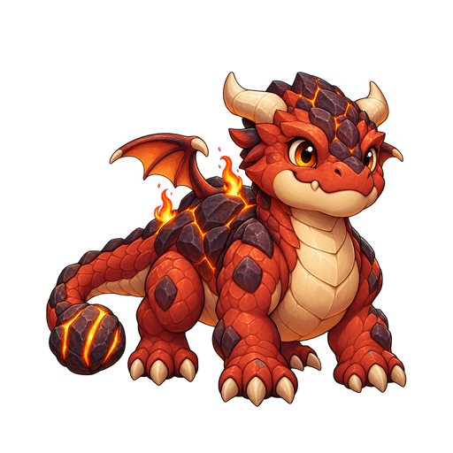 | 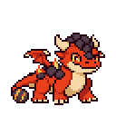 |  |
| fire_atk | 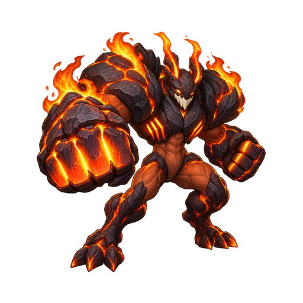 | 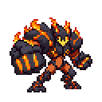 |  |
| fire_def | 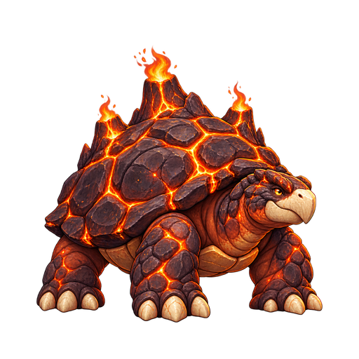 | 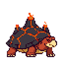 |  |
| fire_swift | 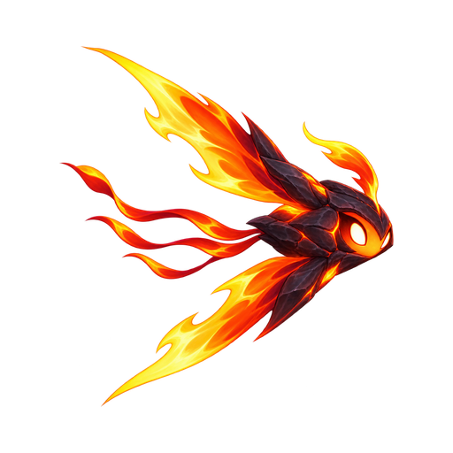 | 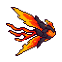 |  |
| fire_sustain | 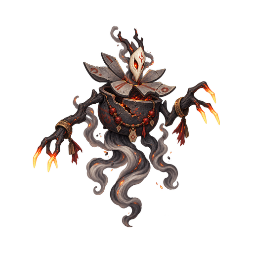 | 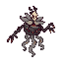 |  |
| water_std | 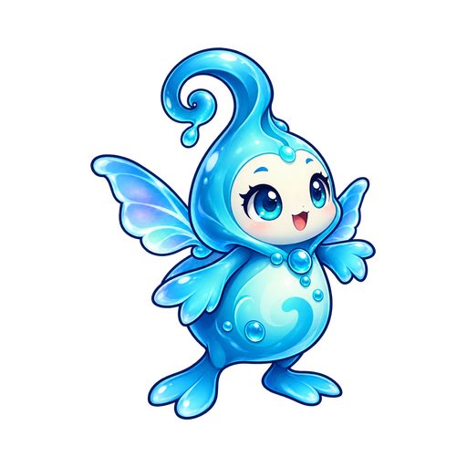 |  |  |
| water_atk | 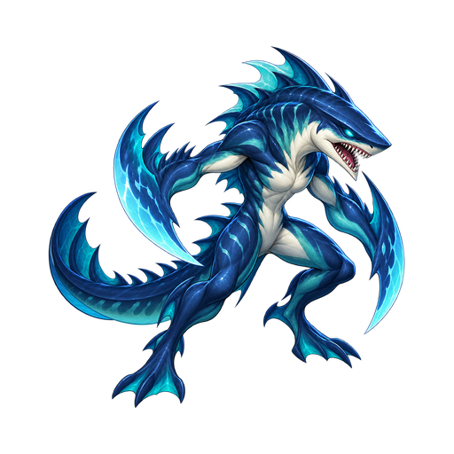 | 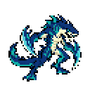 |  |
| water_def | 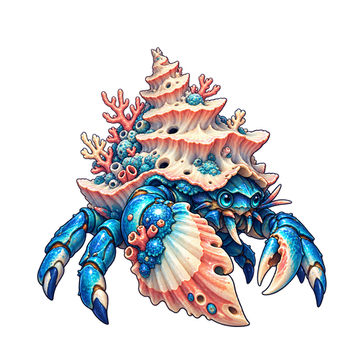 | 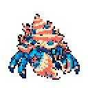 |  |
| water_swift | 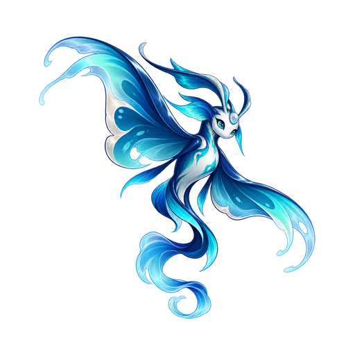 | 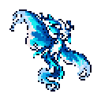 |  |
| water_sustain | 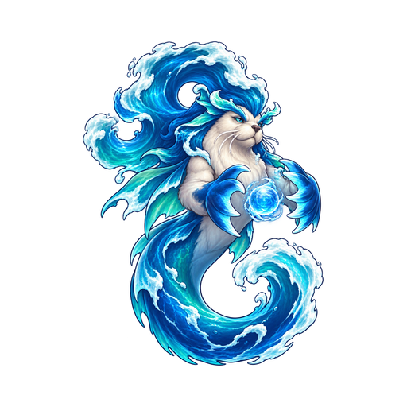 | 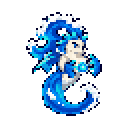 |  |

## files_modified 및 SHA-256 명세

| 파일 | SHA-256 (원본=목적지) |
|---|---|
| demo/assets/minions/fire_std/portrait.png | DBEF4CC84DB3E0EDEA96614D378EB2D336A6F0C4A614A032B32BB5005B78F149 |
| demo/assets/minions/fire_std/portrait.webp | 3EA042E278BD38E07ED89E10B9217C86BB100BF1BFF03237BE75A48360C3783B |
| demo/assets/minions/fire_std/battle.png | 0B05DAE94DAFC4FEFEF3EF6E67BEE1689533C86EDF3819D6EDB76038EFB76856 |
| demo/assets/minions/fire_std/battle-grid.png | C4A28434B53D8954E7876865077D82249A0DF673C67692F3CF9FB28F3A1D9093 |
| demo/assets/minions/fire_atk/portrait.png | 4B69AD34522AC76FEA690BD2134FFDE1CC8E9C23F46B535D3B4447D2E5B8EC9B |
| demo/assets/minions/fire_atk/portrait.webp | 5D2F3CA113D5BB33AA128F3A7D2B38840C6DDE02ADE39400A2BC81C6FAE86722 |
| demo/assets/minions/fire_atk/battle.png | 05BA0B5E0864F18F5E29D1437C4D47B833C7E5DF5D14AFAB7336B5BEF3D26BF7 |
| demo/assets/minions/fire_atk/battle-grid.png | 095E6519AE225795CA2109509F1F953A99CED028BB6C7CF071569BCFF0735AAD |
| demo/assets/minions/fire_def/portrait.png | F38DC4E1F029D9F30C3A7FE41381CDBC5DF155422BD5DAF9FF9C71C7D3F2E54D |
| demo/assets/minions/fire_def/portrait.webp | 05B0743A71B76D72C31B9E98ECC342561A3BF5DD190AF15E66C1A86B765D7F40 |
| demo/assets/minions/fire_def/battle.png | CA949946A26C3C757B7A57CD8729BB75864A027941015569FF6E7DBD87B55050 |
| demo/assets/minions/fire_def/battle-grid.png | 0F8433DDE4B6B1197AE2431366A8FC51BFE9223E90F40B30A878F2EC23842371 |
| demo/assets/minions/fire_swift/portrait.png | B4F3D559CC55421F0681504A2F4071FB82038F25FF3A45D1953BC337D093028B |
| demo/assets/minions/fire_swift/portrait.webp | D0CD9332ABBE131A16505687C136732305AEAE8252D5F259EA5857B389D5F384 |
| demo/assets/minions/fire_swift/battle.png | 7F8D30A5309FE639048C0C55164161B30A3EEF2E54F8ED30E3449DBFCC734510 |
| demo/assets/minions/fire_swift/battle-grid.png | 7C3D67A0294C1754C209E2FD78C2B2E9D57D1FC811DE9329452269D9372057A2 |
| demo/assets/minions/fire_sustain/portrait.png | 3DB83BE95C85EC3197AB51C63D778AD758CBF48311A62C5E854188FBBB62719C |
| demo/assets/minions/fire_sustain/portrait.webp | D159CA9BDE36DC19F7D07817C6D2907CFEF0077A7C69A7337D464DAA4EDC77D3 |
| demo/assets/minions/fire_sustain/battle.png | 90E2CDFC2A1A6B99D0AF807941C98E17F1ADDF1FC89C3693EEEDC0934E226CDB |
| demo/assets/minions/fire_sustain/battle-grid.png | 8F5F2DC0ECF03131C6A11A0DECFE11534B3617C55C4F03D88BAE03F29B389F0B |
| demo/assets/minions/water_std/portrait.png | 28F37EE5DE71E5E934258B6D35650A294F1CBDFC9ED9CC27E72339146924D702 |
| demo/assets/minions/water_std/portrait.webp | 625DF17B83D5D3411B55E75D8143574E84C443F470C0DA35BE291E542509BC8E |
| demo/assets/minions/water_std/battle.png | 559B9D68B992E4A4D3D2A8031C35541633395EC80D56F7EBABE16155F10635A7 |
| demo/assets/minions/water_std/battle-grid.png | 072C55207A19CEA5D360C86122D2E786E2F9AE34D350482FF40AB6D212532ED7 |
| demo/assets/minions/water_atk/portrait.png | 84B414F71F6988E2B9FEA72E006E8832F41009719F0D257CA95265D8E87F6FCF |
| demo/assets/minions/water_atk/portrait.webp | FB9446C3158A7650BD2CB31E8EA97E6406ABBB74AFD213673AC34F3556FBBB6A |
| demo/assets/minions/water_atk/battle.png | 36A35266EC7D5A3DB723DED9FA111D2EA6FB8A05F63C1B407C32A55B249DC286 |
| demo/assets/minions/water_atk/battle-grid.png | 933970CD6D301310D664C38614EFC9036CB38854125A734BB410B8DA409702A6 |
| demo/assets/minions/water_def/portrait.png | 56B72AAA27E5D6382775435F026ACE4D6CB683B4E9ABBCABD3E857DF8437B79D |
| demo/assets/minions/water_def/portrait.webp | 8639106B26AF758E7906D901B920EBEF746886D99923C012DED2DCBEE8575F0E |
| demo/assets/minions/water_def/battle.png | 15F57C6FEEE4408C3A00224405D523F89790C8A84FE198A0E6FA407B9FE5CAF2 |
| demo/assets/minions/water_def/battle-grid.png | 5CB9578819B09D91EC9AB1B5BA4E904F885AFF5411F25170ECBC222D9B495D89 |
| demo/assets/minions/water_swift/portrait.png | 491D20296D5440C2BE732B12743E8ACB0C97AEDF994C0825A5EA2E653F8439F3 |
| demo/assets/minions/water_swift/portrait.webp | 57C24BF60F806A2A0B68078B20E0EEE7A9F7ABB40FF7E9DBF23B01765D0D9532 |
| demo/assets/minions/water_swift/battle.png | 644BE66545876F96CF91FDAF7DE03AEFCB6CF3A22AEA3FDB18F0DF0EA7664A9C |
| demo/assets/minions/water_swift/battle-grid.png | 8B57C14D3A1D0B4B0CE0A598496127C4BDB73959D47F0CDA4F07EFA1C141A6D3 |
| demo/assets/minions/water_sustain/portrait.png | AED064A3E45B6465C4E3446E1F01D6ABF99361D218895C6108FF02834D609D41 |
| demo/assets/minions/water_sustain/portrait.webp | 9BFCE8DB49B5A1C9540D1553D7AAA99FE0CCBD5CB9EBE2FCD9EC574B15B3B9FC |
| demo/assets/minions/water_sustain/battle.png | 22B7977C0F06930FF4AE38E149BA4A10A8A70E0F2EBEF3ADEFC74FCF194D65C6 |
| demo/assets/minions/water_sustain/battle-grid.png | C17EC2B82B536B9473A0F2C878A4E9495736A0ED1AC367AF667D712AE24EEB8A |

추가 변경 파일:
- docs/art/minions-v0.4.3/earth-1-fire-std-generated-reference.png
- docs/art/minions-v0.4.3/earth-1-report.md
