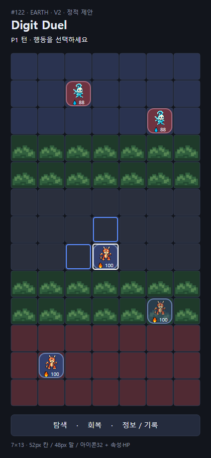
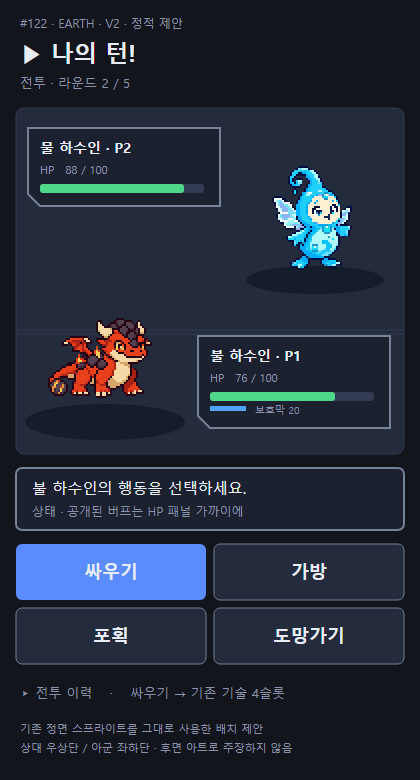

# #122 · #124 · #126 — 세로 화면 · 왕/동료 아트 · 승패 효과

> **완료: 2026-09-10 CJ 플레이 QA PASS 로 [#122](https://github.com/ChangjoSung/Digit-Duel/issues/122)·[#124](https://github.com/ChangjoSung/Digit-Duel/issues/124)·[#126](https://github.com/ChangjoSung/Digit-Duel/issues/126) 세 Issue 를 종결했다.** 출시는 여전히 대기이며 정식 버전은 v0.4.5 그대로다.
> 마지막 회차는 **CJ QA REVISE 2차 — 접촉·전투 규칙 4건 + 준비 탭 표시·전투 뒤로가기 위치**이고 [Mars 구현·검증 보고](Mars/revise-cjqa-rules/report.md)가 그 원본이다.
> 이번 회차는 **Codex 정지로 Saturn 교차 QA 없이** Mars 가 백업 QA·Git·문서를 대행했다 — CJ 플레이 QA 가 최종 게이트였다. 검증 범위와 한계는 위 보고의 "남은 것 · 한계" 절을 따른다.
>
> 1차 REVISE(좌상단 뒤로가기·어두운 배경): [수정 범위·검수 기록](Mercury/revise-back-dark.md). PR160의 제품 PASS와 화면은 이전 납품 이력이다.
> **주의**: 이 문서 아래쪽 화면·설명 중 "전투 도중에는 하위 메뉴에서 명령 선택으로만 돌아간다"는 위치 서술과 좌상단 전투 뒤로가기 캡처는 1차 회차 기준이며, 2차에서 그 버튼이 **행동창 아래**로 옮겨졌다.
>
> 현재 범위 원본: [CJ 후속 범위](Mercury/cj-followup.md) · [GDD21](https://app.notion.com/p/3d71e7f1708581f292ede2ab862e63f5) · [작업 PR160](https://github.com/ChangjoSung/Digit-Duel/pull/160). 아트 체크포인트 `dd0d622`.

기존 픽셀 하수인을 중심으로 한 **레트로 휴대용 전략 게임** 방향이다. CJ REVISE에 따라 아이보리 패널을 기존 남색·어두운 회색 계열로 변경한다. 숫자와 상태는 읽기 쉽게, 말판과 전투 캐릭터는 크게 보이도록 구성한다.

## REVISE 보완 — 실제 브라우저 화면

제품 커밋 `21637d1720a67c0400a2025ee8dad585d231ba15`의 좌상단 뒤로가기와 기존 어두운 팔레트를 적용한 화면이다. [Mars 보완 보고](Mars/revise-back-dark/report.md) · [브라우저 실측](Mars/revise-back-dark/media/back_dark_report.json) · [현재 튜토리얼10 촬영 기록](Mars/revise-back-dark/tutorial/capture-manifest.json) · [PD 검수 기록](Mercury/revise-back-dark.md).

| 화면 | 실제 캡처 |
|---|---|
| 로비·준비 | [로비](Mars/revise-back-dark/media/01-lobby-390.png) · [배치](Mars/revise-back-dark/media/02-prep-place-390.png) · [준비 취소 확인](Mars/revise-back-dark/media/04-prep-confirm-390.png) |
| 보드·서랍 | [보드](Mars/revise-back-dark/media/05-board-390.png) · [서랍 닫기](Mars/revise-back-dark/media/06-board-drawer-390.png) · [기권 확인](Mars/revise-back-dark/media/07-resign-confirm-390.png) |
| 전투·결과 | [좌상단 전투 뒤로가기](Mars/revise-back-dark/media/08-battle-390.png) · [이미지 대체 표시](Mars/revise-back-dark/media/12-battle-fallback-390.png) · [결과](Mars/revise-back-dark/media/09-result-390.png) |
| 화면 폭 | [360px 보드](Mars/revise-back-dark/media/10-board-360.png) · [데스크톱 보드](Mars/revise-back-dark/media/10-board-desktop.png) |

뒤로가기는 화면에 맞춰 타이틀·로스터·명령 선택으로 돌아가거나 서랍을 닫는다. 준비 취소와 경기 기권은 확인을 거치고, 전투 도중에는 하위 메뉴에서 명령 선택으로만 돌아간다. 물리 휴대폰·두 PC 전체 플레이와 CJ 재수락은 남아 있다.

## 이전 납품 — PR160 브라우저 화면

아래는 PR160 첫 납품의 촬영 이력이며 뒤로가기·어두운 배경 수정 후 화면과 구분한다.

[구현·검수 통합 기록](Mercury/report.md) · [Mars 구현 보고](Mars/report.md) · [브라우저 검사 결과](Mars/artifacts/ui_cdp_report.json) · [튜토리얼10 출처](Mars/media/capture-manifest.json).

| 화면 | 실제 캡처 |
|---|---|
| 시작·로비 | [첫 화면](Mars/artifacts/122-01-title-390.png) · [로비](Mars/artifacts/122-02-lobby-390.png) |
| 준비·보드 | [로스터](Mars/artifacts/122-03-roster-390.png) · [비공개 배치](Mars/artifacts/122-04-place-390.png) · [전략 보드](Mars/artifacts/122-05-board-390.png) |
| 공개 기록·수풀 | [기록 서랍](Mars/artifacts/122-06-drawer-log-390.png) · [보이는 양측 말과 은폐 칸](Mars/artifacts/122-13-bush-390.png) |
| 전투·결과 | [속성 전투](Mars/artifacts/122-07-battle-390.png) · [경기 결과](Mars/artifacts/122-10-result-390.png) |

현재 캡처는 작업 브랜치의 검수 자료다. 물리 휴대폰·실제 두 PC 전체 플레이 검증이나 CJ 수락을 뜻하지 않는다.

## 디자인 시안 — v2

CJ 피드백 세 가지를 반영한 판이다: **실제 숲 칸만 수풀처럼**, **말판 위 말은 현행 HTML 표현 유지**, **속성 전투는 현행 HTML + 휴대용 몬스터 배틀 구도의 결합**.

| 시안 | 크기 | 내용 |
|---|---|---|
| [전략 보드 v2](Earth/v2/board-v2.png) ([SVG](Earth/v2/board-v2.svg)) | 420×910 | 7열×13행. 현행 52px 셀·48px 말·32px 아이콘·11px 속성/HP 행. 잎 군집은 실제 숲 4–5 / 9–10행에만. 숨은 말은 그리지 않고, 보이는 숲 속 말은 반투명 |
| [속성 전투 v2](Earth/v2/battle-v2.png) ([SVG](Earth/v2/battle-v2.svg)) | 420×780 | 적 우상단·아군 좌하단, 반대편 HP 판, 하단 메시지와 싸우기·가방·포획·도망가기 |

  
  

작성 근거와 보존 항목은 [Earth v2 보고](Earth/v2/report.md)에 있다.

### 수풀 안의 말 (2026-09-10 CJ 추가 피드백)

- **숨겨진 말은 물음표조차 그리지 않는다.** 내 말이 인접하지 않아 보이지 않는 숲 속 상대 말은 **빈 칸**으로 남는다 — 위치를 암시하는 프레임·아이콘·HP 도 두지 않는다. 숲 **밖**의 미공개 상대는 지금처럼 위치는 보이고 정체만 `?` 다.
- **보이는 숲 속 말은 내 말과 상대 말 모두 살짝 반투명하게** 그려 수풀에 들어가 있는 느낌을 준다. 카드 뒤로 풀이 비치되 **소유자 프레임·속성/HP·선택 테두리의 가독성은 유지**한다. CJ가 양측에 동일 적용하도록 명확히 했다.
- **공개 규칙 자체는 바꾸지 않는다.** 인접·`tempReveal` 로 보이게 되는 현행 `visibleTo` 판정을 손대는 결정이 아니며, "숲 속 말은 무조건 숨김" 으로 확대 해석하지 않는다. 이번 항목은 표시 계층 전용이다.

## #124 — 왕 · 동료 픽셀 아트

왕은 왕관·넓은 망토·홀, 동료는 투구·깃털·방패의 좁은 실루엣으로 구분했다. **각 1종**을 만들고 팀 구분은 기존 소유자 프레임을 그대로 쓴다 — 팀별 전신 변종을 만들지 않는다.

| 산출물 | 내용 |
|---|---|
| [왕 원본](../124/Earth/king-sovereign-source-v1.png) · [동료 원본](../124/Earth/companion-guide-source-v1.png) | 신규 생성 원본 (1254×1254 RGBA) |
| [크기 비교](../124/Earth/source-use-size-review.png) ([SVG](../124/Earth/source-use-size-review.svg)) | 32 / 128 / 256px 를 밝은·어두운 배경에서 확인한 대조표 |
| [아트 보고](../124/Earth/art-report.md) · [생성 프롬프트](../124/Earth/prompts.md) | 출처·해시·실측·한계 |

게임 파생본 `demo/assets/leaders/{king,companion}/{icon64,battle256}.png` 4개와 재생성 매니페스트를 Mars가 납품했다. 1254px 픽셀 스타일 원본을 LANCZOS로 단순 축소한64/256px RGBA이며, 기존 하수인 이미지를 대체하지 않는다.

## #126 — 승패 효과

기존 전투 결과 배너 **2500ms 를 그대로 두고**, 그 안의 강한 효과 동작 구간만 약 **1.1–1.2초**로 배분한다. **추가 대기를 만들지 않는다.** 반복 점멸도 없고, 1200ms 이후에는 결과 글자를 읽을 수 있게 유지한다.

| 산출물 | 내용 |
|---|---|
| [효과 정점 비교](../126/Earth/effect-keyframes.png) ([SVG](../126/Earth/effect-keyframes.svg)) | 승리(금빛 확산) · 패배(어두운 균열) 정점 대조 |
| [스토리보드](../126/Earth/effect-storyboard.md) | 구간별 시각 어휘 · 도망/포획/동률/경기 무승부 구분 |

전투 판정 동률은 **방어자 승**이고 전투 무승부 화면은 만들지 않는다. 무승부는 경기 무승부에만 쓴다. 도망은 기존 fleeFx1200ms 후 교환 선택으로 이어지고, 적 포획은 기존 captureFx1200ms 메시지 뒤 resultBanner2500ms 결과 단계를 거친다. 두 경로의 시간 상수는 그대로다. 포획 결과에는 경기 승리 축하 효과를 쓰지 않는다.

## 화면 흐름

첫 화면 → 로비 → 출전 준비(로스터 선택 → 비공개 배치) → 전략 보드 ↔ 속성 전투 → 경기 결과 → 로비/재대전.

**개별 전투 종료는 보드로 복귀하고, 경기 전체 종료만 결과 화면으로 간다.** 로비 복귀와 재대전은 **같은 문서 안에서** 이뤄지며, 이때 튜토리얼은 다시 자동으로 뜨지 않는다(#128 정책 그대로). 새로 접속하거나 새로고침할 때는 지금처럼 1단계부터 열린다.

## 설계에서 지킬 경계

- 7×13 보드, 소유자 프레임·32px 아이콘·속성/HP 정보행·숲 밖 미공개 `?`, 숲 은닉과 인접 관측을 보존한다.
- 전투의 4메뉴(싸우기·가방·포획·도망가기)와 하위 메뉴·취소를 유지한다. **전투 명령은 인덱스 모달이 아니라 시맨틱 액션**이며 이 구조를 바꾸지 않는다.
- **보드 턴 종료와 전투 행동 종료를 구분한다.** 보드는 상시 종료 버튼 없이 현행 자동 종료·조건부 `싸우지 않고 종료`를, 전투는 4슬롯이 전부 불가할 때만 수동 종료를 유지한다.
- 핫시트 기기 교대 차단 모달, 온라인 매칭 대기·취소, 비공개 출전 선택, 공개 기록 접근을 보존한다. 온라인 같은 상대 재대전 프로토콜은 이번 범위가 아니다.
- 게임 규칙·수치·난수 흐름·온라인 프로토콜을 바꾸지 않는다.

## 작업 기록

| 역할 | 문서 |
|---|---|
| Mercury | [통합 기록](Mercury/report.md) · [CJ 후속 범위](Mercury/cj-followup.md) — 요청·검수·소스·절차 예외 |
| Mars | [구현 보고](Mars/report.md) · [효과 검증](../126/Mars/report.md) |
| Saturn | [PD가 보관한 inline 독립 QA](Mercury/report.md#saturn-독립-read_only-관측) — Saturn 파일 쓰기 없음 |
| Earth | [v2 시안 보고](Earth/v2/report.md) · [왕·동료 아트 보고](../124/Earth/art-report.md) · [#126 스토리보드](../126/Earth/effect-storyboard.md) |
| Venus | [흐름 계약과 PD 실행 판단](Venus/implementation-review.md) — 결과 연출 1회성·같은 문서 로비·온라인 불변식·아트 연결 지점과 수용 기준 |
| Venus | [사용자 문서 동기화 보고](Venus/docs-status-report.md) — 이번 제작 중 상태를 사용자 문서에 반영한 범위 |

<b>v1 — 최초 정적 러프 (역사 자료)</b>

 

2026-09-10 CJ 시각 검토용으로 먼저 만든 6화면 러프다. 위 v2 가 이를 대체했으며, **현재 상태를 설명하지 않는다.**

| 자료 | 내용 |
|---|---|
| [6화면 전체 러프](Earth/rough-v1.png) ([SVG](Earth/rough-v1.svg)) | 첫 화면 → 로비 → 배치 → 보드 → 전투 → 경기 결과 |
| [보드 390×844](Earth/board-preview.png) · [전투 390×844](Earth/battle-preview.png) | 초기 세로 프레임 검토용 |
| [정보·결과 레이어 습작](Earth/overlay-studies.png) | 상세 서랍·전투 결과·사용 불가 안내의 시각 예시 |
| [v1 아트 보고](Earth/report.md) | 당시 제작 범위와 한계 |
| [Venus 흐름 검토 원문](Venus/flow-review.md) | 당시 현행 화면 구조 실측과 함정 8건 |

당시 기록: 기준 dev `52932eddc644764c797f106b8bc1cf6b174fbf9b`, HTML blob `8027cd72d8445c9a7077d0e43b1c5559645ee165`. 초기 취합에서 왕 불가침 범위와 접속 코드 존재에 관한 전달 오류가 있었고 원문 대조로 정정했다 — 당시 규칙은 왕 대 왕 불가침/왕 제거 승리 가능이었고, 서버 주소와 접속 코드는 별도 입력이다. (왕 불가침 자체는 2026-09-10 CJ QA REVISE 2차로 폐지됐다 — 이 절은 당시 기록이다.) Earth 가 만든 `Earth/.chrome-render/` 임시 프로필은 정확 경로 삭제가 자동 승인 검토에서 `blocked by policy` 로 거부돼 우회하지 않고 보존했으며 납품 대상에서 제외한다.

