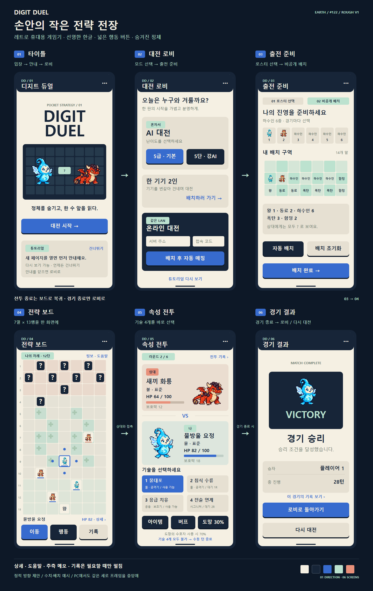

# #122 — 세로 UI 아트 구조 러프 v1

> CJ가 화면 분위기와 구성을 확인하기 위한 **정적 설계 시안**입니다. 실제 게임 UI에 적용하지 않았으며, 디자인 검토 후 구현 범위를 확정합니다.

기존 픽셀 하수인을 중심으로 한 **레트로 휴대용 전략 게임** 방향입니다. 짙은 남색 프레임·밝은 아이보리 패널·절제한 파랑/민트/코랄 강조색을 사용합니다. 숫자와 상태는 읽기 쉽게, 게임 보드와 전투 캐릭터는 크게 보이도록 구성합니다.

첫 화면 → 로비 → 배치 → 보드 ↔ 전투 → 경기 결과 → 로비/재대전. 개별 전투 종료는 보드로 복귀하고, 경기 전체 종료만 결과 화면으로 이동합니다.

CJ는 **전체 색감·말판 중심 배치·별도 전투 화면의 느낌**을 먼저 확인하면 됩니다. 세부 간격·최종 캐릭터 아트·효과·반응형 구현은 이후 단계입니다.

## 시안

| 확대 보기 | 내용 |
|---|---|
| [보드 390×844](Earth/board-preview.png) | 7열×13행 말판과 하단 조작 영역 |
| [전투 390×844](Earth/battle-preview.png) | 캐릭터·HP·보호막·4슬롯 기술 |
| [정보·결과 레이어 참고](Earth/overlay-studies.png) | 상세 서랍·전투 결과·사용 불가 안내의 시각 예시 |
| [SVG 원본](Earth/rough-v1.svg) | 수정 가능한 정적 벡터 아트 |

## 화면 구성

| 화면 | 시각적 역할 | 현재와 제안의 구분 |
|---|---|---|
| 첫 화면 | 로고·대표 하수인·시작·튜토리얼 진입 | 별도 타이틀은 신규 제안 |
| 로비 | AI / 한 기기 2인 / 온라인 대전 | 기존 모드 선택을 독립 화면으로 재구성; 관전은 보조 진입으로 보존 |
| 출전 준비 | 로스터 6종 선택 → 비공개 배치 | 현행 두 단계를 구분, 핫시트 교대·온라인 대기는 상세화 단계 |
| 전략 보드 | 긴 말판·현재 차례·선택 말·행동 | 7×13 유지; 미공개 정체는 `?`, 공개 정보 접근 보존 |
| 속성 전투 | 큰 캐릭터·상태·기술 선택 | 현재 공용 모달을 전투 화면처럼 구성하는 제안 |
| 경기 결과 | 승패·경기 기록·로비/재대전 | 현재 새로고침 복귀를 화면 내 복귀로 바꾸는 신규 제안 |

## 후속 설계에서 지킬 경계

- 시안은 화면 배치와 분위기 제안이다. 현재의 전투 4메뉴·포획·패키지·뒤로/취소를 삭제하거나 기술 버튼을 온라인 중계에 바로 연결한다는 결정이 아니다.
- **보드 종료와 전투 행동 종료를 구분한다.** 보드는 상시 종료 버튼 없이 현행 자동 종료·조건부 '싸우지 않고 종료'를 보존한다. 전투는 기술 4개가 모두 불가할 때만 수동 종료하며 아이템·도망 선택은 계속 가능해야 한다. 레이어 참고의 사용 불가 팝업은 시각 예시이므로 이를 차단 모달 그대로 적용하지 않는다.
- 전투 결과의 '보드로 돌아가기'는 복귀 흐름 자리표시다. 매 전투마다 추가 확인 클릭을 강제한다는 승인이나 #126 연출 구현이 아니다. 경기 전체 종료와 개별 전투 종료를 분리한다.
- 새 문서 로드의 튜토리얼 재표시는 #128 그대로다. 같은 문서 안의 로비/재대전 루프는 별도 구현이 필요하며 새로고침과 혼동하지 않는다.
- 공개 로그·말 속성/HP 접근·추측 메모와 핫시트/온라인의 비공개 상태를 보존한다. 세부 셀 크기·정보행·관전/온라인 대기·모바일 키보드와 반응형 동작은 이번 시안으로 검증된 것이 아니다.

## 작업 기록

- Earth(Codex): [아트 보고](Earth/report.md), 정적 SVG4개·PNG4개. 기존 승인 하수인 이미지4개를 변경 없이 임베드했다.
- Venus(Claude): [흐름 검토 원문](Venus/flow-review.md). 읽기 전용 분석 결과를 Mercury가 파일로 보존했다.
- Mercury: 시각 확인·현행 코드 대조·취합. 초기에 왕 불가침 범위와 접속 코드 존재에 관한 수정 사유를 잘못 전달했으나 원문 대조로 즉시 정정했다. 왕 대 왕 불가침/왕 제거 승리 가능, 서버 주소와 접속 코드의 별도 입력이 최종 반영됐다.
- 기준 dev `52932eddc644764c797f106b8bc1cf6b174fbf9b`, HTML blob `8027cd72d8445c9a7077d0e43b1c5559645ee165`. 제품 변경·제품 QA·재릴리스 없음. Issue122 OPEN / CJ 디자인 검토 대기.
- Earth가 생성한 `Earth/.chrome-render/` 임시 프로필의 정확 경로 삭제는 자동 승인 검토에서 `blocked by policy`로 거부됐다. 삭제를 우회하지 않고 보존하며 로컬 Git exclude와 개별 파일 스테이징으로 납품에서 제외한다. Worker 두 명은 완료 보고 후 archive/release했다.
