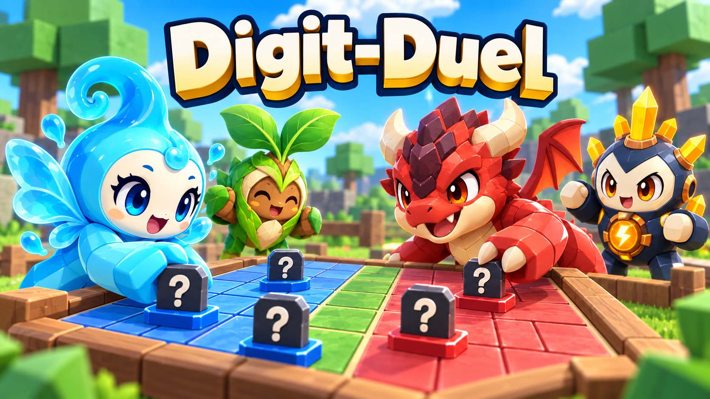

# [결정] Claude 인계 — Roblox풍 썸네일 v2 + 경험 아이콘 v1

2026-09-11 · Earth → Claude/Mars · Ref #118

이번 사용자 피드백에 맞춘 **새 홍보 아트2종**이다. 이전 판타지풍 썸네일 v1은 보존했고, 이번에는 밝은 장난감3D 게임 렌더 톤으로 바꿨다. 기존 튜토리얼14자산은 변경하지 않았다.

## 등록할 파일

| 용도 | 파일 | 실제 규격 |
|---|---|---|
| 가로 경험 썸네일 | [digit-duel-thumbnail-v2.png](../../roblox/assets/marketing/digit-duel-thumbnail-v2.png) | 1672×941 RGB8 PNG, 1,991,958bytes |
| 정사각형 경험 아이콘 | [digit-duel-icon-v1.png](../../roblox/assets/marketing/digit-duel-icon-v1.png) | **512×512 RGBA8 PNG**, 510,199bytes, 전체alpha255 |

둘 다 불투명, 3MB 미만. **썸네일 v2를 아이콘으로 잘라 쓰지 말고 용도별 파일을 사용한다.**

## 적용 계약

- 두 파일은 게임 런타임 자산이 아닌 **경험 메타데이터**다. `manifest.csv`/`AssetIds.luau`에 넣지 않았다. Open Cloud 런타임 자산 업로더로 처리하지 않는다.
- CJ가 디자인을 확인한 뒤 권한 있는 담당자가 Creator Dashboard에서 각 용도에 맞춰 등록한다. 업로드·심사·게시는 아직 하지 않았다.
- 기존 `digit-duel-thumbnail-v1.png` 대신 이번 **v2**가 사용자 요청에 맞춰 새로 제작한 썸네일이다. 기존 튜토리얼 인계서의 v1 해시/제작기록은 그당시 납품 이력으로 보존한다.
- 썸네일 실제크기는1672×941로 약16:9.1920×1080 파일이라고 표기하지 않는다. 아이콘은 생성 원본1254×1254를 구도변경 없이512×512로 축소한 정사각형 별도 디자인이다.
- 게임명은 썸네일에만 넣었다. 아이콘은 물요정/용 두캐릭터와 가림말1개, 글자/모노그램 없이 만들었다.
- 실제게임스크린샷/새3D모델 납품이 아니라 AI 생성3D풍 홍보 이미지다. 게임의 보드대결/숨은말 주제를 표현한다.

## 축소 검수와 기록

- [아이콘 기록·최종프롬프트·해시](../art/roblox-v0.5.0/icon-source/README.md)
- [썸네일v2 기록·최종프롬프트·해시](../art/roblox-v0.5.0/thumbnail-v2-source/README.md)
- 50px에서도 두캐릭터의 큰색면/눈/대결방향이 구분되는지 육안검수했다. 등록화면의 둥근모서리와 실제홈/모바일축소표시는 게시담당자가 재확인한다.
- 공식 등록 가이드: [Icons](https://create.roblox.com/docs/production/publishing/experience-icons), [Thumbnails](https://create.roblox.com/docs/production/publishing/thumbnails).
- 코드·런타임manifest·기존튜토리얼자산·기존v1 파일·Git은 수정하지 않았다. 신규아트는 `ASSET-LICENSE.md`에 따라 Apache-2.0 제외다.
